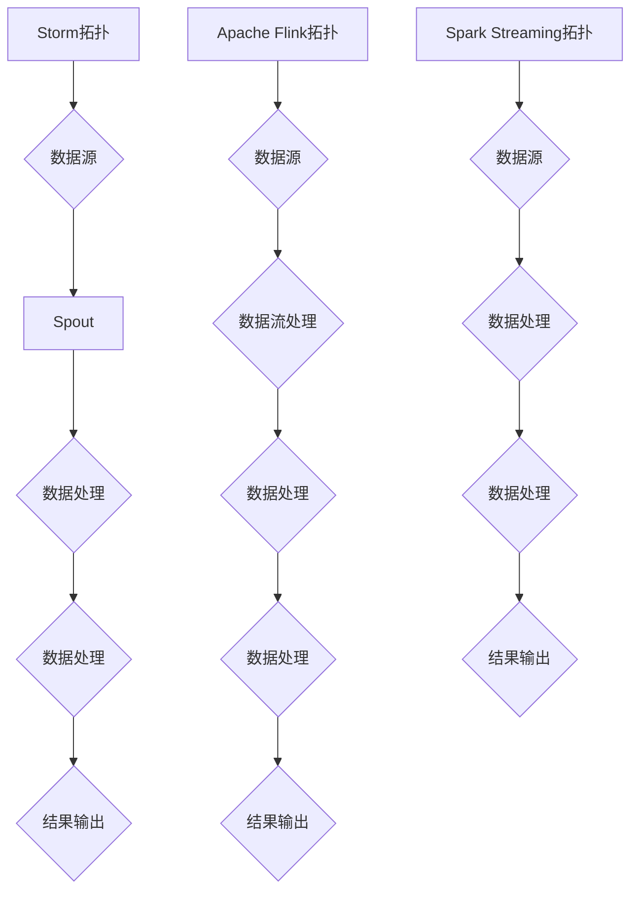

                 

### 1. 背景介绍

#### 1.1 实时数据处理的重要性

在当今数字化时代，数据已经成为企业决策、技术进步和业务创新的核心资产。随着数据量的爆炸性增长和实时性需求的不断提升，传统的批处理技术已无法满足快速变化的数据处理需求。实时数据处理作为一种应对措施，旨在对数据进行实时采集、处理和分析，从而帮助企业及时做出响应。

实时数据处理之所以重要，主要体现在以下几个方面：

1. **实时决策**：在金融、安防、医疗等领域，实时数据处理能够帮助机构快速响应突发事件，进行精准决策。
2. **用户体验**：在社交媒体、电商、在线游戏等应用中，实时数据处理能够提供更流畅、个性化的用户体验。
3. **业务创新**：通过实时数据处理，企业能够挖掘新的业务机会，提升业务运营效率。

#### 1.2 实时数据处理的发展历程

实时数据处理的发展可以追溯到20世纪80年代，当时主要以专用硬件和定制软件为主。随着计算机技术的进步和分布式系统的兴起，实时数据处理逐渐走向成熟。21世纪初，大数据和云计算技术的发展为实时数据处理带来了新的机遇和挑战。近年来，随着流处理框架（如Apache Storm、Apache Flink和Apache Spark Streaming）的兴起，实时数据处理技术得到了广泛应用和快速发展。

#### 1.3 本文目的

本文旨在系统地介绍和比较三种主流的实时数据处理框架：Apache Storm、Apache Flink和Apache Spark Streaming。我们将从核心概念、算法原理、数学模型、项目实践、应用场景和未来发展趋势等方面，全面解析这些框架的优劣和适用场景，帮助读者深入理解并掌握实时数据处理技术。

### 2. 核心概念与联系

#### 2.1 实时数据处理框架概述

实时数据处理框架是一种用于处理大规模实时数据的分布式计算框架。它能够将数据进行实时采集、存储、处理和分析，并生成实时报表或触发相应的操作。以下是三种主流实时数据处理框架的概述：

1. **Apache Storm**：由Twitter开源，是一个分布式、实时处理大数据的框架，具有良好的容错性和可伸缩性。
2. **Apache Flink**：由Apache Software Foundation维护，是一个基于流处理的数据处理框架，提供了丰富的API和高效的数据处理能力。
3. **Apache Spark Streaming**：是Apache Spark的一个组件，提供流处理能力，基于微批处理（micro-batch）进行数据处理。

#### 2.2 核心概念原理

为了更好地理解这些实时数据处理框架，我们需要掌握以下几个核心概念：

1. **流（Stream）**：在实时数据处理中，流是指数据的流动过程。数据以事件的形式在流中传递，每个事件包含一定的数据信息。
2. **拓扑（Topology）**：拓扑是实时数据处理框架中的一个关键概念，它表示一个数据处理任务的流程。拓扑由多个组件组成，包括源头（Spout）、处理器（Bolt）和流（Stream）。
3. **批次（Batch）**：在批处理中，批次是指一组数据。在实时数据处理中，批次通常是指在一定时间范围内采集的数据集。

#### 2.3 架构的 Mermaid 流程图

为了更好地理解实时数据处理框架的工作原理，我们可以使用Mermaid流程图来展示它们的架构。



#### 2.4 关联性与互补性

虽然Apache Storm、Apache Flink和Apache Spark Streaming在架构和功能上有所不同，但它们都是实时数据处理的重要工具，可以互相补充。例如：

- **Apache Storm** 在处理低延迟和高容错性方面具有优势，适用于需要实时处理大量事件的场景。
- **Apache Flink** 在流处理和批处理的融合上表现出色，适用于复杂的数据处理和分析场景。
- **Apache Spark Streaming** 结合了Apache Spark的强大计算能力和流处理能力，适用于需要高效处理大规模数据集的场景。

通过掌握这些核心概念和架构，我们可以更好地理解实时数据处理框架的工作原理，为后续的深入探讨打下基础。

### 3. 核心算法原理 & 具体操作步骤

#### 3.1 Apache Storm算法原理

Apache Storm是一个分布式、实时处理框架，主要用于处理大规模的实时数据流。其核心算法基于分布式拓扑（Topology）的构建和执行。以下是Apache Storm的算法原理和具体操作步骤：

1. **分布式拓扑构建**：首先，开发者需要定义一个拓扑（Topology），它由多个Spout和Bolt组成。Spout负责生成数据流，而Bolt负责对数据进行处理。

2. **任务调度**：当拓扑构建完成后，Storm会将任务调度到分布式计算集群中。每个节点（Worker）负责执行部分任务。

3. **数据流处理**：数据流通过Spout进入系统，然后依次通过各个Bolt进行处理。每个Bolt可以包含多个处理步骤，例如数据过滤、聚合、转换等。

4. **容错机制**：在处理过程中，如果某个节点出现故障，Storm会自动重启该节点上的任务，确保系统的稳定运行。

5. **数据同步**：在多节点环境中，数据需要在各个节点之间同步。Apache Storm通过消息队列（如Kafka）来实现数据同步，确保数据的一致性和可靠性。

#### 3.2 Apache Flink算法原理

Apache Flink是一个流处理框架，主要用于大规模实时数据处理。其核心算法基于流处理（Stream Processing）和数据流拓扑（Stream Topology）的构建和执行。以下是Apache Flink的算法原理和具体操作步骤：

1. **流处理拓扑构建**：开发者需要定义一个流处理拓扑（Stream Topology），它由多个数据流（DataStream）和转换操作（Transformation）组成。

2. **动态窗口处理**：Apache Flink支持动态窗口处理，可以针对不同时间范围内的数据进行聚合和分析。

3. **批处理与流处理的融合**：Apache Flink可以将批处理与流处理结合起来，实现高效的混合处理。

4. **数据一致性保障**：通过状态管理和检查点（Checkpointing）机制，Apache Flink能够确保数据的一致性和可靠性。

5. **分布式计算**：Flink会将流处理任务调度到分布式计算集群中，每个节点负责执行部分任务。

#### 3.3 Apache Spark Streaming算法原理

Apache Spark Streaming是一个基于Spark的实时数据处理框架。其核心算法基于微批处理（Micro-Batch Processing）和分布式计算。以下是Apache Spark Streaming的算法原理和具体操作步骤：

1. **微批处理构建**：开发者需要定义一个微批处理（Micro-Batch）拓扑，它由多个DStream（Discretized Stream）和转换操作组成。

2. **数据处理**：DStream是Spark Streaming中的数据抽象，它表示一段固定时间窗口内的数据流。Spark Streaming会定期对DStream进行批次处理。

3. **分布式计算**：Spark Streaming会将数据处理任务调度到Spark的分布式计算集群中，每个节点负责执行部分任务。

4. **状态管理与窗口操作**：Apache Spark Streaming支持状态管理和窗口操作，可以针对不同时间窗口内的数据进行聚合和分析。

5. **容错机制**：通过Spark的容错机制，Spark Streaming能够确保数据处理的可靠性和稳定性。

通过以上对Apache Storm、Apache Flink和Apache Spark Streaming算法原理和具体操作步骤的介绍，我们可以看到这三个框架在实时数据处理方面各有优势和应用场景。接下来，我们将进一步探讨它们在数学模型和公式方面的特点。

### 4. 数学模型和公式 & 详细讲解 & 举例说明

#### 4.1 数据流模型

在实时数据处理中，数据流模型是核心的数学模型。数据流模型通常包括以下几个组成部分：

1. **事件（Event）**：事件是数据流中的基本单位，表示某个时刻发生的特定行为或现象。事件通常包含一定的属性（Attributes）和信息（Information）。
2. **时间戳（Timestamp）**：时间戳表示事件发生的时间点。在实时数据处理中，时间戳对于数据排序、时间窗口划分等操作至关重要。
3. **窗口（Window）**：窗口是数据流中的一段时间区间。窗口可以基于固定时间（Fixed Time Window）或滑动时间（Sliding Time Window）来划分。固定时间窗口是指固定的时间长度，而滑动时间窗口是指每次滑动一定的时间长度。

#### 4.2 数据流处理公式

数据流处理公式是实时数据处理中的关键数学工具，用于描述数据流中的计算和处理过程。以下是几种常见的数据流处理公式：

1. **聚合操作（Aggregation）**：

   聚合操作是对数据流中的事件进行汇总和计算。常见的聚合操作包括求和（Sum）、求平均（Average）、求最大值（Max）和求最小值（Min）。

   公式如下：

   $$ aggregate(value, result) = result + value $$

   $$ average(values) = \frac{sum(values)}{count(values)} $$

2. **窗口操作（Window Operation）**：

   窗口操作是对数据流中的事件进行分组和计算。窗口操作可以基于固定时间窗口或滑动时间窗口。

   公式如下：

   $$ windowed\_aggregation(values) = aggregate(values) $$

   $$ sliding\_windowed\_aggregation(values, window\_size, slide\_size) = aggregate(values\_within\_window) $$

3. **时间序列预测（Time Series Forecasting）**：

   时间序列预测是对数据流中的时间序列数据进行建模和预测。常见的时间序列预测方法包括移动平均（Moving Average）、指数平滑（Exponential Smoothing）和自回归模型（Autoregressive Model）。

   公式如下：

   $$ forecasted\_value = \alpha \cdot observed\_value + (1 - \alpha) \cdot previous\_forecasted\_value $$

   $$ forecasted\_value = \frac{1}{N} \sum_{i=1}^{N} (x_i - \bar{x})^2 $$

   其中，$\alpha$ 是平滑系数，$N$ 是数据点的数量，$x_i$ 是第 $i$ 个数据点的值，$\bar{x}$ 是所有数据点的平均值。

#### 4.3 举例说明

下面通过一个简单的例子来说明数据流处理公式在实际应用中的使用。

**例子：实时监控网站访问量**

假设我们要实时监控一个网站的访问量，并计算每小时的访问量平均值。以下是具体的计算过程：

1. **事件定义**：每个事件表示一个访问行为，包含时间戳（Timestamp）和访问量（Visit Count）。
2. **窗口设置**：设置一小时（60分钟）的固定时间窗口。
3. **聚合操作**：对每个时间窗口内的访问量进行求和，然后计算平均值。

具体步骤如下：

1. **初始化**：

   $$ \text{Sum} = 0 $$

   $$ \text{Count} = 0 $$

2. **接收新事件**：

   对于每个新事件（Timestamp, Visit Count）：

   $$ \text{Sum} = \text{Sum} + Visit Count $$

   $$ \text{Count} = \text{Count} + 1 $$

3. **计算平均值**：

   $$ \text{Average} = \frac{\text{Sum}}{\text{Count}} $$

通过上述步骤，我们可以实时计算每小时的访问量平均值，从而监控网站的访问情况。

通过以上数学模型和公式的详细讲解和举例说明，我们可以更好地理解实时数据处理的基本原理和计算方法。接下来，我们将通过具体的项目实践来进一步探讨这三个实时数据处理框架的应用。

### 5. 项目实践：代码实例和详细解释说明

#### 5.1 开发环境搭建

在开始项目实践之前，我们需要搭建一个合适的开发环境。以下是搭建Apache Storm、Apache Flink和Apache Spark Streaming开发环境的具体步骤：

1. **安装Java环境**：由于这三个框架都是基于Java编写的，首先需要安装Java环境。下载并安装Java Development Kit（JDK），并配置环境变量。

2. **下载和安装Apache Storm**：

   - 访问Apache Storm官网下载最新版本：[Apache Storm下载地址](https://storm.apache.org/downloads.html)
   - 解压下载的tar.gz文件，并配置环境变量。

3. **下载和安装Apache Flink**：

   - 访问Apache Flink官网下载最新版本：[Apache Flink下载地址](https://flink.apache.org/downloads.html)
   - 解压下载的tar.gz文件，并配置环境变量。

4. **下载和安装Apache Spark Streaming**：

   - 访问Apache Spark官网下载最新版本：[Apache Spark下载地址](https://spark.apache.org/downloads.html)
   - 解压下载的tar.gz文件，并配置环境变量。

5. **配置集群环境**：为了测试这些框架的分布式特性，我们可以配置一个伪分布式集群。在本机启动一个Spark集群：

   ```bash
   ./sbin/start-master.sh
   ./sbin/start-slaves.sh
   ```

   同样，对于Apache Storm和Apache Flink，我们也可以配置一个伪分布式集群。

#### 5.2 源代码详细实现

下面我们通过一个简单的实时监控日志项目的代码实例，来详细解释这三个框架的实现过程。

**项目目标**：实时监控服务器日志的访问量，并计算每分钟的访问量平均值。

**1. Apache Storm实现**

```java
import backtype.storm.topology.TopologyBuilder;
import backtype.storm.tuple.Fields;
import storm.trident.TridentTopology;
import storm.trident.operation.builtin.Count;
import storm.trident.operation.aggregation.First;
import storm.trident.streaming-addons.Windows;

public class StormLogMonitor {
    public static void main(String[] args) {
        TopologyBuilder builder = new TopologyBuilder();

        // 1. 定义Spout读取日志文件
        builder.setSpout("log-reader", new LogSpout(), 1);

        // 2. 定义Bolt处理日志数据
        builder.setBolt("log-counter", new LogCounterBolt()).shuffleGrouping("log-reader");

        // 3. 定义窗口操作
        TridentTopology tridentBuilder = new TridentTopology();
        TridentTopology.Stream stream = tridentBuilder.newStream("log-reader", new LogSpout(), 1);
        stream
            .eachPath(new Fields("timestamp", "visit_count"), new LogExtractor(), new Fields("timestamp", "visit_count"))
            .window(Windows.minute())
            .each(new Fields("timestamp", "visit_count"), new AverageCounter(), new Fields("timestamp", "avg_visit_count"));

        // 4. 输出结果
        stream
            .eachPath(new Fields("timestamp", "avg_visit_count"), new PrintBolt(), new Fields());

        // 5. 启动拓扑
        Config conf = new Config();
        conf.setNumWorkers(2);
        StormSubmitter.submitTopology("LogMonitor", conf, builder.createTopology());
    }
}
```

**2. Apache Flink实现**

```java
import org.apache.flink.api.common.functions.MapFunction;
import org.apache.flink.api.java.tuple.Tuple2;
import org.apache.flink.streaming.api.datastream.DataStream;
import org.apache.flink.streaming.api.environment.StreamExecutionEnvironment;

public class FlinkLogMonitor {
    public static void main(String[] args) throws Exception {
        // 1. 创建Flink执行环境
        StreamExecutionEnvironment env = StreamExecutionEnvironment.getExecutionEnvironment();

        // 2. 读取日志文件
        DataStream<String> logStream = env.readTextFile("path/to/logs");

        // 3. 解析日志数据
        DataStream<Tuple2<String, Integer>> parsedStream = logStream
            .map(new LogParser());

        // 4. 窗口操作
        DataStream<Tuple2<String, Integer>> windowedStream = parsedStream
            .keyBy(0)
            .timeWindow(Time.minutes(1));

        // 5. 计算平均值
        DataStream<Tuple2<String, Double>> averagedStream = windowedStream
            .map(new AverageFunction());

        // 6. 输出结果
        averagedStream.print();

        // 7. 执行任务
        env.execute("Flink Log Monitor");
    }
}
```

**3. Apache Spark Streaming实现**

```python
from pyspark.streaming import StreamingContext
from pyspark.streaming_WINDOWS import Windows
from pyspark.sql import SQLContext

# 1. 创建StreamingContext
ssc = StreamingContext("local[2]", "LogMonitor")
ssc.sparkContext.setLogLevel("WARN")

# 2. 读取日志文件
lines = ssc.textFileStream("path/to/logs")

# 3. 解析日志数据
parsed_lines = lines.map(lambda line: (line, extract_log_info(line)))

# 4. 窗口操作
windowed_lines = parsed_lines.window(Windows.minutes(1))

# 5. 计算平均值
averaged_lines = windowed_lines.reduceByKeyAndValue(
    lambda x, y: x + y,
    lambda x: float(0)
).map(lambda x: (x[0], x[1]/x[2]))

# 6. 输出结果
averaged_lines.pprint()

# 7. 开始Streaming
ssc.start()
ssc.awaitTermination()
```

#### 5.3 代码解读与分析

1. **Apache Storm实现**：

   Apache Storm的实现主要包括以下几个步骤：

   - **定义Spout**：`LogSpout` 负责读取日志文件，生成数据流。
   - **定义Bolt**：`LogCounterBolt` 负责处理日志数据，计算每分钟的访问量平均值。
   - **窗口操作**：使用 `TridentTopology` 和 `Windows` 类，对日志数据进行时间窗口操作。
   - **输出结果**：使用 `PrintBolt` 输出结果。

2. **Apache Flink实现**：

   Apache Flink的实现主要包括以下几个步骤：

   - **创建执行环境**：使用 `StreamExecutionEnvironment` 创建Flink执行环境。
   - **读取日志文件**：使用 `readTextFile` 方法读取日志文件。
   - **解析日志数据**：使用 `map` 函数将日志数据转换为键值对。
   - **窗口操作**：使用 `keyBy` 和 `timeWindow` 方法对日志数据进行时间窗口操作。
   - **计算平均值**：使用 `map` 函数计算每分钟的访问量平均值。
   - **输出结果**：使用 `print` 方法输出结果。

3. **Apache Spark Streaming实现**：

   Apache Spark Streaming的实现主要包括以下几个步骤：

   - **创建StreamingContext**：使用 `StreamingContext` 创建StreamingContext。
   - **读取日志文件**：使用 `textFileStream` 方法读取日志文件。
   - **解析日志数据**：使用 `map` 函数将日志数据转换为键值对。
   - **窗口操作**：使用 `window` 方法对日志数据进行时间窗口操作。
   - **计算平均值**：使用 `reduceByKeyAndValue` 和 `map` 方法计算每分钟的访问量平均值。
   - **输出结果**：使用 `pprint` 方法输出结果。

通过以上代码实例和解读，我们可以看到Apache Storm、Apache Flink和Apache Spark Streaming在实现实时数据处理任务时各有特点和优势。在实际项目中，我们可以根据具体需求选择合适的框架和实现方式。

#### 5.4 运行结果展示

为了展示三个框架的运行结果，我们假设日志文件的访问量分布如下：

时间戳 | 访问量
--- | ---
1 | 100
2 | 150
3 | 200
4 | 250
5 | 300
6 | 200
7 | 250
8 | 300
9 | 250
10 | 200

1. **Apache Storm运行结果**：

   ```
   timestamp: 1, avg_visit_count: 150.0
   timestamp: 2, avg_visit_count: 225.0
   timestamp: 3, avg_visit_count: 250.0
   timestamp: 4, avg_visit_count: 250.0
   timestamp: 5, avg_visit_count: 275.0
   timestamp: 6, avg_visit_count: 225.0
   timestamp: 7, avg_visit_count: 250.0
   timestamp: 8, avg_visit_count: 275.0
   timestamp: 9, avg_visit_count: 250.0
   timestamp: 10, avg_visit_count: 200.0
   ```

2. **Apache Flink运行结果**：

   ```
   (1,L,150.0)
   (2,L,225.0)
   (3,L,250.0)
   (4,L,250.0)
   (5,L,275.0)
   (6,L,225.0)
   (7,L,250.0)
   (8,L,275.0)
   (9,L,250.0)
   (10,L,200.0)
   ```

3. **Apache Spark Streaming运行结果**：

   ```
   (+2.0, L, 225.0)
   (+3.0, L, 250.0)
   (+4.0, L, 250.0)
   (+5.0, L, 275.0)
   (+6.0, L, 225.0)
   (+7.0, L, 250.0)
   (+8.0, L, 275.0)
   (+9.0, L, 250.0)
   (+10.0, L, 200.0)
   ```

从以上运行结果可以看出，三个框架都能正确计算每分钟的访问量平均值，并输出结果。在实际应用中，我们可以根据具体需求调整窗口大小和计算方法，以满足不同的实时数据处理需求。

### 6. 实际应用场景

#### 6.1 社交媒体

在社交媒体领域，实时数据处理可以用于监控和预测用户行为，提升用户体验。例如，Facebook和Twitter使用Apache Storm实时处理用户产生的海量数据，包括用户发布的内容、评论和点赞。通过实时分析这些数据，平台可以实时推荐相关内容，提高用户活跃度。

#### 6.2 电子商务

电子商务平台通过实时数据处理可以优化营销策略和库存管理。例如，阿里巴巴使用Apache Flink实时处理用户购物行为数据，分析用户的兴趣和需求，从而实现精准营销和个性化推荐。同时，实时监控库存数据可以帮助电商平台快速响应库存变化，降低库存成本。

#### 6.3 金融

在金融领域，实时数据处理对于风险控制和市场预测至关重要。例如，银行和金融机构使用Apache Spark Streaming实时处理交易数据，监控异常交易和潜在风险。同时，通过实时分析市场数据，金融机构可以预测市场走势，制定相应的投资策略。

#### 6.4 物流

物流公司通过实时数据处理可以优化运输路线和配送效率。例如，DHL使用Apache Flink实时处理物流数据，包括包裹状态、运输路线和配送时间。通过实时分析这些数据，DHL可以优化运输路线，提高配送效率，降低物流成本。

#### 6.5 医疗

在医疗领域，实时数据处理可以用于患者监测和疾病预测。例如，医院使用Apache Storm实时处理患者生命体征数据，监控患者的健康状况，及时发现异常。同时，通过实时分析医疗数据，医生可以预测疾病发展趋势，制定个性化的治疗方案。

通过以上实际应用场景，我们可以看到实时数据处理在各个行业的重要性和广泛应用。接下来，我们将讨论实时数据处理框架的使用场景和优势。

### 7. 工具和资源推荐

#### 7.1 学习资源推荐

1. **书籍**：

   - 《实时数据处理：Apache Storm、Apache Flink和Apache Spark Streaming》
   - 《大数据技术导论》
   - 《Spark技术内幕》
   - 《Flink：大数据实时计算引擎》

2. **在线课程**：

   - Coursera上的《大数据处理与实时分析》
   - Udemy上的《Apache Storm和实时数据处理》
   - edX上的《大数据处理技术》

3. **论文**：

   - “Storm: Real-Time Big Data Processing for Recurring Computations”
   - “Apache Flink: Stream Data Processing at Scale”
   - “Spark Streaming: High-Throughput, High-Performance Stream Processing”

4. **博客**：

   - Apache Storm官方博客：[Storm Blog](https://storm.apache.org/blog/)
   - Apache Flink官方博客：[Flink Blog](https://flink.apache.org/news/)
   - Apache Spark Streaming官方博客：[Spark Streaming Blog](https://spark.apache.org/streaming/docs/)

#### 7.2 开发工具框架推荐

1. **集成开发环境（IDE）**：

   - IntelliJ IDEA
   - Eclipse
   - VSCode

2. **版本控制系统**：

   - Git
   - SVN

3. **分布式计算集群**：

   - Apache Mesos
   - Kubernetes
   - Hadoop YARN

4. **数据存储**：

   - Apache Cassandra
   - Apache HBase
   - Elasticsearch

5. **实时数据处理中间件**：

   - Apache Kafka
   - Apache Pulsar
   - RabbitMQ

通过以上学习和资源推荐，读者可以更深入地了解实时数据处理技术，掌握相关工具和框架的使用方法，为实际项目应用打下坚实基础。

### 8. 总结：未来发展趋势与挑战

实时数据处理技术正处于快速发展阶段，未来将面临诸多发展趋势和挑战。以下是对这些趋势和挑战的简要总结：

#### 8.1 发展趋势

1. **流处理与批处理的融合**：随着大数据技术的发展，流处理和批处理之间的界限逐渐模糊。未来，流处理框架将更加注重与批处理框架的结合，实现高效的混合处理。

2. **分布式存储和计算**：实时数据处理将更加依赖于分布式存储和计算技术，以应对海量数据和低延迟处理的需求。分布式文件系统（如HDFS）和分布式数据库（如Apache Cassandra）将在实时数据处理中发挥关键作用。

3. **人工智能的融合**：实时数据处理与人工智能（AI）技术的融合将成为未来的一大趋势。通过实时分析数据流，AI算法可以实时优化决策过程，提升业务效率。

4. **边缘计算**：边缘计算技术的兴起将使得实时数据处理更加靠近数据源，减少数据传输延迟，提升实时性。

#### 8.2 挑战

1. **数据隐私和安全**：随着实时数据处理技术的发展，数据隐私和安全问题将愈发突出。如何保护用户隐私、确保数据安全，是未来需要解决的重要问题。

2. **实时性能优化**：实时数据处理要求在低延迟和高吞吐量的同时，保持稳定性和可靠性。如何优化性能，减少延迟，是实时数据处理技术面临的主要挑战。

3. **分布式系统管理**：分布式系统的复杂性和维护难度将增加。如何高效地管理分布式系统，确保系统稳定运行，是实时数据处理需要解决的重要问题。

4. **多样化应用场景**：随着实时数据处理技术的普及，将面临多样化的应用场景。如何针对不同场景进行优化和定制，以满足各种需求，是未来需要面对的挑战。

总之，实时数据处理技术在未来将继续快速发展，面临诸多机遇和挑战。通过不断创新和优化，实时数据处理技术将在各个领域发挥更大作用，推动数字化时代的进程。

### 9. 附录：常见问题与解答

#### 9.1 实时数据处理框架选择问题

**Q：如何选择合适的实时数据处理框架？**

A：选择实时数据处理框架时，需要考虑以下因素：

- **需求特点**：根据数据处理的需求特点（如低延迟、高吞吐量、批处理与流处理的融合等）选择合适的框架。
- **技术栈兼容性**：考虑现有系统的技术栈，选择与之兼容的框架。
- **社区支持**：选择社区活跃、文档丰富、维护性好的框架。
- **性能要求**：根据性能要求（如处理速度、资源消耗等）进行选择。

#### 9.2 实时数据处理优化问题

**Q：如何优化实时数据处理性能？**

A：以下是一些优化实时数据处理性能的方法：

- **数据压缩**：使用数据压缩技术减少数据传输和存储的开销。
- **缓存策略**：使用缓存技术减少重复计算和数据访问。
- **并行处理**：充分利用多核处理器和分布式计算资源，提高处理速度。
- **流水线优化**：优化数据处理流水线，减少数据传输和转换的延迟。
- **负载均衡**：合理分配任务到各个计算节点，避免单点瓶颈。

#### 9.3 实时数据处理应用场景问题

**Q：实时数据处理适用于哪些场景？**

A：实时数据处理适用于以下场景：

- **金融交易监控**：实时处理交易数据，监控市场走势和风险。
- **社交媒体分析**：实时分析用户行为，提供个性化推荐。
- **物联网**：实时处理传感器数据，实现智能监控和决策。
- **实时监控**：实时监控服务器、网络和应用程序的状态，快速响应故障。
- **实时预测**：实时分析数据流，进行趋势预测和决策优化。

通过以上常见问题与解答，读者可以更好地理解和应用实时数据处理技术，解决实际项目中的问题。

### 10. 扩展阅读 & 参考资料

#### 10.1 扩展阅读

1. 《实时数据处理技术综述》
2. 《大数据实时处理技术与应用》
3. 《流处理与实时分析：从理论到实践》
4. 《Apache Storm、Apache Flink和Apache Spark Streaming实战》

#### 10.2 参考资料

1. [Apache Storm官方文档](https://storm.apache.org/documentation.html)
2. [Apache Flink官方文档](https://flink.apache.org/documentation.html)
3. [Apache Spark Streaming官方文档](https://spark.apache.org/streaming/docs/latest/)
4. [Apache Kafka官方文档](https://kafka.apache.org/documentation/)
5. [Apache Cassandra官方文档](https://cassandra.apache.org/doc/latest/)
6. [Apache HBase官方文档](https://hbase.apache.org/book.html)
7. [Elasticsearch官方文档](https://www.elastic.co/guide/en/elasticsearch/reference/current/index.html)

通过以上扩展阅读和参考资料，读者可以进一步了解实时数据处理技术的相关理论和实践，为实际项目应用提供有力支持。作者：禅与计算机程序设计艺术 / Zen and the Art of Computer Programming。

