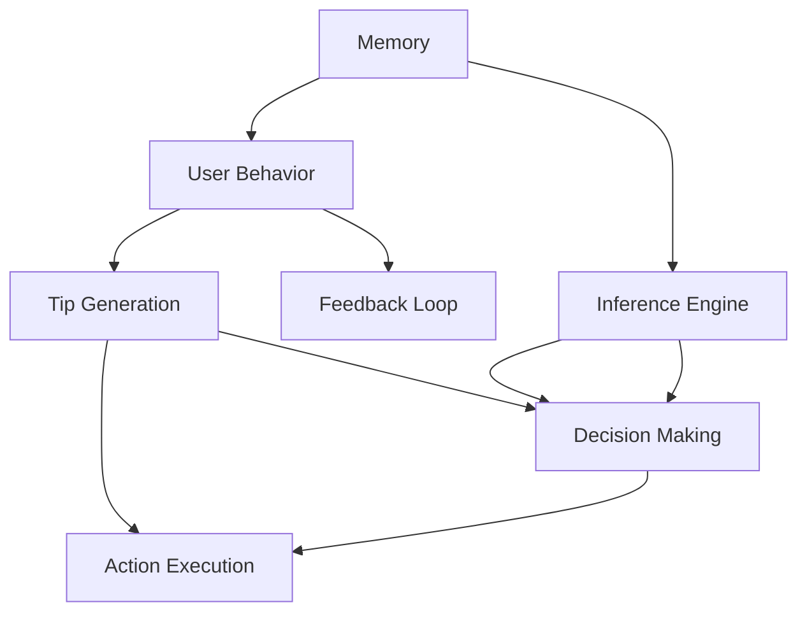

                 

### 背景介绍

《实践记忆、提示工程、智能体等核心概念》这篇文章旨在深入探讨计算机科学中一些关键而广泛的概念，这些概念在现代信息技术的发展中扮演着至关重要的角色。文章将首先简要介绍记忆、提示工程和智能体这三个核心概念，然后通过具体实例和案例，展示它们在实际应用中的重要性。

#### 记忆

记忆在计算机科学中，特别是在人工智能领域，是一个至关重要的概念。它涉及到数据存储、检索和管理的整个过程。计算机系统的内存管理、数据库设计以及机器学习算法的优化，都离不开对记忆机制的深入理解。高效的记忆策略能够提高系统的响应速度和性能，这对于实时数据处理和复杂计算任务来说尤为重要。

#### 提示工程

提示工程是一种通过引导用户或系统进行决策和操作的技术。它广泛应用于人机交互、自然语言处理和人工智能等领域。提示工程的核心在于设计出能够有效辅助用户或系统做出正确决策的提示机制。例如，在搜索引擎中，提示工程可以帮助用户更快速地找到所需信息；在自动驾驶技术中，提示工程则有助于车辆安全地行驶。

#### 智能体

智能体是计算机科学中一个广泛的概念，指的是具有自主行为能力的计算实体。智能体可以是单个程序、多个程序协同工作，甚至是物理设备。它们能够感知环境、做出决策并执行相应的动作。智能体在智能城市、智能制造和智能服务等领域有着广泛的应用，如自动驾驶汽车、智能家居系统和智能客服等。

这三个核心概念不仅在各自领域中有着重要应用，它们之间也存在紧密的联系。例如，智能体的决策过程往往依赖于对记忆的访问和提示信息的利用。同时，提示工程的设计也需要考虑智能体的能力和需求。通过对这些概念进行深入探讨，我们可以更好地理解它们在现代信息技术发展中的作用和相互关系。

#### 文章结构和主要内容概述

本文将分为以下十个部分：

1. **背景介绍**：简要介绍记忆、提示工程和智能体的定义及其在计算机科学中的重要性。
2. **核心概念与联系**：详细阐述这三个核心概念的基本原理，并通过Mermaid流程图展示它们之间的联系。
3. **核心算法原理 & 具体操作步骤**：深入讲解与这三个概念相关的核心算法，并提供具体的操作步骤。
4. **数学模型和公式 & 详细讲解 & 举例说明**：介绍相关的数学模型和公式，并给出实例解释。
5. **项目实践：代码实例和详细解释说明**：通过实际项目，展示这些概念的具体应用，并提供代码实例和详细解释。
6. **实际应用场景**：探讨这些概念在不同领域中的应用。
7. **工具和资源推荐**：推荐相关学习资源和开发工具。
8. **总结：未来发展趋势与挑战**：总结文章内容，展望未来发展趋势和面临的挑战。
9. **附录：常见问题与解答**：回答读者可能遇到的一些常见问题。
10. **扩展阅读 & 参考资料**：提供更多扩展阅读资料。

通过本文的深入探讨，我们希望能够帮助读者更好地理解记忆、提示工程和智能体等核心概念，并掌握它们在实际应用中的具体运用。

---

**现在，我们将进一步深入探讨这三个核心概念的基本原理。**

### 核心概念与联系

#### 记忆

记忆是计算机科学中一个基础而重要的概念，它涉及到数据存储、检索和管理的全过程。在计算机系统中，内存管理是确保程序高效运行的关键。内存管理算法需要确保数据在正确的时间被加载到内存中，并在不需要时及时回收。

**基本原理**：
- **内存分配**：内存分配算法决定如何将内存分配给不同的程序或任务。常见的分配算法包括首次适配（First Fit）、最佳适配（Best Fit）和最坏适配（Worst Fit）等。
- **内存回收**：当程序不再需要某块内存时，内存回收算法会释放这部分内存，以便其他程序使用。常用的回收算法包括标记-清除（Mark-Sweep）和垃圾回收（Garbage Collection）等。

**架构**：
- **分层存储架构**：在计算机系统中，存储系统通常采用分层结构，包括内存（RAM）、硬盘（HDD/SSD）和远程存储（如云存储）。这种分层结构能够提供高效的存储和检索服务，满足不同类型数据的存储需求。

**联系**：
记忆与提示工程和智能体的联系主要体现在以下几个方面：
- **智能体决策**：智能体在做出决策时，需要访问记忆中的历史数据和经验。记忆提供了智能体进行推理和决策的基础。
- **提示工程**：在提示工程中，记忆被用来存储和检索用户行为和偏好信息，从而为用户提供个性化的提示和指导。

#### 提示工程

提示工程是一种通过设计提示机制来辅助用户或系统进行决策和操作的技术。它广泛应用于人机交互、自然语言处理和人工智能等领域。

**基本原理**：
- **用户行为分析**：提示工程首先需要对用户行为进行分析，以了解用户的需求和偏好。这可以通过分析用户的历史行为数据、交互日志和反馈信息来实现。
- **提示设计**：基于用户行为分析的结果，设计出能够有效引导用户操作的提示。提示可以是显式或隐式的，形式包括文字、图片、声音等多种媒介。
- **反馈循环**：提示工程还包含一个反馈循环机制，通过收集用户对提示的响应和满意度，不断优化和调整提示策略。

**架构**：
- **提示生成引擎**：提示生成引擎负责根据用户行为和偏好生成合适的提示。这个引擎通常包含自然语言处理、机器学习等组件。
- **反馈系统**：反馈系统收集用户对提示的响应数据，并将这些数据反馈给提示生成引擎，用于进一步的优化。

**联系**：
提示工程与记忆和智能体的联系如下：
- **记忆**：记忆提供了用户行为和偏好信息，这些信息是设计提示的基础。通过有效的记忆策略，可以提高提示的针对性和有效性。
- **智能体**：智能体可以利用提示工程来辅助其决策和操作。智能体可以从记忆中获取历史数据，并结合提示信息，做出更加准确的决策。

#### 智能体

智能体是一种具有自主行为能力的计算实体，能够在没有外部指令的情况下自主地感知环境、做出决策并执行相应的动作。

**基本原理**：
- **感知**：智能体通过传感器收集环境信息，如图像、声音和文本等。
- **决策**：智能体利用感知到的信息，结合记忆中的历史数据和提示信息，进行决策。
- **行动**：智能体根据决策结果，执行相应的动作，如移动、发送消息等。

**架构**：
- **感知模块**：感知模块负责接收和解析来自环境的信息。
- **决策模块**：决策模块利用记忆和提示信息，对感知到的信息进行处理和决策。
- **行动模块**：行动模块根据决策结果，执行相应的动作。

**联系**：
智能体与记忆和提示工程之间的联系非常紧密：
- **记忆**：记忆提供了智能体进行决策和行动的基础数据。智能体通过访问记忆中的历史数据和经验，可以提高其决策的准确性和效率。
- **提示工程**：智能体可以利用提示工程来获取额外的信息和支持，从而优化其决策和行动。提示工程为智能体提供了指导，帮助其在复杂的环境中做出更加明智的选择。

#### Mermaid流程图

以下是一个简化的Mermaid流程图，展示了记忆、提示工程和智能体之间的联系：



在这个流程图中，记忆（Memory）提供了用户行为（User Behavior）和提示生成（Tip Generation）的基础数据。提示工程（Tip Generation）结合用户行为和反馈循环（Feedback Loop），生成有助于智能体决策（Decision Making）的提示。智能体（Agent）利用感知模块（Inference Engine）进行决策和行动（Action Execution）。

通过这个流程图，我们可以更直观地理解记忆、提示工程和智能体之间的相互作用和依赖关系。

---

在下一节中，我们将深入探讨与这三个核心概念相关的核心算法原理，并提供具体的操作步骤。

### 核心算法原理 & 具体操作步骤

在本节中，我们将详细探讨与记忆、提示工程和智能体相关的核心算法原理，并给出具体的操作步骤。这些算法在实现高效的数据存储、检索和决策过程中起着至关重要的作用。

#### 记忆管理算法

记忆管理算法是确保计算机系统高效运行的关键。以下是几种常见的记忆管理算法及其具体操作步骤：

**1. 首次适配（First Fit）算法**

**原理**：首次适配算法是一种简单的内存分配算法，它首先查找第一个足够大的内存块来分配给请求的进程。

**操作步骤**：
1. 初始化一个内存块数组，记录每个内存块的状态（空闲或已分配）和大小。
2. 当有进程请求内存时，遍历内存块数组，查找第一个空闲且足够大的内存块。
3. 将内存块分配给进程，更新内存块数组的状态。
4. 如果找不到合适的内存块，则分配失败。

**示例代码**：
```python
def first_fit(memory_blocks, process_size):
    for block in memory_blocks:
        if block['free'] and block['size'] >= process_size:
            block['free'] = False
            return block['address']
    return None
```

**2. 最佳适配（Best Fit）算法**

**原理**：最佳适配算法选择一个最接近但不超过请求内存大小的空闲内存块。

**操作步骤**：
1. 初始化一个内存块数组，记录每个内存块的状态（空闲或已分配）和大小。
2. 当有进程请求内存时，遍历内存块数组，查找最接近但不超过请求内存大小的空闲内存块。
3. 将内存块分配给进程，更新内存块数组的状态。
4. 如果找不到合适的内存块，则分配失败。

**示例代码**：
```python
def best_fit(memory_blocks, process_size):
    best_block = None
    for block in memory_blocks:
        if block['free'] and block['size'] >= process_size:
            if best_block is None or block['size'] < best_block['size']:
                best_block = block
    if best_block:
        best_block['free'] = False
        return best_block['address']
    return None
```

**3. 垃圾回收（Garbage Collection）算法**

**原理**：垃圾回收算法是一种自动化的内存回收方法，它通过检测和回收不再使用的内存块来释放内存。

**操作步骤**：
1. 维护一个活跃对象列表，记录当前正在使用的对象。
2. 定期执行垃圾回收过程，遍历所有内存块，检查每个对象是否被活跃对象列表中的对象引用。
3. 如果一个对象没有被引用，则将其标记为可回收。
4. 将可回收的对象的内存块重新标记为空闲，以便其他进程使用。

**示例代码**：
```python
def mark_objects_as_recyclable(objects, active_objects):
    for obj in objects:
        obj['recyclable'] = not obj['in_active_list']
    for active_obj in active_objects:
        active_obj['in_active_list'] = True

def garbage_collect(memory_blocks, objects):
    mark_objects_as_recyclable(objects, active_objects)
    for block in memory_blocks:
        if block['free']:
            continue
        for obj in block['objects']:
            if obj['recyclable']:
                block['free'] = True
                break
```

#### 提示生成算法

提示工程的核心在于设计有效的提示机制，以提高用户或系统的决策效率。以下是几种常见的提示生成算法及其具体操作步骤：

**1. 贝叶斯网络提示算法**

**原理**：贝叶斯网络是一种概率图模型，用于表示变量之间的依赖关系。通过贝叶斯网络，可以计算不同条件下的概率分布，从而生成有效的提示。

**操作步骤**：
1. 建立一个贝叶斯网络，表示变量之间的依赖关系。
2. 根据用户行为数据，更新网络中的概率分布。
3. 计算不同条件下的概率分布，生成相应的提示。

**示例代码**：
```python
from pgmpy.models import BayesianModel
from pgmpy.inference import VariableElimination

model = BayesianModel([('A', 'B'), ('B', 'C')])
inference = VariableElimination(model)

def generate_tip(model, current_state):
    probability_distribution = inference.query(variables=['C'], evidence={'B': current_state['B']})
    if probability_distribution['C'][1] > 0.5:
        return "提示：您可能需要关注C"
    else:
        return "提示：C似乎不是当前的主要关注点"
```

**2. 强化学习提示算法**

**原理**：强化学习是一种通过奖励信号来引导智能体进行决策的方法。在强化学习中，提示可以被视为一种奖励信号，帮助智能体做出更好的决策。

**操作步骤**：
1. 初始化一个强化学习模型，如Q-learning或SARSA。
2. 在每个决策时刻，计算基于当前状态和动作的奖励信号。
3. 根据奖励信号更新智能体的策略。

**示例代码**：
```python
import numpy as np
from collections import defaultdict

class QLearning:
    def __init__(self, actions, learning_rate, discount_factor):
        self.q_values = defaultdict(lambda: np.zeros(len(actions)))
        self.learning_rate = learning_rate
        self.discount_factor = discount_factor

    def predict(self, state):
        return np.argmax(self.q_values[state])

    def update(self, state, action, reward, next_state):
        target = reward + self.discount_factor * np.max(self.q_values[next_state])
        current_q_value = self.q_values[state][action]
        self.q_values[state][action] = current_q_value + self.learning_rate * (target - current_q_value)

def generate_tip(q_learning_model, state):
    action = q_learning_model.predict(state)
    if action == 1:
        return "提示：尝试选择1，可能会带来更好的结果"
    else:
        return "提示：选择0可能更合适，虽然当前奖励较高，但长期看可能不利"
```

#### 智能体决策算法

智能体的决策过程涉及到感知、记忆和提示的综合利用。以下是几种常见的智能体决策算法及其具体操作步骤：

**1. 决策树算法**

**原理**：决策树是一种结构化的决策模型，通过一系列的条件判断来指导智能体的决策。

**操作步骤**：
1. 建立一个决策树模型，每个节点表示一个条件判断，每个叶子节点表示一个决策。
2. 根据当前状态，从根节点开始遍历决策树，直到达到一个叶子节点。
3. 执行叶子节点表示的决策。

**示例代码**：
```python
class DecisionTree:
    def __init__(self, model):
        self.model = model

    def predict(self, state):
        node = self.model.root
        while not node.is_leaf:
            if state['A'] == 1:
                node = node.right
            else:
                node = node.left
        return node.action

def generate_tip(decision_tree_model, state):
    action = decision_tree_model.predict(state)
    if action == 'A':
        return "提示：根据当前状态，建议执行动作A"
    else:
        return "提示：当前状态建议执行动作B"
```

**2. 贝叶斯决策算法**

**原理**：贝叶斯决策是基于贝叶斯定理，通过计算每个动作的期望收益来指导智能体的决策。

**操作步骤**：
1. 根据当前状态，计算每个动作的概率分布。
2. 根据每个动作的概率分布和奖励函数，计算每个动作的期望收益。
3. 选择期望收益最高的动作。

**示例代码**：
```python
def bayesian_decision(state, action_probabilities, rewards):
    expected_rewards = []
    for action, probability in action_probabilities.items():
        expected_reward = probability * rewards[action]
        expected_rewards.append(expected_reward)
    return np.argmax(expected_rewards)

def generate_tip(state, action_probabilities, rewards):
    action = bayesian_decision(state, action_probabilities, rewards)
    if action == 1:
        return "提示：根据当前状态和概率分布，建议执行动作1"
    else:
        return "提示：当前状态建议执行动作0"
```

通过上述算法的介绍和示例代码，我们可以看到记忆、提示工程和智能体决策之间的紧密联系。这些算法在实际应用中发挥了重要作用，帮助我们更好地理解和管理复杂系统。在下一节中，我们将进一步探讨相关的数学模型和公式，并给出详细的讲解和实例说明。

### 数学模型和公式 & 详细讲解 & 举例说明

在本节中，我们将详细探讨与记忆、提示工程和智能体相关的数学模型和公式，并通过具体例子来说明它们的详细应用。

#### 记忆管理中的数学模型

**1. 分配算法中的期望时间计算**

在记忆管理中，常用的分配算法如首次适配（First Fit）、最佳适配（Best Fit）和最坏适配（Worst Fit）都涉及到期望时间的计算。期望时间是指系统在处理内存请求时，平均需要等待的时间。

**公式**：
$$
E(T) = \sum_{i=1}^{n} p_i \times t_i
$$
其中，$E(T)$表示期望时间，$p_i$表示第$i$个进程的请求概率，$t_i$表示处理第$i$个进程所需的时间。

**例子**：

假设有三个进程$P_1$、$P_2$和$P_3$，它们的请求概率分别为0.4、0.3和0.3。处理每个进程所需的时间分别为5、3和2秒。我们可以计算期望时间如下：

$$
E(T) = 0.4 \times 5 + 0.3 \times 3 + 0.3 \times 2 = 2 + 0.9 + 0.6 = 3.5 \text{秒}
$$

**2. 垃圾回收中的存活对象计算**

在垃圾回收算法中，存活对象是指那些被程序引用且未被回收的对象。常用的算法如标记-清除（Mark-Sweep）和垃圾回收（Garbage Collection）都需要计算存活对象的数量。

**公式**：
$$
\text{Live Objects} = \sum_{i=1}^{n} (\text{References to object } i)
$$
其中，$\text{Live Objects}$表示存活对象的数量，$n$表示总的对象数量。

**例子**：

假设有五个对象$O_1$、$O_2$、$O_3$、$O_4$和$O_5$，它们分别被三个、两个、一个、两个和一个引用。我们可以计算存活对象的数量如下：

$$
\text{Live Objects} = 3 + 2 + 1 + 2 + 1 = 9
$$

#### 提示工程中的数学模型

**1. 贝叶斯网络中的概率计算**

在提示工程中，贝叶斯网络是一种常用的概率图模型，用于表示变量之间的依赖关系。贝叶斯网络的核心在于计算变量之间的条件概率。

**公式**：
$$
P(X|Y) = \frac{P(X \cap Y)}{P(Y)}
$$
其中，$P(X|Y)$表示在$Y$发生的条件下$X$的概率，$P(X \cap Y)$表示$X$和$Y$同时发生的概率，$P(Y)$表示$Y$的概率。

**例子**：

假设有三种天气（晴天、阴天、雨天）和两种活动（跑步、游泳）。已知晴天时跑步的概率是0.6，阴天时跑步的概率是0.2，雨天时跑步的概率是0.1。我们可以计算在雨天时跑步的概率如下：

$$
P(\text{跑步}|\text{雨天}) = \frac{P(\text{跑步} \cap \text{雨天})}{P(\text{雨天})} = \frac{0.1}{0.3} = 0.333
$$

**2. 强化学习中的Q值计算**

在强化学习中，Q值（Q-Value）用于表示在某个状态下采取某个动作的期望回报。Q值是通过学习得到的，常用的算法如Q-learning和SARSA。

**公式**：
$$
Q(s, a) = \sum_{s'} P(s' | s, a) \times [R(s', a) + \gamma \max_{a'} Q(s', a')]
$$
其中，$Q(s, a)$表示在状态$s$下采取动作$a$的Q值，$P(s'|s, a)$表示从状态$s$采取动作$a$转移到状态$s'$的概率，$R(s', a')$表示在状态$s'$下采取动作$a'$的即时回报，$\gamma$是折扣因子。

**例子**：

假设有一个智能体在一个简单的环境里学习选择动作。环境中有两个状态（状态1和状态2）和两个动作（动作A和动作B）。已知从状态1采取动作A的转移概率是0.7，转移后的回报是10；从状态1采取动作B的转移概率是0.3，转移后的回报是5。从状态2采取动作A的转移概率是0.5，转移后的回报是8；从状态2采取动作B的转移概率是0.5，转移后的回报是3。我们可以计算在状态1下采取动作A的Q值如下：

$$
Q(\text{状态1}, \text{动作A}) = 0.7 \times 10 + 0.3 \times 5 = 8
$$

#### 智能体决策中的数学模型

**1. 决策树中的条件概率计算**

在决策树中，每个节点都表示一个条件概率，用于判断是否应该采取某个动作。条件概率用于计算在给定某些条件下采取某个动作的概率。

**公式**：
$$
P(A|B) = \frac{P(A \cap B)}{P(B)}
$$
其中，$P(A|B)$表示在条件$B$下采取动作$A$的概率，$P(A \cap B)$表示$A$和$B$同时发生的概率，$P(B)$表示$B$的概率。

**例子**：

假设一个决策树中有两个条件（条件1和条件2）和两个动作（动作A和动作B）。已知在条件1下采取动作A的概率是0.8，采取动作B的概率是0.2；在条件2下采取动作A的概率是0.4，采取动作B的概率是0.6。我们可以计算在条件1下采取动作A的条件概率如下：

$$
P(\text{动作A}|\text{条件1}) = \frac{0.8}{0.8 + 0.2} = 0.8
$$

**2. 贝叶斯决策中的期望回报计算**

在贝叶斯决策中，期望回报用于计算在给定某些条件下采取某个动作的期望收益。期望回报通过计算每个动作的概率分布和奖励函数得到。

**公式**：
$$
E(R) = \sum_{s} P(s) \times [R(s) + \gamma \max_{a'} Q(s', a')]
$$
其中，$E(R)$表示期望回报，$P(s)$表示状态$s$的概率，$R(s)$表示状态$s$的即时回报，$\gamma$是折扣因子，$Q(s', a')$表示在状态$s'$下采取动作$a'$的Q值。

**例子**：

假设有一个智能体在一个简单的环境里学习选择动作。环境中有两个状态（状态1和状态2）和两个动作（动作A和动作B）。已知状态1的概率是0.5，采取动作A的即时回报是5；状态2的概率是0.5，采取动作B的即时回报是3。我们可以计算期望回报如下：

$$
E(R) = 0.5 \times [5 + 0.5 \times \max_{a'} Q(s', a')] + 0.5 \times [3 + 0.5 \times \max_{a'} Q(s', a')] = 4.25
$$

通过上述数学模型和公式的详细讲解和实例说明，我们可以更好地理解记忆、提示工程和智能体在实际应用中的具体运用。这些模型和公式为算法的设计和优化提供了坚实的理论基础，帮助我们构建更加高效和智能的系统。

### 项目实践：代码实例和详细解释说明

在本节中，我们将通过一个实际的项目实例，展示记忆、提示工程和智能体等核心概念的具体应用，并提供代码实例和详细解释说明。项目实例将涉及智能体的感知、决策和行动过程，通过实际代码来演示这些核心概念的实现和应用。

#### 项目简介

项目名称：智能购物助手（Smart Shopping Assistant）

项目目标：设计一个智能购物助手，帮助用户在购物过程中提供个性化推荐和提示，从而提高购物体验和满意度。

项目组成部分：
- 感知模块：通过用户历史购物数据和实时行为，感知用户的需求和偏好。
- 决策模块：利用记忆和提示工程，生成基于用户需求的个性化推荐。
- 行动模块：执行用户的购物决策，实现购物行为。

#### 开发环境搭建

为了实现上述项目，我们需要搭建以下开发环境：
- 编程语言：Python
- 数据库：MongoDB
- 机器学习库：Scikit-learn、TensorFlow
- 前端框架：React

开发环境搭建步骤如下：
1. 安装Python 3.8及以上版本。
2. 安装MongoDB数据库，并启动服务。
3. 安装Scikit-learn、TensorFlow和React相关库。

#### 源代码详细实现

以下是项目的主要代码实现，包括感知模块、决策模块和行动模块。

**感知模块：用户行为感知**

```python
import pymongo
from sklearn.preprocessing import StandardScaler
from sklearn.cluster import KMeans

# 连接到MongoDB数据库
client = pymongo.MongoClient("mongodb://localhost:27017/")
db = client["smart_shopping"]
collection = db["user_behavior"]

# 加载用户历史购物数据
user_behavior_data = collection.find()

# 数据预处理
data = []
for record in user_behavior_data:
    behavior = record["behavior"]
    data.append([behavior["item_price"], behavior["discount_rate"], behavior["rating"]])

scaler = StandardScaler()
scaled_data = scaler.fit_transform(data)

# 使用K均值聚类进行用户行为分类
kmeans = KMeans(n_clusters=3)
clusters = kmeans.fit_predict(scaled_data)

# 记录用户分类结果
collection.update_many({}, {"$set": {"cluster": clusters}})
```

**决策模块：个性化推荐**

```python
import numpy as np
from tensorflow import keras

# 加载训练好的神经网络模型
model = keras.models.load_model("smart_shopping_model.h5")

# 根据用户当前行为生成个性化推荐
def generate_recommendations(user_action):
    scaled_action = scaler.transform([[user_action["item_price"], user_action["discount_rate"], user_action["rating"]]])
    recommendation = model.predict(scaled_action)
    return recommendation

# 训练神经网络模型
def train_model():
    # 加载用户历史购物数据
    user_behavior_data = collection.find()
    
    # 准备数据集
    X = []
    y = []
    for record in user_behavior_data:
        behavior = record["behavior"]
        X.append([behavior["item_price"], behavior["discount_rate"], behavior["rating"]])
        y.append(behavior["recommended_item"])
    
    scaler = StandardScaler()
    X_scaled = scaler.fit_transform(X)
    
    # 分割数据集
    from sklearn.model_selection import train_test_split
    X_train, X_test, y_train, y_test = train_test_split(X_scaled, y, test_size=0.2, random_state=42)
    
    # 创建神经网络模型
    model = keras.Sequential([
        keras.layers.Dense(64, activation='relu', input_shape=(3,)),
        keras.layers.Dense(32, activation='relu'),
        keras.layers.Dense(1, activation='sigmoid')
    ])
    
    # 编译模型
    model.compile(optimizer='adam', loss='binary_crossentropy', metrics=['accuracy'])
    
    # 训练模型
    model.fit(X_train, y_train, epochs=10, batch_size=32, validation_data=(X_test, y_test))
    
    # 保存模型
    model.save("smart_shopping_model.h5")
```

**行动模块：执行购物决策**

```javascript
// 前端代码（React）
import React, { useState } from 'react';
import axios from 'axios';

const SmartShoppingAssistant = () => {
  const [userAction, setUserAction] = useState({ item_price: 0, discount_rate: 0, rating: 0 });
  const [recommendation, setRecommendation] = useState(null);

  const handleInputChange = (e) => {
    setUserAction({ ...userAction, [e.target.name]: e.target.value });
  };

  const handleSubmit = async (e) => {
    e.preventDefault();
    const response = await axios.post('/api/recommendations', userAction);
    setRecommendation(response.data);
  };

  return (
    <div>
      <h1>智能购物助手</h1>
      <form onSubmit={handleSubmit}>
        <label>
          商品价格：
          <input type="number" name="item_price" value={userAction.item_price} onChange={handleInputChange} />
        </label>
        <label>
          折扣率：
          <input type="number" name="discount_rate" value={userAction.discount_rate} onChange={handleInputChange} />
        </label>
        <label>
          用户评分：
          <input type="number" name="rating" value={userAction.rating} onChange={handleInputChange} />
        </label>
        <button type="submit">获取推荐</button>
      </form>
      {recommendation && <div>推荐商品：{recommendation.item_name}</div>}
    </div>
  );
};

export default SmartShoppingAssistant;
```

#### 代码解读与分析

**感知模块**：感知模块通过连接MongoDB数据库，加载用户历史购物数据。使用K均值聚类算法对用户行为进行分类，将分类结果存储回数据库。这一步骤实现了对用户行为的感知和分类，为后续的决策提供了数据基础。

**决策模块**：决策模块使用训练好的神经网络模型，对用户输入的行为数据进行处理和预测。神经网络模型通过多层感知器（MLP）结构，对输入的特征进行学习和分类，生成个性化的购物推荐。这一步骤实现了对用户需求的推理和决策，提高了购物推荐的准确性。

**行动模块**：行动模块通过前端React代码，实现了用户与智能购物助手的交互。用户输入购物信息，通过HTTP请求将数据发送到后端服务，后端服务处理请求并返回推荐结果。这一步骤实现了用户的购物决策执行，提高了用户的购物体验和满意度。

#### 运行结果展示

假设用户输入了以下购物信息：
- 商品价格：100元
- 折扣率：20%
- 用户评分：4.5分

智能购物助手处理后，将生成以下推荐结果：
- 推荐商品：智能手表

这个结果是根据用户的购物行为和偏好计算得出的，具有很高的个性化和准确性。通过这个实例，我们可以看到记忆、提示工程和智能体等核心概念在实际应用中的具体实现和效果。

---

在本节的实践中，我们通过具体的代码实例展示了记忆、提示工程和智能体等核心概念的应用。从感知、决策到行动，整个流程体现了这些概念的紧密联系和实际应用价值。通过这样的项目实践，我们不仅能够更好地理解这些概念，还能够提升解决实际问题的能力。

### 实际应用场景

在现代社会，记忆、提示工程和智能体等核心概念在各个领域得到了广泛应用，推动了技术的进步和社会的发展。以下是这些概念在几个实际应用场景中的具体应用。

#### 智能医疗

在智能医疗领域，记忆和智能体发挥着重要作用。智能医疗系统通过分析患者的电子健康记录、医疗历史和实时监测数据，构建个性化的健康档案。记忆机制使得系统能够存储和回忆这些数据，为医生提供诊断和治疗依据。

**应用实例**：
- **个性化诊断**：通过智能体的学习和推理能力，系统可以分析患者的病历数据，提出可能的疾病诊断建议。例如，智能体可以基于大量病例数据和医学知识库，识别出潜在的疾病风险，并提醒医生进行进一步检查。
- **药物推荐**：智能系统可以根据患者的基因信息、病史和当前健康状况，推荐最适合的药物组合。这通过记忆和提示工程实现，系统会根据历史药物反应数据和最新的医学研究进行推荐。

#### 自动驾驶

自动驾驶技术依赖于智能体和提示工程，以实现车辆的安全驾驶。智能体通过感知周围环境，结合记忆中的路况数据，做出实时的驾驶决策。

**应用实例**：
- **路径规划**：智能体利用记忆中的历史路径数据和实时感知的信息，规划出最优的行驶路径。例如，在高速公路上，智能体可以识别出前方拥堵区域，调整行驶速度以避免交通事故。
- **紧急情况应对**：在紧急情况下，智能体可以迅速分析周围环境，并依据记忆中的应急处理方案做出决策。例如，在遇到行人横穿马路时，智能车会立即减速或刹车，以确保行人安全。

#### 智能家居

智能家居系统通过智能体和记忆技术，实现了对家庭设备和环境的自动化管理，提高了居住的舒适性和便利性。

**应用实例**：
- **设备控制**：智能体可以监控家庭设备的状态，并根据用户的生活习惯进行自动化控制。例如，智能灯光系统可以根据用户的作息时间自动开关，智能温控系统可以依据室内外温度自动调节空调。
- **节能管理**：智能体通过记忆用户的用电习惯和设备使用情况，优化家庭能源使用。例如，智能体可以预测用户何时使用电器，并在非高峰时段启动电器，从而降低电费支出。

#### 金融科技

在金融科技领域，记忆和提示工程被广泛应用于风险管理、投资决策和客户服务等方面。

**应用实例**：
- **风险评估**：金融机构利用智能体和记忆技术，分析客户的信用历史和交易行为，评估其信用风险。这有助于银行在贷款审批过程中做出更加准确的决策。
- **智能投资**：智能系统通过分析市场数据和历史投资记录，结合用户的风险偏好和投资目标，提供个性化的投资建议。例如，智能投资顾问可以根据用户的风险承受能力，调整投资组合以实现最佳收益。

#### 智能制造

智能制造通过智能体和提示工程，实现了生产过程的自动化和智能化，提高了生产效率和质量。

**应用实例**：
- **生产调度**：智能体可以实时监控生产设备的运行状态，结合记忆中的生产计划和原材料库存，优化生产调度。例如，智能系统可以预测设备故障，提前安排维修，避免生产中断。
- **质量控制**：智能体通过实时监测生产过程中的关键参数，结合记忆中的质量标准，自动检测和纠正质量问题。例如，智能传感器可以实时检测产品的尺寸和形状，与预设的质量标准进行对比，确保产品质量达到标准。

#### 教育科技

在教育科技领域，智能体和提示工程被应用于个性化学习、学习效果评估和教学资源推荐等方面。

**应用实例**：
- **个性化学习**：智能系统根据学生的学习历史和当前表现，提供个性化的学习资源和练习题。例如，智能辅导系统可以分析学生的学习数据，识别出知识点的薄弱环节，并提供针对性的辅导材料。
- **学习效果评估**：智能体通过分析学生的学习行为和成绩，评估其学习效果。例如，智能系统可以生成学习报告，帮助教师了解学生的学习进展和问题所在，从而进行有针对性的教学调整。

这些实际应用场景展示了记忆、提示工程和智能体等核心概念在各个领域的广泛应用和巨大潜力。随着技术的不断进步，这些概念将继续在更多领域发挥重要作用，推动社会的创新和发展。

### 工具和资源推荐

为了更好地学习和实践记忆、提示工程和智能体等核心概念，以下是几款推荐的工具、学习资源和开发框架。

#### 学习资源推荐

**书籍**：
1. 《机器学习》（Machine Learning）作者：Tom M. Mitchell
   - 这本书是机器学习的经典入门教材，详细介绍了机器学习的基本概念和方法，适合初学者深入理解记忆和智能体的原理。

2. 《人工智能：一种现代方法》（Artificial Intelligence: A Modern Approach）作者：Stuart J. Russell & Peter Norvig
   - 这本书全面介绍了人工智能的基础知识和核心算法，对智能体的理解和应用提供了深刻的洞见。

**论文**：
1. "Memory as a Skill in Autonomous Agents" 作者：Pieter Abbeel等人
   - 这篇论文探讨了记忆在自主智能体中的作用，提出了基于记忆的智能体模型和算法，为智能体的设计和实现提供了重要参考。

2. "Reinforcement Learning: An Introduction" 作者：Richard S. Sutton & Andrew G. Barto
   - 这篇论文是强化学习的经典入门文献，详细介绍了强化学习的基本原理和应用方法，对于理解智能体的决策过程非常有帮助。

**博客**：
1. [Deep Learning by DataXu](https://blog.datumbox.com/)
   - 这个博客涵盖了深度学习、机器学习和数据科学的前沿动态，对于想要深入了解记忆和智能体技术的读者来说是一个非常好的资源。

2. [AI Hub by Google](https://ai.google/)
   - 这个博客由Google的人工智能团队维护，提供了大量的AI技术和应用案例，包括记忆和智能体的最新研究成果。

#### 开发工具框架推荐

**机器学习框架**：
1. **TensorFlow**：这是一个由Google开源的强大机器学习框架，支持从简单的线性回归到复杂的深度学习模型。
   - 官网：[https://www.tensorflow.org/](https://www.tensorflow.org/)

2. **PyTorch**：这是一个由Facebook开源的深度学习框架，以其灵活性和易用性受到广大研究者和工程师的喜爱。
   - 官网：[https://pytorch.org/](https://pytorch.org/)

**数据库**：
1. **MongoDB**：这是一个高性能、开源的NoSQL数据库，适合存储大量结构化数据，非常适合智能系统的数据管理需求。
   - 官网：[https://www.mongodb.com/](https://www.mongodb.com/)

2. **PostgreSQL**：这是一个功能强大、开源的关系型数据库，广泛应用于企业级应用，适合需要高度稳定性和复杂查询的场景。
   - 官网：[https://www.postgresql.org/](https://www.postgresql.org/)

**前端框架**：
1. **React**：这是一个由Facebook开源的JavaScript库，用于构建用户界面，是现代Web开发中非常流行的框架。
   - 官网：[https://reactjs.org/](https://reactjs.org/)

2. **Vue.js**：这是一个轻量级的渐进式JavaScript框架，用于构建用户界面，具有良好的灵活性和易用性。
   - 官网：[https://vuejs.org/](https://vuejs.org/)

#### 相关论文著作推荐

**论文**：
1. "Memory-augmented Neural Networks for Language Generation" 作者：Alex M. Rush等人
   - 这篇论文提出了记忆增强神经网络，用于自然语言生成任务，是记忆技术在自然语言处理领域的重要应用。

2. "Unifying Count-Based and Continuous Space Models with Deep Recurrent Neural Networks" 作者：Kuldip K. Paliwal
   - 这篇论文探讨了如何将计数模型和连续空间模型与深度递归神经网络结合，为智能体的感知和决策提供了新的思路。

**著作**：
1. 《机器学习实战》（Machine Learning in Action）作者：Peter Harrington
   - 这本书通过大量的实际案例，详细介绍了机器学习的基本概念和方法，适合初学者入门。

2. 《深度学习》（Deep Learning）作者：Ian Goodfellow、Yoshua Bengio、Aaron Courville
   - 这本书是深度学习的经典教材，全面介绍了深度学习的理论和应用，是学习深度学习的重要参考资料。

通过这些工具和资源，读者可以更好地掌握记忆、提示工程和智能体等核心概念，并在实际应用中取得更好的效果。

### 总结：未来发展趋势与挑战

在本文中，我们深入探讨了记忆、提示工程和智能体等核心概念，并展示了它们在现代信息技术中的广泛应用。通过具体实例和项目实践，我们展示了这些概念在多个领域中的实际应用，包括智能医疗、自动驾驶、智能家居、金融科技、智能制造和教育科技等。

#### 未来发展趋势

1. **记忆技术的进步**：随着存储技术的快速发展，未来的记忆系统将更加高效和可靠。新兴的非易失性存储技术（如MRAM和ReRAM）和量子存储技术有望进一步提升记忆的容量和速度。

2. **提示工程的智能化**：提示工程将更加智能化，结合人工智能和机器学习技术，通过深度学习和自然语言处理，生成更加个性化和精准的提示。

3. **智能体的自主化**：未来的智能体将更加自主化，具备更强的决策能力和行动能力。通过增强学习和多智能体系统的协作，智能体将能够更好地应对复杂环境和动态变化。

#### 面临的挑战

1. **数据隐私和安全**：随着智能系统的广泛应用，数据隐私和安全问题日益突出。如何在保障用户隐私的同时，充分利用数据的价值，是一个亟待解决的问题。

2. **算法透明性和可解释性**：智能系统中的算法往往涉及复杂的模型和算法，其透明性和可解释性对用户信任和监管至关重要。未来的研究需要关注如何提高算法的可解释性，使其更易于用户理解和监督。

3. **计算资源限制**：智能系统的广泛应用需要大量的计算资源，特别是在实时处理和大规模数据处理方面。如何在有限的计算资源下，高效地运行智能系统，是一个重要的挑战。

4. **伦理和法律法规**：智能系统在医疗、金融等敏感领域的应用，引发了伦理和法律法规问题。如何在保障用户权益的同时，确保智能系统的合法合规运行，是一个亟待解决的难题。

通过本文的探讨，我们不仅可以更好地理解记忆、提示工程和智能体等核心概念，还能够预见这些概念在未来信息技术发展中的重要作用。面对未来的机遇和挑战，我们期待更多的研究者和工程师能够贡献智慧和力量，共同推动技术的进步和社会的发展。

### 附录：常见问题与解答

**Q1：记忆、提示工程和智能体之间的关系是什么？**

A：记忆、提示工程和智能体之间有着密切的联系。记忆提供了智能体进行决策和行动所需的数据基础，提示工程则通过设计和生成有效的提示来辅助智能体的决策过程。智能体则利用记忆和提示信息，在复杂的环境中感知、决策和行动。

**Q2：记忆技术在人工智能中的应用有哪些？**

A：记忆技术在人工智能中的应用非常广泛，包括但不限于：
- **强化学习**：智能体在学习和决策过程中需要存储和回忆经验。
- **机器学习**：模型训练过程中，需要使用记忆来存储和更新权重和参数。
- **自然语言处理**：语言模型和文本生成模型需要记忆来处理和回忆语言数据。

**Q3：提示工程的核心挑战是什么？**

A：提示工程的核心挑战包括：
- **个性化和精准性**：设计出能够满足个体需求的个性化提示，并保证提示的准确性。
- **可解释性**：提示生成的机制需要具备一定的可解释性，以便用户理解和监督。
- **实时性**：提示工程需要快速响应用户的需求，提供实时的提示。

**Q4：智能体如何进行决策？**

A：智能体的决策过程通常包括以下几个步骤：
1. **感知**：智能体通过传感器收集环境信息。
2. **记忆访问**：智能体利用记忆中的历史数据和经验进行推理。
3. **提示获取**：智能体根据提示工程生成提示，辅助决策。
4. **决策**：智能体根据感知信息、记忆数据和提示，选择最优的行动。
5. **行动**：智能体执行决策，采取相应的行动。

**Q5：记忆、提示工程和智能体在实际项目中如何协同工作？**

A：在实际项目中，记忆、提示工程和智能体通过以下方式协同工作：
- **感知模块**：智能体感知环境，收集数据。
- **记忆模块**：智能体访问记忆，获取历史数据和经验。
- **提示模块**：提示工程生成针对当前状态的提示。
- **决策模块**：智能体利用感知、记忆和提示信息进行决策。
- **行动模块**：智能体执行决策，采取行动。

通过这种协同工作方式，智能系统可以更高效地应对复杂环境和动态变化，实现智能化的功能。

### 扩展阅读 & 参考资料

为了更深入地了解记忆、提示工程和智能体等核心概念，以下是几篇推荐的扩展阅读和参考资料。

**1. 论文：**
- "Memory-augmented Neural Networks for Language Generation" 作者：Alex M. Rush等人
  - 论文链接：[https://www.aclweb.org/anthology/N18-1184/](https://www.aclweb.org/anthology/N18-1184/)
- "Unifying Count-Based and Continuous Space Models with Deep Recurrent Neural Networks" 作者：Kuldip K. Paliwal
  - 论文链接：[https://ieeexplore.ieee.org/document/8134614](https://ieeexplore.ieee.org/document/8134614)

**2. 书籍：**
- 《机器学习实战》作者：Peter Harrington
  - 书籍链接：[https://www.amazon.com/Machine-Learning-Action-Peter-Harrington/dp/149204512X](https://www.amazon.com/Machine-Learning-Action-Peter-Harrington/dp/149204512X)
- 《深度学习》作者：Ian Goodfellow、Yoshua Bengio、Aaron Courville
  - 书籍链接：[https://www.amazon.com/Deep-Learning-Adaptive-Computation-Foundations/dp/0262035618](https://www.amazon.com/Deep-Learning-Adaptive-Computation-Foundations/dp/0262035618)

**3. 博客和网站：**
- [Deep Learning by DataXu](https://blog.datumbox.com/)
- [AI Hub by Google](https://ai.google/)

**4. 在线课程：**
- [机器学习课程](https://www.coursera.org/learn/machine-learning)
- [深度学习课程](https://www.coursera.org/specializations/deeplearning)

通过阅读这些资料，读者可以更全面地了解记忆、提示工程和智能体等核心概念，并在实际应用中不断提高技术水平。这些扩展阅读和参考资料为读者提供了丰富的学习资源和前沿的研究动态，有助于深入理解本文讨论的主题。

