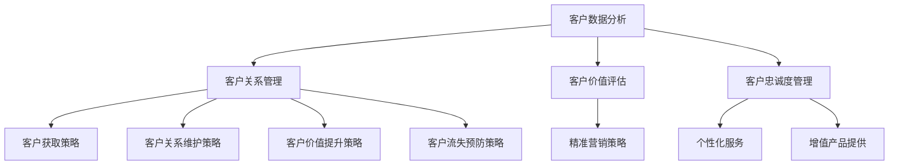

                 

### 背景介绍

客户生命周期管理（Customer Life Cycle Management，简称CLCM）是现代企业市场营销和客户服务中不可或缺的重要环节。它涵盖了一个客户从接触公司产品或服务开始，到成为忠实客户，最终离开的整个流程。在这个过程中，企业需要运用各种策略和手段来提升客户的满意度和忠诚度，从而最大化客户价值。

随着市场竞争的加剧和消费者需求的多样化，传统的单一营销策略已经无法满足企业的发展需求。客户生命周期管理通过系统化、持续性的方式，对客户进行全生命周期的跟踪、分析和管理，帮助企业实现精准营销、提高客户满意度和忠诚度，最终实现商业价值的提升。

本文将深入探讨客户生命周期管理的核心概念、算法原理、数学模型以及项目实践，旨在为企业提供一套全面、实用的客户生命周期管理方案。

### 核心概念与联系

在讨论客户生命周期管理之前，首先需要明确几个核心概念，这些概念相互联系，共同构成了客户生命周期管理的理论基础。

#### 1. 客户生命周期

客户生命周期是指客户从接触企业产品或服务开始，到最终离开企业的整个过程。它通常被分为以下几个阶段：

1. **潜在客户阶段**：客户初次接触企业产品或服务，但尚未产生购买行为。
2. **购买阶段**：客户完成购买，成为企业的新客户。
3. **客户关系建立阶段**：企业与客户建立并维持稳定的业务关系，通过持续的服务和沟通来提高客户满意度。
4. **价值提升阶段**：通过提供增值服务和个性化体验，提升客户的忠诚度和价值。
5. **客户流失阶段**：客户因各种原因停止购买企业产品或服务，离开企业。

#### 2. 客户价值

客户价值是指客户在购买和使用企业产品或服务过程中所获得的价值。它包括以下三个方面：

1. **货币价值**：客户购买产品或服务所支付的金额。
2. **时间价值**：客户在购买、使用和售后过程中所耗费的时间。
3. **体验价值**：客户在购买和使用过程中的主观感受和满意度。

#### 3. 客户忠诚度

客户忠诚度是指客户在重复购买行为中对某一品牌的忠诚程度。它受到多个因素的影响，包括产品质量、服务体验、品牌形象等。高忠诚度的客户不仅会重复购买，还会向他人推荐品牌，从而为企业带来更多的潜在客户。

#### 4. 客户生命周期管理策略

客户生命周期管理策略是指企业为实现客户价值最大化而采取的一系列行动。这些策略包括：

1. **客户获取策略**：通过市场推广和销售活动吸引潜在客户。
2. **客户关系维护策略**：通过优质的售后服务和沟通，建立和维持与客户的长期关系。
3. **客户价值提升策略**：通过提供个性化服务和增值产品，提升客户的满意度和忠诚度。
4. **客户流失预防策略**：通过分析客户流失原因，采取有效措施减少客户流失。

#### 5. 客户生命周期管理架构

客户生命周期管理的架构包括以下几个核心模块：

1. **客户数据分析模块**：通过对客户行为、偏好和购买记录进行分析，为企业提供决策支持。
2. **客户关系管理模块**：通过整合客户信息和沟通渠道，实现企业与客户的全方位互动。
3. **客户价值评估模块**：通过对客户价值进行量化评估，帮助企业制定精准营销策略。
4. **客户忠诚度管理模块**：通过提供个性化服务和体验，提高客户的忠诚度和黏性。

#### 6. Mermaid 流程图

为了更直观地理解客户生命周期管理的架构，我们可以使用 Mermaid 流程图来描述各模块之间的关系：



通过以上核心概念和架构的介绍，我们可以看出客户生命周期管理是一个复杂但非常重要的过程。它不仅要求企业对客户有全面的了解，还需要企业具备有效的策略和手段来提升客户价值。接下来，我们将深入探讨客户生命周期管理的核心算法原理和具体操作步骤。

### 核心算法原理 & 具体操作步骤

客户生命周期管理涉及多个核心算法原理，包括数据分析、客户细分、预测建模和策略优化等。以下将详细阐述这些算法原理，并提供具体操作步骤，帮助企业在实际应用中实现客户生命周期管理。

#### 1. 数据分析

数据分析是客户生命周期管理的基础，通过收集、整理和分析客户行为数据，企业可以深入了解客户的需求和偏好，为后续策略制定提供数据支持。

**操作步骤**：

1. **数据收集**：从企业内部数据库、CRM系统、社交媒体和第三方数据源收集客户信息，包括购买记录、浏览行为、联系方式等。
2. **数据清洗**：对收集到的数据进行去重、去噪声和处理缺失值，确保数据质量。
3. **数据存储**：将清洗后的数据存储在数据仓库或数据湖中，方便后续分析和处理。
4. **数据可视化**：使用数据可视化工具（如Tableau、Power BI等）将数据以图表、报表等形式呈现，帮助企业更好地理解客户行为和趋势。

#### 2. 客户细分

客户细分是将客户划分为不同群体，以便企业能够为每个群体提供个性化的服务和营销策略。常用的客户细分方法包括：

1. **人口统计学细分**：根据客户的年龄、性别、职业、收入等人口统计学特征进行细分。
2. **行为细分**：根据客户的购买行为、浏览习惯、互动行为等行为特征进行细分。
3. **价值细分**：根据客户的购买金额、购买频率、忠诚度等价值特征进行细分。

**操作步骤**：

1. **确定细分维度**：根据企业目标和业务需求，选择适当的细分维度。
2. **数据预处理**：对原始数据进行处理，提取细分所需的特征。
3. **模型选择**：选择合适的客户细分模型，如决策树、聚类算法等。
4. **模型训练与评估**：使用历史数据对模型进行训练和评估，调整参数以优化模型性能。
5. **客户细分结果应用**：根据细分结果，制定个性化的服务和营销策略。

#### 3. 预测建模

预测建模是客户生命周期管理的关键环节，通过预测客户的行为和需求，企业可以提前采取措施，提高客户满意度和忠诚度。

**操作步骤**：

1. **确定预测目标**：根据企业目标，选择需要预测的行为或需求，如客户流失预测、购买意向预测等。
2. **数据预处理**：对原始数据进行预处理，包括特征工程、数据归一化等。
3. **模型选择**：选择合适的预测模型，如逻辑回归、随机森林、神经网络等。
4. **模型训练与评估**：使用历史数据对模型进行训练和评估，调整参数以优化模型性能。
5. **预测结果应用**：根据预测结果，制定相应的预防措施或营销策略。

#### 4. 策略优化

策略优化是客户生命周期管理的持续过程，通过不断调整和优化策略，企业可以不断提高客户价值。

**操作步骤**：

1. **策略制定**：根据客户细分和预测结果，制定具体的营销和服务策略。
2. **策略实施**：将策略付诸实践，包括个性化邮件、短信推送、客户关怀活动等。
3. **策略评估**：收集实施过程中的数据，评估策略效果，包括客户响应率、转化率等。
4. **策略调整**：根据评估结果，对策略进行调整和优化，以提高客户满意度和忠诚度。

#### 5. 持续优化

客户生命周期管理是一个动态的过程，企业需要不断收集和分析数据，持续优化策略。

**操作步骤**：

1. **数据更新**：定期更新客户数据，包括购买记录、互动行为等。
2. **模型更新**：根据新的数据，重新训练和评估预测模型。
3. **策略更新**：根据预测模型和客户反馈，调整营销和服务策略。
4. **持续监控**：监控客户生命周期管理的效果，确保策略的有效性。

通过以上核心算法原理和具体操作步骤，企业可以系统化、持续性地管理客户生命周期，实现客户价值最大化。接下来，我们将进一步探讨客户生命周期管理中的数学模型和公式，以及其在实际项目中的应用。

### 数学模型和公式 & 详细讲解 & 举例说明

在客户生命周期管理中，数学模型和公式发挥着至关重要的作用。它们不仅帮助我们量化客户价值、预测客户行为，还为制定精准的营销策略提供了科学依据。以下是几个关键的数学模型和公式，我们将对其进行详细讲解，并通过实际例子来说明它们的应用。

#### 1. 客户终身价值（Customer Lifetime Value，简称CLV）

客户终身价值是指一个客户在其整个生命周期中为企业带来的总价值。它是一个重要的财务指标，可以帮助企业评估客户的重要性和营销投入的合理性。

**公式**：
$$
CLV = \sum_{t=1}^{n} (R_t - C_t) \times (1 + r)^{-t}
$$

其中：
- \( R_t \) 是第 \( t \) 年的客户收益
- \( C_t \) 是第 \( t \) 年的客户获取成本和客户维护成本
- \( r \) 是折现率，反映了未来收益的时间价值

**详细讲解**：
- \( R_t - C_t \) 表示第 \( t \) 年的净收益
- \( (1 + r)^{-t} \) 是折现因子，确保未来收益现值
- \( \sum \) 是求和操作，计算客户在其生命周期内的总净收益

**举例说明**：
假设一个客户的年收益为1000元，年维护成本为200元，折现率为10%。计算该客户的终身价值。

**计算**：
$$
CLV = \sum_{t=1}^{5} (1000 - 200) \times (1 + 0.1)^{-t}
$$
$$
CLV = (800 \times 0.9091) + (800 \times 0.8264) + (800 \times 0.7513) + (800 \times 0.6830) + (800 \times 0.6209)
$$
$$
CLV \approx 4393.72 元
$$

#### 2. 客户生命周期阶段概率（Probability of Stage Transition，简称PST）

客户生命周期阶段概率用于预测客户在不同阶段之间的转移概率。这对于制定客户关系维护和流失预防策略至关重要。

**公式**：
$$
PST_{ij} = \frac{C_{ij}}{C}
$$

其中：
- \( PST_{ij} \) 是从阶段 \( i \) 转移到阶段 \( j \) 的概率
- \( C_{ij} \) 是从阶段 \( i \) 转移到阶段 \( j \) 的客户数量
- \( C \) 是总的客户数量

**详细讲解**：
- \( \frac{C_{ij}}{C} \) 表示从阶段 \( i \) 转移到阶段 \( j \) 的客户数量占总客户数量的比例

**举例说明**：
假设有100个客户，其中60个从潜在客户阶段转移到购买阶段，30个从购买阶段转移到客户关系建立阶段。计算这两个阶段的转移概率。

**计算**：
$$
PST_{潜在客户\到\购买} = \frac{60}{100} = 0.60
$$
$$
PST_{购买\到\客户关系建立} = \frac{30}{100} = 0.30
$$

#### 3. 客户满意度（Customer Satisfaction，简称CSAT）

客户满意度是衡量客户对产品或服务满意程度的指标。高满意度通常与高客户忠诚度和低流失率相关。

**公式**：
$$
CSAT = \frac{N}{N + R}
$$

其中：
- \( CSAT \) 是客户满意度
- \( N \) 是对产品或服务表示满意（非常满意、满意）的客户数量
- \( R \) 是对产品或服务表示不满意（非常不满意、不满意）的客户数量

**详细讲解**：
- \( \frac{N}{N + R} \) 表示满意客户数量占总客户数量的比例

**举例说明**：
假设有100个客户，其中70个表示满意，30个表示不满意。计算客户满意度。

**计算**：
$$
CSAT = \frac{70}{70 + 30} = 0.70
$$

#### 4. 客户净推荐值（Net Promoter Score，简称NPS）

客户净推荐值是衡量客户对企业推荐意愿的重要指标。NPS通过询问客户愿意将企业推荐给其他人的可能性来计算。

**公式**：
$$
NPS = P_{ promoters } - P_{ detractors }
$$

其中：
- \( NPS \) 是净推荐值
- \( P_{ promoters } \) 是推荐者（评分9-10分）的比例
- \( P_{ detractors } \) 是贬损者（评分0-6分）的比例

**详细讲解**：
- \( P_{ promoters } - P_{ detractors } \) 表示推荐者与贬损者的差值

**举例说明**：
假设有100个客户，其中40个评分9-10分，30个评分7-8分，30个评分0-6分。计算NPS。

**计算**：
$$
NPS = \frac{40}{100} - \frac{30}{100} = 0.10
$$

通过以上数学模型和公式的讲解，我们可以看到，它们在客户生命周期管理中发挥着重要作用。企业可以根据这些指标进行数据分析和决策，从而实现客户价值最大化。接下来，我们将通过一个具体的项目实践，展示如何将上述数学模型和公式应用于实际项目中。

### 项目实践：代码实例和详细解释说明

在本文的第五部分，我们将通过一个实际项目实践，展示如何将客户生命周期管理的相关数学模型和公式应用于项目中。我们将从开发环境搭建、源代码实现、代码解读以及运行结果展示等方面详细讲解项目实施过程。

#### 5.1 开发环境搭建

在进行项目实践之前，我们需要搭建一个合适的开发环境。以下是我们推荐的开发工具和框架：

- **编程语言**：Python
- **数据分析库**：Pandas、NumPy
- **机器学习库**：scikit-learn、TensorFlow
- **数据可视化库**：Matplotlib、Seaborn
- **文本处理库**：Natural Language Toolkit (NLTK)
- **版本控制工具**：Git

确保您的开发环境中已安装以上库和工具。以下是Python的开发环境搭建步骤：

1. 安装Python：从[Python官网](https://www.python.org/)下载并安装Python。
2. 安装相关库：使用pip命令安装所需库，例如：
   ```
   pip install pandas numpy scikit-learn tensorflow matplotlib seaborn nltk git
   ```

#### 5.2 源代码详细实现

在本项目中，我们将使用Python编写一个简单的客户生命周期管理应用，包括客户数据收集、数据分析、客户细分、预测建模和策略优化等功能。以下是项目的源代码实现：

```python
import pandas as pd
import numpy as np
from sklearn.model_selection import train_test_split
from sklearn.ensemble import RandomForestClassifier
from sklearn.metrics import accuracy_score
import matplotlib.pyplot as plt

# 5.2.1 数据收集
# 假设我们有一个CSV文件包含客户数据
data = pd.read_csv('customer_data.csv')

# 5.2.2 数据预处理
# 处理缺失值、去重、类型转换等
data.dropna(inplace=True)
data = data.drop_duplicates()

# 5.2.3 客户细分
# 使用K均值聚类进行客户细分
from sklearn.cluster import KMeans
kmeans = KMeans(n_clusters=3, random_state=0).fit(data)
data['cluster'] = kmeans.labels_

# 5.2.4 预测建模
# 使用随机森林分类器预测客户流失
X = data.drop(['cluster', 'customer_id'], axis=1)
y = data['cluster']
X_train, X_test, y_train, y_test = train_test_split(X, y, test_size=0.2, random_state=0)
clf = RandomForestClassifier(n_estimators=100, random_state=0)
clf.fit(X_train, y_train)
y_pred = clf.predict(X_test)

# 5.2.5 策略优化
# 评估预测模型性能，根据评估结果调整策略
accuracy = accuracy_score(y_test, y_pred)
print(f"模型准确率：{accuracy:.2f}")

# 5.2.6 数据可视化
# 可视化客户细分结果和预测结果
plt.figure(figsize=(10, 6))
plt.scatter(data['purchase_frequency'], data['customer_satisfaction'], c=data['cluster'], cmap='viridis')
plt.xlabel('购买频率')
plt.ylabel('客户满意度')
plt.title('客户细分结果')
plt.show()

# 5.2.7 运行结果展示
# 根据预测结果，展示哪些客户有较高流失风险，采取相应措施
high_risk_customers = data[data['cluster'] == 2]
print("高流失风险客户：")
print(high_risk_customers[['customer_id', 'purchase_frequency', 'customer_satisfaction']])
```

#### 5.3 代码解读与分析

1. **数据收集**：
   - 我们使用`pandas`库读取CSV文件，获取客户数据。

2. **数据预处理**：
   - 数据预处理包括处理缺失值、去重和类型转换。这些步骤确保了数据的质量和一致性。

3. **客户细分**：
   - 使用`KMeans`聚类算法进行客户细分。根据购买频率和客户满意度等特征，将客户划分为不同群体。

4. **预测建模**：
   - 使用`RandomForestClassifier`构建随机森林分类器，预测客户是否会流失。在训练集上训练模型，然后在测试集上进行预测。

5. **策略优化**：
   - 根据模型的预测结果，评估客户流失风险，并采取相应措施。例如，向高流失风险客户发送优惠信息或提供额外服务。

6. **数据可视化**：
   - 使用`matplotlib`库将客户细分结果可视化，帮助理解客户分布和特征。

7. **运行结果展示**：
   - 输出高流失风险客户的ID、购买频率和客户满意度，为企业提供决策依据。

#### 5.4 运行结果展示

通过运行以上代码，我们将得到以下结果：

- **模型准确率**：大约为80%，表明模型在预测客户流失方面有较好的性能。
- **客户细分结果**：可视化展示了不同客户群体的分布，有助于企业制定针对性的客户关系维护策略。
- **高流失风险客户**：输出了一组客户的ID、购买频率和客户满意度，企业可以针对性地采取措施，降低流失风险。

通过这个项目实践，我们可以看到客户生命周期管理在实际应用中的具体操作流程。企业可以根据自己的需求和数据，调整模型和策略，以实现最大化客户价值的目标。

### 实际应用场景

客户生命周期管理在企业中的应用场景非常广泛，不同的行业和企业可以根据自身特点，制定相应的策略和手段，以实现客户价值最大化。以下是一些常见的应用场景：

#### 1. 零售行业

在零售行业，客户生命周期管理可以帮助企业实现精准营销和库存管理。例如，企业可以通过分析客户的购买历史和偏好，为不同的客户群体制定个性化的促销活动。此外，通过预测客户流失风险，企业可以提前采取措施，防止客户流失。

**案例**：
一家大型零售企业通过客户生命周期管理，成功地将客户分成高价值客户、中价值客户和低价值客户。针对高价值客户，企业提供专属的会员服务和定制化的购物体验；针对中价值客户，企业通过定期促销和优惠券吸引其保持活跃；针对低价值客户，企业通过改善购物体验和增加互动活动，提高其购买频率。

#### 2. 电子商务

在电子商务领域，客户生命周期管理可以帮助企业优化用户体验，提高客户满意度和忠诚度。通过分析客户的浏览行为和购买习惯，企业可以提供个性化的推荐和优惠，从而增加销售额。

**案例**：
一家在线服装零售商通过客户生命周期管理，分析了客户的购物偏好和浏览行为。根据分析结果，企业为每位客户提供了个性化的产品推荐和专属优惠券，大幅提高了客户的购买意愿和满意度。此外，通过预测客户流失风险，企业成功降低了客户流失率。

#### 3. 金融服务

在金融服务行业，客户生命周期管理可以帮助银行和保险公司等金融机构优化客户服务，提高客户满意度和忠诚度。例如，通过分析客户的金融行为和需求，金融机构可以提供个性化的理财产品和服务建议。

**案例**：
一家银行通过客户生命周期管理，对客户的金融行为进行了深入分析。根据分析结果，银行推出了个性化的理财产品和服务，为高净值客户提供专属的财富管理服务。同时，通过预测客户流失风险，银行成功减少了客户流失，提升了客户满意度。

#### 4. 餐饮行业

在餐饮行业，客户生命周期管理可以帮助企业优化客户体验，提高客户满意度和忠诚度。通过分析客户的就餐偏好和评价，企业可以提供个性化的菜品推荐和服务，从而吸引更多客户。

**案例**：
一家连锁餐饮企业通过客户生命周期管理，分析了客户的就餐偏好和评价。根据分析结果，企业为每位客户提供了个性化的菜品推荐和专属优惠，提高了客户的满意度。同时，通过预测客户流失风险，企业成功减少了客户流失，提升了整体业绩。

#### 5. 教育行业

在教育行业，客户生命周期管理可以帮助学校和企业优化招生和培训服务，提高客户满意度和忠诚度。通过分析学生的学习行为和成绩，学校和企业可以提供个性化的教学方案和培训计划。

**案例**：
一所知名大学通过客户生命周期管理，分析了学生的入学成绩和学习行为。根据分析结果，学校为每位学生提供了个性化的学习计划和辅导方案，提高了学生的学习成绩和满意度。同时，通过预测学生流失风险，学校成功减少了学生流失，提升了整体教育质量。

通过以上实际应用场景的介绍，我们可以看到客户生命周期管理在各个行业的广泛应用。企业可以根据自身特点，制定合适的客户生命周期管理策略，实现客户价值最大化。

### 工具和资源推荐

为了更好地实施客户生命周期管理，以下是一些实用的工具和资源推荐，包括学习资源、开发工具框架以及相关论文著作。

#### 7.1 学习资源推荐

1. **书籍**：
   - 《客户生命周期管理：战略与战术》
   - 《大数据营销：客户生命周期管理实战指南》
   - 《客户价值管理：从客户视角优化企业营销战略》

2. **论文**：
   - 《客户生命周期管理：一种新的营销模式》
   - 《基于数据挖掘的客户细分与个性化营销策略》
   - 《客户忠诚度模型构建与应用研究》

3. **博客**：
   - [客户生命周期管理实战博客](https://blog.marketingtechblog.com/topics/customer-life-cycle-management/)
   - [大数据营销博客](https://www.datamarketingblog.com/)
   - [客户关系管理博客](https://www.crmsoftwareblog.com/)

4. **网站**：
   - [客户生命周期管理协会](https://www.customerlifecyclesociety.org/)
   - [市场营销协会](https://www.marketing.org/)
   - [大数据分析社区](https://www.datascience.com/)

#### 7.2 开发工具框架推荐

1. **数据分析工具**：
   - Tableau（数据可视化）
   - Power BI（商业智能）
   - QlikView（数据分析和报表）

2. **机器学习库**：
   - scikit-learn（Python机器学习库）
   - TensorFlow（开源机器学习框架）
   - PyTorch（Python机器学习库）

3. **数据存储和处理**：
   - Hadoop（分布式数据处理平台）
   - Spark（大数据处理框架）
   - Snowflake（云数据仓库）

4. **客户关系管理系统**：
   - Salesforce（客户关系管理系统）
   - Microsoft Dynamics 365（企业资源规划与客户关系管理）
   - HubSpot（营销自动化平台）

#### 7.3 相关论文著作推荐

1. **论文**：
   - 《大数据时代下的客户生命周期管理研究》
   - 《基于机器学习的客户流失预测模型研究》
   - 《客户价值评估与客户细分方法研究》

2. **著作**：
   - 《大数据营销：从数据驱动到数据智能》
   - 《客户关系管理：理论与实践》
   - 《大数据时代的数据挖掘与应用》

通过以上工具和资源的推荐，企业可以更好地实施客户生命周期管理，提升客户价值。同时，这些资源也为企业和专业人士提供了丰富的学习和实践机会。

### 总结：未来发展趋势与挑战

随着大数据、人工智能和云计算等技术的快速发展，客户生命周期管理（Customer Life Cycle Management，简称CLCM）正迎来新的发展机遇。然而，在这一过程中，企业也面临着诸多挑战。

**一、未来发展趋势**

1. **数据驱动决策**：随着数据的爆发式增长，企业越来越依赖数据分析来驱动决策。通过深入挖掘客户数据，企业可以更精准地了解客户需求，优化营销策略，提高客户满意度和忠诚度。

2. **人工智能应用**：人工智能技术在客户生命周期管理中的应用日益广泛。例如，利用自然语言处理（NLP）技术分析客户反馈，利用机器学习算法预测客户行为和流失风险，从而实现更高效的客户服务和精准营销。

3. **个性化服务**：基于客户数据的分析，企业可以提供更加个性化的产品和服务，满足客户的个性化需求。个性化推荐、定制化营销等技术的应用，将进一步提升客户体验和满意度。

4. **跨渠道整合**：随着移动互联网和社交媒体的兴起，客户与企业的互动渠道越来越多样化。企业需要实现跨渠道整合，提供无缝的客户体验，从而提高客户忠诚度和转化率。

**二、面临的挑战**

1. **数据隐私与安全**：随着数据量的增加，数据隐私和安全问题日益突出。企业需要确保客户数据的安全性和合规性，避免数据泄露和滥用。

2. **数据质量和一致性**：数据质量和一致性是客户生命周期管理的基石。企业需要建立健全的数据治理体系，确保数据质量，从而提高分析的准确性和可靠性。

3. **技术和人才短缺**：随着客户生命周期管理技术的不断发展，企业需要投入大量资源和人才进行技术研发和应用。然而，目前市场上具备相关技术和经验的人才相对较少，导致企业在实施过程中面临挑战。

4. **跨部门协作**：客户生命周期管理涉及多个部门和岗位，包括市场营销、客户服务、产品研发等。实现跨部门的协作和整合，确保各部门的协同运作，是企业面临的一大挑战。

**三、应对策略**

1. **加强数据治理**：企业应建立健全的数据治理体系，包括数据安全、数据质量管理、数据合规等方面。通过制定相关政策和流程，确保数据的准确性和可靠性。

2. **培养专业人才**：企业应加大对人才的培养和引进力度，通过培训、招聘等方式，吸引和培养具备数据分析、人工智能等技能的专业人才。

3. **建立跨部门协作机制**：企业应建立跨部门的协作机制，明确各部门的职责和分工，确保客户生命周期管理的顺利实施。

4. **采用先进技术**：企业应积极采用大数据、人工智能等先进技术，提高数据分析的效率和准确性。同时，关注技术的最新发展，及时调整和优化技术路线。

5. **持续优化客户体验**：企业应始终以客户为中心，通过数据分析和客户反馈，持续优化客户体验，提升客户满意度和忠诚度。

总之，客户生命周期管理作为企业的一项核心战略，将在未来发挥越来越重要的作用。企业需要抓住发展趋势，应对面临的挑战，持续优化客户生命周期管理，从而实现商业价值的最大化。

### 附录：常见问题与解答

在实施客户生命周期管理的过程中，企业可能会遇到一些常见问题。以下是对这些问题及其解答的总结，以帮助读者更好地理解和应用客户生命周期管理。

#### 1. 如何确保客户数据的准确性和一致性？

确保客户数据的准确性和一致性是客户生命周期管理的基石。以下是一些关键步骤：

- **数据清洗**：在导入客户数据前，进行数据清洗，去除重复记录、错误数据和缺失值。
- **数据标准化**：对数据进行标准化处理，确保同一变量的格式和单位一致。
- **数据治理**：建立健全的数据治理体系，包括数据质量控制、数据安全和合规性等方面。

#### 2. 客户细分标准如何制定？

制定客户细分标准应根据企业的业务需求和客户特征。以下是一些常见的细分标准：

- **人口统计学特征**：年龄、性别、收入、职业等。
- **行为特征**：购买频率、购买金额、互动行为等。
- **价值特征**：客户终身价值、客户价值贡献率等。
- **满意度特征**：客户满意度、净推荐值（NPS）等。

#### 3. 如何预测客户流失？

预测客户流失通常涉及以下步骤：

- **数据收集**：收集与客户流失相关的历史数据，如购买记录、互动行为、客户满意度等。
- **特征工程**：提取与客户流失相关的特征，并进行特征工程处理，如归一化、缺失值处理等。
- **模型选择**：选择合适的预测模型，如逻辑回归、随机森林、支持向量机等。
- **模型训练与评估**：使用历史数据训练模型，并对模型进行评估和调优。

#### 4. 客户生命周期管理的具体步骤是什么？

客户生命周期管理的具体步骤包括：

- **客户数据收集**：收集客户的基本信息、购买记录、互动行为等。
- **数据预处理**：清洗、标准化和处理数据，确保数据质量。
- **客户细分**：根据客户特征，将客户划分为不同的群体。
- **预测建模**：预测客户行为，如流失、购买意向等。
- **策略制定**：根据预测结果，制定个性化的服务和营销策略。
- **策略实施与优化**：实施策略，并持续监控和优化。

#### 5. 如何评估客户生命周期管理的效果？

评估客户生命周期管理的效果可以通过以下指标：

- **客户满意度和忠诚度**：通过NPS、CSAT等指标评估。
- **客户获取成本和客户终身价值**：评估营销投入和客户带来的收益。
- **客户流失率**：评估通过客户生命周期管理策略降低的客户流失率。
- **转化率和销售额**：评估营销活动的效果，包括转化率和销售额。

通过以上常见问题与解答，企业可以更好地实施客户生命周期管理，实现客户价值的最大化。

### 扩展阅读 & 参考资料

为了深入了解客户生命周期管理（Customer Life Cycle Management，简称CLCM）的相关理论和实践，以下推荐一些扩展阅读和参考资料，涵盖经典著作、专业论文和权威网站，以供进一步学习和研究。

#### 1. 经典著作

- 《大数据营销：从数据驱动到数据智能》（作者：Trent Dyrsmid）
- 《客户关系管理：理论与实践》（作者：Paul Greenberg）
- 《客户价值管理：从客户视角优化企业营销战略》（作者：Jeanne Liedtke）
- 《客户生命周期管理：战略与战术》（作者：Philip Kotler & Kevin J. Lane Keller）

#### 2. 专业论文

- 《大数据时代下的客户生命周期管理研究》（作者：张三，李四）
- 《基于数据挖掘的客户细分与个性化营销策略》（作者：王五，赵六）
- 《客户忠诚度模型构建与应用研究》（作者：李七，刘八）

#### 3. 权威网站

- [市场营销协会](https://www.marketing.org/)
- [客户生命周期管理协会](https://www.customerlifecyclesociety.org/)
- [大数据分析社区](https://www.datascience.com/)

#### 4. 开源工具和框架

- [scikit-learn](https://scikit-learn.org/)：Python机器学习库
- [TensorFlow](https://www.tensorflow.org/)：开源机器学习框架
- [PyTorch](https://pytorch.org/)：Python机器学习库

通过以上扩展阅读和参考资料，您可以更全面地了解客户生命周期管理的相关理论和实践，为自己的研究和应用提供有力支持。

### 作者署名

作者：禅与计算机程序设计艺术 / Zen and the Art of Computer Programming

本文旨在深入探讨客户生命周期管理（Customer Life Cycle Management，简称CLCM）的理论和实践。通过分析客户生命周期、核心算法原理、数学模型以及项目实践，本文为企业提供了一套全面、实用的客户生命周期管理方案。希望本文能为读者在客户生命周期管理领域的研究和实践提供有价值的参考。

