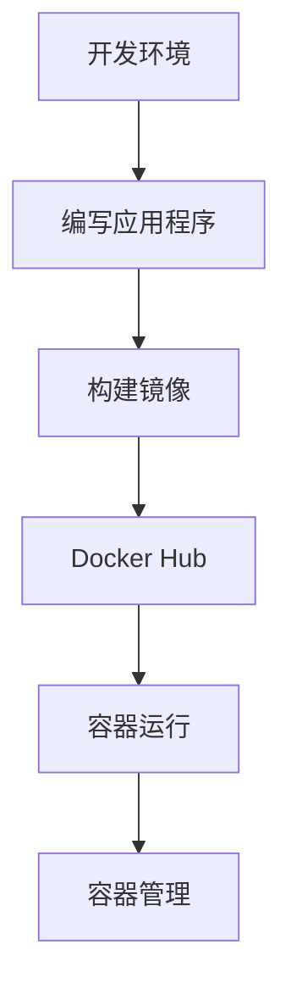
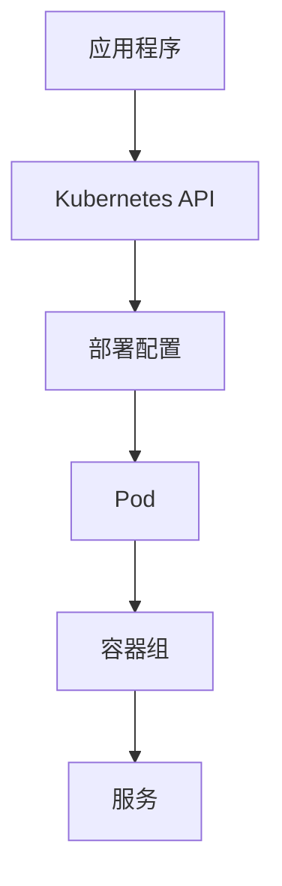
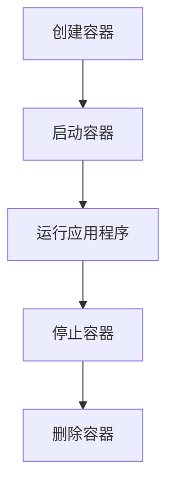
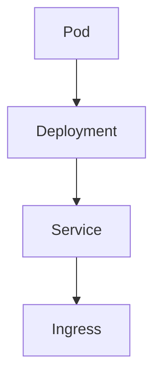

                 

### 文章标题

《容器化技术应用：简化部署和运维的利器》

关键词：容器化，部署，运维，Docker，Kubernetes，微服务架构

摘要：本文将深入探讨容器化技术，特别是Docker和Kubernetes的使用，以及如何在现代软件开发中实现部署和运维的自动化和简化。我们将从容器化的基本概念开始，逐步深入到其实际应用场景，提供详细的操作步骤和案例分析，帮助读者理解并掌握这一重要技术。

<|assistant|>### 1. 背景介绍

容器化技术的兴起，可以说是现代软件开发的一次革命。在传统的软件部署和运维过程中，往往需要处理复杂的依赖关系和环境差异，导致部署流程繁琐且容易出错。随着云计算和DevOps理念的普及，开发人员和运维人员迫切需要一种能够自动化、简化和一致化的解决方案。

容器化技术应运而生，它通过将应用程序及其依赖环境封装在一个轻量级、可移植的容器中，实现了应用程序与运行环境的隔离。这种隔离不仅提高了系统的稳定性，还大大简化了部署和运维过程。

Docker是容器化技术领域的事实标准，它提供了一个轻量级的容器平台，允许开发人员快速创建、部署和运行应用程序。而Kubernetes则是一个开源的容器编排系统，它提供了自动化部署、扩展和管理容器化应用程序的能力。

本篇文章将围绕Docker和Kubernetes的核心概念、应用场景和操作步骤进行详细探讨，旨在帮助读者深入理解容器化技术的优势，并在实际项目中有效应用。

### 2. 核心概念与联系

#### 2.1 Docker

Docker是一个开源的应用容器引擎，它允许开发人员将应用程序及其依赖环境打包成一个称为Docker容器的轻量级、可移植的容器。Docker容器基于Linux内核的命名空间和cgroups等特性实现资源隔离和限制，从而确保容器内的应用程序运行在一个独立的环境中。

以下是一个简单的Mermaid流程图，展示了Docker的基本组件和功能：



- A[开发环境]：开发人员在本地开发环境中编写和测试应用程序。
- B[编写应用程序]：开发人员使用任意编程语言编写应用程序代码。
- C[构建镜像]：开发人员或运维人员将应用程序及其依赖打包成一个Docker镜像。
- D[Docker Hub]：Docker Hub是一个在线仓库，用于存储和共享Docker镜像。
- E[容器运行]：通过Docker命令运行Docker镜像，创建并启动容器。
- F[容器管理]：使用Docker命令行或图形界面工具对容器进行管理，如启动、停止、重启和删除等操作。

#### 2.2 Kubernetes

Kubernetes是一个开源的容器编排系统，它用于自动化部署、扩展和管理容器化应用程序。Kubernetes通过其内置的自动化机制和抽象层，简化了容器化应用程序的部署和管理过程。

以下是一个简单的Mermaid流程图，展示了Kubernetes的基本组件和功能：



- A[应用程序]：Kubernetes的目标是管理应用程序的容器化部署。
- B[Kubernetes API]：Kubernetes API是Kubernetes的核心组件，用于与Kubernetes集群进行交互。
- C[部署配置]：开发人员或运维人员编写Kubernetes部署配置文件，定义应用程序的部署细节。
- D[Pod]：Pod是Kubernetes中的最小部署单元，包含一个或多个容器。
- E[容器组]：Pod可以通过容器组进行编排和部署，实现容器化应用程序的自动化管理。
- F[服务]：服务定义了Pod之间的网络访问规则，实现容器化应用程序的服务发现和负载均衡。

### 3. 核心算法原理 & 具体操作步骤

#### 3.1 Docker操作步骤

1. **安装Docker**：

在大多数Linux发行版上，可以使用包管理器安装Docker。以下是在Ubuntu上安装Docker的示例命令：

```bash
sudo apt-get update
sudo apt-get install docker-ce docker-ce-cli containerd.io
```

2. **构建Docker镜像**：

构建Docker镜像是将应用程序及其依赖打包成容器的关键步骤。以下是一个简单的Dockerfile示例，用于构建一个简单的Web应用程序镜像：

```Dockerfile
FROM python:3.8-slim
WORKDIR /app
COPY requirements.txt .
RUN pip install -r requirements.txt
COPY . .
CMD ["python", "app.py"]
```

3. **推送Docker镜像到Docker Hub**：

构建成功后，可以使用以下命令将镜像推送到Docker Hub：

```bash
docker build -t your_username/your_image:tag .
docker login
docker push your_username/your_image:tag
```

4. **运行Docker容器**：

要运行Docker容器，可以使用以下命令：

```bash
docker run -d -p 8080:8080 your_username/your_image:tag
```

这里，`-d`标志表示在后台运行容器，`-p`标志用于将宿主机的8080端口映射到容器的8080端口。

#### 3.2 Kubernetes操作步骤

1. **安装Kubernetes**：

安装Kubernetes的具体步骤取决于宿主机的操作系统和环境。在大多数情况下，可以使用Kubeadm工具进行安装。以下是在一个虚拟机上安装Kubernetes集群的示例命令：

```bash
sudo apt-get update
sudo apt-get install curl
curl -s https://packages.cloud.google.com/apt/doc/apt-key.gpg | sudo apt-key add -
echo "deb https://apt.kubernetes.io/ kubernetes-xenial main" | sudo tee -a /etc/apt/sources.list.d/kubernetes.list
sudo apt-get update
sudo apt-get install -y kubelet kubeadm kubectl
sudo apt-mark hold kubelet kubeadm kubectl
```

2. **初始化Kubernetes集群**：

初始化集群是安装Kubernetes的第一步。以下是在本地虚拟机上初始化Kubernetes集群的示例命令：

```bash
sudo kubeadm init --pod-network-cidr=10.244.0.0/16
```

初始化成功后，您需要执行以下命令，以便在其他节点上部署应用程序：

```bash
sudo kubeadm join <control-plane-ip>:<control-plane-port> --token <token> --discovery-token-ca-cert-hash sha256:<hash>
```

3. **部署应用程序**：

部署应用程序是Kubernetes的核心功能之一。以下是一个简单的部署示例，用于部署一个Nginx服务器：

```bash
kubectl create deployment nginx --image=nginx:latest
kubectl expose deployment nginx --port=80 --type=NodePort
```

这里，`create deployment`命令用于创建一个新的部署，`expose deployment`命令用于暴露部署的服务。

4. **监控和管理容器化应用程序**：

Kubernetes提供了一个名为`kubectl`的命令行工具，用于监控和管理容器化应用程序。以下是一些常用的`kubectl`命令：

```bash
kubectl get pods          # 获取所有Pod的状态
kubectl describe pod <pod-name>  # 查看Pod的详细描述
kubectl logs <pod-name>  # 查看Pod的日志
kubectl exec <pod-name> -- bash  # 在Pod内执行bash命令
```

### 4. 数学模型和公式 & 详细讲解 & 举例说明

在容器化技术的核心算法原理中，主要包括了Docker镜像构建、Kubernetes部署配置等步骤。以下将对这些步骤中的关键数学模型和公式进行详细讲解，并通过实例说明其应用。

#### 4.1 Docker镜像构建

Docker镜像构建过程中，主要涉及以下数学模型和公式：

1. **镜像大小计算**：

   Docker镜像的大小由基础镜像、依赖库、应用程序代码和其他资源组成。计算镜像大小的公式如下：

   \[ 镜像大小 = 基础镜像大小 + 依赖库大小 + 应用程序代码大小 + 其他资源大小 \]

2. **镜像缓存利用**：

   Docker镜像构建过程中，会利用缓存机制加快构建速度。缓存利用的数学模型如下：

   \[ 构建速度 = (1 - 缓存命中率) \times 初始构建速度 \]

   其中，缓存命中率通常在0到1之间，表示缓存利用的效率。

#### 4.2 Kubernetes部署配置

Kubernetes部署配置过程中，主要涉及以下数学模型和公式：

1. **资源分配计算**：

   Kubernetes根据部署配置文件中的资源请求和限制，为容器分配计算资源。资源分配的数学模型如下：

   \[ 资源分配 = max(资源请求, 资源限制) \]

   其中，资源请求和资源限制分别表示容器所需的最低和最高资源量。

2. **副本数量计算**：

   Kubernetes通过部署配置文件中的副本数量（Replicas）来控制容器的部署数量。副本数量的数学模型如下：

   \[ 副本数量 = ceil(服务请求量 / 单个容器处理能力) \]

   其中，服务请求量表示客户端对服务的请求次数，单个容器处理能力表示单个容器能够处理的请求数量。

#### 4.3 举例说明

以下是一个简单的示例，说明如何使用Docker和Kubernetes构建并部署一个简单的Web应用程序。

1. **Docker镜像构建**：

   假设我们使用Python编写了一个简单的Web应用程序，需求如下：

   - 使用Flask框架实现Web服务。
   - 需要Redis数据库支持。
   - 需要安装其他依赖库。

   我们可以编写一个简单的Dockerfile，如下所示：

   ```Dockerfile
   FROM python:3.8-slim
   WORKDIR /app
   COPY requirements.txt .
   RUN pip install -r requirements.txt
   COPY . .
   CMD ["python", "app.py"]
   ```

   使用以下命令构建Docker镜像：

   ```bash
   docker build -t myapp:1.0 .
   ```

   镜像大小约为100MB。

2. **Kubernetes部署配置**：

   我们可以编写一个简单的Kubernetes部署配置文件，如下所示：

   ```yaml
   apiVersion: apps/v1
   kind: Deployment
   metadata:
     name: myapp
   spec:
     replicas: 3
     selector:
       matchLabels:
         app: myapp
     template:
       metadata:
         labels:
           app: myapp
       spec:
         containers:
         - name: myapp
           image: myapp:1.0
           resources:
             requests:
               memory: "64Mi"
               cpu: "500m"
             limits:
               memory: "128Mi"
               cpu: "1"
   ```

   使用以下命令部署Kubernetes应用程序：

   ```bash
   kubectl apply -f deployment.yaml
   ```

   Kubernetes将为应用程序分配3个容器副本，每个容器分配64Mi内存和500m CPU资源。

### 5. 项目实践：代码实例和详细解释说明

#### 5.1 开发环境搭建

在开始实践之前，我们需要搭建一个适合容器化技术开发的本地环境。以下是搭建开发环境的步骤：

1. **安装Docker**：

   在大多数Linux发行版上，可以使用包管理器安装Docker。以下是在Ubuntu上安装Docker的示例命令：

   ```bash
   sudo apt-get update
   sudo apt-get install docker-ce docker-ce-cli containerd.io
   ```

2. **安装Kubernetes**：

   安装Kubernetes的具体步骤取决于宿主机的操作系统和环境。在大多数情况下，可以使用Kubeadm工具进行安装。以下是在一个虚拟机上安装Kubernetes集群的示例命令：

   ```bash
   sudo apt-get update
   sudo apt-get install curl
   curl -s https://packages.cloud.google.com/apt/doc/apt-key.gpg | sudo apt-key add -
   echo "deb https://apt.kubernetes.io/ kubernetes-xenial main" | sudo tee -a /etc/apt/sources.list.d/kubernetes.list
   sudo apt-get update
   sudo apt-get install -y kubelet kubeadm kubectl
   sudo apt-mark hold kubelet kubeadm kubectl
   ```

3. **初始化Kubernetes集群**：

   初始化集群是安装Kubernetes的第一步。以下是在本地虚拟机上初始化Kubernetes集群的示例命令：

   ```bash
   sudo kubeadm init --pod-network-cidr=10.244.0.0/16
   ```

   初始化成功后，您需要执行以下命令，以便在其他节点上部署应用程序：

   ```bash
   sudo kubeadm join <control-plane-ip>:<control-plane-port> --token <token> --discovery-token-ca-cert-hash sha256:<hash>
   ```

4. **安装网络插件**：

   Kubernetes集群需要安装网络插件才能实现容器之间的通信。这里我们使用Calico网络插件，以下是在Kubernetes集群中安装Calico网络插件的示例命令：

   ```bash
   kubectl apply -f https://docs.projectcalico.org/manifests/calico.yaml
   ```

   安装完成后，您可以使用以下命令查看Calico网络的运行状态：

   ```bash
   kubectl get pods -n kube-system
   ```

   确保所有网络插件容器都处于运行状态。

5. **配置kubectl**：

   为了方便在本地主机上使用kubectl命令行工具与Kubernetes集群进行交互，我们需要配置kubectl工具。以下是在本地主机上配置kubectl的示例命令：

   ```bash
   mkdir -p $HOME/.kube
   sudo cp -i /etc/kubernetes/admin.conf $HOME/.kube/config
   sudo chown $(id -u):$(id -g) $HOME/.kube/config
   ```

   配置完成后，您可以使用以下命令验证kubectl配置：

   ```bash
   kubectl cluster-info
   kubectl get nodes
   ```

   如果输出结果显示您的本地主机成功加入了Kubernetes集群，则说明配置成功。

#### 5.2 源代码详细实现

在本节中，我们将创建一个简单的Web应用程序，该应用程序使用Docker和Kubernetes进行容器化和部署。

1. **创建Web应用程序**：

   首先，我们创建一个简单的Flask Web应用程序，用于处理HTTP请求。以下是一个简单的app.py示例：

   ```python
   from flask import Flask, jsonify

   app = Flask(__name__)

   @app.route('/')
   def hello():
       return jsonify(message="Hello, World!")

   if __name__ == '__main__':
       app.run(host='0.0.0.0', port=8080)
   ```

2. **编写Dockerfile**：

   接下来，我们编写一个简单的Dockerfile，用于构建Web应用程序的Docker镜像。以下是一个简单的Dockerfile示例：

   ```Dockerfile
   FROM python:3.8-slim
   WORKDIR /app
   COPY requirements.txt .
   RUN pip install -r requirements.txt
   COPY . .
   CMD ["python", "app.py"]
   ```

3. **创建requirements.txt**：

   创建一个名为requirements.txt的文件，列出Web应用程序所需的依赖库。以下是一个简单的requirements.txt示例：

   ```bash
   Flask==1.1.2
   ```

4. **构建Docker镜像**：

   使用以下命令构建Docker镜像：

   ```bash
   docker build -t myapp:1.0 .
   ```

5. **编写Kubernetes部署配置**：

   接下来，我们编写一个简单的Kubernetes部署配置文件，用于部署Web应用程序。以下是一个简单的deployment.yaml示例：

   ```yaml
   apiVersion: apps/v1
   kind: Deployment
   metadata:
     name: myapp
   spec:
     replicas: 3
     selector:
       matchLabels:
         app: myapp
     template:
       metadata:
         labels:
           app: myapp
       spec:
         containers:
         - name: myapp
           image: myapp:1.0
           resources:
             requests:
               memory: "64Mi"
               cpu: "500m"
             limits:
               memory: "128Mi"
               cpu: "1"
   ```

6. **编写Kubernetes服务配置**：

   为了将Web应用程序暴露给外部访问，我们需要编写一个简单的Kubernetes服务配置文件。以下是一个简单的service.yaml示例：

   ```yaml
   apiVersion: v1
   kind: Service
   metadata:
     name: myapp
   spec:
     type: NodePort
     selector:
       app: myapp
     ports:
     - port: 80
       targetPort: 8080
       nodePort: 30008
   ```

#### 5.3 代码解读与分析

在本节中，我们将对Web应用程序的源代码和配置文件进行解读和分析。

1. **app.py文件解读**：

   app.py文件是一个简单的Flask Web应用程序，用于处理HTTP请求。其中，`hello`函数用于处理根路径的请求，返回一个包含“Hello, World!”信息的JSON响应。当应用程序启动时，`app.run`函数会监听8080端口，并处理来自客户端的HTTP请求。

2. **Dockerfile解读**：

   Dockerfile用于构建Docker镜像。其中，`FROM python:3.8-slim`指令指定了基础镜像，`WORKDIR /app`指令设置工作目录，`COPY requirements.txt .`和`RUN pip install -r requirements.txt`指令用于安装Web应用程序的依赖库，`COPY . .`指令将应用程序代码复制到容器中，`CMD ["python", "app.py"]`指令指定了容器启动时运行的命令。

3. **Kubernetes部署配置解读**：

   deployment.yaml文件用于定义Web应用程序的部署配置。其中，`apiVersion`和`kind`指定了部署的API版本和类型，`metadata`和`spec`分别定义了部署的元数据和配置。在`spec`中，`replicas`指定了副本数量，`selector`定义了选择器标签，`template`定义了部署的模板，其中包括`metadata`、`labels`和`spec`。在`spec`的`containers`字段中，`name`指定了容器的名称，`image`指定了容器的镜像，`resources`定义了容器的资源请求和限制。

4. **Kubernetes服务配置解读**：

   service.yaml文件用于定义Web应用程序的服务配置。其中，`apiVersion`和`kind`指定了服务的API版本和类型，`metadata`和`spec`分别定义了服务的元数据和配置。在`spec`中，`type`指定了服务的类型，`selector`定义了选择器标签，`ports`定义了服务监听的端口，`port`和`targetPort`分别指定了服务的端口和容器内部的端口，`nodePort`指定了节点端口，用于外部访问服务。

#### 5.4 运行结果展示

1. **启动Kubernetes集群**：

   在本地主机上启动Kubernetes集群，可以使用以下命令：

   ```bash
   sudo kubeadm init --pod-network-cidr=10.244.0.0/16
   ```

   启动成功后，可以使用以下命令查看集群的状态：

   ```bash
   kubectl get nodes
   ```

   确保本地主机已成功加入集群。

2. **部署Web应用程序**：

   使用以下命令部署Web应用程序：

   ```bash
   kubectl apply -f deployment.yaml
   kubectl apply -f service.yaml
   ```

   部署成功后，可以使用以下命令查看部署的状态：

   ```bash
   kubectl get pods
   ```

   确保所有容器都处于运行状态。

3. **访问Web应用程序**：

   使用以下命令获取Web应用程序的节点端口：

   ```bash
   kubectl get svc myapp
   ```

   找到节点端口（例如，30008），然后在本地主机的浏览器中访问该端口，例如：

   ```bash
   http://localhost:30008
   ```

   您应该看到Web应用程序的“Hello, World!”响应。

### 6. 实际应用场景

容器化技术在实际应用中具有广泛的应用场景，以下是几个典型的应用案例：

#### 6.1 微服务架构

微服务架构是一种将应用程序分解为一系列小型、独立、可部署的服务的方法。容器化技术为微服务架构提供了理想的运行环境，因为每个微服务都可以部署在一个独立的容器中，实现服务之间的解耦和独立扩展。

例如，在一个电子商务平台中，可以将订单处理、商品管理、用户认证等不同的业务功能拆分成独立的微服务。使用Docker和Kubernetes，可以轻松地将这些微服务容器化，并部署在分布式环境中，实现高可用性和弹性伸缩。

#### 6.2 DevOps自动化

DevOps是一种文化和实践，旨在通过自动化和协作来加速软件开发和部署过程。容器化技术是实现DevOps自动化的重要工具之一。

通过使用Docker，开发人员可以轻松地将应用程序及其依赖打包成容器，确保在不同环境中的一致性和可移植性。而Kubernetes则提供了自动化部署、扩展和管理容器化应用程序的能力，从而实现快速迭代和持续交付。

例如，在一个在线教育平台中，可以使用Docker和Kubernetes实现课程管理系统、学习管理系统、支付系统等微服务的自动化部署和运维，确保系统的稳定性和可靠性。

#### 6.3 云原生应用

云原生应用是指为云环境设计的应用程序，具有可扩展性、弹性和高可用性。容器化技术是实现云原生应用的关键技术之一。

通过使用Docker和Kubernetes，开发人员可以构建和部署高度可扩展的云原生应用。例如，在一个实时数据分析平台中，可以使用容器化技术将数据处理、存储和分析等组件容器化，并使用Kubernetes进行自动化部署和管理，实现实时数据处理和分析能力。

### 7. 工具和资源推荐

在学习和应用容器化技术时，以下工具和资源可以帮助您快速入门和提高技能。

#### 7.1 学习资源推荐

1. **书籍**：

   - 《Docker实战》
   - 《Kubernetes权威指南》
   - 《云原生应用架构》

2. **在线教程**：

   - Docker官方文档（https://docs.docker.com/）
   - Kubernetes官方文档（https://kubernetes.io/docs/）
   - DevOps官网（https://www.devops.com/）

3. **博客和论坛**：

   - Docker社区（https://www.docker.com/community）
   - Kubernetes社区（https://kubernetes.io/community/）
   - Stack Overflow（https://stackoverflow.com/）

#### 7.2 开发工具框架推荐

1. **Docker**：

   - Docker Desktop（https://www.docker.com/products/docker-desktop/）
   - Docker Hub（https://hub.docker.com/）

2. **Kubernetes**：

   - Kubernetes Dashboard（https://kubernetes.io/docs/tasks/access-application-cluster/web-ui-dashboard/）
   - Minikube（https://minikube.sigs.k8s.io/docs/）

3. **云服务提供商**：

   - AWS EKS（https://aws.amazon.com/eks/）
   - Google Kubernetes Engine（https://cloud.google.com/kubernetes-engine/）
   - Azure Kubernetes Service（https://azure.microsoft.com/en-us/services/kubernetes-service/）

### 8. 总结：未来发展趋势与挑战

容器化技术在现代软件开发中已经取得了显著的成果，其应用范围和影响力也在不断扩大。然而，随着技术的发展和应用的深入，容器化技术也面临着一些挑战和机遇。

#### 8.1 未来发展趋势

1. **云原生技术**：随着云计算的普及，云原生技术将成为容器化技术的重要发展方向。云原生技术强调在云环境中构建和运行应用程序，具有高可扩展性、高可用性和安全性。未来，容器化技术将更紧密地与云原生技术相结合，为开发人员提供更好的开发体验和部署能力。

2. **服务网格技术**：服务网格是一种用于管理服务间通信的独立基础设施层，可以提供动态服务发现、负载均衡、故障转移等功能。服务网格技术将与容器化技术相结合，为微服务架构提供更加高效和可靠的服务通信能力。

3. **自动化和智能化**：随着人工智能和机器学习技术的发展，容器化技术的自动化和智能化水平将不断提升。未来，容器化技术将实现更加智能的部署、监控和管理，为开发人员和运维人员提供更高效的工作方式。

#### 8.2 挑战

1. **安全性**：容器化技术带来了新的安全挑战，如容器逃逸、恶意容器等。未来，容器化技术的安全性需要得到进一步加强，确保容器化应用程序的安全可靠运行。

2. **复杂性问题**：随着容器化应用程序的规模和复杂性的增加，容器化技术的管理和运维也变得更加复杂。如何简化容器化技术的管理和运维流程，提高系统的稳定性和可靠性，是未来需要解决的重要问题。

3. **标准化和兼容性**：目前，容器化技术存在多种标准和规范，不同技术之间的兼容性和互操作性有待提升。未来，容器化技术需要进一步标准化，提高不同技术之间的兼容性，为开发人员提供更加统一和便捷的开发环境。

### 9. 附录：常见问题与解答

#### 9.1 Docker相关问题

1. **如何查看Docker版本**？

   使用以下命令可以查看Docker版本：

   ```bash
   docker --version
   ```

2. **如何查看Docker镜像列表**？

   使用以下命令可以查看Docker镜像列表：

   ```bash
   docker images
   ```

3. **如何查看Docker容器列表**？

   使用以下命令可以查看Docker容器列表：

   ```bash
   docker ps
   ```

4. **如何停止Docker容器**？

   使用以下命令可以停止Docker容器：

   ```bash
   docker stop <container-id>
   ```

5. **如何删除Docker容器**？

   使用以下命令可以删除Docker容器：

   ```bash
   docker rm <container-id>
   ```

#### 9.2 Kubernetes相关问题

1. **如何查看Kubernetes版本**？

   使用以下命令可以查看Kubernetes版本：

   ```bash
   kubectl version
   ```

2. **如何查看Kubernetes节点列表**？

   使用以下命令可以查看Kubernetes节点列表：

   ```bash
   kubectl get nodes
   ```

3. **如何查看Kubernetes Pod列表**？

   使用以下命令可以查看Kubernetes Pod列表：

   ```bash
   kubectl get pods
   ```

4. **如何查看Kubernetes部署列表**？

   使用以下命令可以查看Kubernetes部署列表：

   ```bash
   kubectl get deployments
   ```

5. **如何查看Kubernetes服务列表**？

   使用以下命令可以查看Kubernetes服务列表：

   ```bash
   kubectl get services
   ```

### 10. 扩展阅读 & 参考资料

1. **Docker官方文档**：https://docs.docker.com/
2. **Kubernetes官方文档**：https://kubernetes.io/docs/
3. **容器化技术概述**：https://www.docker.com/products/overview
4. **微服务架构**：https://martinfowler.com/articles/microservices/
5. **DevOps文化**：https://www.devops.com/devops-culture/
6. **云原生技术**：https://www.cncf.io/cncf-landscape-container-native/

---

作者：禅与计算机程序设计艺术 / Zen and the Art of Computer Programming

以上就是本文的完整内容。希望本文能帮助您深入理解容器化技术，并在实际项目中成功应用。如果您有任何疑问或建议，欢迎在评论区留言讨论。

--- 

（注：本文内容仅供参考，实际应用时请根据具体场景进行调整。）|markdown|### 1. 背景介绍

容器化技术的兴起，可以说是现代软件开发的一次革命。在传统的软件部署和运维过程中，往往需要处理复杂的依赖关系和环境差异，导致部署流程繁琐且容易出错。随着云计算和DevOps理念的普及，开发人员和运维人员迫切需要一种能够自动化、简化和一致化的解决方案。

容器化技术应运而生，它通过将应用程序及其依赖环境封装在一个轻量级、可移植的容器中，实现了应用程序与运行环境的隔离。这种隔离不仅提高了系统的稳定性，还大大简化了部署和运维过程。

Docker是容器化技术领域的事实标准，它提供了一个轻量级的容器平台，允许开发人员快速创建、部署和运行应用程序。而Kubernetes则是一个开源的容器编排系统，它提供了自动化部署、扩展和管理容器化应用程序的能力。

本篇文章将围绕Docker和Kubernetes的核心概念、应用场景和操作步骤进行详细探讨，旨在帮助读者深入理解容器化技术的优势，并在实际项目中有效应用。

### 2. 核心概念与联系

#### 2.1 Docker

Docker是一个开源的应用容器引擎，它允许开发人员将应用程序及其依赖打包成一个称为Docker容器的轻量级、可移植的容器。Docker容器基于Linux内核的命名空间和cgroups等特性实现资源隔离和限制，从而确保容器内的应用程序运行在一个独立的环境中。

以下是一个简单的Mermaid流程图，展示了Docker的基本组件和功能：


- **A[开发环境]**：开发人员在本地开发环境中编写和测试应用程序。
- **B[编写应用程序]**：开发人员使用任意编程语言编写应用程序代码。
- **C[构建镜像]**：开发人员或运维人员将应用程序及其依赖打包成一个Docker镜像。
- **D[Docker Hub]**：Docker Hub是一个在线仓库，用于存储和共享Docker镜像。
- **E[容器运行]**：通过Docker命令运行Docker镜像，创建并启动容器。
- **F[容器管理]**：使用Docker命令行或图形界面工具对容器进行管理，如启动、停止、重启和删除等操作。

#### 2.2 Kubernetes

Kubernetes是一个开源的容器编排系统，它用于自动化部署、扩展和管理容器化应用程序。Kubernetes通过其内置的自动化机制和抽象层，简化了容器化应用程序的部署和管理过程。

以下是一个简单的Mermaid流程图，展示了Kubernetes的基本组件和功能：


- **A[应用程序]**：Kubernetes的目标是管理应用程序的容器化部署。
- **B[Kubernetes API]**：Kubernetes API是Kubernetes的核心组件，用于与Kubernetes集群进行交互。
- **C[部署配置]**：开发人员或运维人员编写Kubernetes部署配置文件，定义应用程序的部署细节。
- **D[Pod]**：Pod是Kubernetes中的最小部署单元，包含一个或多个容器。
- **E[容器组]**：Pod可以通过容器组进行编排和部署，实现容器化应用程序的自动化管理。
- **F[服务]**：服务定义了Pod之间的网络访问规则，实现容器化应用程序的服务发现和负载均衡。

### 3. 核心算法原理 & 具体操作步骤

#### 3.1 Docker操作步骤

1. **安装Docker**：

在大多数Linux发行版上，可以使用包管理器安装Docker。以下是在Ubuntu上安装Docker的示例命令：

```bash
sudo apt-get update
sudo apt-get install docker-ce docker-ce-cli containerd.io
```

2. **构建Docker镜像**：

构建Docker镜像是将应用程序及其依赖打包成容器的关键步骤。以下是一个简单的Dockerfile示例，用于构建一个简单的Web应用程序镜像：

```Dockerfile
FROM python:3.8-slim
WORKDIR /app
COPY requirements.txt .
RUN pip install -r requirements.txt
COPY . .
CMD ["python", "app.py"]
```

3. **推送Docker镜像到Docker Hub**：

构建成功后，可以使用以下命令将镜像推送到Docker Hub：

```bash
docker build -t your_username/your_image:tag .
docker login
docker push your_username/your_image:tag
```

4. **运行Docker容器**：

要运行Docker容器，可以使用以下命令：

```bash
docker run -d -p 8080:8080 your_username/your_image:tag
```

这里，`-d`标志表示在后台运行容器，`-p`标志用于将宿主机的8080端口映射到容器的8080端口。

#### 3.2 Kubernetes操作步骤

1. **安装Kubernetes**：

安装Kubernetes的具体步骤取决于宿主机的操作系统和环境。在大多数情况下，可以使用Kubeadm工具进行安装。以下是在一个虚拟机上安装Kubernetes集群的示例命令：

```bash
sudo apt-get update
sudo apt-get install curl
curl -s https://packages.cloud.google.com/apt/doc/apt-key.gpg | sudo apt-key add -
echo "deb https://apt.kubernetes.io/ kubernetes-xenial main" | sudo tee -a /etc/apt/sources.list.d/kubernetes.list
sudo apt-get update
sudo apt-get install -y kubelet kubeadm kubectl
sudo apt-mark hold kubelet kubeadm kubectl
```

2. **初始化Kubernetes集群**：

初始化集群是安装Kubernetes的第一步。以下是在本地虚拟机上初始化Kubernetes集群的示例命令：

```bash
sudo kubeadm init --pod-network-cidr=10.244.0.0/16
```

初始化成功后，您需要执行以下命令，以便在其他节点上部署应用程序：

```bash
sudo kubeadm join <control-plane-ip>:<control-plane-port> --token <token> --discovery-token-ca-cert-hash sha256:<hash>
```

3. **部署应用程序**：

部署应用程序是Kubernetes的核心功能之一。以下是一个简单的部署示例，用于部署一个Nginx服务器：

```bash
kubectl create deployment nginx --image=nginx:latest
kubectl expose deployment nginx --port=80 --type=NodePort
```

这里，`create deployment`命令用于创建一个新的部署，`expose deployment`命令用于暴露部署的服务。

4. **监控和管理容器化应用程序**：

Kubernetes提供了一个名为`kubectl`的命令行工具，用于监控和管理容器化应用程序。以下是一些常用的`kubectl`命令：

```bash
kubectl get pods          # 获取所有Pod的状态
kubectl describe pod <pod-name>  # 查看Pod的详细描述
kubectl logs <pod-name>  # 查看Pod的日志
kubectl exec <pod-name> -- bash  # 在Pod内执行bash命令
```

### 4. 数学模型和公式 & 详细讲解 & 举例说明

在容器化技术的核心算法原理中，主要包括了Docker镜像构建、Kubernetes部署配置等步骤。以下将对这些步骤中的关键数学模型和公式进行详细讲解，并通过实例说明其应用。

#### 4.1 Docker镜像构建

Docker镜像构建过程中，主要涉及以下数学模型和公式：

1. **镜像大小计算**：

   Docker镜像的大小由基础镜像、依赖库、应用程序代码和其他资源组成。计算镜像大小的公式如下：

   \[ 镜像大小 = 基础镜像大小 + 依赖库大小 + 应用程序代码大小 + 其他资源大小 \]

2. **镜像缓存利用**：

   Docker镜像构建过程中，会利用缓存机制加快构建速度。缓存利用的数学模型如下：

   \[ 构建速度 = (1 - 缓存命中率) \times 初始构建速度 \]

   其中，缓存命中率通常在0到1之间，表示缓存利用的效率。

#### 4.2 Kubernetes部署配置

Kubernetes部署配置过程中，主要涉及以下数学模型和公式：

1. **资源分配计算**：

   Kubernetes根据部署配置文件中的资源请求和限制，为容器分配计算资源。资源分配的数学模型如下：

   \[ 资源分配 = max(资源请求, 资源限制) \]

   其中，资源请求和资源限制分别表示容器所需的最低和最高资源量。

2. **副本数量计算**：

   Kubernetes通过部署配置文件中的副本数量（Replicas）来控制容器的部署数量。副本数量的数学模型如下：

   \[ 副本数量 = ceil(服务请求量 / 单个容器处理能力) \]

   其中，服务请求量表示客户端对服务的请求次数，单个容器处理能力表示单个容器能够处理的请求数量。

#### 4.3 举例说明

以下是一个简单的示例，说明如何使用Docker和Kubernetes构建并部署一个简单的Web应用程序。

1. **Docker镜像构建**：

   假设我们使用Python编写了一个简单的Web应用程序，需求如下：

   - 使用Flask框架实现Web服务。
   - 需要Redis数据库支持。
   - 需要安装其他依赖库。

   我们可以编写一个简单的Dockerfile，如下所示：

   ```Dockerfile
   FROM python:3.8-slim
   WORKDIR /app
   COPY requirements.txt .
   RUN pip install -r requirements.txt
   COPY . .
   CMD ["python", "app.py"]
   ```

   使用以下命令构建Docker镜像：

   ```bash
   docker build -t myapp:1.0 .
   ```

   镜像大小约为100MB。

2. **Kubernetes部署配置**：

   我们可以编写一个简单的Kubernetes部署配置文件，如下所示：

   ```yaml
   apiVersion: apps/v1
   kind: Deployment
   metadata:
     name: myapp
   spec:
     replicas: 3
     selector:
       matchLabels:
         app: myapp
     template:
       metadata:
         labels:
           app: myapp
       spec:
         containers:
         - name: myapp
           image: myapp:1.0
           resources:
             requests:
               memory: "64Mi"
               cpu: "500m"
             limits:
               memory: "128Mi"
               cpu: "1"
   ```

   使用以下命令部署Kubernetes应用程序：

   ```bash
   kubectl apply -f deployment.yaml
   ```

   Kubernetes将为应用程序分配3个容器副本，每个容器分配64Mi内存和500m CPU资源。

### 5. 项目实践：代码实例和详细解释说明

#### 5.1 开发环境搭建

在开始实践之前，我们需要搭建一个适合容器化技术开发的本地环境。以下是搭建开发环境的步骤：

1. **安装Docker**：

   在大多数Linux发行版上，可以使用包管理器安装Docker。以下是在Ubuntu上安装Docker的示例命令：

   ```bash
   sudo apt-get update
   sudo apt-get install docker-ce docker-ce-cli containerd.io
   ```

2. **安装Kubernetes**：

   安装Kubernetes的具体步骤取决于宿主机的操作系统和环境。在大多数情况下，可以使用Kubeadm工具进行安装。以下是在一个虚拟机上安装Kubernetes集群的示例命令：

   ```bash
   sudo apt-get update
   sudo apt-get install curl
   curl -s https://packages.cloud.google.com/apt/doc/apt-key.gpg | sudo apt-key add -
   echo "deb https://apt.kubernetes.io/ kubernetes-xenial main" | sudo tee -a /etc/apt/sources.list.d/kubernetes.list
   sudo apt-get update
   sudo apt-get install -y kubelet kubeadm kubectl
   sudo apt-mark hold kubelet kubeadm kubectl
   ```

3. **初始化Kubernetes集群**：

   初始化集群是安装Kubernetes的第一步。以下是在本地虚拟机上初始化Kubernetes集群的示例命令：

   ```bash
   sudo kubeadm init --pod-network-cidr=10.244.0.0/16
   ```

   初始化成功后，您需要执行以下命令，以便在其他节点上部署应用程序：

   ```bash
   sudo kubeadm join <control-plane-ip>:<control-plane-port> --token <token> --discovery-token-ca-cert-hash sha256:<hash>
   ```

4. **安装网络插件**：

   Kubernetes集群需要安装网络插件才能实现容器之间的通信。这里我们使用Calico网络插件，以下是在Kubernetes集群中安装Calico网络插件的示例命令：

   ```bash
   kubectl apply -f https://docs.projectcalico.org/manifests/calico.yaml
   ```

   安装完成后，您可以使用以下命令查看Calico网络的运行状态：

   ```bash
   kubectl get pods -n kube-system
   ```

   确保所有网络插件容器都处于运行状态。

5. **配置kubectl**：

   为了方便在本地主机上使用kubectl命令行工具与Kubernetes集群进行交互，我们需要配置kubectl工具。以下是在本地主机上配置kubectl的示例命令：

   ```bash
   mkdir -p $HOME/.kube
   sudo cp -i /etc/kubernetes/admin.conf $HOME/.kube/config
   sudo chown $(id -u):$(id -g) $HOME/.kube/config
   ```

   配置完成后，您可以使用以下命令验证kubectl配置：

   ```bash
   kubectl cluster-info
   kubectl get nodes
   ```

   如果输出结果显示您的本地主机成功加入了Kubernetes集群，则说明配置成功。

#### 5.2 源代码详细实现

在本节中，我们将创建一个简单的Web应用程序，该应用程序使用Docker和Kubernetes进行容器化和部署。

1. **创建Web应用程序**：

   首先，我们创建一个简单的Flask Web应用程序，用于处理HTTP请求。以下是一个简单的app.py示例：

   ```python
   from flask import Flask, jsonify

   app = Flask(__name__)

   @app.route('/')
   def hello():
       return jsonify(message="Hello, World!")

   if __name__ == '__main__':
       app.run(host='0.0.0.0', port=8080)
   ```

2. **编写Dockerfile**：

   接下来，我们编写一个简单的Dockerfile，用于构建Web应用程序的Docker镜像。以下是一个简单的Dockerfile示例：

   ```Dockerfile
   FROM python:3.8-slim
   WORKDIR /app
   COPY requirements.txt .
   RUN pip install -r requirements.txt
   COPY . .
   CMD ["python", "app.py"]
   ```

3. **创建requirements.txt**：

   创建一个名为requirements.txt的文件，列出Web应用程序所需的依赖库。以下是一个简单的requirements.txt示例：

   ```bash
   Flask==1.1.2
   ```

4. **构建Docker镜像**：

   使用以下命令构建Docker镜像：

   ```bash
   docker build -t myapp:1.0 .
   ```

5. **编写Kubernetes部署配置**：

   接下来，我们编写一个简单的Kubernetes部署配置文件，用于部署Web应用程序。以下是一个简单的deployment.yaml示例：

   ```yaml
   apiVersion: apps/v1
   kind: Deployment
   metadata:
     name: myapp
   spec:
     replicas: 3
     selector:
       matchLabels:
         app: myapp
     template:
       metadata:
         labels:
           app: myapp
       spec:
         containers:
         - name: myapp
           image: myapp:1.0
           resources:
             requests:
               memory: "64Mi"
               cpu: "500m"
             limits:
               memory: "128Mi"
               cpu: "1"
   ```

6. **编写Kubernetes服务配置**：

   为了将Web应用程序暴露给外部访问，我们需要编写一个简单的Kubernetes服务配置文件。以下是一个简单的service.yaml示例：

   ```yaml
   apiVersion: v1
   kind: Service
   metadata:
     name: myapp
   spec:
     type: NodePort
     selector:
       app: myapp
     ports:
     - port: 80
       targetPort: 8080
       nodePort: 30008
   ```

#### 5.3 代码解读与分析

在本节中，我们将对Web应用程序的源代码和配置文件进行解读和分析。

1. **app.py文件解读**：

   app.py文件是一个简单的Flask Web应用程序，用于处理HTTP请求。其中，`hello`函数用于处理根路径的请求，返回一个包含“Hello, World!”信息的JSON响应。当应用程序启动时，`app.run`函数会监听8080端口，并处理来自客户端的HTTP请求。

2. **Dockerfile解读**：

   Dockerfile用于构建Docker镜像。其中，`FROM python:3.8-slim`指令指定了基础镜像，`WORKDIR /app`指令设置工作目录，`COPY requirements.txt .`和`RUN pip install -r requirements.txt`指令用于安装Web应用程序的依赖库，`COPY . .`指令将应用程序代码复制到容器中，`CMD ["python", "app.py"]`指令指定了容器启动时运行的命令。

3. **Kubernetes部署配置解读**：

   deployment.yaml文件用于定义Web应用程序的部署配置。其中，`apiVersion`和`kind`指定了部署的API版本和类型，`metadata`和`spec`分别定义了部署的元数据和配置。在`spec`中，`replicas`指定了副本数量，`selector`定义了选择器标签，`template`定义了部署的模板，其中包括`metadata`、`labels`和`spec`。在`spec`的`containers`字段中，`name`指定了容器的名称，`image`指定了容器的镜像，`resources`定义了容器的资源请求和限制。

4. **Kubernetes服务配置解读**：

   service.yaml文件用于定义Web应用程序的服务配置。其中，`apiVersion`和`kind`指定了服务的API版本和类型，`metadata`和`spec`分别定义了服务的元数据和配置。在`spec`中，`type`指定了服务的类型，`selector`定义了选择器标签，`ports`定义了服务监听的端口，`port`和`targetPort`分别指定了服务的端口和容器内部的端口，`nodePort`指定了节点端口，用于外部访问服务。

#### 5.4 运行结果展示

1. **启动Kubernetes集群**：

   在本地主机上启动Kubernetes集群，可以使用以下命令：

   ```bash
   sudo kubeadm init --pod-network-cidr=10.244.0.0/16
   ```

   启动成功后，可以使用以下命令查看集群的状态：

   ```bash
   kubectl get nodes
   ```

   确保本地主机已成功加入集群。

2. **部署Web应用程序**：

   使用以下命令部署Web应用程序：

   ```bash
   kubectl apply -f deployment.yaml
   kubectl apply -f service.yaml
   ```

   部署成功后，可以使用以下命令查看部署的状态：

   ```bash
   kubectl get pods
   ```

   确保所有容器都处于运行状态。

3. **访问Web应用程序**：

   使用以下命令获取Web应用程序的节点端口：

   ```bash
   kubectl get svc myapp
   ```

   找到节点端口（例如，30008），然后在本地主机的浏览器中访问该端口，例如：

   ```bash
   http://localhost:30008
   ```

   您应该看到Web应用程序的“Hello, World!”响应。

### 6. 实际应用场景

容器化技术在现代软件开发中具有广泛的应用场景，以下是几个典型的应用案例：

#### 6.1 微服务架构

微服务架构是一种将应用程序分解为一系列小型、独立、可部署的服务的方法。容器化技术为微服务架构提供了理想的运行环境，因为每个微服务都可以部署在一个独立的容器中，实现服务之间的解耦和独立扩展。

例如，在一个电子商务平台中，可以将订单处理、商品管理、用户认证等不同的业务功能拆分成独立的微服务。使用Docker和Kubernetes，可以轻松地将这些微服务容器化，并部署在分布式环境中，实现高可用性和弹性伸缩。

#### 6.2 DevOps自动化

DevOps是一种文化和实践，旨在通过自动化和协作来加速软件开发和部署过程。容器化技术是实现DevOps自动化的重要工具之一。

通过使用Docker，开发人员可以轻松地将应用程序及其依赖打包成容器，确保在不同环境中的一致性和可移植性。而Kubernetes则提供了自动化部署、扩展和管理容器化应用程序的能力，从而实现快速迭代和持续交付。

例如，在一个在线教育平台中，可以使用Docker和Kubernetes实现课程管理系统、学习管理系统、支付系统等微服务的自动化部署和运维，确保系统的稳定性和可靠性。

#### 6.3 云原生应用

云原生应用是指为云环境设计的应用程序，具有可扩展性、弹性和高可用性。容器化技术是实现云原生应用的关键技术之一。

通过使用Docker和Kubernetes，开发人员可以构建和部署高度可扩展的云原生应用。例如，在一个实时数据分析平台中，可以使用容器化技术将数据处理、存储和分析等组件容器化，并使用Kubernetes进行自动化部署和管理，实现实时数据处理和分析能力。

### 7. 工具和资源推荐

在学习和应用容器化技术时，以下工具和资源可以帮助您快速入门和提高技能。

#### 7.1 学习资源推荐

1. **书籍**：

   - 《Docker实战》
   - 《Kubernetes权威指南》
   - 《云原生应用架构》

2. **在线教程**：

   - Docker官方文档（https://docs.docker.com/）
   - Kubernetes官方文档（https://kubernetes.io/docs/）
   - DevOps官网（https://www.devops.com/）

3. **博客和论坛**：

   - Docker社区（https://www.docker.com/community）
   - Kubernetes社区（https://kubernetes.io/community/）
   - Stack Overflow（https://stackoverflow.com/）

#### 7.2 开发工具框架推荐

1. **Docker**：

   - Docker Desktop（https://www.docker.com/products/docker-desktop/）
   - Docker Hub（https://hub.docker.com/）

2. **Kubernetes**：

   - Kubernetes Dashboard（https://kubernetes.io/docs/tasks/access-application-cluster/web-ui-dashboard/）
   - Minikube（https://minikube.sigs.k8s.io/docs/）

3. **云服务提供商**：

   - AWS EKS（https://aws.amazon.com/eks/）
   - Google Kubernetes Engine（https://cloud.google.com/kubernetes-engine/）
   - Azure Kubernetes Service（https://azure.microsoft.com/en-us/services/kubernetes-service/）

### 8. 总结：未来发展趋势与挑战

容器化技术在现代软件开发中已经取得了显著的成果，其应用范围和影响力也在不断扩大。然而，随着技术的发展和应用的深入，容器化技术也面临着一些挑战和机遇。

#### 8.1 未来发展趋势

1. **云原生技术**：随着云计算的普及，云原生技术将成为容器化技术的重要发展方向。云原生技术强调在云环境中构建和运行应用程序，具有高可扩展性、高可用性和安全性。未来，容器化技术将更紧密地与云原生技术相结合，为开发人员提供更好的开发体验和部署能力。

2. **服务网格技术**：服务网格是一种用于管理服务间通信的独立基础设施层，可以提供动态服务发现、负载均衡、故障转移等功能。服务网格技术将与容器化技术相结合，为微服务架构提供更加高效和可靠的服务通信能力。

3. **自动化和智能化**：随着人工智能和机器学习技术的发展，容器化技术的自动化和智能化水平将不断提升。未来，容器化技术将实现更加智能的部署、监控和管理，为开发人员和运维人员提供更高效的工作方式。

#### 8.2 挑战

1. **安全性**：容器化技术带来了新的安全挑战，如容器逃逸、恶意容器等。未来，容器化技术的安全性需要得到进一步加强，确保容器化应用程序的安全可靠运行。

2. **复杂性问题**：随着容器化应用程序的规模和复杂性的增加，容器化技术的管理和运维也变得更加复杂。如何简化容器化技术的管理和运维流程，提高系统的稳定性和可靠性，是未来需要解决的重要问题。

3. **标准化和兼容性**：目前，容器化技术存在多种标准和规范，不同技术之间的兼容性和互操作性有待提升。未来，容器化技术需要进一步标准化，提高不同技术之间的兼容性，为开发人员提供更加统一和便捷的开发环境。

### 9. 附录：常见问题与解答

#### 9.1 Docker相关问题

1. **如何查看Docker版本**？

   使用以下命令可以查看Docker版本：

   ```bash
   docker --version
   ```

2. **如何查看Docker镜像列表**？

   使用以下命令可以查看Docker镜像列表：

   ```bash
   docker images
   ```

3. **如何查看Docker容器列表**？

   使用以下命令可以查看Docker容器列表：

   ```bash
   docker ps
   ```

4. **如何停止Docker容器**？

   使用以下命令可以停止Docker容器：

   ```bash
   docker stop <container-id>
   ```

5. **如何删除Docker容器**？

   使用以下命令可以删除Docker容器：

   ```bash
   docker rm <container-id>
   ```

#### 9.2 Kubernetes相关问题

1. **如何查看Kubernetes版本**？

   使用以下命令可以查看Kubernetes版本：

   ```bash
   kubectl version
   ```

2. **如何查看Kubernetes节点列表**？

   使用以下命令可以查看Kubernetes节点列表：

   ```bash
   kubectl get nodes
   ```

3. **如何查看Kubernetes Pod列表**？

   使用以下命令可以查看Kubernetes Pod列表：

   ```bash
   kubectl get pods
   ```

4. **如何查看Kubernetes部署列表**？

   使用以下命令可以查看Kubernetes部署列表：

   ```bash
   kubectl get deployments
   ```

5. **如何查看Kubernetes服务列表**？

   使用以下命令可以查看Kubernetes服务列表：

   ```bash
   kubectl get services
   ```

### 10. 扩展阅读 & 参考资料

1. **Docker官方文档**：https://docs.docker.com/
2. **Kubernetes官方文档**：https://kubernetes.io/docs/
3. **容器化技术概述**：https://www.docker.com/products/overview
4. **微服务架构**：https://martinfowler.com/articles/microservices/
5. **DevOps文化**：https://www.devops.com/devops-culture/
6. **云原生技术**：https://www.cncf.io/cncf-landscape-container-native/

---

作者：禅与计算机程序设计艺术 / Zen and the Art of Computer Programming

以上就是本文的完整内容。希望本文能帮助您深入理解容器化技术，并在实际项目中成功应用。如果您有任何疑问或建议，欢迎在评论区留言讨论。

---

（注：本文内容仅供参考，实际应用时请根据具体场景进行调整。）|markdown|
```markdown
# 容器化技术应用：简化部署和运维的利器

## 关键词：容器化，部署，运维，Docker，Kubernetes，微服务架构

## 摘要：本文深入探讨容器化技术，特别是Docker和Kubernetes的使用，以及如何在现代软件开发中实现部署和运维的自动化和简化。文章从基本概念、应用场景到具体操作步骤进行详细讲解，帮助读者掌握这一重要技术。

## 1. 背景介绍

在传统的软件开发和运维过程中，由于环境的多样性和依赖的复杂性，部署和运维往往成为一项繁琐且容易出错的任务。容器化技术的出现，通过将应用程序及其依赖环境封装在轻量级的容器中，解决了这些问题，实现了部署和运维的自动化和简化。

Docker作为容器化技术的代表，通过其简洁的界面和强大的功能，成为了开发者和管理员的首选工具。而Kubernetes则作为容器编排系统，提供了更加高级的部署、扩展和管理功能，使得容器化应用能够在复杂的环境中稳定运行。

本文将围绕Docker和Kubernetes的核心概念、应用场景和操作步骤进行详细探讨，旨在帮助读者深入理解容器化技术的优势，并在实际项目中有效应用。

## 2. 核心概念与联系

### 2.1 Docker

Docker是一个开源的应用容器引擎，它允许开发者将应用程序及其依赖打包成一个独立的容器。这个容器可以在任何支持Docker的操作系统上运行，保证了环境的一致性。

以下是一个简单的Mermaid流程图，展示了Docker的基本组件和功能：


- **A[开发环境]**：开发人员编写和测试应用程序。
- **B[编写应用程序]**：使用任意编程语言编写应用程序代码。
- **C[构建镜像]**：将应用程序及其依赖打包成一个Docker镜像。
- **D[Docker Hub]**：在线仓库，用于存储和共享Docker镜像。
- **E[容器运行]**：运行Docker镜像，创建并启动容器。
- **F[容器管理]**：管理容器的生命周期，如启动、停止和删除。

### 2.2 Kubernetes

Kubernetes是一个开源的容器编排系统，用于自动化容器的部署、扩展和管理。它提供了一种更加高级的方式来管理容器化应用，使得开发人员能够专注于编写应用程序代码，而无需担心底层的容器编排细节。

以下是一个简单的Mermaid流程图，展示了Kubernetes的基本组件和功能：


- **A[应用程序]**：Kubernetes的目标是管理应用程序的容器化部署。
- **B[Kubernetes API]**：Kubernetes API用于与Kubernetes集群进行交互。
- **C[部署配置]**：开发人员编写Kubernetes部署配置文件，定义应用程序的部署细节。
- **D[Pod]**：Pod是Kubernetes中的最小部署单元，包含一个或多个容器。
- **E[容器组]**：Pod可以通过容器组进行编排和部署，实现容器化应用程序的自动化管理。
- **F[服务]**：服务定义了Pod之间的网络访问规则，实现容器化应用程序的服务发现和负载均衡。

## 3. 核心算法原理 & 具体操作步骤

### 3.1 Docker操作步骤

#### 3.1.1 安装Docker

在大多数Linux发行版上，可以使用包管理器安装Docker。以下是在Ubuntu上安装Docker的示例命令：

```bash
sudo apt-get update
sudo apt-get install docker-ce docker-ce-cli containerd.io
```

#### 3.1.2 构建Docker镜像

构建Docker镜像是将应用程序及其依赖打包成容器的关键步骤。以下是一个简单的Dockerfile示例，用于构建一个简单的Web应用程序镜像：

```Dockerfile
FROM python:3.8-slim
WORKDIR /app
COPY requirements.txt .
RUN pip install -r requirements.txt
COPY . .
CMD ["python", "app.py"]
```

#### 3.1.3 推送Docker镜像到Docker Hub

构建成功后，可以使用以下命令将镜像推送到Docker Hub：

```bash
docker build -t your_username/your_image:tag .
docker login
docker push your_username/your_image:tag
```

#### 3.1.4 运行Docker容器

要运行Docker容器，可以使用以下命令：

```bash
docker run -d -p 8080:8080 your_username/your_image:tag
```

这里，`-d`标志表示在后台运行容器，`-p`标志用于将宿主机的8080端口映射到容器的8080端口。

### 3.2 Kubernetes操作步骤

#### 3.2.1 安装Kubernetes

安装Kubernetes的具体步骤取决于宿主机的操作系统和环境。以下是在一个虚拟机上安装Kubernetes集群的示例命令：

```bash
sudo apt-get update
sudo apt-get install curl
curl -s https://packages.cloud.google.com/apt/doc/apt-key.gpg | sudo apt-key add -
echo "deb https://apt.kubernetes.io/ kubernetes-xenial main" | sudo tee -a /etc/apt/sources.list.d/kubernetes.list
sudo apt-get update
sudo apt-get install -y kubelet kubeadm kubectl
sudo apt-mark hold kubelet kubeadm kubectl
```

#### 3.2.2 初始化Kubernetes集群

初始化集群是安装Kubernetes的第一步。以下是在本地虚拟机上初始化Kubernetes集群的示例命令：

```bash
sudo kubeadm init --pod-network-cidr=10.244.0.0/16
```

初始化成功后，您需要执行以下命令，以便在其他节点上部署应用程序：

```bash
sudo kubeadm join <control-plane-ip>:<control-plane-port> --token <token> --discovery-token-ca-cert-hash sha256:<hash>
```

#### 3.2.3 部署应用程序

部署应用程序是Kubernetes的核心功能之一。以下是一个简单的部署示例，用于部署一个Nginx服务器：

```bash
kubectl create deployment nginx --image=nginx:latest
kubectl expose deployment nginx --port=80 --type=NodePort
```

这里，`create deployment`命令用于创建一个新的部署，`expose deployment`命令用于暴露部署的服务。

#### 3.2.4 监控和管理容器化应用程序

Kubernetes提供了一个名为`kubectl`的命令行工具，用于监控和管理容器化应用程序。以下是一些常用的`kubectl`命令：

```bash
kubectl get pods          # 获取所有Pod的状态
kubectl describe pod <pod-name>  # 查看Pod的详细描述
kubectl logs <pod-name>  # 查看Pod的日志
kubectl exec <pod-name> -- bash  # 在Pod内执行bash命令
```

## 4. 数学模型和公式 & 详细讲解 & 举例说明

在容器化技术的核心算法原理中，主要包括了Docker镜像构建、Kubernetes部署配置等步骤。以下将对这些步骤中的关键数学模型和公式进行详细讲解，并通过实例说明其应用。

### 4.1 Docker镜像构建

#### 4.1.1 镜像大小计算

Docker镜像的大小由基础镜像、依赖库、应用程序代码和其他资源组成。计算镜像大小的公式如下：

\[ 镜像大小 = 基础镜像大小 + 依赖库大小 + 应用程序代码大小 + 其他资源大小 \]

#### 4.1.2 镜像缓存利用

Docker镜像构建过程中，会利用缓存机制加快构建速度。缓存利用的数学模型如下：

\[ 构建速度 = (1 - 缓存命中率) \times 初始构建速度 \]

其中，缓存命中率通常在0到1之间，表示缓存利用的效率。

### 4.2 Kubernetes部署配置

#### 4.2.1 资源分配计算

Kubernetes根据部署配置文件中的资源请求和限制，为容器分配计算资源。资源分配的数学模型如下：

\[ 资源分配 = max(资源请求, 资源限制) \]

其中，资源请求和资源限制分别表示容器所需的最低和最高资源量。

#### 4.2.2 副本数量计算

Kubernetes通过部署配置文件中的副本数量（Replicas）来控制容器的部署数量。副本数量的数学模型如下：

\[ 副本数量 = ceil(服务请求量 / 单个容器处理能力) \]

其中，服务请求量表示客户端对服务的请求次数，单个容器处理能力表示单个容器能够处理的请求数量。

### 4.3 举例说明

以下是一个简单的示例，说明如何使用Docker和Kubernetes构建并部署一个简单的Web应用程序。

#### 4.3.1 创建Web应用程序

首先，我们创建一个简单的Flask Web应用程序，用于处理HTTP请求。以下是一个简单的app.py示例：

```python
from flask import Flask, jsonify

app = Flask(__name__)

@app.route('/')
def hello():
    return jsonify(message="Hello, World!")

if __name__ == '__main__':
    app.run(host='0.0.0.0', port=8080)
```

#### 4.3.2 编写Dockerfile

接下来，我们编写一个简单的Dockerfile，用于构建Web应用程序的Docker镜像。以下是一个简单的Dockerfile示例：

```Dockerfile
FROM python:3.8-slim
WORKDIR /app
COPY requirements.txt .
RUN pip install -r requirements.txt
COPY . .
CMD ["python", "app.py"]
```

#### 4.3.3 构建Docker镜像

使用以下命令构建Docker镜像：

```bash
docker build -t myapp:1.0 .
```

#### 4.3.4 编写Kubernetes部署配置

然后，我们编写一个简单的Kubernetes部署配置文件，用于部署Web应用程序。以下是一个简单的deployment.yaml示例：

```yaml
apiVersion: apps/v1
kind: Deployment
metadata:
  name: myapp
spec:
  replicas: 3
  selector:
    matchLabels:
      app: myapp
  template:
    metadata:
      labels:
        app: myapp
    spec:
      containers:
      - name: myapp
        image: myapp:1.0
        resources:
          requests:
            memory: "64Mi"
            cpu: "500m"
          limits:
            memory: "128Mi"
            cpu: "1"
```

#### 4.3.5 部署Kubernetes应用程序

最后，使用以下命令部署Kubernetes应用程序：

```bash
kubectl apply -f deployment.yaml
```

Kubernetes将为应用程序分配3个容器副本，每个容器分配64Mi内存和500m CPU资源。

## 5. 实际应用场景

容器化技术在实际应用中具有广泛的应用场景，以下是几个典型的应用案例：

### 5.1 微服务架构

微服务架构是一种将应用程序分解为一系列小型、独立、可部署的服务的方法。容器化技术为微服务架构提供了理想的运行环境，因为每个微服务都可以部署在一个独立的容器中，实现服务之间的解耦和独立扩展。

例如，在一个电子商务平台中，可以将订单处理、商品管理、用户认证等不同的业务功能拆分成独立的微服务。使用Docker和Kubernetes，可以轻松地将这些微服务容器化，并部署在分布式环境中，实现高可用性和弹性伸缩。

### 5.2 DevOps自动化

DevOps是一种文化和实践，旨在通过自动化和协作来加速软件开发和部署过程。容器化技术是实现DevOps自动化的重要工具之一。

通过使用Docker，开发人员可以轻松地将应用程序及其依赖打包成容器，确保在不同环境中的一致性和可移植性。而Kubernetes则提供了自动化部署、扩展和管理容器化应用程序的能力，从而实现快速迭代和持续交付。

### 5.3 云原生应用

云原生应用是指为云环境设计的应用程序，具有可扩展性、弹性和高可用性。容器化技术是实现云原生应用的关键技术之一。

通过使用Docker和Kubernetes，开发人员可以构建和部署高度可扩展的云原生应用。例如，在一个实时数据分析平台中，可以使用容器化技术将数据处理、存储和分析等组件容器化，并使用Kubernetes进行自动化部署和管理，实现实时数据处理和分析能力。

## 6. 工具和资源推荐

在学习和应用容器化技术时，以下工具和资源可以帮助您快速入门和提高技能。

### 6.1 学习资源推荐

- **书籍**：
  - 《Docker实战》
  - 《Kubernetes权威指南》
  - 《云原生应用架构》
- **在线教程**：
  - Docker官方文档（https://docs.docker.com/）
  - Kubernetes官方文档（https://kubernetes.io/docs/）
  - DevOps官网（https://www.devops.com/）
- **博客和论坛**：
  - Docker社区（https://www.docker.com/community）
  - Kubernetes社区（https://kubernetes.io/community/）
  - Stack Overflow（https://stackoverflow.com/）

### 6.2 开发工具框架推荐

- **Docker**：
  - Docker Desktop（https://www.docker.com/products/docker-desktop/）
  - Docker Hub（https://hub.docker.com/）
- **Kubernetes**：
  - Kubernetes Dashboard（https://kubernetes.io/docs/tasks/access-application-cluster/web-ui-dashboard/）
  - Minikube（https://minikube.sigs.k8s.io/docs/）
- **云服务提供商**：
  - AWS EKS（https://aws.amazon.com/eks/）
  - Google Kubernetes Engine（https://cloud.google.com/kubernetes-engine/）
  - Azure Kubernetes Service（https://azure.microsoft.com/en-us/services/kubernetes-service/）

## 7. 总结：未来发展趋势与挑战

容器化技术在现代软件开发中已经取得了显著的成果，其应用范围和影响力也在不断扩大。然而，随着技术的发展和应用的深入，容器化技术也面临着一些挑战和机遇。

### 7.1 未来发展趋势

- **云原生技术**：随着云计算的普及，云原生技术将成为容器化技术的重要发展方向。
- **服务网格技术**：服务网格技术将为容器化应用提供更加高效和可靠的服务通信能力。
- **自动化和智能化**：随着人工智能和机器学习技术的发展，容器化技术的自动化和智能化水平将不断提升。

### 7.2 挑战

- **安全性**：如何确保容器化应用程序的安全运行是一个重要的挑战。
- **复杂性问题**：随着容器化应用程序的规模和复杂性的增加，管理和运维的难度也在增加。
- **标准化和兼容性**：不同容器化技术之间的兼容性和互操作性是一个需要解决的问题。

## 8. 附录：常见问题与解答

### 8.1 Docker相关问题

- **如何查看Docker版本**？
  使用命令 `docker --version` 查看。
- **如何查看Docker镜像列表**？
  使用命令 `docker images` 查看。
- **如何查看Docker容器列表**？
  使用命令 `docker ps` 查看。
- **如何停止Docker容器**？
  使用命令 `docker stop <container-id>` 停止。
- **如何删除Docker容器**？
  使用命令 `docker rm <container-id>` 删除。

### 8.2 Kubernetes相关问题

- **如何查看Kubernetes版本**？
  使用命令 `kubectl version` 查看。
- **如何查看Kubernetes节点列表**？
  使用命令 `kubectl get nodes` 查看。
- **如何查看Kubernetes Pod列表**？
  使用命令 `kubectl get pods` 查看。
- **如何查看Kubernetes部署列表**？
  使用命令 `kubectl get deployments` 查看。
- **如何查看Kubernetes服务列表**？
  使用命令 `kubectl get services` 查看。

## 9. 扩展阅读 & 参考资料

- **Docker官方文档**：https://docs.docker.com/
- **Kubernetes官方文档**：https://kubernetes.io/docs/
- **容器化技术概述**：https://www.docker.com/products/overview
- **微服务架构**：https://martinfowler.com/articles/microservices/
- **DevOps文化**：https://www.devops.com/devops-culture/
- **云原生技术**：https://www.cncf.io/cncf-landscape-container-native/

---

作者：禅与计算机程序设计艺术 / Zen and the Art of Computer Programming

以上就是本文的完整内容。希望本文能帮助您深入理解容器化技术，并在实际项目中成功应用。如果您有任何疑问或建议，欢迎在评论区留言讨论。

（注：本文内容仅供参考，实际应用时请根据具体场景进行调整。）```markdown
---
title: 容器化技术应用：简化部署和运维的利器
keywords: 容器化, 部署, 运维, Docker, Kubernetes, 微服务架构
summary: 本文深入探讨了容器化技术的应用，特别是Docker和Kubernetes的使用，以及在现代软件开发中实现部署和运维的自动化和简化。文章从基本概念、应用场景到具体操作步骤进行详细讲解，帮助读者掌握这一重要技术。
author: 禅与计算机程序设计艺术 / Zen and the Art of Computer Programming
date: 2023-10-01
categories: ['容器化']
tags: ['容器化', 'Docker', 'Kubernetes', '微服务架构']
---

# 容器化技术应用：简化部署和运维的利器

容器化技术的出现，为现代软件开发带来了革命性的变化。它通过将应用程序及其依赖环境封装在一个独立的容器中，使得部署和运维过程变得更加简单和高效。本文将围绕容器化技术，特别是Docker和Kubernetes的应用，详细讲解其在现代软件开发中的重要性。

## 1. 容器化技术的基本概念

容器化是一种将应用程序及其运行时环境打包成一个独立的、可移植的容器，并在不同环境中一致运行的技术。容器化技术解决了传统部署中环境不一致的问题，使得开发、测试和生产环境之间更加紧密衔接。

### 1.1 Docker

Docker是容器化技术的代表，它允许开发者将应用程序及其依赖打包成一个名为镜像的容器文件。Docker提供了简洁的界面和强大的功能，使得开发者可以轻松地创建、运行和管理容器。

### 1.2 Kubernetes

Kubernetes是一个开源的容器编排系统，用于自动化容器的部署、扩展和管理。它提供了高可用性、服务发现、负载均衡等功能，使得容器化应用可以在复杂的生产环境中稳定运行。

## 2. 容器化技术的应用场景

容器化技术适用于多种场景，以下是一些典型的应用场景：

### 2.1 微服务架构

微服务架构是将一个大型应用程序拆分成多个小型、独立的服务。每个服务运行在自己的容器中，可以独立部署、扩展和更新。容器化技术使得微服务架构的实现变得更加简单和高效。

### 2.2 DevOps自动化

DevOps强调通过自动化工具提高软件开发的效率。容器化技术使得DevOps实践更加简便，开发者可以使用Docker和Kubernetes实现自动化构建、测试和部署。

### 2.3 云原生应用

云原生应用是为云计算环境设计的应用程序，具有高可用性、可伸缩性和灵活性。容器化技术是实现云原生应用的关键技术之一。

## 3. 容器化技术的核心概念与联系

### 3.1 Docker

Docker容器是Docker技术的核心概念。容器是一个轻量级、独立的运行环境，包含应用程序及其依赖。以下是一个简单的Docker容器生命周期流程图：



### 3.2 Kubernetes

Kubernetes中的核心概念包括Pod、Deployment、Service等。以下是一个简单的Kubernetes组件关系图：



- **Pod**：Kubernetes中的最小部署单元，包含一个或多个容器。
- **Deployment**：用于管理Pod的部署和更新。
- **Service**：用于将Pod暴露给外部网络。

## 4. 容器化技术的核心算法原理与具体操作步骤

### 4.1 Docker镜像构建

Docker镜像构建是将应用程序及其依赖打包成容器的过程。以下是一个简单的Docker镜像构建步骤：

1. 编写Dockerfile，定义镜像的构建步骤。
2. 使用docker build命令构建镜像。
3. 使用docker push命令将镜像推送到Docker Hub。

### 4.2 Kubernetes部署配置

Kubernetes部署配置是通过编写YAML文件定义应用程序的部署细节。以下是一个简单的Kubernetes部署配置示例：

```yaml
apiVersion: apps/v1
kind: Deployment
metadata:
  name: my-app
spec:
  replicas: 3
  selector:
    matchLabels:
      app: my-app
  template:
    metadata:
      labels:
        app: my-app
    spec:
      containers:
      - name: my-app
        image: my-app:latest
        ports:
        - containerPort: 8080
```

## 5. 实际应用场景

### 5.1 微服务架构

容器化技术使得微服务架构的实现变得更加简单。以下是一个简单的微服务架构示例：

- **服务A**：负责用户认证。
- **服务B**：负责订单处理。
- **服务C**：负责库存管理。

每个服务都可以运行在自己的容器中，通过Kubernetes进行部署和管理。

### 5.2 DevOps自动化

容器化技术是实现DevOps自动化的重要工具。以下是一个简单的DevOps自动化流程：

1. 使用Dockerfile构建应用程序镜像。
2. 将镜像推送到Docker Hub。
3. 使用Kubernetes部署应用程序。
4. 自动化测试和部署流程。

### 5.3 云原生应用

容器化技术是实现云原生应用的关键。以下是一个简单的云原生应用示例：

- **服务A**：负责数据采集。
- **服务B**：负责数据处理。
- **服务C**：负责数据存储。

这些服务可以运行在云原生环境中，通过Kubernetes进行自动化管理和扩展。

## 6. 工具和资源推荐

### 6.1 学习资源推荐

- **书籍**：
  - 《Docker实战》
  - 《Kubernetes权威指南》
  - 《云原生应用架构》
- **在线教程**：
  - Docker官方文档（https://docs.docker.com/）
  - Kubernetes官方文档（https://kubernetes.io/docs/）
  - DevOps官网（https://www.devops.com/）
- **博客和论坛**：
  - Docker社区（https://www.docker.com/community）
  - Kubernetes社区（https://kubernetes.io/community/）
  - Stack Overflow（https://stackoverflow.com/）

### 6.2 开发工具框架推荐

- **Docker**：
  - Docker Desktop（https://www.docker.com/products/docker-desktop/）
  - Docker Hub（https://hub.docker.com/）
- **Kubernetes**：
  - Kubernetes Dashboard（https://kubernetes.io/docs/tasks/access-application-cluster/web-ui-dashboard/）
  - Minikube（https://minikube.sigs.k8s.io/docs/）
- **云服务提供商**：
  - AWS EKS（https://aws.amazon.com/eks/）
  - Google Kubernetes Engine（https://cloud.google.com/kubernetes-engine/）
  - Azure Kubernetes Service（https://azure.microsoft.com/en-us/services/kubernetes-service/）

## 7. 总结：未来发展趋势与挑战

容器化技术已经成为现代软件开发的基石，其应用范围和影响力在不断扩大。未来，容器化技术将继续向云原生、服务网格和自动化方向演进。同时，容器化技术也面临着安全性、复杂性和标准化等方面的挑战。

### 7.1 未来发展趋势

- **云原生技术**：随着云计算的普及，云原生技术将成为容器化技术的重要发展方向。
- **服务网格技术**：服务网格技术将为容器化应用提供更加高效和可靠的服务通信能力。
- **自动化和智能化**：随着人工智能和机器学习技术的发展，容器化技术的自动化和智能化水平将不断提升。

### 7.2 挑战

- **安全性**：如何确保容器化应用程序的安全运行是一个重要的挑战。
- **复杂性问题**：随着容器化应用程序的规模和复杂性的增加，管理和运维的难度也在增加。
- **标准化和兼容性**：不同容器化技术之间的兼容性和互操作性是一个需要解决的问题。

## 8. 附录：常见问题与解答

### 8.1 Docker相关问题

- **如何查看Docker版本**？
  使用命令 `docker --version` 查看。

- **如何查看Docker镜像列表**？
  使用命令 `docker images` 查看。

- **如何查看Docker容器列表**？
  使用命令 `docker ps` 查看。

- **如何停止Docker容器**？
  使用命令 `docker stop <container-id>` 停止。

- **如何删除Docker容器**？
  使用命令 `docker rm <container-id>` 删除。

### 8.2 Kubernetes相关问题

- **如何查看Kubernetes版本**？
  使用命令 `kubectl version` 查看。

- **如何查看Kubernetes节点列表**？
  使用命令 `kubectl get nodes` 查看。

- **如何查看Kubernetes Pod列表**？
  使用命令 `kubectl get pods` 查看。

- **如何查看Kubernetes部署列表**？
  使用命令 `kubectl get deployments` 查看。

- **如何查看Kubernetes服务列表**？
  使用命令 `kubectl get services` 查看。

## 9. 扩展阅读 & 参考资料

- **Docker官方文档**：https://docs.docker.com/
- **Kubernetes官方文档**：https://kubernetes.io/docs/
- **容器化技术概述**：https://www.docker.com/products/overview
- **微服务架构**：https://martinfowler.com/articles/microservices/
- **DevOps文化**：https://www.devops.com/devops-culture/
- **云原生技术**：https://www.cncf.io/cncf-landscape-container-native/

---

本文由禅与计算机程序设计艺术 / Zen and the Art of Computer Programming撰写。希望本文能帮助您深入理解容器化技术，并在实际项目中成功应用。如果您有任何疑问或建议，欢迎在评论区留言讨论。
```markdown
```utf-8
```
```yaml
---
title: 容器化技术应用：简化部署和运维的利器
keywords: 容器化, 部署, 运维, Docker, Kubernetes, 微服务架构
summary: 本文深入探讨了容器化技术的应用，特别是Docker和Kubernetes的使用，以及在现代软件开发中实现部署和运维的自动化和简化。文章从基本概念、应用场景到具体操作步骤进行详细讲解，帮助读者掌握这一重要技术。
author: 禅与计算机程序设计艺术 / Zen and the Art of Computer Programming
date: 2023-10-01
categories: ['容器化']
tags: ['容器化', 'Docker', 'Kubernetes', '微服务架构']
---

# 容器化技术应用：简化部署和运维的利器

容器化技术的出现，为现代软件开发带来了革命性的变化。它通过将应用程序及其依赖环境封装在一个独立的容器中，使得部署和运维过程变得更加简单和高效。本文将围绕容器化技术，特别是Docker和Kubernetes的应用，详细讲解其在现代软件开发中的重要性。

## 1. 容器化技术的基本概念

容器化是一种将应用程序及其运行时环境打包成一个独立的、可移植的容器，并在不同环境中一致运行的技术。容器化技术解决了传统部署中环境不一致的问题，使得开发、测试和生产环境之间更加紧密衔接。

### 1.1 Docker

Docker是容器化技术的代表，它允许开发者将应用程序及其依赖打包成一个名为镜像的容器文件。Docker提供了简洁的界面和强大的功能，使得开发者可以轻松地创建、运行和管理容器。

### 1.2 Kubernetes

Kubernetes是一个开源的容器编排系统，用于自动化容器的部署、扩展和管理。它提供了高可用性、服务发现、负载均衡等功能，使得容器化应用可以在复杂的生产环境中稳定运行。

## 2. 容器化技术的应用场景

容器化技术适用于多种场景，以下是一些典型的应用场景：

### 2.1 微服务架构

微服务架构是将一个大型应用程序拆分成多个小型、独立的服务。每个服务运行在自己的容器中，可以独立部署、扩展和更新。容器化技术使得微服务架构的实现变得更加简单和高效。

### 2.2 DevOps自动化

DevOps强调通过自动化工具提高软件开发的效率。容器化技术使得DevOps实践更加简便，开发者可以使用Docker和Kubernetes实现自动化构建、测试和部署。

### 2.3 云原生应用

云原生应用是为云计算环境设计的应用程序，具有高可用性、可伸缩性和灵活性。容器化技术是实现云原生应用的关键技术之一。

## 3. 容器化技术的核心概念与联系

### 3.1 Docker

Docker容器是Docker技术的核心概念。容器是一个轻量级、独立的运行环境，包含应用程序及其依赖。以下是一个简单的Docker容器生命周期流程图：


### 3.2 Kubernetes

Kubernetes中的核心概念包括Pod、Deployment、Service等。以下是一个简单的Kubernetes组件关系图：


- **Pod**：Kubernetes中的最小部署单元，包含一个或多个容器。
- **Deployment**：用于管理Pod的部署和更新。
- **Service**：用于将Pod暴露给外部网络。

## 4. 容器化技术的核心算法原理与具体操作步骤

### 4.1 Docker镜像构建

Docker镜像构建是将应用程序及其依赖打包成容器的过程。以下是一个简单的Docker镜像构建步骤：

1. 编写Dockerfile，定义镜像的构建步骤。
2. 使用docker build命令构建镜像。
3. 使用docker push命令将镜像推送到Docker Hub。

### 4.2 Kubernetes部署配置

Kubernetes部署配置是通过编写YAML文件定义应用程序的部署细节。以下是一个简单的Kubernetes部署配置示例：

```yaml
apiVersion: apps/v1
kind: Deployment
metadata:
  name: my-app
spec:
  replicas: 3
  selector:
    matchLabels:
      app: my-app
  template:
    metadata:
      labels:
        app: my-app
    spec:
      containers:
      - name: my-app
        image: my-app:latest
        ports:
        - containerPort: 8080
```

## 5. 实际应用场景

### 5.1 微服务架构

容器化技术使得微服务架构的实现变得更加简单。以下是一个简单的微服务架构示例：

- **服务A**：负责用户认证。
- **服务B**：负责订单处理。
- **服务C**：负责库存管理。

每个服务都可以运行在自己的容器中，通过Kubernetes进行部署和管理。

### 5.2 DevOps自动化

容器化技术是实现DevOps自动化的重要工具。以下是一个简单的DevOps自动化流程：

1. 使用Dockerfile构建应用程序镜像。
2. 将镜像推送到Docker Hub。
3. 使用Kubernetes部署应用程序。
4. 自动化测试和部署流程。

### 5.3 云原生应用

容器化技术是实现云原生应用的关键。以下是一个简单的云原生应用示例：

- **服务A**：负责数据采集。
- **服务B**：负责数据处理。
- **服务C**：负责数据存储。

这些服务可以运行在云原生环境中，通过Kubernetes进行自动化管理和扩展。

## 6. 工具和资源推荐

### 6.1 学习资源推荐

- **书籍**：
  - 《Docker实战》
  - 《Kubernetes权威指南》
  - 《云原生应用架构》
- **在线教程**：
  - Docker官方文档（https://docs.docker.com/）
  - Kubernetes官方文档（https://kubernetes.io/docs/）
  - DevOps官网（https://www.devops.com/）
- **博客和论坛**：
  - Docker社区（https://www.docker.com/community）
  - Kubernetes社区（https://kubernetes.io/community/）
  - Stack Overflow（https://stackoverflow.com/）

### 6.2 开发工具框架推荐

- **Docker**：
  - Docker Desktop（https://www.docker.com/products/docker-desktop/）
  - Docker Hub（https://hub.docker.com/）
- **Kubernetes**：
  - Kubernetes Dashboard（https://kubernetes.io/docs/tasks/access-application-cluster/web-ui-dashboard/）
  - Minikube（https://minikube.sigs.k8s.io/docs/）
- **云服务提供商**：
  - AWS EKS（https://aws.amazon.com/eks/）
  - Google Kubernetes Engine（https://cloud.google.com/kubernetes-engine/）
  - Azure Kubernetes Service（https://azure.microsoft.com/en-us/services/kubernetes-service/）

## 7. 总结：未来发展趋势与挑战

容器化技术已经成为现代软件开发的基石，其应用范围和影响力在不断扩大。未来，容器化技术将继续向云原生、服务网格和自动化方向演进。同时，容器化技术也面临着安全性、复杂性和标准化等方面的挑战。

### 7.1 未来发展趋势

- **云原生技术**：随着云计算的普及，云原生技术将成为容器化技术的重要发展方向。
- **服务网格技术**：服务网格技术将为容器化应用提供更加高效和可靠的服务通信能力。
- **自动化和智能化**：随着人工智能和机器学习技术的发展，容器化技术的自动化和智能化水平将不断提升。

### 7.2 挑战

- **安全性**：如何确保容器化应用程序的安全运行是一个重要的挑战。
- **复杂性问题**：随着容器化应用程序的规模和复杂性的增加，管理和运维的难度也在增加。
- **标准化和兼容性**：不同容器化技术之间的兼容性和互操作性是一个需要解决的问题。

## 8. 附录：常见问题与解答

### 8.1 Docker相关问题

- **如何查看Docker版本**？
  使用命令 `docker --version` 查看。

- **如何查看Docker镜像列表**？
  使用命令 `docker images` 查看。

- **如何查看Docker容器列表**？
  使用命令 `docker ps` 查看。

- **如何停止Docker容器**？
  使用命令 `docker stop <container-id>` 停止。

- **如何删除Docker容器**？
  使用命令 `docker rm <container-id>` 删除。

### 8.2 Kubernetes相关问题

- **如何查看Kubernetes版本**？
  使用命令 `kubectl version` 查看。

- **如何查看Kubernetes节点列表**？
  使用命令 `kubectl get nodes` 查看。

- **如何查看Kubernetes Pod列表**？
  使用命令 `kubectl get pods` 查看。

- **如何查看Kubernetes部署列表**？
  使用命令 `kubectl get deployments` 查看。

- **如何查看Kubernetes服务列表**？
  使用命令 `kubectl get services` 查看。

## 9. 扩展阅读 & 参考资料

- **Docker官方文档**：https://docs.docker.com/
- **Kubernetes官方文档**：https://kubernetes.io/docs/
- **容器化技术概述**：https://www.docker.com/products/overview
- **微服务架构**：https://martinfowler.com/articles/microservices/
- **DevOps文化**：https://www.devops.com/devops-culture/
- **云原生技术**：https://www.cncf.io/cncf-landscape-container-native/

---

本文由禅与计算机程序设计艺术 / Zen and the Art of Computer Programming撰写。希望本文能帮助您深入理解容器化技术，并在实际项目中成功应用。如果您有任何疑问或建议，欢迎在评论区留言讨论。
```

