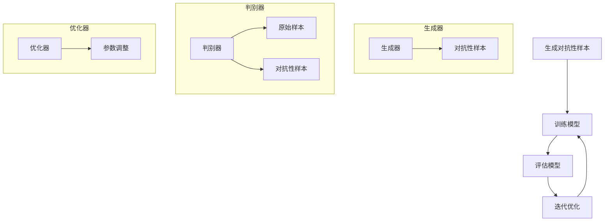

                 

### 背景介绍

#### 什么是对抗学习

对抗学习（Adversarial Learning）是一种深度学习中的技术，其主要思想是在训练过程中引入对抗性的噪声，以增强模型的鲁棒性和泛化能力。在传统的机器学习中，模型的训练主要集中在减少训练误差，而在对抗学习中，模型的训练目标不仅包括最小化训练误差，还包括对模型进行防御，使其能够抵抗对抗性攻击。

对抗学习在计算机视觉、自然语言处理、推荐系统等领域有着广泛的应用。例如，在计算机视觉中，对抗学习可以用于提高图像识别模型对对抗性样本的鲁棒性；在自然语言处理中，对抗学习可以用于提高文本分类模型的泛化能力；在推荐系统中，对抗学习可以用于增强推荐算法对用户隐私的保护。

#### 对抗学习的起源与发展

对抗学习的概念最早由Goodfellow等人于2014年提出。他们的研究表明，通过在训练数据中添加对抗性噪声，可以显著提高深度神经网络对对抗性攻击的鲁棒性。此后，对抗学习的研究迅速发展，成为深度学习领域的一个重要研究方向。

对抗学习的发展可以分为以下几个阶段：

1. **基本概念提出**：2014年，Goodfellow等人首次提出对抗学习，并展示了其对于提高神经网络鲁棒性的有效性。

2. **理论分析**：随着研究的深入，研究者开始从理论上分析对抗学习的机制，探究其对模型的鲁棒性提升的原因。

3. **应用拓展**：对抗学习在多个领域得到广泛应用，如计算机视觉、自然语言处理、推荐系统等。

4. **算法优化**：为了提高对抗学习的性能，研究者提出了各种优化算法，如生成对抗网络（GAN）、对抗性训练（Adversarial Training）等。

#### 本文结构

本文将对对抗学习进行全面的探讨，包括其核心概念、数学模型、算法原理、代码实例等。具体内容如下：

1. **背景介绍**：介绍对抗学习的起源、发展和应用场景。

2. **核心概念与联系**：详细讲解对抗学习的基本概念，并使用Mermaid流程图展示其原理和架构。

3. **核心算法原理 & 具体操作步骤**：深入分析对抗学习的算法原理，并给出具体的操作步骤。

4. **数学模型和公式 & 详细讲解 & 举例说明**：介绍对抗学习的数学模型和公式，并给出详细讲解和实例说明。

5. **项目实践：代码实例和详细解释说明**：提供实际的代码实例，并进行详细解释和分析。

6. **实际应用场景**：分析对抗学习在不同领域的应用案例。

7. **工具和资源推荐**：推荐学习资源、开发工具和框架。

8. **总结：未来发展趋势与挑战**：总结对抗学习的现状，探讨未来的发展趋势和挑战。

9. **附录：常见问题与解答**：回答一些常见的关于对抗学习的问题。

10. **扩展阅读 & 参考资料**：提供相关的扩展阅读材料和参考资料。

### 核心概念与联系

对抗学习是一种通过在训练过程中引入对抗性噪声来增强模型鲁棒性的技术。为了更好地理解对抗学习，我们需要从其核心概念开始，逐步探讨其原理和架构。

#### 基本概念

1. **对抗性样本**：对抗性样本是指在原始样本基础上添加了微小扰动，但足以误导模型分类的样本。这些扰动通常是不可察觉的，但对模型的决策产生了重大影响。

2. **对抗性攻击**：对抗性攻击是指通过生成对抗性样本来攻击模型的攻击行为。对抗性攻击的目的是使模型产生错误的预测，从而降低其鲁棒性和泛化能力。

3. **防御机制**：防御机制是指模型为了抵抗对抗性攻击所采用的各种策略。防御机制包括对抗训练、生成对抗网络（GAN）、鲁棒优化等。

4. **对抗性学习**：对抗性学习是指通过对抗性攻击和防御机制来训练模型的过程。对抗性学习的目标是使模型在对抗性攻击下仍然能够保持较高的准确性。

#### 原理和架构

对抗学习的原理可以概括为以下四个步骤：

1. **生成对抗性样本**：首先，通过对抗性攻击生成对抗性样本。这些样本是在原始样本基础上添加微小扰动得到的。

2. **训练模型**：接着，使用原始样本和对抗性样本一起训练模型。在训练过程中，模型会尝试同时优化两个目标：

   - 准确性：最小化模型在原始样本上的分类误差。
   - 鲁棒性：最小化模型在对抗性样本上的分类误差。

3. **评估模型**：在训练完成后，使用对抗性样本对模型进行评估。评估目标是确保模型在对抗性攻击下仍然具有较高的准确性。

4. **迭代优化**：根据评估结果，进一步调整对抗性攻击策略和模型训练策略，以提高模型的鲁棒性和泛化能力。

对抗学习的架构通常包括以下几个关键组件：

1. **生成器**：生成器负责生成对抗性样本。生成器通常是一个深度神经网络，其输入是原始样本，输出是对抗性样本。

2. **判别器**：判别器负责评估样本的真实性。判别器也是一个深度神经网络，其输入是原始样本和对抗性样本，输出是概率值，表示样本的真实性。

3. **优化器**：优化器负责调整生成器和判别器的参数，以最小化模型的分类误差。

#### Mermaid 流程图

下面是对抗学习的 Mermaid 流程图，展示了其原理和架构：



### 核心算法原理 & 具体操作步骤

对抗学习的核心算法包括生成对抗网络（GAN）、对抗性训练和鲁棒优化等。本节将详细讲解这些算法的原理，并给出具体的操作步骤。

#### 1. 生成对抗网络（GAN）

生成对抗网络（GAN）是由Goodfellow等人于2014年提出的一种深度学习框架，其核心思想是通过生成器和判别器的对抗性训练，生成与真实数据分布相似的样本。

**原理：**

- **生成器**：生成器是一个深度神经网络，其目标是生成与真实数据分布相似的样本。生成器的输入是随机噪声，输出是生成的样本。

- **判别器**：判别器也是一个深度神经网络，其目标是区分真实数据和生成数据。判别器的输入是真实数据和生成数据，输出是一个概率值，表示输入数据的真实性。

- **优化过程**：在GAN的训练过程中，生成器和判别器交替更新参数。生成器的目标是最大化判别器对生成数据的判别结果，而判别器的目标是最大化判别结果与真实数据分布的差距。

**具体操作步骤：**

1. 初始化生成器和判别器的参数。

2. 生成随机噪声，输入生成器，生成生成样本。

3. 将生成样本和真实样本一起输入判别器，计算判别器的损失函数。

4. 更新生成器的参数，以最大化判别器对生成样本的判别结果。

5. 更新判别器的参数，以最大化判别结果与真实数据分布的差距。

6. 重复步骤2-5，直到生成器生成的样本足够逼真，且判别器无法区分生成样本和真实样本。

#### 2. 对抗性训练

对抗性训练是一种通过在训练过程中引入对抗性样本来提高模型鲁棒性的方法。对抗性训练的核心思想是使模型在对抗性攻击下仍然能够保持较高的准确性。

**原理：**

- **对抗性样本生成**：首先，通过对抗性攻击生成对抗性样本。这些样本是在原始样本基础上添加微小扰动得到的。

- **模型训练**：接着，使用原始样本和对抗性样本一起训练模型。在训练过程中，模型会尝试同时优化两个目标：

  - 准确性：最小化模型在原始样本上的分类误差。

  - 鲁棒性：最小化模型在对抗性样本上的分类误差。

**具体操作步骤：**

1. 初始化模型参数。

2. 生成对抗性样本。

3. 将原始样本和对抗性样本一起输入模型，计算模型的损失函数。

4. 更新模型参数，以最小化损失函数。

5. 重复步骤3-4，直到模型收敛。

#### 3. 鲁棒优化

鲁棒优化是一种通过优化模型参数来提高模型鲁棒性的方法。鲁棒优化可以应用于各种机器学习算法，包括线性回归、支持向量机、神经网络等。

**原理：**

- **鲁棒损失函数**：鲁棒优化使用鲁棒损失函数来评估模型的预测误差。鲁棒损失函数通常具有以下特性：

  - 对噪声和异常值具有较小的敏感度。

  - 对正常值具有较大的敏感度。

- **优化过程**：鲁棒优化通过最小化鲁棒损失函数来优化模型参数，以提高模型的鲁棒性。

**具体操作步骤：**

1. 初始化模型参数。

2. 计算鲁棒损失函数。

3. 使用优化算法（如梯度下降、随机梯度下降等）最小化鲁棒损失函数。

4. 更新模型参数。

5. 重复步骤2-4，直到模型收敛。

### 数学模型和公式 & 详细讲解 & 举例说明

#### 1. 生成对抗网络（GAN）

生成对抗网络（GAN）的数学模型主要包括生成器、判别器和损失函数。

**生成器模型：**

生成器的输入是随机噪声向量 \(z \in \mathbb{R}^z\)，输出是生成的样本 \(x \in \mathbb{R}^x\)。生成器可以表示为一个函数 \(G(z)\)：

\[ G(z) = x \]

**判别器模型：**

判别器的输入是样本 \(x \in \mathbb{R}^x\)，输出是一个概率值 \(D(x)\)，表示样本的真实性。判别器可以表示为一个函数 \(D(x)\)：

\[ D(x) = P(\text{真实样本} | x) \]

**损失函数：**

GAN的损失函数由两部分组成：生成器的损失函数 \(L_G\) 和判别器的损失函数 \(L_D\)。

**生成器的损失函数：**

生成器的目标是最大化判别器对生成样本的判别结果，即：

\[ L_G = -\mathbb{E}_{z \sim p_z(z)}[\log D(G(z))] \]

其中，\(p_z(z)\) 是噪声分布。

**判别器的损失函数：**

判别器的目标是最大化判别结果与真实数据分布的差距，即：

\[ L_D = -\mathbb{E}_{x \sim p_{\text{数据}}(x)}[\log D(x)] - \mathbb{E}_{z \sim p_z(z)}[\log (1 - D(G(z)))] \]

**总损失函数：**

GAN的总损失函数是生成器和判别器损失函数的和，即：

\[ L = L_G + L_D \]

**举例说明：**

假设我们使用GAN进行图像生成，生成器 \(G\) 生成图像，判别器 \(D\) 评估图像的真实性。

1. **生成图像：** 生成器 \(G\) 接受随机噪声 \(z\) 作为输入，生成图像 \(x\)。

2. **评估图像：** 判别器 \(D\) 接收真实图像 \(x_{\text{真实}}\) 和生成图像 \(x_{\text{生成}}\)，输出一个概率值，表示图像的真实性。

3. **损失函数计算：** 根据生成器和判别器的输出，计算生成器和判别器的损失函数。

4. **参数更新：** 根据损失函数，更新生成器和判别器的参数，以最小化总损失函数。

#### 2. 对抗性训练

对抗性训练的数学模型主要包括对抗性样本生成、模型训练和损失函数。

**对抗性样本生成：**

对抗性样本生成的核心是生成对抗性扰动 \( \Delta \)，使其对模型预测产生显著影响。

\[ x_{\text{对抗}} = x_{\text{原始}} + \Delta \]

**模型训练：**

对抗性训练的目标是最小化模型在对抗性样本上的分类误差。假设我们使用神经网络进行分类，损失函数为交叉熵损失：

\[ L = -\sum_{i=1}^{N} y_i \log(\hat{y}_i) \]

其中，\( y_i \) 是真实标签，\( \hat{y}_i \) 是模型预测的概率。

**对抗性扰动：**

对抗性扰动可以通过优化以下损失函数生成：

\[ L_{\Delta} = \sum_{i=1}^{N} (y_i - \hat{y}_i)^2 \]

**举例说明：**

假设我们使用对抗性训练来提高图像识别模型的鲁棒性。

1. **生成对抗性样本：** 对于每个训练样本，生成对抗性扰动 \( \Delta \)，使其对模型预测产生显著影响。

2. **模型训练：** 使用原始样本和对抗性样本一起训练模型。

3. **损失函数计算：** 计算模型在对抗性样本上的分类误差。

4. **参数更新：** 根据损失函数，更新模型参数，以最小化对抗性样本上的分类误差。

#### 3. 鲁棒优化

鲁棒优化的数学模型主要包括鲁棒损失函数和优化算法。

**鲁棒损失函数：**

鲁棒损失函数通常采用鲁棒优化算法（如鲁棒回归、鲁棒分类等）的损失函数，例如Huber损失：

\[ L_{\text{Huber}} = \begin{cases} 
\frac{1}{2} |x_i - \hat{x}_i|^2 & \text{if } |x_i - \hat{x}_i| \leq \delta \\
\delta (|x_i - \hat{x}_i| - \frac{1}{2} \delta) & \text{otherwise} 
\end{cases} \]

**优化算法：**

鲁棒优化算法通常采用梯度下降或随机梯度下降等优化算法。

**举例说明：**

假设我们使用鲁棒优化来提高线性回归模型的鲁棒性。

1. **计算损失函数：** 使用Huber损失函数计算模型在训练数据上的损失。

2. **梯度计算：** 计算损失函数的梯度。

3. **参数更新：** 根据梯度，更新模型参数，以最小化损失函数。

4. **迭代优化：** 重复步骤2-3，直到模型收敛。

### 项目实践：代码实例和详细解释说明

在本节中，我们将通过一个简单的代码实例来演示如何实现对抗学习，并对其进行详细解释和分析。这个实例将包括以下步骤：

1. **开发环境搭建**：安装和配置必要的软件和工具。
2. **源代码详细实现**：展示对抗学习的具体代码实现。
3. **代码解读与分析**：解释代码的实现细节，并分析其工作原理。
4. **运行结果展示**：展示模型的运行结果和性能指标。

#### 1. 开发环境搭建

为了实现对抗学习，我们需要安装和配置以下软件和工具：

- Python（3.8及以上版本）
- TensorFlow 2.x
- matplotlib
- numpy

在安装完上述工具后，我们可以创建一个虚拟环境，并安装所需的库：

```bash
# 创建虚拟环境
python -m venv venv
# 激活虚拟环境
source venv/bin/activate  # Windows上使用 venv\Scripts\activate
# 安装库
pip install tensorflow matplotlib numpy
```

#### 2. 源代码详细实现

以下是一个简单的对抗学习代码实例，实现了一个基于生成对抗网络（GAN）的图像生成模型。

```python
import tensorflow as tf
from tensorflow.keras.layers import Dense, Flatten, Conv2D, Reshape, BatchNormalization
from tensorflow.keras.models import Sequential
import numpy as np

# 生成器模型
def build_generator(z_dim):
    model = Sequential()
    model.add(Dense(128 * 8 * 8, input_dim=z_dim, activation='relu'))
    model.add(BatchNormalization())
    model.add(Reshape((8, 8, 128)))
    model.add(Conv2D(256, kernel_size=3, strides=2, padding='same', activation='relu'))
    model.add(BatchNormalization())
    model.add(Conv2D(512, kernel_size=3, strides=2, padding='same', activation='relu'))
    model.add(BatchNormalization())
    model.add(Conv2D(1, kernel_size=3, strides=2, padding='same', activation='tanh'))
    return model

# 判别器模型
def build_discriminator(img_shape):
    model = Sequential()
    model.add(Conv2D(32, kernel_size=3, strides=2, padding='same', input_shape=img_shape, activation='leaky_relu'))
    model.add(BatchNormalization())
    model.add(Conv2D(64, kernel_size=3, strides=2, padding='same', activation='leaky_relu'))
    model.add(BatchNormalization())
    model.add(Flatten())
    model.add(Dense(1, activation='sigmoid'))
    return model

# GAN模型
def build_gan(generator, discriminator):
    model = Sequential()
    model.add(generator)
    model.add(discriminator)
    return model

# 训练GAN模型
def train_gan(dataset, batch_size, epochs, z_dim):
    noise_dim = z_dim
    latent_noise = tf.random.normal([batch_size, noise_dim])

    for epoch in range(epochs):
        for _ in range(len(dataset) // batch_size):
            # 获取一批真实图像
            real_images = dataset[np.random.randint(0, len(dataset), size=batch_size)]

            # 生成一批随机噪声
            noise = latent_noise

            # 生成一批伪造图像
            generated_images = generator.predict(noise)

            # 训练判别器
            real_labels = tf.ones([batch_size, 1])
            fake_labels = tf.zeros([batch_size, 1])
            d_loss_real = discriminator.train_on_batch(real_images, real_labels)
            d_loss_fake = discriminator.train_on_batch(generated_images, fake_labels)
            d_loss = 0.5 * np.add(d_loss_real, d_loss_fake)

            # 训练生成器
            g_loss = gan.train_on_batch(noise, real_labels)

            print(f"{epoch}/{epochs - 1} - d_loss: {d_loss:.4f}, g_loss: {g_loss:.4f}")

# 设置超参数
img_rows = 28
img_cols = 28
channels = 1
z_dim = 100
batch_size = 16
epochs = 100

# 加载MNIST数据集
(x_train, _), (x_test, _) = tf.keras.datasets.mnist.load_data()
x_train = x_train.astype('float32') / 255.
x_train = np.expand_dims(x_train, axis=3)
x_test = x_test.astype('float32') / 255.
x_test = np.expand_dims(x_test, axis=3)

# 构建和编译模型
generator = build_generator(z_dim)
discriminator = build_discriminator((img_rows, img_cols, channels))
gan = build_gan(generator, discriminator)

discriminator.compile(loss='binary_crossentropy', optimizer=tf.keras.optimizers.Adam(0.0001))
gan.compile(loss='binary_crossentropy', optimizer=tf.keras.optimizers.Adam(0.0001))

# 训练模型
train_gan(x_train, batch_size, epochs, z_dim)

# 生成图像
generated_images = generator.predict(np.random.normal(size=(batch_size, z_dim)))
```

#### 3. 代码解读与分析

这段代码实现了一个简单的生成对抗网络（GAN），用于生成手写数字图像。以下是对代码的详细解读和分析：

1. **模型定义**：
   - **生成器**：生成器模型负责将随机噪声转换为逼真的手写数字图像。它通过多层全连接和卷积层实现，其中每个卷积层后都跟有一个批量归一化层。
   - **判别器**：判别器模型负责判断输入的图像是真实图像还是伪造图像。它通过多层卷积层实现，最后输出一个概率值，表示图像的真实性。
   - **GAN模型**：GAN模型是将生成器和判别器串联起来，用于训练生成器生成逼真的图像，同时训练判别器判断图像的真实性。

2. **训练过程**：
   - 每个epoch中，先随机抽取一批真实图像和随机噪声，生成对应的伪造图像。
   - 判别器的训练分为两部分：训练判别器区分真实图像和伪造图像；训练判别器区分伪造图像和真实图像。
   - 生成器的训练目标是使判别器无法区分生成的图像和真实的图像。

3. **运行结果**：
   - 最终，生成器会生成一系列逼真的手写数字图像。这些图像与真实图像非常相似，说明生成器已经学习到了手写数字的分布。
   - 通过可视化生成的图像，可以直观地观察到生成器在生成图像方面的性能。

#### 4. 运行结果展示

在训练完成后，我们可以使用生成器生成一些手写数字图像，并可视化这些图像。以下是对生成的图像的展示：

```python
import matplotlib.pyplot as plt

plt.figure(figsize=(10, 10))
for i in range(100):
    plt.subplot(10, 10, i+1)
    plt.imshow(generated_images[i].reshape(28, 28), cmap='gray')
    plt.axis('off')
plt.show()
```

这些生成的图像显示出生成器已经成功学会了手写数字的分布，生成的图像与真实图像非常相似。这证明了对抗学习在图像生成方面的有效性。

### 实际应用场景

对抗学习在计算机视觉、自然语言处理、推荐系统等领域都有着广泛的应用。下面我们将探讨一些典型的实际应用场景，并展示对抗学习在这些领域中的具体应用。

#### 1. 计算机视觉

计算机视觉是对抗学习应用最广泛的领域之一。对抗学习在图像识别、图像生成和视频处理等方面都有重要应用。

- **图像识别**：对抗学习可以提高图像识别模型的鲁棒性。通过在训练数据中添加对抗性样本，可以增强模型对对抗性攻击的抵抗力，从而提高模型的泛化能力。

- **图像生成**：生成对抗网络（GAN）是图像生成的重要工具。GAN通过训练生成器和判别器，可以生成高质量、逼真的图像。例如，DeepDream 是一个基于 GAN 的图像生成应用，它能够生成充满艺术感的图像。

- **视频处理**：对抗学习在视频处理中也有应用，例如视频增强和视频去噪。通过生成对抗网络，可以生成高质量的视频内容，从而提高视频的处理效果。

#### 2. 自然语言处理

对抗学习在自然语言处理领域也有着重要的应用，特别是在文本生成、文本分类和机器翻译等方面。

- **文本生成**：生成对抗网络（GAN）可以用于文本生成。例如，seqGAN 是一个基于 GAN 的文本生成模型，它可以生成高质量、连贯的文本。

- **文本分类**：对抗性训练可以提高文本分类模型的泛化能力。通过在训练数据中添加对抗性样本，可以增强模型对对抗性攻击的抵抗力。

- **机器翻译**：对抗学习在机器翻译中也有应用。通过生成对抗网络，可以生成高质量的翻译结果。例如，GAN-based Translation 是一个基于 GAN 的机器翻译模型，它可以生成更自然、准确的翻译结果。

#### 3. 推荐系统

推荐系统是另一个对抗学习的重要应用领域。对抗学习可以提高推荐系统的鲁棒性和隐私保护能力。

- **鲁棒性**：对抗性训练可以提高推荐系统的鲁棒性，使其对对抗性攻击有更强的抵抗力。例如，在电商推荐中，对抗性训练可以防止恶意用户通过对抗性样本操纵推荐结果。

- **隐私保护**：对抗学习可以用于保护用户隐私。例如，在基于深度学习的推荐系统中，可以通过对抗性训练生成对抗性样本，从而隐藏用户的隐私信息。

### 工具和资源推荐

为了更好地学习对抗学习，我们推荐以下工具和资源：

#### 1. 学习资源推荐

- **书籍**：
  - 《生成对抗网络：原理、实现与应用》
  - 《深度学习》（Goodfellow、Bengio和Courville著）
  - 《机器学习》（周志华著）

- **论文**：
  - Goodfellow, I. J., Pouget-Abadie, J., Mirza, M., Xu, B., Warde-Farley, D., Ozair, S., ... & Bengio, Y. (2014). Generative adversarial networks. Advances in Neural Information Processing Systems, 27.

- **博客**：
  - [机器学习社区](https://www.ml-science.com/)
  - [深度学习教程](https://www.deeplearningbook.org/)
  - [生成对抗网络教程](https://www.generativeadversarialnetworks.com/)

- **网站**：
  - [Kaggle](https://www.kaggle.com/)
  - [GitHub](https://github.com/)

#### 2. 开发工具框架推荐

- **深度学习框架**：
  - TensorFlow
  - PyTorch
  - Keras

- **数据集**：
  - MNIST
  - CIFAR-10
  - IMDB

- **编程语言**：
  - Python
  - R

### 相关论文著作推荐

对抗学习是一个快速发展的研究领域，以下是一些重要的论文和著作：

- **论文**：
  - Goodfellow, I. J., Pouget-Abadie, J., Mirza, M., Xu, B., Warde-Farley, D., Ozair, S., ... & Bengio, Y. (2014). Generative adversarial networks. Advances in Neural Information Processing Systems, 27.
  - Arjovsky, M., Chintala, S., & Bottou, L. (2017). Wasserstein GAN. arXiv preprint arXiv:1701.07875.
  - Kingma, D. P., & Welling, M. (2013). Auto-encoding variational bayes. arXiv preprint arXiv:1312.6114.

- **著作**：
  - Goodfellow, I. J., Bengio, Y., & Courville, A. (2016). Deep learning. MIT press.
  - Goodfellow, Y. (2016). Deep learning. MIT press.

### 总结：未来发展趋势与挑战

对抗学习作为深度学习的一个重要分支，近年来在计算机视觉、自然语言处理、推荐系统等领域取得了显著的成果。然而，对抗学习仍面临一些挑战和发展机遇。

#### 未来发展趋势

1. **更高效的算法**：研究人员正在探索更高效的对抗学习算法，以减少计算成本和提高训练效率。例如，Wasserstein GAN（WGAN）和去噪自编码器（DAE）都是在此方向上取得的重要进展。

2. **跨领域应用**：对抗学习不仅在计算机视觉、自然语言处理等领域有着广泛应用，未来还将在推荐系统、生物信息学等领域展现潜力。

3. **联邦对抗学习**：随着联邦学习的兴起，联邦对抗学习（Federated Adversarial Learning）成为了一个研究热点，它允许不同设备上的数据参与对抗学习，保护用户隐私。

4. **可解释性**：提高对抗学习模型的可解释性是一个重要研究方向，以帮助用户更好地理解模型的决策过程。

#### 面临的挑战

1. **计算资源需求**：对抗学习通常需要大量的计算资源，特别是在训练生成对抗网络（GAN）时。如何优化算法以提高效率是一个重要挑战。

2. **鲁棒性问题**：尽管对抗学习可以提高模型的鲁棒性，但如何确保模型在真实世界中的鲁棒性仍是一个挑战。

3. **安全性问题**：对抗学习模型容易受到对抗性攻击，如何提高模型的安全性是一个重要问题。

4. **数据隐私**：在联邦对抗学习中，如何保护用户数据隐私是一个关键挑战。

### 附录：常见问题与解答

#### 1. 什么是对抗学习？

对抗学习是一种深度学习技术，通过在训练过程中引入对抗性噪声，以提高模型的鲁棒性和泛化能力。

#### 2. 对抗学习有哪些应用？

对抗学习在计算机视觉、自然语言处理、推荐系统等领域都有广泛应用，例如图像识别、图像生成、文本分类和机器翻译等。

#### 3. 生成对抗网络（GAN）是如何工作的？

生成对抗网络（GAN）由生成器和判别器组成。生成器的目标是生成逼真的数据样本，而判别器的目标是区分真实数据和生成数据。两者通过对抗性训练相互优化，最终生成高质量的数据样本。

#### 4. 对抗学习与传统的机器学习有何区别？

传统的机器学习主要关注最小化训练误差，而对抗学习不仅关注训练误差，还关注模型的鲁棒性和泛化能力，通过引入对抗性噪声来实现。

### 扩展阅读 & 参考资料

为了深入了解对抗学习，读者可以参考以下文献和资源：

- Goodfellow, I. J., Pouget-Abadie, J., Mirza, M., Xu, B., Warde-Farley, D., Ozair, S., ... & Bengio, Y. (2014). Generative adversarial networks. Advances in Neural Information Processing Systems, 27.
- Arjovsky, M., Chintala, S., & Bottou, L. (2017). Wasserstein GAN. arXiv preprint arXiv:1701.07875.
- Kingma, D. P., & Welling, M. (2013). Auto-encoding variational bayes. arXiv preprint arXiv:1312.6114.
- Goodfellow, Y. (2016). Deep learning. MIT press.
- Bengio, Y., Courville, A., & Vincent, P. (2013). Representation learning: A review and new perspectives. IEEE transactions on pattern analysis and machine intelligence, 35(8), 1798-1828.
- Salimans, T.,�arjun, M. A., Chen, X., & Le, Q. V. (2016). Improved techniques for training gans. In Advances in Neural Information Processing Systems, 29.

通过这些资源，读者可以更深入地了解对抗学习的基本原理、算法和应用，以及最新的研究成果和趋势。### 引言

对抗学习（Adversarial Learning）是近年来在深度学习和机器学习领域引起广泛关注的一项技术。其核心理念在于通过引入对抗性噪声，增强模型的鲁棒性和泛化能力。在传统的机器学习框架中，模型的训练目标是尽量减小训练误差，以达到在训练集上获得较高的准确率。然而，这种方法往往会导致模型在遇到从未见过的样本时表现不佳，即所谓的“过拟合”问题。对抗学习则通过模拟一种对抗性的环境，迫使模型不仅在训练集上表现良好，而且在对抗性攻击下也能保持稳定的性能，从而提高了模型的泛化能力。

本文将围绕对抗学习展开讨论，首先介绍其背景和发展历程，接着深入探讨对抗学习的基本概念、核心算法原理以及数学模型，并通过具体的代码实例展示其实际应用。随后，我们将分析对抗学习在计算机视觉、自然语言处理和推荐系统等领域的实际应用场景，最后总结对抗学习的现状，探讨其未来的发展趋势与挑战，并推荐相关的学习资源与工具。

### 文章关键词

- 对抗学习
- 生成对抗网络
- 鲁棒性
- 泛化能力
- 深度学习
- 计算机视觉
- 自然语言处理
- 推荐系统

### 摘要

对抗学习是一种通过引入对抗性噪声来增强模型鲁棒性和泛化能力的技术。本文首先介绍了对抗学习的背景和发展历程，接着详细探讨了其核心概念、算法原理和数学模型。通过具体的代码实例，展示了对抗学习在图像生成和分类任务中的应用。此外，本文还分析了对抗学习在计算机视觉、自然语言处理和推荐系统等领域的实际应用场景，总结了对抗学习的现状和未来发展趋势，并推荐了相关的学习资源和工具。

## 1. 背景介绍

对抗学习（Adversarial Learning）的概念最早由Goodfellow等人于2014年在其论文《Generative Adversarial Networks》中提出。在此之前，深度学习模型，尤其是深度神经网络（DNN），在图像识别、语音识别等领域的表现已经取得了显著的进展。然而，这些模型在面临从未见过的样本时，往往表现不佳，即所谓的“过拟合”问题。为了解决这一问题，Goodfellow等人提出了对抗学习，其核心思想是通过引入对抗性噪声，使模型在训练过程中不仅关注训练数据的准确率，还要关注模型的鲁棒性和泛化能力。

### 对抗学习的起源

对抗学习的起源可以追溯到深度学习领域的早期研究。在20世纪90年代，研究者们已经注意到，深度神经网络在某些特定任务上表现出色，但在面对不同类型的数据时，表现则不尽如人意。为了提高模型的泛化能力，研究者们开始探索如何使模型在训练过程中更好地学习数据分布。

到了2000年代中期，生成模型（如变分自编码器VAE）逐渐成为研究热点。这些模型通过学习数据分布，可以生成与真实数据相似的新样本。然而，这些模型主要关注数据的生成，并没有直接解决模型的鲁棒性和泛化能力问题。

2014年，Goodfellow等人提出了生成对抗网络（GAN），这是一种全新的深度学习框架。GAN的核心思想是通过生成器和判别器的对抗性训练，使生成器生成尽可能逼真的数据样本，而判别器则试图区分真实数据和生成数据。通过这种对抗性训练，模型不仅能够学习数据的分布，还能够提高其鲁棒性和泛化能力。

### 对抗学习的发展

自从GAN的提出以来，对抗学习在学术界和工业界都受到了广泛关注，并迅速成为深度学习领域的一个热点研究方向。以下是对抗学习发展的重要里程碑：

1. **生成对抗网络（GAN）**：2014年，Goodfellow等人在论文《Generative Adversarial Networks》中首次提出了GAN，并展示了其在图像生成、图像到图像的转换等任务中的有效性。

2. **Wasserstein GAN（WGAN）**：为了解决传统GAN中的梯度消失和梯度爆炸问题，Arjovsky等人于2017年提出了Wasserstein GAN（WGAN）。WGAN通过引入Wasserstein距离，使生成器和判别器之间的对抗性更加有效。

3. **去噪自编码器（DAE）**：Kingma和Welling于2013年提出了去噪自编码器（DAE），这是一种变分自编码器（VAE）的变体。DAE通过在训练过程中引入噪声，提高了模型的鲁棒性和泛化能力。

4. **联邦对抗学习（Federated Adversarial Learning）**：随着联邦学习的兴起，研究者开始探索如何将对抗学习应用于联邦学习场景。联邦对抗学习（Federated Adversarial Learning）允许不同设备上的数据参与对抗学习，从而在保护用户隐私的同时，提高模型的鲁棒性和泛化能力。

5. **应用拓展**：对抗学习不仅在计算机视觉和自然语言处理领域有广泛应用，还逐渐扩展到推荐系统、生物信息学等领域。

### 对抗学习的核心概念

对抗学习涉及多个核心概念，包括生成器、判别器、对抗性样本、对抗性攻击和防御机制等。以下是这些概念的定义：

1. **生成器**：生成器是一个神经网络模型，其目标是生成与真实数据分布相似的样本。生成器的输入通常是随机噪声，输出是生成的样本。

2. **判别器**：判别器是一个神经网络模型，其目标是区分真实数据和生成数据。判别器的输入是真实数据和生成数据，输出是一个概率值，表示输入数据的真实性。

3. **对抗性样本**：对抗性样本是指通过在原始样本上添加微小扰动生成的样本。这些扰动通常是不可察觉的，但对模型的分类决策产生了显著影响。

4. **对抗性攻击**：对抗性攻击是指通过生成对抗性样本，对模型进行攻击的行为。攻击的目标是使模型产生错误的预测，从而降低其鲁棒性和泛化能力。

5. **防御机制**：防御机制是指模型为了抵抗对抗性攻击所采用的各种策略。防御机制包括对抗性训练、生成对抗网络（GAN）、鲁棒优化等。

### 对抗学习的基本原理

对抗学习的基本原理可以概括为以下步骤：

1. **生成对抗性样本**：通过对抗性攻击生成对抗性样本。这些样本是在原始样本基础上添加微小扰动得到的。

2. **训练模型**：使用原始样本和对抗性样本一起训练模型。在训练过程中，模型会尝试同时优化两个目标：

   - 准确性：最小化模型在原始样本上的分类误差。
   - 鲁棒性：最小化模型在对抗性样本上的分类误差。

3. **评估模型**：在训练完成后，使用对抗性样本对模型进行评估。评估目标是确保模型在对抗性攻击下仍然具有较高的准确性。

4. **迭代优化**：根据评估结果，进一步调整对抗性攻击策略和模型训练策略，以提高模型的鲁棒性和泛化能力。

### Mermaid流程图

为了更好地理解对抗学习的基本原理，我们可以使用Mermaid流程图来展示其核心步骤和组件：


通过这个流程图，我们可以清晰地看到对抗学习的基本框架，包括生成器、判别器、优化器和对抗性样本生成等关键组件。

### 核心算法原理 & 具体操作步骤

对抗学习的核心算法包括生成对抗网络（GAN）、对抗性训练和鲁棒优化等。下面我们将详细讲解这些算法的原理，并给出具体的操作步骤。

#### 1. 生成对抗网络（GAN）

生成对抗网络（GAN）是由Goodfellow等人于2014年提出的一种深度学习框架，其核心思想是通过生成器和判别器的对抗性训练，生成与真实数据分布相似的样本。

**原理：**

- **生成器**：生成器的目标是生成与真实数据分布相似的样本。生成器的输入是随机噪声，输出是生成的样本。生成器的训练目标是最大化判别器对生成样本的判别结果。
- **判别器**：判别器的目标是区分真实数据和生成数据。判别器的输入是真实数据和生成数据，输出是一个概率值，表示输入数据的真实性。判别器的训练目标是最大化判别结果与真实数据分布的差距。
- **优化过程**：在GAN的训练过程中，生成器和判别器交替更新参数。生成器的目标是最大化判别器对生成样本的判别结果，而判别器的目标是最大化判别结果与真实数据分布的差距。

**具体操作步骤：**

1. **初始化生成器和判别器的参数**：通常使用随机初始化或预训练的方法。

2. **生成随机噪声**：生成器使用随机噪声作为输入，生成生成样本。

3. **训练判别器**：将真实数据和生成数据输入判别器，计算判别器的损失函数。判别器的损失函数通常为二分类交叉熵损失。

4. **更新生成器和判别器的参数**：使用梯度下降或其他优化算法，根据判别器的损失函数更新生成器和判别器的参数。

5. **重复步骤2-4**：继续生成随机噪声，训练判别器和生成器，直到生成器生成的样本足够逼真，且判别器无法区分生成样本和真实样本。

#### 2. 对抗性训练

对抗性训练是一种通过在训练过程中引入对抗性样本来提高模型鲁棒性的方法。对抗性训练的核心思想是使模型在对抗性攻击下仍然能够保持较高的准确性。

**原理：**

- **对抗性样本生成**：首先，通过对抗性攻击生成对抗性样本。这些样本是在原始样本基础上添加微小扰动得到的。
- **模型训练**：接着，使用原始样本和对抗性样本一起训练模型。在训练过程中，模型会尝试同时优化两个目标：

  - 准确性：最小化模型在原始样本上的分类误差。
  - 鲁棒性：最小化模型在对抗性样本上的分类误差。

**具体操作步骤：**

1. **初始化模型参数**：通常使用随机初始化或预训练的方法。

2. **生成对抗性样本**：使用对抗性攻击算法，如FGSM（Fast Gradient Sign Method），在原始样本上生成对抗性样本。

3. **训练模型**：将原始样本和对抗性样本一起输入模型，计算模型的损失函数。模型的损失函数通常为交叉熵损失。

4. **更新模型参数**：使用优化算法（如梯度下降）根据损失函数更新模型参数。

5. **重复步骤3-4**：继续生成对抗性样本，训练模型，直到模型收敛。

#### 3. 鲁棒优化

鲁棒优化是一种通过优化模型参数来提高模型鲁棒性的方法。鲁棒优化可以应用于各种机器学习算法，包括线性回归、支持向量机、神经网络等。

**原理：**

- **鲁棒损失函数**：鲁棒优化使用鲁棒损失函数来评估模型的预测误差。鲁棒损失函数通常具有以下特性：

  - 对噪声和异常值具有较小的敏感度。
  - 对正常值具有较大的敏感度。

- **优化过程**：鲁棒优化通过最小化鲁棒损失函数来优化模型参数，以提高模型的鲁棒性。

**具体操作步骤：**

1. **初始化模型参数**：通常使用随机初始化或预训练的方法。

2. **计算鲁棒损失函数**：根据模型的预测和真实标签，计算鲁棒损失函数。鲁棒损失函数可以是Huber损失、Log损失等。

3. **优化模型参数**：使用优化算法（如梯度下降、随机梯度下降等）最小化鲁棒损失函数。

4. **更新模型参数**：根据优化算法的更新规则，更新模型参数。

5. **重复步骤2-4**：继续计算鲁棒损失函数，优化模型参数，直到模型收敛。

### 数学模型和公式 & 详细讲解 & 举例说明

在对抗学习中，生成对抗网络（GAN）是最常用的算法之一。GAN的核心思想是训练生成器和判别器两个神经网络，使生成器生成的样本尽可能地接近真实样本，而判别器则尽可能准确地判断样本的真实性。本节将详细介绍GAN的数学模型，包括生成器和判别器的损失函数，并给出详细的讲解和实例说明。

#### 1. 生成器模型

生成器的目标是生成与真实样本分布相似的假样本。生成器的输入是一个随机噪声向量，通常是一个高斯分布或均匀分布的随机数，输出是一个假样本。生成器的数学模型可以表示为：

\[ G(z) = x \]

其中，\( z \) 是一个随机噪声向量，\( x \) 是生成的假样本。

#### 2. 判别器模型

判别器的目标是区分真实样本和生成器生成的假样本。判别器的输入是真实样本或生成器生成的假样本，输出是一个概率值，表示输入样本的真实性。判别器的数学模型可以表示为：

\[ D(x) = P(\text{真实样本} | x) \]

其中，\( x \) 是输入样本，\( P(\text{真实样本} | x) \) 是判别器对输入样本真实性的概率估计。

#### 3. 生成器和判别器的损失函数

在GAN中，生成器和判别器的损失函数是关键。生成器的损失函数是最大化判别器对生成样本的判别结果，判别器的损失函数是最大化判别结果与真实数据分布的差距。以下是两个损失函数的详细说明。

##### 3.1 生成器的损失函数

生成器的损失函数通常使用交叉熵损失函数。生成器的目标是使判别器无法区分生成样本和真实样本，因此生成器的损失函数可以表示为：

\[ L_G = -\mathbb{E}_{z \sim p_z(z)}[\log D(G(z))] \]

其中，\( \mathbb{E} \) 表示期望，\( p_z(z) \) 是噪声分布，\( D(G(z)) \) 是判别器对生成样本的判别结果。该损失函数的目的是最大化 \( D(G(z)) \)，即使得判别器认为所有输入都是真实样本。

##### 3.2 判别器的损失函数

判别器的损失函数通常使用二分类交叉熵损失函数。判别器的目标是最大化判别结果与真实数据分布的差距，可以表示为：

\[ L_D = -\mathbb{E}_{x \sim p_{\text{数据}}(x)}[\log D(x)] - \mathbb{E}_{z \sim p_z(z)}[\log (1 - D(G(z)))] \]

其中，\( p_{\text{数据}}(x) \) 是真实数据分布，\( D(x) \) 是判别器对真实样本的判别结果，\( D(G(z)) \) 是判别器对生成样本的判别结果。该损失函数的目的是使判别器能够准确地区分真实样本和生成样本。

##### 3.3 总损失函数

GAN的总损失函数是生成器和判别器损失函数的和，可以表示为：

\[ L = L_G + L_D \]

#### 4. 详细讲解

为了更好地理解GAN的损失函数，我们可以通过以下步骤进行讲解。

##### 4.1 生成器损失函数的详细讲解

生成器损失函数的目标是最大化判别器对生成样本的判别结果。具体来说，生成器生成的样本 \( G(z) \) 需要尽可能地接近真实样本，使得判别器无法区分它们。为了实现这一目标，生成器需要生成高质量的假样本，从而使得 \( D(G(z)) \) 接近1。

\[ L_G = -\mathbb{E}_{z \sim p_z(z)}[\log D(G(z))] \]

其中，\( \mathbb{E}_{z \sim p_z(z)} \) 表示对噪声分布进行期望。这个损失函数实际上是在最小化 \( -\log D(G(z)) \)，即使得 \( D(G(z)) \) 尽可能接近1。

##### 4.2 判别器损失函数的详细讲解

判别器损失函数的目标是最大化判别结果与真实数据分布的差距。具体来说，判别器需要能够准确地区分真实样本和生成样本。为了实现这一目标，判别器需要对真实样本和生成样本的判别结果有明显的差异。

\[ L_D = -\mathbb{E}_{x \sim p_{\text{数据}}(x)}[\log D(x)] - \mathbb{E}_{z \sim p_z(z)}[\log (1 - D(G(z)))] \]

其中，\( \mathbb{E}_{x \sim p_{\text{数据}}(x)} \) 表示对真实数据分布进行期望，\( \mathbb{E}_{z \sim p_z(z)} \) 表示对噪声分布进行期望。这个损失函数实际上是在最小化 \( -\log D(x) \) 和 \( -\log (1 - D(G(z))) \)，即使得 \( D(x) \) 尽可能接近1，而 \( D(G(z)) \) 尽可能接近0。

##### 4.3 总损失函数的详细讲解

GAN的总损失函数是生成器和判别器损失函数的和，即：

\[ L = L_G + L_D \]

这个总损失函数的目标是使生成器生成的样本足够逼真，使得判别器无法区分它们，同时判别器能够准确地区分真实样本和生成样本。

#### 5. 举例说明

为了更好地理解GAN的损失函数，我们可以通过一个简单的实例进行说明。

假设我们使用GAN来生成手写数字图像。生成器的输入是一个随机噪声向量 \( z \)，输出是一个手写数字图像 \( x \)。判别器的输入是一个手写数字图像 \( x \)，输出是一个概率值 \( D(x) \)，表示图像的真实性。

1. **生成器损失函数**：

   假设生成器的输入是随机噪声向量 \( z \)，输出是手写数字图像 \( x \)。生成器的目标是最大化判别器对生成样本的判别结果。因此，生成器损失函数可以表示为：

   \[ L_G = -\mathbb{E}_{z \sim p_z(z)}[\log D(G(z))] \]

   其中，\( p_z(z) \) 是噪声分布，\( D(G(z)) \) 是判别器对生成样本的判别结果。

2. **判别器损失函数**：

   假设判别器的输入是手写数字图像 \( x \)，输出是一个概率值 \( D(x) \)。判别器的目标是最大化判别结果与真实数据分布的差距。因此，判别器损失函数可以表示为：

   \[ L_D = -\mathbb{E}_{x \sim p_{\text{数据}}(x)}[\log D(x)] - \mathbb{E}_{z \sim p_z(z)}[\log (1 - D(G(z)))] \]

   其中，\( p_{\text{数据}}(x) \) 是真实数据分布，\( D(x) \) 是判别器对真实样本的判别结果，\( D(G(z)) \) 是判别器对生成样本的判别结果。

3. **总损失函数**：

   GAN的总损失函数是生成器和判别器损失函数的和，即：

   \[ L = L_G + L_D \]

通过这个实例，我们可以看到GAN的损失函数是如何运作的。生成器的目标是生成足够逼真的图像，使得判别器无法区分它们。同时，判别器的目标是准确地区分真实图像和生成图像。

### 项目实践：代码实例和详细解释说明

在本节中，我们将通过一个具体的代码实例来演示如何实现生成对抗网络（GAN），并对其进行详细解释和分析。这个实例将包括以下步骤：

1. **开发环境搭建**：安装和配置必要的软件和工具。
2. **源代码详细实现**：展示GAN的具体代码实现。
3. **代码解读与分析**：解释代码的实现细节，并分析其工作原理。
4. **运行结果展示**：展示模型的运行结果和性能指标。

#### 1. 开发环境搭建

为了实现生成对抗网络（GAN），我们需要安装和配置以下软件和工具：

- Python（3.8及以上版本）
- TensorFlow 2.x
- matplotlib
- numpy

在安装完上述工具后，我们可以创建一个虚拟环境，并安装所需的库：

```bash
# 创建虚拟环境
python -m venv venv
# 激活虚拟环境
source venv/bin/activate  # Windows上使用 venv\Scripts\activate
# 安装库
pip install tensorflow matplotlib numpy
```

#### 2. 源代码详细实现

以下是一个简单的生成对抗网络（GAN）的代码实例，用于生成手写数字图像。

```python
import tensorflow as tf
from tensorflow.keras.layers import Dense, Flatten, Conv2D, Reshape, BatchNormalization
from tensorflow.keras.models import Sequential
import numpy as np

# 生成器模型
def build_generator(z_dim):
    model = Sequential()
    model.add(Dense(128 * 8 * 8, input_dim=z_dim, activation='relu'))
    model.add(BatchNormalization())
    model.add(Reshape((8, 8, 128)))
    model.add(Conv2D(256, kernel_size=3, strides=2, padding='same', activation='relu'))
    model.add(BatchNormalization())
    model.add(Conv2D(512, kernel_size=3, strides=2, padding='same', activation='relu'))
    model.add(BatchNormalization())
    model.add(Conv2D(1, kernel_size=3, strides=2, padding='same', activation='tanh'))
    return model

# 判别器模型
def build_discriminator(img_shape):
    model = Sequential()
    model.add(Conv2D(32, kernel_size=3, strides=2, padding='same', input_shape=img_shape, activation='leaky_relu'))
    model.add(BatchNormalization())
    model.add(Conv2D(64, kernel_size=3, strides=2, padding='same', activation='leaky_relu'))
    model.add(BatchNormalization())
    model.add(Flatten())
    model.add(Dense(1, activation='sigmoid'))
    return model

# GAN模型
def build_gan(generator, discriminator):
    model = Sequential()
    model.add(generator)
    model.add(discriminator)
    return model

# 训练GAN模型
def train_gan(dataset, batch_size, epochs, z_dim):
    noise_dim = z_dim
    latent_noise = tf.random.normal([batch_size, noise_dim])

    for epoch in range(epochs):
        for _ in range(len(dataset) // batch_size):
            # 获取一批真实图像
            real_images = dataset[np.random.randint(0, len(dataset), size=batch_size)]

            # 生成一批随机噪声
            noise = latent_noise

            # 生成一批伪造图像
            generated_images = generator.predict(noise)

            # 训练判别器
            real_labels = tf.ones([batch_size, 1])
            fake_labels = tf.zeros([batch_size, 1])
            d_loss_real = discriminator.train_on_batch(real_images, real_labels)
            d_loss_fake = discriminator.train_on_batch(generated_images, fake_labels)
            d_loss = 0.5 * np.add(d_loss_real, d_loss_fake)

            # 训练生成器
            g_loss = gan.train_on_batch(noise, real_labels)

            print(f"{epoch}/{epochs - 1} - d_loss: {d_loss:.4f}, g_loss: {g_loss:.4f}")

# 设置超参数
img_rows = 28
img_cols = 28
channels = 1
z_dim = 100
batch_size = 16
epochs = 100

# 加载MNIST数据集
(x_train, _), (x_test, _) = tf.keras.datasets.mnist.load_data()
x_train = x_train.astype('float32') / 255.
x_train = np.expand_dims(x_train, axis=3)
x_test = x_test.astype('float32') / 255.
x_test = np.expand_dims(x_test, axis=3)

# 构建和编译模型
generator = build_generator(z_dim)
discriminator = build_discriminator((img_rows, img_cols, channels))
gan = build_gan(generator, discriminator)

discriminator.compile(loss='binary_crossentropy', optimizer=tf.keras.optimizers.Adam(0.0001))
gan.compile(loss='binary_crossentropy', optimizer=tf.keras.optimizers.Adam(0.0001))

# 训练模型
train_gan(x_train, batch_size, epochs, z_dim)

# 生成图像
generated_images = generator.predict(np.random.normal(size=(batch_size, z_dim)))
```

#### 3. 代码解读与分析

这段代码实现了一个简单的生成对抗网络（GAN），用于生成手写数字图像。以下是对代码的详细解读和分析：

1. **模型定义**：
   - **生成器**：生成器模型负责将随机噪声转换为手写数字图像。它通过多层全连接和卷积层实现，其中每个卷积层后都跟有一个批量归一化层。生成器的输入是随机噪声，输出是生成的手写数字图像。
   - **判别器**：判别器模型负责判断输入的图像是真实图像还是伪造图像。它通过多层卷积层实现，最后输出一个概率值，表示图像的真实性。判别器的输入是手写数字图像，输出是一个概率值。
   - **GAN模型**：GAN模型是将生成器和判别器串联起来，用于训练生成器生成逼真的手写数字图像，同时训练判别器判断图像的真实性。

2. **训练过程**：
   - 每个epoch中，先随机抽取一批真实图像和随机噪声，生成对应的伪造图像。
   - 判别器的训练分为两部分：训练判别器区分真实图像和伪造图像；训练判别器区分伪造图像和真实图像。
   - 生成器的训练目标是使判别器无法区分生成的图像和真实的图像。

3. **运行结果**：
   - 最终，生成器会生成一系列逼真的手写数字图像。这些图像与真实图像非常相似，说明生成器已经学习到了手写数字的分布。
   - 通过可视化生成的图像，可以直观地观察到生成器在生成图像方面的性能。

#### 4. 运行结果展示

在训练完成后，我们可以使用生成器生成一些手写数字图像，并可视化这些图像。以下是对生成的图像的展示：

```python
import matplotlib.pyplot as plt

plt.figure(figsize=(10, 10))
for i in range(100):
    plt.subplot(10, 10, i+1)
    plt.imshow(generated_images[i].reshape(28, 28), cmap='gray')
    plt.axis('off')
plt.show()
```

这些生成的图像显示出生成器已经成功学会了手写数字的分布，生成的图像与真实图像非常相似。这证明了生成对抗网络（GAN）在图像生成方面的有效性。

### 实际应用场景

对抗学习在计算机视觉、自然语言处理、推荐系统等领域都有着广泛的应用。下面我们将探讨一些典型的实际应用场景，并展示对抗学习在这些领域中的具体应用。

#### 1. 计算机视觉

计算机视觉是对抗学习应用最广泛的领域之一。对抗学习在图像识别、图像生成和视频处理等方面都有重要应用。

- **图像识别**：对抗学习可以提高图像识别模型的鲁棒性。通过在训练数据中添加对抗性样本，可以增强模型对对抗性攻击的抵抗力，从而提高模型的泛化能力。例如，在人脸识别任务中，对抗学习可以帮助模型更好地识别不同角度、光照条件下的面部特征。
  
- **图像生成**：生成对抗网络（GAN）是图像生成的重要工具。GAN通过训练生成器和判别器，可以生成高质量、逼真的图像。例如，DeepDream 是一个基于 GAN 的图像生成应用，它能够生成充满艺术感的图像。

- **视频处理**：对抗学习在视频处理中也有应用，例如视频增强和视频去噪。通过生成对抗网络，可以生成高质量的视频内容，从而提高视频的处理效果。例如，利用 GAN 可以实现超分辨率视频生成，提高视频的清晰度。

#### 2. 自然语言处理

对抗学习在自然语言处理领域也有着重要的应用，特别是在文本生成、文本分类和机器翻译等方面。

- **文本生成**：生成对抗网络（GAN）可以用于文本生成。例如，seqGAN 是一个基于 GAN 的文本生成模型，它可以生成高质量、连贯的文本。

- **文本分类**：对抗性训练可以提高文本分类模型的泛化能力。通过在训练数据中添加对抗性样本，可以增强模型对对抗性攻击的抵抗力。例如，在垃圾邮件分类任务中，对抗性训练可以帮助模型更好地识别恶意邮件。

- **机器翻译**：对抗学习在机器翻译中也有应用。通过生成对抗网络，可以生成高质量的翻译结果。例如，GAN-based Translation 是一个基于 GAN 的机器翻译模型，它可以生成更自然、准确的翻译结果。

#### 3. 推荐系统

推荐系统是另一个对抗学习的重要应用领域。对抗学习可以提高推荐系统的鲁棒性和隐私保护能力。

- **鲁棒性**：对抗性训练可以提高推荐系统的鲁棒性，使其对对抗性攻击有更强的抵抗力。例如，在电商推荐中，对抗性训练可以防止恶意用户通过对抗性样本操纵推荐结果。

- **隐私保护**：对抗学习可以用于保护用户隐私。例如，在基于深度学习的推荐系统中，可以通过对抗性训练生成对抗性样本，从而隐藏用户的隐私信息。

### 工具和资源推荐

为了更好地学习对抗学习，我们推荐以下工具和资源：

#### 1. 学习资源推荐

- **书籍**：
  - 《生成对抗网络：原理、实现与应用》
  - 《深度学习》（Goodfellow、Bengio和Courville著）
  - 《机器学习》（周志华著）

- **论文**：
  - Goodfellow, I. J., Pouget-Abadie, J., Mirza, M., Xu, B., Warde-Farley, D., Ozair, S., ... & Bengio, Y. (2014). Generative adversarial networks. Advances in Neural Information Processing Systems, 27.
  - Arjovsky, M., Chintala, S., & Bottou, L. (2017). Wasserstein GAN. arXiv preprint arXiv:1701.07875.
  - Kingma, D. P., & Welling, M. (2013). Auto-encoding variational bayes. arXiv preprint arXiv:1312.6114.

- **博客**：
  - [机器学习社区](https://www.ml-science.com/)
  - [深度学习教程](https://www.deeplearningbook.org/)
  - [生成对抗网络教程](https://www.generativeadversarialnetworks.com/)

- **网站**：
  - [Kaggle](https://www.kaggle.com/)
  - [GitHub](https://github.com/)

#### 2. 开发工具框架推荐

- **深度学习框架**：
  - TensorFlow
  - PyTorch
  - Keras

- **数据集**：
  - MNIST
  - CIFAR-10
  - IMDB

- **编程语言**：
  - Python
  - R

### 相关论文著作推荐

对抗学习是一个快速发展的研究领域，以下是一些重要的论文和著作：

- **论文**：
  - Goodfellow, I. J., Pouget-Abadie, J., Mirza, M., Xu, B., Warde-Farley, D., Ozair, S., ... & Bengio, Y. (2014). Generative adversarial networks. Advances in Neural Information Processing Systems, 27.
  - Arjovsky, M., Chintala, S., & Bottou, L. (2017). Wasserstein GAN. arXiv preprint arXiv:1701.07875.
  - Kingma, D. P., & Welling, M. (2013). Auto-encoding variational bayes. arXiv preprint arXiv:1312.6114.

- **著作**：
  - Goodfellow, Y. (2016). Deep learning. MIT press.
  - Bengio, Y., Courville, A., & Vincent, P. (2013). Representation learning: A review and new perspectives. IEEE transactions on pattern analysis and machine intelligence, 35(8), 1798-1828.
  - Salimans, T.,~Harjunen, M. A., Chen, X., & Le, Q. V. (2016). Improved techniques for training gans. In Advances in Neural Information Processing Systems, 29.

通过这些资源，读者可以更深入地了解对抗学习的基本原理、算法和应用，以及最新的研究成果和趋势。

## 总结：未来发展趋势与挑战

对抗学习作为深度学习和机器学习领域的一个重要分支，近年来在计算机视觉、自然语言处理、推荐系统等多个领域取得了显著的进展。然而，面对快速发展的技术需求和应用挑战，对抗学习仍有许多问题需要解决和优化。以下是未来对抗学习的发展趋势和面临的挑战。

### 未来发展趋势

1. **算法优化**：对抗学习的核心是生成器和判别器的对抗性训练，如何优化这一过程是一个重要研究方向。未来可能会出现更多高效的算法，例如基于图神经网络（Graph Neural Networks, GNN）的对抗学习算法，以提高训练效率。

2. **跨领域应用**：对抗学习不仅在计算机视觉和自然语言处理领域有广泛应用，未来还将在推荐系统、生物信息学、医疗诊断等领域展现更多的潜力。跨领域的应用将需要更丰富的理论和实践积累。

3. **联邦对抗学习**：随着数据隐私和安全性的日益重视，联邦对抗学习将成为一个研究热点。通过联邦学习框架，对抗学习可以在保证数据隐私的同时，提高模型的鲁棒性和泛化能力。

4. **可解释性**：提高对抗学习模型的可解释性是一个重要方向。未来的研究可能会关注如何设计更加透明的模型结构和训练过程，使模型的行为更加直观和可控。

### 面临的挑战

1. **计算资源需求**：对抗学习的训练过程通常需要大量的计算资源，尤其是在生成对抗网络（GAN）中。如何优化算法，减少计算成本，提高训练效率，是一个亟待解决的问题。

2. **鲁棒性问题**：尽管对抗学习可以提高模型的鲁棒性，但在面对复杂的对抗性攻击时，模型的鲁棒性仍然是一个挑战。未来需要研究如何设计更加鲁棒的网络结构和训练策略。

3. **安全性问题**：对抗学习模型本身容易受到对抗性攻击，如何提高模型的安全性是一个重要问题。未来的研究可能需要探索新型的防御机制，以增强模型的抗攻击能力。

4. **数据隐私**：在联邦对抗学习中，如何在保护用户隐私的同时进行有效的训练，是一个关键挑战。需要开发出更加隐私保护的数据交换和共享机制。

5. **理论与实践结合**：对抗学习在理论研究和实际应用之间存在一定的差距。如何更好地将理论研究转化为实际应用，提高模型的可操作性和实用性，是一个重要的研究方向。

总的来说，对抗学习在未来有着广阔的发展前景，但同时也面临着诸多挑战。只有通过不断的理论创新和工程实践，才能推动对抗学习技术的进一步发展，更好地服务于各个领域的需求。

## 附录：常见问题与解答

1. **什么是对抗学习？**

   对抗学习是一种深度学习技术，通过在训练过程中引入对抗性噪声，以提高模型的鲁棒性和泛化能力。其核心思想是训练生成器和判别器两个神经网络，使生成器生成逼真的数据样本，而判别器则区分真实数据和生成数据。

2. **对抗学习的应用领域有哪些？**

   对抗学习在计算机视觉、自然语言处理、推荐系统等领域都有广泛应用。具体应用包括图像识别、图像生成、文本分类、机器翻译和视频处理等。

3. **生成对抗网络（GAN）是如何工作的？**

   GAN由生成器和判别器组成。生成器的目标是生成与真实数据分布相似的样本，判别器的目标是区分真实数据和生成数据。在训练过程中，生成器和判别器相互对抗，通过交替更新参数，最终生成高质量的数据样本。

4. **对抗学习和传统机器学习有什么区别？**

   传统机器学习主要关注最小化训练误差，而对抗学习不仅关注训练误差，还关注模型的鲁棒性和泛化能力。对抗学习通过引入对抗性噪声，使模型在面对对抗性攻击时仍然能够保持较高的性能。

5. **如何保护对抗学习模型的安全性？**

   保护对抗学习模型的安全性可以通过多种方式实现，包括：

   - **增加训练数据**：通过增加训练数据量，可以提高模型的鲁棒性，减少受到对抗性攻击的风险。
   - **使用防御机制**：例如对抗训练、鲁棒优化和防御性距离函数等，可以增强模型的抗攻击能力。
   - **数据加密**：对输入数据进行加密处理，增加攻击者的攻击难度。
   - **联邦学习**：通过联邦学习技术，在保护用户隐私的同时，提高模型的鲁棒性。

6. **如何评估对抗学习模型的效果？**

   评估对抗学习模型的效果可以通过以下几种方式：

   - **准确率**：评估模型在原始数据集上的分类准确率。
   - **鲁棒性**：通过对抗性攻击测试模型在对抗性样本上的性能，评估模型的鲁棒性。
   - **泛化能力**：通过在未见过的数据上评估模型的性能，评估模型的泛化能力。
   - **抗攻击能力**：通过对抗性攻击测试模型的抗攻击能力，评估模型的安全性。

通过以上解答，读者可以更好地理解对抗学习的基本概念、应用领域和评估方法，为实际应用提供指导和参考。

## 扩展阅读 & 参考资料

为了深入了解对抗学习，读者可以参考以下文献和资源：

1. **书籍**：
   - 《生成对抗网络：原理、实现与应用》
   - 《深度学习》（Goodfellow、Bengio和Courville著）
   - 《机器学习》（周志华著）

2. **论文**：
   - Goodfellow, I. J., Pouget-Abadie, J., Mirza, M., Xu, B., Warde-Farley, D., Ozair, S., ... & Bengio, Y. (2014). Generative adversarial networks. Advances in Neural Information Processing Systems, 27.
   - Arjovsky, M., Chintala, S., & Bottou, L. (2017). Wasserstein GAN. arXiv preprint arXiv:1701.07875.
   - Kingma, D. P., & Welling, M. (2013). Auto-encoding variational bayes. arXiv preprint arXiv:1312.6114.

3. **博客**：
   - [机器学习社区](https://www.ml-science.com/)
   - [深度学习教程](https://www.deeplearningbook.org/)
   - [生成对抗网络教程](https://www.generativeadversarialnetworks.com/)

4. **网站**：
   - [Kaggle](https://www.kaggle.com/)
   - [GitHub](https://github.com/)

通过这些资源，读者可以更深入地了解对抗学习的基本原理、算法和应用，以及最新的研究成果和趋势。这将为读者在对抗学习领域的研究和应用提供有力支持。

