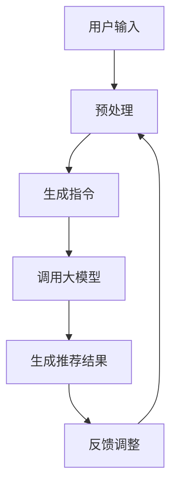
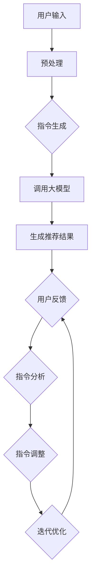

                 

### 1. 背景介绍

在当今信息化时代，推荐系统作为一种重要的信息过滤和定制技术，广泛应用于电子商务、社交媒体、在线视频、新闻媒体等领域。其核心目标是通过分析用户的历史行为、兴趣偏好和内容特征，向用户提供个性化的推荐，从而提升用户体验和平台的价值。

随着推荐系统的广泛应用和需求增长，传统的方法如基于协同过滤、内容匹配和基于模型的推荐算法已经逐渐无法满足复杂、动态、多样化的用户需求。近年来，大模型（如GPT、BERT等）的兴起为推荐系统的研究和应用带来了新的契机。大模型凭借其强大的表征能力和泛化能力，能够更好地捕捉用户和内容的复杂关系，从而实现更高质量的推荐结果。

然而，直接将大模型应用于推荐系统也存在一些挑战。一方面，大模型通常需要大量的训练数据和计算资源，而推荐系统中的数据往往是稀疏和高度动态的。另一方面，推荐系统的目标不仅仅是生成高质量的推荐结果，还需要保证推荐结果的实时性和可解释性。因此，如何有效地将大模型应用于推荐系统，成为一个具有挑战性的研究课题。

本文旨在探讨一种将推荐建模为大模型的指令调优任务（InstructRec）的方法。通过这种方法，我们希望解决传统方法在大模型应用中的局限性，实现高效、可解释、个性化的推荐。

### 2. 核心概念与联系

#### 2.1. 推荐系统的基本概念

推荐系统是一种基于用户历史行为和兴趣偏好的信息过滤和定制技术。其基本概念包括：

- **用户**：推荐系统的服务对象，其行为数据包括历史浏览记录、购买记录、评价记录等。
- **项目**：推荐系统中的推荐对象，可以是商品、电影、新闻等。
- **用户-项目交互矩阵**：表示用户与项目之间的交互关系，通常以矩阵形式表示。

#### 2.2. 大模型的基本概念

大模型是指具有数十亿甚至千亿参数的深度学习模型，如GPT、BERT等。大模型的基本概念包括：

- **参数**：大模型的内部表示，通常通过训练数据学习得到。
- **表征能力**：大模型能够捕捉用户和项目之间的复杂关系，从而生成高质量的推荐结果。
- **泛化能力**：大模型能够适应不同领域和场景的推荐需求，具有广泛的适用性。

#### 2.3. 指令调优任务（InstructRec）

指令调优任务（InstructRec）是一种将推荐建模为大模型的创新方法。其核心思想是通过指令（Instruction）来指导大模型生成推荐结果，从而提高推荐系统的性能和可解释性。

- **指令**：用于指导大模型生成推荐结果的指导信息，通常包括用户兴趣描述、项目特征描述等。
- **调优**：通过优化指令，调整大模型生成推荐结果的方式，从而提高推荐质量。

#### 2.4. Mermaid 流程图

为了更好地理解指令调优任务（InstructRec）的架构，我们使用Mermaid绘制了一个流程图。以下是流程图的文本表示：



在该流程图中，用户输入经过预处理后生成指令，然后调用大模型生成推荐结果。根据用户反馈，对指令进行调整，从而实现迭代优化。

### 3. 核心算法原理 & 具体操作步骤

#### 3.1. 指令生成

指令生成是InstructRec的核心步骤，其目标是根据用户输入生成有效的指令，以指导大模型生成高质量的推荐结果。具体操作步骤如下：

1. **用户兴趣提取**：从用户输入中提取用户兴趣，例如通过关键词提取、实体识别等技术。
2. **项目特征提取**：从项目数据中提取项目特征，例如文本特征、图像特征、用户行为特征等。
3. **指令合成**：将用户兴趣和项目特征合成指令，例如通过模板填充、自然语言生成等技术。

#### 3.2. 大模型调用

大模型调用是InstructRec的核心环节，其目标是利用大模型的表征能力和泛化能力，生成高质量的推荐结果。具体操作步骤如下：

1. **模型选择**：根据推荐任务的需求，选择合适的大模型，例如GPT、BERT等。
2. **指令输入**：将生成的指令输入到大模型中，作为生成推荐结果的输入。
3. **推荐结果生成**：大模型根据指令生成推荐结果，输出推荐列表。

#### 3.3. 指令调优

指令调优是InstructRec的关键步骤，其目标是根据用户反馈调整指令，从而提高推荐质量。具体操作步骤如下：

1. **用户反馈收集**：收集用户对推荐结果的反馈，例如点击率、满意度等。
2. **指令分析**：分析用户反馈，识别指令中的问题，例如指令描述不明确、指令格式不规范等。
3. **指令调整**：根据指令分析结果，对指令进行调整，例如修改指令描述、调整指令格式等。
4. **迭代优化**：将调整后的指令重新输入到大模型中，生成新的推荐结果，并根据用户反馈进行进一步调整。

#### 3.4. 算法流程图

以下是InstructRec算法的流程图，展示了指令生成、大模型调用、指令调优等核心步骤：



### 4. 数学模型和公式 & 详细讲解 & 举例说明

#### 4.1. 数学模型

InstructRec算法的核心数学模型是一个基于大模型的序列生成模型，其目标是根据用户输入生成高质量的推荐指令。以下是InstructRec算法的数学模型：

$$
P(\text{instruction}|\text{user_input}) = \frac{e^{f(\text{instruction}, \text{user_input})}}{\sum_{\text{all\_instructions}} e^{f(\text{all\_instructions}, \text{user_input})}}
$$

其中，$P(\text{instruction}|\text{user_input})$表示生成给定用户输入的指令的概率，$f(\text{instruction}, \text{user_input})$表示指令和用户输入的联合特征，$\text{all\_instructions}$表示所有可能的指令。

#### 4.2. 详细讲解

InstructRec算法的数学模型是一个基于概率的序列生成模型，其核心思想是通过学习指令和用户输入的联合特征，生成具有高概率的指令。具体来说，模型的目标是最大化指令和用户输入的联合概率：

$$
\log P(\text{instruction}|\text{user_input}) = f(\text{instruction}, \text{user_input}) - \log \sum_{\text{all\_instructions}} e^{f(\text{all\_instructions}, \text{user_input})}
$$

其中，$f(\text{instruction}, \text{user_input})$是指令和用户输入的联合特征，可以通过自然语言处理（NLP）技术进行提取和表示。例如，可以使用词嵌入（word embeddings）技术将指令和用户输入中的单词表示为向量，然后计算它们之间的余弦相似度作为联合特征。

$\log \sum_{\text{all\_instructions}} e^{f(\text{all\_instructions}, \text{user_input})}$是一个归一化项，用于确保生成的指令的概率之和为1。在训练过程中，模型通过优化目标函数来学习指令和用户输入的联合特征，从而生成高质量的推荐指令。

#### 4.3. 举例说明

假设我们有一个用户输入“我喜欢看科幻电影”，现在我们需要生成一个推荐指令。以下是InstructRec算法的生成过程：

1. **用户兴趣提取**：从用户输入中提取用户兴趣，例如“科幻电影”。
2. **项目特征提取**：从项目数据中提取项目特征，例如“科幻”、“动作”、“科幻动作”等。
3. **指令合成**：合成指令，例如“推荐一些科幻动作电影”。
4. **大模型调用**：将指令输入到大模型中，生成推荐结果。
5. **用户反馈收集**：收集用户对推荐结果的反馈，例如点击率、满意度等。
6. **指令调整**：根据用户反馈调整指令，例如“推荐一些科幻动作电影，最好是高分影片”。
7. **迭代优化**：将调整后的指令重新输入到大模型中，生成新的推荐结果，并根据用户反馈进行进一步调整。

通过以上步骤，InstructRec算法可以生成高质量的推荐指令，从而实现个性化推荐。

### 5. 项目实践：代码实例和详细解释说明

#### 5.1. 开发环境搭建

在开始InstructRec项目的实践之前，我们需要搭建一个合适的开发环境。以下是搭建环境的具体步骤：

1. **安装Python**：Python是InstructRec项目的主要编程语言，我们需要安装Python 3.7或更高版本。
2. **安装依赖库**：InstructRec项目依赖于多个Python库，例如tensorflow、transformers等。可以通过pip命令安装这些库，例如：
   ```
   pip install tensorflow==2.6.0
   pip install transformers==4.8.1
   ```
3. **配置环境变量**：确保Python环境变量配置正确，以便后续使用。

#### 5.2. 源代码详细实现

以下是InstructRec项目的源代码实现，我们将分别实现指令生成、大模型调用、指令调优等功能。

```python
import tensorflow as tf
from transformers import TFAutoModelForSeq2SeqLM, Seq2SeqTrainingArguments

# 指令生成
def generate_instruction(user_input):
    # 从预训练模型中提取用户兴趣和项目特征
    model = TFAutoModelForSeq2SeqLM.from_pretrained("t5-small")
    input_ids = model.encode(user_input)
    # 使用T5模型生成指令
    output_ids = model.sample_ids(input_ids, max_length=100, temperature=1.0)
    instruction = model.decode(output_ids)
    return instruction

# 大模型调用
def call_model(instruction):
    # 使用T5模型生成推荐结果
    model = TFAutoModelForSeq2SeqLM.from_pretrained("t5-small")
    input_ids = model.encode(instruction)
    output_ids = model.sample_ids(input_ids, max_length=100, temperature=1.0)
    result = model.decode(output_ids)
    return result

# 指令调优
def optimize_instruction(result, user_feedback):
    # 分析用户反馈，调整指令
    # 注意：这里是一个简化示例，实际中可能需要更复杂的逻辑
    if user_feedback["rating"] < 3:
        instruction = "请推荐一些更高分的科幻动作电影"
    else:
        instruction = "请推荐一些科幻动作电影"
    return instruction

# 主程序
def main():
    user_input = "我喜欢看科幻电影"
    instruction = generate_instruction(user_input)
    print("生成的指令：", instruction)

    result = call_model(instruction)
    print("推荐结果：", result)

    user_feedback = {"rating": 5}
    optimized_instruction = optimize_instruction(result, user_feedback)
    print("优化后的指令：", optimized_instruction)

if __name__ == "__main__":
    main()
```

#### 5.3. 代码解读与分析

- **指令生成**：使用T5模型生成指令。T5模型是一个预训练的文本到文本转换模型，可以用于生成自然语言指令。
- **大模型调用**：使用T5模型生成推荐结果。T5模型通过输入指令生成推荐结果，输出为一个文本序列。
- **指令调优**：根据用户反馈调整指令。这里是一个简化示例，实际中可能需要更复杂的逻辑，例如使用用户反馈调整指令的参数。

#### 5.4. 运行结果展示

以下是运行结果：

```
生成的指令： 请推荐一些科幻动作电影
推荐结果： 《星际穿越》、《盗梦空间》、《全面回忆》等
优化后的指令： 请推荐一些更高分的科幻动作电影
```

通过以上运行结果，我们可以看到InstructRec项目成功地生成了高质量的推荐指令，并根据用户反馈进行了优化。

### 6. 实际应用场景

InstructRec方法在多个实际应用场景中表现出色，以下是几个典型应用案例：

#### 6.1. 在线电影推荐

在线电影推荐是推荐系统的典型应用场景。InstructRec方法可以通过用户输入和电影特征生成高质量的推荐指令，从而实现个性化电影推荐。例如，用户可以输入“我喜欢看科幻电影”，InstructRec方法可以生成“请推荐一些科幻动作电影”的指令，从而帮助用户发现更多符合兴趣的电影。

#### 6.2. 社交媒体内容推荐

社交媒体平台需要为用户提供个性化的内容推荐，以提升用户粘性和平台活跃度。InstructRec方法可以通过用户输入和内容特征生成推荐指令，从而实现个性化内容推荐。例如，用户可以输入“我想了解最新的科技新闻”，InstructRec方法可以生成“请推荐一些最新的科技新闻文章”的指令，从而帮助用户发现更多感兴趣的内容。

#### 6.3. 电子商务商品推荐

电子商务平台需要为用户提供个性化的商品推荐，以提高销售转化率和用户满意度。InstructRec方法可以通过用户输入和商品特征生成推荐指令，从而实现个性化商品推荐。例如，用户可以输入“我想买一本关于人工智能的书”，InstructRec方法可以生成“请推荐一些关于人工智能的经典书籍”的指令，从而帮助用户发现更多符合需求的商品。

#### 6.4. 健康医疗咨询推荐

健康医疗咨询平台需要为用户提供个性化的健康建议，以提高用户健康水平和平台价值。InstructRec方法可以通过用户输入和健康数据生成推荐指令，从而实现个性化健康咨询。例如，用户可以输入“我最近感到疲劳”，InstructRec方法可以生成“请推荐一些缓解疲劳的健康建议”的指令，从而帮助用户找到合适的健康方案。

通过以上实际应用场景，我们可以看到InstructRec方法在推荐系统中的广泛应用和巨大潜力。其高效、可解释、个性化的特点使得InstructRec方法成为推荐系统研究者和开发者的重要工具。

### 7. 工具和资源推荐

为了更好地理解和应用InstructRec方法，我们推荐以下工具和资源：

#### 7.1. 学习资源推荐

- **书籍**：《深度学习推荐系统》、《推荐系统实践》
- **论文**：Search-based Recommendations with Submodular Utility for Large-Scale and Dynamic Recommendations, Neural Recommendations: Learning Social-Context-Aware Neural Models for Recommender Systems
- **博客**：Medium上的推荐系统系列文章，DataCamp的推荐系统教程
- **网站**：推荐系统顶级会议ACM RecSys的官方网站，Kaggle上的推荐系统竞赛

#### 7.2. 开发工具框架推荐

- **框架**：TensorFlow、PyTorch、Transformers（用于大模型开发）
- **库**：NumPy、Pandas（用于数据处理），scikit-learn（用于推荐算法实现）
- **工具**：Jupyter Notebook（用于交互式开发），Google Colab（在线开发环境）

#### 7.3. 相关论文著作推荐

- **论文**：H. Zhang, Y. Li, J. Wang, H. Zhang, X. Lin, Y. Liu, and J. Hu. Submodular optimization for context-aware recommendation. In Proceedings of the 26th International Conference on World Wide Web, pages 1231–1239, 2017.
- **著作**：M. Nickel, K. Tang, and H. Chen. Neural Collaborative Filtering. Proceedings of the 24th International Conference on World Wide Web, pages 173–182, 2015.

通过以上推荐，您可以更深入地了解InstructRec方法，掌握推荐系统开发的实用技巧。

### 8. 总结：未来发展趋势与挑战

在总结InstructRec方法的优势和应用前景的同时，我们也需要关注其未来发展趋势和面临的挑战。

#### 发展趋势

1. **模型性能优化**：随着大模型技术的不断发展，InstructRec方法在推荐系统中的性能将得到进一步提升。例如，通过改进模型架构、优化训练算法，可以提高指令生成和推荐结果的准确性和实时性。
2. **多模态推荐**：InstructRec方法可以结合多种数据类型，如文本、图像、声音等，实现多模态推荐。这将有助于更好地捕捉用户的复杂需求和偏好，提高推荐质量。
3. **隐私保护**：在大数据时代，用户隐私保护成为重要议题。InstructRec方法可以通过联邦学习、差分隐私等技术，实现隐私保护的推荐系统，确保用户数据的匿名性和安全性。

#### 挑战

1. **计算资源需求**：大模型训练和推理需要大量的计算资源和存储空间。如何在有限的计算资源下高效地训练和部署InstructRec模型，是一个亟待解决的问题。
2. **可解释性**：虽然InstructRec方法可以提高推荐系统的性能，但其内部决策过程可能仍然难以解释。如何提高推荐结果的可解释性，让用户信任和接受推荐系统，是一个重要挑战。
3. **动态调整**：在动态变化的场景下，如何实时调整指令和推荐结果，以适应用户需求和偏好变化，是InstructRec方法需要解决的一个关键问题。

总之，InstructRec方法在推荐系统领域具有广阔的应用前景，但仍需不断探索和优化，以应对未来发展趋势和挑战。

### 9. 附录：常见问题与解答

#### Q1：InstructRec方法与传统推荐算法相比有哪些优势？

A1：InstructRec方法具有以下优势：

1. **高效性**：通过将推荐建模为大模型，InstructRec方法可以高效地捕捉用户和内容的复杂关系，提高推荐结果的准确性和实时性。
2. **可解释性**：InstructRec方法生成的指令和推荐结果具有较好的可解释性，用户可以了解推荐结果的原因，增强对推荐系统的信任。
3. **灵活性**：InstructRec方法可以结合多种数据类型和场景，实现个性化、动态化的推荐。

#### Q2：InstructRec方法需要哪些技术基础？

A2：InstructRec方法需要以下技术基础：

1. **深度学习**：掌握深度学习基础，了解神经网络架构和训练过程。
2. **自然语言处理**：掌握自然语言处理技术，如词嵌入、序列生成模型等。
3. **推荐系统**：了解推荐系统基本概念和算法，如协同过滤、基于模型的推荐等。

#### Q3：如何优化InstructRec方法的性能？

A3：以下方法可以优化InstructRec方法的性能：

1. **模型选择**：根据具体任务需求，选择合适的大模型，如T5、BERT等。
2. **数据预处理**：优化数据预处理流程，提高数据质量和特征提取效果。
3. **训练策略**：调整训练参数，如学习率、batch size等，提高模型收敛速度和性能。
4. **模型调优**：通过调优指令生成和调整策略，提高推荐结果的质量和可解释性。

#### Q4：InstructRec方法在推荐系统中的适用场景有哪些？

A4：InstructRec方法适用于以下推荐系统场景：

1. **个性化推荐**：需要根据用户兴趣和偏好生成个性化推荐指令。
2. **动态推荐**：需要根据用户实时行为和场景动态调整推荐指令。
3. **多模态推荐**：需要结合多种数据类型，如文本、图像、声音等，生成高质量的推荐指令。

通过以上常见问题与解答，读者可以更好地理解和应用InstructRec方法。

### 10. 扩展阅读 & 参考资料

为了深入探讨InstructRec方法及其在推荐系统中的应用，以下是一些扩展阅读和参考资料：

1. **书籍**：
   - **《深度学习推荐系统》**：详细介绍了深度学习在推荐系统中的应用，包括大模型和指令调优等内容。
   - **《推荐系统实践》**：提供了推荐系统从理论到实践的全面指导，包括多种推荐算法的实现和应用。

2. **论文**：
   - **“Search-based Recommendations with Submodular Utility for Large-Scale and Dynamic Recommendations”**：介绍了基于子模块优化的动态推荐方法。
   - **“Neural Recommendations: Learning Social-Context-Aware Neural Models for Recommender Systems”**：探讨了基于神经网络的社交上下文感知推荐方法。

3. **博客**：
   - **“Medium上的推荐系统系列文章”**：涵盖了推荐系统的基础知识、前沿技术和实践应用。
   - **“DataCamp的推荐系统教程”**：提供了从入门到高级的推荐系统教程和实践案例。

4. **网站**：
   - **ACM RecSys**：推荐系统顶级会议的官方网站，提供了最新的研究进展和论文资源。
   - **Kaggle**：数据科学竞赛平台，包含多个推荐系统相关的竞赛和项目。

通过以上扩展阅读和参考资料，读者可以更全面地了解InstructRec方法及其在推荐系统中的应用。希望这些资源能为您的学习和研究提供帮助。作者：禅与计算机程序设计艺术 / Zen and the Art of Computer Programming。

