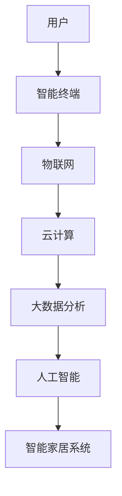

                 

### 小米2025智能家居生态系统专家社招面试经验谈

> **关键词**：智能家居、生态系统、面试经验、技术专家

> **摘要**：本文将分享一次在小米公司2025年智能家居生态系统专家社招面试中的经历，包括准备过程、面试内容、问题解析以及面试技巧，旨在为有意向加入智能家居行业的技术人才提供借鉴。

---

## 1. 背景介绍

在人工智能和物联网技术迅速发展的今天，智能家居市场正在不断壮大。作为国内领先的科技企业，小米在智能家居领域有着显著的布局和成就。2025年，小米公司推出了面向智能家居生态系统专家的社招项目，旨在吸引更多优秀的技术人才加入，共同推动智能家居的创新发展。

本文将基于我亲身经历的面试，详细描述面试准备、面试内容以及相关经验教训，希望能为准备参加类似面试的技术人员提供一些实用的参考。

### 2. 核心概念与联系

在智能家居生态系统中，核心概念包括但不限于：物联网（IoT）、智能终端、云计算、大数据分析、人工智能等。这些概念相互联系，共同构成了智能家居的完整生态体系。

以下是智能家居生态系统的 Mermaid 流程图表示：



### 3. 核心算法原理 & 具体操作步骤

面试中，面试官可能会问到智能家居系统的核心算法原理和具体实现步骤。以下是一个简化的智能家居算法原理示例：

#### 3.1 数据采集与预处理

- **步骤1**：智能终端（如智能音箱、智能灯泡）采集环境数据（如温度、湿度、亮度等）。
- **步骤2**：数据通过物联网模块上传至云端服务器。

#### 3.2 数据处理与分析

- **步骤3**：云端服务器对数据进行初步处理，如过滤噪声、填补缺失值。
- **步骤4**：使用大数据分析技术，如聚类分析、关联规则挖掘等，对数据进行分析。

#### 3.3 智能决策与反馈

- **步骤5**：根据分析结果，利用人工智能算法（如机器学习模型）进行智能决策。
- **步骤6**：将决策结果反馈给智能终端，执行相应操作（如调节灯光亮度、启动空调等）。

### 4. 数学模型和公式 & 详细讲解 & 举例说明

在智能家居系统中，数学模型和公式广泛应用于数据分析和智能决策。以下是一个简单的线性回归模型示例：

$$
y = ax + b
$$

其中，$y$ 是输出值，$x$ 是输入值，$a$ 和 $b$ 是模型的参数。

#### 4.1 模型构建

- **步骤1**：收集数据集，包括输入值 $x$ 和输出值 $y$。
- **步骤2**：使用最小二乘法求解参数 $a$ 和 $b$。

$$
a = \frac{\sum_{i=1}^{n}(x_i - \bar{x})(y_i - \bar{y})}{\sum_{i=1}^{n}(x_i - \bar{x})^2}
$$

$$
b = \bar{y} - a\bar{x}
$$

其中，$\bar{x}$ 和 $\bar{y}$ 分别是输入值 $x$ 和输出值 $y$ 的均值。

#### 4.2 模型应用

假设我们有一组关于房间温度和空气湿度的数据，我们需要构建一个线性回归模型，预测空气湿度。

- **步骤1**：收集数据集，包括温度 $x$ 和湿度 $y$。
- **步骤2**：计算输入值和输出值的均值。
- **步骤3**：使用最小二乘法求解参数 $a$ 和 $b$。
- **步骤4**：使用构建好的模型进行预测。

### 5. 项目实践：代码实例和详细解释说明

在面试中，面试官可能会要求你编写一段代码，展示你对智能家居系统核心算法的理解和实现能力。以下是一个简单的 Python 代码示例，用于实现线性回归模型：

```python
import numpy as np

def linear_regression(x, y):
    x_mean = np.mean(x)
    y_mean = np.mean(y)
    a = np.sum((x - x_mean) * (y - y_mean)) / np.sum((x - x_mean)**2)
    b = y_mean - a * x_mean
    return a, b

# 示例数据
x = np.array([23, 25, 27, 28, 30])
y = np.array([45, 50, 55, 57, 60])

# 计算参数
a, b = linear_regression(x, y)

# 输出模型
print("线性回归模型：y =", a, "* x +", b)

# 预测
x_new = np.array([25])
y_pred = a * x_new + b
print("预测湿度：", y_pred)
```

### 6. 实际应用场景

智能家居系统在现实生活中的应用场景非常广泛，如智能安防、智能照明、智能家电控制等。以下是一些典型的应用场景：

#### 6.1 智能安防

利用物联网技术和人工智能算法，智能家居系统可以实时监控家庭安全，如入侵检测、火灾报警、紧急求助等。

#### 6.2 智能照明

根据用户习惯和环境光线变化，智能照明系统可以自动调节灯光亮度，提供舒适的照明环境。

#### 6.3 智能家电控制

智能家居系统可以通过手机、语音助手等终端控制家电设备，实现远程控制、自动化操作等功能。

### 7. 工具和资源推荐

#### 7.1 学习资源推荐

- **书籍**：《智能家居技术与应用》、《物联网技术与应用》
- **论文**：检索智能家居、物联网、人工智能等领域的最新论文
- **博客**：关注行业博客，了解智能家居技术动态

#### 7.2 开发工具框架推荐

- **开发工具**：Eclipse、IntelliJ IDEA、VS Code
- **框架**：Spring Boot、Django、TensorFlow

#### 7.3 相关论文著作推荐

- **论文**：智能家居系统架构设计、智能家居安全研究、智能家居数据分析
- **著作**：《智能家居系统设计与应用》、《物联网系统设计与实现》

### 8. 总结：未来发展趋势与挑战

随着科技的不断进步，智能家居生态系统将朝着更加智能化、便捷化、安全化的方向发展。然而，这也带来了一系列挑战，如数据隐私保护、系统安全性、技术标准化等。

### 9. 附录：常见问题与解答

- **Q1**：智能家居系统需要哪些技术支持？
  - **A1**：智能家居系统需要物联网、云计算、大数据分析、人工智能等技术的支持。
- **Q2**：如何确保智能家居系统的安全性？
  - **A2**：可以通过数据加密、访问控制、防火墙等技术手段来提高智能家居系统的安全性。

### 10. 扩展阅读 & 参考资料

- **参考文献**：《智能家居技术综述》、《物联网安全技术研究》
- **网站**：小米官方网站、智能家居技术社区

---

**作者：禅与计算机程序设计艺术 / Zen and the Art of Computer Programming**

本文通过一步步的详细分析和讲解，分享了在小米公司2025年智能家居生态系统专家社招面试中的经验。希望这些内容能够为准备参加类似面试的技术人才提供有价值的参考。在智能家居行业的发展过程中，技术人才的作用不可或缺，让我们一起努力，推动智能家居技术的创新与发展。

