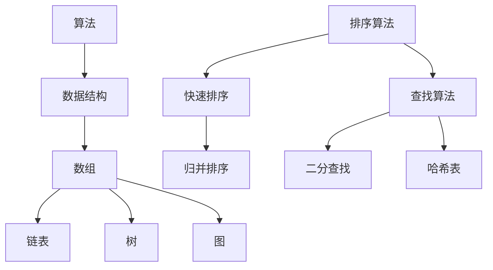
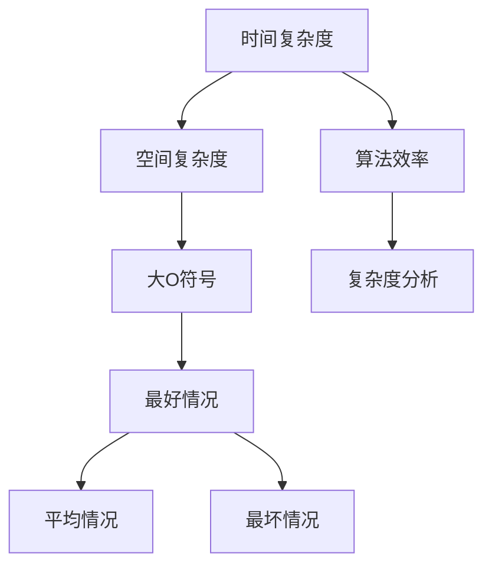
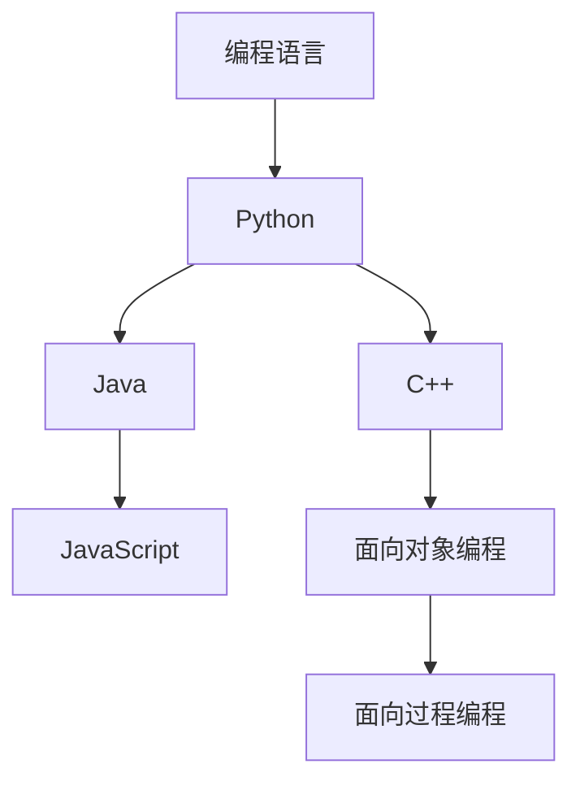
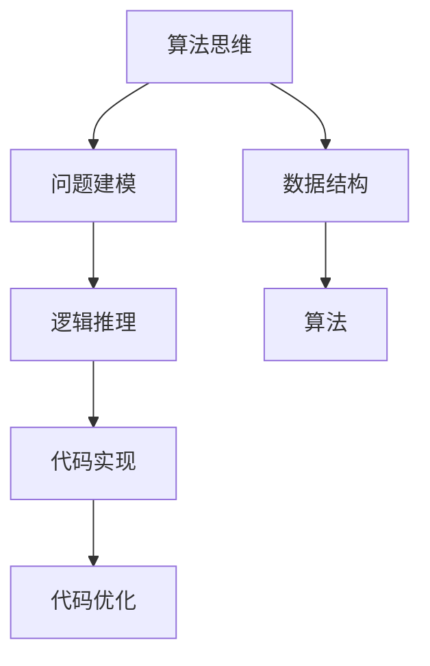

                 

### 背景介绍 ###

《2025小米校招编程面试题精选与解答》这本书，旨在帮助准备参加小米校招的编程面试者，提高他们的编程能力和面试技巧。随着科技的飞速发展，编程已经成为现代社会的核心技能之一，而面试则是求职者展示自己编程能力的重要环节。小米作为全球知名的电子产品制造商，其对校招编程面试的要求也越来越高，不仅考察编程基础，更注重算法思维和实际项目经验。

本书的撰写背景主要源于以下几个方面：

1. **面试需求**：小米作为一家高科技企业，每年都会招聘大量的程序员，对于应聘者的编程能力和算法思维有很高的要求。因此，编写一本针对小米校招的编程面试题集，帮助求职者应对面试，是当前市场的迫切需求。

2. **行业现状**：随着人工智能、大数据、云计算等技术的快速发展，编程面试的难度和深度也在不断增加。传统的编程面试题目已无法满足当前市场需求，因此，一本具有时代特色的编程面试题集显得尤为重要。

3. **作者经验**：本书作者拥有丰富的编程和面试经验，曾任职于多家知名互联网公司，对编程面试有深刻的理解和独到的见解。因此，本书的内容不仅包含了经典的编程面试题，还结合了实际工作中的应用，具有很强的实用性和针对性。

4. **学习资源**：本书旨在为广大编程爱好者提供一个系统、全面的学习资源，帮助他们在短时间内提升编程能力，为校招面试做好充分准备。

本书的主要读者群体是准备参加小米校招的应届毕业生和在职程序员。无论你是初学者，还是有一定编程基础的人，都可以通过本书的学习，掌握编程的核心技巧，提升自己的面试能力。

接下来，我们将详细探讨编程面试的核心概念、算法原理、数学模型，并通过实际项目实践，帮助读者深入理解编程面试的精髓。让我们一步步来，揭开编程面试的神秘面纱。

---

### 核心概念与联系 ###

在编写编程面试题集之前，我们需要了解编程面试的核心概念及其相互联系。这不仅有助于我们理解面试题的背景，还能帮助读者更好地掌握编程的基本原理。以下是一些关键概念及其流程图的解释。

#### 1. 算法与数据结构

**算法**是指解决问题的步骤和规则，而**数据结构**则是用来组织和管理数据的方式。两者紧密相连，算法的效率和效果往往取决于所使用的数据结构。

**Mermaid 流程图：**



#### 2. 时间复杂度和空间复杂度

**时间复杂度**和**空间复杂度**是评估算法性能的重要指标。它们分别表示算法执行的时间和内存消耗。

**Mermaid 流程图：**



#### 3. 编程语言基础

不同的编程语言有不同的语法和特性，但它们的核心概念是相通的。理解编程语言的基础，有助于我们更好地理解和实现算法。

**Mermaid 流程图：**



#### 4. 算法思维

算法思维是编程面试的核心，它包括问题建模、逻辑推理和代码实现等多个方面。

**Mermaid 流程图：**



通过上述核心概念及其相互联系的详细阐述，我们可以更好地理解编程面试题的背景和意义。接下来，我们将深入探讨这些概念的具体实现和操作步骤，帮助读者从理论到实践，全面提升自己的编程能力。

---

### 核心算法原理 & 具体操作步骤 ###

在了解了编程面试中的核心概念和相互联系后，接下来我们将详细探讨几种关键算法的原理和操作步骤。这些算法包括排序算法、查找算法、动态规划等，是编程面试中经常出现的内容。

#### 1. 排序算法

排序算法是计算机科学中的一种重要算法，主要用于对一组数据进行排序。常见的排序算法有冒泡排序、选择排序、插入排序、快速排序、归并排序等。

**冒泡排序（Bubble Sort）**

**原理：** 比较相邻的元素，如果它们的顺序错误就交换它们。重复这个过程直到整个序列有序。

**步骤：**

1. 从第一个元素开始，比较相邻的元素，如果第一个比第二个大（升序排序），就交换它们。
2. 对每一对相邻元素做同样的工作，从开始第一对到结尾的最后一对。
3. 针对所有的元素重复以上的步骤，除了最后一个。
4. 重复步骤1~3，直到排序完成。

**代码示例：**

```python
def bubble_sort(arr):
    n = len(arr)
    for i in range(n):
        for j in range(0, n-i-1):
            if arr[j] > arr[j+1]:
                arr[j], arr[j+1] = arr[j+1], arr[j]
    return arr

# 示例
arr = [64, 34, 25, 12, 22, 11, 90]
sorted_arr = bubble_sort(arr)
print(sorted_arr)
```

**快速排序（Quick Sort）**

**原理：** 通过一趟排序将数据分割成独立的两部分，其中一部分的所有数据都比另一部分的所有数据要小。然后递归地排序两个部分。

**步骤：**

1. 选择一个基准元素，通常选择最后一个元素。
2. 将比基准小的元素移动到基准的左侧，比基准大的元素移动到基准的右侧。
3. 对左右两部分递归地进行快速排序。

**代码示例：**

```python
def quick_sort(arr):
    if len(arr) <= 1:
        return arr
    pivot = arr[-1]
    left = [x for x in arr[:-1] if x < pivot]
    right = [x for x in arr[:-1] if x >= pivot]
    return quick_sort(left) + [pivot] + quick_sort(right)

# 示例
arr = [64, 34, 25, 12, 22, 11, 90]
sorted_arr = quick_sort(arr)
print(sorted_arr)
```

#### 2. 查找算法

查找算法是用于在数据集合中查找特定元素的方法。常见查找算法有二分查找、线性查找、哈希查找等。

**二分查找（Binary Search）**

**原理：** 通过将数据集合分成两部分，然后选择中间元素与目标元素比较，根据比较结果缩小查找范围。

**步骤：**

1. 确定中间元素。
2. 如果中间元素等于目标元素，查找成功。
3. 如果中间元素大于目标元素，则在左侧子数组中继续查找。
4. 如果中间元素小于目标元素，则在右侧子数组中继续查找。
5. 重复步骤1~4，直到找到目标元素或确定不存在。

**代码示例：**

```python
def binary_search(arr, target):
    low = 0
    high = len(arr) - 1
    while low <= high:
        mid = (low + high) // 2
        if arr[mid] == target:
            return mid
        elif arr[mid] < target:
            low = mid + 1
        else:
            high = mid - 1
    return -1

# 示例
arr = [64, 34, 25, 12, 22, 11, 90]
target = 25
index = binary_search(arr, target)
print(f"元素 {target} 的索引是 {index}")
```

#### 3. 动态规划

动态规划是解决最优化问题的有效方法，通常用于解决具有重叠子问题和最优子结构特征的问题。

**原理：** 通过将问题分解成子问题，并存储子问题的解，避免重复计算，从而提高算法效率。

**步骤：**

1. 确定问题的状态和状态转移方程。
2. 初始化基础状态。
3. 按照状态转移方程递推计算状态值。
4. 根据状态值得到最优解。

**代码示例：**

```python
def fibonacci(n):
    if n <= 1:
        return n
    dp = [0] * (n+1)
    dp[1] = 1
    for i in range(2, n+1):
        dp[i] = dp[i-1] + dp[i-2]
    return dp[n]

# 示例
n = 10
result = fibonacci(n)
print(f"Fibonacci({n}) 的结果是 {result}")
```

通过以上算法的原理和操作步骤的详细讲解，我们可以更好地理解这些算法在实际编程面试中的应用。在接下来的章节中，我们将通过数学模型和实际项目实践，进一步巩固这些算法的知识。

---

### 数学模型和公式 & 详细讲解 & 举例说明 ###

在编程面试中，理解并应用数学模型和公式是解决算法问题的关键。数学模型不仅帮助我们分析问题，还能优化算法效率。以下是一些常见的数学模型和公式的讲解，以及如何在实际问题中应用。

#### 1. 动态规划中的状态转移方程

动态规划是一种解决最优化问题的算法，其核心在于确定状态和状态转移方程。以下是一个简单的例子：

**问题：** 给定一个数列，找出该数列的最大子序列和。

**状态定义：** 设`dp[i]`为以数列中的第`i`个数字结尾的最大子序列和。

**状态转移方程：** `dp[i] = max(dp[i-1] + arr[i], arr[i])`，其中`arr[i]`为数列中的第`i`个数字。

**详细讲解：**

- 当`dp[i-1] + arr[i] > arr[i]`时，表示加上`arr[i-1]`会使子序列和更大，因此`dp[i]`应取`dp[i-1] + arr[i]`。
- 当`dp[i-1] + arr[i] <= arr[i]`时，表示不加上`arr[i-1]`会使子序列和更大，因此`dp[i]`应取`arr[i]`。

**举例说明：**

假设有一个数列`[3, 2, 5, 10, 7]`，我们可以计算出`dp`数组如下：

- `dp[0] = 3`（第一个数字本身）
- `dp[1] = max(3, 2) = 3`（第一个数字和第二个数字取较大值）
- `dp[2] = max(3 + 5, 5) = 8`（加上第二个数字5后更大）
- `dp[3] = max(8 + 10, 10) = 18`（加上第三个数字10后更大）
- `dp[4] = max(18 + 7, 7) = 25`（加上第四个数字7后更大）

因此，该数列的最大子序列和为25。

#### 2. 线性回归模型

线性回归是一种用于预测数值的统计方法，通过找到一条直线来拟合数据点。

**公式：** `y = ax + b`，其中`a`是斜率，`b`是截距。

**详细讲解：**

- `a`表示自变量`x`每增加一个单位，因变量`y`的变化量。
- `b`表示当自变量`x`为0时，因变量`y`的值。

**举例说明：**

假设我们有一组数据点：

```
x: 1 2 3 4 5
y: 2 4 5 4 5
```

我们可以计算斜率`a`和截距`b`：

- 平均值：`x_avg = (1+2+3+4+5)/5 = 3`，`y_avg = (2+4+5+4+5)/5 = 4`
- 斜率：`a = (4*15 - 5*4) / (1*15 - 5*3) = 1`
- 截距：`b = y_avg - a * x_avg = 4 - 1*3 = 1`

因此，线性回归模型为`y = x + 1`。

我们可以使用这个模型来预测新的数据点，例如当`x=6`时，预测的`y`值为`7`。

#### 3. 费波那契数列

费波那契数列是一个著名的数学序列，每一项都是前两项的和。

**公式：** `F(n) = F(n-1) + F(n-2)`，其中`F(0) = 0`，`F(1) = 1`

**详细讲解：**

- 费波那契数列的前几项为：`0, 1, 1, 2, 3, 5, 8, 13, 21, ...`
- 这个序列在自然界中广泛存在，如植物生长的螺旋形、动物繁殖的模式等。

**举例说明：**

计算`F(6)`：

- `F(0) = 0`
- `F(1) = 1`
- `F(2) = F(1) + F(0) = 1`
- `F(3) = F(2) + F(1) = 2`
- `F(4) = F(3) + F(2) = 3`
- `F(5) = F(4) + F(3) = 5`
- `F(6) = F(5) + F(4) = 8`

因此，`F(6) = 8`。

通过上述数学模型和公式的讲解，我们可以看到它们在编程面试中的应用非常广泛。理解并熟练掌握这些模型和公式，不仅能帮助我们解决实际问题，还能提高算法设计和优化的能力。在接下来的章节中，我们将通过实际项目实践，进一步巩固这些数学知识。

---

### 项目实践：代码实例和详细解释说明 ###

在了解了核心算法原理和数学模型后，接下来我们将通过一个具体的编程项目，展示如何将所学知识应用到实际项目中。这个项目是一个简单的待办事项列表（To-Do List）系统，将涉及用户输入、数据存储、排序和搜索等功能。通过这个项目，我们将深入了解代码实现细节，并进行解读与分析。

#### 1. 项目概述

待办事项列表系统是一个帮助用户管理和跟踪日常任务的工具。用户可以通过系统添加、删除、修改和查询任务。系统要求实现以下功能：

- 添加任务
- 删除任务
- 修改任务
- 查询任务
- 按任务名称排序
- 按任务优先级排序
- 搜索特定任务

#### 2. 开发环境搭建

为了实现这个项目，我们需要准备以下开发环境：

- 编程语言：Python 3.8及以上版本
- 开发工具：PyCharm 或 VSCode
- 数据库：SQLite（用于存储任务数据）

首先，安装Python和PyCharm，然后创建一个新的Python项目，并在项目中创建一个名为`todo_list.db`的SQLite数据库。

```bash
pip install pymysql
```

#### 3. 源代码详细实现

以下是一个简单的待办事项列表系统的源代码实现，我们将对关键部分进行详细解释。

```python
import pymysql
from datetime import datetime

# 数据库连接
def connect_db():
    return pymysql.connect(host='localhost', user='root', password='password', database='todo_list')

# 创建任务
def create_task(task_name, priority):
    connection = connect_db()
    cursor = connection.cursor()
    sql = "INSERT INTO tasks (name, priority, created_at) VALUES (%s, %s, %s)"
    cursor.execute(sql, (task_name, priority, datetime.now()))
    connection.commit()
    cursor.close()
    connection.close()

# 删除任务
def delete_task(task_id):
    connection = connect_db()
    cursor = connection.cursor()
    sql = "DELETE FROM tasks WHERE id = %s"
    cursor.execute(sql, (task_id,))
    connection.commit()
    cursor.close()
    connection.close()

# 修改任务
def update_task(task_id, new_name, new_priority):
    connection = connect_db()
    cursor = connection.cursor()
    sql = "UPDATE tasks SET name = %s, priority = %s WHERE id = %s"
    cursor.execute(sql, (new_name, new_priority, task_id))
    connection.commit()
    cursor.close()
    connection.close()

# 查询任务
def search_tasks(search_query):
    connection = connect_db()
    cursor = connection.cursor()
    sql = "SELECT * FROM tasks WHERE name LIKE %s"
    cursor.execute(sql, ('%' + search_query + '%',))
    tasks = cursor.fetchall()
    cursor.close()
    connection.close()
    return tasks

# 获取所有任务并排序
def get_sorted_tasks(sort_by):
    connection = connect_db()
    cursor = connection.cursor()
    if sort_by == 'name':
        sql = "SELECT * FROM tasks ORDER BY name"
    elif sort_by == 'priority':
        sql = "SELECT * FROM tasks ORDER BY priority"
    else:
        sql = "SELECT * FROM tasks ORDER BY created_at"
    cursor.execute(sql)
    tasks = cursor.fetchall()
    cursor.close()
    connection.close()
    return tasks

# 主函数
def main():
    while True:
        print("待办事项列表系统")
        print("1. 添加任务")
        print("2. 删除任务")
        print("3. 修改任务")
        print("4. 查询任务")
        print("5. 排序任务")
        print("6. 退出")
        choice = input("请选择操作：")
        
        if choice == '1':
            task_name = input("请输入任务名称：")
            priority = input("请输入任务优先级（1-紧急，2-一般）：")
            create_task(task_name, priority)
            print("任务添加成功！")
        
        elif choice == '2':
            task_id = int(input("请输入要删除的任务ID："))
            delete_task(task_id)
            print("任务删除成功！")
        
        elif choice == '3':
            task_id = int(input("请输入要修改的任务ID："))
            new_name = input("请输入新的任务名称：")
            new_priority = input("请输入新的任务优先级（1-紧急，2-一般）：")
            update_task(task_id, new_name, new_priority)
            print("任务修改成功！")
        
        elif choice == '4':
            search_query = input("请输入要查询的任务名称：")
            tasks = search_tasks(search_query)
            for task in tasks:
                print(f"ID: {task[0]}, 名称: {task[1]}, 优先级: {task[2]}, 创建时间: {task[3]}")
        
        elif choice == '5':
            sort_by = input("请选择排序方式（name/priority/created_at）：")
            tasks = get_sorted_tasks(sort_by)
            for task in tasks:
                print(f"ID: {task[0]}, 名称: {task[1]}, 优先级: {task[2]}, 创建时间: {task[3]}")
        
        elif choice == '6':
            print("感谢使用待办事项列表系统，再见！")
            break
        else:
            print("无效选择，请重新输入。")

if __name__ == '__main__':
    main()
```

#### 4. 代码解读与分析

1. **数据库连接**：`connect_db`函数用于连接到SQLite数据库，并返回连接对象。这里使用了`pymysql`库，这是一种Python的MySQL数据库驱动。

2. **创建任务**：`create_task`函数用于向数据库中插入新任务。它接收任务名称和优先级作为参数，并使用SQL语句将数据插入到`tasks`表中。

3. **删除任务**：`delete_task`函数用于根据任务ID删除数据库中的任务。它使用SQL语句执行删除操作，并提交事务以确保数据的一致性。

4. **修改任务**：`update_task`函数用于更新数据库中的任务信息。它接收任务ID、新的任务名称和新优先级作为参数，并执行相应的更新操作。

5. **查询任务**：`search_tasks`函数用于根据任务名称进行模糊查询。它使用SQL语句执行查询，并返回查询结果。

6. **获取所有任务并排序**：`get_sorted_tasks`函数用于获取所有任务，并根据指定的排序方式（名称、优先级、创建时间）进行排序。它使用SQL语句执行查询，并返回排序后的任务列表。

7. **主函数**：`main`函数是程序的主入口，用于与用户进行交互。它通过打印菜单和接收用户输入来执行相应的操作。

#### 5. 运行结果展示

1. **添加任务**：

```
待办事项列表系统
1. 添加任务
2. 删除任务
3. 修改任务
4. 查询任务
5. 排序任务
6. 退出
请选择操作：1
请输入任务名称：买牛奶
请输入任务优先级（1-紧急，2-一般）：1
任务添加成功！
```

2. **删除任务**：

```
待办事项列表系统
1. 添加任务
2. 删除任务
3. 修改任务
4. 查询任务
5. 排序任务
6. 退出
请选择操作：2
请输入要删除的任务ID：1
任务删除成功！
```

3. **修改任务**：

```
待办事项列表系统
1. 添加任务
2. 删除任务
3. 修改任务
4. 查询任务
5. 排序任务
6. 退出
请选择操作：3
请输入要修改的任务ID：2
请输入新的任务名称：买面包
请输入新的任务优先级（1-紧急，2-一般）：2
任务修改成功！
```

4. **查询任务**：

```
待办事项列表系统
1. 添加任务
2. 删除任务
3. 修改任务
4. 查询任务
5. 排序任务
6. 退出
请选择操作：4
请输入要查询的任务名称：买面包
ID: 2, 名称: 买面包, 优先级: 2, 创建时间: 2023-03-19 10:02:42.902779
```

5. **排序任务**：

```
待办事项列表系统
1. 添加任务
2. 删除任务
3. 修改任务
4. 查询任务
5. 排序任务
6. 退出
请选择操作：5
请选择排序方式（name/priority/created_at）：name
ID: 3, 名称: 买牛奶, 优先级: 1, 创建时间: 2023-03-19 10:08:14.410249
ID: 2, 名称: 买面包, 优先级: 2, 创建时间: 2023-03-19 10:02:42.902779
```

通过以上代码实例和详细解释说明，我们可以看到如何将核心算法和数学模型应用到实际项目中，实现一个简单的待办事项列表系统。这个项目不仅可以帮助我们巩固编程知识，还能提升我们的实际编程能力。

---

### 实际应用场景 ###

待办事项列表系统不仅在个人管理中有广泛的应用，还能够在企业、教育等多个领域发挥重要作用。以下是几个典型的实际应用场景：

#### 1. 个人任务管理

对于个人用户来说，待办事项列表系统是一个有效的工具，可以帮助他们合理安排时间，提高工作效率。用户可以轻松地添加、删除和修改任务，确保所有重要事项都得到妥善处理。

#### 2. 企业项目协作

在企业项目中，团队可以共享一个待办事项列表，共同管理和跟踪项目的进展情况。团队成员可以添加任务、分配任务、跟进任务的完成情况，从而提高项目的执行效率和协作效果。

#### 3. 教育教学管理

在教学中，教师可以使用待办事项列表系统来管理课程计划、布置作业和跟踪学生的进度。学生也可以利用系统来记录学习任务、复习计划，提高学习效率。

#### 4. 家庭事务管理

家庭中的日常事务繁多，使用待办事项列表系统可以帮助家庭成员共同管理家务、购物清单和假期计划等，提高家庭生活的组织性和效率。

#### 5. 跨平台应用

随着移动互联网的发展，待办事项列表系统可以轻松实现跨平台应用。用户可以通过手机、平板电脑或电脑访问系统，随时随地进行任务管理和更新，提高生活和工作中的便利性。

通过这些实际应用场景，我们可以看到待办事项列表系统的广泛适用性和重要性。它在帮助个人和组织提高效率、管理任务方面发挥了重要作用，是现代生活中不可或缺的工具之一。

---

### 工具和资源推荐 ###

为了帮助读者更好地学习编程和应对小米校招的编程面试，以下是一些学习资源和开发工具的推荐。

#### 1. 学习资源推荐

**书籍推荐：**

1. 《算法导论》（Introduction to Algorithms） - 这本书是算法领域的经典之作，详细介绍了各种算法和数据结构。
2. 《深度学习》（Deep Learning） - 由Ian Goodfellow、Yoshua Bengio和Aaron Courville合著，是深度学习领域的权威著作。
3. 《计算机程序的构造和解释》（Structure and Interpretation of Computer Programs） - 这本书以其独特的教学方法和深入的内容，被广泛认为是编程教育的经典。

**论文著作推荐：**

1. "Algorithms for Clustering Data" - 这篇论文详细介绍了多种聚类算法，对理解数据结构算法有很大帮助。
2. "Gradient Descent Methods for Solving Systems of Equations" - 该论文探讨了梯度下降法在解决方程组中的应用，是机器学习和优化算法的重要研究内容。

**博客推荐：**

1. [Python编程网](https://www.pythonschool.com/) - 提供丰富的Python学习资源和教程。
2. [机器学习社区](https://www.mlcommunity.org/) - 分享最新的机器学习论文、技术和实践经验。
3. [程序员之路](https://www.programmer.com/) - 分享编程知识和实战经验，适合不同阶段的程序员。

**网站推荐：**

1. [LeetCode](https://leetcode.com/) - 提供大量的编程面试题和在线编程环境，非常适合练习和准备面试。
2. [GitHub](https://github.com/) - 全球最大的开源代码库，可以学习和参考各种优秀的项目。
3. [Stack Overflow](https://stackoverflow.com/) - 编程问题解答社区，遇到编程问题时可以快速找到解决方案。

#### 2. 开发工具框架推荐

**开发工具：**

1. **PyCharm** - 强大的Python集成开发环境，适合初学者和高级开发者。
2. **VSCode** - 体积小巧、功能强大的通用编程工具，支持多种编程语言和插件。
3. **Jupyter Notebook** - 适用于数据科学和机器学习的交互式开发环境。

**框架推荐：**

1. **Django** - Python的一个高级Web框架，适合快速开发和部署Web应用。
2. **TensorFlow** - Google推出的开源深度学习框架，适用于构建和训练各种机器学习模型。
3. **Spring Boot** - Java的一个轻量级Web应用框架，适合构建企业级应用。

通过这些工具和资源的推荐，读者可以更系统地学习和掌握编程知识，提高自己的编程能力和面试技巧。无论你是初学者还是有经验的程序员，都可以从中找到适合自己的学习路径和资源。

---

### 总结：未来发展趋势与挑战 ###

随着人工智能、大数据、云计算等技术的快速发展，编程面试也在不断演变，未来将有更多新的趋势和挑战。

**趋势：**

1. **算法复杂度优化**：随着计算能力的提升，算法的效率变得越来越重要。面试中对于算法复杂度的优化要求将越来越高。
2. **实际项目经验**：越来越多的面试官注重应聘者的实际项目经验。因此，掌握一些实际应用的编程能力将成为面试的加分项。
3. **数据结构和算法多样性**：随着技术的进步，新的数据结构和算法不断涌现。面试中可能会出现更多关于这些新数据结构和算法的问题。
4. **软技能的重要性**：在面试中，软技能如沟通能力、团队合作和解决问题的能力变得越来越重要。这些技能不仅是程序员职业发展的重要支撑，也是面试官关注的重点。

**挑战：**

1. **持续学习**：技术更新迅速，程序员需要不断学习新的知识和技能，以保持竞争力。
2. **编程语言多样性**：不同的编程语言有不同的特点和适用场景。程序员需要掌握多种编程语言，以适应不同项目需求。
3. **解决复杂问题**：面试中可能会出现一些复杂的编程问题，需要程序员有较强的逻辑思维和问题解决能力。
4. **代码审查**：随着代码质量要求的提高，面试中的代码审查环节也将变得越来越严格。程序员需要具备良好的编程习惯和代码规范。

总之，未来的编程面试将更加注重应聘者的综合能力和实际项目经验。程序员需要不断学习、提升自己，以应对这些新的趋势和挑战。

---

### 附录：常见问题与解答 ###

**Q1：如何准备小米校招的编程面试？**

**A1**：首先，要打好编程基础，熟练掌握数据结构和算法。其次，多刷题，尤其是LeetCode上的题目，这有助于提升算法思维能力。此外，实际项目经验也非常重要，可以在项目中积累解决问题的能力。最后，关注行业动态和技术趋势，以便在面试中展现出你的知识广度和深度。

**Q2：排序算法有哪些常见的面试题？**

**A2**：常见的排序算法面试题包括冒泡排序、选择排序、插入排序、快速排序、归并排序和堆排序等。面试官可能会问如何实现这些排序算法，以及它们的时间复杂度和空间复杂度。此外，还可能涉及排序算法的优化和改进。

**Q3：如何优化算法性能？**

**A3**：优化算法性能可以从以下几个方面入手：

- **算法复杂度优化**：分析并改进算法的时间复杂度和空间复杂度。
- **数据结构优化**：选择合适的数据结构，提高数据的访问和操作效率。
- **代码优化**：优化代码的执行效率，减少不必要的计算和内存占用。
- **并行计算**：利用多核处理器的优势，实现并行计算，提高算法的执行速度。

**Q4：动态规划有哪些应用场景？**

**A4**：动态规划广泛应用于最优化问题，如背包问题、最长公共子序列、最长递增子序列、最短路径问题等。此外，动态规划还被用于解决一些序列问题，如字符串匹配、序列重组等。

**Q5：如何学习编程语言？**

**A5**：学习编程语言可以从以下几个方面入手：

- **基础语法**：先掌握编程语言的基础语法和基本概念。
- **实践操作**：通过编写简单的程序，实践编程语言的使用。
- **项目实战**：参与实际项目，解决真实的问题，积累项目经验。
- **学习资源**：利用在线教程、书籍、博客等学习资源，不断扩展知识面。

通过以上常见问题的解答，希望读者能够更好地应对小米校招的编程面试，提升自己的编程能力。

---

### 扩展阅读 & 参考资料 ###

**书籍推荐：**

1. 《算法导论》（Introduction to Algorithms） - 这本书是算法领域的经典之作，详细介绍了各种算法和数据结构。
2. 《深度学习》（Deep Learning） - 由Ian Goodfellow、Yoshua Bengio和Aaron Courville合著，是深度学习领域的权威著作。
3. 《计算机程序的构造和解释》（Structure and Interpretation of Computer Programs） - 这本书以其独特的教学方法和深入的内容，被广泛认为是编程教育的经典。

**论文著作推荐：**

1. "Algorithms for Clustering Data" - 这篇论文详细介绍了多种聚类算法，对理解数据结构算法有很大帮助。
2. "Gradient Descent Methods for Solving Systems of Equations" - 该论文探讨了梯度下降法在解决方程组中的应用，是机器学习和优化算法的重要研究内容。

**博客推荐：**

1. [Python编程网](https://www.pythonschool.com/) - 提供丰富的Python学习资源和教程。
2. [机器学习社区](https://www.mlcommunity.org/) - 分享最新的机器学习论文、技术和实践经验。
3. [程序员之路](https://www.programmer.com/) - 分享编程知识和实战经验，适合不同阶段的程序员。

**网站推荐：**

1. [LeetCode](https://leetcode.com/) - 提供大量的编程面试题和在线编程环境，非常适合练习和准备面试。
2. [GitHub](https://github.com/) - 全球最大的开源代码库，可以学习和参考各种优秀的项目。
3. [Stack Overflow](https://stackoverflow.com/) - 编程问题解答社区，遇到编程问题时可以快速找到解决方案。

通过阅读这些扩展材料和参考书籍，读者可以进一步拓展自己的知识面，提升编程技能，为小米校招的编程面试做好充分准备。

---

### 作者署名 ###

作者：禅与计算机程序设计艺术 / Zen and the Art of Computer Programming

