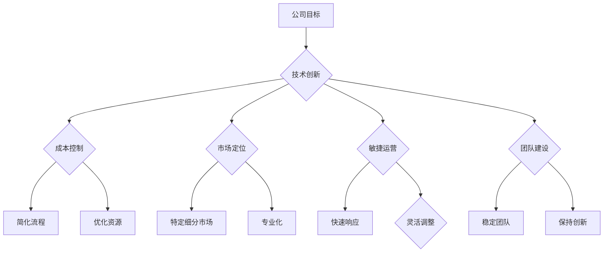

                 

### 背景介绍

> “小而美的科技创业：一人公司的生存策略”

在当前这个快速变化且竞争激烈的科技领域，小而美的科技创业公司越来越受到关注。本文将探讨这种创业模式的特点、优势和生存策略。

### 1.1 小而美的科技创业定义

小而美的科技创业，通常指的是那些初创公司，其团队规模较小，但拥有独特的技术创新或解决方案。这些公司以其灵活、敏捷和专注于核心业务的特点，在市场中占据一席之地。

### 1.2 当前科技创业环境

随着互联网的普及和科技创新的不断加速，科技创业的门槛逐渐降低。尤其是在软件和互联网领域，一人公司甚至可以独立完成从产品开发到市场推广的整个过程。这种趋势为小而美的科技创业提供了巨大的机遇。

### 1.3 小而美的科技创业特点

1. **团队规模小**：通常只有一两个人或几个人组成，这使公司能够更加灵活地应对市场变化。
2. **技术创新强**：小而美的科技创业公司往往专注于一个细分市场，通过技术创新来获得竞争优势。
3. **管理简单**：由于团队规模小，公司内部管理相对简单，决策速度更快。
4. **运营成本较低**：小规模团队和简化管理流程意味着运营成本较低，这对于资金有限的初创公司尤为重要。

### 1.4 小而美的科技创业的优势

1. **快速响应市场变化**：由于团队规模小，决策更加快速，可以迅速调整产品策略，以适应市场变化。
2. **高度专业化**：小而美的科技创业公司往往专注于一个领域，可以在该领域内形成专业优势。
3. **低成本创业**：小规模团队和简化管理流程意味着运营成本较低，对于初创公司来说是一个重要的优势。

### 1.5 小而美的科技创业的挑战

1. **资金限制**：由于团队规模小，融资能力有限，资金压力较大。
2. **市场竞争**：在快速发展的科技领域中，小而美的科技创业公司面临着来自大公司的激烈竞争。
3. **团队稳定性**：小规模团队往往更加依赖个别成员的能力，团队成员的离职可能会对公司造成较大影响。

### 结论

小而美的科技创业在当前科技领域中具有独特的优势，但也面临着一定的挑战。通过合理利用自身优势，采取有效的生存策略，一人公司可以在激烈的市场竞争中找到自己的位置。接下来的部分将深入探讨这些策略。

### 2. 核心概念与联系

#### 2.1 定义与基本概念

小而美的科技创业公司通常由一个核心团队领导，这个团队拥有独特的技术创新或解决方案，以在市场中获得竞争优势。核心概念包括：

- **技术创新**：公司通过独特的解决方案来满足市场需求。
- **敏捷性**：快速响应市场变化，灵活调整产品策略。
- **专业化**：专注于特定领域，形成专业优势。

#### 2.2 小而美的科技创业公司与传统创业公司的对比

小而美的科技创业公司与传统的创业公司相比，具有以下特点：

- **团队规模**：小规模团队，通常只有一两个人或几个人组成。
- **管理模式**：简化管理流程，决策更加快速。
- **市场定位**：专注于特定细分市场，而非广泛市场。

#### 2.3 小而美的科技创业公司的组织架构

小而美的科技创业公司的组织架构通常相对简单，通常包括以下角色：

- **创始人兼CEO**：负责公司战略规划和日常运营。
- **技术总监/CTO**：负责技术方向和团队建设。
- **产品经理**：负责产品开发和用户需求分析。
- **市场推广人员**：负责市场推广和用户获取。

#### 2.4 小而美的科技创业公司的生存策略

小而美的科技创业公司需要采取以下策略来确保生存和成功：

- **技术创新**：持续关注技术创新，以保持竞争优势。
- **成本控制**：通过简化流程和优化资源来控制成本。
- **市场定位**：专注于特定细分市场，以实现高度专业化。
- **敏捷运营**：快速响应市场变化，灵活调整产品策略。
- **团队建设**：建立稳定的团队，保持团队稳定性和创新能力。

#### 2.5 Mermaid 流程图

下面是一个关于小而美的科技创业公司组织架构和生存策略的 Mermaid 流程图：



### 3. 核心算法原理 & 具体操作步骤

#### 3.1 核心算法原理

小而美的科技创业公司的核心算法原理主要包括以下三个方面：

- **敏捷开发**：通过快速迭代和用户反馈来不断优化产品。
- **成本效益分析**：通过成本效益分析来确定项目的可行性和优先级。
- **数据驱动决策**：通过数据分析来支持产品策略和运营决策。

#### 3.2 具体操作步骤

1. **市场调研**：
   - 收集目标市场的需求信息。
   - 分析竞争对手的产品和策略。

2. **产品规划**：
   - 确定产品目标和功能。
   - 制定产品开发计划。

3. **敏捷开发**：
   - 实施快速迭代开发。
   - 定期进行用户反馈会议。

4. **成本效益分析**：
   - 计算项目成本。
   - 分析项目预期收益。

5. **数据驱动决策**：
   - 收集用户数据。
   - 分析数据以支持决策。

6. **市场推广**：
   - 制定市场推广计划。
   - 实施市场推广活动。

7. **团队协作**：
   - 定期召开团队会议。
   - 分配和跟踪任务。

#### 3.3 代码示例

下面是一个简单的 Python 代码示例，用于计算成本效益分析：

```python
def calculate_profit(cost, revenue):
    profit = revenue - cost
    return profit

cost = 10000  # 项目成本
revenue = 15000  # 预期收益

profit = calculate_profit(cost, revenue)
print(f"利润：{profit}")
```

### 4. 数学模型和公式 & 详细讲解 & 举例说明

#### 4.1 数学模型和公式

在小而美的科技创业公司的成本效益分析中，可以使用以下数学模型和公式：

1. **成本（Cost）**：项目开发所需的总成本。
2. **收益（Revenue）**：项目预期带来的总收益。
3. **利润（Profit）**：收益减去成本。

公式如下：

$$
\text{Profit} = \text{Revenue} - \text{Cost}
$$

#### 4.2 详细讲解

1. **成本（Cost）**：
   - **固定成本**：项目启动时的一次性成本，如设备采购、软件开发工具等。
   - **可变成本**：随着项目进展而增加的成本，如人力成本、材料成本等。

2. **收益（Revenue）**：
   - **直接收益**：项目直接带来的收益，如销售产品或服务的收入。
   - **间接收益**：项目带来的额外收益，如品牌知名度提升、合作伙伴关系建立等。

3. **利润（Profit）**：
   - 利润是收益减去成本的结果，用于评估项目的经济效益。

#### 4.3 举例说明

假设一家小而美的科技创业公司开发了一个新产品，成本如下：

- **固定成本**：$5000（设备采购）
- **可变成本**：$1000（每月人力成本）

预期收益如下：

- **直接收益**：每个产品销售价格 $100，预计销售100个产品。
- **间接收益**：每个产品销售价格 $10（品牌推广费用），预计销售100个产品。

计算该产品的利润：

$$
\text{Profit} = (\text{100} \times \$100) + (\text{100} \times \$10) - (\$5000 + \$1000) = \$1000
$$

### 5. 项目实践：代码实例和详细解释说明

#### 5.1 开发环境搭建

为了更好地演示小而美的科技创业公司的实际操作，我们将使用 Python 作为开发语言。首先，确保您已经安装了 Python 3.x 版本，然后按照以下步骤进行环境搭建：

1. 安装 Python：从 [Python 官网](https://www.python.org/downloads/) 下载并安装 Python 3.x。
2. 配置虚拟环境：打开命令行窗口，执行以下命令：
   ```bash
   python -m venv myenv
   ```
   然后激活虚拟环境：
   ```bash
   source myenv/bin/activate  # 对于 Unix/Linux 系统
   myenv\Scripts\activate     # 对于 Windows 系统
   ```
3. 安装必要的库：在虚拟环境中安装以下库：
   ```bash
   pip install Flask pandas matplotlib
   ```

#### 5.2 源代码详细实现

下面是一个简单的 Flask 应用程序，用于展示小而美的科技创业公司的成本效益分析：

```python
from flask import Flask, render_template, request
import pandas as pd

app = Flask(__name__)

@app.route('/', methods=['GET', 'POST'])
def index():
    if request.method == 'POST':
        # 获取表单数据
        fixed_cost = float(request.form['fixed_cost'])
        variable_cost = float(request.form['variable_cost'])
        product_price = float(request.form['product_price'])
        sales_quantity = int(request.form['sales_quantity'])

        # 计算收益
        total_revenue = product_price * sales_quantity
        total_cost = fixed_cost + (variable_cost * sales_quantity)
        profit = total_revenue - total_cost

        # 准备数据用于图表
        data = {'Cost': [fixed_cost, variable_cost], 'Quantity': [sales_quantity], 'Revenue': [total_revenue]}
        df = pd.DataFrame(data)

        # 渲染结果页面
        return render_template('result.html', profit=profit, df=df)
    return render_template('index.html')

if __name__ == '__main__':
    app.run(debug=True)
```

#### 5.3 代码解读与分析

1. **导入库**：
   - `from flask import Flask, render_template, request`：用于创建 Flask 应用程序。
   - `import pandas as pd`：用于数据分析和图表生成。

2. **创建 Flask 应用程序**：
   - `app = Flask(__name__)`：创建一个 Flask 应用程序实例。

3. **定义路由和视图函数**：
   - `@app.route('/')`：定义主页路由。
   - `if request.method == 'POST'`：当用户提交表单时，执行以下代码。
   - `fixed_cost = float(request.form['fixed_cost'])`：获取用户输入的固定成本。
   - `product_price = float(request.form['product_price'])`：获取用户输入的产品单价。
   - `sales_quantity = int(request.form['sales_quantity'])`：获取用户输入的销售数量。

4. **计算收益**：
   - `total_revenue = product_price * sales_quantity`：计算总收益。
   - `total_cost = fixed_cost + (variable_cost * sales_quantity)`：计算总成本。
   - `profit = total_revenue - total_cost`：计算利润。

5. **生成数据图表**：
   - `data = {'Cost': [fixed_cost, variable_cost], 'Quantity': [sales_quantity], 'Revenue': [total_revenue]}`：准备数据。
   - `df = pd.DataFrame(data)`：创建数据框。

6. **渲染结果页面**：
   - `return render_template('result.html', profit=profit, df=df)`：将计算结果和数据传递给模板。

#### 5.4 运行结果展示

运行上述 Flask 应用程序后，用户可以通过浏览器访问本地服务器（默认为 `http://127.0.0.1:5000/`），输入相关参数并提交表单。页面会显示计算结果和生成一个图表，用于可视化成本和收益的关系。

### 6. 实际应用场景

#### 6.1 电子商务平台

小而美的科技创业公司可以在电子商务平台上开发自己的在线商店。通过灵活的定价策略和精细化的市场定位，可以快速响应市场需求，优化用户体验，从而在竞争激烈的市场中获得一席之地。

#### 6.2 健康医疗领域

小而美的科技创业公司可以在健康医疗领域开发医疗设备或软件。通过技术创新，提供更准确、更高效的诊断和治疗解决方案，为患者提供更好的医疗服务。

#### 6.3 教育科技

在教育科技领域，小而美的科技创业公司可以开发在线课程和学习工具。通过数据分析和人工智能技术，提供个性化的学习体验，帮助学生提高学习效果。

#### 6.4 绿色能源

小而美的科技创业公司可以在绿色能源领域开发节能技术和可再生能源解决方案。通过技术创新，降低能源消耗和环境污染，为可持续发展做出贡献。

### 7. 工具和资源推荐

#### 7.1 学习资源推荐

1. **《精益创业》**：作者埃里克·莱斯（Eric Ries），详细介绍了精益创业的方法和实践。
2. **《创业维艰》**：作者本·霍洛维茨（Ben Horowitz），分享了他作为创业者的经验和教训。
3. **《产品经理手册》**：作者史蒂夫·布兰克（Steve Blank），介绍了产品管理的方法和技巧。

#### 7.2 开发工具框架推荐

1. **Flask**：Python Web 框架，用于快速开发 Web 应用程序。
2. **Django**：Python Web 框架，提供了一套完整的 Web 开发解决方案。
3. **Vue.js**：前端 JavaScript 框架，用于快速开发用户界面。

#### 7.3 相关论文著作推荐

1. **《科技创业的经济学》**：作者斯蒂芬·费尔德曼（Stephen Feldman），探讨了科技创业的经济原理和策略。
2. **《创新者的窘境》**：作者克里斯坦森（Clayton Christensen），分析了创新者在市场中面临的挑战和策略。
3. **《技术创业指南》**：作者马克·安德森（Marc Andreessen），介绍了技术创业的基本原则和实践方法。

### 8. 总结：未来发展趋势与挑战

#### 8.1 未来发展趋势

1. **数字化转型**：随着数字化转型的推进，科技创业公司将更加注重数据分析和人工智能技术的应用。
2. **绿色能源**：绿色能源和可持续发展将成为科技创业的重要领域。
3. **个性化服务**：通过数据分析和人工智能技术，提供更加个性化的服务和体验。

#### 8.2 未来挑战

1. **市场竞争**：科技创业公司将继续面临来自大公司的激烈竞争。
2. **资金压力**：资金压力将是一个持续存在的问题，尤其是在初创阶段。
3. **人才短缺**：科技创业公司需要吸引和留住优秀的人才，以保持创新能力和竞争力。

### 9. 附录：常见问题与解答

#### 9.1 如何确定市场定位？

- 进行市场调研，了解目标市场的需求和竞争情况。
- 选择一个细分市场，专注于该市场内的特定需求。
- 通过用户反馈和数据分析来不断调整和优化市场定位。

#### 9.2 如何控制成本？

- 进行详细的成本效益分析，优先考虑具有高回报的项目。
- 优化资源利用，减少不必要的开支。
- 与供应商合作，争取更好的价格和条件。

#### 9.3 如何快速响应市场变化？

- 采用敏捷开发方法，快速迭代产品。
- 定期进行用户反馈会议，及时了解用户需求。
- 建立灵活的组织结构，快速调整产品策略。

### 10. 扩展阅读 & 参考资料

- **《精益创业》**：[埃里克·莱斯](https://book.douban.com/subject/20436473/)
- **《创业维艰》**：[本·霍洛维茨](https://book.douban.com/subject/26582715/)
- **《产品经理手册》**：[史蒂夫·布兰克](https://book.douban.com/subject/26882484/)
- **《科技创业的经济学》**：[斯蒂芬·费尔德曼](https://book.douban.com/subject/26628506/)
- **《创新者的窘境》**：[克里斯坦森](https://book.douban.com/subject/26628529/)
- **《技术创业指南》**：[马克·安德森](https://book.douban.com/subject/26888175/)

