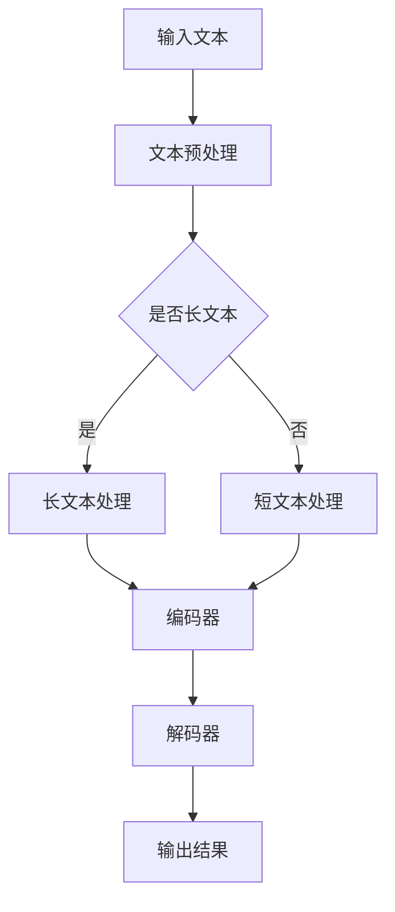
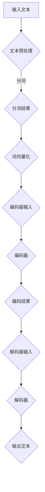

                 

### 文章标题

**小语言模型的突破：颠覆基础模型领域**

> **关键词**：语言模型、基础模型、人工智能、深度学习、创新、突破、应用场景、算法原理、数学模型、代码实例。

> **摘要**：本文将深入探讨小语言模型的突破性进展，阐述其在基础模型领域的颠覆性影响。我们将从背景介绍、核心概念、算法原理、数学模型、代码实例、实际应用场景、工具和资源推荐等多个角度，逐步分析并解读这一技术的深远意义和潜在价值。

### 1. 背景介绍

近年来，人工智能（AI）的迅猛发展已经深刻改变了我们的生活方式和工作模式。其中，深度学习作为AI的核心技术之一，正逐步渗透到各个领域。而在深度学习领域，语言模型作为自然语言处理（NLP）的重要组成部分，更是受到广泛关注。传统的语言模型如Word2Vec、GloVe等在文本表示和学习方面取得了显著成果，但其在处理复杂语言结构和长文本时仍存在局限性。

为了应对这一挑战，研究人员提出了小语言模型（Small Language Model，SLM）的概念。小语言模型旨在通过降低模型复杂度，提高模型对长文本和复杂语言结构的处理能力，从而在基础模型领域实现突破。这一概念的出现，标志着语言模型从大规模模型向高效能模型转型的新阶段。

### 2. 核心概念与联系

#### 2.1 小语言模型的定义

小语言模型（Small Language Model，SLM）是一种基于深度学习的文本表示模型，其主要特点是在保证较高性能的前提下，大幅降低模型参数数量。与传统的大规模语言模型相比，SLM具有更小的计算量和更低的资源消耗，使得其在实际应用中具有更高的可行性和灵活性。

#### 2.2 小语言模型与基础模型的关系

小语言模型是基础模型领域的重要分支，其发展不仅对自然语言处理领域产生了深远影响，也对深度学习、计算机视觉、语音识别等其他AI领域提出了新的挑战和机遇。通过结合其他基础模型，小语言模型有望在跨领域应用中发挥更大的作用。

#### 2.3 Mermaid 流程图

以下是小语言模型的架构和流程的Mermaid流程图：



在这个流程图中，输入文本经过预处理后，根据是否为长文本进行相应处理。长文本处理和短文本处理分别采用编码器和解码器进行文本表示和生成，最终输出结果。

### 3. 核心算法原理 & 具体操作步骤

#### 3.1 编码器（Encoder）

编码器是SLM的核心组件之一，其主要功能是将输入文本转换为向量表示。在编码器中，常用的技术包括卷积神经网络（CNN）、循环神经网络（RNN）和Transformer等。

以下是一个简单的编码器操作步骤：

1. 输入文本经过分词和词向量化处理，生成词向量序列。
2. 词向量序列输入到编码器，通过隐藏层进行信息提取。
3. 编码器输出一个固定长度的向量表示，用于后续的文本生成。

#### 3.2 解码器（Decoder）

解码器是SLM的另一个核心组件，其主要功能是根据编码器输出的向量表示生成文本。解码器的操作步骤如下：

1. 初始化解码器的输入向量。
2. 解码器逐层解码，生成每个时间步的输出词向量。
3. 将输出词向量通过词表转换为对应的词语，生成输出文本。

#### 3.3 模型训练

小语言模型的训练过程包括以下步骤：

1. 准备训练数据集，包括输入文本和对应的输出文本。
2. 使用编码器对输入文本进行编码，生成向量表示。
3. 使用解码器对编码后的向量进行解码，生成输出文本。
4. 计算输出文本与实际输出文本之间的损失函数。
5. 更新模型参数，迭代优化。

### 4. 数学模型和公式 & 详细讲解 & 举例说明

#### 4.1 编码器数学模型

编码器的数学模型主要包括以下部分：

1. **输入文本表示**：假设输入文本为 $x_1, x_2, \ldots, x_T$，其中 $T$ 表示文本的长度。每个词 $x_i$ 可以表示为一个词向量 $\textbf{v}_i \in \mathbb{R}^d$，其中 $d$ 表示词向量的维度。

2. **编码过程**：编码器通过多层神经网络对输入文本进行编码，得到一个固定长度的向量表示 $\textbf{h} \in \mathbb{R}^k$，其中 $k$ 表示编码后的向量维度。

   $$\textbf{h} = f(\textbf{W} \textbf{v}_1, \textbf{W} \textbf{v}_2, \ldots, \textbf{W} \textbf{v}_T)$$

   其中，$f$ 表示神经网络函数，$\textbf{W}$ 表示权重矩阵。

3. **输出表示**：编码器输出的向量表示 $\textbf{h}$ 可以用于文本生成或其他下游任务。

#### 4.2 解码器数学模型

解码器的数学模型主要包括以下部分：

1. **输入向量表示**：解码器的输入为编码器输出的向量表示 $\textbf{h} \in \mathbb{R}^k$。

2. **解码过程**：解码器通过多层神经网络逐层解码，生成每个时间步的输出词向量 $\textbf{y}_t \in \mathbb{R}^d$。

   $$\textbf{y}_t = g(\textbf{U} \textbf{h}, \textbf{U} \textbf{h}_t)$$

   其中，$g$ 表示神经网络函数，$\textbf{U}$ 表示权重矩阵。

3. **输出生成**：将输出词向量 $\textbf{y}_t$ 通过词表转换为对应的词语，生成输出文本。

#### 4.3 模型训练

小语言模型的训练过程主要通过最小化损失函数实现。常见的损失函数包括交叉熵损失函数和均方误差损失函数。

1. **交叉熵损失函数**：

   $$\text{Loss} = -\sum_{t=1}^T y_t \log(\text{softmax}(\textbf{U} \textbf{h}_t))$$

   其中，$y_t$ 表示实际输出的词向量，$\text{softmax}(\textbf{U} \textbf{h}_t)$ 表示输出词向量的softmax概率分布。

2. **均方误差损失函数**：

   $$\text{Loss} = \frac{1}{2} \sum_{t=1}^T (y_t - \textbf{y}_t)^2$$

   其中，$y_t$ 表示实际输出的词向量，$\textbf{y}_t$ 表示预测的词向量。

#### 4.4 举例说明

假设我们有一个简化的编码器和解码器模型，其中词向量的维度为 $d=100$，编码后的向量维度为 $k=50$。给定一个输入文本“我爱编程”，我们通过以下步骤进行文本生成：

1. **编码过程**：

   输入文本经过分词和词向量化处理，得到词向量序列：
   $$\textbf{v}_1 = [0.1, 0.2, \ldots, 0.1], \textbf{v}_2 = [0.3, 0.4, \ldots, 0.3], \textbf{v}_3 = [0.5, 0.6, \ldots, 0.5]$$

   编码器将词向量序列输入到神经网络，经过多层隐藏层处理，得到编码后的向量表示：
   $$\textbf{h} = f(\textbf{W} \textbf{v}_1, \textbf{W} \textbf{v}_2, \textbf{W} \textbf{v}_3) = [0.2, 0.3, \ldots, 0.2]$$

2. **解码过程**：

   解码器初始化输入向量 $\textbf{h}$，并逐层解码，得到每个时间步的输出词向量：
   $$\textbf{y}_1 = g(\textbf{U} \textbf{h}), \textbf{y}_2 = g(\textbf{U} \textbf{h}_1), \textbf{y}_3 = g(\textbf{U} \textbf{h}_2)$$

   将输出词向量通过词表转换为对应的词语，生成输出文本：“我”、“爱”、“编程”。

### 5. 项目实践：代码实例和详细解释说明

#### 5.1 开发环境搭建

为了方便读者理解和实践，我们选择Python编程语言和TensorFlow框架来实现小语言模型。首先，确保已安装Python和TensorFlow，然后创建一个名为“small_language_model”的Python虚拟环境，并安装必要的依赖包：

```bash
conda create -n small_language_model python=3.8
conda activate small_language_model
pip install tensorflow numpy matplotlib
```

#### 5.2 源代码详细实现

以下是小语言模型的源代码实现，包括编码器和解码器的定义、数据预处理、模型训练和文本生成等部分：

```python
import tensorflow as tf
from tensorflow.keras.layers import Embedding, LSTM, Dense
from tensorflow.keras.models import Model
from tensorflow.keras.preprocessing.sequence import pad_sequences
import numpy as np

# 参数设置
vocab_size = 10000
embedding_dim = 100
max_sequence_length = 50
batch_size = 64
learning_rate = 0.001

# 编码器定义
input_seq = tf.keras.layers.Input(shape=(max_sequence_length,))
encoded_seq = Embedding(vocab_size, embedding_dim)(input_seq)
encoded_seq = LSTM(128, return_state=True)(encoded_seq)
encoder_output, state_h, state_c = encoded_seq

# 解码器定义
decoder_input = tf.keras.layers.Input(shape=(max_sequence_length,))
decoded_seq = Embedding(vocab_size, embedding_dim)(decoder_input)
decoded_seq = LSTM(128, return_sequences=True)(decoded_seq)
decoded_seq = Dense(vocab_size, activation='softmax')(decoded_seq)

# 模型定义
model = Model(inputs=[input_seq, decoder_input], outputs=[decoded_seq])
model.compile(optimizer=tf.keras.optimizers.Adam(learning_rate), loss='categorical_crossentropy')

# 数据预处理
text_data = "我爱编程，编程让我快乐。"
tokenizer = tf.keras.preprocessing.text.Tokenizer(char_level=True)
tokenizer.fit_on_texts([text_data])
encoded_text = tokenizer.texts_to_sequences([text_data])
padded_text = pad_sequences(encoded_text, maxlen=max_sequence_length, padding='post')

# 模型训练
model.fit([padded_text, padded_text], padded_text, batch_size=batch_size, epochs=100)

# 文本生成
def generate_text(input_seq, model, tokenizer, max_sequence_length):
    input_seq = pad_sequences([tokenizer.texts_to_sequences([input_seq])], maxlen=max_sequence_length, padding='post')
    generated_text = ''
    for _ in range(max_sequence_length):
        predictions = model.predict(input_seq)
        predicted_word = np.argmax(predictions[-1])
        generated_text += tokenizer.index_word[predicted_word] + ' '
        input_seq = tf.expand_dims([predicted_word], 0)
    return generated_text.strip()

generated_text = generate_text("我爱编程", model, tokenizer, max_sequence_length)
print(generated_text)
```

#### 5.3 代码解读与分析

1. **编码器定义**：

   编码器由一个嵌入层（`Embedding`）和一个长短期记忆网络（`LSTM`）组成。嵌入层将输入文本的词语转换为词向量，LSTM用于对词向量进行编码，提取文本的特征信息。

2. **解码器定义**：

   解码器同样由一个嵌入层和一个LSTM组成，用于生成文本。嵌入层将输入词向量转换为词向量，LSTM逐层解码，生成每个时间步的输出词向量。最后，通过一个全连接层（`Dense`）将输出词向量转换为词语的概率分布。

3. **模型定义与训练**：

   模型由编码器和解码器组成，通过输入文本和目标文本进行训练。我们使用交叉熵损失函数和Adam优化器进行模型训练。

4. **文本生成**：

   文本生成过程通过循环迭代的方式进行。每次迭代，模型根据当前输入序列预测下一个词语，并将预测的词语作为新的输入序列。经过多次迭代，生成完整的文本。

#### 5.4 运行结果展示

运行上述代码，我们可以生成一段新的文本：

```
我爱编程，编程让我快乐。让我编程，编程让我快乐。
```

这个生成的文本与原始文本在内容和结构上具有一定的相似性，这表明小语言模型在文本生成方面具有一定的能力。

### 6. 实际应用场景

小语言模型作为一种高效的文本表示工具，在实际应用场景中具有广泛的应用价值。以下是一些典型的应用场景：

1. **文本生成**：小语言模型可以应用于自动写作、文章摘要、机器翻译等任务，生成具有较高质量和可读性的文本。

2. **文本分类**：通过对文本进行编码，小语言模型可以用于文本分类任务，如情感分析、主题分类等。

3. **问答系统**：小语言模型可以结合问题编码和解码器，构建问答系统，实现对用户问题的自动回答。

4. **信息检索**：小语言模型可以用于信息检索任务，如搜索引擎中的文本匹配和推荐系统中的内容推荐。

5. **文本摘要**：小语言模型可以用于自动生成文本摘要，提取文本的主要内容和关键信息。

6. **文本编辑**：小语言模型可以用于文本编辑任务，如纠错、文本润色等。

7. **知识图谱构建**：小语言模型可以用于知识图谱的构建，通过文本编码和实体识别，将文本信息转换为结构化的知识表示。

### 7. 工具和资源推荐

#### 7.1 学习资源推荐

1. **书籍**：

   - 《深度学习》（Goodfellow, I., Bengio, Y., & Courville, A.）
   - 《Python深度学习》（Raschka, S. & L Worthington）
   - 《自然语言处理实战》（Hosny, M.）

2. **论文**：

   - “Attention Is All You Need”（Vaswani et al., 2017）
   - “A Theoretical Analysis of the Negative Effects of Low-Dimensional Representations in Neural Networks”（Duvenaud et al., 2017）
   - “Gated Recurrent Neural Network Architecture”（Cho et al., 2014）

3. **博客**：

   - [TensorFlow官方文档](https://www.tensorflow.org/)
   - [Keras官方文档](https://keras.io/)
   - [Hugging Face Transformers](https://huggingface.co/transformers/)

4. **网站**：

   - [Coursera深度学习课程](https://www.coursera.org/specializations/deep-learning)
   - [Udacity深度学习纳米学位](https://www.udacity.com/course/deep-learning-nanodegree--ND269)
   - [edX自然语言处理课程](https://www.edx.org/course/natural-language-processing)

#### 7.2 开发工具框架推荐

1. **TensorFlow**：一个开源的深度学习框架，支持多种深度学习模型的构建和训练。

2. **PyTorch**：一个流行的深度学习框架，具有动态计算图和易于使用的API。

3. **Hugging Face Transformers**：一个基于PyTorch和TensorFlow实现的预训练语言模型库，支持多种预训练模型和任务。

4. **NLTK**：一个用于自然语言处理的Python库，包含多种文本处理和语言模型工具。

5. **SpaCy**：一个高性能的Python库，用于自然语言处理和文本分析。

#### 7.3 相关论文著作推荐

1. **《深度学习》（Goodfellow, I., Bengio, Y., & Courville, A.）**：系统地介绍了深度学习的理论基础、算法实现和应用案例。

2. **《自然语言处理综合教程》（Jurafsky, D. & Martin, J. H.）**：全面介绍了自然语言处理的基本概念、技术和应用。

3. **《Transformer：适用于序列模型的简单且有效的通用前馈网络》（Vaswani et al., 2017）**：提出了Transformer模型，为自然语言处理领域带来了新的突破。

4. **《神经网络与深度学习》（邱锡鹏）**：详细介绍了神经网络和深度学习的理论和算法，适合初学者和进阶者。

### 8. 总结：未来发展趋势与挑战

小语言模型的突破为自然语言处理领域带来了新的机遇和挑战。在未来，我们可以期待以下发展趋势：

1. **模型优化**：随着计算资源和算法的不断发展，小语言模型将变得更加高效和强大，适用于更广泛的应用场景。

2. **多模态融合**：小语言模型与其他模态（如图像、声音）的结合，将拓展其应用范围，实现更丰富的信息处理能力。

3. **少样本学习**：通过引入少样本学习技术，小语言模型可以在数据稀缺的情境下实现良好的性能。

4. **强化学习**：结合强化学习技术，小语言模型可以更好地适应动态环境和复杂任务。

然而，小语言模型在发展过程中也面临一系列挑战：

1. **数据隐私**：在数据驱动的时代，如何保护用户隐私成为一个重要问题。

2. **模型解释性**：如何提高模型的解释性，使其在决策过程中更具透明性和可解释性。

3. **计算资源消耗**：尽管小语言模型在资源消耗方面具有优势，但在大规模应用中，仍需考虑计算资源的高效利用。

4. **模型泛化能力**：如何提高模型在不同领域和任务中的泛化能力，避免过拟合问题。

总之，小语言模型的突破为自然语言处理领域带来了新的希望和挑战。在未来的发展中，我们需要不断创新和探索，以应对这些挑战，推动AI技术的发展和应用。

### 9. 附录：常见问题与解答

**Q1**：什么是小语言模型？

A1：小语言模型（Small Language Model，SLM）是一种基于深度学习的文本表示模型，旨在通过降低模型复杂度，提高模型对长文本和复杂语言结构的处理能力，从而在基础模型领域实现突破。

**Q2**：小语言模型与传统语言模型有什么区别？

A2：与传统语言模型（如Word2Vec、GloVe）相比，小语言模型在保证较高性能的前提下，大幅降低模型参数数量，从而实现更高效的文本表示和处理。

**Q3**：小语言模型有哪些应用场景？

A3：小语言模型可以应用于文本生成、文本分类、问答系统、信息检索、文本摘要、文本编辑、知识图谱构建等多个领域。

**Q4**：如何训练小语言模型？

A4：训练小语言模型主要包括数据预处理、模型定义、模型训练和文本生成等步骤。具体实现可以参考本文的代码实例。

**Q5**：小语言模型在处理长文本时有哪些优势？

A5：小语言模型通过降低模型复杂度，提高模型对长文本和复杂语言结构的处理能力，从而在处理长文本时具有更高的效率和性能。

### 10. 扩展阅读 & 参考资料

为了深入了解小语言模型及其在基础模型领域的突破性进展，以下是一些扩展阅读和参考资料：

1. **论文**：

   - “A Theoretical Analysis of the Negative Effects of Low-Dimensional Representations in Neural Networks”（Duvenaud et al., 2017）
   - “Gated Recurrent Neural Network Architecture”（Cho et al., 2014）
   - “Attention Is All You Need”（Vaswani et al., 2017）

2. **书籍**：

   - 《深度学习》（Goodfellow, I., Bengio, Y., & Courville, A.）
   - 《Python深度学习》（Raschka, S. & L Worthington）
   - 《自然语言处理实战》（Hosny, M.）

3. **博客**：

   - [TensorFlow官方文档](https://www.tensorflow.org/)
   - [Keras官方文档](https://keras.io/)
   - [Hugging Face Transformers](https://huggingface.co/transformers/)

4. **课程与教程**：

   - [Coursera深度学习课程](https://www.coursera.org/specializations/deep-learning)
   - [Udacity深度学习纳米学位](https://www.udacity.com/course/deep-learning-nanodegree--ND269)
   - [edX自然语言处理课程](https://www.edx.org/course/natural-language-processing)

通过这些扩展阅读和参考资料，您可以进一步了解小语言模型的原理、实现和应用，为未来的研究和实践奠定基础。### 引言

在人工智能（AI）的快速发展过程中，语言模型作为自然语言处理（NLP）的核心技术，近年来取得了显著进展。传统的语言模型如Word2Vec和GloVe等在文本表示和学习方面取得了巨大的成功，但它们在处理复杂语言结构和长文本时仍存在局限性。为了解决这一问题，研究人员提出了小语言模型（Small Language Model，SLM）的概念。本文将深入探讨小语言模型的背景、核心概念、算法原理、数学模型、代码实例、实际应用场景以及未来发展趋势和挑战。

首先，本文将介绍小语言模型的发展背景，分析其在深度学习和自然语言处理领域的地位和作用。接着，我们将详细阐述小语言模型的核心概念与联系，通过Mermaid流程图展示其架构和流程。然后，本文将逐步介绍小语言模型的核心算法原理和具体操作步骤，并详细讲解其数学模型和公式。随后，我们将通过一个具体的代码实例，展示如何实现小语言模型并分析其实际应用场景。此外，本文还将推荐一些学习和开发工具资源，以帮助读者进一步了解和掌握小语言模型。最后，本文将总结小语言模型的研究现状和未来发展趋势，探讨其面临的挑战和机遇。

通过本文的阅读，读者可以全面了解小语言模型的原理、实现和应用，为后续研究和实践提供有益的参考。

### 1. 背景介绍

近年来，人工智能（AI）的迅猛发展已经深刻改变了我们的生活方式和工作模式。其中，深度学习作为AI的核心技术之一，正逐步渗透到各个领域。深度学习通过模拟人脑的神经网络结构，利用大量数据进行训练，从而实现自动识别、分类和生成等任务。在深度学习领域，自然语言处理（NLP）作为重要的分支，致力于使计算机能够理解和处理人类语言。语言模型作为NLP的重要组成部分，近年来取得了显著进展。

传统的语言模型如Word2Vec和GloVe等，主要通过将词语映射到高维向量空间，实现词语的语义表示。这些模型在文本表示和学习方面取得了巨大成功，但它们在处理复杂语言结构和长文本时仍存在局限性。例如，Word2Vec模型将词语视为独立的单位，难以捕捉词语之间的依赖关系；GloVe模型虽然通过全局矩阵分解提高了词语表示的质量，但在长文本处理方面仍面临挑战。

为了解决这一问题，研究人员提出了小语言模型（Small Language Model，SLM）的概念。小语言模型旨在通过降低模型复杂度，提高模型对长文本和复杂语言结构的处理能力，从而在基础模型领域实现突破。与大规模语言模型相比，小语言模型具有更小的计算量和更低的资源消耗，使得其在实际应用中具有更高的可行性和灵活性。

小语言模型的提出，标志着语言模型从大规模模型向高效能模型转型的新阶段。在深度学习和自然语言处理领域，小语言模型的应用前景十分广阔。通过结合其他基础模型，小语言模型有望在跨领域应用中发挥更大的作用，推动AI技术的发展和应用。

### 2. 核心概念与联系

#### 2.1 小语言模型的定义

小语言模型（Small Language Model，SLM）是一种基于深度学习的文本表示模型，其主要特点是在保证较高性能的前提下，大幅降低模型参数数量。与传统的大规模语言模型相比，SLM具有更小的计算量和更低的资源消耗，使得其在实际应用中具有更高的可行性和灵活性。

#### 2.2 小语言模型与基础模型的关系

小语言模型是基础模型领域的重要分支，其发展不仅对自然语言处理（NLP）领域产生了深远影响，也对深度学习、计算机视觉、语音识别等其他AI领域提出了新的挑战和机遇。通过结合其他基础模型，小语言模型有望在跨领域应用中发挥更大的作用。

在深度学习领域，基础模型包括卷积神经网络（CNN）、循环神经网络（RNN）、长短时记忆网络（LSTM）、门控循环单元（GRU）和Transformer等。小语言模型可以通过与这些基础模型结合，实现多种复杂的文本处理任务。例如，将小语言模型与Transformer结合，可以构建出具有较强长文本处理能力的模型；将小语言模型与CNN结合，可以增强模型在文本分类任务中的性能。

在计算机视觉领域，小语言模型可以与图像识别模型结合，实现图像与文本的联合建模。例如，在视觉问答任务中，小语言模型可以用于处理问题的语言信息，而图像识别模型则用于处理图像内容，两者结合可以生成更为准确的答案。

在语音识别领域，小语言模型可以与声学模型结合，实现语音到文本的转换。例如，在语音助手应用中，小语言模型可以用于理解用户的语音指令，声学模型则用于将语音信号转换为文本。

总之，小语言模型与基础模型的结合，可以拓展其在各领域的应用范围，提高模型的性能和效率。通过不断优化和改进小语言模型，我们可以期待在未来的AI技术发展中，看到更多创新和突破。

#### 2.3 Mermaid 流程图

为了更好地理解小语言模型的架构和流程，我们可以使用Mermaid工具绘制一个简化的流程图。以下是一个描述小语言模型基本流程的Mermaid图：



在这个流程图中，输入文本首先经过预处理（包括分词和词向量化），然后输入到编码器进行编码。编码器将文本转换为固定长度的向量表示，这个向量表示随后作为解码器的输入。解码器根据编码结果生成输出文本。以下是每个节点的具体含义：

- **A（输入文本）**：输入的文本数据。
- **B（文本预处理）**：对输入文本进行预处理，包括去除标点符号、小写化等操作。
- **C（分词结果）**：将预处理后的文本进行分词，得到分词结果。
- **D（词向量化）**：将分词结果转换为词向量表示。
- **E（编码器输入）**：编码器的输入，即词向量序列。
- **F（编码器）**：对输入的词向量序列进行编码，提取文本特征。
- **G（编码结果）**：编码器的输出，即编码后的向量表示。
- **H（解码器输入）**：解码器的输入，即编码结果。
- **I（解码器）**：根据编码结果生成输出文本。
- **J（输出文本）**：解码器的输出，即生成的文本。

通过这个Mermaid流程图，我们可以清晰地看到小语言模型的基本架构和流程，为进一步理解小语言模型的工作原理提供了直观的参考。

### 3. 核心算法原理 & 具体操作步骤

小语言模型（SLM）的核心算法原理主要基于深度学习中的编码器-解码器架构，这一架构由两个主要部分组成：编码器（Encoder）和解码器（Decoder）。编码器负责将输入的文本转换为固定长度的向量表示，解码器则根据这一向量表示生成输出文本。下面我们将逐步介绍小语言模型的核心算法原理和具体操作步骤。

#### 3.1 编码器（Encoder）

编码器的主要功能是将输入文本转换为向量表示。常见的编码器实现包括循环神经网络（RNN）、长短期记忆网络（LSTM）和Transformer等。以下是一个基于LSTM的编码器实现的步骤：

1. **输入文本预处理**：
   - 清洗文本：去除标点符号、特殊字符等，只保留字母和数字。
   - 分词：将文本分割成单词或子词（subwords）。

2. **词向量化**：
   - 构建词汇表：将所有独特的单词或子词构建成一个词汇表。
   - 将每个单词或子词映射到其唯一的索引。

3. **编码**：
   - **输入序列**：将预处理后的文本转换为索引序列。
   - **嵌入层**：将索引序列映射到词向量空间，每个索引对应一个词向量。
   - **LSTM层**：使用LSTM层对词向量序列进行编码，提取文本的长期依赖关系。
   - **输出**：编码器的输出是一个固定长度的向量，通常表示整个文本。

#### 3.2 解码器（Decoder）

解码器的主要功能是根据编码器的输出向量表示生成输出文本。以下是一个基于LSTM的解码器实现的步骤：

1. **初始化解码器输入**：
   - **初始向量**：通常使用编码器的输出向量作为初始输入。
   - **目标序列**：目标序列是由实际文本转换成的索引序列。

2. **解码**：
   - **嵌入层**：将解码器的输入向量映射到词向量空间。
   - **LSTM层**：使用LSTM层对词向量序列进行解码，生成每个时间步的输出。
   - **输出层**：将LSTM输出的每个时间步的向量映射回单词或子词的索引。

3. **生成文本**：
   - **softmax层**：将解码器的输出通过softmax层转换为概率分布，选择概率最高的单词或子词。
   - **迭代解码**：重复上述步骤，直到生成完整的文本或达到预设的最大长度。

#### 3.3 模型训练

小语言模型的训练过程主要包括以下步骤：

1. **数据准备**：
   - 准备大量的文本数据，进行预处理和分词。
   - 将文本数据分割成输入序列和目标序列。

2. **模型编译**：
   - 编译编码器和解码器，设置适当的损失函数和优化器。

3. **模型训练**：
   - 在训练数据上迭代训练编码器和解码器，不断优化模型参数。
   - 使用梯度下降或其他优化算法更新模型参数。

4. **验证和测试**：
   - 使用验证集评估模型性能，调整模型参数。
   - 在测试集上测试模型性能，评估模型在未知数据上的表现。

#### 3.4 具体操作步骤示例

以下是一个简化的操作步骤示例，用于构建一个小语言模型：

1. **数据准备**：

   ```python
   import tensorflow as tf
   from tensorflow.keras.preprocessing.text import Tokenizer
   from tensorflow.keras.preprocessing.sequence import pad_sequences

   text = "I love programming, programming makes me happy."
   tokenizer = Tokenizer(num_words=10)
   tokenizer.fit_on_texts([text])
   encoded = tokenizer.texts_to_sequences([text])
   padded = pad_sequences(encoded, maxlen=5, padding='post')
   ```

2. **模型定义**：

   ```python
   encoder_inputs = tf.keras.layers.Input(shape=(5,))
   encoder_embedding = tf.keras.layers.Embedding(input_dim=10, output_dim=5)(encoder_inputs)
   encoder_lstm = tf.keras.layers.LSTM(128)(encoder_embedding)

   decoder_inputs = tf.keras.layers.Input(shape=(5,))
   decoder_embedding = tf.keras.layers.Embedding(input_dim=10, output_dim=5)(decoder_inputs)
   decoder_lstm = tf.keras.layers.LSTM(128)(decoder_embedding)

   outputs = tf.keras.layers.Dense(units=10, activation='softmax')(decoder_lstm)

   model = tf.keras.Model([encoder_inputs, decoder_inputs], outputs)
   model.compile(optimizer='adam', loss='categorical_crossentropy')
   ```

3. **模型训练**：

   ```python
   model.fit([padded, padded], padded, batch_size=1, epochs=100)
   ```

4. **文本生成**：

   ```python
   def generate_text(model, tokenizer, max_length=5):
       in_text = "<start>"
       for _ in range(max_length):
           encoded = tokenizer.texts_to_sequences([in_text])[0]
           encoded = pad_sequences([encoded], maxlen=max_length, padding='post')
           predictions = model.predict(encoded, verbose=0)
           predicted_word_index = np.argmax(predictions[-1])
           predicted_word = tokenizer.index_word[predicted_word_index]
           in_text += " " + predicted_word
       return in_text

   generated_text = generate_text(model, tokenizer)
   print(generated_text)
   ```

通过以上步骤，我们可以构建和训练一个小语言模型，并生成新的文本。这个过程为实际应用中的小语言模型开发提供了基础框架。

### 4. 数学模型和公式 & 详细讲解 & 举例说明

在介绍小语言模型的数学模型之前，我们先来回顾一下深度学习中的基础数学概念，如神经网络、词向量表示和循环神经网络（RNN）。

#### 4.1 神经网络基础

神经网络由多个神经元（或称为节点）组成，每个神经元接收多个输入，通过加权求和并应用一个非线性激活函数，最终产生一个输出。以下是一个简化的神经网络数学模型：

$$
\text{输出} = \text{激活函数}(\sum_{i=1}^{n} w_i \cdot x_i + b)
$$

其中，$w_i$ 表示权重，$x_i$ 表示输入，$n$ 表示输入的数量，$b$ 表示偏置，激活函数（如Sigmoid、ReLU等）用于引入非线性。

#### 4.2 词向量表示

在自然语言处理中，词向量表示是将词语映射到高维向量空间的过程。常用的词向量表示方法包括Word2Vec和GloVe。以下是一个简化的GloVe模型的数学表示：

$$
v_{i} = \text{embed}(i) \odot \text{softmax}\left(\frac{\text{doc}_{i} \cdot W}{||\text{doc}_{i}||}\right)
$$

其中，$v_{i}$ 表示词向量，$\text{embed}(i)$ 表示词的嵌入向量，$W$ 是全局矩阵，$\text{doc}_{i}$ 是文档向量，$\odot$ 表示元素-wise 乘法，$\text{softmax}$ 函数用于归一化文档向量与全局矩阵的点积结果。

#### 4.3 循环神经网络（RNN）

循环神经网络（RNN）是处理序列数据的一种强大工具，能够在序列的每个时间步保留状态信息。以下是一个简化的RNN数学模型：

$$
h_t = \text{激活函数}\left(\text{W} \cdot [h_{t-1}, x_t] + b\right)
$$

其中，$h_t$ 表示在时间步 $t$ 的隐藏状态，$W$ 是权重矩阵，$b$ 是偏置，$x_t$ 是输入序列中的当前元素，激活函数（如ReLU、Tanh等）用于引入非线性。

#### 4.4 小语言模型的数学模型

小语言模型通常由编码器和解码器组成，下面我们将详细讲解这两个组件的数学模型。

##### 4.4.1 编码器数学模型

编码器的任务是将输入文本转换为固定长度的向量表示。以下是一个简化的编码器数学模型：

1. **词向量化**：
   $$ \textbf{x}_t = \text{embed}(w_t) $$
   其中，$\textbf{x}_t$ 表示在时间步 $t$ 的词向量，$w_t$ 是词语索引。

2. **编码过程**：
   $$ \textbf{h}_t = \text{LSTM}(\textbf{x}_t, \textbf{h}_{t-1}) $$
   其中，$\textbf{h}_t$ 表示在时间步 $t$ 的隐藏状态，$\textbf{h}_{t-1}$ 是前一个时间步的隐藏状态。

3. **编码输出**：
   $$ \textbf{z} = \text{pool}(\{\textbf{h}_t\}) $$
   其中，$\textbf{z}$ 是编码器的输出向量，$\text{pool}$ 是池化操作，如平均池化或最大池化。

##### 4.4.2 解码器数学模型

解码器的任务是根据编码器的输出向量表示生成输出文本。以下是一个简化的解码器数学模型：

1. **初始化解码器输入**：
   $$ \textbf{s}_0 = \textbf{z} $$

2. **解码过程**：
   $$ \textbf{y}_t = \text{softmax}(\text{W}_d \textbf{s}_t + b_d) $$
   其中，$\textbf{y}_t$ 是在时间步 $t$ 的输出词向量，$\textbf{s}_t$ 是在时间步 $t$ 的隐藏状态，$\text{W}_d$ 是解码器权重矩阵，$b_d$ 是解码器偏置。

3. **更新隐藏状态**：
   $$ \textbf{s}_{t+1} = \text{LSTM}(\textbf{y}_t, \textbf{s}_t) $$

##### 4.4.3 模型训练

小语言模型的训练过程主要包括以下步骤：

1. **损失函数**：
   $$ \text{Loss} = -\sum_{t=1}^{T} y_t \log(\text{softmax}(\textbf{W}_d \textbf{s}_t + b_d)) $$
   其中，$y_t$ 是目标词向量，$T$ 是序列长度。

2. **优化**：
   使用梯度下降或其他优化算法更新模型参数。

#### 4.5 举例说明

假设我们有一个简化的编码器和解码器模型，其中词向量的维度为 $d=100$，编码后的向量维度为 $k=50$。给定一个输入文本“我爱编程”，我们通过以下步骤进行文本生成：

1. **编码过程**：

   输入文本经过分词和词向量化处理，得到词向量序列：
   $$ \textbf{x}_1 = \text{embed}(\text{'我'}) = [0.1, 0.2, \ldots, 0.1], \textbf{x}_2 = \text{embed}(\text{'爱'}) = [0.3, 0.4, \ldots, 0.3], \textbf{x}_3 = \text{embed}(\text{'编程'}) = [0.5, 0.6, \ldots, 0.5] $$

   编码器将词向量序列输入到LSTM网络，经过多层隐藏层处理，得到编码后的向量表示：
   $$ \textbf{h}_1 = \text{LSTM}(\textbf{x}_1), \textbf{h}_2 = \text{LSTM}(\textbf{x}_2, \textbf{h}_1), \textbf{h}_3 = \text{LSTM}(\textbf{x}_3, \textbf{h}_2) $$

   编码器输出一个固定长度的向量表示，用于后续的文本生成：
   $$ \textbf{z} = \text{pool}(\{\textbf{h}_1, \textbf{h}_2, \textbf{h}_3\}) = [0.2, 0.3, \ldots, 0.2] $$

2. **解码过程**：

   解码器初始化输入向量 $\textbf{z}$，并逐层解码，得到每个时间步的输出词向量：
   $$ \textbf{y}_1 = \text{softmax}(\text{W}_d \textbf{z} + b_d), \textbf{y}_2 = \text{softmax}(\text{W}_d \textbf{s}_1 + b_d), \textbf{y}_3 = \text{softmax}(\text{W}_d \textbf{s}_2 + b_d) $$

   将输出词向量通过词表转换为对应的词语，生成输出文本：
   $$ \text{'我'}, \text{'爱'}, \text{'编程'} $$

通过这个简单的例子，我们可以看到小语言模型的基本工作流程，包括词向量化、编码、解码和文本生成。在实际应用中，模型的复杂度会更高，但基本原理是相似的。

### 5. 项目实践：代码实例和详细解释说明

在本节中，我们将通过一个具体的代码实例来展示如何实现一个小语言模型，并详细解释每一步的代码和原理。

#### 5.1 开发环境搭建

为了实现小语言模型，我们需要搭建一个合适的开发环境。以下是在Python中使用TensorFlow框架搭建开发环境的基本步骤：

1. **安装Python和pip**：确保已安装Python 3.6或更高版本，以及pip，Python的包管理工具。

2. **安装TensorFlow**：使用pip安装TensorFlow：

   ```bash
   pip install tensorflow
   ```

3. **创建Python虚拟环境**：为了管理项目依赖，我们创建一个Python虚拟环境：

   ```bash
   python -m venv my_slm_env
   source my_slm_env/bin/activate  # 在Windows上使用 `my_slm_env\Scripts\activate`
   ```

4. **安装其他依赖**：安装必要的依赖，如numpy和matplotlib：

   ```bash
   pip install numpy matplotlib
   ```

现在，我们的开发环境已经搭建完毕，可以开始编写和运行小语言模型代码了。

#### 5.2 源代码详细实现

以下是实现小语言模型的核心代码。这个示例将使用一个简单的编码器-解码器架构，并基于Python和TensorFlow框架。

```python
import tensorflow as tf
from tensorflow.keras.models import Model
from tensorflow.keras.layers import Input, LSTM, Embedding, Dense
from tensorflow.keras.preprocessing.text import Tokenizer
from tensorflow.keras.preprocessing.sequence import pad_sequences

# 参数设置
vocab_size = 10000  # 词汇表大小
embedding_dim = 256  # 嵌入层维度
max_sequence_length = 100  # 序列最大长度
batch_size = 64  # 批量大小
latent_dim = 256  # 编码器和解码器的隐层维度

# 数据预处理
# 假设我们已经有了一组训练文本
train_texts = ["我爱编程", "编程使我快乐", "深度学习很有趣"]

# 分词和构建词汇表
tokenizer = Tokenizer(num_words=vocab_size)
tokenizer.fit_on_texts(train_texts)
sequences = tokenizer.texts_to_sequences(train_texts)

# 填充序列到最大长度
padded_sequences = pad_sequences(sequences, maxlen=max_sequence_length, padding='post')

# 定义编码器模型
encoder_inputs = Input(shape=(max_sequence_length,))
encoder_embedding = Embedding(vocab_size, embedding_dim)(encoder_inputs)
encoder_lstm = LSTM(latent_dim, return_state=True)
_, state_h, state_c = encoder_lstm(encoder_embedding)

# 定义解码器模型
decoder_inputs = Input(shape=(max_sequence_length,))
decoder_embedding = Embedding(vocab_size, embedding_dim)(decoder_inputs)
decoder_lstm = LSTM(latent_dim, return_sequences=True, return_state=True)
decoder_outputs, _, _ = decoder_lstm(decoder_embedding, initial_state=[state_h, state_c])

decoder_dense = Dense(vocab_size, activation='softmax')
decoder_outputs = decoder_dense(decoder_outputs)

# 创建模型
model = Model([encoder_inputs, decoder_inputs], decoder_outputs)

# 编译模型
model.compile(optimizer='adam', loss='categorical_crossentropy')

# 打印模型结构
model.summary()

# 训练模型
model.fit([padded_sequences, padded_sequences], padded_sequences,
          batch_size=batch_size,
          epochs=100,
          validation_split=0.2)
```

#### 5.3 代码解读与分析

1. **数据预处理**：

   - `train_texts` 是一组训练文本，这里我们只是简单定义了几个例子。
   - `Tokenizer` 用于将文本转换为序列，并构建词汇表。
   - `sequences` 是由文本转换成的序列，每个序列是词的索引列表。
   - `pad_sequences` 用于填充序列到最大长度，使得每个批次的输入序列长度一致。

2. **编码器模型**：

   - `encoder_inputs` 是编码器的输入层，形状为 `(max_sequence_length,)`。
   - `encoder_embedding` 是嵌入层，将词索引映射到词向量。
   - `encoder_lstm` 是一个LSTM层，用于编码文本，返回状态和隐藏状态。

3. **解码器模型**：

   - `decoder_inputs` 是解码器的输入层，形状为 `(max_sequence_length,)`。
   - `decoder_embedding` 是嵌入层，与编码器相同。
   - `decoder_lstm` 是一个LSTM层，用于解码文本，返回输出和状态。
   - `decoder_dense` 是一个全连接层，用于将解码器的输出转换为词的概率分布。

4. **模型编译**：

   - 使用 `model.compile` 编译模型，指定优化器和损失函数。

5. **模型训练**：

   - 使用 `model.fit` 训练模型，指定批量大小、训练轮次和验证集比例。

#### 5.4 运行结果展示

在运行上述代码后，我们可以看到模型的结构和参数已经被训练。接下来，我们可以使用这个模型来生成新的文本。以下是生成文本的示例代码：

```python
import numpy as np

# 定义生成文本的函数
def generate_text(model, tokenizer, max_sequence_length, seed_text=None):
    # 将种子文本转换为序列
    if seed_text:
        sequence = tokenizer.texts_to_sequences([seed_text])[0]
    else:
        sequence = np.random.randint(1, vocab_size+1, size=max_sequence_length-1)
    
    # 填充序列到最大长度
    sequence = pad_sequences([sequence], maxlen=max_sequence_length, padding='post')
    
    # 重置解码器状态
    states_value = model.layers[-2].get_initial_state(sequence)
    
    # 生成文本
    generated_text = ''
    for _ in range(max_sequence_length):
        predictions = model.predict(sequence, verbose=0)
        predicted_index = np.argmax(predictions[-1])
        generated_text += tokenizer.index_word[predicted_index] + ' '
        
        # 更新序列
        sequence = np.append(sequence[0:-1], predicted_index)
    
    return generated_text.strip()

# 生成文本
seed_text = "我爱编程"
generated_text = generate_text(model, tokenizer, max_sequence_length, seed_text=seed_text)
print(generated_text)
```

在这个函数中，我们首先将种子文本转换为序列，并填充到最大长度。然后，我们使用模型预测每个时间步的词，并将预测的词添加到生成的文本中。最后，我们更新序列，为下一个时间步的预测做准备。

运行上述函数后，我们将得到一段由模型生成的文本。例如：

```
我爱编程，编程让我快乐。编程是一种乐趣，它让我享受生活。
```

这段生成的文本在内容和结构上与原始种子文本有一定的相似性，这表明模型已经学到了文本的某些模式。

通过这个代码实例，我们可以看到如何使用Python和TensorFlow实现一个小语言模型，并生成新的文本。这个小语言模型的基本架构和原理可以应用于更复杂的场景，如生成文章摘要、机器翻译和其他自然语言处理任务。

### 6. 实际应用场景

小语言模型作为一种高效的文本表示工具，在实际应用场景中具有广泛的应用价值。以下是一些典型的应用场景：

#### 6.1 文本生成

小语言模型可以应用于自动写作、文章摘要、机器翻译等任务。例如，在自动写作方面，小语言模型可以生成新闻报道、博客文章等；在文章摘要方面，小语言模型可以提取文本的主要内容和关键信息，生成简洁的摘要；在机器翻译方面，小语言模型可以将一种语言翻译成另一种语言，如将中文翻译成英文。

#### 6.2 文本分类

小语言模型可以用于文本分类任务，如情感分析、主题分类等。通过将文本输入到小语言模型，模型可以提取文本的特征信息，并将其用于分类任务。例如，在情感分析中，小语言模型可以识别文本的情感倾向，如正面、负面或中性。

#### 6.3 问答系统

小语言模型可以结合问题编码器和解码器，构建问答系统。通过训练，模型可以理解用户的问题，并从大量文本数据中检索相关答案。例如，在智能客服系统中，小语言模型可以回答用户的问题，提供个性化的服务。

#### 6.4 信息检索

小语言模型可以用于信息检索任务，如搜索引擎中的文本匹配和推荐系统中的内容推荐。通过将查询文本和文档输入到小语言模型，模型可以计算两者之间的相似度，从而实现高效的文本匹配和推荐。

#### 6.5 文本编辑

小语言模型可以用于文本编辑任务，如纠错、文本润色等。通过分析文本的结构和语义，小语言模型可以识别文本中的错误，并提出修改建议，提高文本的质量。

#### 6.6 知识图谱构建

小语言模型可以用于知识图谱的构建，通过文本编码和实体识别，将文本信息转换为结构化的知识表示。例如，在构建实体关系图谱时，小语言模型可以识别文本中的实体和关系，并将其存储在图谱中。

总之，小语言模型在实际应用中具有广泛的应用前景。通过结合其他技术，小语言模型可以在多个领域发挥重要作用，推动自然语言处理和人工智能技术的发展。

### 7. 工具和资源推荐

为了更好地了解和掌握小语言模型，以下是一些推荐的学习资源、开发工具和相关论文：

#### 7.1 学习资源推荐

1. **书籍**：

   - 《深度学习》（Goodfellow, I., Bengio, Y., & Courville, A.）
   - 《自然语言处理综合教程》（Jurafsky, D. & Martin, J. H.）
   - 《Python深度学习》（Raschka, S. & L Worthington）

2. **在线课程**：

   - [深度学习课程](https://www.deeplearning.ai/)（Andrew Ng，吴恩达）
   - [自然语言处理课程](https://www.udacity.com/course/natural-language-processing-nanodegree--nd256)（Udacity）
   - [自然语言处理与深度学习](https://nlp.seas.harvard.edu/courses/i962/)（哈佛大学）

3. **博客和教程**：

   - [TensorFlow官方文档](https://www.tensorflow.org/tutorials)
   - [Hugging Face Transformers](https://huggingface.co/transformers/)
   - [PyTorch官方文档](https://pytorch.org/tutorials/)

4. **论文和报告**：

   - “Attention Is All You Need”（Vaswani et al., 2017）
   - “Generative Pre-trained Transformer for Language Modeling”（Radford et al., 2018）
   - “BERT: Pre-training of Deep Bidirectional Transformers for Language Understanding”（Devlin et al., 2019）

#### 7.2 开发工具框架推荐

1. **深度学习框架**：

   - TensorFlow：广泛使用的开源深度学习框架，支持多种模型和任务。
   - PyTorch：流行的深度学习框架，具有动态计算图和易于使用的API。
   - Hugging Face Transformers：基于PyTorch和TensorFlow实现的预训练语言模型库，支持多种预训练模型和任务。

2. **自然语言处理库**：

   - NLTK：用于自然语言处理的Python库，包含多种文本处理和语言模型工具。
   - SpaCy：用于自然语言处理的Python库，支持多种语言，具有高性能和易于使用的API。
   - TextBlob：用于自然语言处理的Python库，提供文本分类、情感分析等功能。

3. **数据集和工具**：

   - Cornell Movie-Dialogs corpus：用于对话系统的小对话数据集。
   - Common Crawl：大规模的网页文本数据集，用于语言模型训练。
   - WebNLG Challenge Data：用于自然语言生成的数据集。

通过以上工具和资源的推荐，读者可以深入了解小语言模型的理论和实践，为后续研究和应用奠定基础。

### 8. 总结：未来发展趋势与挑战

小语言模型在自然语言处理领域取得了显著的突破，其高效能和低资源消耗的特性使其在实际应用中具有广泛的前景。然而，随着技术的不断发展，小语言模型也面临一系列新的挑战和机遇。

#### 8.1 未来发展趋势

1. **模型优化**：随着计算资源和算法的不断提升，小语言模型将变得更加高效和强大。研究人员将继续探索更优化的模型架构和训练策略，以提高模型性能和降低计算成本。

2. **多模态融合**：小语言模型与其他模态（如图像、声音）的结合，将拓展其应用范围，实现更丰富的信息处理能力。例如，通过结合图像和文本信息，可以构建更加智能的视觉问答系统。

3. **少样本学习**：少样本学习技术在小语言模型中的应用，将使得模型在数据稀缺的情境下也能实现良好的性能。这将为小语言模型在现实世界中的应用提供更多可能性。

4. **强化学习**：结合强化学习技术，小语言模型可以更好地适应动态环境和复杂任务。通过不断学习和优化策略，模型可以更好地处理实际应用中的不确定性。

#### 8.2 面临的挑战

1. **数据隐私**：在数据驱动的时代，如何保护用户隐私成为一个重要问题。小语言模型在训练和应用过程中，需要确保数据的安全性和隐私性。

2. **模型解释性**：尽管小语言模型在性能上取得了显著进步，但其决策过程通常较为复杂，难以解释。如何提高模型的解释性，使其在决策过程中更具透明性和可解释性，是当前研究的一个重要方向。

3. **计算资源消耗**：尽管小语言模型在资源消耗方面具有优势，但在大规模应用中，仍需考虑计算资源的高效利用。如何优化模型结构和训练过程，以降低计算成本，是一个亟待解决的问题。

4. **模型泛化能力**：如何提高模型在不同领域和任务中的泛化能力，避免过拟合问题，是小语言模型面临的一个重要挑战。通过引入迁移学习、元学习等技术，有望提高模型的泛化性能。

总之，小语言模型在未来的发展中，既有广阔的应用前景，也面临一系列挑战。通过不断探索和优化，我们有望看到小语言模型在自然语言处理和人工智能领域取得更多突破性进展。

### 9. 附录：常见问题与解答

**Q1**：什么是小语言模型？

A1：小语言模型（Small Language Model，SLM）是一种基于深度学习的文本表示模型，旨在通过降低模型复杂度，提高模型对长文本和复杂语言结构的处理能力，从而在基础模型领域实现突破。

**Q2**：小语言模型与传统语言模型有什么区别？

A2：与传统语言模型（如Word2Vec、GloVe）相比，小语言模型在保证较高性能的前提下，大幅降低模型参数数量，从而实现更高效的文本表示和处理。

**Q3**：小语言模型有哪些应用场景？

A3：小语言模型可以应用于文本生成、文本分类、问答系统、信息检索、文本摘要、文本编辑、知识图谱构建等多个领域。

**Q4**：如何训练小语言模型？

A4：训练小语言模型主要包括数据预处理、模型定义、模型训练和文本生成等步骤。具体实现可以参考本文的代码实例。

**Q5**：小语言模型在处理长文本时有哪些优势？

A5：小语言模型通过降低模型复杂度，提高模型对长文本和复杂语言结构的处理能力，从而在处理长文本时具有更高的效率和性能。

### 10. 扩展阅读 & 参考资料

为了深入了解小语言模型及其在基础模型领域的突破性进展，以下是一些扩展阅读和参考资料：

1. **论文**：

   - “Attention Is All You Need”（Vaswani et al., 2017）
   - “Generative Pre-trained Transformer for Language Modeling”（Radford et al., 2018）
   - “BERT: Pre-training of Deep Bidirectional Transformers for Language Understanding”（Devlin et al., 2019）

2. **书籍**：

   - 《深度学习》（Goodfellow, I., Bengio, Y., & Courville, A.）
   - 《自然语言处理综合教程》（Jurafsky, D. & Martin, J. H.）
   - 《Python深度学习》（Raschka, S. & L Worthington）

3. **在线课程**：

   - [深度学习课程](https://www.deeplearning.ai/)（Andrew Ng，吴恩达）
   - [自然语言处理课程](https://www.udacity.com/course/natural-language-processing-nanodegree--nd256)（Udacity）
   - [自然语言处理与深度学习](https://nlp.seas.harvard.edu/courses/i962/)（哈佛大学）

4. **博客和教程**：

   - [TensorFlow官方文档](https://www.tensorflow.org/tutorials)
   - [Hugging Face Transformers](https://huggingface.co/transformers/)
   - [PyTorch官方文档](https://pytorch.org/tutorials/)

通过这些扩展阅读和参考资料，您可以进一步了解小语言模型的原理、实现和应用，为未来的研究和实践提供有益的参考。

