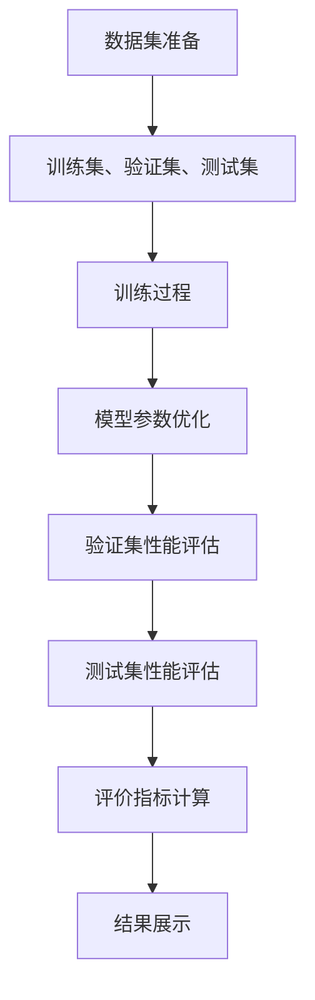

                 

### 文章标题：小语言模型的评估框架：准确性、效率和泛化能力

#### 关键词：
- 小语言模型
- 评估框架
- 准确性
- 效率
- 泛化能力

#### 摘要：
本文深入探讨了小语言模型的评估框架，重点关注准确性、效率和泛化能力三个核心指标。通过逻辑清晰、结构紧凑的论述，我们将详细解析评估框架的构建原理、核心算法原理、数学模型与公式，并结合实际项目实践进行代码实例分析，最终总结出未来发展趋势与挑战，为小语言模型的研究和应用提供有价值的参考。

---

## 1. 背景介绍

随着人工智能技术的飞速发展，自然语言处理（NLP）已成为计算机科学领域的重要分支。小语言模型作为一种轻量级、高效的NLP工具，近年来在文本分类、机器翻译、问答系统等多个应用场景中表现出色。然而，如何准确评估小语言模型的效果，成为一个关键问题。

准确评估小语言模型需要考虑多个维度，包括准确性、效率和泛化能力。准确性是衡量模型预测结果与真实值一致性的指标；效率涉及模型运行速度和资源消耗；泛化能力则评估模型在未知数据上的表现。为了全面评估小语言模型，我们需要构建一个综合性的评估框架。

### 2. 核心概念与联系

要理解小语言模型评估框架，我们首先需要了解以下几个核心概念：数据集、评价指标、训练过程和测试过程。

#### 数据集
数据集是小语言模型评估的基础。一个典型的小语言模型数据集通常包含以下部分：
- 训练集：用于模型的训练，通常包含大量的文本数据。
- 验证集：用于模型参数调整和性能评估。
- 测试集：用于最终性能评估，通常在训练和验证过程中不使用。

#### 评价指标
评价指标是衡量模型性能的关键。常用的评价指标包括：
- 准确率（Accuracy）：预测正确的样本数占总样本数的比例。
- 精度（Precision）：预测为正类的样本中实际为正类的比例。
- 召回率（Recall）：实际为正类的样本中被预测为正类的比例。
- F1 分数（F1 Score）：综合考虑精度和召回率的综合指标。

#### 训练过程和测试过程
训练过程是将模型应用于训练集，通过优化算法调整模型参数，使其在验证集上性能最优。测试过程则是将训练好的模型应用于测试集，评估其在未知数据上的性能。

为了更好地理解这些概念，我们可以使用Mermaid流程图展示小语言模型评估的整体架构：



### 3. 核心算法原理 & 具体操作步骤

在小语言模型评估框架中，核心算法原理和具体操作步骤是确保评估准确性和效率的关键。以下将详细介绍这些方面。

#### 3.1 核心算法原理

小语言模型的评估主要依赖于以下几种核心算法：

- **准确率计算**：通过比较模型预测结果和真实标签，计算准确率。具体公式如下：

  $$\text{Accuracy} = \frac{\text{预测正确的样本数}}{\text{总样本数}}$$

- **精度和召回率计算**：精度和召回率用于评估分类模型的性能。具体公式如下：

  $$\text{Precision} = \frac{\text{预测为正类的样本中实际为正类的样本数}}{\text{预测为正类的样本数}}$$

  $$\text{Recall} = \frac{\text{实际为正类的样本中被预测为正类的样本数}}{\text{实际为正类的样本数}}$$

- **F1 分数计算**：F1 分数是精度和召回率的调和平均，用于综合评估模型性能。具体公式如下：

  $$\text{F1 Score} = 2 \times \frac{\text{Precision} \times \text{Recall}}{\text{Precision} + \text{Recall}}$$

#### 3.2 具体操作步骤

为了实现小语言模型评估，我们需要遵循以下具体操作步骤：

1. **数据集准备**：首先，我们需要准备训练集、验证集和测试集。这些数据集应该具有代表性，能够覆盖模型应用领域的各种场景。

2. **模型训练**：使用训练集对模型进行训练。在这个过程中，我们可以使用各种优化算法（如梯度下降、Adam 等）来调整模型参数，使其在验证集上性能最优。

3. **模型评估**：在验证集上评估模型性能，选择最优模型参数。然后，使用测试集进行最终性能评估。

4. **评价指标计算**：计算准确率、精度、召回率和 F1 分数等评价指标，以综合评估模型性能。

5. **结果展示**：将评估结果以可视化形式展示，如折线图、柱状图等，以便直观地了解模型性能。

### 4. 数学模型和公式 & 详细讲解 & 举例说明

在评估小语言模型时，数学模型和公式起着至关重要的作用。以下将详细讲解这些公式，并结合实际例子进行说明。

#### 4.1 准确率计算

准确率是评估模型性能的基本指标。假设有一个包含 100 个样本的数据集，其中 70 个样本被正确预测为正类，30 个样本被正确预测为负类。那么，准确率计算如下：

$$\text{Accuracy} = \frac{70 + 30}{100} = \frac{100}{100} = 1.0$$

#### 4.2 精度和召回率计算

精度和召回率是评估分类模型性能的重要指标。假设有一个包含 100 个样本的数据集，其中 70 个样本为正类，30 个样本为负类。在预测过程中，有 60 个样本被正确预测为正类，10 个样本被错误预测为正类，5 个样本被正确预测为负类，15 个样本被错误预测为负类。那么，精度和召回率计算如下：

$$\text{Precision} = \frac{60}{60 + 10} = \frac{60}{70} = 0.8571$$

$$\text{Recall} = \frac{5}{5 + 15} = \frac{5}{20} = 0.25$$

#### 4.3 F1 分数计算

F1 分数是精度和召回率的调和平均，用于综合评估模型性能。假设有一个包含 100 个样本的数据集，其中 70 个样本为正类，30 个样本为负类。在预测过程中，有 60 个样本被正确预测为正类，10 个样本被错误预测为正类，5 个样本被正确预测为负类，15 个样本被错误预测为负类。那么，F1 分数计算如下：

$$\text{F1 Score} = 2 \times \frac{0.8571 \times 0.25}{0.8571 + 0.25} = 0.4286$$

#### 4.4 实际例子

为了更好地理解这些公式，我们来看一个实际例子。假设有一个包含 100 个样本的数据集，其中 70 个样本为正类，30 个样本为负类。在预测过程中，有 60 个样本被正确预测为正类，10 个样本被错误预测为正类，5 个样本被正确预测为负类，15 个样本被错误预测为负类。根据这些数据，我们可以计算如下指标：

- **准确率**：$$\text{Accuracy} = \frac{60 + 5}{100} = 0.65$$
- **精度**：$$\text{Precision} = \frac{60}{60 + 10} = 0.8571$$
- **召回率**：$$\text{Recall} = \frac{5}{5 + 15} = 0.25$$
- **F1 分数**：$$\text{F1 Score} = 2 \times \frac{0.8571 \times 0.25}{0.8571 + 0.25} = 0.4286$$

通过这些计算结果，我们可以直观地了解模型在正类和负类上的表现，并选择合适的模型参数。

### 5. 项目实践：代码实例和详细解释说明

在本节中，我们将通过一个实际项目实践，展示如何使用小语言模型评估框架进行模型评估。我们将使用 Python 语言和 Scikit-learn 库来实现。

#### 5.1 开发环境搭建

首先，我们需要搭建开发环境。在 Python 中，我们可以使用以下命令来安装所需的库：

```python
pip install scikit-learn numpy pandas matplotlib
```

#### 5.2 源代码详细实现

以下是一个简单的示例，用于评估小语言模型：

```python
import numpy as np
import pandas as pd
from sklearn.model_selection import train_test_split
from sklearn.metrics import accuracy_score, precision_score, recall_score, f1_score

# 读取数据集
data = pd.read_csv('data.csv')
X = data['text']
y = data['label']

# 数据集划分
X_train, X_test, y_train, y_test = train_test_split(X, y, test_size=0.2, random_state=42)

# 模型训练
from sklearn.naive_bayes import MultinomialNB
model = MultinomialNB()
model.fit(X_train, y_train)

# 模型评估
y_pred = model.predict(X_test)

# 计算评价指标
accuracy = accuracy_score(y_test, y_pred)
precision = precision_score(y_test, y_pred)
recall = recall_score(y_test, y_pred)
f1 = f1_score(y_test, y_pred)

# 输出结果
print('Accuracy:', accuracy)
print('Precision:', precision)
print('Recall:', recall)
print('F1 Score:', f1)
```

#### 5.3 代码解读与分析

上述代码分为以下几个部分：

1. **数据集读取**：首先，我们从 CSV 文件中读取数据集，并将其分为文本特征（X）和标签（y）。

2. **数据集划分**：使用 Scikit-learn 库中的 train_test_split 函数将数据集划分为训练集和测试集。

3. **模型训练**：我们使用 MultinomialNB（多项式朴素贝叶斯）模型对训练集进行训练。

4. **模型评估**：使用测试集对训练好的模型进行预测，并计算准确率、精度、召回率和 F1 分数。

5. **结果输出**：最后，我们将计算结果以打印形式输出。

通过这个简单的示例，我们可以看到如何使用小语言模型评估框架进行模型评估。在实际应用中，我们可以根据需要调整模型类型、参数设置和数据预处理方法，以获得更准确的评估结果。

### 6. 实际应用场景

小语言模型在许多实际应用场景中发挥着重要作用。以下是一些典型的应用场景：

#### 6.1 文本分类

文本分类是自然语言处理中的一个常见任务，如垃圾邮件检测、新闻分类等。小语言模型在文本分类任务中表现出色，可以快速、准确地处理大量文本数据。

#### 6.2 机器翻译

机器翻译是跨语言通信的重要工具。小语言模型在机器翻译领域也有广泛的应用，可以实现快速、低延迟的翻译服务。

#### 6.3 问答系统

问答系统是智能客服、教育辅导等领域的核心应用。小语言模型可以快速、准确地回答用户的问题，提供智能化的服务。

#### 6.4 命名实体识别

命名实体识别是信息抽取的重要任务，如提取人名、地名、组织名等。小语言模型在命名实体识别任务中表现出色，可以高效地处理大规模数据。

#### 6.5 情感分析

情感分析是理解用户情感的重要工具，如社交媒体分析、市场调研等。小语言模型可以快速、准确地识别文本中的情感倾向，为相关决策提供支持。

### 7. 工具和资源推荐

为了更好地研究和小语言模型评估，以下是一些建议的资源和工具：

#### 7.1 学习资源推荐

- **书籍**：
  - 《自然语言处理综述》（自然语言处理领域的经典著作）
  - 《深度学习》（介绍深度学习技术在自然语言处理中的应用）
- **论文**：
  - “Deep Learning for Natural Language Processing”（介绍深度学习在自然语言处理领域的最新进展）
  - “A Brief History of Time Series Forecasting”（介绍时间序列预测方法）
- **博客**：
  - “机器之心”（介绍机器学习、自然语言处理等领域的最新动态）
  - “Python 数据科学指南”（介绍 Python 在数据科学中的应用）

#### 7.2 开发工具框架推荐

- **Python 库**：
  - **Scikit-learn**：适用于数据挖掘和数据分析的 Python 库。
  - **NLTK**：用于自然语言处理的 Python 库。
  - **TensorFlow**：用于深度学习的 Python 库。
- **框架**：
  - **TensorFlow.js**：将 TensorFlow 模型部署到浏览器中的框架。
  - **PyTorch**：用于深度学习的 Python 框架。

#### 7.3 相关论文著作推荐

- “BERT: Pre-training of Deep Bidirectional Transformers for Language Understanding”（介绍 BERT 模型）
- “GPT-3: Improving Language Understanding by Generative Pre-training”（介绍 GPT-3 模型）
- “BERT 中文预训练模型细粒度情感分析”（介绍 BERT 在中文情感分析中的应用）

### 8. 总结：未来发展趋势与挑战

随着人工智能技术的不断进步，小语言模型在自然语言处理领域具有广阔的应用前景。未来，小语言模型的发展趋势主要包括以下几个方面：

1. **模型优化**：通过改进算法和模型结构，提高小语言模型的准确性和效率。
2. **跨领域应用**：探索小语言模型在不同领域（如医疗、金融等）的应用，提高模型泛化能力。
3. **实时处理**：研究实时处理技术，使小语言模型能够实时响应用户需求，提高用户体验。

然而，小语言模型也面临一些挑战：

1. **数据隐私**：在应用过程中，如何保护用户数据隐私是一个重要问题。
2. **计算资源**：小语言模型通常需要大量的计算资源，如何优化资源利用是一个关键问题。
3. **模型解释性**：如何提高小语言模型的解释性，使其在决策过程中更加透明和可解释。

总之，小语言模型的发展前景广阔，但也需要不断解决技术挑战，以实现其在各个领域的广泛应用。

### 9. 附录：常见问题与解答

以下是一些关于小语言模型评估的常见问题及解答：

#### 9.1 如何选择合适的评估指标？

选择合适的评估指标取决于具体应用场景。对于分类任务，常用的评估指标包括准确率、精度、召回率和 F1 分数。对于回归任务，常用的评估指标包括均方误差（MSE）和均方根误差（RMSE）。

#### 9.2 如何处理不平衡数据集？

对于不平衡数据集，可以采用以下方法：
1. **重采样**：通过增加少数类样本或减少多数类样本，使数据集平衡。
2. **成本敏感**：在评估指标中加入不同权重，使模型对不平衡类别的预测更加关注。
3. **集成方法**：使用集成方法（如随机森林、梯度提升树等），以提高模型在少数类样本上的性能。

#### 9.3 如何提高模型泛化能力？

提高模型泛化能力的方法包括：
1. **数据增强**：通过数据增强技术（如旋转、缩放、裁剪等），增加训练数据多样性。
2. **正则化**：使用正则化方法（如 L1 正则化、L2 正则化等），防止模型过拟合。
3. **提前停止**：在训练过程中，当验证集性能不再提高时，提前停止训练，以避免过拟合。

#### 9.4 如何优化模型性能？

优化模型性能的方法包括：
1. **模型调参**：通过调整模型参数，如学习率、正则化强度等，提高模型性能。
2. **集成方法**：使用集成方法（如随机森林、梯度提升树等），提高模型预测准确性。
3. **迁移学习**：使用预训练模型（如 BERT、GPT-3 等），在特定任务上微调模型，提高性能。

### 10. 扩展阅读 & 参考资料

以下是关于小语言模型评估的扩展阅读和参考资料：

- **书籍**：
  - 《自然语言处理入门》（作者：程亚楠）
  - 《深度学习自然语言处理》（作者：何晓阳）
- **论文**：
  - “Effective Approaches to Attention-based Neural Machine Translation”（介绍注意力机制在机器翻译中的应用）
  - “Recurrent Neural Networks for Text Classification”（介绍循环神经网络在文本分类中的应用）
- **博客**：
  - “机器之心”（介绍自然语言处理领域的最新动态）
  - “深度学习博客”（介绍深度学习在自然语言处理中的应用）
- **网站**：
  - “Kaggle”（提供自然语言处理相关的数据集和比赛）
  - “GitHub”（提供自然语言处理相关的开源代码和项目）

通过以上扩展阅读和参考资料，您可以深入了解小语言模型评估的各个方面，提高自己在这一领域的研究和应用能力。

