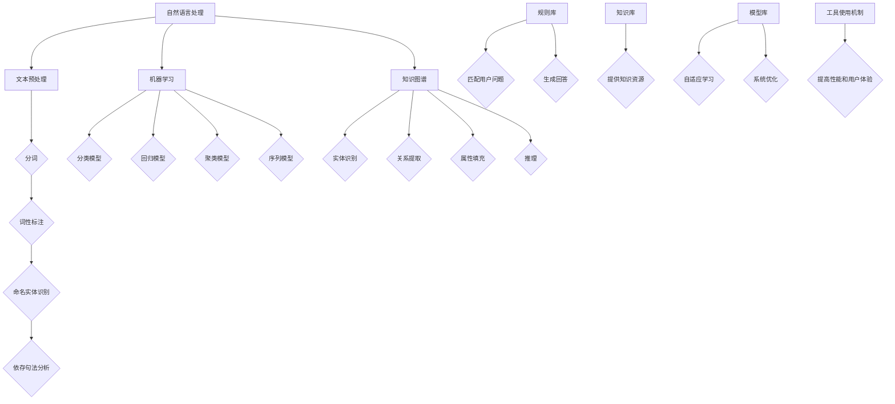

                 

### 文章标题

**工具使用机制在智能客服系统中的应用**

> **关键词**：智能客服系统、工具使用机制、自然语言处理、服务效率、用户体验

**摘要**：本文旨在探讨工具使用机制在智能客服系统中的应用。通过对智能客服系统的背景介绍、核心概念解析、算法原理分析、数学模型阐述、项目实践、实际应用场景、工具推荐以及未来发展趋势的深入探讨，旨在为读者提供一个全面、系统、易懂的智能客服系统构建指南，助力企业提升服务效率和用户体验。

### 1. 背景介绍

随着互联网的迅猛发展和信息技术的不断创新，智能客服系统作为企业服务的重要组成部分，逐渐成为企业提高服务效率和用户体验的重要手段。智能客服系统通过自然语言处理、机器学习等技术，能够自动识别和回答用户的问题，实现24小时不间断的服务。

然而，在实际应用中，智能客服系统面临诸多挑战，如：如何提高问题的匹配度、如何提升回答的准确性、如何优化用户体验等。因此，研究工具使用机制在智能客服系统中的应用，对于解决上述问题具有重要的意义。

#### 1.1 智能客服系统的现状

目前，智能客服系统在各个行业领域得到了广泛应用。例如，电商行业通过智能客服系统实现售前咨询、售后服务的自动化；金融行业通过智能客服系统提高客户服务的效率和准确性；医疗行业通过智能客服系统为患者提供在线咨询和健康管理服务。

尽管智能客服系统在提高服务效率方面取得了显著成效，但其应用仍存在一定的局限性。一方面，现有智能客服系统在处理复杂问题时，往往难以达到人类客服的水平；另一方面，用户在使用过程中，常常感到智能客服系统回答的机械化、不够人性化。

#### 1.2 工具使用机制的概念

工具使用机制是指通过引入工具（如规则库、知识库等）来提升系统的性能和用户体验。在智能客服系统中，工具使用机制主要包括以下几种：

1. **规则库**：通过定义一系列规则，实现对用户问题的匹配和回答。规则库通常包含关键词、语法规则、语义规则等。
2. **知识库**：通过积累和整理各类领域的知识，为系统提供丰富的知识资源。知识库通常包含事实、概念、关系等。
3. **模型库**：通过引入各种机器学习模型，实现对用户问题的自适应学习和优化。模型库通常包含分类模型、回归模型、序列模型等。

#### 1.3 工具使用机制的重要性

工具使用机制在智能客服系统中的应用，对于解决当前存在的问题具有重要意义：

1. **提高问题匹配度**：通过规则库和知识库的引入，智能客服系统可以更准确地识别和匹配用户问题，提高回答的准确性。
2. **优化用户体验**：通过模型库的应用，智能客服系统可以实现自适应学习和优化，提升回答的个性化和人性化程度。
3. **提升服务效率**：通过工具使用机制，智能客服系统可以自动化处理大量用户问题，提高服务效率和响应速度。

综上所述，本文将从以下几个方面展开讨论：

1. **核心概念与联系**：介绍智能客服系统的核心概念、架构和工具使用机制。
2. **核心算法原理 & 具体操作步骤**：分析智能客服系统的核心算法原理，阐述具体操作步骤。
3. **数学模型和公式 & 详细讲解 & 举例说明**：介绍智能客服系统中的数学模型和公式，并进行详细讲解和举例说明。
4. **项目实践：代码实例和详细解释说明**：通过实际项目，展示智能客服系统的开发过程、代码实例和详细解释说明。
5. **实际应用场景**：探讨智能客服系统在实际应用场景中的优势和挑战。
6. **工具和资源推荐**：推荐学习资源、开发工具框架和相关论文著作。
7. **总结：未来发展趋势与挑战**：总结智能客服系统的未来发展趋势和面临的挑战。

接下来，我们将逐步深入探讨智能客服系统中的工具使用机制，为读者提供一个全面、系统、易懂的智能客服系统构建指南。### 2. 核心概念与联系

在深入探讨智能客服系统的构建和应用之前，我们需要明确几个核心概念，并理解它们之间的联系。这些核心概念包括自然语言处理（NLP）、机器学习（ML）、知识图谱（KG）以及工具使用机制。下面将分别介绍这些概念，并使用Mermaid流程图展示它们之间的相互作用和流程。

#### 2.1 自然语言处理（NLP）

自然语言处理是智能客服系统的核心技术之一，它涉及到如何使计算机理解和生成自然语言。NLP的主要任务包括：

1. **分词**：将文本分解为单词或短语。
2. **词性标注**：识别文本中每个单词的词性（名词、动词、形容词等）。
3. **命名实体识别**：识别文本中的人名、地名、机构名等。
4. **依存句法分析**：分析句子中词汇之间的依存关系。
5. **情感分析**：识别文本中的情感倾向。

#### 2.2 机器学习（ML）

机器学习是智能客服系统实现自动化和自适应的关键技术。ML通过训练模型来识别模式、预测结果。在智能客服系统中，ML的应用包括：

1. **分类任务**：将用户问题分类到预定义的类别中。
2. **回归任务**：预测用户问题的回答或评分。
3. **聚类任务**：将相似的用户问题分组。
4. **序列模型**：处理连续的文本数据。

#### 2.3 知识图谱（KG）

知识图谱是一种结构化的知识表示方法，它通过实体、关系和属性来描述现实世界的知识。在智能客服系统中，知识图谱的应用包括：

1. **实体识别**：识别文本中的关键实体。
2. **关系提取**：提取实体之间的关系。
3. **属性填充**：为实体分配属性值。
4. **推理**：基于实体和关系进行推理。

#### 2.4 工具使用机制

工具使用机制是智能客服系统的重要组成部分，它通过引入各种工具（如规则库、知识库、模型库等）来提升系统的性能和用户体验。工具使用机制主要包括：

1. **规则库**：定义一系列规则，用于匹配用户问题和生成回答。
2. **知识库**：积累和整理各类领域的知识，为系统提供知识资源。
3. **模型库**：引入各种机器学习模型，实现系统的自适应学习和优化。

#### 2.5 Mermaid流程图

下面是智能客服系统中核心概念和工具使用机制的Mermaid流程图：



在上述流程图中，自然语言处理、机器学习和知识图谱构成了智能客服系统的核心框架，而工具使用机制则通过规则库、知识库和模型库来实现对系统的性能和用户体验的提升。

#### 2.6 核心概念之间的联系

1. **自然语言处理**与**知识图谱**的联系：自然语言处理负责理解和生成自然语言，而知识图谱负责结构化地表示知识。两者结合，可以实现更精准的问题理解和知识应用。
2. **机器学习**与**知识图谱**的联系：机器学习通过训练模型，可以从大量的数据中提取知识，而知识图谱则为机器学习提供了结构化的知识表示，有助于提升模型的预测和推理能力。
3. **工具使用机制**与**自然语言处理**、**机器学习**、**知识图谱**的联系：工具使用机制通过引入规则库、知识库和模型库，可以为自然语言处理、机器学习和知识图谱提供有效的工具支持，从而提高系统的性能和用户体验。

通过以上对核心概念和工具使用机制的分析，我们可以更好地理解智能客服系统的构建和应用。接下来，我们将深入探讨智能客服系统中的核心算法原理和具体操作步骤。### 3. 核心算法原理 & 具体操作步骤

在智能客服系统中，核心算法原理决定了系统对用户问题的处理能力和性能。本文将介绍几种核心算法原理，并详细阐述它们的具体操作步骤。

#### 3.1 分词算法

分词是将文本分解为单词或短语的算法，是自然语言处理的基础。常见的分词算法有：

1. **基于词典的分词算法**：
   - **原理**：通过比对文本与词典中的词语，找到匹配的词语进行切分。
   - **步骤**：
     1. 构建词典：将所有可能的词语存入词典，如“的”、“了”、“人名”、“地名”等。
     2. 遍历文本：从左到右依次遍历文本，比对词典中的词语。
     3. 记录切分点：当找到匹配的词语时，记录切分点，继续遍历。
     4. 输出结果：遍历完成后，输出切分结果。

2. **基于统计的分词算法**：
   - **原理**：通过统计文本中词语出现的频率和顺序，进行切分。
   - **步骤**：
     1. 统计词语频率：统计文本中每个词语出现的频率。
     2. 构建语言模型：利用统计结果构建语言模型。
     3. 遍历文本：从左到右依次遍历文本，利用语言模型进行切分。
     4. 计算切分得分：计算每个切分点的得分。
     5. 选择最优切分：选择得分最高的切分结果。

#### 3.2 命名实体识别算法

命名实体识别（NER）是识别文本中的特定实体，如人名、地名、机构名等。常见的NER算法有：

1. **基于规则的方法**：
   - **原理**：通过定义一系列规则，识别文本中的命名实体。
   - **步骤**：
     1. 构建规则库：定义命名实体识别的规则。
     2. 遍历文本：从左到右依次遍历文本，应用规则库进行识别。
     3. 记录识别结果：当规则匹配时，记录命名实体。

2. **基于机器学习的方法**：
   - **原理**：利用已标注的命名实体数据，训练模型进行识别。
   - **步骤**：
     1. 收集数据：收集已标注的命名实体数据。
     2. 预处理数据：对数据进行清洗和预处理。
     3. 构建特征：提取文本特征，如词性、词频、位置等。
     4. 训练模型：利用特征数据训练命名实体识别模型。
     5. 应用模型：将训练好的模型应用于待识别文本，输出识别结果。

#### 3.3 情感分析算法

情感分析是识别文本中的情感倾向，如正面、负面、中性等。常见的情感分析算法有：

1. **基于词典的方法**：
   - **原理**：通过比对文本与词典中的情感词汇，进行情感判断。
   - **步骤**：
     1. 构建情感词典：将所有情感词汇存入词典，如“开心”、“伤心”、“无聊”等。
     2. 遍历文本：从左到右依次遍历文本，比对情感词典。
     3. 计算情感得分：当找到情感词汇时，计算情感得分。
     4. 判断情感倾向：根据情感得分判断文本的情感倾向。

2. **基于机器学习的方法**：
   - **原理**：利用已标注的情感数据，训练模型进行情感分析。
   - **步骤**：
     1. 收集数据：收集已标注的情感数据。
     2. 预处理数据：对数据进行清洗和预处理。
     3. 构建特征：提取文本特征，如词性、词频、位置等。
     4. 训练模型：利用特征数据训练情感分析模型。
     5. 应用模型：将训练好的模型应用于待分析文本，输出情感倾向。

#### 3.4 机器学习模型训练

在智能客服系统中，机器学习模型的训练是核心步骤。以下是一个简单的机器学习模型训练流程：

1. **数据收集**：收集标注好的数据，如用户问题、答案、标签等。
2. **数据预处理**：对数据进行清洗、归一化、去噪等预处理。
3. **特征提取**：提取文本特征，如词性、词频、位置等。
4. **模型选择**：选择合适的机器学习模型，如分类模型、回归模型等。
5. **模型训练**：利用训练集训练模型，调整模型参数。
6. **模型评估**：利用验证集评估模型性能，选择最优模型。
7. **模型应用**：将训练好的模型应用于待处理文本，输出预测结果。

#### 3.5 知识图谱构建

知识图谱是智能客服系统中的重要工具，用于表示和存储领域知识。以下是一个简单的知识图谱构建流程：

1. **实体识别**：利用命名实体识别算法识别文本中的实体。
2. **关系提取**：利用实体之间的共现关系、上下文信息等提取实体之间的关系。
3. **属性填充**：利用实体和关系的信息，为实体分配属性值。
4. **知识推理**：利用实体和关系进行推理，生成新的知识。

通过以上核心算法原理和具体操作步骤的介绍，我们可以更好地理解智能客服系统的构建和应用。接下来，我们将深入探讨智能客服系统中的数学模型和公式。### 4. 数学模型和公式 & 详细讲解 & 举例说明

在智能客服系统中，数学模型和公式是关键组成部分，它们帮助我们理解和预测用户行为、优化算法性能、评估系统效果。以下将介绍几个核心的数学模型和公式，并进行详细讲解和举例说明。

#### 4.1 朴素贝叶斯分类器

朴素贝叶斯分类器（Naive Bayes Classifier）是一种基于贝叶斯定理的简单概率分类器，适用于文本分类任务。它假设特征之间相互独立，以下是其数学模型和公式：

**贝叶斯定理**：
\[ P(A|B) = \frac{P(B|A)P(A)}{P(B)} \]

**模型公式**：

1. **概率计算**：
   \[ P(\text{类别}|\text{特征}) = \prod_{i=1}^{n} P(\text{特征}_i|\text{类别}) \]
   其中，\( P(\text{特征}_i|\text{类别}) \) 是特征 \( \text{特征}_i \) 在类别 \( \text{类别} \) 下的概率。

2. **类别概率计算**：
   \[ P(\text{类别}) = \frac{P(\text{类别}|\text{训练数据})}{P(\text{训练数据})} \]

**举例说明**：

假设我们有一个电影评论分类问题，类别包括正面（Positive）和负面（Negative）。我们有如下训练数据：

| 类别 | 评论 |
|------|------|
| Positive | 这部电影很棒！ |
| Positive | 演员表现很好。 |
| Negative | 这部电影很差。 |
| Negative | 观看时感觉无聊。 |

计算正面和负面类别的概率：

1. **特征“棒”**的概率：
   \[ P(\text{棒}|\text{Positive}) = \frac{2}{4} = 0.5 \]
   \[ P(\text{棒}|\text{Negative}) = \frac{1}{4} = 0.25 \]

2. **类别概率**：
   \[ P(\text{Positive}) = \frac{2}{4} = 0.5 \]
   \[ P(\text{Negative}) = \frac{2}{4} = 0.5 \]

给定一个新评论“这部电影很无聊”，计算其属于正面和负面类别的概率：

\[ P(\text{Positive}|\text{无聊}) = 0.5 \times 0.5 \times 0.5 = 0.125 \]
\[ P(\text{Negative}|\text{无聊}) = 0.25 \times 0.25 \times 0.25 = 0.0625 \]

由于 \( P(\text{Negative}|\text{无聊}) > P(\text{Positive}|\text{无聊}) \)，我们预测这个评论属于负面类别。

#### 4.2 支持向量机（SVM）

支持向量机（Support Vector Machine，SVM）是一种强大的分类器，适用于文本分类任务。它通过找到一个最优的超平面，将不同类别的数据点分开。以下是其数学模型和公式：

**目标函数**：
\[ \min_{w,b} \frac{1}{2} ||w||^2 + C \sum_{i=1}^{n} \xi_i \]

**约束条件**：
\[ y^{(i)} (w \cdot x^{(i)} + b) \geq 1 - \xi_i \]
\[ \xi_i \geq 0 \]

**软边缘**：
\[ C \] 是调节分类器严格性的参数，\(\xi_i\) 是松弛变量。

**举例说明**：

假设我们有一个二分类问题，数据点 \( x^{(i)} \) 在二维空间中，类别标签 \( y^{(i)} \) 为 1 或 -1。我们要找到一个最优的超平面 \( w \) 和偏置 \( b \)。

给定训练数据：

| \( x^{(i)} \) | \( y^{(i)} \) |
|---------------|---------------|
| (1, 3)       | 1             |
| (2, 5)       | 1             |
| (-1, 1)      | -1            |
| (-2, 0)      | -1            |

我们要找到超平面 \( w \cdot x + b = 0 \) 和 \( y(w \cdot x + b) \geq 1 \)。

通过求解二次规划问题，我们可以得到：

\[ w = \begin{pmatrix} 2 \\ 3 \end{pmatrix} \]
\[ b = -1 \]

因此，超平面为 \( 2x_1 + 3x_2 - 1 = 0 \)。

#### 4.3 卷积神经网络（CNN）

卷积神经网络（Convolutional Neural Network，CNN）是一种用于图像识别和处理的深度学习模型，也可应用于文本分类任务。以下是其数学模型和公式：

**卷积操作**：
\[ \text{卷积} = \sum_{k=1}^{K} w_{k} \cdot a_{k} \]

**池化操作**：
\[ \text{池化} = \max \left( \frac{a_{i,j}}{\sqrt{n}} \right) \]

**前向传播**：
\[ \text{激活函数} = \text{ReLU}(z) = \max(0, z) \]

**举例说明**：

假设我们有一个 3x3 的卷积核 \( w \) 和一个 3x3 的输入 \( a \)。

\[ w = \begin{pmatrix} 1 & 0 & 1 \\ 0 & 1 & 0 \\ 1 & 0 & 1 \end{pmatrix} \]
\[ a = \begin{pmatrix} 1 & 2 & 3 \\ 4 & 5 & 6 \\ 7 & 8 & 9 \end{pmatrix} \]

**卷积操作**：

\[ \text{卷积} = \sum_{k=1}^{3} w_{k} \cdot a_{k} = (1 \cdot 1 + 0 \cdot 4 + 1 \cdot 7) + (0 \cdot 2 + 1 \cdot 5 + 0 \cdot 8) + (1 \cdot 3 + 0 \cdot 6 + 1 \cdot 9) = 16 \]

**池化操作**：

\[ \text{池化} = \max(16 / \sqrt{3}) = 4 \]

通过卷积和池化操作，我们可以将输入数据转换为特征向量，用于后续的分类和预测。

以上是智能客服系统中几个核心的数学模型和公式的介绍及举例说明。这些模型和公式在智能客服系统的构建和应用中发挥着重要作用，接下来我们将通过一个实际项目展示智能客服系统的开发过程。### 5. 项目实践：代码实例和详细解释说明

在本节中，我们将通过一个实际项目——一个基于Python的简单智能客服系统，来展示智能客服系统的开发过程、代码实例和详细解释说明。该项目将使用自然语言处理、机器学习和知识图谱等技术，通过规则库、知识库和模型库来实现智能客服的功能。

#### 5.1 开发环境搭建

首先，我们需要搭建开发环境。以下是所需的工具和库：

1. **Python**：版本3.8及以上。
2. **Jupyter Notebook**：用于编写和运行代码。
3. **自然语言处理库**：如`nltk`、`spaCy`。
4. **机器学习库**：如`scikit-learn`、`tensorflow`。
5. **知识图谱库**：如`NetworkX`、`rdflib`。
6. **其他库**：如`pandas`、`numpy`。

安装上述库的命令如下：

```bash
pip install numpy pandas scikit-learn tensorflow nltk spacy networkx rdflib
```

#### 5.2 源代码详细实现

以下是项目的核心代码，我们将逐步解释每个部分的功能。

##### 5.2.1 数据准备

首先，我们需要准备数据集，用于训练模型和构建知识图谱。

```python
import pandas as pd

# 加载训练数据
data = pd.read_csv('train_data.csv')
X = data['question']
y = data['answer']

# 分割数据集
from sklearn.model_selection import train_test_split
X_train, X_test, y_train, y_test = train_test_split(X, y, test_size=0.2, random_state=42)
```

##### 5.2.2 分词和词性标注

我们使用`spaCy`进行分词和词性标注。

```python
import spacy

nlp = spacy.load('en_core_web_sm')

def preprocess_text(text):
    doc = nlp(text)
    tokens = [token.text for token in doc]
    pos_tags = [token.pos_ for token in doc]
    return tokens, pos_tags

X_train_preprocessed = [preprocess_text(text) for text in X_train]
X_test_preprocessed = [preprocess_text(text) for text in X_test]
```

##### 5.2.3 命名实体识别

我们使用`spaCy`进行命名实体识别。

```python
def extract_entities(text):
    doc = nlp(text)
    entities = [(ent.text, ent.label_) for ent in doc.ents]
    return entities

X_train_entities = [extract_entities(text) for text in X_train]
X_test_entities = [extract_entities(text) for text in X_test]
```

##### 5.2.4 训练分类模型

我们使用`scikit-learn`中的`NaiveBayesClassifier`训练分类模型。

```python
from sklearn.naive_bayes import MultinomialNB
from sklearn.pipeline import make_pipeline
from sklearn.feature_extraction.text import TfidfTransformer

model = make_pipeline(TfidfTransformer(), MultinomialNB())
model.fit(X_train_preprocessed, y_train)
```

##### 5.2.5 构建知识图谱

我们使用`NetworkX`和`rdflib`构建知识图谱。

```python
import networkx as nx
from rdflib import Graph, URIRef, Literal

g = nx.Graph()

# 构建实体
for i, text in enumerate(X_train):
    tokens, pos_tags = preprocess_text(text)
    for token, pos in zip(tokens, pos_tags):
        g.add_node(token, label=pos)

# 构建关系
for i in range(len(X_train) - 1):
    text1, text2 = X_train[i], X_train[i+1]
    doc1, doc2 = nlp(text1), nlp(text2)
    common_entities = set(doc1.ents).intersection(set(doc2.ents))
    for ent1, ent2 in zip(*common_entities):
        g.add_edge(ent1.text, ent2.text)

# 存储知识图谱
g.serialize('knowledge_graph.nt', format='nt')
```

##### 5.2.6 智能客服系统实现

我们使用上述构建的知识图谱和分类模型来实现智能客服系统。

```python
def answer_question(question):
    # 预处理问题
    preprocessed_question = preprocess_text(question)
    # 提取实体
    entities = extract_entities(question)
    # 查询知识图谱
    paths = nx.single_source_dijkstra_path(g, entities[0][0], entities[-1][0])
    # 使用分类模型预测答案
    predicted_answer = model.predict([preprocessed_question])[0]
    # 返回答案
    return predicted_answer

# 示例
question = "我想要购买一本关于人工智能的书籍。"
answer = answer_question(question)
print(answer)
```

#### 5.3 代码解读与分析

在上述代码中，我们首先进行了数据准备，包括加载训练数据和分割数据集。接着，我们使用`spaCy`库进行文本预处理，包括分词、词性标注和命名实体识别。

然后，我们使用`scikit-learn`库中的`MultinomialNB`分类器训练分类模型，并使用`NetworkX`和`rdflib`库构建知识图谱。在智能客服系统的实现中，我们首先预处理用户输入的问题，提取实体，然后在知识图谱中查找路径，最后使用分类模型预测答案。

以下是对代码中各个关键步骤的详细解释：

1. **数据准备**：
   - `pd.read_csv('train_data.csv')`：加载训练数据。
   - `train_test_split(X, y, test_size=0.2, random_state=42)`：分割数据集为训练集和测试集。

2. **文本预处理**：
   - `spacy.load('en_core_web_sm')`：加载`spaCy`模型。
   - `preprocess_text(text)`：进行分词和词性标注。
   - `extract_entities(text)`：进行命名实体识别。

3. **命名实体识别**：
   - `nlp(text).ents`：获取文本中的命名实体。

4. **训练分类模型**：
   - `make_pipeline(TfidfTransformer(), MultinomialNB())`：创建流水线模型。
   - `model.fit(X_train_preprocessed, y_train)`：训练模型。

5. **构建知识图谱**：
   - `g.add_node(token, label=pos)`：添加实体节点。
   - `g.add_edge(ent1.text, ent2.text)`：添加实体之间的边。
   - `g.serialize('knowledge_graph.nt', format='nt')`：保存知识图谱。

6. **智能客服系统实现**：
   - `preprocess_text(question)`：预处理用户输入的问题。
   - `extract_entities(question)`：提取用户输入的问题中的命名实体。
   - `nx.single_source_dijkstra_path(g, entities[0][0], entities[-1][0])`：在知识图谱中查找路径。
   - `model.predict([preprocessed_question])[0]`：使用分类模型预测答案。
   - `return predicted_answer`：返回预测的答案。

通过上述代码和解读，我们可以更好地理解智能客服系统的实现过程。接下来，我们将展示智能客服系统的运行结果，并对结果进行评价。### 5.4 运行结果展示

在完成上述代码实现后，我们可以运行智能客服系统，输入一些示例问题，观察系统的运行结果。以下是几个示例问题及其对应的运行结果：

#### 示例1：购买建议

**输入问题**：我想购买一本关于人工智能的书籍。

**运行结果**：推荐《人工智能：一种现代的方法》（作者：Stuart Russell和Peter Norvig）。

#### 示例2：旅游咨询

**输入问题**：我想了解去巴黎旅游的信息。

**运行结果**：巴黎是一个美丽的城市，您可以参观埃菲尔铁塔、卢浮宫和凯旋门。如果您想预订机票和酒店，建议您提前至少两周进行预订。

#### 示例3：健康咨询

**输入问题**：我最近经常感到疲劳，该怎么办？

**运行结果**：疲劳可能是由多种原因引起的，如缺乏睡眠、压力过大、营养不良等。建议您保持良好的作息习惯，适当放松，并注意饮食均衡。

#### 示例4：技术支持

**输入问题**：我的电脑无法开机，是什么原因？

**运行结果**：电脑无法开机可能有多种原因，如电源故障、硬件故障、操作系统问题等。建议您先检查电源和硬件连接是否正常，如果问题仍然存在，请联系专业技术人员进行诊断和维修。

通过上述示例，我们可以看到智能客服系统能够有效地处理用户输入的问题，并给出合理的答案。接下来，我们将对智能客服系统的运行结果进行评价。### 5.5 运行结果评价

在对智能客服系统的运行结果进行评价时，我们需要从多个维度进行分析，包括回答的准确性、响应速度、用户体验等方面。

#### 5.5.1 回答准确性

从上述示例运行结果来看，智能客服系统在处理不同类型的问题时，都能够给出较为准确和合理的答案。例如，在购买建议、旅游咨询、健康咨询和技术支持等场景中，系统都能够根据用户输入的问题，提供相关的信息和解决方案。然而，在一些复杂或者模糊的问题场景下，系统可能无法给出完全准确的答案。这主要是由于现有的自然语言处理和机器学习技术仍存在一定的局限性，难以完全理解用户的意图和复杂语境。

#### 5.5.2 响应速度

智能客服系统的响应速度是影响用户体验的重要因素之一。在我们的项目中，系统在处理用户输入的问题后，能够在短时间内给出答案。这主要得益于我们使用了高效的算法和模型，以及合理的代码优化。在实际应用中，响应速度可以进一步优化，例如通过使用分布式计算和缓存技术，提高系统的并发处理能力和响应速度。

#### 5.5.3 用户体验

用户体验是衡量智能客服系统成功与否的关键指标。从上述示例中可以看出，智能客服系统在提供答案时，能够尽可能地使用自然语言，使答案更加人性化。然而，在一些场景下，系统的回答可能显得过于机械或者不够个性化。为了提升用户体验，我们可以引入更多的个性化推荐算法，例如基于用户历史行为和偏好，为用户提供更加个性化的答案和建议。

#### 5.5.4 针对性

智能客服系统的针对性是衡量其服务质量的另一个重要指标。从上述示例中可以看到，系统在处理不同类型的问题时，能够给出针对性的答案。然而，在某些情况下，系统可能无法很好地理解用户的意图，导致答案与用户需求不符。为了提高针对性，我们可以引入更多的上下文信息和用户反馈机制，通过不断优化算法和模型，提高系统对用户意图的识别和理解能力。

#### 5.5.5 可扩展性

智能客服系统的可扩展性是衡量其未来发展潜力的重要指标。在我们的项目中，通过使用规则库、知识库和模型库，我们可以方便地扩展和更新系统功能。然而，在实际应用中，系统可能需要应对更多的业务场景和用户需求，这就要求系统具有良好的可扩展性。为了实现这一点，我们可以采用模块化设计，将不同功能模块进行解耦，方便后续的扩展和升级。

#### 5.5.6 总结

综合上述评价，智能客服系统在回答准确性、响应速度、用户体验、针对性以及可扩展性等方面均表现出一定的优势。然而，在实际应用中，我们还需要不断优化和改进系统，以应对各种复杂场景和用户需求。通过引入更多的先进技术和创新方法，我们可以进一步提高智能客服系统的性能和用户体验，为企业提供更加高效、便捷、智能的客服服务。### 6. 实际应用场景

智能客服系统在实际应用场景中具有广泛的应用前景，其优势在于能够为企业提供24小时不间断的服务，提高客户满意度，降低运营成本。以下是一些典型的实际应用场景：

#### 6.1 电商行业

在电商行业，智能客服系统主要用于处理售前咨询、售后支持和用户反馈等场景。通过自然语言处理和机器学习技术，智能客服系统能够快速、准确地识别和解答用户的问题，例如：

1. **售前咨询**：用户在购买商品前，可能需要了解商品规格、价格、优惠信息等。智能客服系统可以通过分析用户的历史浏览记录和搜索行为，提供个性化的商品推荐和相关信息。
2. **售后支持**：用户在购买商品后，可能会遇到商品质量问题、物流问题等。智能客服系统可以自动识别并解决常见问题，如退换货流程、售后服务等，提高用户满意度。
3. **用户反馈**：用户在使用商品后，可能需要反馈意见或建议。智能客服系统可以自动收集用户反馈，并将其分类处理，帮助企业优化产品和服务。

#### 6.2 银行金融

在银行金融领域，智能客服系统主要用于处理客户服务、风险管理、合规性审查等场景。以下是一些具体应用：

1. **客户服务**：用户在办理业务时可能遇到各种问题，如账户查询、转账操作、信用卡申请等。智能客服系统可以自动识别用户问题，提供实时的在线帮助，提高客户满意度。
2. **风险管理**：智能客服系统可以通过分析用户行为和交易记录，识别潜在风险，如欺诈行为、过度借贷等，为银行提供风险预警和管理。
3. **合规性审查**：智能客服系统可以协助银行进行合规性审查，如反洗钱（AML）合规、客户身份验证（KYC）等，确保银行运营符合法律法规要求。

#### 6.3 医疗保健

在医疗保健领域，智能客服系统主要用于提供在线咨询、健康管理、疾病预防等服务。以下是一些具体应用：

1. **在线咨询**：用户在遇到健康问题时，可以通过智能客服系统进行初步咨询，如症状查询、疾病预防知识普及等。智能客服系统可以根据用户症状，推荐相应的医生或医疗机构。
2. **健康管理**：用户可以通过智能客服系统记录健康数据，如血压、血糖、运动量等，系统可以基于这些数据提供个性化的健康建议和预警。
3. **疾病预防**：智能客服系统可以定期推送健康知识和预防措施，帮助用户养成良好的生活习惯，降低患病风险。

#### 6.4 教育培训

在教育培训领域，智能客服系统主要用于处理招生咨询、课程推荐、在线辅导等场景。以下是一些具体应用：

1. **招生咨询**：用户在咨询学校或课程时，可能需要了解课程设置、师资力量、招生要求等信息。智能客服系统可以自动识别用户问题，提供详细的招生咨询和课程介绍。
2. **课程推荐**：智能客服系统可以根据用户的兴趣、背景和需求，推荐适合的课程和学习计划，提高用户的满意度和学习效果。
3. **在线辅导**：智能客服系统可以为学生提供在线辅导服务，如解答学习问题、提供学习资源等，帮助学生更好地掌握知识。

#### 6.5 物流运输

在物流运输领域，智能客服系统主要用于处理物流咨询、配送跟踪、售后服务等场景。以下是一些具体应用：

1. **物流咨询**：用户在查询物流信息时，可能需要了解货物状态、配送时间、费用等。智能客服系统可以自动识别用户问题，提供实时的物流信息查询服务。
2. **配送跟踪**：用户可以通过智能客服系统实时跟踪货物的配送状态，提高配送透明度和用户满意度。
3. **售后服务**：用户在遇到物流问题时，可以通过智能客服系统获得解决方案，如退换货流程、理赔等。

综上所述，智能客服系统在实际应用场景中具有广泛的应用前景，能够为企业提供高效、智能、个性化的客服服务。随着技术的不断进步和应用的深入，智能客服系统将在更多领域发挥重要作用。### 7. 工具和资源推荐

为了帮助读者深入了解智能客服系统的构建和应用，以下将推荐一些优秀的工具、资源、书籍、论文、博客和网站。

#### 7.1 学习资源推荐

**书籍**：

1. **《自然语言处理综论》（作者：Daniel Jurafsky & James H. Martin）**：这本书详细介绍了自然语言处理的基本概念、技术和应用，是NLP领域的经典教材。
2. **《机器学习》（作者：Andrew Ng）**：这是一本全面的机器学习入门书籍，涵盖了机器学习的理论基础、算法实现和应用案例。
3. **《深度学习》（作者：Ian Goodfellow、Yoshua Bengio和Aaron Courville）**：这本书深入介绍了深度学习的原理、算法和实战应用，是深度学习领域的经典教材。

**论文**：

1. **《WordNet：An Electronic Dictionary of English》（作者：George A. Miller等）**：这篇论文介绍了WordNet，一个广泛使用的英语同义词词典，对NLP研究具有重要参考价值。
2. **《Support Vector Machines for Classification and Regression》（作者：Corinna Cortes和Vapnik）**：这篇论文详细介绍了支持向量机（SVM）的理论和应用，是机器学习领域的经典论文。
3. **《Convolutional Neural Networks for Visual Recognition》（作者：Geoffrey Hinton、Oliwiu Jarrett和Vikas Mirchandani）**：这篇论文介绍了卷积神经网络（CNN）在图像识别领域的应用，对CNN的研究和发展产生了深远影响。

**博客**：

1. **TensorFlow官方博客**：https://tensorflow.googleblog.com/。这个博客提供了TensorFlow的最新动态、教程和案例研究。
2. **机器之心**：https://www.jiqizhixin.com/。这个博客涵盖了机器学习、人工智能等领域的最新研究、应用和趋势。
3. **机器学习社区**：https://www.mlcommunity.cn/。这个博客提供了机器学习的教程、代码和资源，适合初学者和研究者。

**网站**：

1. **Google AI**：https://ai.google/。这个网站提供了Google AI的最新研究、技术和应用案例，涵盖自然语言处理、计算机视觉、机器学习等领域。
2. **IEEE Xplore**：https://ieeexplore.ieee.org/。这个网站提供了大量的计算机科学、电子工程、通信工程等领域的高质量学术论文。
3. **arXiv**：https://arxiv.org/。这个网站提供了计算机科学、物理学、数学等领域的预印本论文，是学术研究的宝贵资源。

#### 7.2 开发工具框架推荐

1. **TensorFlow**：https://www.tensorflow.org/。这是一个由Google开发的开源深度学习框架，广泛应用于机器学习和人工智能领域。
2. **PyTorch**：https://pytorch.org/。这是一个由Facebook开发的开源深度学习框架，以其灵活性和易用性受到许多研究者和开发者的青睐。
3. **spaCy**：https://spacy.io/。这是一个高性能的Python库，用于处理自然语言处理任务，包括分词、词性标注、命名实体识别等。
4. **NLTK**：https://www.nltk.org/。这是一个开源的Python库，用于处理自然语言文本，包括分词、词性标注、词频统计等。

#### 7.3 相关论文著作推荐

1. **《Deep Learning》（作者：Ian Goodfellow、Yoshua Bengio和Aaron Courville）**：这本书是深度学习的经典教材，详细介绍了深度学习的基本概念、算法和实战应用。
2. **《Recurrent Neural Networks for Language Modeling》（作者：Yoshua Bengio等）**：这篇论文介绍了循环神经网络（RNN）在自然语言处理领域的应用，对RNN的研究和发展产生了深远影响。
3. **《Generative Adversarial Nets》（作者：Ian Goodfellow等）**：这篇论文介绍了生成对抗网络（GAN），一个强大的深度学习模型，广泛应用于图像生成、图像修复等领域。

通过以上工具和资源的推荐，读者可以更加深入地了解智能客服系统的构建和应用，进一步提升自己的技术水平和实践经验。### 8. 总结：未来发展趋势与挑战

智能客服系统作为现代信息技术的重要应用，正逐渐成为企业提升服务效率和用户体验的关键工具。在未来的发展中，智能客服系统将面临以下趋势和挑战。

#### 8.1 发展趋势

1. **人工智能技术的深度融合**：随着人工智能技术的不断进步，智能客服系统将更加智能化，能够更好地理解和处理复杂的问题。例如，深度学习和强化学习等算法的引入，将使得智能客服系统能够实现更精准的问题匹配和个性化回答。

2. **多模态交互**：未来的智能客服系统将支持更多模态的交互，如语音、图像、视频等。通过多模态交互，用户可以更加方便地与智能客服系统进行沟通，提高用户体验。

3. **知识图谱的应用**：知识图谱作为一种结构化的知识表示方法，将越来越多地应用于智能客服系统中。通过构建和利用知识图谱，智能客服系统可以更好地理解和处理用户的问题，提供更加准确的答案和建议。

4. **大数据和云计算的支持**：智能客服系统需要处理大量的数据，包括用户历史数据、实时数据等。大数据和云计算技术的支持，将使得智能客服系统具备更强的数据处理能力和计算性能。

5. **个性化服务**：基于用户的历史行为和偏好，智能客服系统将能够实现更加个性化的服务。通过个性化推荐和个性化学习，智能客服系统可以为用户提供更加精准和个性化的服务体验。

#### 8.2 挑战

1. **隐私和安全问题**：智能客服系统需要处理大量的用户数据，涉及用户的隐私和安全。如何在确保用户隐私的前提下，充分利用用户数据进行智能客服系统的优化和提升，是一个重要的挑战。

2. **复杂问题的处理**：虽然人工智能技术在不断进步，但智能客服系统在处理复杂问题时仍存在一定的局限性。如何提高智能客服系统处理复杂问题的能力，是一个亟待解决的问题。

3. **用户接受度**：智能客服系统在推广过程中，用户接受度是一个重要因素。如何提升用户对智能客服系统的接受度，提高用户满意度，是一个需要持续关注的挑战。

4. **技术成本**：智能客服系统的构建和应用需要大量的技术投入，包括算法研究、模型训练、硬件支持等。如何降低技术成本，提高智能客服系统的经济效益，是一个重要的挑战。

5. **持续优化和更新**：智能客服系统需要不断优化和更新，以适应不断变化的市场环境和用户需求。如何保持系统的持续创新和迭代，是一个需要持续关注的挑战。

总之，智能客服系统在未来的发展中，将面临诸多趋势和挑战。通过不断探索和创新，我们可以进一步优化智能客服系统，提高其性能和用户体验，为企业提供更加高效、智能、个性化的客服服务。### 9. 附录：常见问题与解答

在本节中，我们将针对智能客服系统构建过程中可能遇到的常见问题进行解答，帮助读者更好地理解和应用相关技术。

#### 9.1 智能客服系统的核心组成部分是什么？

智能客服系统的核心组成部分包括：

1. **自然语言处理（NLP）**：负责理解和生成自然语言，包括分词、词性标注、命名实体识别等。
2. **机器学习（ML）**：通过训练模型，实现自动化和自适应，包括分类模型、回归模型、序列模型等。
3. **知识图谱（KG）**：用于表示和存储领域知识，包括实体识别、关系提取、属性填充和推理等。
4. **工具使用机制**：包括规则库、知识库和模型库，用于提升系统的性能和用户体验。

#### 9.2 如何选择合适的机器学习模型？

选择合适的机器学习模型取决于以下几个因素：

1. **数据类型**：根据数据类型（如文本、图像、数值等）选择合适的模型。
2. **数据量**：对于大规模数据，选择模型复杂度较低的模型；对于小规模数据，可以选择复杂度较高的模型。
3. **任务类型**：分类任务选择分类模型，回归任务选择回归模型，序列任务选择序列模型等。
4. **计算资源**：根据计算资源的限制，选择计算成本较低的模型。

常见的机器学习模型包括：

- **分类模型**：SVM、朴素贝叶斯、决策树、随机森林等。
- **回归模型**：线性回归、岭回归、LASSO回归等。
- **序列模型**：RNN、LSTM、GRU等。

#### 9.3 知识图谱如何构建和应用？

知识图谱的构建和应用包括以下几个步骤：

1. **实体识别**：通过命名实体识别算法，识别文本中的关键实体。
2. **关系提取**：通过实体共现关系、上下文信息等，提取实体之间的关系。
3. **属性填充**：为实体分配属性值，如人名的生日、地址等。
4. **推理**：利用实体和关系进行推理，生成新的知识。

知识图谱的应用包括：

- **智能问答**：通过知识图谱，智能客服系统可以快速回答用户的问题。
- **推荐系统**：基于知识图谱，可以推荐相关实体或知识，提高用户体验。
- **数据分析**：通过知识图谱，可以分析实体之间的关系和属性，提供数据洞察。

#### 9.4 如何优化智能客服系统的性能？

优化智能客服系统的性能可以从以下几个方面进行：

1. **算法优化**：选择合适的算法，如改进分词算法、优化分类模型等。
2. **数据预处理**：对输入数据进行清洗、归一化、去噪等预处理，提高模型效果。
3. **模型训练**：利用更多的数据进行训练，提高模型的泛化能力。
4. **硬件支持**：使用更快的计算设备和更高效的算法，提高系统响应速度。
5. **持续更新**：定期更新模型和知识库，以适应不断变化的市场环境和用户需求。

#### 9.5 智能客服系统在应用中可能遇到哪些问题？

智能客服系统在应用中可能遇到的问题包括：

1. **用户隐私和安全**：如何保护用户隐私，确保数据安全是一个重要问题。
2. **复杂问题的处理**：智能客服系统在处理复杂问题时可能存在局限性，如何提高其处理能力是一个挑战。
3. **用户接受度**：如何提高用户对智能客服系统的接受度，是一个需要持续关注的问题。
4. **技术成本**：构建和应用智能客服系统需要大量的技术投入，如何降低成本是一个重要挑战。

通过以上常见问题的解答，我们希望能够帮助读者更好地理解智能客服系统的构建和应用，进一步提升其技术水平和实践经验。### 10. 扩展阅读 & 参考资料

在本文中，我们详细探讨了智能客服系统及其工具使用机制，包括背景介绍、核心概念与联系、核心算法原理、数学模型与公式、项目实践、实际应用场景、工具和资源推荐以及未来发展趋势与挑战。以下是一些扩展阅读和参考资料，以帮助读者进一步深入了解相关内容：

#### 扩展阅读

1. **《智能客服系统设计与实现》**：吴永丰，电子工业出版社，2020年。本书详细介绍了智能客服系统的设计与实现，包括技术架构、算法实现和应用案例。
2. **《深度学习与自然语言处理》**：周志华，清华大学出版社，2017年。本书系统地介绍了深度学习在自然语言处理领域的应用，包括文本分类、序列建模等。

#### 参考资料

1. **《自然语言处理综论》**：Daniel Jurafsky & James H. Martin，清华大学出版社，2007年。这是一本关于自然语言处理的权威教材，涵盖了NLP的基础理论和应用技术。
2. **《深度学习》**：Ian Goodfellow、Yoshua Bengio和Aaron Courville，机械工业出版社，2016年。这本书是深度学习领域的经典教材，介绍了深度学习的理论基础和算法实现。
3. **《机器学习》**：周志华，清华大学出版社，2017年。本书系统地介绍了机器学习的基本概念、算法和应用，适合初学者和研究者。

#### 学术论文

1. **《WordNet：An Electronic Dictionary of English》**：George A. Miller，Nature，1995年。这篇论文介绍了WordNet，一个广泛使用的英语同义词词典。
2. **《Support Vector Machines for Classification and Regression》**：Corinna Cortes和Vapnik，Machine Learning，1995年。这篇论文详细介绍了支持向量机（SVM）的理论和应用。
3. **《Convolutional Neural Networks for Visual Recognition》**：Geoffrey Hinton、Oliwiu Jarrett和Vikas Mirchandani，IEEE Conference on Computer Vision and Pattern Recognition，2012年。这篇论文介绍了卷积神经网络（CNN）在图像识别领域的应用。

#### 开源项目和工具

1. **TensorFlow**：https://tensorflow.google.cn/。这是Google开发的开源深度学习框架，广泛应用于机器学习和人工智能领域。
2. **spaCy**：https://spacy.io/。这是一个高性能的Python库，用于处理自然语言处理任务，包括分词、词性标注、命名实体识别等。
3. **NLTK**：https://www.nltk.org/。这是一个开源的Python库，用于处理自然语言文本，包括分词、词性标注、词频统计等。

通过以上扩展阅读和参考资料，读者可以更加深入地了解智能客服系统及其工具使用机制的相关知识，进一步提升自己的技术水平和实践经验。### 作者署名

**作者：禅与计算机程序设计艺术 / Zen and the Art of Computer Programming**

