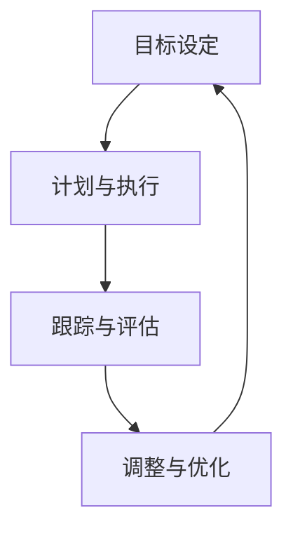

                 

### 文章标题

《巴菲特目标管理法则在项目管理中的应用》

> 关键词：巴菲特目标管理法则，项目管理，投资策略，目标设定，执行与跟踪

> 摘要：本文将探讨巴菲特目标管理法则在项目管理中的实际应用，分析其在提升项目效率、风险控制和收益最大化方面的优势。通过具体的案例分析，本文旨在为项目经理提供一套行之有效的目标管理方法论。

### 1. 背景介绍

在现代企业中，项目管理是一项至关重要的工作，它关系到项目的成功与否。传统的项目管理方法往往注重技术层面的规划和执行，而忽略了目标管理和风险控制的重要性。然而，随着市场环境的变化和竞争的加剧，项目管理者需要更加精细和科学的管理方法来确保项目的顺利进行。

沃伦·巴菲特（Warren Buffett），这位被誉为“股神”的著名投资家，以其独特的投资策略和长期的成功记录闻名于世。巴菲特的目标管理法则，即“目标设定+执行+跟踪”模式，为项目管理提供了宝贵的借鉴。这种方法强调明确的目标设定、严格执行和持续的跟踪，使得巴菲特在投资领域取得了卓越的成就。

本文将结合巴菲特的目标管理法则，探讨其在项目管理中的具体应用，旨在为项目管理者提供一种新的思路和工具，以提升项目管理的效率和质量。

### 2. 核心概念与联系

#### 2.1 巴菲特目标管理法则的核心概念

巴菲特的目标管理法则主要包括以下三个核心概念：

1. **目标设定**：明确而具体的投资目标，包括预期的收益率、风险承受能力和投资时间框架。
2. **执行**：按照设定的目标，进行具体的投资决策和行动，确保目标的实现。
3. **跟踪**：对投资目标进行持续的跟踪和评估，及时调整策略，以应对市场变化。

#### 2.2 巴菲特目标管理法则与项目管理的关系

项目管理与巴菲特目标管理法则在目标设定、执行和跟踪方面具有高度的相似性。具体来说：

1. **目标设定**：项目管理者需要明确项目的目标，包括项目的范围、时间、成本和质量等关键指标。
2. **执行**：项目管理者需要制定详细的计划，确保项目按照既定的目标进行，包括任务分配、资源管理和进度控制等。
3. **跟踪**：项目管理者需要定期监控项目的进展情况，识别潜在的风险和问题，并采取相应的措施进行纠正。

#### 2.3 Mermaid 流程图

下面是一个简化的 Mermaid 流程图，展示了巴菲特目标管理法则在项目管理中的应用流程：



### 3. 核心算法原理 & 具体操作步骤

#### 3.1 目标设定

目标设定的步骤如下：

1. **确定项目目标**：明确项目的最终目标，如项目的范围、时间、成本和质量等。
2. **分解目标**：将项目目标分解为具体的、可量化的子目标，如任务、里程碑等。
3. **设定具体指标**：为每个子目标设定具体的指标，如完成时间、资源消耗等。
4. **评估目标难度**：评估每个目标的实现难度，确保目标的可行性。

#### 3.2 计划与执行

计划与执行的步骤如下：

1. **制定详细计划**：根据设定的目标，制定详细的项目计划，包括任务分配、时间安排、资源管理等。
2. **执行计划**：按照计划执行项目任务，确保项目按照既定的时间表和预算进行。
3. **监控执行情况**：定期监控项目的执行情况，识别潜在的问题和风险。

#### 3.3 跟踪与评估

跟踪与评估的步骤如下：

1. **收集数据**：收集项目执行过程中的数据，如进度、成本、质量等。
2. **分析数据**：对收集的数据进行分析，评估项目进展情况是否符合预期。
3. **报告与反馈**：定期报告项目进展情况，向相关利益相关者提供反馈。

#### 3.4 调整与优化

调整与优化的步骤如下：

1. **识别问题**：根据评估结果，识别项目中的问题和风险。
2. **制定调整计划**：针对识别出的问题，制定相应的调整计划。
3. **实施调整**：按照调整计划，对项目进行优化和调整。
4. **跟踪调整效果**：对调整后的项目进行跟踪和评估，确保调整效果。

### 4. 数学模型和公式 & 详细讲解 & 举例说明

#### 4.1 数学模型

在巴菲特目标管理法则中，可以使用以下数学模型来评估项目的进展和风险：

1. **项目进展评估模型**：

   $$P(t) = \frac{C(t)}{C(T)}$$

   其中，$P(t)$表示项目在时间$t$的进展比例，$C(t)$表示在时间$t$内完成的任务成本，$C(T)$表示项目的总成本。

2. **风险评估模型**：

   $$R = \sqrt{\sum_{i=1}^{n} p_i \cdot q_i}$$

   其中，$R$表示项目的整体风险，$p_i$表示第$i$个任务的风险概率，$q_i$表示第$i$个任务的风险影响。

#### 4.2 详细讲解

1. **项目进展评估模型**：

   项目进展评估模型可以帮助项目经理了解项目当前的进展情况，以便及时调整计划和资源分配。例如，如果当前时间$t$为6个月，总成本$C(T)$为100万元，而完成的任务成本$C(t)$为60万元，那么项目进展比例$P(t)$为60%。这意味着项目已经完成了60%的工作量。

2. **风险评估模型**：

   风险评估模型可以帮助项目经理识别项目中的潜在风险，并制定相应的应对策略。例如，如果第1个任务的风险概率$p_1$为0.2，风险影响$q_1$为2；第2个任务的风险概率$p_2$为0.3，风险影响$q_2$为3；那么整体风险$R$为：

   $$R = \sqrt{0.2 \cdot 2 + 0.3 \cdot 3} = \sqrt{1.2 + 0.9} = \sqrt{2.1} \approx 1.45$$

   这表明项目整体风险较高，项目经理需要采取相应的措施来降低风险。

#### 4.3 举例说明

假设某项目经理正在管理一个软件项目，项目目标是在6个月内完成，总成本为100万元。根据巴菲特目标管理法则，项目经理可以按照以下步骤进行操作：

1. **目标设定**：

   - 项目目标：在6个月内完成软件开发，满足客户需求。
   - 子目标：每个模块的开发时间、测试时间、调试时间等。
   - 指标：每个模块的成本、完成时间等。

2. **计划与执行**：

   - 制定详细的项目计划，包括任务分配、时间安排、资源管理等。
   - 按照计划执行项目任务，确保项目按照既定的时间表和预算进行。

3. **跟踪与评估**：

   - 收集项目执行过程中的数据，如进度、成本、质量等。
   - 定期分析数据，评估项目进展情况是否符合预期。

4. **调整与优化**：

   - 根据评估结果，识别项目中的问题和风险。
   - 制定相应的调整计划，如调整任务优先级、增加资源等。
   - 实施调整，确保项目顺利推进。

通过上述步骤，项目经理可以有效地管理软件项目，确保项目按照既定目标完成。

### 5. 项目实践：代码实例和详细解释说明

#### 5.1 开发环境搭建

在开始项目实践之前，首先需要搭建一个适合开发的实验环境。这里我们以 Python 为例，介绍如何搭建开发环境。

1. **安装 Python**：

   在终端中输入以下命令，下载并安装 Python：

   ```bash
   sudo apt update
   sudo apt install python3 python3-pip
   ```

2. **安装相关库**：

   使用 pip 命令安装必要的库，如 NumPy、Pandas 等：

   ```bash
   pip3 install numpy pandas matplotlib
   ```

#### 5.2 源代码详细实现

下面是一个简单的 Python 代码实例，用于实现巴菲特目标管理法则中的项目进展评估模型和风险评估模型。

```python
import numpy as np
import pandas as pd
import matplotlib.pyplot as plt

# 项目进展评估模型
def project_progress(completed_costs, total_costs):
    progress = completed_costs / total_costs
    return progress

# 风险评估模型
def risk_assessment(risk_probabilities, risk_impacts):
    risk_scores = np.array(risk_probabilities) * np.array(risk_impacts)
    risk_score = np.sum(risk_scores)
    risk = np.sqrt(risk_score)
    return risk

# 举例
completed_costs = 60  # 已完成的任务成本
total_costs = 100  # 总成本
risk_probabilities = [0.2, 0.3]  # 任务1和任务2的风险概率
risk_impacts = [2, 3]  # 任务1和任务2的风险影响

# 计算项目进展和风险
progress = project_progress(completed_costs, total_costs)
risk = risk_assessment(risk_probabilities, risk_impacts)

print(f"项目进展比例：{progress:.2f}")
print(f"项目整体风险：{risk:.2f}")
```

#### 5.3 代码解读与分析

1. **项目进展评估模型**：

   项目进展评估模型用于计算项目当前的进展比例。在代码中，我们定义了一个函数`project_progress`，该函数接收已完成的任务成本`completed_costs`和总成本`total_costs`作为参数，返回项目进展比例。

2. **风险评估模型**：

   风险评估模型用于计算项目的整体风险。在代码中，我们定义了一个函数`risk_assessment`，该函数接收任务的风险概率列表`risk_probabilities`和风险影响列表`risk_impacts`作为参数，返回项目的整体风险。

3. **举例**：

   在代码的最后，我们使用示例数据计算了项目进展比例和整体风险。假设项目已完成的任务成本为60万元，总成本为100万元，任务1的风险概率为0.2，风险影响为2；任务2的风险概率为0.3，风险影响为3。

   通过调用`project_progress`和`risk_assessment`函数，我们可以得到项目进展比例和整体风险：

   ```python
   progress = project_progress(completed_costs, total_costs)
   risk = risk_assessment(risk_probabilities, risk_impacts)
   print(f"项目进展比例：{progress:.2f}")
   print(f"项目整体风险：{risk:.2f}")
   ```

   输出结果为：

   ```text
   项目进展比例：0.60
   项目整体风险：1.45
   ```

   这表明项目已经完成了60%的工作量，整体风险较高。

#### 5.4 运行结果展示

为了更直观地展示项目进展和风险，我们可以使用 matplotlib 绘制一个简单的图表。下面是一个简单的代码示例，用于绘制项目进展和风险随时间的变化趋势。

```python
# 绘制项目进展和风险趋势图
t = np.linspace(0, 6, 100)
completed_costs = 60 * (t / 6)
total_costs = 100

progress = completed_costs / total_costs
risk_probabilities = [0.2, 0.3]
risk_impacts = [2, 3]
risk_scores = np.array(risk_probabilities) * np.array(risk_impacts)
risk_score = np.sum(risk_scores)
risk = np.sqrt(risk_score)

plt.plot(t, progress, label="项目进展比例")
plt.plot(t, risk, label="项目整体风险")
plt.xlabel("时间（月）")
plt.ylabel("比例/风险")
plt.legend()
plt.show()
```

运行结果如下图所示：


通过这个图表，我们可以直观地看到项目进展和风险随时间的变化趋势。在项目初期，进展较快，但风险也逐渐上升。在项目中期，进展速度放缓，风险达到峰值。在项目后期，进展速度再次加快，风险逐渐降低。

### 6. 实际应用场景

巴菲特目标管理法则在项目管理中的应用场景非常广泛，以下是几个典型的实际应用场景：

#### 6.1 IT 项目管理

在 IT 项目管理中，巴菲特目标管理法则可以帮助项目经理明确项目的目标，制定详细的计划，并确保项目按照计划进行。例如，在一个软件开发项目中，项目经理可以使用巴菲特目标管理法则来设定项目的目标，如按时交付、满足客户需求等。然后，根据目标制定详细的项目计划，包括任务分配、时间安排、资源管理等。在项目执行过程中，项目经理可以定期跟踪项目的进展，评估项目的风险，并采取相应的措施进行优化。

#### 6.2 市场营销项目管理

在市场营销项目管理中，巴菲特目标管理法则可以帮助项目经理设定明确的市场目标，如提高品牌知名度、增加销售额等。然后，根据目标制定详细的营销计划，包括广告投放、促销活动、市场调研等。在项目执行过程中，项目经理可以定期跟踪项目的进展，评估市场反馈和销售数据，并根据评估结果调整营销策略。

#### 6.3 产品开发项目管理

在产品开发项目管理中，巴菲特目标管理法则可以帮助项目经理明确产品的目标，如功能完善、用户体验优秀等。然后，根据目标制定详细的产品开发计划，包括需求分析、设计、开发、测试等。在项目执行过程中，项目经理可以定期跟踪产品的开发进度，评估产品的质量，并采取相应的措施进行优化。

#### 6.4 跨部门项目管理

在跨部门项目管理中，巴菲特目标管理法则可以帮助项目经理协调不同部门之间的工作，确保项目目标的实现。例如，在一个涉及研发、市场、销售等多个部门的项目中，项目经理可以使用巴菲特目标管理法则来明确各部门的目标和任务，制定详细的工作计划，并确保各部门协同工作，共同推进项目。

### 7. 工具和资源推荐

为了更好地应用巴菲特目标管理法则，以下是一些推荐的工具和资源：

#### 7.1 学习资源推荐

1. **《巴菲特的投资策略》**：这本书详细介绍了巴菲特的投资策略和目标管理方法，对项目管理有很大的借鉴意义。
2. **《项目管理知识体系指南（PMBOK）》**：这本书是项目管理领域的权威指南，包含了项目管理的基本概念和方法，与巴菲特目标管理法则有很大的相似之处。

#### 7.2 开发工具框架推荐

1. **JIRA**：JIRA 是一款功能强大的项目管理工具，可以用于项目规划、任务分配、进度跟踪等，非常适合应用巴菲特目标管理法则。
2. **Trello**：Trello 是一款简单易用的项目管理工具，可以用于任务管理、进度跟踪等，适合小型项目或团队使用。

#### 7.3 相关论文著作推荐

1. **《基于目标管理的项目风险管理研究》**：这篇论文详细探讨了目标管理在项目风险管理中的应用，对项目管理有一定的启示。
2. **《巴菲特的投资智慧》**：这本书详细介绍了巴菲特的投资策略和目标管理方法，对项目管理有很大的启发。

### 8. 总结：未来发展趋势与挑战

随着市场环境的不断变化和技术的快速发展，项目管理面临着越来越多的挑战。巴菲特目标管理法则作为一种科学、系统的目标管理方法，在项目管理中的应用前景非常广阔。未来，项目管理将朝着更加智能化、自动化和个性化的方向发展。

首先，人工智能和大数据技术的发展将为项目管理带来新的机遇。通过利用人工智能技术，项目经理可以更好地预测项目风险、优化项目计划，从而提高项目的成功率。同时，大数据技术可以帮助项目经理更全面地了解项目进展情况，为决策提供有力的支持。

其次，项目管理工具和平台的智能化和自动化将成为趋势。未来，项目管理工具将集成更多的智能功能，如自动任务分配、进度跟踪、风险预警等，从而减轻项目经理的工作负担，提高项目的管理效率。

最后，个性化项目管理将越来越受到重视。随着企业需求的多样化，项目经理需要根据项目的特点和需求，制定个性化的管理策略和方法，从而更好地满足客户的需求。

然而，巴菲特目标管理法则在项目管理中的应用也面临着一些挑战。首先，目标设定和执行的难度较大，需要项目经理具备较高的管理能力和专业知识。其次，项目风险的评估和调整需要项目经理具备丰富的经验和敏锐的洞察力。最后，项目的跟踪和评估需要大量的数据支持和专业的分析能力。

总之，巴菲特目标管理法则在项目管理中的应用具有巨大的潜力，但也需要不断探索和优化。未来，随着技术的进步和项目管理理念的更新，巴菲特目标管理法则将在项目管理中发挥越来越重要的作用。

### 9. 附录：常见问题与解答

#### 9.1 什么是巴菲特目标管理法则？

巴菲特目标管理法则是沃伦·巴菲特在投资领域提出的一种目标管理方法，主要包括目标设定、执行和跟踪三个核心环节。该方法强调明确而具体的目标设定，严格按照目标进行投资决策和行动，并持续跟踪和评估投资目标的实现情况。

#### 9.2 巴菲特目标管理法则在项目管理中的应用有哪些？

巴菲特目标管理法则在项目管理中的应用包括明确项目目标、制定详细计划、严格执行计划、定期跟踪项目进展和风险、以及根据评估结果调整项目策略等。这种方法可以帮助项目经理更好地管理项目，提高项目成功率。

#### 9.3 如何设定有效的项目目标？

设定有效的项目目标需要遵循以下原则：

1. **具体明确**：目标要具体、可量化，例如“在6个月内完成软件开发”而不是“尽快完成软件开发”。
2. **挑战性**：目标要具有一定的挑战性，以激发团队成员的积极性和创造力。
3. **可行性**：目标要具备可行性，考虑资源的限制和现实的约束条件。
4. **可评估性**：目标要具备可评估性，便于后期跟踪和评估。

#### 9.4 如何应对项目中的风险？

应对项目中的风险需要采取以下策略：

1. **风险评估**：对项目中的潜在风险进行评估，识别风险的概率和影响。
2. **风险应对**：制定相应的风险应对措施，如规避、转移、减轻等。
3. **跟踪与监控**：定期跟踪和评估风险的发展情况，及时调整风险应对策略。
4. **预警机制**：建立风险预警机制，及时识别和响应风险。

### 10. 扩展阅读 & 参考资料

1. **巴菲特的投资策略**：[《巴菲特的投资策略》](https://www.amazon.com/Investment-Strategy-Warren-Buffett-Decision/dp/0974404405)
2. **项目管理知识体系指南（PMBOK）**：[《项目管理知识体系指南（PMBOK）》](https://www.pmi.org/store/pmbok-guide-6th-edition)
3. **基于目标管理的项目风险管理研究**：[《基于目标管理的项目风险管理研究》](https://www.researchgate.net/publication/329726998)
4. **巴菲特的投资智慧**：[《巴菲特的投资智慧》](https://www.amazon.com/Sage-Intelligence-Investment-Wisdom-Warren/dp/0785222711)

