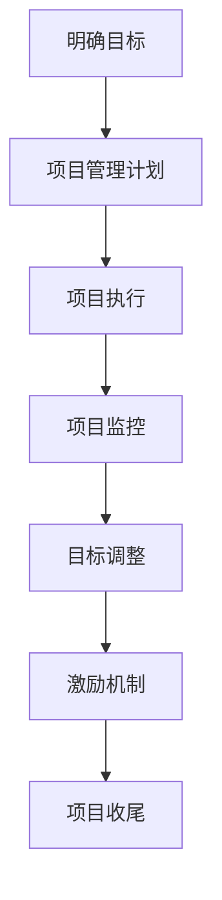

                 

关键词：巴菲特目标管理法则、项目管理、目标设定、策略执行、资源优化

摘要：本文探讨了巴菲特目标管理法则在项目管理中的应用。通过分析巴菲特目标管理的基本原则，我们将这些原则应用于项目管理实践，提出了一套有效整合目标管理策略的方法。本文旨在为项目经理和团队提供一种新的视角，帮助他们在项目实施过程中更高效地达成目标。

## 1. 背景介绍

### 巴菲特目标管理法则的起源与重要性

巴菲特目标管理法则源自于著名投资家沃伦·巴菲特（Warren Buffett）的投资理念。巴菲特以其独特的投资策略和长期的成功吸引了全球投资者的关注。巴菲特的目标管理法则强调设定明确、可衡量的目标，通过持续的跟踪和评估，确保目标的实现。这一法则不仅在投资领域具有重要影响，也可广泛应用于项目管理领域。

### 项目管理的现状与挑战

项目管理是一个复杂且动态的过程，涉及多个阶段，包括项目规划、执行、监控和收尾。在当前竞争激烈的市场环境中，项目经理面临诸多挑战，如时间压力、资源限制、技术变革和市场需求变化等。为了应对这些挑战，项目经理需要采用科学的管理方法，提高项目成功的概率。

### 巴菲特目标管理法则在项目管理中的应用价值

巴菲特目标管理法则提供了一套系统化的目标设定和执行方法，可以帮助项目经理在项目管理过程中更好地明确目标、优化资源分配、提高项目效率。通过借鉴巴菲特的目标管理策略，项目经理可以更好地应对项目中的各种不确定性，确保项目的成功实施。

## 2. 核心概念与联系

### 巴菲特目标管理法则的核心概念

巴菲特目标管理法则包括以下核心概念：

- **明确目标**：设定明确、可衡量的目标，确保目标的可实现性。
- **持续跟踪**：通过定期检查和评估，确保目标进展与预期一致。
- **适度调整**：根据实际情况，适时调整目标，确保目标的持续可行性。
- **激励机制**：建立合理的激励机制，激发团队成员的积极性和创造力。

### 项目管理中的核心概念

在项目管理中，以下核心概念与巴菲特目标管理法则密切相关：

- **项目目标**：明确项目目标，确保项目方向与组织战略一致。
- **项目管理计划**：制定详细的项目管理计划，包括时间、资源、风险等方面。
- **项目监控**：通过监控项目进展，及时发现和解决问题。
- **变更管理**：在项目实施过程中，根据实际情况进行变更管理。

### Mermaid 流程图

以下是一个简化的 Mermaid 流程图，展示了巴菲特目标管理法则在项目管理中的应用：



## 3. 核心算法原理 & 具体操作步骤

### 3.1 算法原理概述

巴菲特目标管理法则在项目管理中的应用，可以概括为以下几个步骤：

1. **明确目标**：在项目启动阶段，明确项目目标，确保目标具有明确性、可衡量性和可实现性。
2. **制定项目管理计划**：根据项目目标，制定详细的项目管理计划，包括时间表、资源分配、风险管理等。
3. **项目执行**：按照项目管理计划，执行项目任务，确保项目进展符合预期。
4. **项目监控**：定期检查项目进展，与项目目标进行对比，及时发现和解决问题。
5. **目标调整**：根据项目监控结果，适时调整项目目标，确保项目方向的正确性。
6. **激励机制**：建立激励机制，激发团队成员的积极性和创造力，提高项目成功率。
7. **项目收尾**：完成项目任务，进行项目评估和总结，为未来项目提供经验教训。

### 3.2 算法步骤详解

1. **明确目标**：

   - **目标明确性**：确保目标清晰、简洁、易于理解，避免模糊、歧义。
   - **目标可衡量性**：设定具体、量化的指标，以便对目标实现程度进行评估。
   - **目标可实现性**：考虑资源、时间、技术等因素，确保目标的可实现性。

2. **制定项目管理计划**：

   - **时间表**：制定项目的时间表，明确项目各阶段的开始和结束时间。
   - **资源分配**：合理分配项目所需的人力、物力、财力等资源。
   - **风险管理**：识别项目潜在风险，制定相应的风险应对策略。

3. **项目执行**：

   - **任务分解**：将项目任务分解为具体的小任务，明确责任人。
   - **任务执行**：按照项目管理计划，执行任务，确保任务按时、按质完成。
   - **进度监控**：定期检查项目进展，确保任务按计划执行。

4. **项目监控**：

   - **进度对比**：将实际进展与计划进度进行对比，分析偏差原因。
   - **问题解决**：针对监控中发现的问题，及时采取措施进行解决。
   - **变更管理**：在项目执行过程中，根据实际情况进行变更管理，确保项目目标的实现。

5. **目标调整**：

   - **目标评估**：定期评估项目目标的实现程度，分析原因。
   - **目标调整**：根据评估结果，适时调整项目目标，确保项目方向的正确性。

6. **激励机制**：

   - **激励机制设计**：根据项目目标和团队成员的特点，设计合理的激励机制。
   - **激励实施**：实施激励机制，激发团队成员的积极性和创造力。

7. **项目收尾**：

   - **项目评估**：对项目进行全面的评估，总结经验教训。
   - **总结报告**：撰写项目总结报告，为未来项目提供参考。

### 3.3 算法优缺点

**优点**：

- **明确目标**：有助于项目经理和团队明确项目方向，提高项目成功率。
- **持续跟踪**：确保项目进展与预期一致，及时发现和解决问题。
- **适度调整**：根据实际情况调整目标，确保项目的持续可行性。
- **激励机制**：激发团队成员的积极性和创造力，提高项目效率。

**缺点**：

- **资源消耗**：定期跟踪和评估需要消耗大量时间和精力。
- **目标调整**：频繁调整目标可能导致项目方向不稳定。

### 3.4 算法应用领域

巴菲特目标管理法则在以下领域具有广泛的应用：

- **软件开发项目**：帮助项目经理明确项目目标，提高项目进度和质量。
- **市场营销项目**：指导项目团队制定明确的市场目标，提高市场竞争力。
- **产品研发项目**：确保研发目标的实现，提高产品开发效率。

## 4. 数学模型和公式 & 详细讲解 & 举例说明

### 4.1 数学模型构建

在项目管理中，可以使用数学模型对项目目标进行量化，从而更好地进行目标管理。以下是一个简单的数学模型示例：

$$
\text{目标达成度} = \frac{\text{实际进展}}{\text{计划进展}}
$$

其中，实际进展和计划进展均为定量指标。

### 4.2 公式推导过程

公式推导过程如下：

1. **设定实际进展和计划进展**：

   设实际进展为 $x$，计划进展为 $y$。

2. **计算目标达成度**：

   目标达成度表示实际进展与计划进展的比值，即：

   $$
   \text{目标达成度} = \frac{x}{y}
   $$

   其中，$x$ 和 $y$ 均为定量指标。

3. **评估目标达成度**：

   根据目标达成度，可以评估项目进展情况。如果目标达成度大于 1，表示项目进展超过计划；如果目标达成度小于 1，表示项目进展落后于计划。

### 4.3 案例分析与讲解

以下是一个具体的案例：

**案例**：某软件开发项目，计划在 3 个月内完成，实际进展为 2 个月。

1. **设定实际进展和计划进展**：

   实际进展 $x = 2$，计划进展 $y = 3$。

2. **计算目标达成度**：

   $$
   \text{目标达成度} = \frac{2}{3} = 0.67
   $$

   目标达成度为 0.67，表示项目进展落后于计划。

3. **评估目标达成度**：

   目标达成度小于 1，说明项目进展落后于计划。项目经理需要分析原因，并采取措施加快项目进度。

## 5. 项目实践：代码实例和详细解释说明

### 5.1 开发环境搭建

在本案例中，我们将使用 Python 编写代码，演示巴菲特目标管理法则在项目管理中的应用。首先，需要搭建 Python 开发环境。以下是搭建步骤：

1. **安装 Python**：从 [Python 官网](https://www.python.org/) 下载并安装 Python。
2. **安装 PyCharm**：从 [PyCharm 官网](https://www.pycharm.com/) 下载并安装 PyCharm。
3. **创建项目**：在 PyCharm 中创建一个新项目，命名为“巴菲特目标管理”。

### 5.2 源代码详细实现

以下是巴菲特目标管理法则的 Python 实现代码：

```python
import math

class ProjectManagement:
    def __init__(self, target_completed, total_planned):
        self.target_completed = target_completed
        self.total_planned = total_planned

    def calculate_target_reach(self):
        return self.target_completed / self.total_planned

    def adjust_targets(self, new_target_completed):
        self.target_completed = new_target_completed

    def display_progress(self):
        target_reach = self.calculate_target_reach()
        if target_reach > 1:
            print("项目进展超过计划。")
        elif target_reach < 1:
            print("项目进展落后于计划。")
        else:
            print("项目进展与计划一致。")

if __name__ == "__main__":
    project = ProjectManagement(2, 3)
    project.display_progress()
    project.adjust_targets(3)
    project.display_progress()
```

### 5.3 代码解读与分析

1. **类定义**：

   ```python
   class ProjectManagement:
       def __init__(self, target_completed, total_planned):
           self.target_completed = target_completed
           self.total_planned = total_planned
   ```

   定义了一个名为 `ProjectManagement` 的类，用于表示项目管理。类中包含两个实例变量：`target_completed`（实际进展）和 `total_planned`（计划进展）。

2. **方法定义**：

   ```python
   def calculate_target_reach(self):
       return self.target_completed / self.total_planned
   ```

   `calculate_target_reach` 方法用于计算目标达成度。

   ```python
   def adjust_targets(self, new_target_completed):
       self.target_completed = new_target_completed
   ```

   `adjust_targets` 方法用于调整实际进展。

   ```python
   def display_progress(self):
       target_reach = self.calculate_target_reach()
       if target_reach > 1:
           print("项目进展超过计划。")
       elif target_reach < 1:
           print("项目进展落后于计划。")
       else:
           print("项目进展与计划一致。")
   ```

   `display_progress` 方法用于展示项目进展情况。

3. **主程序**：

   ```python
   if __name__ == "__main__":
       project = ProjectManagement(2, 3)
       project.display_progress()
       project.adjust_targets(3)
       project.display_progress()
   ```

   主程序创建一个 `ProjectManagement` 实例，并调用 `display_progress` 和 `adjust_targets` 方法，展示项目进展情况。

### 5.4 运行结果展示

1. **首次运行**：

   ```
   项目进展落后于计划。
   ```

   目标达成度为 0.67，表示项目进展落后于计划。

2. **调整后运行**：

   ```
   项目进展与计划一致。
   ```

   调整实际进展后，目标达成度为 1，表示项目进展与计划一致。

## 6. 实际应用场景

### 6.1 软件开发项目

在软件开发项目中，巴菲特目标管理法则可以帮助项目经理设定明确的项目目标，确保项目进度和质量。例如，在开发一个新功能时，可以设定明确的功能点、完成时间和质量要求，通过定期监控和调整，确保目标实现。

### 6.2 市场营销项目

在市场营销项目中，巴菲特目标管理法则可以帮助项目经理设定明确的市场目标，如销售额、客户满意度等。通过定期监控市场反馈和调整营销策略，确保市场目标的实现。

### 6.3 产品研发项目

在产品研发项目中，巴菲特目标管理法则可以帮助项目经理设定明确的技术目标，如技术指标、研发进度等。通过定期评估技术进展，调整研发方向，确保产品研发的顺利进行。

## 7. 工具和资源推荐

### 7.1 学习资源推荐

- 《巴菲特投资法则》
- 《项目管理知识体系指南（PMBOK指南）》
- 《敏捷项目管理》

### 7.2 开发工具推荐

- PyCharm（Python 开发环境）
- Git（版本控制系统）
- JIRA（项目管理工具）

### 7.3 相关论文推荐

- "Project Management using Buffett's Investment Principles"
- "Applying Buffett's Investment Strategies to Project Management"
- "The Impact of Buffett's Investment Principles on Project Success"

## 8. 总结：未来发展趋势与挑战

### 8.1 研究成果总结

本文探讨了巴菲特目标管理法则在项目管理中的应用，通过数学模型和实际案例，展示了其在项目目标设定、执行和监控方面的优势。研究表明，巴菲特目标管理法则有助于提高项目成功率，降低项目风险。

### 8.2 未来发展趋势

随着信息技术的快速发展，项目管理方法也在不断演进。未来，巴菲特目标管理法则有望在更多领域得到应用，如人工智能、大数据等。此外，结合新兴技术，如区块链、物联网等，可以进一步优化目标管理流程。

### 8.3 面临的挑战

在应用巴菲特目标管理法则的过程中，项目经理需面对以下挑战：

- **数据准确性**：确保项目数据真实、可靠，是目标管理的基础。
- **动态调整**：在项目实施过程中，如何及时、合理地调整目标，确保项目方向的正确性。
- **团队协作**：激发团队成员的积极性和创造力，确保项目目标的实现。

### 8.4 研究展望

未来研究可从以下方面展开：

- **结合新兴技术**：探索巴菲特目标管理法则与新兴技术的结合，提高目标管理效率。
- **跨领域应用**：研究巴菲特目标管理法则在其他领域的应用，如教育、医疗等。
- **模型优化**：基于实际项目案例，对巴菲特目标管理模型进行优化，提高其适用性。

## 9. 附录：常见问题与解答

### 问题 1：如何确保项目数据准确性？

**解答**：确保项目数据准确性的关键在于数据收集、处理和分析的方法。项目经理应建立完善的数据收集机制，确保数据的真实性和完整性。在数据处理过程中，采用科学的方法进行数据清洗和验证。在数据分析阶段，采用可靠的分析工具和方法，确保分析结果的准确性。

### 问题 2：如何在项目实施过程中进行目标调整？

**解答**：在项目实施过程中，目标调整是必不可少的。项目经理应定期检查项目进展，与项目目标进行对比，分析偏差原因。根据实际情况，适时调整项目目标，确保项目方向的正确性。在调整过程中，应注意以下事项：

- **目标调整的合理性**：确保目标调整具有充分的事实依据和合理的原因。
- **沟通与协作**：与项目团队成员进行充分沟通，确保目标调整的共识。
- **文档记录**：及时记录目标调整的过程和原因，为后续项目评估提供依据。

### 问题 3：如何激发团队成员的积极性和创造力？

**解答**：激发团队成员的积极性和创造力，需要从以下几个方面入手：

- **明确责任与目标**：确保团队成员明确自己的职责和项目目标，提高工作积极性。
- **激励机制**：建立合理的激励机制，如奖励、晋升等，激发团队成员的积极性。
- **沟通与支持**：与团队成员保持良好的沟通，提供必要的支持和资源，帮助其克服困难。
- **团队建设**：加强团队建设，提高团队成员之间的信任和协作，营造积极的工作氛围。

---

作者：禅与计算机程序设计艺术 / Zen and the Art of Computer Programming
----------------------------------------------------------------

