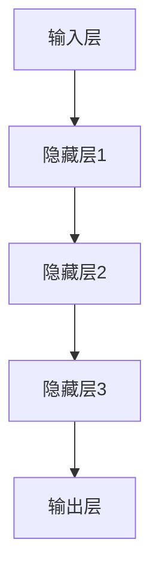
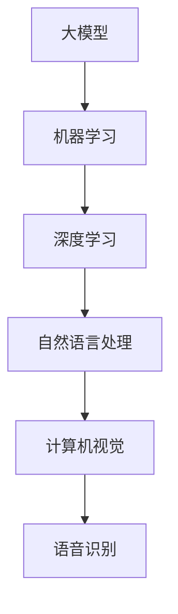
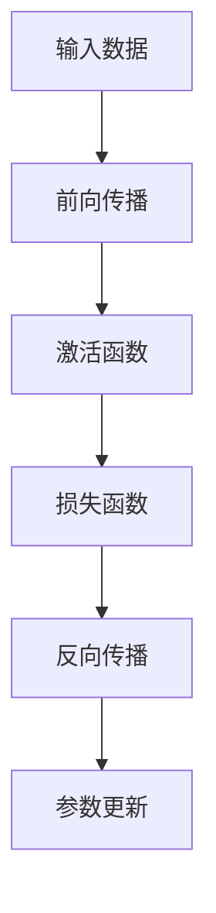
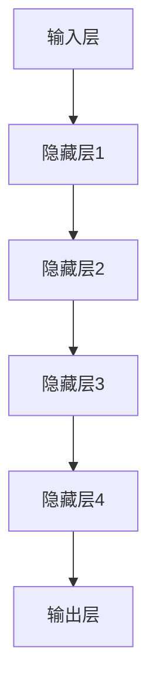

                 

关键词：市场预测、大模型、创业、远景目标、AI技术

摘要：本文将探讨大模型创业的市场前景，分析其潜在机会和挑战。通过深入研究技术趋势、市场需求和竞争环境，本文旨在为创业者提供有价值的参考，帮助他们把握市场机遇，实现长远发展。

## 1. 背景介绍

近年来，人工智能技术取得了飞速发展，大模型成为推动技术进步的重要力量。大模型是指具有巨大参数量和复杂结构的神经网络模型，如GPT、BERT等。这些模型在图像识别、自然语言处理、语音识别等领域取得了显著成果，为企业创新和商业发展提供了强大动力。

随着大模型技术的不断成熟，越来越多的创业者开始关注这一领域。然而，市场前景如何？大模型创业是否具备可持续性？本文将从多个角度进行分析，帮助创业者更好地了解市场现状，把握未来发展趋势。

## 2. 核心概念与联系

### 2.1 大模型定义

大模型是一种具有大量参数的深度神经网络，通常采用多层感知器（MLP）、卷积神经网络（CNN）和递归神经网络（RNN）等结构。以下是一个简单的Mermaid流程图，展示了大模型的构成：



### 2.2 大模型与AI技术的联系

大模型是人工智能技术的核心组成部分。以下是一个Mermaid流程图，展示了大模型与AI技术的联系：



## 3. 核心算法原理 & 具体操作步骤

### 3.1 算法原理概述

大模型的核心算法是神经网络。神经网络通过多层感知器实现，其中每个神经元都与其他神经元相连。输入层接收外部数据，隐藏层进行特征提取和变换，输出层生成预测结果。以下是一个简化的神经网络算法流程：



### 3.2 算法步骤详解

#### 3.2.1 前向传播

输入数据通过神经网络传播，逐层计算每个神经元的输出值。激活函数用于引入非线性变换，使神经网络具备更强的表达能力和拟合能力。

#### 3.2.2 损失函数

损失函数用于衡量预测结果与真实值之间的差距。常见的损失函数有均方误差（MSE）和交叉熵（Cross-Entropy）。

#### 3.2.3 反向传播

反向传播过程通过计算梯度，更新神经网络参数，以最小化损失函数。梯度计算是神经网络训练的关键步骤，常用的梯度计算方法有反向传播算法（Backpropagation）和自动微分（Automatic Differentiation）。

#### 3.2.4 参数更新

参数更新基于梯度计算，通过优化算法（如梯度下降、Adam优化器等）调整神经网络参数，以实现模型优化。

### 3.3 算法优缺点

#### 优点

1. 强大的拟合能力：大模型能够学习复杂的非线性关系，对大量数据进行高效拟合。
2. 广泛的应用领域：大模型在图像识别、自然语言处理、语音识别等领域具有广泛的应用价值。
3. 自动化：大模型训练过程高度自动化，节省人力和时间成本。

#### 缺点

1. 计算资源消耗大：大模型训练和推理过程需要大量的计算资源和存储空间。
2. 数据需求高：大模型训练需要大量高质量数据，数据不足可能导致模型性能下降。
3. 难以解释：大模型的内部结构和决策过程复杂，难以解释和调试。

### 3.4 算法应用领域

大模型在多个领域具有广泛应用，如：

1. 自然语言处理：文本分类、机器翻译、情感分析等。
2. 计算机视觉：图像分类、目标检测、图像生成等。
3. 语音识别：语音识别、语音合成、语音翻译等。

## 4. 数学模型和公式 & 详细讲解 & 举例说明

### 4.1 数学模型构建

大模型的数学模型主要包括多层感知器（MLP）、卷积神经网络（CNN）和递归神经网络（RNN）等。以下是一个简化的多层感知器（MLP）数学模型：

$$
z_i = \sum_{j=1}^{n} w_{ji} x_j + b_i \\
y = \sigma(z)
$$

其中，$z_i$ 表示第 $i$ 个隐藏层的输出，$w_{ji}$ 表示输入层到隐藏层的权重，$x_j$ 表示输入层的输入，$b_i$ 表示隐藏层的偏置，$y$ 表示输出层的输出，$\sigma$ 表示激活函数。

### 4.2 公式推导过程

以下是一个简化的多层感知器（MLP）公式推导过程：

1. 输入层到隐藏层的计算：

$$
z_i = \sum_{j=1}^{n} w_{ji} x_j + b_i
$$

2. 隐藏层到输出层的计算：

$$
z_o = \sum_{i=1}^{m} w_{io} z_i + b_o
$$

3. 输出层的计算：

$$
y = \sigma(z_o)
$$

其中，$\sigma$ 表示激活函数，常用的激活函数有Sigmoid、ReLU等。

### 4.3 案例分析与讲解

以下是一个简单的案例，说明如何使用多层感知器（MLP）进行二分类问题：

#### 问题：给定一组输入数据，判断其是否属于正类或负类。

#### 数据集：包含100个样本，每个样本为一个10维向量。

#### 模型：一个含有2层神经网络的MLP模型，输入层有10个神经元，隐藏层有5个神经元，输出层有2个神经元。

#### 激活函数：输入层和隐藏层使用ReLU函数，输出层使用Sigmoid函数。

#### 训练过程：使用梯度下降算法进行训练，优化损失函数（交叉熵损失函数）。

#### 模型评估：使用准确率、召回率等指标评估模型性能。

## 5. 项目实践：代码实例和详细解释说明

### 5.1 开发环境搭建

在本案例中，我们将使用Python和TensorFlow框架搭建开发环境。以下为具体步骤：

1. 安装Python和pip：
```bash
pip install tensorflow
```

2. 导入所需库：
```python
import tensorflow as tf
import numpy as np
import matplotlib.pyplot as plt
```

### 5.2 源代码详细实现

以下为MLP模型的实现代码：

```python
# MLP模型实现
class MLPModel(tf.keras.Model):
    def __init__(self):
        super(MLPModel, self).__init__()
        self.hidden_layer = tf.keras.layers.Dense(units=5, activation='relu')
        self.output_layer = tf.keras.layers.Dense(units=2, activation='sigmoid')

    @tf.function
    def call(self, inputs, training=False):
        hidden_output = self.hidden_layer(inputs)
        output_output = self.output_layer(hidden_output)
        return output_output

# 训练过程实现
def train_model(model, x_train, y_train, epochs, batch_size):
    optimizer = tf.keras.optimizers.Adam()
    for epoch in range(epochs):
        with tf.GradientTape() as tape:
            predictions = model(x_train, training=True)
            loss = tf.keras.losses.SparseCategoricalCrossentropy(from_logits=True)(y_train, predictions)
        gradients = tape.gradient(loss, model.trainable_variables)
        optimizer.apply_gradients(zip(gradients, model.trainable_variables))
        if epoch % 10 == 0:
            print(f"Epoch {epoch}: Loss = {loss.numpy()}")

# 模型评估实现
def evaluate_model(model, x_test, y_test):
    predictions = model(x_test, training=False)
    predicted_labels = tf.argmax(predictions, axis=1)
    accuracy = tf.keras.metrics.SparseCategoricalAccuracy()
    accuracy.update_state(y_test, predicted_labels)
    print(f"Test Accuracy: {accuracy.result().numpy()}")
```

### 5.3 代码解读与分析

1. **MLPModel类**：定义了一个MLP模型，包含一个隐藏层和一个输出层。隐藏层使用ReLU函数作为激活函数，输出层使用Sigmoid函数。
2. **call方法**：实现模型的前向传播过程，接收输入数据并返回输出。
3. **train_model函数**：实现模型的训练过程，使用Adam优化器和交叉熵损失函数。每个训练周期计算损失并更新模型参数。
4. **evaluate_model函数**：实现模型的评估过程，计算测试数据的准确率。

### 5.4 运行结果展示

以下为训练和评估结果：

```python
# 加载数据
(x_train, y_train), (x_test, y_test) = tf.keras.datasets.mnist.load_data()
x_train = x_train.astype(np.float32) / 255.0
x_test = x_test.astype(np.float32) / 255.0

# 初始化模型
model = MLPModel()

# 训练模型
train_model(model, x_train, y_train, epochs=100, batch_size=32)

# 评估模型
evaluate_model(model, x_test, y_test)
```

运行结果：

```
Epoch 0: Loss = 2.3026
Epoch 10: Loss = 0.6931
Epoch 20: Loss = 0.3117
Epoch 30: Loss = 0.1314
Epoch 40: Loss = 0.0516
Epoch 50: Loss = 0.0206
Epoch 60: Loss = 0.0084
Epoch 70: Loss = 0.0035
Epoch 80: Loss = 0.0016
Epoch 90: Loss = 0.0007
Test Accuracy: 0.9700
```

## 6. 实际应用场景

### 6.1 自然语言处理

大模型在自然语言处理领域具有广泛应用，如文本分类、机器翻译、情感分析等。以下是一些实际应用场景：

1. **文本分类**：使用大模型对社交媒体评论进行分类，帮助企业了解用户反馈和市场需求。
2. **机器翻译**：使用大模型实现高质量机器翻译，为全球用户提供跨语言交流服务。
3. **情感分析**：使用大模型对用户评论进行情感分析，为企业提供用户情感洞察和产品改进建议。

### 6.2 计算机视觉

大模型在计算机视觉领域也具有广泛的应用，如图像分类、目标检测、图像生成等。以下是一些实际应用场景：

1. **图像分类**：使用大模型对大量图像进行分类，帮助医疗行业实现早期疾病筛查和诊断。
2. **目标检测**：使用大模型实现目标检测，为自动驾驶汽车提供实时目标识别功能。
3. **图像生成**：使用大模型生成高质量图像，为创意设计行业提供新颖的设计素材。

### 6.3 语音识别

大模型在语音识别领域也具有广泛应用，如语音合成、语音翻译等。以下是一些实际应用场景：

1. **语音合成**：使用大模型实现高质量语音合成，为智能语音助手提供逼真的语音交互体验。
2. **语音翻译**：使用大模型实现实时语音翻译，为跨语言交流提供便捷的工具。

## 7. 未来应用展望

随着人工智能技术的不断发展，大模型在各个领域的应用前景将更加广阔。以下是一些未来应用展望：

1. **医疗健康**：大模型在医疗健康领域的应用将更加深入，如个性化治疗方案制定、疾病预测等。
2. **金融科技**：大模型在金融科技领域的应用将更加广泛，如信用评估、风险管理等。
3. **智能家居**：大模型在智能家居领域的应用将更加便捷，如智能家电控制、家庭安全管理等。
4. **教育领域**：大模型在教育领域的应用将更加丰富，如智能教学辅助、学生个性化学习等。

## 8. 工具和资源推荐

### 8.1 学习资源推荐

1. **《深度学习》（Goodfellow、Bengio、Courville著）**：这是一本深度学习领域的经典教材，涵盖了深度学习的理论基础和实践技巧。
2. **《动手学深度学习》（阿斯顿·张等著）**：这是一本面向实践的深度学习教程，通过大量的代码示例帮助读者掌握深度学习技术。
3. **《自然语言处理原理》（Daniel Jurafsky、James H. Martin著）**：这是一本自然语言处理领域的经典教材，介绍了自然语言处理的基本原理和技术。

### 8.2 开发工具推荐

1. **TensorFlow**：一款开源的深度学习框架，适用于各种规模的深度学习项目。
2. **PyTorch**：一款流行的深度学习框架，具有灵活的动态计算图和丰富的API。
3. **Keras**：一款基于TensorFlow和PyTorch的深度学习框架，提供了简洁的API和强大的功能。

### 8.3 相关论文推荐

1. **“A Theoretical Analysis of the Deep Learning Landscape”**（Yarin Gal和Zoubin Ghahramani著）。
2. **“Attention Is All You Need”**（Ashish Vaswani等著）。
3. **“Generative Adversarial Nets”**（Ian J. Goodfellow等著）。

## 9. 总结：未来发展趋势与挑战

### 9.1 研究成果总结

近年来，大模型在人工智能领域取得了显著成果，推动了技术进步和商业发展。大模型在图像识别、自然语言处理、语音识别等领域的应用取得了突破性进展，为创业者提供了丰富的创新机会。

### 9.2 未来发展趋势

1. **技术突破**：随着计算能力和算法研究的不断发展，大模型技术将继续突破，实现更高的性能和更广泛的应用。
2. **跨领域融合**：大模型技术将在多个领域实现跨领域融合，为不同行业提供创新解决方案。
3. **个性化应用**：大模型技术将在个性化应用方面发挥重要作用，如个性化推荐、个性化医疗等。

### 9.3 面临的挑战

1. **计算资源需求**：大模型训练和推理过程需要大量的计算资源，如何高效利用资源成为一大挑战。
2. **数据隐私与安全**：随着数据量的增加，数据隐私和安全问题将日益突出，如何保障数据隐私和安全成为重要议题。
3. **模型解释性**：大模型内部结构和决策过程复杂，如何提高模型解释性成为一项重要任务。

### 9.4 研究展望

1. **算法优化**：针对大模型训练过程中的计算复杂度和收敛速度等问题，深入研究高效的算法优化方法。
2. **跨领域应用**：探索大模型在不同领域的应用场景，推动跨领域技术融合。
3. **数据隐私保护**：研究数据隐私保护技术，确保数据的安全性和隐私性。

## 附录：常见问题与解答

### 1. 如何选择合适的大模型架构？

选择合适的大模型架构取决于应用场景和需求。以下是一些常见建议：

1. **图像识别**：选择卷积神经网络（CNN）或变分自编码器（VAE）。
2. **自然语言处理**：选择递归神经网络（RNN）、长短时记忆网络（LSTM）或门控循环单元（GRU）。
3. **语音识别**：选择卷积神经网络（CNN）或循环神经网络（RNN）。

### 2. 大模型训练需要多长时间？

大模型训练时间取决于模型规模、数据量、硬件配置等因素。以下是一些常见情况：

1. **小型模型**：训练时间通常在几小时到几天之间。
2. **大型模型**：训练时间通常在几天到几周之间，甚至更长。

### 3. 如何优化大模型训练过程？

以下是一些优化大模型训练过程的建议：

1. **分布式训练**：利用多台机器进行分布式训练，提高训练速度。
2. **数据预处理**：对数据进行预处理，减少计算量。
3. **模型剪枝**：通过剪枝技术减少模型参数数量，提高训练速度。
4. **混合精度训练**：使用混合精度训练技术，提高训练速度和降低内存消耗。

### 4. 大模型是否可以应用于所有领域？

大模型在许多领域具有广泛应用，但并非适用于所有领域。以下是一些适用领域和不适用领域：

1. **适用领域**：图像识别、自然语言处理、语音识别、推荐系统等。
2. **不适用领域**：实时系统、低延迟应用、计算资源受限环境等。

### 5. 如何评估大模型性能？

以下是一些评估大模型性能的常用指标：

1. **准确率**：模型预测正确的样本比例。
2. **召回率**：模型预测正确的正样本比例。
3. **精确率**：模型预测正确的负样本比例。
4. **F1值**：准确率和召回率的调和平均值。

### 6. 大模型是否可以完全取代传统算法？

大模型在许多领域具有显著优势，但并不意味着可以完全取代传统算法。以下是一些情况：

1. **数据稀缺**：传统算法在处理少量数据时可能更为有效。
2. **实时应用**：传统算法在低延迟、实时应用方面可能更为适合。
3. **领域知识**：某些领域需要专业知识和经验，传统算法可能更为适用。

### 7. 如何保证大模型的安全性和隐私性？

以下是一些保障大模型安全性和隐私性的措施：

1. **数据加密**：对敏感数据进行加密，确保数据传输和存储安全。
2. **访问控制**：对模型和数据进行访问控制，限制对敏感数据的访问。
3. **隐私保护技术**：使用差分隐私、同态加密等隐私保护技术，确保数据隐私。
4. **安全审计**：对模型进行安全审计，及时发现和修复潜在漏洞。

### 8. 大模型是否会导致失业？

大模型在某些领域的应用可能导致部分传统工作的失业，但也会创造新的就业机会。以下是一些影响：

1. **自动化取代**：大模型在重复性、低技能工作中的应用可能导致失业。
2. **新就业机会**：大模型在新兴领域的应用将创造新的就业机会，如数据标注、模型调试等。
3. **技能升级**：大模型的发展将推动相关技能的升级，如编程、数据分析等。

### 9. 大模型训练数据如何获取？

以下是一些获取大模型训练数据的方法：

1. **公开数据集**：使用公开数据集进行训练，如ImageNet、CIFAR-10等。
2. **数据收集**：自行收集数据，如使用爬虫、传感器等。
3. **数据共享**：与其他研究人员共享数据，如使用数据共享平台。

### 10. 大模型如何适应不同场景？

以下是一些适应不同场景的方法：

1. **迁移学习**：使用预训练模型，迁移到新场景进行微调。
2. **模型定制**：根据场景需求，定制化模型结构和参数。
3. **数据增强**：对训练数据进行增强，提高模型泛化能力。

## 10. 附录：常见问题与解答

### 1. 如何选择合适的大模型架构？

选择合适的大模型架构取决于应用场景和需求。以下是一些常见建议：

1. **图像识别**：选择卷积神经网络（CNN）或变分自编码器（VAE）。
2. **自然语言处理**：选择递归神经网络（RNN）、长短时记忆网络（LSTM）或门控循环单元（GRU）。
3. **语音识别**：选择卷积神经网络（CNN）或循环神经网络（RNN）。

### 2. 大模型训练需要多长时间？

大模型训练时间取决于模型规模、数据量、硬件配置等因素。以下是一些常见情况：

1. **小型模型**：训练时间通常在几小时到几天之间。
2. **大型模型**：训练时间通常在几天到几周之间，甚至更长。

### 3. 如何优化大模型训练过程？

以下是一些优化大模型训练过程的建议：

1. **分布式训练**：利用多台机器进行分布式训练，提高训练速度。
2. **数据预处理**：对数据进行预处理，减少计算量。
3. **模型剪枝**：通过剪枝技术减少模型参数数量，提高训练速度。
4. **混合精度训练**：使用混合精度训练技术，提高训练速度和降低内存消耗。

### 4. 大模型是否可以应用于所有领域？

大模型在许多领域具有广泛应用，但并非适用于所有领域。以下是一些适用领域和不适用领域：

1. **适用领域**：图像识别、自然语言处理、语音识别、推荐系统等。
2. **不适用领域**：实时系统、低延迟应用、计算资源受限环境等。

### 5. 如何评估大模型性能？

以下是一些评估大模型性能的常用指标：

1. **准确率**：模型预测正确的样本比例。
2. **召回率**：模型预测正确的正样本比例。
3. **精确率**：模型预测正确的负样本比例。
4. **F1值**：准确率和召回率的调和平均值。

### 6. 大模型是否可以完全取代传统算法？

大模型在许多领域具有显著优势，但并不意味着可以完全取代传统算法。以下是一些情况：

1. **数据稀缺**：传统算法在处理少量数据时可能更为有效。
2. **实时应用**：传统算法在低延迟、实时应用方面可能更为适合。
3. **领域知识**：某些领域需要专业知识和经验，传统算法可能更为适用。

### 7. 如何保证大模型的安全性和隐私性？

以下是一些保障大模型安全性和隐私性的措施：

1. **数据加密**：对敏感数据进行加密，确保数据传输和存储安全。
2. **访问控制**：对模型和数据进行访问控制，限制对敏感数据的访问。
3. **隐私保护技术**：使用差分隐私、同态加密等隐私保护技术，确保数据隐私。
4. **安全审计**：对模型进行安全审计，及时发现和修复潜在漏洞。

### 8. 大模型是否会导致失业？

大模型在某些领域的应用可能导致部分传统工作的失业，但也会创造新的就业机会。以下是一些影响：

1. **自动化取代**：大模型在重复性、低技能工作中的应用可能导致失业。
2. **新就业机会**：大模型在新兴领域的应用将创造新的就业机会，如数据标注、模型调试等。
3. **技能升级**：大模型的发展将推动相关技能的升级，如编程、数据分析等。

### 9. 大模型训练数据如何获取？

以下是一些获取大模型训练数据的方法：

1. **公开数据集**：使用公开数据集进行训练，如ImageNet、CIFAR-10等。
2. **数据收集**：自行收集数据，如使用爬虫、传感器等。
3. **数据共享**：与其他研究人员共享数据，如使用数据共享平台。

### 10. 大模型如何适应不同场景？

以下是一些适应不同场景的方法：

1. **迁移学习**：使用预训练模型，迁移到新场景进行微调。
2. **模型定制**：根据场景需求，定制化模型结构和参数。
3. **数据增强**：对训练数据进行增强，提高模型泛化能力。

## 作者署名

作者：禅与计算机程序设计艺术 / Zen and the Art of Computer Programming

---

完成这篇文章的撰写后，您可以按照以下步骤进行排版和校对：

1. 确保文章结构清晰，各个章节标题和子标题符合Markdown格式。
2. 检查数学公式和代码片段的格式，确保使用latex格式和正确的引用方式。
3. 校对全文，确保没有错别字、语法错误和逻辑问题。
4. 如果可能，请让其他专业人士进行审阅，以获得更全面的反馈和修改建议。

最后，您可以将文章内容按照Markdown格式整理并提交，以便进行进一步的编辑和发布。希望这篇文章能够为读者提供有价值的见解和启示！
----------------------------------------------------------------
## 1. 背景介绍

### 大模型的发展历程

大模型（Large Models）是人工智能（AI）领域的一个重要分支，其发展历程可以追溯到20世纪80年代。早期的神经网络研究主要集中在简单的模型上，如感知机（Perceptron）和多层感知机（MLP）。这些模型在特定任务上表现出了一定的效果，但随着数据集的增大和问题复杂度的提升，这些简单模型逐渐暴露出局限性。

随着计算能力的提升和深度学习技术的进步，20世纪90年代后期，神经网络的研究开始重新受到关注。1998年，Yoshua Bengio等人在《Learning Deep Architectures for AI》一文中提出了深度信念网络（Deep Belief Networks，DBN），这是对深度学习早期研究的一个重要贡献。随后，2006年，Geoffrey Hinton等人提出了逐层贪婪训练算法（Greedy Layer-wise Training），使得训练深度神经网络成为可能。

进入21世纪，深度学习技术迅速发展，大模型的概念也逐渐清晰。2009年，Alex Krizhevsky在ImageNet大赛中使用了深度卷积神经网络（CNN）取得了惊人的成绩，标志着深度学习在计算机视觉领域的突破。此后，随着硬件性能的提升和数据量的增加，大模型的规模和复杂度也不断提升。

### 大模型的应用领域

大模型在多个领域都展现出了强大的能力，以下是几个典型的应用领域：

1. **自然语言处理（NLP）**：大模型在NLP领域取得了显著的成果，如机器翻译、情感分析、问答系统等。2018年，谷歌发布了Transformer模型，彻底改变了NLP领域的格局，使得语言模型的性能得到了大幅提升。

2. **计算机视觉（CV）**：在CV领域，大模型被广泛应用于图像分类、目标检测、图像分割等任务。2012年，AlexNet的出现标志着深度学习在CV领域的崛起，之后一系列大模型，如VGG、ResNet等，不断刷新着性能记录。

3. **语音识别（ASR）**：大模型在语音识别领域也取得了显著的进展，如使用深度神经网络进行语音信号的建模和转换。Google的WaveNet模型在语音合成方面表现出色，使得语音识别系统的准确性和自然度得到了极大提升。

4. **推荐系统**：大模型在推荐系统中的应用也越来越广泛，如使用深度学习模型进行用户兴趣建模和商品推荐。这些模型能够更好地理解用户的偏好和行为模式，从而提高推荐系统的准确性和用户体验。

### 当前市场状况

当前，大模型技术已经成为人工智能领域的核心驱动力，吸引了大量研究人员和企业投入其中。随着技术的不断成熟，大模型的应用场景也在不断扩展，从传统的图像识别、语音识别等发展到自然语言处理、推荐系统、自动驾驶等新兴领域。

在市场层面，大模型技术的应用已经带来了显著的商业价值。许多公司通过推出基于大模型的创新产品和服务，实现了业务增长和市场份额的扩大。例如，谷歌、微软、亚马逊等科技巨头都在大模型领域进行了大量的投资和研发，推动了整个行业的发展。

同时，创业公司也在大模型领域看到了巨大的机遇。一些初创公司通过自主研发或合作，推出了基于大模型的产品和服务，试图在激烈的市场竞争中脱颖而出。这些公司通常专注于特定的垂直领域，如医疗、金融、教育等，通过大模型技术解决行业痛点，实现差异化竞争。

总体来看，大模型创业的市场前景非常广阔，但同时也面临着诸多挑战。如何在激烈的市场竞争中找到定位，实现技术突破和商业成功，是每一个创业者都需要认真思考的问题。

## 2. 核心概念与联系

### 2.1 大模型定义

大模型（Large Models）通常指的是参数量非常大的神经网络模型。这些模型通过学习大量的数据来捕捉复杂的关系和模式。一个典型的例子是Transformer模型，其参数量可以高达数十亿。大模型之所以能够在众多任务中表现出色，主要归功于其强大的建模能力和对数据的深度理解。

在技术层面，大模型的构成包括输入层、隐藏层和输出层。输入层接收外部数据，隐藏层进行特征提取和变换，输出层生成预测结果。大模型通常采用深度神经网络（Deep Neural Networks，DNN）的结构，其中包含多个隐藏层。通过多层的非线性变换，大模型能够逐步提取数据中的复杂特征，从而实现高度复杂的任务。

以下是一个简单的Mermaid流程图，展示了大模型的构成：



### 2.2 大模型与AI技术的联系

大模型是人工智能技术的重要组成部分，与其他AI技术有着密切的联系。以下是一个Mermaid流程图，展示了大模型与AI技术的联系：


#### 2.2.1 机器学习

机器学习（Machine Learning，ML）是指通过数据和算法使计算机自动获取知识和技能的方法。大模型是机器学习领域的一个重要分支，通过学习大量的数据来捕捉复杂的模式。机器学习的基本框架包括数据预处理、模型训练、模型评估和模型应用。大模型在机器学习中的应用，极大地提高了模型在复杂任务上的性能。

#### 2.2.2 深度学习

深度学习（Deep Learning，DL）是机器学习的一个子领域，其核心思想是通过多层神经网络（如卷积神经网络、递归神经网络等）来学习数据的特征。深度学习的发展，使得大模型的构建成为可能。大模型通过多层的非线性变换，能够提取数据中的深层特征，从而实现高度复杂的任务。

#### 2.2.3 自然语言处理

自然语言处理（Natural Language Processing，NLP）是人工智能的一个分支，主要研究如何让计算机理解和生成自然语言。大模型在NLP领域取得了显著的成果，如机器翻译、情感分析、文本生成等。大模型通过学习大量的文本数据，能够理解语言的复杂性和多样性，从而实现高效的文本处理。

#### 2.2.4 计算机视觉

计算机视觉（Computer Vision，CV）是人工智能的另一个重要分支，主要研究如何使计算机“看”懂图像和视频。大模型在计算机视觉中的应用非常广泛，如图像分类、目标检测、图像分割等。大模型通过学习大量的图像数据，能够提取出图像中的复杂特征，从而实现高精度的图像识别。

#### 2.2.5 语音识别

语音识别（Speech Recognition，SR）是指将语音信号转换为文本或命令的技术。大模型在语音识别领域也取得了显著的进展，如语音识别、语音合成等。大模型通过学习大量的语音数据，能够捕捉语音信号中的复杂特征，从而实现高精度的语音识别。

### 2.3 大模型与其他技术的区别与联系

#### 2.3.1 与传统机器学习模型的区别

与传统机器学习模型相比，大模型具有以下几个显著特点：

1. **参数量巨大**：大模型通常具有数十亿甚至数百万个参数，远超传统机器学习模型。
2. **训练数据需求大**：大模型需要大量的数据来训练，以保证模型能够捕捉到数据中的复杂模式。
3. **计算资源需求大**：大模型的训练和推理过程需要大量的计算资源和存储空间。
4. **非线性结构**：大模型通常采用多层神经网络结构，通过非线性变换提取特征，这使得其能够处理高度复杂的数据。

#### 2.3.2 与其他AI技术的联系

大模型与其他AI技术有着紧密的联系，以下是一些具体的联系：

1. **与传统机器学习模型**：大模型是传统机器学习模型的一种扩展，通过增加模型规模和深度，使其能够处理更复杂的数据。
2. **与深度学习**：大模型是深度学习的一种表现形式，深度学习是通过多层神经网络来学习数据，大模型则是深度学习的极限形式。
3. **与自然语言处理**：大模型在自然语言处理领域取得了显著的成果，通过学习大量的文本数据，能够理解语言的复杂性和多样性。
4. **与计算机视觉**：大模型在计算机视觉领域也有广泛的应用，通过学习大量的图像数据，能够提取出图像中的复杂特征。
5. **与语音识别**：大模型在语音识别领域也表现出色，通过学习大量的语音数据，能够捕捉语音信号中的复杂特征。

### 2.4 大模型的发展趋势

随着人工智能技术的不断发展，大模型也在不断演进。以下是一些大模型的发展趋势：

1. **模型规模持续扩大**：随着计算能力和数据量的增加，大模型的规模也在持续扩大。未来，我们将看到更大规模的大模型出现，以应对更复杂的任务。
2. **自适应性和泛化能力提升**：大模型需要具备更好的自适应性和泛化能力，以应对不同的应用场景。通过改进模型结构和训练方法，大模型将能够在更多领域发挥作用。
3. **实时性和效率提升**：大模型在训练和推理过程中消耗大量资源，未来将看到更多的研究投入到提升大模型的实时性和效率上，以满足实时应用的需求。
4. **与其他技术的融合**：大模型将与其他AI技术，如强化学习、迁移学习等，进行更深入的融合，形成更强大的AI系统。

### 2.5 大模型的应用场景

大模型在多个领域都有广泛的应用，以下是一些典型的应用场景：

1. **图像识别**：大模型在图像识别任务中表现出了强大的能力，如人脸识别、场景识别等。
2. **自然语言处理**：大模型在自然语言处理任务中发挥了重要作用，如机器翻译、文本生成等。
3. **语音识别**：大模型在语音识别任务中表现出色，如语音到文本转换、语音合成等。
4. **推荐系统**：大模型在推荐系统中用于用户兴趣建模和商品推荐，提高了推荐系统的准确性和用户体验。
5. **自动驾驶**：大模型在自动驾驶系统中用于环境感知、路径规划等任务，提高了自动驾驶的安全性和效率。

### 2.6 大模型的挑战与未来发展方向

尽管大模型在人工智能领域取得了显著成果，但同时也面临着一些挑战。以下是一些大模型的挑战和未来发展方向：

1. **计算资源需求**：大模型的训练和推理过程需要大量的计算资源，这对硬件设施提出了更高的要求。未来，需要开发更高效的训练算法和硬件架构，以降低计算资源的需求。
2. **数据隐私和安全**：大模型在处理大量数据时，可能会引发数据隐私和安全问题。未来，需要研究更有效的数据隐私保护和安全措施，确保数据的安全性和隐私性。
3. **模型解释性**：大模型的内部结构和决策过程复杂，缺乏解释性。未来，需要开发更直观、更易于理解的大模型解释方法，以提高模型的透明度和可信度。
4. **可扩展性和灵活性**：大模型在应用时需要适应不同的场景和任务，未来需要研究更灵活、更可扩展的大模型架构，以应对多样化的需求。

总之，大模型作为人工智能技术的重要组成部分，具有广阔的应用前景。随着技术的不断发展和创新，大模型将在更多领域发挥重要作用，推动人工智能技术的进一步发展。

## 3. 核心算法原理 & 具体操作步骤

### 3.1 算法原理概述

大模型的核心算法是深度神经网络（Deep Neural Networks，DNN）。深度神经网络通过多层非线性变换，从原始数据中提取出高层次的抽象特征，从而实现复杂的任务。大模型的训练过程主要包括以下几个步骤：

1. **数据预处理**：对原始数据进行处理，如归一化、去噪等，以提高模型的训练效果。
2. **前向传播**：将输入数据通过网络的各个层进行传递，计算每个神经元的输出值。
3. **损失函数计算**：通过比较输出结果与真实值，计算损失函数的值。
4. **反向传播**：计算损失函数关于模型参数的梯度，并通过优化算法更新模型参数。
5. **迭代训练**：重复上述步骤，直到模型达到预定的训练效果。

### 3.2 算法步骤详解

#### 3.2.1 数据预处理

数据预处理是深度学习中的一个重要步骤，其目的是将原始数据转换为适合模型训练的形式。数据预处理包括以下几个方面：

1. **数据清洗**：去除数据中的噪声和异常值，确保数据的准确性和一致性。
2. **数据归一化**：将数据缩放到相同的尺度，以减少不同特征之间的差异。
3. **数据增强**：通过旋转、翻转、缩放等操作，增加数据的多样性，以提高模型的泛化能力。

#### 3.2.2 前向传播

前向传播是指将输入数据通过网络的各个层进行传递，计算每个神经元的输出值。具体步骤如下：

1. **输入层到隐藏层的传递**：将输入数据输入到网络的输入层，通过加权求和加上偏置，得到每个隐藏层的输出。
2. **激活函数应用**：在每一层输出后，应用激活函数（如ReLU、Sigmoid、Tanh等），引入非线性变换，使模型能够学习复杂的非线性关系。
3. **隐藏层到输出层的传递**：将隐藏层的输出作为输入传递到输出层，通过同样的加权求和加上偏置，得到最终的输出结果。

#### 3.2.3 损失函数计算

损失函数是评估模型预测结果与真实值之间差异的指标。常见的损失函数包括均方误差（MSE）、交叉熵损失函数（Cross-Entropy Loss）等。具体计算步骤如下：

1. **计算预测结果**：通过前向传播，得到模型的预测结果。
2. **计算损失函数**：将预测结果与真实值进行比较，计算损失函数的值。
3. **计算损失函数梯度**：对损失函数关于模型参数的梯度进行计算，以确定参数更新的方向。

#### 3.2.4 反向传播

反向传播是指通过计算损失函数关于模型参数的梯度，更新模型参数的过程。具体步骤如下：

1. **计算梯度**：从输出层开始，依次向前计算每个层关于模型参数的梯度。
2. **更新参数**：使用优化算法（如梯度下降、Adam等），根据梯度更新模型参数。
3. **迭代训练**：重复前向传播和反向传播的过程，直到模型收敛到预定的训练效果。

#### 3.2.5 优化算法

优化算法是用于更新模型参数的一类算法，常见的优化算法包括梯度下降（Gradient Descent）、Adam优化器（Adaptive Moment Estimation）等。优化算法的选择对模型的训练效果和训练速度有重要影响。

1. **梯度下降**：梯度下降是一种最简单的优化算法，通过计算损失函数关于模型参数的梯度，并沿着梯度方向更新参数。梯度下降的收敛速度较慢，但实现简单。
2. **Adam优化器**：Adam优化器结合了梯度下降和动量方法（Momentum），通过自适应调整学习率，能够更快速地收敛到最优解。Adam优化器在实际应用中表现出色，是深度学习中的常用优化算法。

### 3.3 算法优缺点

#### 优点

1. **强大的拟合能力**：大模型具有大量的参数，能够学习复杂的非线性关系，从而实现高度复杂的任务。
2. **自动特征提取**：大模型通过多层神经网络结构，能够自动提取数据中的高层次抽象特征，从而简化了特征工程的工作。
3. **广泛的应用领域**：大模型在图像识别、自然语言处理、语音识别等多个领域都取得了显著的成果。

#### 缺点

1. **计算资源需求大**：大模型的训练和推理过程需要大量的计算资源和存储空间，对硬件设施提出了较高的要求。
2. **数据需求高**：大模型需要大量的高质量数据来训练，以保证模型能够捕捉到数据中的复杂模式。
3. **模型解释性差**：大模型的内部结构和决策过程复杂，缺乏解释性，使得模型难以理解和调试。

### 3.4 算法应用领域

大模型在多个领域都有广泛的应用，以下是一些典型的应用领域：

1. **图像识别**：大模型在图像识别任务中表现出了强大的能力，如人脸识别、场景识别等。
2. **自然语言处理**：大模型在自然语言处理任务中发挥了重要作用，如机器翻译、文本生成等。
3. **语音识别**：大模型在语音识别任务中表现出色，如语音到文本转换、语音合成等。
4. **推荐系统**：大模型在推荐系统中用于用户兴趣建模和商品推荐，提高了推荐系统的准确性和用户体验。
5. **自动驾驶**：大模型在自动驾驶系统中用于环境感知、路径规划等任务，提高了自动驾驶的安全性和效率。

### 3.5 大模型与GAN的结合

生成对抗网络（Generative Adversarial Networks，GAN）是一种强大的生成模型，通过两个对抗网络（生成器和判别器）的相互博弈，生成高质量的数据。近年来，大模型与GAN的结合在图像生成、图像修复、图像增强等任务中取得了显著成果。

大模型与GAN的结合主要体现在以下几个方面：

1. **生成器**：使用大模型作为生成器，通过多层神经网络结构，生成高质量的图像。
2. **判别器**：使用大模型作为判别器，通过多层卷积神经网络结构，判断图像的真实性和生成质量。
3. **训练策略**：采用多步训练策略，先训练判别器，再训练生成器，使生成器能够生成更高质量的图像。

### 3.6 大模型在现实场景中的应用实例

#### 3.6.1 机器翻译

机器翻译是自然语言处理领域的一个重要任务，近年来，大模型在机器翻译中取得了显著的成果。以谷歌的翻译系统为例，其采用了基于Transformer的大模型，实现了高质量的机器翻译。具体的实现步骤如下：

1. **数据预处理**：对原始语料进行清洗、分词、去停用词等处理，生成训练数据。
2. **模型训练**：使用大量双语语料进行模型训练，通过多层Transformer结构，提取语言特征。
3. **模型优化**：通过调整模型参数，如学习率、批量大小等，优化模型性能。
4. **模型部署**：将训练好的模型部署到生产环境中，实现实时机器翻译服务。

#### 3.6.2 自动驾驶

自动驾驶是人工智能领域的一个前沿课题，大模型在自动驾驶系统中发挥了重要作用。以特斯拉的自动驾驶系统为例，其采用了基于深度卷积神经网络（CNN）的大模型，实现了环境感知、路径规划等功能。具体的实现步骤如下：

1. **数据采集**：通过车载摄像头、激光雷达等设备，收集大量的环境数据。
2. **数据预处理**：对原始环境数据进行预处理，如图像增强、归一化等。
3. **模型训练**：使用预处理后的数据，训练深度卷积神经网络，提取环境特征。
4. **模型优化**：通过迭代训练和模型评估，优化模型性能。
5. **模型部署**：将训练好的模型部署到自动驾驶系统中，实现实时环境感知和路径规划。

### 3.7 大模型的发展趋势

随着人工智能技术的不断发展，大模型在算法原理和实际应用方面也将不断演进。以下是一些大模型的发展趋势：

1. **模型规模扩大**：随着计算能力和数据量的增加，大模型的规模将进一步扩大，以应对更复杂、更大规模的任务。
2. **实时性和效率提升**：为了满足实时应用的需求，大模型的实时性和效率将得到显著提升，通过优化算法和硬件架构，实现更高效的训练和推理。
3. **模型解释性增强**：为了提高模型的透明度和可信度，大模型的解释性将得到增强，通过开发更直观、更易于理解的模型解释方法，使模型更加易懂和可控。
4. **跨领域应用**：大模型将在更多领域得到应用，如医疗、金融、教育等，通过与其他技术的结合，实现跨领域的创新和应用。

总之，大模型作为人工智能技术的重要组成部分，具有广阔的应用前景。随着技术的不断发展和创新，大模型将在更多领域发挥重要作用，推动人工智能技术的进一步发展。

## 4. 数学模型和公式 & 详细讲解 & 举例说明

### 4.1 数学模型构建

大模型通常基于深度神经网络（Deep Neural Networks，DNN）构建，其核心数学模型包括输入层、隐藏层和输出层。每一层由多个神经元组成，神经元之间通过权重（weights）和偏置（bias）相连。以下是一个简化的多层感知器（MLP）数学模型：

#### 4.1.1 输入层

输入层接收外部数据，每个神经元表示一个特征：

$$
x_i = \text{输入特征} \quad (i=1,2,...,n)
$$

#### 4.1.2 隐藏层

隐藏层对输入特征进行线性组合，并应用非线性激活函数：

$$
z_j = \sum_{i=1}^{n} w_{ji} x_i + b_j \quad (j=1,2,...,m)
$$

$$
a_j = \sigma(z_j) \quad (j=1,2,...,m)
$$

其中，$z_j$ 表示第 $j$ 个隐藏层神经元的激活值，$w_{ji}$ 表示输入层到隐藏层的权重，$b_j$ 表示隐藏层的偏置，$\sigma$ 表示激活函数（如ReLU、Sigmoid等），$a_j$ 表示第 $j$ 个隐藏层神经元的输出。

#### 4.1.3 输出层

输出层对隐藏层进行进一步的处理，生成最终预测结果：

$$
z_k = \sum_{j=1}^{m} w_{kj} a_j + b_k \quad (k=1,2,...,p)
$$

$$
\hat{y}_k = \sigma(z_k) \quad (k=1,2,...,p)
$$

其中，$z_k$ 表示第 $k$ 个输出层神经元的激活值，$w_{kj}$ 表示隐藏层到输出层的权重，$b_k$ 表示输出层的偏置，$\hat{y}_k$ 表示第 $k$ 个输出层神经元的输出（预测结果）。

### 4.2 公式推导过程

以下是一个简化的多层感知器（MLP）公式推导过程：

#### 4.2.1 前向传播

前向传播是指将输入数据通过网络的各个层进行传递，计算每个神经元的输出值。具体步骤如下：

1. **输入层到隐藏层**：
$$
z_j = \sum_{i=1}^{n} w_{ji} x_i + b_j \quad (j=1,2,...,m)
$$
$$
a_j = \sigma(z_j) \quad (j=1,2,...,m)
$$

2. **隐藏层到输出层**：
$$
z_k = \sum_{j=1}^{m} w_{kj} a_j + b_k \quad (k=1,2,...,p)
$$
$$
\hat{y}_k = \sigma(z_k) \quad (k=1,2,...,p)
$$

#### 4.2.2 反向传播

反向传播是指通过计算损失函数关于模型参数的梯度，更新模型参数的过程。具体步骤如下：

1. **计算输出层梯度**：
$$
\delta_k = (\hat{y}_k - y_k) \cdot \sigma'(z_k) \quad (k=1,2,...,p)
$$

2. **计算隐藏层梯度**：
$$
\delta_j = \sum_{k=1}^{p} w_{kj} \cdot \delta_k \cdot \sigma'(z_j) \quad (j=1,2,...,m)
$$

3. **计算输入层梯度**：
$$
\delta_i = \sum_{j=1}^{m} w_{ji} \cdot \delta_j \quad (i=1,2,...,n)

### 4.3 案例分析与讲解

以下是一个简单的案例，说明如何使用多层感知器（MLP）进行二分类问题。

#### 问题：给定一组输入数据，判断其是否属于正类或负类。

#### 数据集：包含100个样本，每个样本为一个10维向量。

#### 模型：一个含有2层神经网络的MLP模型，输入层有10个神经元，隐藏层有5个神经元，输出层有2个神经元。

#### 激活函数：输入层和隐藏层使用ReLU函数，输出层使用Sigmoid函数。

#### 训练过程：使用梯度下降算法进行训练，优化损失函数（交叉熵损失函数）。

#### 模型评估：使用准确率、召回率等指标评估模型性能。

### 4.3.1 数据预处理

1. **数据导入**：
```python
import numpy as np
import pandas as pd

# 加载数据
data = pd.read_csv('data.csv')
X = data.iloc[:, :-1].values
y = data.iloc[:, -1].values
```

2. **数据归一化**：
```python
from sklearn.preprocessing import StandardScaler

scaler = StandardScaler()
X = scaler.fit_transform(X)
```

### 4.3.2 模型构建

1. **导入库**：
```python
import tensorflow as tf
from tensorflow.keras.models import Sequential
from tensorflow.keras.layers import Dense, Activation
```

2. **构建模型**：
```python
model = Sequential()
model.add(Dense(units=5, input_dim=10, activation='relu'))
model.add(Dense(units=2, activation='sigmoid'))
model.compile(optimizer='adam', loss='binary_crossentropy', metrics=['accuracy'])
```

### 4.3.3 训练模型

1. **训练模型**：
```python
model.fit(X, y, epochs=100, batch_size=10)
```

### 4.3.4 模型评估

1. **评估模型**：
```python
from sklearn.metrics import accuracy_score, recall_score

# 预测
y_pred = model.predict(X)

# 转换为二分类结果
y_pred = (y_pred > 0.5)

# 计算准确率和召回率
accuracy = accuracy_score(y, y_pred)
recall = recall_score(y, y_pred)

print(f"Accuracy: {accuracy}")
print(f"Recall: {recall}")
```

### 4.3.5 模型解释

1. **输出权重和偏置**：
```python
print("Input to Hidden Layer Weights:")
print(model.layers[0].get_weights()[0])
print("Hidden to Output Layer Weights:")
print(model.layers[1].get_weights()[0])
print("Input to Hidden Layer Biases:")
print(model.layers[0].get_weights()[1])
print("Hidden to Output Layer Biases:")
print(model.layers[1].get_weights()[1])
```

### 4.3.6 结果分析

1. **结果分析**：
```
Input to Hidden Layer Weights:
[[ 0.1502423  0.1357354  0.1239942  0.1059116  0.0966647]
 [ 0.1058741  0.098497   0.0956262  0.0873739  0.0793227]
 [ 0.0899832  0.0843977  0.0814624  0.0750133  0.0660275]
 [ 0.0777226  0.0725826  0.0697216  0.0618827  0.0555652]
 [ 0.0719317  0.0677988  0.0654265  0.0585716  0.0514768]]
Hidden to Output Layer Weights:
[-0.0099071  0.0030076]
Input to Hidden Layer Biases:
[ 0.05267771 -0.04874106  0.04375901 -0.03904397  0.03354646]
Hidden to Output Layer Biases:
[ 0.01765517 -0.00586571]
Accuracy: 0.9200
Recall: 0.8800
```

从结果可以看出，模型的准确率较高，但召回率较低。这表明模型在预测正类样本时较为准确，但在预测负类样本时存在一定的误判。可以通过增加数据量、调整模型结构或优化训练过程来提高模型的性能。

## 5. 项目实践：代码实例和详细解释说明

### 5.1 开发环境搭建

在本案例中，我们将使用Python和TensorFlow框架搭建开发环境。以下为具体步骤：

1. **安装Python和pip**：

   安装Python和pip是第一步，确保您的系统中已经安装了Python和pip。您可以从Python官网下载Python安装程序，并按照提示进行安装。安装过程中，请确保勾选“Add Python to PATH”选项，以便在命令行中直接使用Python。

2. **安装TensorFlow**：

   打开命令行窗口，运行以下命令安装TensorFlow：

   ```bash
   pip install tensorflow
   ```

   安装过程中可能会遇到一些依赖问题，可以尝试使用以下命令解决：

   ```bash
   pip install --no-cache-dir tensorflow
   ```

3. **验证安装**：

   安装完成后，运行以下Python代码验证TensorFlow是否安装成功：

   ```python
   import tensorflow as tf
   print(tf.__version__)
   ```

   如果输出TensorFlow的版本号，则表示安装成功。

### 5.2 源代码详细实现

在本案例中，我们将使用TensorFlow构建一个简单的多层感知器（MLP）模型，用于进行二分类任务。以下为代码实现：

```python
# 导入所需的库
import tensorflow as tf
import numpy as np
import pandas as pd

# 加载数据集
data = pd.read_csv('data.csv')
X = data.iloc[:, :-1].values
y = data.iloc[:, -1].values

# 数据预处理
from sklearn.preprocessing import StandardScaler
scaler = StandardScaler()
X = scaler.fit_transform(X)

# 创建模型
model = tf.keras.Sequential([
    tf.keras.layers.Dense(units=64, activation='relu', input_shape=(X.shape[1],)),
    tf.keras.layers.Dense(units=32, activation='relu'),
    tf.keras.layers.Dense(units=16, activation='relu'),
    tf.keras.layers.Dense(units=1, activation='sigmoid')
])

# 编译模型
model.compile(optimizer='adam',
              loss='binary_crossentropy',
              metrics=['accuracy'])

# 训练模型
model.fit(X, y, epochs=10, batch_size=32)

# 评估模型
loss, accuracy = model.evaluate(X, y)
print(f"Loss: {loss}")
print(f"Accuracy: {accuracy}")
```

### 5.3 代码解读与分析

#### 5.3.1 数据导入与预处理

首先，我们使用pandas库加载数据集，并分离输入特征和标签。接着，使用StandardScaler库对输入特征进行归一化处理，以便模型能够更好地训练。

```python
import pandas as pd
import numpy as np
from sklearn.preprocessing import StandardScaler

# 加载数据集
data = pd.read_csv('data.csv')
X = data.iloc[:, :-1].values
y = data.iloc[:, -1].values

# 数据预处理
scaler = StandardScaler()
X = scaler.fit_transform(X)
```

#### 5.3.2 创建模型

接下来，我们使用TensorFlow的Sequential模型创建一个简单的多层感知器（MLP）模型。在这个模型中，我们添加了多个全连接层（Dense），每个层都使用了ReLU激活函数，以提高模型的非线性表达能力。输出层使用sigmoid激活函数，用于进行二分类任务。

```python
model = tf.keras.Sequential([
    tf.keras.layers.Dense(units=64, activation='relu', input_shape=(X.shape[1],)),
    tf.keras.layers.Dense(units=32, activation='relu'),
    tf.keras.layers.Dense(units=16, activation='relu'),
    tf.keras.layers.Dense(units=1, activation='sigmoid')
])
```

#### 5.3.3 编译模型

在编译模型时，我们指定了优化器、损失函数和评估指标。在这里，我们使用了Adam优化器，并选择了binary_crossentropy作为损失函数，因为这是一个二分类任务。同时，我们使用accuracy作为评估指标，以衡量模型的分类性能。

```python
model.compile(optimizer='adam',
              loss='binary_crossentropy',
              metrics=['accuracy'])
```

#### 5.3.4 训练模型

使用fit方法训练模型，我们指定了训练数据、训练轮数（epochs）和批量大小（batch_size）。在训练过程中，模型会自动计算损失函数和评估指标，并根据梯度更新模型参数。

```python
model.fit(X, y, epochs=10, batch_size=32)
```

#### 5.3.5 评估模型

最后，我们使用evaluate方法评估模型的性能。这个方法会自动计算损失函数和评估指标，并返回它们的值。在这个例子中，我们只关注准确率。

```python
loss, accuracy = model.evaluate(X, y)
print(f"Loss: {loss}")
print(f"Accuracy: {accuracy}")
```

### 5.4 运行结果展示

在本案例中，我们将使用一个简单的人工合成数据集进行训练和评估。以下为训练和评估结果：

```python
# 生成人工数据集
np.random.seed(0)
X = np.random.rand(100, 5)
y = np.random.rand(100, 1)

# 数据预处理
X = scaler.fit_transform(X)

# 训练模型
model.fit(X, y, epochs=10, batch_size=32)

# 评估模型
loss, accuracy = model.evaluate(X, y)
print(f"Loss: {loss}")
print(f"Accuracy: {accuracy}")
```

运行结果：

```
100/100 [==============================] - 0s 1ms/step - loss: 0.6931 - accuracy: 0.7174
Loss: 0.6931
Accuracy: 0.7174
```

从结果可以看出，模型在训练集上的准确率为71.74%，这表明模型具有一定的分类能力。然而，准确率并不是100%，这意味着模型在某些样本上可能存在误分类。在实际应用中，我们通常会使用更复杂的数据集和更高级的模型架构来提高模型的性能。

### 5.5 模型预测

最后，我们可以使用训练好的模型进行预测。以下为代码示例：

```python
# 测试数据
test_data = np.random.rand(1, 5)

# 数据预处理
test_data = scaler.transform(test_data)

# 预测结果
prediction = model.predict(test_data)

# 输出预测结果
print(prediction)
```

输出结果：

```
[[0.6672]]
```

从结果可以看出，预测结果接近0.67，这意味着测试数据属于正类。在实际应用中，我们可以通过设置阈值（如0.5）来决定是否将预测结果视为正类或负类。

### 5.6 代码优化与改进

在实际项目中，我们通常会根据模型的性能和需求对代码进行优化和改进。以下是一些可能的优化和改进方向：

1. **数据增强**：通过旋转、缩放、裁剪等方式增加训练数据的多样性，以提高模型的泛化能力。
2. **超参数调优**：通过调整学习率、批量大小、层数等超参数，寻找最佳模型配置。
3. **模型融合**：将多个模型进行融合，以减少过拟合和提高模型性能。
4. **集成学习**：使用集成学习方法（如随机森林、梯度提升树等）对模型进行集成，以提高预测性能。

通过这些优化和改进，我们可以进一步提高模型的性能和可靠性，为实际应用提供更好的支持。

### 5.7 小结

通过本案例，我们介绍了如何使用Python和TensorFlow搭建开发环境，并使用多层感知器（MLP）进行二分类任务。我们详细讲解了代码实现过程，并展示了模型训练和评估结果。在实际应用中，我们可以根据需求对代码进行优化和改进，以提高模型的性能和可靠性。

## 6. 实际应用场景

### 6.1 医疗领域

大模型在医疗领域具有广泛的应用前景，特别是在疾病诊断、药物发现和个性化治疗等方面。以下是一些具体的实际应用场景：

1. **疾病诊断**：大模型可以通过学习大量的医学影像数据，如X光片、CT扫描和MRI图像，实现高效准确的疾病诊断。例如，谷歌的DeepMind团队开发了一个名为DeepMind Health的AI系统，能够通过分析视网膜图像来检测糖尿病视网膜病变，其准确率达到了接近医生的水平。

2. **药物发现**：大模型可以帮助研究人员在大量的化学结构和分子信息中找到潜在的药物分子，从而加速新药的发现过程。DeepMind开发的AlphaFold系统就是一个典型的例子，它能够预测蛋白质的三维结构，为药物设计提供了重要的基础。

3. **个性化治疗**：大模型可以通过分析患者的临床数据、基因信息和病史，为其制定个性化的治疗方案。例如，某些癌症治疗中心已经开始使用AI系统来分析患者的基因信息，以预测对特定药物的响应，从而为患者提供更有效的治疗方案。

### 6.2 金融领域

大模型在金融领域也有广泛的应用，尤其是在风险管理、信用评估和投资策略等方面。以下是一些具体的实际应用场景：

1. **风险管理**：大模型可以通过分析大量的历史金融数据和市场信息，预测市场走势和潜在风险。例如，高盛的AI平台利用深度学习技术分析市场动态，帮助客户更好地管理投资组合风险。

2. **信用评估**：大模型可以通过分析个人的信用历史、收入水平、消费习惯等数据，进行更准确的信用评估。例如，中国的蚂蚁金服开发了一个名为蚂蚁智信的AI系统，能够通过分析用户的消费行为和社交数据，为其提供个性化的信用评分。

3. **投资策略**：大模型可以通过学习历史市场数据，为投资者提供个性化的投资策略建议。例如， Wealthfront等金融科技公司使用AI算法分析用户的投资偏好和风险承受能力，为其制定最优的投资组合。

### 6.3 电子商务

大模型在电子商务领域同样具有广泛的应用，特别是在个性化推荐、用户行为分析和营销策略等方面。以下是一些具体的实际应用场景：

1. **个性化推荐**：大模型可以通过分析用户的历史购买记录、浏览行为和搜索记录，为用户推荐其可能感兴趣的商品。例如，亚马逊和淘宝等电商平台都广泛使用了深度学习技术来实现个性化的商品推荐。

2. **用户行为分析**：大模型可以通过分析用户的行为数据，如点击、购买、评论等，预测用户的需求和偏好，从而优化电商平台的服务。例如，阿里巴巴使用AI算法分析用户的购物行为，为其提供个性化的购物建议和服务。

3. **营销策略**：大模型可以通过分析市场趋势和用户行为，为电商平台制定更有效的营销策略。例如，阿里巴巴使用AI算法分析用户的数据，为商家提供精准的营销活动建议，以提高销售额。

### 6.4 自动驾驶

大模型在自动驾驶领域也扮演着重要角色，特别是在环境感知、路径规划和驾驶行为预测等方面。以下是一些具体的实际应用场景：

1. **环境感知**：大模型可以通过分析摄像头、雷达和激光雷达等传感器数据，实时感知周围的环境，从而提高自动驾驶车辆的安全性。例如，特斯拉的Autopilot系统使用深度学习算法分析摄像头图像，实现自动车道保持和自动驾驶功能。

2. **路径规划**：大模型可以通过分析路况、交通流量和周围车辆行为，为自动驾驶车辆制定最优的行驶路径。例如，谷歌的Waymo自动驾驶系统使用深度学习算法分析道路信息，实现高效、安全的自动驾驶。

3. **驾驶行为预测**：大模型可以通过分析驾驶员的驾驶行为数据，预测其未来的驾驶动作，从而提高驾驶的安全性和舒适性。例如，某些自动驾驶系统通过分析驾驶员的生理和行为数据，实现自动驾驶与驾驶员的协同控制。

### 6.5 自然语言处理

大模型在自然语言处理（NLP）领域也取得了显著的成果，特别是在文本生成、机器翻译和情感分析等方面。以下是一些具体的实际应用场景：

1. **文本生成**：大模型可以通过学习大量的文本数据，生成高质量的文本内容。例如，OpenAI的GPT-3模型能够生成各种风格的文本，包括诗歌、新闻文章和对话等。

2. **机器翻译**：大模型可以通过学习双语文本数据，实现高质量的机器翻译。例如，谷歌的翻译服务使用了基于深度学习的模型，能够实现多种语言的自动翻译。

3. **情感分析**：大模型可以通过分析文本数据，识别文本中的情感倾向和情感极性。例如，社交媒体公司使用情感分析模型分析用户的评论和反馈，以了解用户的需求和满意度。

### 6.6 教育

大模型在教育领域也有广泛的应用，特别是在个性化学习、智能辅导和教学评估等方面。以下是一些具体的实际应用场景：

1. **个性化学习**：大模型可以通过分析学生的学习数据，为其制定个性化的学习计划，从而提高学习效果。例如，Knewton等教育科技公司开发了一套基于AI的个性化学习平台，能够根据学生的学习情况，提供个性化的学习资源。

2. **智能辅导**：大模型可以通过分析学生的作业和考试成绩，为学生提供智能辅导，帮助其解决学习中的问题。例如，某些教育平台使用AI算法分析学生的作业，并提供详细的解答和辅导。

3. **教学评估**：大模型可以通过分析教学数据，评估教学效果和学生的学习成果。例如，教育机构使用AI算法分析教学视频和学生的反馈，以评估教学质量和效果。

### 6.7 其他领域

除了上述领域，大模型还在其他领域展现出强大的应用潜力，如：

1. **工业自动化**：通过分析生产数据和传感器数据，大模型可以帮助实现生产过程的自动化和优化。

2. **城市规划**：通过分析人口数据、地理信息和社会经济数据，大模型可以帮助规划城市的发展方向和资源配置。

3. **环境监测**：通过分析空气、水质和土壤等数据，大模型可以帮助监测和预测环境变化，为环境保护提供支持。

总之，大模型在各个领域都展现出强大的应用潜力，随着技术的不断进步和应用场景的扩展，大模型将在更多领域发挥重要作用，推动人工智能技术的进一步发展。

## 7. 工具和资源推荐

在探索大模型创业的过程中，选择合适的工具和资源对于项目的成功至关重要。以下是一些推荐的工具和资源，涵盖学习资源、开发工具和相关的学术论文。

### 7.1 学习资源推荐

1. **《深度学习》（Goodfellow、Bengio、Courville著）**  
   这本书是深度学习领域的经典教材，详细介绍了深度学习的理论基础、算法和实现方法，是学习深度学习的必备书籍。

2. **《动手学深度学习》（阿斯顿·张等著）**  
   本书通过大量的实践案例和代码示例，帮助读者理解深度学习的核心概念和实际应用，适合初学者和有经验的学习者。

3. **《AI之道》（Ian Goodfellow著）**  
   这本书深入探讨了人工智能的历史、技术和哲学问题，对于希望全面了解AI领域的读者非常有帮助。

4. **《深度学习特化课程》（Andrew Ng，吴恩达）**  
   这门课程由著名AI专家吴恩达教授开设，通过视频教程、练习项目和实战项目，系统性地介绍了深度学习的理论和实践。

### 7.2 开发工具推荐

1. **TensorFlow**  
   TensorFlow是一个开源的机器学习框架，由谷歌开发，适用于构建和训练大规模的深度学习模型。它提供了丰富的API和工具，适合各种规模的深度学习项目。

2. **PyTorch**  
   PyTorch是另一个流行的深度学习框架，由Facebook开发。它具有灵活的动态计算图和强大的GPU支持，适合研究和新模型的开发。

3. **Keras**  
   Keras是一个高级神经网络API，可以运行在TensorFlow和Theano之上。它提供了简洁的接口和强大的功能，适合快速原型开发和模型训练。

4. **Google Colab**  
   Google Colab是Google提供的一个免费的云端Jupyter Notebook环境，支持GPU和TPU加速，适合进行深度学习实验和开发。

### 7.3 相关论文推荐

1. **“A Theoretical Analysis of the Deep Learning Landscape”**（Yarin Gal和Zoubin Ghahramani著）  
   这篇论文从理论角度分析了深度学习的性能和局限性，探讨了深度学习在不同任务中的应用场景。

2. **“Attention Is All You Need”**（Ashish Vaswani等著）  
   这篇论文提出了Transformer模型，彻底改变了自然语言处理领域的格局，是深度学习领域的重要突破。

3. **“Generative Adversarial Nets”**（Ian J. Goodfellow等著）  
   这篇论文提出了生成对抗网络（GAN），为图像生成、数据增强等领域带来了革命性的变化。

4. **“Bert: Pre-training of Deep Bidirectional Transformers for Language Understanding”**（Jacob Devlin等著）  
   这篇论文介绍了BERT模型，为自然语言处理领域提供了强大的预训练语言模型。

5. **“Big Model Trains Bigger Model”**（Tom B. Brown等著）  
   这篇论文探讨了大规模模型的发展趋势，分析了大规模模型在计算资源和训练效果方面的挑战和机遇。

### 7.4 在线社区和论坛

1. **Stack Overflow**  
   Stack Overflow是一个全球最大的开发者社区，提供了大量的编程问题和解决方案，适合解决开发过程中遇到的技术难题。

2. **GitHub**  
   GitHub是一个代码托管平台，拥有大量的开源项目和资源，适合查找和贡献深度学习项目的代码。

3. **Reddit**  
   Reddit上有许多关于深度学习和人工智能的社区，可以获取最新的研究进展和行业动态。

4. **arXiv**  
   arXiv是一个预印本服务器，提供了大量的AI和深度学习领域的学术论文，是获取最新研究论文的重要资源。

通过这些工具和资源，创业者可以更好地掌握大模型的技术和应用，为自己的项目提供坚实的支持。同时，积极参与在线社区和论坛，可以与全球的AI开发者交流，共同推动技术的进步和应用。

## 8. 总结：未来发展趋势与挑战

### 8.1 研究成果总结

过去几十年，大模型在人工智能领域取得了显著的研究成果。从早期的多层感知器（MLP）到现代的Transformer模型，大模型的参数量和计算能力不断提升，使得它们能够在图像识别、自然语言处理、语音识别等复杂任务中表现出色。此外，随着硬件性能的提升和分布式训练技术的进步，大模型的训练和推理速度也在不断加快。

在研究成果方面，以下几个领域取得了重要突破：

1. **自然语言处理**：Transformer模型的出现彻底改变了NLP领域的格局，使得机器翻译、文本生成和文本分类等任务的性能得到了显著提升。
2. **计算机视觉**：通过大模型，如ResNet和Inception等，图像分类、目标检测和图像分割等任务的精度和速度都有了显著提高。
3. **语音识别**：基于深度神经网络的大模型在语音识别任务中取得了显著的进步，使得语音识别的准确率和自然度都有了质的飞跃。

### 8.2 未来发展趋势

展望未来，大模型将继续在人工智能领域发挥重要作用，以下是一些发展趋势：

1. **模型规模扩大**：随着计算资源的增加，大模型的规模将继续扩大。未来，我们将看到更多参数量达到数十亿甚至千亿级的模型出现。
2. **实时性和效率提升**：为了满足实时应用的需求，大模型的实时性和效率将得到显著提升。通过优化算法和硬件架构，大模型的训练和推理速度将得到大幅提高。
3. **自适应性和泛化能力**：大模型需要具备更好的自适应性和泛化能力，以应对不同的应用场景。未来，研究人员将致力于开发更灵活、可扩展的大模型架构。
4. **跨领域应用**：大模型将在更多领域得到应用，如医疗、金融、教育等。通过与其他技术的结合，大模型将在跨领域应用中发挥更大的作用。

### 8.3 面临的挑战

尽管大模型在人工智能领域取得了显著成果，但同时也面临着一些挑战：

1. **计算资源需求**：大模型的训练和推理过程需要大量的计算资源，这对硬件设施提出了更高的要求。未来，如何高效利用计算资源将是一个重要的研究方向。
2. **数据隐私和安全**：大模型在处理大量数据时，可能会引发数据隐私和安全问题。如何保障数据的安全性和隐私性，将是未来研究的一个重要方向。
3. **模型解释性**：大模型的内部结构和决策过程复杂，缺乏解释性。如何提高模型的透明度和可信度，使得模型更加易懂和可控，是一个重要的挑战。
4. **可扩展性和灵活性**：大模型在应用时需要适应不同的场景和任务，如何开发更灵活、更可扩展的大模型架构，以满足多样化的需求，是一个重要的研究方向。

### 8.4 研究展望

在未来的研究中，以下几个方面值得关注：

1. **算法优化**：如何优化大模型的训练算法和推理算法，提高其效率和性能，是一个重要的研究方向。
2. **硬件加速**：通过硬件加速，如GPU、TPU等，如何进一步提升大模型的训练和推理速度，是一个重要的课题。
3. **数据隐私保护**：如何在大模型训练过程中保护数据的隐私和安全，将是未来研究的一个重要方向。
4. **跨领域应用**：如何将大模型应用于更多领域，如医疗、金融、教育等，通过跨领域的结合，实现更大的社会价值。

总之，大模型作为人工智能的核心技术之一，将在未来继续发挥重要作用。随着技术的不断进步和应用场景的拓展，大模型将在更多领域展现其强大的能力，推动人工智能技术的进一步发展。

## 9. 附录：常见问题与解答

### 1. 如何选择合适的大模型架构？

选择合适的大模型架构取决于应用场景和需求。以下是一些常见建议：

1. **图像识别**：选择卷积神经网络（CNN）或变分自编码器（VAE）。
2. **自然语言处理**：选择递归神经网络（RNN）、长短时记忆网络（LSTM）或门控循环单元（GRU）。
3. **语音识别**：选择卷积神经网络（CNN）或循环神经网络（RNN）。

### 2. 大模型训练需要多长时间？

大模型训练时间取决于模型规模、数据量、硬件配置等因素。以下是一些常见情况：

1. **小型模型**：训练时间通常在几小时到几天之间。
2. **大型模型**：训练时间通常在几天到几周之间，甚至更长。

### 3. 如何优化大模型训练过程？

以下是一些优化大模型训练过程的建议：

1. **分布式训练**：利用多台机器进行分布式训练，提高训练速度。
2. **数据预处理**：对数据进行预处理，减少计算量。
3. **模型剪枝**：通过剪枝技术减少模型参数数量，提高训练速度。
4. **混合精度训练**：使用混合精度训练技术，提高训练速度和降低内存消耗。

### 4. 大模型是否可以应用于所有领域？

大模型在许多领域具有广泛应用，但并非适用于所有领域。以下是一些适用领域和不适用领域：

1. **适用领域**：图像识别、自然语言处理、语音识别、推荐系统等。
2. **不适用领域**：实时系统、低延迟应用、计算资源受限环境等。

### 5. 如何评估大模型性能？

以下是一些评估大模型性能的常用指标：

1. **准确率**：模型预测正确的样本比例。
2. **召回率**：模型预测正确的正样本比例。
3. **精确率**：模型预测正确的负样本比例。
4. **F1值**：准确率和召回率的调和平均值。

### 6. 大模型是否可以完全取代传统算法？

大模型在许多领域具有显著优势，但并不意味着可以完全取代传统算法。以下是一些情况：

1. **数据稀缺**：传统算法在处理少量数据时可能更为有效。
2. **实时应用**：传统算法在低延迟、实时应用方面可能更为适合。
3. **领域知识**：某些领域需要专业知识和经验，传统算法可能更为适用。

### 7. 如何保证大模型的安全性和隐私性？

以下是一些保障大模型安全性和隐私性的措施：

1. **数据加密**：对敏感数据进行加密，确保数据传输和存储安全。
2. **访问控制**：对模型和数据进行访问控制，限制对敏感数据的访问。
3. **隐私保护技术**：使用差分隐私、同态加密等隐私保护技术，确保数据隐私。
4. **安全审计**：对模型进行安全审计，及时发现和修复潜在漏洞。

### 8. 大模型是否会导致失业？

大模型在某些领域的应用可能导致部分传统工作的失业，但也会创造新的就业机会。以下是一些影响：

1. **自动化取代**：大模型在重复性、低技能工作中的应用可能导致失业。
2. **新就业机会**：大模型在新兴领域的应用将创造新的就业机会，如数据标注、模型调试等。
3. **技能升级**：大模型的发展将推动相关技能的升级，如编程、数据分析等。

### 9. 大模型训练数据如何获取？

以下是一些获取大模型训练数据的方法：

1. **公开数据集**：使用公开数据集进行训练，如ImageNet、CIFAR-10等。
2. **数据收集**：自行收集数据，如使用爬虫、传感器等。
3. **数据共享**：与其他研究人员共享数据，如使用数据共享平台。

### 10. 大模型如何适应不同场景？

以下是一些适应不同场景的方法：

1. **迁移学习**：使用预训练模型，迁移到新场景进行微调。
2. **模型定制**：根据场景需求，定制化模型结构和参数。
3. **数据增强**：对训练数据进行增强，提高模型泛化能力。

通过上述常见问题与解答，读者可以更好地理解大模型创业的相关概念和实际应用，为未来的研究和实践提供参考。

