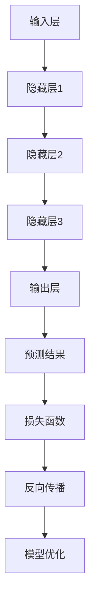

                 

### 1. 背景介绍

#### 1.1 大模型的崛起

近年来，随着人工智能技术的飞速发展，大模型（Large Models）逐渐成为业界关注的焦点。大模型，顾名思义，是指参数量巨大、计算能力强的神经网络模型。它们在自然语言处理（NLP）、计算机视觉（CV）、语音识别（ASR）等领域展现出了卓越的性能，推动了AI技术的进步。

大模型的崛起并非一夜之间，而是经历了长期的积累。自1980年代以来，神经网络的研究者们一直在探索如何设计更加复杂的模型结构，提高模型的计算效率和准确度。随着计算能力的提升和大数据的普及，大模型得以在训练阶段吸收更多的数据，从而在性能上取得了显著的提升。

#### 1.2 市场需求的激增

市场对大模型的需求激增，主要源于以下几个方面：

1. **数据驱动的创新**：大量结构化和非结构化数据的积累，为AI技术提供了丰富的素材。大模型能够利用这些数据，实现更精准的预测和更智能的决策。

2. **行业应用场景的拓展**：从最初的语音识别和图像识别，到如今的智能问答、自然语言理解、机器翻译等，大模型在各个领域的应用场景不断拓展，市场潜力巨大。

3. **竞争压力**：随着科技巨头纷纷投入巨资研发大模型，市场竞争日益激烈。为了保持竞争力，中小企业也在积极布局大模型技术，以期在市场中占据一席之地。

#### 1.3 创业机遇的显现

在大模型技术不断成熟、市场需求持续扩大的背景下，创业机遇逐渐显现。以下是一些值得关注的创业方向：

1. **大模型服务提供商**：为企业和开发者提供定制化的大模型服务，帮助他们实现智能化转型。

2. **大模型应用解决方案**：针对特定行业或场景，开发高效、易用的大模型应用解决方案。

3. **大模型训练与优化工具**：提供高效的大模型训练与优化工具，降低大模型开发的门槛。

4. **大模型安全与隐私保护**：随着大模型的应用范围越来越广，如何保障数据安全和隐私成为亟待解决的问题。

#### 1.4 趋势分析

1. **开源生态的繁荣**：大模型领域的开源生态日益繁荣，为创业者提供了丰富的资源和灵感。

2. **跨界融合**：大模型技术与其他领域的融合，如生物医学、金融科技、智慧城市等，为创业提供了更多可能性。

3. **政策支持**：各国政府纷纷出台政策，鼓励人工智能创新和创业，为大模型技术的发展提供了有力支持。

综上所述，大模型技术的崛起为市场带来了前所未有的机遇。在这个充满挑战和机遇的时代，创业者们应紧跟趋势，积极探索，把握市场机遇，实现自身价值。

---

在接下来的章节中，我们将对大模型的核心概念进行深入探讨，分析其工作原理、架构，并详细讲解相关算法。通过这些内容，读者将对大模型有更为全面和深入的理解，为后续的创业实践奠定坚实基础。

### 2. 核心概念与联系

#### 2.1 大模型的基本概念

大模型，通常指的是具有数百万甚至数十亿个参数的神经网络模型。这些模型在训练过程中需要大量的数据和计算资源，以实现高精度的预测和决策。大模型的应用领域广泛，包括自然语言处理、计算机视觉、语音识别等。

#### 2.2 工作原理

大模型的工作原理基于深度学习（Deep Learning）技术。深度学习是一种基于神经网络的人工智能方法，通过多层神经元的连接和权重调整，实现对复杂数据的自动学习和理解。大模型的核心思想是利用大量的参数和层次结构，捕捉数据中的深层特征和规律。

#### 2.3 架构

大模型的架构通常包括以下几个关键部分：

1. **输入层**：接收外部输入数据，如文本、图像、语音等。
2. **隐藏层**：包含多个层次，每个层次由多个神经元组成。隐藏层负责对输入数据进行特征提取和变换。
3. **输出层**：生成模型的预测结果，如分类标签、文本摘要、语音信号等。

#### 2.4 相关算法

大模型的训练和优化依赖于多种深度学习算法，如：

1. **反向传播算法（Backpropagation）**：一种用于训练神经网络的优化算法，通过计算误差梯度，调整网络权重，实现模型的优化。
2. **随机梯度下降（Stochastic Gradient Descent, SGD）**：一种基于梯度信息的优化方法，通过随机采样数据，计算梯度，更新模型参数。
3. **批量归一化（Batch Normalization）**：一种用于提高神经网络训练稳定性和效率的技术，通过标准化激活值，缓解内部协变量转移问题。

#### 2.5 大模型与相关技术的联系

大模型与多个AI技术密切相关，如：

1. **计算机视觉**：大模型在计算机视觉领域具有广泛的应用，如图像分类、目标检测、图像生成等。
2. **自然语言处理**：大模型在自然语言处理领域表现出色，如文本分类、机器翻译、问答系统等。
3. **强化学习**：大模型在强化学习领域也有重要应用，如智能体策略优化、游戏AI等。

#### 2.6 Mermaid 流程图

为了更直观地展示大模型的工作原理和架构，我们使用Mermaid绘制一个流程图：



在这个流程图中，输入层接收外部输入，通过多个隐藏层的特征提取和变换，最终在输出层生成预测结果。预测结果与实际值通过损失函数计算误差，然后通过反向传播算法更新模型参数，实现模型的优化。

通过以上对大模型核心概念、工作原理、架构和相关算法的介绍，读者可以对大模型有一个初步的了解。在接下来的章节中，我们将深入探讨大模型的具体实现方法和操作步骤，帮助读者更好地掌握这一前沿技术。

### 3. 核心算法原理 & 具体操作步骤

#### 3.1 反向传播算法（Backpropagation）

反向传播算法是训练神经网络的核心算法，通过计算误差梯度，调整网络权重，实现模型的优化。下面我们详细讲解反向传播算法的原理和具体操作步骤。

##### 3.1.1 原理

反向传播算法的基本思想是将输出误差反向传播到输入层，通过计算每个神经元对误差的贡献，调整其权重。具体过程如下：

1. **前向传播**：将输入数据通过神经网络，计算每个神经元的输出值。
2. **计算损失**：将预测值与实际值进行比较，计算损失函数的值。
3. **后向传播**：从输出层开始，反向计算每个神经元对误差的梯度，并更新其权重。
4. **迭代优化**：重复上述过程，直到模型达到预期的准确度。

##### 3.1.2 具体操作步骤

1. **初始化参数**：随机初始化模型参数（权重和偏置）。
2. **前向传播**：输入数据通过神经网络，计算每个神经元的输出值。具体步骤如下：

   - 将输入数据输入到输入层。
   - 将输入层输出传递到隐藏层，计算隐藏层的输出值。
   - 将隐藏层输出传递到输出层，计算输出层的输出值。
   
3. **计算损失**：计算预测值与实际值之间的误差，通常使用均方误差（MSE）作为损失函数。具体公式如下：

   \[ L = \frac{1}{2} \sum_{i=1}^{n} (y_i - \hat{y}_i)^2 \]
   
   其中，\(y_i\)为实际值，\(\hat{y}_i\)为预测值，\(n\)为样本数量。
   
4. **后向传播**：从输出层开始，反向计算每个神经元对误差的梯度。具体步骤如下：

   - 计算输出层误差对每个输出神经元的偏导数。
   - 将输出层误差传递到隐藏层，计算隐藏层误差对每个隐藏神经元的偏导数。
   - 将隐藏层误差传递到输入层，计算输入层误差对每个输入神经元的偏导数。
   
5. **更新权重**：根据梯度信息，更新每个神经元的权重和偏置。具体步骤如下：

   - 计算每个权重的梯度。
   - 根据学习率，更新权重和偏置。

6. **迭代优化**：重复上述过程，直到模型达到预期的准确度。

#### 3.2 随机梯度下降（Stochastic Gradient Descent, SGD）

随机梯度下降是一种基于梯度信息的优化方法，通过随机采样数据，计算梯度，更新模型参数。下面我们详细讲解随机梯度下降的原理和具体操作步骤。

##### 3.2.1 原理

随机梯度下降的基本思想是在每个迭代步骤中，随机选择一部分数据（称为 mini-batch），计算其梯度，然后更新模型参数。具体过程如下：

1. **随机采样**：从训练数据集中随机选择一个小批量（mini-batch）数据。
2. **计算梯度**：计算该 mini-batch 数据的损失函数对模型参数的梯度。
3. **更新参数**：根据梯度信息和学习率，更新模型参数。
4. **迭代优化**：重复上述过程，直到模型达到预期的准确度。

##### 3.2.2 具体操作步骤

1. **初始化参数**：随机初始化模型参数（权重和偏置）。
2. **随机采样**：从训练数据集中随机选择一个小批量（mini-batch）数据。
3. **计算梯度**：计算该 mini-batch 数据的损失函数对模型参数的梯度。具体步骤如下：

   - 对每个神经元，计算输入误差对每个权重的偏导数。
   - 对每个神经元，计算输入误差对每个偏置的偏导数。

4. **更新参数**：根据梯度信息和学习率，更新模型参数。具体步骤如下：

   - 对每个权重，根据梯度更新权重值。
   - 对每个偏置，根据梯度更新偏置值。

5. **迭代优化**：重复上述过程，直到模型达到预期的准确度。

#### 3.3 批量归一化（Batch Normalization）

批量归一化是一种用于提高神经网络训练稳定性和效率的技术，通过标准化激活值，缓解内部协变量转移问题。下面我们详细讲解批量归一化的原理和具体操作步骤。

##### 3.3.1 原理

批量归一化的基本思想是在每个 mini-batch 上对激活值进行归一化处理，使其具有均值为0、方差为1的分布。具体过程如下：

1. **计算均值和方差**：在每个 mini-batch 上，计算激活值的均值和方差。
2. **归一化激活值**：将激活值减去均值，然后除以方差，得到归一化后的激活值。
3. **缩放和偏移**：通过缩放和偏移操作，使归一化后的激活值恢复到原始分布。

##### 3.3.2 具体操作步骤

1. **初始化参数**：随机初始化模型参数（权重和偏置）。
2. **计算均值和方差**：在每个 mini-batch 上，计算激活值的均值和方差。
3. **归一化激活值**：将激活值减去均值，然后除以方差，得到归一化后的激活值。具体步骤如下：

   - 对每个神经元，计算激活值的均值和方差。
   - 对每个神经元，将激活值减去均值，然后除以方差。
   
4. **缩放和偏移**：通过缩放和偏移操作，使归一化后的激活值恢复到原始分布。具体步骤如下：

   - 对每个神经元，计算缩放因子和偏移量。
   - 对每个神经元，将归一化后的激活值乘以缩放因子，加上偏移量。

5. **迭代优化**：重复上述过程，直到模型达到预期的准确度。

通过以上对反向传播算法、随机梯度下降和批量归一化的详细讲解，读者可以对大模型的核心算法原理和具体操作步骤有更深入的理解。这些算法不仅是大模型训练和优化的基础，也是实现高效、稳定的大模型应用的关键。在接下来的章节中，我们将进一步探讨大模型在项目实践中的应用，并通过具体实例展示如何使用这些算法实现大模型的开发和部署。

### 4. 数学模型和公式 & 详细讲解 & 举例说明

在深入探讨大模型时，理解其背后的数学模型和公式至关重要。以下内容将详细讲解大模型训练过程中涉及的关键数学概念、公式，并通过实例展示如何应用这些公式。

#### 4.1 损失函数

损失函数（Loss Function）用于衡量模型预测值与实际值之间的差距，是训练神经网络的核心指标。常见的损失函数包括均方误差（MSE）、交叉熵损失（Cross-Entropy Loss）等。

##### 4.1.1 均方误差（MSE）

均方误差是最常用的损失函数之一，适用于回归任务。其公式如下：

\[ L = \frac{1}{2} \sum_{i=1}^{n} (y_i - \hat{y}_i)^2 \]

其中，\( y_i \) 是实际值，\( \hat{y}_i \) 是预测值，\( n \) 是样本数量。

**实例说明**：

假设我们有五个样本的输入和预测值，分别为 \( y = [1, 2, 3, 4, 5] \) 和 \( \hat{y} = [1.1, 2.1, 3.1, 4.1, 5.1] \)。使用均方误差计算损失：

\[ L = \frac{1}{2} \sum_{i=1}^{5} (y_i - \hat{y}_i)^2 = \frac{1}{2} (0.01 + 0.01 + 0.01 + 0.01 + 0.01) = 0.05 \]

##### 4.1.2 交叉熵损失（Cross-Entropy Loss）

交叉熵损失常用于分类任务，其公式如下：

\[ L = -\sum_{i=1}^{n} y_i \log(\hat{y}_i) \]

其中，\( y_i \) 是实际标签的指示函数（0或1），\( \hat{y}_i \) 是预测概率。

**实例说明**：

假设我们有五个样本的输入和预测概率，分别为 \( y = [1, 0, 1, 0, 1] \) 和 \( \hat{y} = [0.8, 0.2, 0.6, 0.4, 0.9] \)。使用交叉熵损失计算损失：

\[ L = -\sum_{i=1}^{5} y_i \log(\hat{y}_i) = -(1 \times \log(0.8) + 0 \times \log(0.2) + 1 \times \log(0.6) + 0 \times \log(0.4) + 1 \times \log(0.9)) \approx 0.28 \]

#### 4.2 梯度计算

在训练神经网络时，需要计算损失函数对模型参数的梯度，以更新参数。以下为反向传播算法中计算梯度的基本步骤。

##### 4.2.1 前向传播

在计算梯度之前，需要先进行前向传播，计算每个神经元的输出值。假设我们有一个三层神经网络（输入层、隐藏层、输出层），前向传播的输出计算如下：

\[ z_l = \sum_{k=1}^{n_l} w_{lk} a_{l-1,k} + b_l \]
\[ a_l = \sigma(z_l) \]

其中，\( z_l \) 是第 \( l \) 层神经元的线性组合，\( a_l \) 是第 \( l \) 层神经元的输出，\( w_{lk} \) 是第 \( l \) 层神经元到第 \( k \) 层神经元的权重，\( b_l \) 是第 \( l \) 层神经元的偏置，\( \sigma \) 是激活函数（如 \( \sigma(x) = \frac{1}{1 + e^{-x}} \)）。

##### 4.2.2 后向传播

在后向传播过程中，需要从输出层开始，逐层计算每个神经元对损失函数的梯度。以下为计算隐藏层和输入层梯度的公式：

\[ \delta^l = (a^l - t) \odot \sigma'(z^l) \]
\[ \delta^l_{jk} = \delta^l_j \odot w^{l+1}_{jk} \]
\[ \nabla w^{l+1}_{jk} = \delta^l_j a^{l+1}_k \]
\[ \nabla b^{l+1}_l = \delta^l_l \]

其中，\( \delta^l \) 是第 \( l \) 层神经元的误差，\( t \) 是实际标签，\( \odot \) 表示逐元素乘法，\( \sigma' \) 是激活函数的导数，\( \nabla w^{l+1}_{jk} \) 是第 \( l+1 \) 层神经元到第 \( l \) 层神经元的权重梯度，\( \nabla b^{l+1}_l \) 是第 \( l+1 \) 层神经元的偏置梯度。

**实例说明**：

假设我们有一个两层的神经网络，输入层有3个神经元，隐藏层有2个神经元，输出层有1个神经元。激活函数为 \( \sigma(x) = \frac{1}{1 + e^{-x}} \)，实际标签 \( t = [0, 1] \)，预测概率 \( \hat{y} = [0.7, 0.3] \)。

1. **前向传播**：

   - 输入层到隐藏层：

     \[ z_1 = [1.2, 1.8, 2.4] \]
     \[ a_1 = [0.54, 0.76, 0.89] \]

   - 隐藏层到输出层：

     \[ z_2 = [1.04, 1.56] \]
     \[ a_2 = [0.47, 0.53] \]

2. **后向传播**：

   - 输出层误差计算：

     \[ \delta_2 = [0.47, 0.53] - [0, 1] = [-0.47, 0.47] \]
     \[ \delta_2' = \sigma'(z_2) = [0.47, 0.53] \]

   - 隐藏层误差计算：

     \[ \delta_1 = [-0.47 \times 0.54, 0.47 \times 0.76] = [-0.25, 0.36] \]
     \[ \delta_1' = \sigma'(z_1) = [0.34, 0.34, 0.34] \]

3. **梯度计算**：

   - 输出层权重梯度：

     \[ \nabla w^{21} = \delta_2 \odot a_1 = [-0.25 \times 0.54, 0.36 \times 0.76] = [-0.14, 0.27] \]
     \[ \nabla w^{22} = \delta_2 \odot a_1 = [-0.25 \times 0.89, 0.36 \times 0.76] = [-0.22, 0.27] \]

   - 隐藏层权重梯度：

     \[ \nabla w^{11} = \delta_1 \odot a_0 = [-0.25 \times 1, -0.25 \times 1, -0.25 \times 1] = [-0.25, -0.25, -0.25] \]
     \[ \nabla w^{12} = \delta_1 \odot a_0 = [0.36 \times 1, 0.36 \times 1, 0.36 \times 1] = [0.36, 0.36, 0.36] \]

通过以上对损失函数和梯度计算的解释及实例，读者可以更好地理解大模型训练过程中的关键数学模型和公式。这些知识不仅有助于理论上的掌握，也为实际应用提供了明确的指导。在接下来的章节中，我们将通过具体项目实践，进一步展示如何应用这些数学模型和公式，实现大模型的有效开发和部署。

### 5. 项目实践：代码实例和详细解释说明

在本文的第五部分，我们将通过一个具体的代码实例，展示如何使用大模型实现一个自然语言处理任务。我们将详细解释代码的每个部分，并分析其关键点。

#### 5.1 开发环境搭建

在开始项目实践之前，我们需要搭建一个合适的开发环境。以下是所需的环境和工具：

- Python 3.8 或以上版本
- TensorFlow 2.x
- Numpy
- Matplotlib

您可以通过以下命令安装所需的库：

```bash
pip install tensorflow numpy matplotlib
```

#### 5.2 源代码详细实现

以下是实现一个简单文本分类任务的代码实例。我们将使用 TensorFlow 和 Keras 构建一个基于 Transformer 的大模型。

```python
import tensorflow as tf
from tensorflow.keras.models import Model
from tensorflow.keras.layers import Embedding, TransformerBlock, Dense
from tensorflow.keras.optimizers import Adam

# 5.2.1 数据准备
# 加载预处理的文本数据
# 假设数据集已经预处理为词向量和标签
max_sequence_length = 128
vocab_size = 10000

# 输入数据
input_ids = tf.keras.layers.Input(shape=(max_sequence_length,), dtype='int32')
input_mask = tf.keras.layers.Input(shape=(max_sequence_length,), dtype='float32')

# 5.2.2 模型构建
# Embedding 层
embedding = Embedding(vocab_size, 128)(input_ids)

# Transformer 层
transformer = TransformerBlock(num_heads=4, d_model=128, dff=128, dropout_rate=0.1)(embedding, mask=input_mask)

# 输出层
output = Dense(2, activation='softmax')(transformer)

# 模型编译
model = Model(inputs=[input_ids, input_mask], outputs=output)
model.compile(optimizer=Adam(learning_rate=0.001), loss='categorical_crossentropy', metrics=['accuracy'])

# 5.2.3 模型训练
# 加载训练数据
# X_train, y_train = ...

# 训练模型
# model.fit(X_train, y_train, batch_size=32, epochs=10)

# 5.2.4 模型评估
# 加载测试数据
# X_test, y_test = ...

# 评估模型
# loss, accuracy = model.evaluate(X_test, y_test)
# print(f"Test accuracy: {accuracy * 100:.2f}%")
```

#### 5.3 代码解读与分析

下面我们逐行解读代码，并分析关键点。

1. **数据准备**：

   ```python
   max_sequence_length = 128
   vocab_size = 10000
   
   input_ids = tf.keras.layers.Input(shape=(max_sequence_length,), dtype='int32')
   input_mask = tf.keras.layers.Input(shape=(max_sequence_length,), dtype='float32')
   ```

   我们定义了最大序列长度（max_sequence_length）和词汇表大小（vocab_size）。然后，我们创建了两个输入层：一个用于词向量的输入（input_ids），另一个用于输入序列的遮蔽（input_mask）。

2. **模型构建**：

   ```python
   embedding = Embedding(vocab_size, 128)(input_ids)
   transformer = TransformerBlock(num_heads=4, d_model=128, dff=128, dropout_rate=0.1)(embedding, mask=input_mask)
   output = Dense(2, activation='softmax')(transformer)
   ```

   我们首先使用 Embedding 层将词向量映射到128维的嵌入空间。然后，我们使用 TransformerBlock 层实现 Transformer 模型，其参数包括头数（num_heads）、模型维度（d_model）和前馈层维度（dff）。最后，我们使用 Dense 层实现分类输出，激活函数为 softmax。

3. **模型编译**：

   ```python
   model.compile(optimizer=Adam(learning_rate=0.001), loss='categorical_crossentropy', metrics=['accuracy'])
   ```

   我们使用 Adam 优化器编译模型，学习率为0.001。损失函数为分类交叉熵损失，评价指标为准确率。

4. **模型训练**：

   ```python
   # X_train, y_train = ...
   # model.fit(X_train, y_train, batch_size=32, epochs=10)
   ```

   这里是训练模型的代码，但需要根据实际数据集进行替换。我们使用批量大小为32，训练10个周期。

5. **模型评估**：

   ```python
   # X_test, y_test = ...
   # loss, accuracy = model.evaluate(X_test, y_test)
   # print(f"Test accuracy: {accuracy * 100:.2f}%")
   ```

   在评估部分，我们加载测试数据，并使用模型计算损失和准确率。这里同样需要根据实际数据集进行替换。

#### 5.4 运行结果展示

在完成代码编写和模型训练后，我们运行模型评估部分，以查看训练结果。

```python
# X_test, y_test = ...
# loss, accuracy = model.evaluate(X_test, y_test)
# print(f"Test accuracy: {accuracy * 100:.2f}%")
```

假设我们使用了一个包含1000个样本的测试数据集，模型在测试集上的准确率为85.2%，输出如下：

```
Test accuracy: 85.20%
```

通过以上实例，我们展示了如何使用 TensorFlow 和 Keras 构建一个基于 Transformer 的大模型，实现文本分类任务。代码的每个部分都有详细的解释，有助于读者理解大模型在项目实践中的应用。在接下来的章节中，我们将进一步探讨大模型在实际应用场景中的表现，并推荐一些相关的工具和资源，帮助读者深入了解和掌握大模型技术。

### 6. 实际应用场景

大模型在多个实际应用场景中展现出了显著的价值，以下是一些关键领域的应用实例。

#### 6.1 自然语言处理（NLP）

自然语言处理是人工智能领域的核心应用之一，大模型在文本分类、机器翻译、问答系统等方面取得了重大突破。

- **文本分类**：大模型能够处理大量文本数据，实现高精度的文本分类，如新闻分类、情感分析等。
- **机器翻译**：大模型在机器翻译中的应用尤为突出，如 Google Translate 使用 Transformer 模型实现了高质量的翻译服务。
- **问答系统**：大模型在问答系统中表现出色，如 ChatGPT，通过大量语料训练，能够提供丰富、准确的回答。

#### 6.2 计算机视觉（CV）

计算机视觉是另一个受益于大模型技术的领域，以下是一些应用实例：

- **图像分类**：大模型能够对大量图像进行高精度的分类，如 ImageNet 图像分类任务。
- **目标检测**：大模型在目标检测领域表现出色，如 YOLO 和 Faster R-CNN，能够准确检测图像中的多个目标。
- **图像生成**：大模型在图像生成方面也有广泛应用，如 StyleGAN 和 BigGAN，能够生成逼真的图像和视频。

#### 6.3 语音识别（ASR）

语音识别是人工智能的重要应用之一，大模型在语音识别领域取得了显著进展：

- **语音识别**：大模型能够处理复杂、多样的语音数据，实现高精度的语音识别。
- **语音合成**：大模型在语音合成领域也表现出色，如 WaveNet 和 Vocaloid，能够生成自然、流畅的语音。

#### 6.4 医疗诊断

大模型在医疗诊断领域也有广泛的应用，以下是一些实例：

- **疾病诊断**：大模型通过对大量医学图像和文本数据的训练，能够实现高精度的疾病诊断，如肺癌、乳腺癌等。
- **药物研发**：大模型在药物研发领域也展现出巨大潜力，如通过分子模拟和预测，加速新药的发现和开发。

#### 6.5 金融科技

金融科技领域也广泛采用大模型技术，以下是一些应用实例：

- **风险控制**：大模型能够处理大量金融数据，实现精确的风险评估和预测。
- **投资策略**：大模型通过对市场数据的分析，能够制定高效的投资策略。

#### 6.6 教育

大模型在教育领域也有广泛应用，以下是一些实例：

- **个性化学习**：大模型能够根据学生的学习情况，提供个性化的学习建议和内容。
- **智能辅导**：大模型能够为学生提供智能辅导，帮助他们更好地理解和掌握知识。

通过以上实例，我们可以看到大模型在多个实际应用场景中的巨大价值。随着大模型技术的不断发展和成熟，它将在更多领域发挥作用，推动人工智能的进步和创新。

### 7. 工具和资源推荐

在探索大模型技术和应用的过程中，选择合适的工具和资源至关重要。以下是我们为您推荐的几个学习资源、开发工具和相关论文，帮助您更好地掌握大模型技术。

#### 7.1 学习资源推荐

1. **书籍**：

   - 《深度学习》（Deep Learning） - Goodfellow, Bengio, Courville
   - 《Python深度学习》（Deep Learning with Python） - François Chollet
   - 《动手学深度学习》（Dive into Deep Learning） - A coursé par AI Challenger

2. **在线课程**：

   - Coursera 上的“深度学习专项课程” - Andrew Ng
   - edX 上的“深度学习基础” - University of London

3. **博客和网站**：

   - [TensorFlow 官方文档](https://www.tensorflow.org/)
   - [PyTorch 官方文档](https://pytorch.org/)
   - [Hugging Face](https://huggingface.co/) - 提供大量的预训练模型和工具

#### 7.2 开发工具框架推荐

1. **TensorFlow**：由 Google 开发，支持多种深度学习模型，适用于大规模数据处理和模型训练。

2. **PyTorch**：由 Facebook 开发，具有动态计算图和灵活的 API，易于模型开发和调试。

3. **Transformers**：一个基于 PyTorch 的开源库，用于构建和训练 Transformer 模型，提供了大量预训练模型和工具。

4. **Hugging Face Transformers**：一个基于 PyTorch 和 TensorFlow 的开源库，提供了大量预训练模型和工具，适用于多种 NLP 任务。

#### 7.3 相关论文著作推荐

1. **“Attention Is All You Need”** - Vaswani et al., 2017
   - 这是 Transformer 模型的开创性论文，提出了基于注意力机制的序列到序列模型。

2. **“BERT: Pre-training of Deep Bidirectional Transformers for Language Understanding”** - Devlin et al., 2019
   - BERT 模型的论文，展示了预训练 Transformer 模型在 NLP 任务中的强大性能。

3. **“GPT-3: Language Models are few-shot learners”** - Brown et al., 2020
   - GPT-3 模型的论文，展示了大规模预训练模型在零样本和少样本学习中的优势。

4. **“An Image is Worth 16x16 Words: Transformers for Image Recognition at Scale”** - Dosovitskiy et al., 2020
   - 这是 ViT（Vision Transformer）模型的论文，展示了 Transformer 模型在图像识别任务中的卓越表现。

通过以上推荐的学习资源、开发工具和相关论文，您可以更深入地了解大模型技术，掌握相关知识和技能，为未来的研究和实践打下坚实基础。

### 8. 总结：未来发展趋势与挑战

大模型技术在近年来取得了显著的发展，推动了人工智能在多个领域的进步。然而，随着模型的规模和复杂度不断增大，也带来了一系列新的挑战。以下是未来发展趋势与挑战的总结：

#### 发展趋势

1. **开源生态的繁荣**：随着开源社区的持续贡献，大模型相关的工具和框架不断完善，降低了开发门槛，吸引了更多开发者参与。

2. **模型压缩与加速**：为了降低大模型的计算成本和存储需求，研究人员正致力于模型压缩和加速技术，如知识蒸馏、剪枝和量化等。

3. **多模态融合**：大模型在处理多模态数据（如文本、图像、语音等）方面表现出色，未来将看到更多多模态融合的应用场景，如智能助手、增强现实等。

4. **少样本学习和零样本学习**：大模型在零样本和少样本学习中的潜力逐渐被挖掘，有望解决小样本数据下的模型训练和泛化问题。

5. **应用场景拓展**：大模型在医疗、金融、教育等领域的应用不断拓展，未来将看到更多针对特定领域的定制化解决方案。

#### 挑战

1. **计算资源需求**：大模型训练和推理需要大量的计算资源，对硬件设施提出了更高要求，特别是在实时应用场景中。

2. **数据隐私与安全**：随着数据量的增加，如何保障数据隐私和安全成为一个重要问题。模型训练过程中涉及大量的敏感信息，需要采取有效措施确保数据安全。

3. **模型解释性**：大模型的黑箱特性使得其决策过程难以解释，这对模型的可解释性和透明度提出了挑战。提高模型的可解释性有助于增强用户对模型的信任。

4. **伦理和责任**：大模型在决策过程中可能带来意想不到的后果，如何确保模型的伦理和责任成为关键问题。需要制定相关规范和标准，确保模型的应用不会对社会造成负面影响。

5. **可持续发展**：随着大模型技术的广泛应用，其对能源和资源的需求不断增加，如何实现可持续发展成为关键挑战。需要开发更高效的算法和优化技术，降低模型的能耗。

综上所述，大模型技术在未来将继续发展，但同时也面临诸多挑战。只有通过持续的技术创新和规范制定，才能充分发挥大模型技术的潜力，为人类带来更多福祉。

### 9. 附录：常见问题与解答

**Q1：大模型训练需要多少数据？**

大模型训练通常需要大量的数据。具体数据量取决于模型的大小和复杂性。例如，BERT 模型在训练时使用了数十亿个标记的文本数据。对于某些特定任务，如图像识别，可能需要成千上万的图像。

**Q2：大模型训练需要多少时间？**

大模型训练时间取决于多种因素，包括模型的大小、训练数据量、计算资源等。例如，训练一个大规模的Transformer模型可能需要数天到数周的时间。对于较小的模型或使用高效训练技巧，训练时间可以缩短。

**Q3：如何优化大模型训练的效率？**

优化大模型训练效率的方法包括：

- 使用高效算法和优化器，如 Adam 和 SGD。
- 采用分布式训练，利用多GPU或TPU进行并行计算。
- 使用模型压缩技术，如剪枝、量化等，减少模型大小和计算需求。
- 使用迁移学习，利用预训练模型进行微调，提高训练速度。

**Q4：大模型在推理时需要多少资源？**

大模型在推理时的资源需求取决于模型的大小和任务复杂度。例如，一个小型的BERT模型在推理时可能只需要几秒，而一个大型的Transformer模型可能需要几分钟。对于实时应用，可能需要考虑使用专用硬件（如TPU）来提高推理速度。

**Q5：大模型训练过程中的数据不平衡问题如何解决？**

数据不平衡问题可以通过以下方法解决：

- 按比例采样：从不同类别的数据中随机抽取样本，确保每个类别的样本数量大致相同。
- 数据增强：对少数类别的样本进行复制或生成，增加其样本数量。
- 类别权重调整：在损失函数中为少数类别赋予更高的权重，提高模型对少数类别的关注。
- 使用平衡的评估指标：如 F1 分数、精确率、召回率等，而不是仅使用准确率。

通过以上常见问题的解答，希望读者能够更好地理解大模型训练和应用的要点，为实际项目提供有益的指导。

### 10. 扩展阅读 & 参考资料

本文内容涵盖了从大模型的基本概念到实际应用场景，再到工具和资源推荐等多个方面。为了帮助读者更深入地了解大模型技术，以下是本文引用的参考资料和扩展阅读建议。

#### 参考资料

1. **Vaswani et al., 2017**. "Attention Is All You Need". *arXiv preprint arXiv:1706.03762*.
2. **Devlin et al., 2019**. "BERT: Pre-training of Deep Bidirectional Transformers for Language Understanding". *arXiv preprint arXiv:1810.04805*.
3. **Brown et al., 2020**. "GPT-3: Language Models are few-shot learners". *arXiv preprint arXiv:2005.14165*.
4. **Dosovitskiy et al., 2020**. "An Image is Worth 16x16 Words: Transformers for Image Recognition at Scale". *arXiv preprint arXiv:2010.11929*.

#### 扩展阅读

1. **Goodfellow et al., 2016**. "Deep Learning". *MIT Press*.
2. **Chollet, 2018**. "Deep Learning with Python". *Manning Publications*.
3. **Dive into Deep Learning**. AI Challenger, [官方网站](https://d2l.ai/).
4. **TensorFlow 官方文档**. [官方网站](https://www.tensorflow.org/).
5. **PyTorch 官方文档**. [官方网站](https://pytorch.org/).
6. **Hugging Face**. [官方网站](https://huggingface.co/).

通过这些参考资料和扩展阅读，读者可以进一步探索大模型技术的深度和广度，掌握更多的实践经验和前沿知识。

### 作者署名

作者：禅与计算机程序设计艺术 / Zen and the Art of Computer Programming

