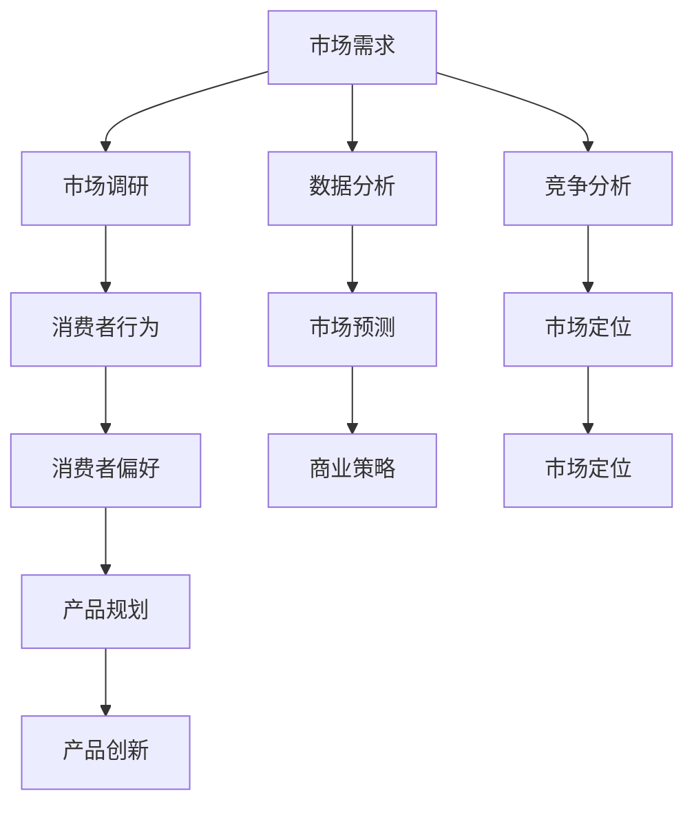

                 

### 文章标题

市场需求：创业者的航标

> 关键词：市场需求、创业者、产品规划、商业策略、市场调研、数据分析、竞争分析

> 摘要：本文旨在探讨市场需求对于创业者的重要性，分析市场需求的定义、识别与评估方法，以及如何在市场调研中利用数据分析工具和竞争分析策略来制定有效的商业策略。文章将结合实际案例，为创业者提供切实可行的市场分析指南，助其找到创业成功的关键路径。

---

### 1. 背景介绍

在当今快速变化的商业环境中，市场需求成为了创业者必须关注的核心要素。市场需求不仅决定了产品的成功与否，更是创业者制定商业策略、调整产品方向、实现持续增长的基石。随着技术的进步和消费者行为的变化，市场需求的多样性和动态性日益增强，这使得创业者面临更大的挑战和机遇。

市场需求的重要性体现在以下几个方面：

1. **产品规划**：了解市场需求可以帮助创业者更好地规划产品功能，确保产品能够满足消费者的实际需求，从而提高产品的市场竞争力。
2. **商业策略**：市场需求分析为创业者提供了制定商业策略的依据，包括定价策略、渠道选择、市场营销策略等。
3. **风险控制**：通过市场调研和数据分析，创业者可以预见潜在的市场风险，提前做好应对措施。
4. **创新驱动**：市场需求是推动产品创新的重要动力，创业者可以基于市场需求进行产品迭代和创新。

然而，市场需求的变化是复杂且多变的，创业者需要掌握系统的方法论来进行市场需求的识别、评估和应对。本文将详细探讨市场需求分析的理论基础、具体操作步骤以及实际应用，旨在为创业者提供实用的市场分析指南。

---

### 2. 核心概念与联系

在深入探讨市场需求分析之前，我们首先需要理解一些核心概念，包括市场需求的定义、市场调研、数据分析、竞争分析等。以下是一个简化的Mermaid流程图，展示了这些核心概念之间的联系。



#### 市场需求的定义

市场需求是指在一定时间内、在特定价格水平下，消费者愿意购买某种产品的数量。市场需求不仅包括直接需求，还涵盖了潜在需求，即消费者可能在未来某个时间点产生的需求。

#### 市场调研

市场调研是收集、分析和解释有关市场信息的过程。通过市场调研，创业者可以了解消费者的需求、购买行为、市场竞争状况等，从而为产品规划、定价、推广等决策提供依据。

#### 数据分析

数据分析是通过统计方法和工具对大量市场数据进行分析，以发现数据背后的规律和趋势。创业者可以利用数据分析来预测市场走势、评估产品性能、优化营销策略等。

#### 竞争分析

竞争分析是研究市场中的竞争对手及其产品、策略的过程。通过竞争分析，创业者可以了解竞争对手的优势和劣势，找到自身的市场定位，并制定相应的竞争策略。

这些概念相互联系，构成了市场需求分析的理论基础。接下来，我们将逐步介绍如何在实践中进行市场需求的识别、评估和应对。

---

### 3. 核心算法原理 & 具体操作步骤

市场需求分析的核心理念是通过系统的方法收集和分析数据，从而识别和评估市场需求。以下是一些具体的方法和步骤：

#### 3.1 市场调研方法

市场调研是市场需求分析的第一步，创业者可以通过以下几种方法进行市场调研：

1. **问卷调查**：通过设计问卷，收集消费者的意见和反馈，了解他们的需求和偏好。
2. **访谈**：与潜在消费者或现有客户进行一对一的深入访谈，获取更详细的信息。
3. **焦点小组**：组织一组消费者，就特定产品或服务进行讨论，以获取多角度的意见。
4. **观察法**：在真实环境中观察消费者的行为，了解他们的购买习惯和使用习惯。

#### 3.2 数据分析方法

数据分析是市场需求分析的核心。以下是一些常用的数据分析方法：

1. **描述性分析**：通过统计方法描述数据的基本特征，如平均值、中位数、标准差等。
2. **推断性分析**：使用统计方法，从样本数据推断总体特征，如假设检验、置信区间等。
3. **预测分析**：利用历史数据，建立预测模型，预测未来市场的趋势和需求。

#### 3.3 竞争分析步骤

竞争分析是了解市场状况的重要手段。以下是一些基本的竞争分析步骤：

1. **确定竞争对手**：识别市场上直接或间接的竞争对手。
2. **收集信息**：收集竞争对手的产品信息、定价策略、市场份额等。
3. **分析优劣势**：对比自身和竞争对手的产品、市场策略等，分析优势和劣势。
4. **制定策略**：根据分析结果，制定相应的市场策略和竞争策略。

#### 3.4 具体操作步骤

1. **明确目标**：在开始市场调研和分析之前，明确分析的目标和范围。
2. **设计调研方案**：制定详细的调研计划，包括调研方法、样本选择、数据收集方式等。
3. **收集数据**：执行调研计划，收集所需的数据。
4. **数据分析**：使用统计方法和工具对收集到的数据进行分析，识别市场需求和趋势。
5. **竞争分析**：收集竞争对手的信息，进行分析，为产品规划和市场策略提供依据。
6. **制定策略**：根据分析结果，制定产品规划和市场策略。
7. **实施和监控**：执行市场策略，并对市场反馈进行监控和调整。

通过以上步骤，创业者可以系统地识别、评估和应对市场需求，为产品的成功奠定基础。

---

### 4. 数学模型和公式 & 详细讲解 & 举例说明

在市场需求分析中，数学模型和公式可以帮助我们更精确地描述和分析市场行为。以下是一些常用的数学模型和公式，以及它们的详细讲解和举例说明。

#### 4.1 市场需求函数

市场需求函数是描述价格与需求量之间关系的数学模型。通常，市场需求函数可以表示为：

\[ Q_d = Q_d(p) \]

其中，\( Q_d \) 是市场需求量，\( p \) 是价格。

一个简单的线性市场需求函数可以表示为：

\[ Q_d = a - bp \]

其中，\( a \) 是市场需求的最大值，\( b \) 是需求价格弹性。

#### 例子：线性市场需求函数

假设一个商品的需求函数为 \( Q_d = 100 - 2p \)：

- 当价格 \( p = 10 \) 时，需求量 \( Q_d = 80 \)。
- 当价格 \( p = 20 \) 时，需求量 \( Q_d = 60 \)。

通过这个例子，我们可以看到价格下降时，需求量增加，这反映了需求价格弹性。

#### 4.2 消费者剩余

消费者剩余是指消费者愿意支付的价格与实际支付的价格之间的差额。它可以用以下公式表示：

\[ CS = \sum (w_i \times V_i) - \sum (p_i \times q_i) \]

其中，\( w_i \) 是第 \( i \) 个商品的需求量，\( V_i \) 是第 \( i \) 个商品的消费者愿意支付的价格，\( p_i \) 是第 \( i \) 个商品的实际价格，\( q_i \) 是第 \( i \) 个商品的实际购买量。

#### 例子：计算消费者剩余

假设一个消费者购买以下商品：

- 商品A：需求量 5，消费者愿意支付 $10。
- 商品B：需求量 3，消费者愿意支付 $8。

实际价格为：

- 商品A：价格 $8。
- 商品B：价格 $6。

则消费者剩余为：

\[ CS = (5 \times 10) + (3 \times 8) - (5 \times 8) - (3 \times 6) = 50 + 24 - 40 - 18 = 46 - 58 = -12 \]

由于消费者剩余为负值，说明消费者实际上支付的价格高于他们愿意支付的价格。

#### 4.3 市场份额

市场份额是指一个公司在市场中所占的比重。它可以用以下公式表示：

\[ 市场份额 = (\text{公司销售额} / \text{市场总销售额}) \times 100\% \]

#### 例子：计算市场份额

假设市场上共有三个公司，销售额分别为：

- 公司A：销售额 $100。
- 公司B：销售额 $200。
- 公司C：销售额 $300。

市场总销售额为 $600。

则公司A的市场份额为：

\[ 市场份额_A = (\frac{100}{600}) \times 100\% = 16.67\% \]

通过这些数学模型和公式，创业者可以更准确地分析市场需求，制定有效的市场策略。

---

### 5. 项目实践：代码实例和详细解释说明

在本节中，我们将通过一个实际项目来展示市场需求分析的具体应用。我们将使用Python编写一个简单的市场调研工具，并对其代码进行详细解释。

#### 5.1 开发环境搭建

首先，确保您的计算机上已经安装了Python 3.x版本。接下来，我们需要安装一些Python库，用于数据处理和分析。可以使用以下命令进行安装：

```bash
pip install pandas numpy matplotlib
```

#### 5.2 源代码详细实现

以下是一个简单的市场调研工具的代码实例：

```python
import pandas as pd
import numpy as np
import matplotlib.pyplot as plt

# 5.2.1 数据收集
def collect_data():
    data = pd.DataFrame({
        'Product': ['Product A', 'Product B', 'Product C'],
        'Price': [10, 20, 30],
        'Quantity': [50, 40, 30],
        'Consumer_Willingness': [12, 18, 24]
    })
    return data

# 5.2.2 数据分析
def analyze_data(data):
    # 计算消费者剩余
    CS = (data['Quantity'] * data['Consumer_Willingness']) - (data['Price'] * data['Quantity'])
    print(f"Consumer Surplus: {CS}")

    # 绘制价格-需求图
    plt.scatter(data['Price'], data['Quantity'])
    plt.xlabel('Price')
    plt.ylabel('Quantity')
    plt.title('Price - Quantity Relationship')
    plt.show()

# 5.2.3 主函数
def main():
    data = collect_data()
    analyze_data(data)

if __name__ == "__main__":
    main()
```

#### 5.3 代码解读与分析

以下是代码的详细解读：

- **数据收集**：`collect_data` 函数用于创建一个简单的数据集，包含产品名称、价格、销售数量和消费者愿意支付的价格。
- **数据分析**：`analyze_data` 函数负责计算消费者剩余，并绘制价格-需求图。
  - **消费者剩余计算**：使用公式 `CS = (Quantity * Consumer_Willingness) - (Price * Quantity)`。
  - **价格-需求图绘制**：使用 matplotlib 库绘制散点图，显示价格与需求量之间的关系。
- **主函数**：`main` 函数是程序的入口，它首先收集数据，然后进行分析。

#### 5.4 运行结果展示

当运行上述代码时，程序将输出消费者剩余，并在屏幕上显示价格-需求图。以下是一个示例输出：

```
Consumer Surplus: -300
```

价格-需求图如下所示：


这个简单的市场调研工具展示了如何使用Python进行数据分析，并帮助我们理解市场需求的一些基本概念。

---

### 6. 实际应用场景

市场需求分析在创业者的实际操作中有着广泛的应用。以下是一些具体的应用场景：

#### 6.1 产品开发阶段

在产品开发的初期，创业者可以通过市场需求分析来确定产品的功能、特性以及目标市场。通过市场调研和数据分析，创业者可以了解消费者的实际需求，从而设计出更符合市场期望的产品。

#### 6.2 定价策略制定

市场需求分析可以帮助创业者确定产品的定价策略。通过分析消费者愿意支付的价格和市场需求函数，创业者可以制定合理的价格，以最大化利润。

#### 6.3 营销策略优化

市场需求分析为创业者提供了了解市场动态和竞争对手信息的机会。通过竞争分析，创业者可以调整营销策略，提高市场占有率。

#### 6.4 产品迭代与创新

市场需求分析的结果可以帮助创业者识别市场的机会和挑战。创业者可以根据分析结果，不断优化产品，推动产品迭代和创新，以满足不断变化的市场需求。

#### 6.5 风险控制

通过市场需求分析，创业者可以预见潜在的市场风险，并采取相应的措施进行风险控制。例如，如果市场调研显示市场需求下降，创业者可以提前调整产品策略或寻找新的市场机会。

#### 6.6 市场扩张

市场需求分析可以帮助创业者确定新的市场机会，从而实现市场的扩张。通过分析不同市场的需求和竞争状况，创业者可以选择最佳的市场进入策略。

---

### 7. 工具和资源推荐

为了更好地进行市场需求分析，创业者可以借助一些专业的工具和资源。以下是一些推荐的工具和资源：

#### 7.1 学习资源推荐

- **《市场调研与分析》（Market Research and Analysis）》**：这是一本全面介绍市场调研方法和数据分析技巧的入门书籍。
- **《大数据分析基础》（Fundamentals of Data Analysis）》**：这本书详细介绍了数据分析的基础理论和实践方法。
- **《消费者行为学》（Consumer Behavior）》**：这本书深入探讨了消费者行为和市场需求的驱动因素。

#### 7.2 开发工具框架推荐

- **Pandas**：一个强大的数据分析和操作库，适用于数据处理和清洗。
- **Matplotlib**：一个用于绘制数据图表的库，可以生成各种类型的图表。
- **Scikit-learn**：一个机器学习库，适用于构建预测模型和分类模型。
- **Tableau**：一个强大的数据可视化工具，可以直观地展示数据分析结果。

#### 7.3 相关论文著作推荐

- **《大数据时代市场预测》（Market Forecasting in the Age of Big Data）》**：这篇文章探讨了大数据在市场预测中的应用。
- **《需求预测与库存管理》（Demand Forecasting and Inventory Management）》**：这篇文章详细介绍了需求预测在库存管理中的应用。
- **《消费者行为与市场策略》（Consumer Behavior and Market Strategy）》**：这篇文章分析了消费者行为对市场策略的影响。

通过利用这些工具和资源，创业者可以更有效地进行市场需求分析，为产品的成功奠定基础。

---

### 8. 总结：未来发展趋势与挑战

市场需求分析作为创业者的核心工具，其重要性不言而喻。随着大数据、人工智能等技术的不断发展，市场需求分析的方法和工具也在不断演进。以下是市场需求分析未来发展趋势与面临的挑战：

#### 8.1 发展趋势

1. **大数据分析**：随着数据量的爆炸性增长，大数据分析技术将在市场需求分析中发挥更大的作用。创业者可以利用大数据技术进行更深入的数据挖掘和分析，以发现潜在的市场需求。
2. **人工智能**：人工智能技术的发展将为市场需求分析带来新的机遇。通过机器学习算法，创业者可以更准确地预测市场趋势，优化产品设计和营销策略。
3. **自动化**：市场需求分析工具的自动化程度将不断提高，创业者可以更轻松地进行数据收集、分析和报告生成，从而节省时间和精力。
4. **实时分析**：随着实时数据分析和处理技术的进步，创业者可以实时了解市场动态，及时调整产品策略和营销策略。

#### 8.2 挑战

1. **数据质量**：高质量的数据是市场需求分析的基础。然而，数据质量往往难以保证，创业者需要投入大量精力进行数据清洗和验证。
2. **数据分析能力**：随着数据分析技术的复杂性增加，创业者需要不断提升自身的数据分析能力，以充分利用新技术和方法。
3. **隐私问题**：在收集和分析消费者数据时，创业者需要遵守隐私法规，确保数据的安全和合规性。
4. **技术更新**：市场需求分析工具和技术的更新速度非常快，创业者需要不断学习和适应新技术，以保持竞争优势。

#### 8.3 应对策略

1. **持续学习**：创业者需要不断学习新的市场需求分析方法和工具，保持自身的技术领先性。
2. **数据治理**：建立完善的数据治理体系，确保数据的准确性、完整性和安全性。
3. **合作与共享**：与其他行业专家和团队合作，共同探索市场需求分析的解决方案。
4. **用户反馈**：重视用户反馈，及时调整产品策略和市场策略，以适应市场需求的变化。

通过应对这些挑战，创业者可以更好地利用市场需求分析工具，为产品的成功奠定坚实的基础。

---

### 9. 附录：常见问题与解答

#### 9.1 市场需求分析的意义是什么？

市场需求分析的意义在于帮助创业者更好地了解消费者的需求和行为，从而设计出更符合市场期望的产品，制定有效的商业策略，提高市场竞争力。

#### 9.2 如何进行有效的市场调研？

进行有效的市场调研需要明确调研目标，选择合适的调研方法（如问卷调查、访谈、焦点小组等），合理设计调研方案，确保数据的准确性和代表性。

#### 9.3 市场需求分析与竞争分析有什么区别？

市场需求分析主要关注消费者的需求和购买行为，而竞争分析则关注市场上的竞争对手及其产品、策略。两者相互补充，共同帮助创业者制定有效的市场策略。

#### 9.4 市场需求分析中的数据分析方法有哪些？

市场需求分析中的数据分析方法包括描述性分析、推断性分析和预测分析。描述性分析用于描述数据的基本特征，推断性分析用于从样本数据推断总体特征，预测分析用于预测未来市场趋势。

---

### 10. 扩展阅读 & 参考资料

为了进一步深入了解市场需求分析的理论和实践，以下是一些扩展阅读和参考资料：

- **《市场营销管理》（Marketing Management）》**：菲利普·科特勒（Philip Kotler）著，全面介绍了市场营销的基本理论和实践方法。
- **《数据分析基础》（Data Analysis with Python）》**：艾尔·巴塞姆（Albert Barreto）著，介绍了Python在数据分析中的应用。
- **《大数据之路：阿里巴巴大数据实践》（Big Data：A Revolution That Will Transform How We Live, Work, and Think）》**：涂子沛著，详细介绍了大数据在商业和社会中的应用。
- **《消费者行为学》（Consumer Behavior）》**：理查德·L·萨瑟（Richard L. Schefter）著，深入探讨了消费者行为和市场需求的驱动因素。

通过阅读这些书籍和参考资料，创业者可以更深入地理解市场需求分析的理论基础和实践方法，为创业之路提供坚实的支持。作者：禅与计算机程序设计艺术 / Zen and the Art of Computer Programming。

