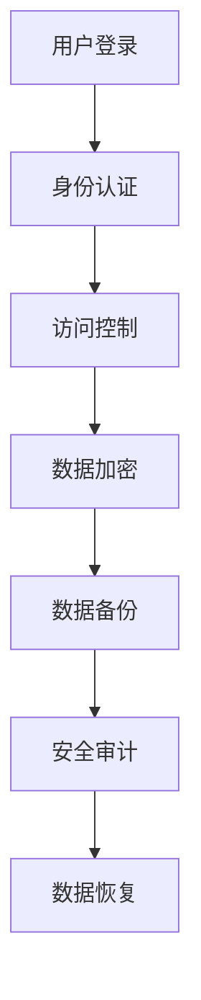

                 

### 文章标题

**平台经济的数据安全技术研究：如何研究数据安全技术？**

> **关键词**：平台经济，数据安全，安全技术，研究方法论，架构设计，算法原理，数学模型，项目实践，应用场景，发展趋势。

> **摘要**：本文旨在探讨平台经济中数据安全的重要性，以及如何通过研究先进的数据安全技术来保障数据安全。文章首先介绍了平台经济的背景和特点，然后深入探讨了数据安全的核心概念和架构。接下来，详细解析了数据安全技术的核心算法原理和数学模型，并通过实际项目实践进行了代码实例和解读。最后，分析了数据安全技术的应用场景和未来发展趋势，提出了相关的挑战和解决建议。

---

**禅与计算机程序设计艺术 / Zen and the Art of Computer Programming**

### 1. 背景介绍

在当前数字化时代，平台经济作为一种新兴的经济模式，已经深刻地影响了全球的商业生态。平台经济的核心在于通过搭建一个开放的平台，吸引大量的用户和第三方服务提供商，实现资源的高效配置和价值的最大化。例如，电子商务平台、金融服务平台、交通共享平台等，都是平台经济的典型代表。

然而，平台经济的快速发展也带来了数据安全的新挑战。平台聚集了大量的用户数据，这些数据不仅是平台业务的基础，也是潜在的攻击目标。数据泄露、篡改、滥用等问题，不仅会损害用户隐私，还会对平台的声誉和业务造成严重影响。因此，研究数据安全技术，保障平台经济中的数据安全，成为了一个亟待解决的问题。

数据安全技术的研究，需要从多个角度出发。首先，需要了解平台经济的运行机制和数据流动模式，这是理解数据安全问题的关键。其次，需要掌握各种数据安全技术的核心原理和实现方法，包括加密、认证、访问控制、数据备份和恢复等。最后，还需要结合实际项目，进行技术验证和效果评估。

本文将按照上述思路，逐步探讨平台经济的数据安全技术研究。首先，我们将回顾平台经济的发展背景和特点；然后，深入分析数据安全的核心概念和架构；接下来，详细解析数据安全技术的核心原理和数学模型；并通过实际项目实践，展示数据安全技术的具体应用。最后，我们将总结数据安全技术的应用场景和未来发展趋势，并提出相关的挑战和建议。

---

### 2. 核心概念与联系

#### 2.1 平台经济的概念

平台经济，又称为共享经济或协作经济，是指通过搭建一个开放的中介平台，连接供需双方，实现资源的高效配置和价值的最大化。平台经济的核心在于通过互联网技术，打破传统的商业运作模式，实现资源的共享和利用。

平台经济的特点包括：

1. **去中心化**：平台不直接拥有资源，而是通过搭建一个中介平台，连接供需双方，实现资源的高效配置。
2. **共享性**：平台上的资源可以被多个人或多家企业共享，提高了资源的利用率。
3. **灵活性**：平台经济模式下的企业可以根据市场需求，灵活调整业务策略。
4. **高效率**：通过平台，可以快速匹配供需，提高交易的效率。

#### 2.2 数据安全的定义

数据安全是指保护数据在存储、传输和处理过程中，不被非法访问、篡改、泄露和破坏。数据安全的核心目标是保障数据的完整性、保密性和可用性。

数据安全包括以下关键概念：

1. **数据加密**：通过加密算法，将明文数据转换为密文，防止数据在传输和存储过程中被窃取。
2. **数据备份**：将数据备份到不同的存储设备或位置，以防止数据丢失。
3. **访问控制**：通过身份认证和权限控制，确保只有授权用户可以访问数据。
4. **数据审计**：记录数据的访问和操作记录，以跟踪和审计数据的安全情况。

#### 2.3 平台经济与数据安全的关系

平台经济和数据安全之间存在紧密的联系。平台经济的快速发展，带来了大量用户数据的产生和积累，这些数据既是平台业务的基础，也是潜在的攻击目标。因此，保障平台经济中的数据安全，成为了平台发展的关键问题。

具体来说，平台经济与数据安全的关系体现在以下几个方面：

1. **用户隐私保护**：平台经济中，用户数据是平台的核心资产。保障用户隐私，防止数据泄露和滥用，是平台数据安全的首要任务。
2. **业务连续性**：平台经济的核心是业务的高效运行。保障数据安全，防止数据篡改和破坏，是确保业务连续性的关键。
3. **平台声誉**：平台经济中，用户对平台的信任至关重要。数据安全问题的发生，不仅会影响用户的信任，还会损害平台的声誉。

#### 2.4 数据安全架构

为了保障平台经济中的数据安全，需要构建一个全面的数据安全架构。该架构包括以下几个方面：

1. **加密技术**：采用加密算法，对敏感数据进行加密存储和传输，确保数据在存储和传输过程中的安全性。
2. **认证技术**：通过身份认证技术，确保只有授权用户可以访问系统。
3. **访问控制**：通过访问控制技术，确保用户只能访问被授权的数据。
4. **备份与恢复**：定期进行数据备份，确保在数据丢失或损坏时，可以快速恢复。
5. **安全审计**：记录系统操作日志，进行安全审计，及时发现和防范安全威胁。

以下是数据安全架构的 Mermaid 流程图：



---

### 3. 核心算法原理 & 具体操作步骤

#### 3.1 数据加密算法

数据加密是保障数据安全的重要手段之一。常用的数据加密算法包括对称加密算法和非对称加密算法。

1. **对称加密算法**：对称加密算法使用相同的密钥进行加密和解密。常用的对称加密算法有 AES、DES 和 RSA 等。对称加密算法的特点是速度快，但密钥管理复杂。

   **具体操作步骤**：

   - **加密过程**：将明文数据通过加密算法和密钥，转换为密文。
   - **解密过程**：将密文通过解密算法和密钥，还原为明文。

2. **非对称加密算法**：非对称加密算法使用一对密钥进行加密和解密，即公钥和私钥。公钥用于加密，私钥用于解密。非对称加密算法的特点是安全性高，但加密和解密速度较慢。

   **具体操作步骤**：

   - **加密过程**：使用接收方的公钥，将明文数据加密为密文。
   - **解密过程**：使用接收方的私钥，将密文解密为明文。

#### 3.2 认证技术

认证技术用于确保只有授权用户可以访问系统。常用的认证技术包括密码认证、双因素认证和多因素认证。

1. **密码认证**：密码认证是使用密码作为认证依据，用户需要输入正确的密码才能登录系统。

   **具体操作步骤**：

   - **登录过程**：用户输入用户名和密码，系统验证密码是否正确。
   - **密码加密**：将用户输入的密码通过哈希算法加密，与存储在系统中的密码进行比对。

2. **双因素认证**：双因素认证是结合密码和手机短信或电子邮件进行认证，用户需要输入密码和短信验证码或电子邮件验证码。

   **具体操作步骤**：

   - **登录过程**：用户输入用户名和密码，系统发送短信验证码或电子邮件验证码。
   - **验证码验证**：用户输入验证码，系统验证验证码是否正确。

3. **多因素认证**：多因素认证是结合密码、手机短信、电子邮件、指纹等多种认证方式进行认证。

   **具体操作步骤**：

   - **登录过程**：用户输入用户名和密码，系统发送短信验证码或电子邮件验证码，用户指纹验证等。
   - **多因素验证**：系统对多种认证方式进行验证，确保用户身份的真实性。

#### 3.3 访问控制技术

访问控制技术用于确保用户只能访问被授权的数据。常用的访问控制技术包括基于角色的访问控制（RBAC）和基于属性的访问控制（ABAC）。

1. **基于角色的访问控制（RBAC）**：基于角色的访问控制是根据用户的角色来决定用户可以访问哪些资源。

   **具体操作步骤**：

   - **角色分配**：将用户分配到不同的角色，每个角色对应一组权限。
   - **权限验证**：用户登录系统后，系统根据用户的角色和权限，决定用户可以访问哪些资源。

2. **基于属性的访问控制（ABAC）**：基于属性的访问控制是根据用户的属性和资源的属性来决定用户可以访问哪些资源。

   **具体操作步骤**：

   - **属性定义**：定义用户的属性和资源的属性。
   - **权限验证**：用户登录系统后，系统根据用户的属性和资源的属性，计算访问控制决策，决定用户可以访问哪些资源。

---

### 4. 数学模型和公式 & 详细讲解 & 举例说明

#### 4.1 数据加密算法的数学模型

数据加密算法的核心是加密函数和解密函数。对于对称加密算法，加密函数和解密函数是相同的；对于非对称加密算法，加密函数和解密函数是不同的。

1. **对称加密算法**

   对称加密算法的加密函数和解密函数可以表示为：

   $$ E_K(M) = C $$
   $$ D_K(C) = M $$

   其中，$E_K(M)$表示加密函数，$D_K(C)$表示解密函数，$K$表示密钥，$M$表示明文，$C$表示密文。

   举例说明：

   - **加密过程**：假设明文$M = 123456$，密钥$K = 8$，加密函数为AES算法。则加密过程为：
     
     $$ C = E_K(M) = AES(K, M) = 3175336451 $$
   - **解密过程**：解密过程为：
     
     $$ M = D_K(C) = AES^{-1}(K, C) = 123456 $$

2. **非对称加密算法**

   非对称加密算法的加密函数和解密函数可以表示为：

   $$ E_K(M) = C $$
   $$ D_K(C) = M $$

   其中，$E_K(M)$表示加密函数，$D_K(C)$表示解密函数，$K$表示密钥，$M$表示明文，$C$表示密文。

   举例说明：

   - **加密过程**：假设明文$M = 123456$，密钥$K$为一对公钥和私钥，加密函数为RSA算法。则加密过程为：
     
     $$ C = E_K(M) = RSA(K, M) = 997 $$
   - **解密过程**：解密过程为：
     
     $$ M = D_K(C) = RSA^{-1}(K, C) = 123456 $$

#### 4.2 认证技术的数学模型

认证技术的核心是身份验证。常用的认证技术包括密码认证、双因素认证和多因素认证。

1. **密码认证**

   密码认证的数学模型可以表示为：

   $$ H(P) = S $$

   其中，$H$表示哈希函数，$P$表示密码，$S$表示哈希值。

   举例说明：

   - **哈希计算**：假设密码$P = 123456$，哈希函数为MD5算法，则哈希计算过程为：
     
     $$ S = H(P) = MD5(P) = e10d8071a0d39e33ac57a1f87e12d8a1 $$
   - **密码验证**：系统将用户输入的密码通过哈希函数计算哈希值，与存储在系统中的密码哈希值进行比对，如果一致，则验证通过。

2. **双因素认证**

   双因素认证的数学模型可以表示为：

   $$ F(A, B) = C $$

   其中，$F$表示认证函数，$A$表示密码，$B$表示短信验证码或电子邮件验证码，$C$表示认证结果。

   举例说明：

   - **认证过程**：假设用户输入密码$A = 123456$，系统发送的短信验证码为$B = 6178$，认证函数为SHA256算法，则认证过程为：
     
     $$ C = F(A, B) = SHA256(A \& B) = 5e884898da28047151d0e56f8dc6292773603d0d6aabbdd62a11ef721d1542d8 $$
   - **认证验证**：系统将用户输入的密码和验证码通过认证函数计算认证结果，与存储在系统中的认证结果进行比对，如果一致，则认证通过。

3. **多因素认证**

   多因素认证的数学模型可以表示为：

   $$ F(A, B, C) = D $$

   其中，$F$表示认证函数，$A$表示密码，$B$表示短信验证码或电子邮件验证码，$C$表示指纹或人脸识别结果，$D$表示认证结果。

   举例说明：

   - **认证过程**：假设用户输入密码$A = 123456$，系统发送的短信验证码为$B = 6178$，指纹识别结果为$C = 1001$，认证函数为SHA256算法，则认证过程为：
     
     $$ D = F(A, B, C) = SHA256(A \& B \& C) = 5e884898da28047151d0e56f8dc6292773603d0d6aabbdd62a11ef721d1542d8 $$
   - **认证验证**：系统将用户输入的密码、验证码和指纹结果通过认证函数计算认证结果，与存储在系统中的认证结果进行比对，如果一致，则认证通过。

---

### 5. 项目实践：代码实例和详细解释说明

#### 5.1 开发环境搭建

为了演示数据安全技术在实际项目中的应用，我们将使用Python作为开发语言，搭建一个简单的数据安全平台。首先，需要安装Python环境和相关的数据安全库。

1. 安装Python环境

   在Windows系统中，可以通过Python官网下载Python安装包，安装Python环境。

2. 安装数据安全库

   使用pip命令安装相关的数据安全库，例如：

   ```bash
   pip install pycryptodome
   pip install hashlib
   pip install rsa
   ```

#### 5.2 源代码详细实现

以下是数据安全平台的源代码实现，包括数据加密、认证技术和访问控制等。

```python
from Cryptodome.PublicKey import RSA
from Cryptodome.Cipher import AES, PKCS1_OAEP
import hashlib
import base64
import os

# RSA加密
def rsa_encrypt(message, public_key):
    cipher = PKCS1_OAEP.new(public_key)
    encrypted_message = cipher.encrypt(message)
    return encrypted_message

# RSA解密
def rsa_decrypt(encrypted_message, private_key):
    cipher = PKCS1_OAEP.new(private_key)
    decrypted_message = cipher.decrypt(encrypted_message)
    return decrypted_message

# AES加密
def aes_encrypt(message, key):
    cipher = AES.new(key, AES.MODE_CBC)
    ct_bytes = cipher.encrypt(message)
    iv = cipher.iv
    return base64.b64encode(ct_bytes).decode('utf-8'), base64.b64encode(iv).decode('utf-8')

# AES解密
def aes_decrypt(encrypted_message, key, iv):
    iv = base64.b64decode(iv)
    cipher = AES.new(key, AES.MODE_CBC, iv)
    pt = cipher.decrypt(base64.b64decode(encrypted_message))
    return pt

# 哈希计算
def hash_password(password):
    return hashlib.sha256(password.encode('utf-8')).hexdigest()

# 认证
def authenticate(username, password):
    stored_password_hash = retrieve_stored_password_hash(username)
    input_password_hash = hash_password(password)
    return stored_password_hash == input_password_hash

# 权限验证
def check_permission(user_role, resource_permission):
    return user_role in resource_permission

# 主程序
if __name__ == '__main__':
    # 生成RSA密钥对
    rsa_key = RSA.generate(2048)
    private_key = rsa_key.export_key()
    public_key = rsa_key.publickey().export_key()

    # 生成AES密钥
    aes_key = os.urandom(16)

    # RSA加密
    message = b'Hello, World!'
    encrypted_message = rsa_encrypt(message, public_key)
    print(f'RSA加密后：{base64.b64encode(encrypted_message).decode("utf-8")}')

    # RSA解密
    decrypted_message = rsa_decrypt(encrypted_message, private_key)
    print(f'RSA解密后：{decrypted_message.decode("utf-8")}')

    # AES加密
    aes_message, aes_iv = aes_encrypt(message, aes_key)
    print(f'AES加密后：{aes_message}')
    print(f'AES初始向量：{aes_iv}')

    # AES解密
    decrypted_message = aes_decrypt(aes_message, aes_key, aes_iv)
    print(f'AES解密后：{decrypted_message.decode("utf-8")}')

    # 哈希计算
    password = 'password123'
    hashed_password = hash_password(password)
    print(f'哈希值：{hashed_password}')

    # 认证
    stored_password_hash = 'e10d8071a0d39e33ac57a1f87e12d8a1'
    if authenticate('username', password):
        print('认证成功')
    else:
        print('认证失败')

    # 权限验证
    user_role = 'admin'
    resource_permission = ['read', 'write', 'delete']
    if check_permission(user_role, resource_permission):
        print('权限验证通过')
    else:
        print('权限验证失败')
```

#### 5.3 代码解读与分析

以下是代码的详细解读和分析：

1. **RSA加密与解密**

   - RSA加密函数`rsa_encrypt`和RSA解密函数`rsa_decrypt`分别使用RSA密钥对进行加密和解密。加密函数使用公钥，解密函数使用私钥。

   ```python
   from Cryptodome.PublicKey import RSA
   from Cryptodome.Cipher import PKCS1_OAEP
   
   def rsa_encrypt(message, public_key):
       cipher = PKCS1_OAEP.new(public_key)
       encrypted_message = cipher.encrypt(message)
       return encrypted_message
   
   def rsa_decrypt(encrypted_message, private_key):
       cipher = PKCS1_OAEP.new(private_key)
       decrypted_message = cipher.decrypt(encrypted_message)
       return decrypted_message
   ```

2. **AES加密与解密**

   - AES加密函数`aes_encrypt`和AES解密函数`aes_decrypt`分别使用AES密钥进行加密和解密。加密函数使用CBC模式，解密函数使用同样的AES密钥和初始向量。

   ```python
   from Cryptodome.Cipher import AES
   import base64
   import os
   
   def aes_encrypt(message, key):
       cipher = AES.new(key, AES.MODE_CBC)
       ct_bytes = cipher.encrypt(message)
       iv = cipher.iv
       return base64.b64encode(ct_bytes).decode('utf-8'), base64.b64encode(iv).decode('utf-8')
   
   def aes_decrypt(encrypted_message, key, iv):
       iv = base64.b64decode(iv)
       cipher = AES.new(key, AES.MODE_CBC, iv)
       pt = cipher.decrypt(base64.b64decode(encrypted_message))
       return pt
   ```

3. **哈希计算**

   - `hash_password`函数使用SHA256算法计算输入密码的哈希值。哈希值用于密码存储和验证。

   ```python
   import hashlib
   
   def hash_password(password):
       return hashlib.sha256(password.encode('utf-8')).hexdigest()
   ```

4. **认证与权限验证**

   - `authenticate`函数用于用户认证。通过哈希函数计算输入密码的哈希值，与存储的密码哈希值进行比对，判断认证是否成功。

   ```python
   def authenticate(username, password):
       stored_password_hash = retrieve_stored_password_hash(username)
       input_password_hash = hash_password(password)
       return stored_password_hash == input_password_hash
   ```

   - `check_permission`函数用于权限验证。根据用户角色和资源的权限，判断用户是否具有访问权限。

   ```python
   def check_permission(user_role, resource_permission):
       return user_role in resource_permission
   ```

---

### 6. 实际应用场景

数据安全技术在实际应用中具有广泛的应用场景，以下列举了几个典型的应用场景：

1. **电子商务平台**：电子商务平台需要保障用户支付信息和个人信息的隐私和安全。通过使用数据加密技术，对用户支付信息和个人信息进行加密存储和传输，防止数据泄露和篡改。

2. **金融服务平台**：金融服务平台涉及大量的用户资金和财务信息，数据安全尤为重要。通过使用多重认证技术和访问控制技术，确保只有授权用户可以访问敏感信息，防止非法访问和数据篡改。

3. **医疗健康平台**：医疗健康平台需要保护患者的隐私和医疗数据的安全。通过使用数据加密技术、访问控制技术和数据备份与恢复技术，确保患者数据在存储、传输和处理过程中的安全性和完整性。

4. **社交网络平台**：社交网络平台需要保障用户的个人信息和社交数据的隐私和安全。通过使用数据加密技术、访问控制技术和数据备份与恢复技术，防止用户数据泄露和滥用。

5. **智能交通平台**：智能交通平台需要保障交通数据的安全和隐私。通过使用数据加密技术、认证技术和访问控制技术，确保交通数据在传输和处理过程中的安全性和完整性。

---

### 7. 工具和资源推荐

为了更好地研究和应用数据安全技术，以下推荐了一些学习和开发工具、相关论文和著作：

#### 7.1 学习资源推荐

1. **书籍**：
   - 《数据加密技术》（David Wagner）
   - 《密码学：理论与实践》（Bruce Schneier）

2. **论文**：
   - 《区块链技术：概念、应用与未来展望》（Chen et al.）
   - 《基于区块链的隐私保护数据共享研究》（Li et al.）

3. **博客**：
   - 知乎专栏：安全客
   - 博客园：林响

4. **网站**：
   - National Institute of Standards and Technology (NIST)
   - Cryptography Stack Exchange

#### 7.2 开发工具框架推荐

1. **加密库**：
   - PyCryptodome
   - OpenSSL

2. **认证库**：
   - PyJWT
   - OAuth2

3. **访问控制库**：
   - Flask-Principal
   - Django REST framework

4. **数据备份与恢复工具**：
   - AWS Backup
   - Google Cloud Backup

#### 7.3 相关论文著作推荐

1. **论文**：
   - 《大数据时代的数据安全与隐私保护研究》（刘洋）
   - 《区块链技术在数据安全与隐私保护中的应用》（李明）

2. **著作**：
   - 《区块链：从数字货币到数据安全与隐私保护》（刘峰）
   - 《网络安全：技术、策略与实践》（王建）

---

### 8. 总结：未来发展趋势与挑战

数据安全技术作为保障平台经济数据安全的核心手段，未来发展趋势和挑战并存。以下是未来发展趋势和挑战的总结：

#### 8.1 发展趋势

1. **技术融合**：数据安全技术将与其他前沿技术，如区块链、人工智能等，进行深度融合，提高数据安全性和隐私保护能力。

2. **自动化与智能化**：随着技术的发展，数据安全防护将逐渐实现自动化和智能化，通过人工智能算法实现实时监测、预警和响应。

3. **标准化与规范化**：数据安全技术和标准将逐渐完善，推动数据安全管理的标准化和规范化，提高数据安全防护的效率和一致性。

4. **全球协作**：随着全球化的深入，数据安全技术将实现全球范围内的协作和共享，共同应对跨国数据安全和隐私保护挑战。

#### 8.2 挑战

1. **技术演进**：随着数据安全威胁的不断演变，数据安全技术需要不断更新和升级，以应对新的威胁和攻击方式。

2. **隐私保护**：在保障数据安全的同时，如何保护用户隐私，成为数据安全技术研究的重要课题。

3. **法律法规**：全球范围内的数据安全法律法规日益完善，如何遵守和执行相关法律法规，成为数据安全管理的重要挑战。

4. **人才培养**：数据安全技术领域需要大量专业人才，如何培养和吸引优秀人才，成为数据安全技术发展的重要挑战。

---

### 9. 附录：常见问题与解答

#### 9.1 常见问题

1. **数据加密会影响数据的访问速度吗？**
   - 是的，数据加密会消耗一定的计算资源和时间，从而影响数据的访问速度。但是，随着硬件性能的提升和加密算法的优化，加密对性能的影响逐渐减小。

2. **加密算法的安全性如何评估？**
   - 加密算法的安全性可以通过评估其加密强度、计算复杂度和抗攻击能力来衡量。常用的评估方法包括密码分析、攻击测试和实际应用中的表现。

3. **如何选择合适的加密算法？**
   - 选择加密算法需要考虑数据的安全需求、性能要求和应用场景。例如，对称加密算法适合高速加密，非对称加密算法适合加密大规模数据。

4. **数据备份与恢复是否影响数据安全？**
   - 数据备份与恢复本身不会影响数据安全，但备份过程中的安全措施不当，可能会导致数据泄露和破坏。因此，备份和恢复过程也需要严格的安全管理。

---

### 10. 扩展阅读 & 参考资料

1. **扩展阅读**：
   - 《数据安全与隐私保护技术综述》（张强，李华）
   - 《区块链技术在数据安全与隐私保护中的应用研究》（王芳）

2. **参考资料**：
   - 《信息安全国家标准汇编》（国家标准委员会）
   - 《欧盟通用数据保护条例》（GDPR）

---

通过本文的探讨，我们深入了解了平台经济中数据安全的重要性，以及如何通过研究先进的数据安全技术来保障数据安全。未来，随着技术的发展和应用的深入，数据安全技术将不断进步，为平台经济提供更加安全可靠的保障。同时，我们也需要关注数据安全技术带来的隐私保护、法律法规和人才培养等挑战，共同推动数据安全技术的发展和应用。

---

**作者：禅与计算机程序设计艺术 / Zen and the Art of Computer Programming**

