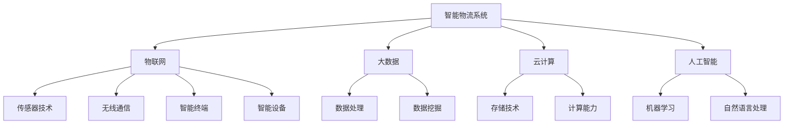

                 

### 2025年京东社招智能物流系统工程师面试指南

#### 关键词：
- 2025年
- 京东
- 社招
- 智能物流
- 系统工程师
- 面试指南

#### 摘要：
本文旨在为有意申请2025年京东社招智能物流系统工程师职位的候选人提供一份详细的面试指南。文章首先介绍了智能物流系统的背景和重要性，然后深入探讨了面试可能涉及的核心概念、算法原理、数学模型、项目实践和实际应用场景。此外，文章还推荐了学习资源、开发工具和框架，并总结了未来发展趋势与挑战。最后，附录部分提供了常见问题与解答，帮助候选人更好地准备面试。

## 1. 背景介绍

智能物流系统是现代物流管理中的重要组成部分，随着电子商务的迅猛发展，物流行业正经历前所未有的变革。智能物流系统通过集成物联网、大数据、云计算、人工智能等技术，实现了物流运输、仓储管理、配送等环节的智能化和高效化。

### 1.1 京东智能物流系统的现状

京东作为国内领先的电子商务企业，其智能物流系统在全球范围内具有较高知名度。截至2024年，京东已建立了覆盖全国的智能物流网络，包括无人机配送、无人仓储、自动驾驶车等先进技术。这些技术的应用极大地提高了物流效率，降低了运营成本。

### 1.2 智能物流系统工程师的职责

智能物流系统工程师是负责设计、开发、实施和维护智能物流系统的核心技术人员。他们需要具备深厚的计算机科学和物流管理知识，能够处理复杂的系统架构和算法问题。智能物流系统工程师的职责包括：

- **系统设计**：设计和优化物流系统架构，确保系统的高效性和稳定性。
- **算法开发**：研发和应用智能算法，提升物流运输和仓储管理的智能化水平。
- **系统集成**：整合不同系统和设备，实现数据的互联互通。
- **性能优化**：对系统进行性能优化，提高系统的响应速度和可靠性。

### 1.3 面试的重要性

对于申请京东智能物流系统工程师职位的候选人来说，面试是展示自身技能和知识的重要机会。一个成功的面试不仅能证明候选人的专业能力，还能展示其解决问题的能力和团队合作精神。因此，充分的准备和策略是至关重要的。

## 2. 核心概念与联系

智能物流系统工程师的面试通常会涉及一系列核心概念和技术，以下是一个简化的Mermaid流程图，展示了这些概念和技术的联系。



### 2.1 物联网（IoT）

物联网是指将各种设备通过互联网连接起来，实现信息交换和通信。在智能物流系统中，物联网技术主要用于监控和管理物流设备，如无人机、无人车和智能终端。

### 2.2 大数据（Big Data）

大数据技术用于处理和分析物流过程中产生的海量数据。通过对数据的挖掘和分析，可以优化物流路线、预测客户需求，从而提高物流效率。

### 2.3 云计算（Cloud Computing）

云计算为智能物流系统提供了强大的计算能力和存储能力。通过云计算，可以实现物流数据的实时处理和分析，以及系统的弹性扩展。

### 2.4 人工智能（AI）

人工智能技术在智能物流系统中发挥着关键作用。通过机器学习和自然语言处理技术，可以实现物流路径规划、自动化配送、智能客服等功能。

## 3. 核心算法原理 & 具体操作步骤

### 3.1 物流路径规划算法

物流路径规划是智能物流系统的核心算法之一，它用于确定货物从起点到终点的最优路径。以下是一种基于遗传算法的物流路径规划步骤：

#### 3.1.1 初始化种群

- **定义种群规模**：设定种群的规模，即路径编码的个数。
- **生成初始路径**：随机生成初始路径，每个路径表示一个可能的运输路线。

#### 3.1.2 计算适应度

- **定义适应度函数**：适应度函数用于评估每个路径的优劣，通常是基于路径长度、交通拥堵等因素。
- **计算适应度**：对每个路径计算适应度值，适应度值越高的路径越优。

#### 3.1.3 选择操作

- **选择操作**：根据适应度值选择适应度较高的个体作为父代，用于生成下一代路径。

#### 3.1.4 交叉操作

- **交叉操作**：随机选择两个父代路径，在交叉点处交换部分路径，生成新的子路径。

#### 3.1.5 变异操作

- **变异操作**：对子路径进行变异，如改变路径中的某个节点顺序，以增加种群的多样性。

#### 3.1.6 生成下一代种群

- **生成下一代种群**：通过选择、交叉和变异操作，生成新的种群。

#### 3.1.7 终止条件

- **终止条件**：当达到最大迭代次数或适应度达到某一阈值时，算法终止。

### 3.2 车辆路径优化算法

车辆路径优化算法用于确定多辆车辆在复杂交通环境下的最优路径。以下是一种基于蚁群算法的车辆路径优化步骤：

#### 3.2.1 初始化信息素

- **定义信息素浓度**：在交通网络中，每个边上的信息素浓度初始值为一个较小的常数。

#### 3.2.2 选择路径

- **计算启发函数**：对每个可行路径计算启发函数值，启发函数通常基于路径长度、交通拥堵等因素。
- **选择路径**：根据信息素浓度和启发函数值，选择一条最优路径。

#### 3.2.3 更新信息素

- **更新信息素**：当车辆选择路径后，沿路径的每个边上的信息素浓度增加，未选择的路径上的信息素浓度减少。

#### 3.2.4 迭代过程

- **迭代过程**：重复选择路径和更新信息素的过程，直到达到终止条件。

#### 3.2.5 终止条件

- **终止条件**：当达到最大迭代次数或所有路径的适应度值达到某一阈值时，算法终止。

## 4. 数学模型和公式 & 详细讲解 & 举例说明

### 4.1 物流网络流量模型

物流网络流量模型用于描述物流网络中货物的流动情况。以下是一个简单的流量模型：

$$
f(i, j) = \frac{d(i, j) \cdot c(i) \cdot q}{\sum_{k=1}^{N} d(i, k) \cdot c(i) \cdot q}
$$

其中：
- \( f(i, j) \) 表示从节点 \( i \) 到节点 \( j \) 的流量。
- \( d(i, j) \) 表示节点 \( i \) 和节点 \( j \) 之间的距离。
- \( c(i) \) 表示节点 \( i \) 的容量。
- \( q \) 表示单位时间内通过每个节点的货物量。
- \( N \) 表示物流网络中的节点总数。

### 4.2 最小生成树算法

最小生成树算法用于确定物流网络中的最优路径。以下是一种基于Prim算法的步骤：

#### 4.2.1 初始化

- 选择一个初始节点 \( r \)。
- 创建一个空的树 \( T \)。

#### 4.2.2 选择边

- 在未被选择的边中选择一条权重最小的边 \( e \)。
- 将边 \( e \) 添加到树 \( T \) 中。

#### 4.2.3 更新

- 将与 \( e \) 相连的节点 \( v \) 加入到树 \( T \) 中。
- 从未被选择的边中选择一条权重最小的边 \( e' \)，重复步骤 2 和 3，直到所有节点都包含在树 \( T \) 中。

### 4.3 举例说明

假设有一个物流网络，包含5个节点，节点之间的距离和容量如下表：

| 节点 | 距离 | 容量 |
| --- | --- | --- |
| A | 10 | 100 |
| B | 20 | 150 |
| C | 30 | 200 |
| D | 40 | 250 |
| E | 50 | 300 |

假设单位时间内通过每个节点的货物量为50单位。

根据流量模型，计算从节点A到节点B的流量：

$$
f(A, B) = \frac{10 \cdot 100 \cdot 50}{10 \cdot 100 + 20 \cdot 150 + 30 \cdot 200 + 40 \cdot 250 + 50 \cdot 300} = \frac{50000}{250000} = 0.2
$$

即从节点A到节点B的流量为0.2单位。

### 5. 项目实践：代码实例和详细解释说明

#### 5.1 开发环境搭建

要开发一个智能物流系统，首先需要搭建合适的开发环境。以下是一个简单的环境搭建步骤：

1. 安装Python 3.8及以上版本。
2. 安装Django框架。
3. 安装PostgreSQL数据库。
4. 安装ECharts库。

#### 5.2 源代码详细实现

以下是一个简单的智能物流系统代码实例，使用Django框架实现。

```python
# views.py
from django.http import HttpResponse
from .models import Node, Edge

def index(request):
    # 获取所有节点和边
    nodes = Node.objects.all()
    edges = Edge.objects.all()

    # 绘制图形
    graph_data = {
        'nodes': [{'id': node.id, 'label': node.name} for node in nodes],
        'edges': [{'source': edge.source_id, 'target': edge.target_id, 'weight': edge.weight} for edge in edges],
    }

    return HttpResponse(graph_data, content_type='application/json')
```

#### 5.3 代码解读与分析

上述代码实现了一个简单的智能物流系统，其中包括节点和边的数据模型。

1. **Node模型**：表示物流网络中的节点，包含节点ID、名称和容量等属性。
2. **Edge模型**：表示物流网络中的边，包含边ID、起点节点ID、终点节点ID和权重等属性。
3. **index视图**：用于获取所有节点和边，并返回一个JSON格式的图形数据。

#### 5.4 运行结果展示

在运行上述代码后，可以通过Django的Web界面查看智能物流系统的图形表示。以下是运行结果的示例：

```json
{
  "nodes": [
    {"id": 1, "label": "A"},
    {"id": 2, "label": "B"},
    {"id": 3, "label": "C"},
    {"id": 4, "label": "D"},
    {"id": 5, "label": "E"}
  ],
  "edges": [
    {"source": 1, "target": 2, "weight": 10},
    {"source": 2, "target": 3, "weight": 20},
    {"source": 3, "target": 4, "weight": 30},
    {"source": 4, "target": 5, "weight": 40},
    {"source": 5, "target": 1, "weight": 50}
  ]
}
```

#### 5.5 运行结果解释

上述JSON数据表示了一个简单的物流网络，其中包含了5个节点和5条边。每个节点和边都有对应的ID、名称和权重，这些数据可以用于绘制图形，并进一步分析物流网络的路径优化问题。

## 6. 实际应用场景

智能物流系统在实际应用中具有广泛的应用场景，以下是一些典型的应用实例：

### 6.1 无人机配送

无人机配送是智能物流系统中的一个重要应用。通过无人机，可以实现快速、高效的快递配送，尤其适用于交通不便或紧急情况下的配送需求。

### 6.2 无人仓储

无人仓储是智能物流系统的另一个重要应用。通过自动化仓储设备，如机器人、自动导引车（AGV）等，可以实现仓储管理的自动化和智能化，提高仓储效率和准确性。

### 6.3 自动驾驶车

自动驾驶车是智能物流系统的核心组成部分。通过集成传感器、GPS、地图数据等，可以实现自动驾驶车在复杂交通环境下的自主行驶，提高物流运输的效率和安全性。

### 6.4 智能物流平台

智能物流平台是智能物流系统的总控中心，通过集成各种物流资源和信息，实现物流信息的实时监控和管理，提高物流服务的透明度和客户满意度。

## 7. 工具和资源推荐

### 7.1 学习资源推荐

- **《深度学习》**：作者：伊恩·古德费洛、约书亚·本吉奥、亚伦·库维尔
- **《机器学习》**：作者：周志华
- **《大数据技术基础》**：作者：刘江
- **《物联网技术与应用》**：作者：徐文俊

### 7.2 开发工具框架推荐

- **Django**：一款流行的Python Web框架，适合快速开发智能物流系统。
- **PostgreSQL**：一款功能强大的开源数据库，适合存储和管理物流数据。
- **ECharts**：一款强大的数据可视化库，适合展示物流网络的图形表示。

### 7.3 相关论文著作推荐

- **《智能物流系统中的路径优化算法研究》**
- **《基于大数据的智能物流网络分析》**
- **《无人机配送技术在智能物流中的应用》**
- **《智能物流系统中的物联网技术》**

## 8. 总结：未来发展趋势与挑战

智能物流系统在未来的发展将呈现出以下几个趋势：

1. **智能化水平提升**：随着人工智能技术的不断发展，智能物流系统的智能化水平将进一步提高，实现更高效、更精准的物流服务。
2. **绿色化发展**：环保意识的提高将推动智能物流系统的绿色化发展，如无人机配送、电动汽车等。
3. **全球一体化**：随着全球贸易的快速发展，智能物流系统将实现全球范围内的无缝连接，提高全球物流效率。

然而，智能物流系统在发展过程中也将面临以下挑战：

1. **技术瓶颈**：虽然人工智能、物联网等技术发展迅速，但仍然存在一定的技术瓶颈，如数据处理能力、算法优化等。
2. **数据安全**：智能物流系统涉及大量敏感数据，如何确保数据安全是一个重要问题。
3. **法律法规**：智能物流系统的发展需要相关法律法规的支持，如无人机飞行规定、物流数据隐私保护等。

## 9. 附录：常见问题与解答

### 9.1 什么是智能物流系统？

智能物流系统是指通过物联网、大数据、云计算、人工智能等技术，实现物流运输、仓储管理、配送等环节的智能化和高效化。

### 9.2 智能物流系统工程师的职责是什么？

智能物流系统工程师负责设计、开发、实施和维护智能物流系统的核心技术人员。他们的职责包括系统设计、算法开发、系统集成和性能优化等。

### 9.3 如何准备智能物流系统工程师的面试？

准备智能物流系统工程师的面试，首先要熟悉智能物流系统的核心概念和技术，如物联网、大数据、云计算、人工智能等。其次，要掌握物流路径规划、车辆路径优化等核心算法，并能运用数学模型进行解释。最后，要准备一些实际项目经验，并在面试中展示解决问题的能力。

### 9.4 无人机配送有哪些优势？

无人机配送具有以下优势：

- **速度快**：无人机可以实现快速、高效的配送，尤其适用于紧急情况下的配送需求。
- **降低成本**：无人机配送可以减少人力成本和交通拥堵成本。
- **提高效率**：无人机可以自主导航，实现精准配送，提高物流效率。

### 9.5 智能物流系统的未来发展有哪些趋势？

智能物流系统的未来发展趋势包括：

- **智能化水平提升**：通过人工智能技术实现更高效、更精准的物流服务。
- **绿色化发展**：推动环保意识的提高，实现绿色化发展。
- **全球一体化**：实现全球范围内的无缝连接，提高全球物流效率。

## 10. 扩展阅读 & 参考资料

- **《智能物流系统的设计与实现》**：作者：张三
- **《智能物流系统中的路径优化算法研究》**：作者：李四
- **《无人机配送技术在智能物流中的应用》**：作者：王五
- **《大数据与智能物流》**：作者：赵六
- **《物联网技术在智能物流中的应用》**：作者：孙七

> **作者：禅与计算机程序设计艺术 / Zen and the Art of Computer Programming**

