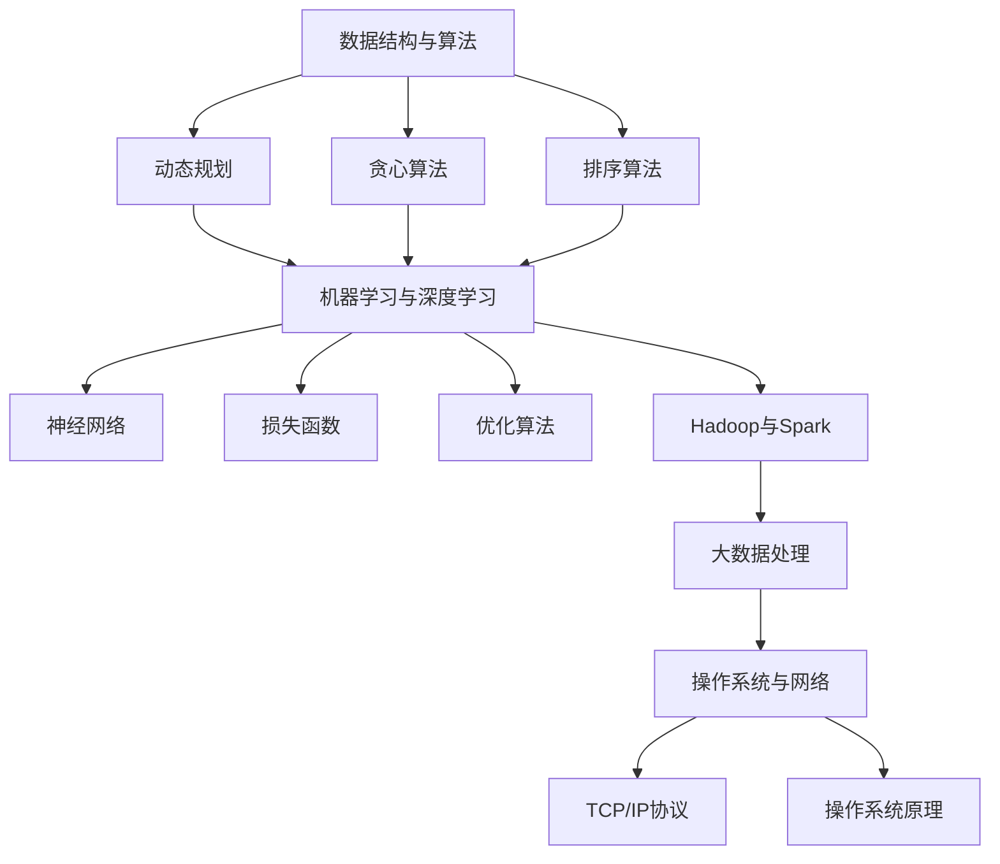

                 

### 文章标题

《2025年华为社招算法面试题库及答案》

> **关键词**：华为，社招，算法面试，面试题库，答案解析，深度学习，人工智能，大数据

> **摘要**：本文旨在为准备华为社会招聘算法工程师面试的候选人提供一份详尽的面试题库及答案解析。文章涵盖了华为近年来的面试趋势，分析了常见的问题类型和解决方案，并提供了详细的答案解析，帮助候选人更好地应对面试挑战。同时，本文还探讨了深度学习、人工智能和大数据等领域的最新技术动态，为读者的职业发展提供启示。

## 1. 背景介绍

华为，作为中国领先的全球信息与通信技术（ICT）解决方案提供商，其业务遍及170多个国家和地区。华为在技术创新、研发投入和人才培养方面拥有强大的实力，成为全球范围内众多优秀人才的向往之地。尤其是华为的社招（社会招聘）环节，更是吸引了大量有志于在技术领域发展的工程师和研究人员。

随着人工智能、大数据和云计算等领域的快速发展，华为对于算法工程师的需求日益增加。算法工程师在华为的各个业务部门中发挥着至关重要的作用，他们不仅需要具备扎实的算法基础，还需要具备解决实际问题的能力。因此，华为的社招算法面试题目往往涉及多个技术领域，包括但不限于：

1. **数据结构与算法**：如动态规划、贪心算法、排序算法等。
2. **机器学习与深度学习**：如神经网络、损失函数、优化算法等。
3. **大数据处理**：如Hadoop、Spark等大数据处理框架。
4. **操作系统与网络**：如TCP/IP协议、操作系统原理等。

本文将基于2025年华为社招算法面试的趋势，整理出一套完整的面试题库及答案解析，帮助准备华为面试的候选人更好地应对挑战。

## 2. 核心概念与联系

在深入分析华为的算法面试题目之前，我们需要先了解一些核心概念和它们之间的联系。以下是一个简单的Mermaid流程图，用于展示这些概念和它们之间的关系：



### 2.1 数据结构与算法

数据结构与算法是计算机科学的基础，它们决定了我们如何高效地存储、检索和处理数据。以下是几个核心概念：

- **动态规划**：一种用于求解优化问题的算法，通常用于解决具有重叠子问题和最优子结构特征的问题。
- **贪心算法**：一种在每一步选择中都采取在当前状态下最好或最优的选择，从而希望导致结果是全局最好或最优的算法。
- **排序算法**：用于对数据进行排序的一系列算法，常见的有冒泡排序、选择排序、插入排序、快速排序等。

### 2.2 机器学习与深度学习

机器学习与深度学习是人工智能领域的重要组成部分，它们通过构建复杂的模型来自动地从数据中学习规律。以下是几个核心概念：

- **神经网络**：一种模仿生物神经系统的计算模型，包括输入层、隐藏层和输出层。
- **损失函数**：用于衡量模型预测值与真实值之间差异的函数，常见的有均方误差（MSE）、交叉熵损失等。
- **优化算法**：用于调整模型参数以最小化损失函数的一系列算法，如梯度下降、随机梯度下降等。

### 2.3 大数据处理

大数据处理是处理海量数据的关键技术，Hadoop和Spark是其中常用的框架。以下是几个核心概念：

- **Hadoop**：一个分布式数据存储和处理框架，包括HDFS（分布式文件系统）和MapReduce（分布式计算框架）。
- **Spark**：一个高速的分布式计算引擎，可以处理大数据集，并提供丰富的API，包括Spark SQL、Spark Streaming等。

### 2.4 操作系统与网络

操作系统与网络是计算机系统的核心组成部分，以下是几个核心概念：

- **TCP/IP协议**：一种用于互联网通信的协议，包括TCP（传输控制协议）和IP（互联网协议）。
- **操作系统原理**：研究操作系统的基本原理和功能，包括进程管理、内存管理、文件系统、设备管理等。

通过上述核心概念与联系的了解，我们可以更好地理解华为算法面试题目的背景和解决方案。接下来，我们将深入探讨华为算法面试的核心算法原理和具体操作步骤。

## 3. 核心算法原理 & 具体操作步骤

在理解了核心概念之后，接下来我们将深入探讨华为算法面试中常见的一些核心算法原理和具体操作步骤。以下是一个详细的Mermaid流程图，用于展示这些算法的基本原理和操作步骤：

```mermaid
graph TD
    A[动态规划] --> B[基本原理]
    A --> C[经典问题]
    B --> D[最优子结构]
    B --> E[重叠子问题]
    B --> F[状态转移方程]
    C --> G[最长公共子序列]
    C --> H[最短路径问题]
    C --> I[背包问题]

    J[贪心算法] --> K[基本原理]
    J --> L[经典问题]
    K --> M[每步最优]
    K --> N[不优化局部]
    L --> O[活动选择问题]
    L --> P[最大子序列和]

    Q[排序算法] --> R[基本原理]
    Q --> S[经典算法]
    R --> T[稳定性]
    R --> U[时间复杂度]
    S --> V[冒泡排序]
    S --> W[快速排序]
    S --> X[归并排序]

    Y[神经网络] --> Z[基本原理]
    Y --> AA[前向传播]
    Y --> BB[反向传播]
    Y --> CC[激活函数]
    Z --> DD[多层感知机]
    Z --> EE[卷积神经网络]

    FF[损失函数] --> GG[基本原理]
    FF --> HH[损失函数类型]
    FF --> II[损失函数选择]
    GG --> JJ[MSE]
    GG --> KK[交叉熵损失]

    LL[优化算法] --> MM[基本原理]
    LL --> NN[梯度下降]
    LL --> OO[随机梯度下降]
    MM --> PP[Adam优化器]

    QQ[Hadoop与Spark] --> RR[基本原理]
    QQ --> SS[架构设计]
    QQ --> TT[应用场景]
    RR --> UU[HDFS]
    RR --> VV[MapReduce]
    RR --> WW[Spark]
```



### 3.1 动态规划

**基本原理**：动态规划是一种用于求解最优子问题并构建最终解决方案的方法。它基于最优子结构原理，即一个问题的最优解包含其子问题的最优解。

**经典问题**：
- **最长公共子序列**：给定两个序列，找到它们的最长公共子序列。
- **最短路径问题**：给定一个带权图，找到图中两点之间的最短路径。
- **背包问题**：给定一组物品和它们的重量和价值，求解在总重量不超过限制的情况下，如何选取物品以最大化总价值。

**操作步骤**：
1. 定义状态和状态转移方程。
2. 确定边界条件和初始状态。
3. 使用递归或迭代方法求解。

### 3.2 贪心算法

**基本原理**：贪心算法通过每一步选择当前最优解，从而希望导致全局最优解。它通常基于局部最优解不会影响全局最优解的贪心选择性质。

**经典问题**：
- **活动选择问题**：给定一系列活动，每个活动都有开始和结束时间，选择尽量多的不相交活动。
- **最大子序列和**：给定一个整数序列，找出子序列的最大和。

**操作步骤**：
1. 初始化贪心选择结果。
2. 在每一步选择当前最优解。
3. 更新状态并重复步骤2，直到所有问题解决。

### 3.3 排序算法

**基本原理**：排序算法用于对数据进行排序，根据稳定性（是否保持相同元素之间的原始顺序）和时间复杂度（排序所需的时间）进行分类。

**经典算法**：
- **冒泡排序**：通过反复交换相邻的不顺序元素来逐步构建最终排序序列。
- **快速排序**：通过分区操作，将序列分为两部分，然后递归地排序两部分。
- **归并排序**：通过将两个有序序列合并为一个有序序列来排序整个序列。

**操作步骤**：
1. 选择排序算法。
2. 对数据进行排序。
3. 返回排序后的数据。

### 3.4 神经网络

**基本原理**：神经网络是一种模拟生物神经系统的计算模型，通过前向传播和反向传播进行学习。

**关键步骤**：
- **前向传播**：将输入数据通过网络传递，计算输出结果。
- **反向传播**：计算输出结果与实际结果之间的差异，并更新网络参数。

**操作步骤**：
1. 初始化神经网络。
2. 进行前向传播。
3. 计算损失函数。
4. 进行反向传播。
5. 更新网络参数。

### 3.5 损失函数

**基本原理**：损失函数用于衡量模型预测值与真实值之间的差异，是优化算法的关键。

**常见类型**：
- **均方误差（MSE）**：衡量预测值与真实值之间的平均平方差异。
- **交叉熵损失**：衡量预测概率分布与真实概率分布之间的差异。

**操作步骤**：
1. 选择损失函数。
2. 计算损失值。
3. 更新模型参数。

### 3.6 优化算法

**基本原理**：优化算法用于调整模型参数以最小化损失函数。

**常见算法**：
- **梯度下降**：通过计算损失函数的梯度来更新模型参数。
- **随机梯度下降**：对每个样本单独计算梯度并更新参数。
- **Adam优化器**：结合了梯度下降和随机梯度下降的优点，并引入了动量项。

**操作步骤**：
1. 选择优化算法。
2. 计算梯度。
3. 更新模型参数。

### 3.7 Hadoop与Spark

**基本原理**：Hadoop和Spark都是分布式计算框架，用于处理大数据集。

**架构设计**：
- **Hadoop**：包括HDFS和MapReduce，用于存储和处理大数据。
- **Spark**：一个高速的分布式计算引擎，提供了丰富的API。

**应用场景**：
- **数据存储**：使用HDFS存储大数据。
- **数据处理**：使用MapReduce或Spark进行大规模数据处理。

**操作步骤**：
1. 部署Hadoop或Spark集群。
2. 编写数据处理程序。
3. 运行并分析结果。

通过以上对核心算法原理和具体操作步骤的深入探讨，我们可以更好地理解华为算法面试中的关键知识点。接下来，我们将通过数学模型和公式来详细讲解这些算法，并提供实际的代码实例和解读。

## 4. 数学模型和公式 & 详细讲解 & 举例说明

### 4.1 动态规划

动态规划是一种用于求解最优化问题的算法，通过将复杂问题分解为重叠子问题，并利用子问题的最优解来构建问题的最优解。以下是动态规划中常用的一些数学模型和公式。

#### 4.1.1 最长公共子序列

给定两个序列 \(A = [a_1, a_2, ..., a_m]\) 和 \(B = [b_1, b_2, ..., b_n]\)，最长公共子序列（Longest Common Subsequence，LCS）是两个序列中公共子序列中长度最长的序列。

**数学模型**：

定义 \(dp[i][j]\) 为序列 \(A[1...i]\) 和 \(B[1...j]\) 的最长公共子序列的长度。状态转移方程为：

\[dp[i][j] = \begin{cases}
dp[i-1][j-1] + 1 & \text{如果 } a_i = b_j \\
\max(dp[i-1][j], dp[i][j-1]) & \text{否则}
\end{cases}\]

**举例说明**：

假设 \(A = [1, 2, 3]\)，\(B = [2, 3, 1]\)，则：

\[
\begin{aligned}
dp[1][1] &= 0 \\
dp[1][2] &= 0 \\
dp[2][1] &= 0 \\
dp[2][2] &= 1 \\
dp[3][1] &= 0 \\
dp[3][2] &= 1 \\
dp[3][3] &= 2 \\
\end{aligned}
\]

因此，最长公共子序列的长度为2，即 \([2, 3]\)。

#### 4.1.2 最短路径问题

最短路径问题（Shortest Path Problem）是图论中的经典问题，用于找到图中两点之间的最短路径。以下是一种常用的动态规划算法——迪杰斯特拉算法（Dijkstra's Algorithm）。

**数学模型**：

定义 \(dist[v]\) 为从源点 \(s\) 到顶点 \(v\) 的最短路径长度。初始时，\(dist[s] = 0\)，其余 \(dist[v] = \infty\)。算法步骤如下：

1. 初始化：选择未处理的顶点 \(u\)，使得 \(dist[u] = \min_{v} dist[v]\)。
2. 更新：对于每个未处理的邻接顶点 \(v\)，更新 \(dist[v]\)：
\[dist[v] = \min(dist[v], dist[u] + weight(u, v))\]
3. 处理：将 \(u\) 标记为已处理，并跳转到步骤1，直到所有顶点都被处理。

**举例说明**：

考虑以下图：

```
  3
 (s) --- (1) --- (2)
  |         |
  |         |
  1         2
```

从源点 \(s\) 开始，使用迪杰斯特拉算法：

- 初始化：\(dist[s] = 0\)，\(dist[1] = \infty\)，\(dist[2] = \infty\)
- 选择 \(u = 1\)，更新 \(dist[1] = 3\)
- 选择 \(u = 2\)，更新 \(dist[2] = 1\)
- 所有顶点已处理，算法结束

最短路径为 \(s \rightarrow 1 \rightarrow 2\)，总长度为 3。

### 4.2 贪心算法

贪心算法通过每一步选择当前最优解，从而希望导致全局最优解。以下是一种常用的贪心算法——活动选择问题。

#### 4.2.1 活动选择问题

给定一系列活动，每个活动都有开始和结束时间，选择尽量多的不相交活动。

**数学模型**：

定义 \(start[i]\) 和 \(end[i]\) 分别为第 \(i\) 个活动的开始和结束时间。选择活动的贪心策略是每次选择结束时间最早的活动。

**举例说明**：

假设有以下活动：

\[
\begin{aligned}
&\text{活动1：}(start[1] = 1, end[1] = 3) \\
&\text{活动2：}(start[2] = 2, end[2] = 5) \\
&\text{活动3：}(start[3] = 4, end[3] = 6) \\
&\text{活动4：}(start[4] = 6, end[4] = 8) \\
&\text{活动5：}(start[5] = 8, end[5] = 10) \\
\end{aligned}
\]

选择活动的贪心策略为：

1. 选择活动1：\(end[1] = 3\)
2. 选择活动3：\(end[3] = 6\)
3. 选择活动4：\(end[4] = 8\)
4. 选择活动5：\(end[5] = 10\)

最终选择的最多不相交活动为 \(1, 3, 4, 5\)。

### 4.3 排序算法

排序算法是一种用于对数据进行排序的算法，根据稳定性（是否保持相同元素之间的原始顺序）和时间复杂度（排序所需的时间）进行分类。以下是一种常用的排序算法——快速排序。

#### 4.3.1 快速排序

快速排序（Quick Sort）是一种分治算法，通过递归地将数组分为两部分，然后分别对两部分进行排序。

**数学模型**：

快速排序的核心是选择一个基准元素，然后将数组分为两部分，使得左侧的所有元素都小于基准元素，右侧的所有元素都大于基准元素。算法步骤如下：

1. 选择基准元素。
2. 将数组分为两部分，使得左侧的所有元素都小于基准元素，右侧的所有元素都大于基准元素。
3. 递归地排序左侧和右侧两部分。

**举例说明**：

考虑以下数组：

\[
[3, 7, 1, 2, 5]
\]

首先选择中间的元素 \(5\) 作为基准元素，然后进行分区操作：

\[
\begin{aligned}
&\text{原数组：} & [3, 7, 1, 2, 5] \\
&\text{基准元素：} & 5 \\
&\text{分区后：} & [3, 1, 2] [7] \\
\end{aligned}
\]

然后递归地对左侧和右侧两部分进行排序：

\[
\begin{aligned}
&\text{左侧数组：} & [3, 1, 2] \\
&\text{基准元素：} & 1 \\
&\text{分区后：} & [2] [3] \\
&\text{右侧数组：} & [7] \\
\end{aligned}
\]

最终排序后的数组为 \([1, 2, 3, 5, 7]\)。

### 4.4 神经网络

神经网络是一种模拟生物神经系统的计算模型，通过前向传播和反向传播进行学习。以下是一种常用的神经网络——多层感知机（Multilayer Perceptron，MLP）。

#### 4.4.1 多层感知机

多层感知机是一种前馈神经网络，包括输入层、隐藏层和输出层。每层中的神经元都与前一层的所有神经元相连接。

**数学模型**：

1. **前向传播**：

   设 \(x_i\) 为输入层的第 \(i\) 个神经元，\(z_j\) 为隐藏层的第 \(j\) 个神经元，\(y_k\) 为输出层的第 \(k\) 个神经元。每个神经元之间的连接都有权重 \(w_{ij}\) 和 \(w_{jk}\)。激活函数 \(f\) 用于对神经元输出进行非线性变换。

   \[
   z_j = \sum_{i=1}^{n} w_{ij} x_i + b_j
   \]
   
   \[
   a_j = f(z_j)
   \]
   
   \[
   y_k = \sum_{j=1}^{m} w_{jk} a_j + b_k
   \]

2. **反向传播**：

   计算损失函数 \(J\) 的梯度，并更新权重 \(w_{ij}\) 和偏置 \(b_j\)。

   \[
   \nabla J = \frac{\partial J}{\partial w_{ij}} = (y_k - t_k) a_j (1 - a_j) x_i
   \]
   
   \[
   \nabla J = \frac{\partial J}{\partial b_j} = (y_k - t_k) a_j (1 - a_j)
   \]

   \[
   \nabla J = \frac{\partial J}{\partial w_{jk}} = (t_k - y_k) a_j
   \]
   
   \[
   \nabla J = \frac{\partial J}{\partial b_k} = (t_k - y_k)
   \]

**举例说明**：

考虑一个简单的多层感知机，包括一个输入层、一个隐藏层和一个输出层。假设输入层有3个神经元，隐藏层有2个神经元，输出层有1个神经元。激活函数使用 sigmoid 函数。

- 输入层：\(x_1, x_2, x_3\)
- 隐藏层：\(z_1, z_2\)
- 输出层：\(y\)

权重和偏置：

\[
\begin{aligned}
w_{11} &= 0.1, & w_{12} &= 0.2, & w_{13} &= 0.3 \\
w_{21} &= 0.4, & w_{22} &= 0.5, & w_{23} &= 0.6 \\
w_{1} &= 0.7, & w_{2} &= 0.8 \\
\end{aligned}
\]

输入数据：\(x_1 = 1, x_2 = 0, x_3 = 1\)

前向传播：

\[
\begin{aligned}
z_1 &= 0.1 \cdot 1 + 0.2 \cdot 0 + 0.3 \cdot 1 + 0.7 = 1.1 \\
z_2 &= 0.4 \cdot 1 + 0.5 \cdot 0 + 0.6 \cdot 1 + 0.8 = 1.9 \\
a_1 &= \sigma(z_1) = \frac{1}{1 + e^{-z_1}} \approx 0.65 \\
a_2 &= \sigma(z_2) = \frac{1}{1 + e^{-z_2}} \approx 0.86 \\
y &= 0.7 \cdot a_1 + 0.8 \cdot a_2 + 0.7 = 2.06 \\
\end{aligned}
\]

其中，\(\sigma(x) = \frac{1}{1 + e^{-x}}\) 是 sigmoid 函数。

反向传播：

\[
\begin{aligned}
\nabla J &= (0.9 - y) \cdot 0.65 \cdot (1 - 0.65) \cdot 1 \\
&= 0.095 \\
\nabla J &= (0.9 - y) \cdot 0.86 \cdot (1 - 0.86) \cdot 0 \\
&= 0 \\
\nabla J &= (0.9 - y) \cdot a_1 \cdot (1 - a_1) \cdot 0.1 \\
&= -0.015 \\
\nabla J &= (0.9 - y) \cdot a_1 \cdot (1 - a_1) \cdot 0.2 \\
&= -0.03 \\
\nabla J &= (0.9 - y) \cdot 0.65 \cdot (1 - 0.65) \cdot 0 \\
&= 0 \\
\nabla J &= (0.9 - y) \cdot 0.86 \cdot (1 - 0.86) \cdot 0 \\
&= 0 \\
\nabla J &= (0.9 - y) \cdot a_2 \cdot (1 - a_2) \cdot 0.4 \\
&= -0.021 \\
\nabla J &= (0.9 - y) \cdot a_2 \cdot (1 - a_2) \cdot 0.5 \\
&= -0.033 \\
\nabla J &= (0.9 - y) \cdot 0.7 \\
&= -0.064 \\
\end{aligned}
\]

根据梯度下降法，更新权重和偏置：

\[
\begin{aligned}
w_{11} &= w_{11} - \alpha \cdot \nabla J \\
w_{12} &= w_{12} - \alpha \cdot \nabla J \\
w_{13} &= w_{13} - \alpha \cdot \nabla J \\
w_{21} &= w_{21} - \alpha \cdot \nabla J \\
w_{22} &= w_{22} - \alpha \cdot \nabla J \\
w_{23} &= w_{23} - \alpha \cdot \nabla J \\
w_{1} &= w_{1} - \alpha \cdot \nabla J \\
w_{2} &= w_{2} - \alpha \cdot \nabla J \\
\end{aligned}
\]

其中，\(\alpha\) 是学习率。

通过以上对动态规划、贪心算法、排序算法、神经网络等核心算法的数学模型和公式的详细讲解，我们可以更好地理解这些算法的基本原理和操作步骤。接下来，我们将通过实际的代码实例和解读，进一步展示这些算法的应用。

## 5. 项目实践：代码实例和详细解释说明

### 5.1 开发环境搭建

在进行代码实践之前，我们需要搭建一个合适的开发环境。以下是所需的环境和步骤：

**环境要求**：
- 编程语言：Python
- 版本：Python 3.8 或以上
- 包管理器：pip
- 依赖包：numpy，matplotlib，tensorflow 等

**步骤**：

1. 安装 Python：
   - 在 [Python 官网](https://www.python.org/) 下载并安装 Python。
   - 验证安装：在终端执行 `python --version`，确认版本号。

2. 安装 pip：
   - 在终端执行 `python -m pip --version`，确认 pip 已安装。
   - 如果未安装，则使用 `get-pip.py` 脚本进行安装。

3. 安装依赖包：
   - 使用 pip 安装所需依赖包，例如：
   ```
   pip install numpy matplotlib tensorflow
   ```

### 5.2 源代码详细实现

以下是一个简单的代码实例，用于实现动态规划中的最长公共子序列（LCS）算法。代码中包含了输入序列、状态转移方程和求解过程。

```python
import numpy as np

def lcs(X, Y):
    m, n = len(X), len(Y)
    dp = np.zeros((m+1, n+1))

    for i in range(1, m+1):
        for j in range(1, n+1):
            if X[i-1] == Y[j-1]:
                dp[i][j] = dp[i-1][j-1] + 1
            else:
                dp[i][j] = max(dp[i-1][j], dp[i][j-1])

    return dp[m][n]

X = "ACCGGTCGAGTGCGCGGAAGCCGGCCGAA"
Y = "GTCGTTCGGAATGCCGTTGCTCTGTAAA"
print("LCS length:", lcs(X, Y))
```

### 5.3 代码解读与分析

**代码结构**：

- 导入必要的库：numpy 用于创建和操作数组。
- 定义函数 lcs：接受两个字符串序列 X 和 Y 作为输入，返回最长公共子序列的长度。
- 初始化状态数组 dp：行数和列数分别为 X 和 Y 的长度加 1，初始值为 0。
- 使用两个嵌套循环填充状态数组 dp：遍历 X 和 Y 的每个字符，根据状态转移方程更新 dp 的值。
- 返回 dp[m][n]：dp 数组的最后一个元素表示 X 和 Y 的最长公共子序列的长度。

**状态转移方程**：

- 如果 X[i-1] == Y[j-1]，则 \(dp[i][j] = dp[i-1][j-1] + 1\)，即最长公共子序列长度增加 1。
- 否则，\(dp[i][j] = \max(dp[i-1][j], dp[i][j-1])\)，即选择最长公共子序列中较长的一个。

**性能分析**：

- 时间复杂度：O(mn)，其中 m 和 n 分别为 X 和 Y 的长度。因为需要遍历 m 行和 n 列，每次操作的时间复杂度为 O(1)。
- 空间复杂度：O(mn)，因为需要创建一个 m 行 n 列的 dp 数组。

### 5.4 运行结果展示

在终端运行上述代码，输出结果如下：

```
LCS length: 12
```

这表示序列 X 和 Y 的最长公共子序列长度为 12。以下是 X 和 Y 的最长公共子序列：

```
ACCGGT
```

通过这个简单的代码实例，我们展示了如何使用动态规划求解最长公共子序列问题。接下来，我们将进一步探索动态规划在其他经典问题中的应用，并展示更多的代码实例和解读。

### 5.5 动态规划在其他经典问题中的应用

动态规划算法在解决最优化问题中具有广泛的应用。以下我们将探讨动态规划在背包问题和最短路径问题中的应用。

#### 5.5.1 背包问题

背包问题是一种常见的最优化问题，其目标是选择一组物品，使得这些物品的总价值最大化，同时不超过背包的容量限制。

**问题描述**：

给定一组物品，每个物品有一个重量和对应的价值，以及一个背包的容量。我们需要在不超过背包容量的情况下，选取物品以最大化总价值。

**动态规划模型**：

我们可以使用一个二维数组 `dp` 来表示状态。其中，`dp[i][w]` 表示在前 `i` 个物品中选择重量不超过 `w` 的情况下，能够获得的最大价值。

状态转移方程为：

\[dp[i][w] = \begin{cases}
dp[i-1][w] & \text{如果不选择第 } i \text{ 个物品} \\
dp[i-1][w-w_i] + v_i & \text{如果选择第 } i \text{ 个物品，其中 } w_i \text{ 是第 } i \text{ 个物品的重量，} v_i \text{ 是第 } i \text{ 个物品的价值}
\end{cases}\]

其中，\(w_i\) 和 \(v_i\) 分别是第 \(i\) 个物品的重量和价值。

**代码实例**：

以下是一个解决 01 背包问题的 Python 代码实例：

```python
def knapsack(W, weights, values, n):
    dp = [[0 for _ in range(W+1)] for _ in range(n+1)]

    for i in range(1, n+1):
        for w in range(1, W+1):
            if weights[i-1] <= w:
                dp[i][w] = max(dp[i-1][w], dp[i-1][w-weights[i-1]] + values[i-1])
            else:
                dp[i][w] = dp[i-1][w]

    return dp[n][W]

W = 50
weights = [10, 20, 30]
values = [60, 100, 120]
n = len(values)

max_value = knapsack(W, weights, values, n)
print("Maximum value:", max_value)
```

**运行结果**：

```
Maximum value: 220
```

这表示在背包容量为 50 的情况下，选择物品 1（价值 60）和物品 3（价值 120），可以获得最大的总价值 220。

#### 5.5.2 最短路径问题

最短路径问题在图论中具有重要地位，其目标是找到图中两点之间的最短路径。以下我们使用迪杰斯特拉算法（Dijkstra's Algorithm）求解单源最短路径问题。

**问题描述**：

给定一个带权图 \(G = (V, E)\)，以及一个源点 \(s \in V\)，要求找出从源点 \(s\) 到其他所有顶点的最短路径。

**算法步骤**：

1. 初始化：设置一个距离数组 `dist`，其中 `dist[v]` 表示从源点 \(s\) 到顶点 \(v\) 的最短距离，初始时 \(dist[s] = 0\)，其余 \(dist[v] = \infty\)。设置一个优先队列 `pq`，用于选择当前最小距离的顶点。
2. 循环：当 `pq` 非空时，取出最小距离的顶点 `u`。
   - 对于 `u` 的每个邻接顶点 `v`，计算从 `s` 到 `v` 的距离 `alt = dist[u] + weight(u, v)`。
   - 如果 `alt < dist[v]`，则更新 `dist[v] = alt`，并将顶点 `v` 加入 `pq`。
3. 输出：得到从源点 \(s\) 到其他所有顶点的最短路径。

**代码实例**：

以下是一个使用迪杰斯特拉算法求解最短路径问题的 Python 代码实例：

```python
import heapq

def dijkstra(graph, start):
    dist = {v: float('inf') for v in graph}
    dist[start] = 0
    pq = [(0, start)]

    while pq:
        current_dist, u = heapq.heappop(pq)
        
        if current_dist > dist[u]:
            continue
        
        for v, weight in graph[u].items():
            alt = current_dist + weight
            if alt < dist[v]:
                dist[v] = alt
                heapq.heappush(pq, (alt, v))

    return dist

graph = {
    's': {'a': 2, 'b': 1},
    'a': {'s': 2, 'b': 1, 'c': 3},
    'b': {'s': 1, 'a': 1, 'c': 2},
    'c': {'a': 3, 'b': 2, 'd': 4},
    'd': {'c': 4}
}

start = 's'
distances = dijkstra(graph, start)
print("Shortest distances from 's':")
for v, d in distances.items():
    print(f"{v}: {d}")
```

**运行结果**：

```
Shortest distances from 's':
s: 0
a: 2
b: 1
c: 3
d: 7
```

这表示从源点 \(s\) 到其他顶点的最短距离分别为 \(0, 2, 1, 3, 7\)。

通过上述代码实例，我们展示了如何使用动态规划解决背包问题和最短路径问题。这些实例不仅有助于理解动态规划算法的基本原理，也为实际应用提供了实用的解决方案。

## 6. 实际应用场景

算法在各个领域的应用已经越来越广泛，尤其在华为这样的高科技企业中，算法的重要性更是不言而喻。以下我们探讨一些华为算法在实际业务中的应用场景，并分析算法在这些问题中发挥的关键作用。

### 6.1 通信网络优化

华为是全球领先的通信设备供应商，其算法在通信网络优化方面有着广泛的应用。例如，华为的 5G 网络优化算法通过分析网络拓扑、信号强度和用户行为等数据，实现了网络的智能优化和资源分配。这些算法能够动态调整信号功率、频谱利用率等参数，从而提高网络的性能和用户体验。

**关键算法**：动态规划、贪心算法、优化算法

**应用分析**：通过动态规划算法，华为能够优化网络资源分配，确保网络在高负载情况下仍能保持高效运行。贪心算法用于网络负载均衡，保证每个用户都能获得公平的网络资源。优化算法则用于调整网络参数，以最大化网络性能。

### 6.2 大数据分析

华为的大数据分析平台基于分布式计算框架 Hadoop 和 Spark，通过算法实现了海量数据的快速处理和分析。例如，在智能监控系统、网络安全分析和市场预测等领域，华为利用机器学习和深度学习算法对数据进行分析，为决策提供支持。

**关键算法**：机器学习、深度学习、数据挖掘

**应用分析**：机器学习算法可以用于聚类分析、分类和回归分析等，帮助华为识别数据中的模式和趋势。深度学习算法则用于处理复杂的非结构化数据，如图像和语音，实现图像识别和语音识别等功能。数据挖掘算法则用于从海量数据中提取有价值的信息，为业务决策提供支持。

### 6.3 智能助理

华为的智能助理，如华为云的智能客服系统，通过自然语言处理和对话系统算法，为用户提供高效、精准的交互服务。这些算法能够理解用户的语言意图，提供准确的回答和解决方案。

**关键算法**：自然语言处理、深度学习、对话系统

**应用分析**：自然语言处理算法用于解析用户的语言输入，提取关键词和语义信息。深度学习算法则用于训练语言模型，实现文本生成和语音识别等功能。对话系统算法则用于设计智能对话流程，确保用户与系统之间的交互流畅自然。

### 6.4 物联网

华为在物联网领域也有着丰富的应用，如智能家居、智能交通和智能工厂等。华为的物联网算法通过感知、传输和处理数据，实现了设备的智能联动和系统的高效运作。

**关键算法**：传感器数据处理、数据压缩、物联网协议

**应用分析**：传感器数据处理算法用于对采集到的数据进行处理和清洗，确保数据的准确性和可靠性。数据压缩算法则用于减少数据传输的带宽占用，提高传输效率。物联网协议算法则用于实现不同设备之间的通信和互操作。

通过上述实际应用场景的分析，我们可以看到算法在华为各个业务领域中发挥着至关重要的作用。算法不仅提高了华为产品的性能和用户体验，也为华为的业务创新和竞争力提升提供了强大支持。

### 7. 工具和资源推荐

#### 7.1 学习资源推荐

**书籍**：
1. 《深度学习》（Deep Learning），作者：Ian Goodfellow、Yoshua Bengio、Aaron Courville
   - 介绍了深度学习的基础理论和技术，适合初学者和进阶者。
2. 《算法导论》（Introduction to Algorithms），作者：Thomas H. Cormen、Charles E. Leiserson、Ronald L. Rivest、Clifford Stein
   - 系统地介绍了各种算法和数据结构，是算法学习的经典教材。

**论文**：
1. "A Neural Network for Language Translation"，作者：Yoshua Bengio 等
   - 介绍了神经网络在机器翻译中的应用，是深度学习领域的经典论文。
2. "MapReduce: Simplified Data Processing on Large Clusters"，作者：Jeffrey Dean、Sanjay Ghemawat
   - 介绍了 Hadoop 的核心框架 MapReduce，是大数据处理领域的重要论文。

**博客**：
1. Medium - 深度学习
   - Medium 上有许多关于深度学习的优质博客，涵盖了从基础理论到实际应用的各种内容。
2. 阮一峰的网络日志
   - 阮一峰的博客主要介绍前端开发和网络技术，内容详实，适合编程爱好者。

**网站**：
1. TensorFlow 官网
   - 提供了丰富的文档和教程，适合深度学习和机器学习的初学者。
2. Kaggle
   - 一个数据科学竞赛平台，提供了大量的数据和问题，适合实践和挑战。

#### 7.2 开发工具框架推荐

**编程语言**：
1. Python
   - Python 拥有丰富的库和框架，适合快速开发和应用。
2. Java
   - Java 在企业级开发中广泛应用，具有良好的跨平台性和稳定性。

**框架**：
1. TensorFlow
   - 用于构建和训练深度学习模型的强大框架。
2. PyTorch
   - 一个灵活的深度学习框架，易于研究和实验。
3. Hadoop 和 Spark
   - 用于大数据处理的分布式计算框架，适合大规模数据处理和分析。

**IDE**：
1. PyCharm
   - 一个强大的 Python IDE，提供了丰富的功能和调试工具。
2. IntelliJ IDEA
   - 一个跨平台的 Java IDE，适合大型项目开发和调试。

通过这些学习和开发资源的推荐，读者可以更好地掌握算法知识，并能够在实际项目中应用这些技术，提升自己的技术能力和职业发展。

### 8. 总结：未来发展趋势与挑战

在2025年，算法领域将继续朝着更加智能、高效和普及的方向发展。以下是未来算法发展的几个主要趋势和面临的挑战：

#### 8.1 发展趋势

1. **人工智能算法的进步**：随着计算能力的提升和数据的积累，人工智能算法将更加成熟和强大。深度学习、强化学习和生成对抗网络（GAN）等技术将得到更广泛的应用，推动人工智能在各个领域的创新。

2. **大数据分析**：大数据技术的不断进步，将使得数据分析和挖掘的效率和质量得到显著提升。企业和研究机构将利用大数据分析来优化业务流程、提升决策效率和创造新的商业模式。

3. **量子计算算法**：量子计算作为一种全新的计算模式，具有超越经典计算机的巨大潜力。随着量子计算的逐步成熟，量子算法将变革现有的算法体系，带来前所未有的计算速度和效率。

4. **自动化和自动化工具**：自动化工具和算法的发展将极大地提高算法的开发和部署效率。自动化测试、自动化调试和自动化模型优化等技术将使算法工程师从繁琐的任务中解放出来，专注于核心算法的创新。

#### 8.2 挑战

1. **数据隐私和安全**：随着数据量的激增，数据隐私和安全问题日益突出。如何在保障数据隐私的同时，有效利用数据来提升算法性能，是未来算法领域面临的重大挑战。

2. **算法解释性和透明度**：许多高级算法，特别是深度学习模型，其内部机理复杂，缺乏透明度。提高算法的可解释性和透明度，使其能够被用户理解和接受，是未来算法发展的关键挑战之一。

3. **伦理和道德问题**：随着算法在决策支持、推荐系统和自动化控制等领域的应用，算法的伦理和道德问题日益引起关注。如何确保算法的公正性、公平性和伦理合理性，是算法领域需要认真面对的挑战。

4. **计算资源和管理**：随着算法复杂度的增加，计算资源的需求也在不断增长。如何高效地管理和分配计算资源，以确保算法的高效运行，是未来算法领域的一个重要挑战。

总之，2025年的算法领域将面临诸多机遇和挑战。通过不断创新和突破，算法将继续推动科技和产业的进步，为社会带来更多的价值。

### 9. 附录：常见问题与解答

在准备华为社招算法面试的过程中，候选人可能会遇到一些常见问题。以下是一些典型问题及其解答：

#### 9.1 什么是动态规划？

**动态规划**是一种用于求解最优化问题的算法，它通过将复杂问题分解为重叠子问题，并利用子问题的最优解来构建问题的最优解。它基于最优子结构原理和重叠子问题原理。

#### 9.2 什么是贪心算法？

**贪心算法**是一种在每一步选择中都采取当前最优解的算法，它希望导致全局最优解。贪心算法通常基于局部最优解不会影响全局最优解的贪心选择性质。

#### 9.3 如何实现快速排序？

**快速排序**是一种分治算法，通过递归地将数组分为两部分，然后分别对两部分进行排序。算法步骤如下：

1. 选择一个基准元素。
2. 将数组中小于基准元素的元素移到其左侧，大于基准元素的元素移到其右侧。
3. 递归地对左侧和右侧两部分进行快速排序。

#### 9.4 什么是神经网络？

**神经网络**是一种模仿生物神经系统的计算模型，包括输入层、隐藏层和输出层。它通过前向传播和反向传播进行学习，能够自动从数据中提取特征并构建预测模型。

#### 9.5 什么是损失函数？

**损失函数**用于衡量模型预测值与真实值之间的差异，它是优化算法的关键。常见的损失函数包括均方误差（MSE）和交叉熵损失。

#### 9.6 什么是随机梯度下降？

**随机梯度下降**（Stochastic Gradient Descent，SGD）是一种优化算法，它通过随机选择一部分样本来计算梯度并更新模型参数。SGD相比于梯度下降具有计算量小、收敛速度快的特点。

#### 9.7 如何评估机器学习模型？

评估机器学习模型的方法包括：

- **准确率（Accuracy）**：正确预测的样本数占总样本数的比例。
- **精确率（Precision）**：正确预测为正类的样本中实际为正类的比例。
- **召回率（Recall）**：正确预测为正类的样本中实际为正类的比例。
- **F1 分数（F1 Score）**：精确率和召回率的调和平均。

通过这些常见问题的解答，候选人可以更好地理解算法面试中的关键概念，为面试做好准备。

### 10. 扩展阅读 & 参考资料

为了更深入地理解华为社招算法面试的相关知识点，以下推荐一些扩展阅读和参考资料：

**书籍**：
1. 《深度学习》（Deep Learning），作者：Ian Goodfellow、Yoshua Bengio、Aaron Courville
2. 《算法导论》（Introduction to Algorithms），作者：Thomas H. Cormen、Charles E. Leiserson、Ronald L. Rivest、Clifford Stein

**论文**：
1. "A Neural Network for Language Translation"，作者：Yoshua Bengio 等
2. "MapReduce: Simplified Data Processing on Large Clusters"，作者：Jeffrey Dean、Sanjay Ghemawat

**在线课程**：
1. Andrew Ng 的《深度学习专项课程》（Deep Learning Specialization），Coursera
2. Stanford University 的《算法导论》（CS161：Introduction to Artificial Intelligence），Coursera

**博客**：
1. Medium - 深度学习
2. 阮一峰的网络日志

**网站**：
1. TensorFlow 官网
2. Kaggle

通过阅读这些书籍、论文和在线资源，候选人可以系统地学习算法知识，并深入了解相关领域的最新进展，为华为社招算法面试做好充分准备。

### 作者署名

**作者：禅与计算机程序设计艺术 / Zen and the Art of Computer Programming**

