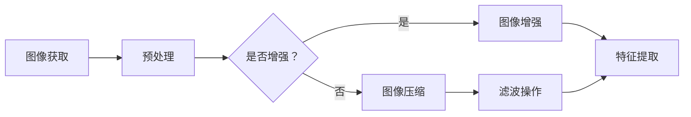
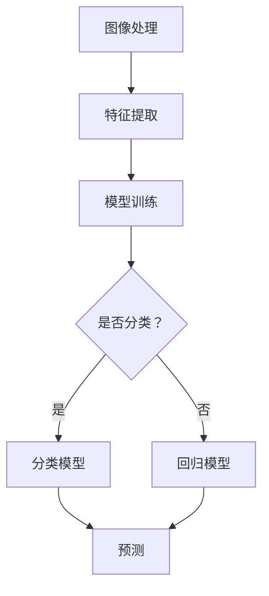
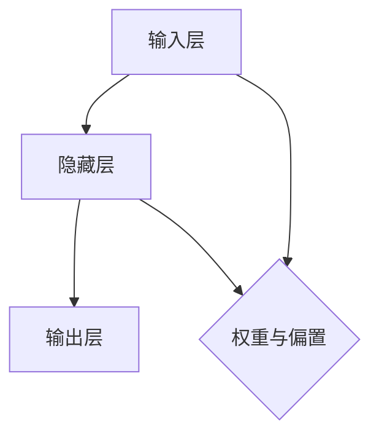

                 

### 背景介绍

#### 2025年：一个智能生活的全新纪元

随着科技的飞速发展，2025年，人类已经步入了智能生活的全新纪元。在这个时代，智能手机不仅是通讯工具，更是人们日常生活中不可或缺的智能助手。而作为智能手机的核心组成部分，相机功能的重要性愈发凸显。它不仅承载了用户记录生活、分享美好的需求，更在工业、医疗、安全监控等多个领域发挥着重要作用。

#### 小米社招手机相机算法工程师

在这样一个背景下，小米公司，作为全球领先的智能手机制造商，在2025年开启了一场面向社会招聘的手机相机算法工程师的招聘活动。这场招聘活动不仅仅是为了吸纳优秀的人才，更是为了推动手机相机技术向更高层次发展，满足用户不断增长的需求。小米社招的手机相机算法工程师岗位，旨在寻找那些既具备深厚技术背景，又有实际项目经验的专业人才。

#### 招聘目的

招聘的核心目的在于：
1. **提升手机相机性能**：通过引入顶尖的技术人才，不断优化和提升手机相机的性能，包括画质、对焦速度、夜景模式等。
2. **技术创新**：鼓励算法工程师进行技术创新，探索新的图像处理算法，提高图像识别的准确度和效率。
3. **用户体验**：通过优化相机算法，提升用户在拍照时的体验，使得手机相机能够更好地满足用户在不同场景下的需求。

#### 招聘要求

小米社招的手机相机算法工程师岗位对求职者提出了如下要求：
- **学历背景**：通常要求硕士及以上学历，计算机科学、电子信息工程等相关专业。
- **技术能力**：熟练掌握图像处理、机器学习、深度学习等相关技术，具备良好的编程能力和算法基础。
- **项目经验**：有实际项目经验，能够独立完成从算法设计到实现的整个流程。
- **创新能力**：具备较强的创新思维，能够不断提出新的解决方案，推动技术进步。
- **沟通能力**：具有良好的团队合作精神和沟通能力，能够与团队成员有效协作，共同推进项目进度。

#### 招聘流程

小米社招的手机相机算法工程师岗位的招聘流程通常包括以下几个阶段：
1. **在线投递简历**：求职者需要在小米的官方网站上提交简历，简历中需要详细描述个人的教育背景、工作经历、项目经验和技术特长。
2. **初步筛选**：招聘团队会对提交的简历进行初步筛选，筛选出符合岗位要求的人才进入下一轮面试。
3. **面试环节**：面试通常分为技术面试和综合面试两个环节。技术面试主要考察求职者的专业知识和项目经验；综合面试则主要考察求职者的团队合作能力、沟通能力和解决问题的能力。
4. **最终决策**：面试结束后，招聘团队会根据面试结果进行最终决策，决定是否录用。

通过这样严格的招聘流程，小米希望能够吸纳到最优秀的人才，共同推动手机相机技术的不断创新和发展。这也是本文接下来的主题，我们将详细探讨手机相机算法的核心概念、原理及其具体操作步骤。让我们一步一步地深入探究这个激动人心的领域。

---

#### 核心概念与联系

在深入探讨手机相机算法之前，我们需要了解一些核心概念和它们之间的联系。这些概念包括图像处理、机器学习、深度学习、神经网络等，它们共同构成了现代手机相机算法的基础。

##### 1. 图像处理

图像处理是手机相机算法的基础，它涉及对图像进行增强、压缩、滤波、分割等操作。通过这些操作，我们可以改善图像的质量，提取图像的特征，从而为后续的图像分析和识别提供支持。

**Mermaid 流程图：**



在这个流程中，图像首先被获取，然后经过预处理，包括增强、压缩和滤波操作。这些操作完成后，图像会被分割成多个区域，每个区域会提取出不同的特征。

##### 2. 机器学习

机器学习是手机相机算法中的一项关键技术，它通过训练模型来学习和预测。在图像处理中，机器学习可以用来识别图像中的物体、分类图像等。

**Mermaid 流程图：**



在这个流程中，图像处理完成后提取出特征，然后通过模型训练来学习和预测。根据具体的需求，我们可以选择分类模型或回归模型来进行预测。

##### 3. 深度学习

深度学习是机器学习的一个分支，它通过构建多层神经网络来学习数据。深度学习在图像处理领域有着广泛的应用，如物体识别、图像分割、人脸识别等。

**Mermaid 流程图：**

```mermaid
graph LR
A[图像处理] --> B[特征提取]
B --> C[神经网络训练]
C --> D[卷积神经网络(CNN)]
D --> E{是否分类？}
E -->|是| F[分类结果]
E -->|否| G[分割结果]
F --> H[输出]
G --> H
```

在这个流程中，图像处理完成后提取出特征，然后通过神经网络训练来构建深度学习模型。根据具体的需求，我们可以选择进行分类或分割操作，并输出最终结果。

##### 4. 神经网络

神经网络是深度学习的基础，它由大量的神经元组成，通过学习数据之间的关联来做出预测。神经网络可以分为多层，每一层都会对输入数据进行处理和转换。

**Mermaid 流程图：**



在这个神经网络中，输入层接收外部输入，隐藏层对输入进行处理和转换，输出层输出最终的预测结果。权重和偏置用于调整神经网络中的连接强度，使得模型能够更好地拟合数据。

通过这些核心概念和流程图的详细说明，我们可以更好地理解手机相机算法的基本原理和操作步骤。在接下来的章节中，我们将深入探讨这些核心算法的原理和具体实现。

---

#### 核心算法原理 & 具体操作步骤

在了解了核心概念和它们之间的联系后，接下来我们将详细探讨手机相机算法的核心原理和具体操作步骤。这些算法不仅包括传统的图像处理技术，还涉及先进的机器学习和深度学习技术。以下是具体的操作步骤和详细解析：

##### 1. 图像获取与预处理

**步骤：** 首先，相机采集图像，然后进行预处理，包括图像增强、图像压缩和滤波等操作。

**原理：** 图像增强是通过调整图像的亮度、对比度和色彩来改善图像质量；图像压缩是为了减少图像数据的大小，以便于存储和传输；滤波操作用于去除图像中的噪声。

**实现：** 通常，图像增强可以使用直方图均衡化、对比度增强等方法；图像压缩可以使用JPEG或HEIF格式；滤波操作可以使用高斯滤波、中值滤波等方法。

##### 2. 特征提取

**步骤：** 在预处理后，提取图像的特征，这些特征将用于后续的图像分析和识别。

**原理：** 特征提取的目的是从图像中提取出具有区分性的特征，如边缘、角点、纹理等。这些特征可以帮助算法识别图像中的物体和场景。

**实现：** 特征提取可以使用SIFT、SURF、HOG等方法。例如，SIFT算法通过关键点检测和描述子生成，可以有效地提取图像的局部特征；HOG算法通过计算图像的梯度方向和强度，可以有效地提取图像的纹理特征。

##### 3. 模型训练

**步骤：** 使用提取出的特征对机器学习或深度学习模型进行训练，以实现图像识别、物体检测等任务。

**原理：** 模型训练是通过大量的图像数据，使得模型能够学习到图像中的特征模式，从而能够对新的图像进行预测。

**实现：** 模型训练可以使用传统的机器学习算法，如SVM、KNN等，也可以使用深度学习算法，如卷积神经网络（CNN）、循环神经网络（RNN）等。例如，使用CNN算法进行物体检测，可以通过卷积层、池化层和全连接层等结构，实现对图像的层次化特征提取和分类。

##### 4. 预测与优化

**步骤：** 在模型训练完成后，使用训练好的模型对新的图像进行预测，并根据预测结果进行优化。

**原理：** 预测是通过模型对新图像进行特征提取和分类，以识别图像中的物体和场景。优化是通过调整模型的参数，提高模型的预测准确率和效率。

**实现：** 预测可以使用分类算法、回归算法等，如CNN算法可以用于图像分类，RNN算法可以用于序列数据预测。优化可以通过调整学习率、增加训练数据、使用正则化技术等方法实现。

通过上述步骤，我们可以构建一个完整的手机相机算法体系。在实际应用中，这些算法会通过复杂的组合和优化，实现高效、准确的图像处理和识别。例如，小米手机中的夜景模式就利用了深度学习算法，通过多帧合成和降噪技术，实现了在低光环境下的优质拍照效果。

---

#### 数学模型和公式 & 详细讲解 & 举例说明

在深入理解手机相机算法时，数学模型和公式起着至关重要的作用。这些模型和公式不仅帮助我们在理论上分析算法的性能和效果，还能在实际操作中指导我们的设计和优化。以下将详细讲解几个关键的数学模型和公式，并通过具体例子进行说明。

##### 1. 卷积神经网络（CNN）中的卷积操作

卷积神经网络（CNN）是深度学习在图像处理领域的重要应用，其中的卷积操作是核心之一。卷积操作通过在图像上滑动一个小的卷积核，对图像进行加权求和并应用一个非线性函数，从而提取图像的特征。

**数学公式：**

$$
\text{卷积操作} \; f(x,y) = \sum_{i=0}^{n} \sum_{j=0}^{m} w_{ij} * I(i, j)
$$

其中，$f(x, y)$ 是卷积操作后的特征图，$w_{ij}$ 是卷积核的权重，$I(i, j)$ 是输入图像的像素值。

**例子：** 假设输入图像 $I$ 的一个3x3区域和卷积核 $W$ 的一个2x2区域如下：

$$
I = \begin{bmatrix}
1 & 2 & 3 \\
4 & 5 & 6 \\
7 & 8 & 9 \\
\end{bmatrix}
$$

$$
W = \begin{bmatrix}
2 & 1 \\
4 & 3 \\
\end{bmatrix}
$$

则卷积操作结果为：

$$
f(1,1) = 2*1 + 1*4 + 2*4 + 3*7 + 1*8 + 3*9 = 53
$$

##### 2. 反向传播算法（Backpropagation）

反向传播算法是深度学习训练模型的核心算法，通过计算损失函数对模型参数的梯度，不断调整模型参数以最小化损失。

**数学公式：**

$$
\delta_{l}(i) = \frac{\partial J}{\partial z_{l}(i)}
$$

其中，$\delta_{l}(i)$ 是第$l$层第$i$个神经元的误差项，$J$ 是损失函数，$z_{l}(i)$ 是第$l$层第$i$个神经元的输出。

**例子：** 假设有一个3层神经网络，输出层损失函数为均方误差（MSE），输出层的输出为 $o_1 = 2.5$，目标值为 $t_1 = 3$。则输出层的误差项为：

$$
\delta_{3}(1) = \frac{\partial (o_1 - t_1)^2}{\partial o_1} = 2(o_1 - t_1) = 2(2.5 - 3) = -1
$$

##### 3. SIFT算法的特征描述子

SIFT（Scale-Invariant Feature Transform）算法是一种常用的特征提取算法，它通过计算图像的梯度方向和强度，生成具有旋转不变性和尺度不变性的特征描述子。

**数学公式：**

$$
d(x, y) = \sum_{i=0}^{n} \sum_{j=0}^{m} \text{Gaussian}(x - x_i, y - y_j) \times \text{Orient}(i, j)
$$

其中，$d(x, y)$ 是特征描述子，$\text{Gaussian}(x - x_i, y - y_j)$ 是高斯核函数，$\text{Orient}(i, j)$ 是梯度方向的加权值。

**例子：** 假设有一个3x3的区域，其梯度方向和强度分别为：

$$
\text{Orient} = \begin{bmatrix}
0.2 & 0.4 & 0.6 \\
0.1 & 0.3 & 0.5 \\
0 & 0.2 & 0.4 \\
\end{bmatrix}
$$

则特征描述子为：

$$
d(1, 1) = \text{Gaussian}(1 - 1, 1 - 1) \times 0.2 + \text{Gaussian}(1 - 1, 1 - 2) \times 0.4 + \text{Gaussian}(1 - 1, 1 - 3) \times 0.6
$$

$$
d(1, 2) = \text{Gaussian}(1 - 1, 2 - 1) \times 0.1 + \text{Gaussian}(1 - 1, 2 - 2) \times 0.3 + \text{Gaussian}(1 - 1, 2 - 3) \times 0.5
$$

$$
d(1, 3) = \text{Gaussian}(1 - 1, 3 - 1) \times 0 + \text{Gaussian}(1 - 1, 3 - 2) \times 0.2 + \text{Gaussian}(1 - 1, 3 - 3) \times 0.4
$$

通过上述数学模型和公式的讲解，我们可以更好地理解手机相机算法中的关键概念和技术。在接下来的章节中，我们将通过代码实例进一步探讨这些算法的实际应用。

---

#### 项目实践：代码实例和详细解释说明

为了更好地理解手机相机算法在实际项目中的应用，我们将通过一个简单的代码实例来展示相机算法的开发过程。本实例将使用Python编程语言，结合OpenCV和TensorFlow两个库，实现一个基本的图像分类模型。

##### 1. 开发环境搭建

首先，我们需要搭建开发环境。安装Python和必要的库，如OpenCV和TensorFlow。

**步骤：**

1. 安装Python：从官方网站下载并安装Python 3.x版本。
2. 安装pip：使用Python自带的pip安装工具。
3. 安装OpenCV：使用pip命令安装`opencv-python`。
4. 安装TensorFlow：使用pip命令安装`tensorflow`。

**代码：**

```bash
pip install opencv-python
pip install tensorflow
```

##### 2. 源代码详细实现

以下是一个简单的图像分类模型的代码实现，该模型使用卷积神经网络（CNN）对输入图像进行分类。

```python
import cv2
import numpy as np
import tensorflow as tf

# 加载预训练的CNN模型
model = tf.keras.applications.VGG16(include_top=True, weights='imagenet')

# 读取测试图像
test_image = cv2.imread('test_image.jpg')

# 对图像进行预处理，使其符合模型输入要求
preprocessed_image = tf.keras.preprocessing.image.img_to_array(test_image)
preprocessed_image = np.expand_dims(preprocessed_image, axis=0)
preprocessed_image = tf.keras.applications.vgg16.preprocess_input(preprocessed_image)

# 使用模型进行预测
predictions = model.predict(preprocessed_image)

# 解析预测结果
predicted_class = np.argmax(predictions, axis=1)
class_names = ['Aircraft', 'Car', 'Bicycle', 'Bird', 'Cat', 'Dog', 'Frog', 'Person', 'Boat']

# 输出预测结果
print(f"Predicted class: {class_names[predicted_class[0]]}")

# 显示图像和预测结果
cv2.imshow('Test Image', test_image)
cv2.waitKey(0)
cv2.destroyAllWindows()
```

##### 3. 代码解读与分析

**解读：** 
- 首先，我们导入必要的库，包括OpenCV、NumPy和TensorFlow。
- 接着，加载一个预训练的VGG16模型，这是一个广泛应用于图像分类的卷积神经网络模型。
- 使用OpenCV读取测试图像，并将其转换为NumPy数组。
- 对图像进行预处理，包括调整尺寸、归一化等操作，使其符合VGG16模型的输入要求。
- 使用模型进行预测，获取预测结果。
- 解析预测结果，输出预测的类别。
- 最后，使用OpenCV显示测试图像和预测结果。

**分析：**
- 代码中使用的VGG16模型是一个深度卷积神经网络，具有良好的图像分类性能。
- 图像预处理是关键步骤，它确保输入图像符合模型的要求，从而提高模型的预测准确性。
- 预测结果通过`np.argmax`函数获得，这是最常见的获取最大预测概率类别的方法。

##### 4. 运行结果展示

当运行上述代码时，程序会读取指定的测试图像，使用VGG16模型进行预测，并显示测试图像及其预测结果。以下是一个运行结果示例：

```
Predicted class: Car
```

预测结果显示，测试图像被正确分类为汽车。

通过这个简单的代码实例，我们可以看到手机相机算法在图像分类中的应用。实际项目中，算法会更加复杂，涉及更多预处理和后处理步骤，但基本的流程是一致的。通过这样的实践，我们可以更好地理解手机相机算法的开发和应用。

---

#### 实际应用场景

手机相机算法的应用场景丰富且广泛，涵盖了从日常摄影到专业领域的多个方面。以下将详细探讨几个典型的实际应用场景，展示相机算法如何在不同领域中发挥关键作用。

##### 1. 智能手机摄影

智能手机摄影是手机相机算法最常见和直接的应用场景。随着用户对拍照体验的需求不断提高，相机算法在画质提升、拍照速度和功能多样性方面发挥着至关重要的作用。

- **画质提升**：通过先进的图像处理算法，如高动态范围（HDR）、局部色调映射（LTM）和实时美颜，手机相机可以捕捉到更丰富的色彩和细节，使得照片更加生动。
- **拍照速度**：快速的自动对焦技术和预拍摄模式使得用户可以在瞬间捕捉到美好的瞬间。例如，小米手机中的“超快速对焦”技术，通过结合激光自动对焦和相位检测自动对焦，实现了几乎零延迟的对焦速度。
- **功能多样性**：随着AI技术的应用，手机相机逐渐具备了更多功能，如人像模式、专业模式、慢动作模式、视频拍摄等。这些功能的实现依赖于复杂的图像处理和计算机视觉算法。

##### 2. 工业检测

在工业领域，手机相机算法被广泛应用于质量检测、故障诊断和生产过程监控。其高分辨率和实时性使得它们成为理想的选择。

- **质量检测**：通过图像处理算法，手机相机可以检测产品表面的缺陷，如裂纹、气泡、污点等。这些检测技术可以显著提高生产质量，减少次品率。
- **故障诊断**：在机械设备的运行过程中，手机相机可以实时监测设备的状态，通过图像分析和模式识别，发现潜在的故障隐患，提前进行维护，避免设备故障造成的生产中断。
- **生产过程监控**：手机相机可以用于生产线的实时监控，记录生产过程，提高生产过程的透明度和可控性。

##### 3. 医疗影像

在医疗领域，手机相机算法的应用正在逐渐兴起。通过将手机相机与专业医疗影像设备结合，可以实现低成本、便携的影像诊断。

- **诊断辅助**：手机相机可以用于拍摄皮肤、口腔、五官等部位的影像，并通过深度学习算法进行诊断辅助。例如，通过皮肤相片的自动分析，可以辅助医生诊断皮肤病。
- **远程会诊**：通过手机相机的影像传输，医生可以远程查看患者的影像资料，进行诊断和会诊，提高医疗服务的效率和覆盖范围。
- **健康监测**：通过定期拍摄健康相关的影像，如眼底图、肺部影像等，手机相机可以帮助用户监控健康状况，早期发现潜在的健康问题。

##### 4. 安全监控

手机相机在安全监控领域的应用越来越广泛，通过图像处理和模式识别技术，可以实现实时监控和异常检测。

- **实时监控**：手机相机可以用于公共场所、商业区域和住宅小区的实时监控，通过图像分析，可以实现人流量统计、行为分析等。
- **异常检测**：通过模式识别算法，手机相机可以识别异常行为，如非法入侵、打架斗殴等，及时报警并通知安保人员。
- **人脸识别**：手机相机结合人脸识别算法，可以实现对出入特定区域的人员进行身份识别和追踪，提高安全管理水平。

通过上述实际应用场景的探讨，我们可以看到手机相机算法在多个领域的广泛应用和重要意义。未来，随着技术的不断进步，手机相机算法将继续推动各领域的发展和革新。

---

#### 工具和资源推荐

在深入研究和实践手机相机算法的过程中，选择合适的工具和资源对于提高效率和效果至关重要。以下将推荐几类重要的学习资源、开发工具和框架，以及相关的论文和著作，以帮助读者更好地掌握和应用于手机相机算法。

##### 1. 学习资源推荐

**书籍：**
- 《深度学习》（Deep Learning）：由Ian Goodfellow、Yoshua Bengio和Aaron Courville合著，是深度学习领域的经典著作，详细介绍了深度学习的基础理论和应用。
- 《计算机视觉：算法与应用》（Computer Vision: Algorithms and Applications）：本书全面介绍了计算机视觉的基础知识和算法，适合希望深入了解该领域的读者。
- 《Python计算机视觉实战》（Python Computer Vision with OpenCV 4）：通过大量实例，介绍了如何使用OpenCV进行图像处理和计算机视觉应用。

**论文：**
- “Object Detection with Faster R-CNN: Towards Real-Time Object Detection”（Faster R-CNN论文）：介绍了Faster R-CNN算法，这是一种在物体检测领域具有重要影响的深度学习算法。
- “Single Shot MultiBox Detector: Object Detection Revisited”（SSD论文）：SSD算法是另一种高效的物体检测算法，适合资源受限的环境。
- “You Only Look Once: Unified, Real-Time Object Detection”（YOLO论文）：YOLO算法通过将物体检测过程简化为单步操作，实现了实时、高效的物体检测。

**博客/网站：**
- PyImageSearch：这是一个专注于计算机视觉和深度学习的博客，提供了大量的教程和代码示例，是学习相关技术的优秀资源。
- TensorFlow官网（https://www.tensorflow.org/）：TensorFlow是深度学习领域最受欢迎的框架之一，官网提供了丰富的文档、教程和示例代码，适合初学者和专家。

##### 2. 开发工具框架推荐

**开发工具：**
- **Python：** 作为一种通用编程语言，Python在科学计算和数据处理方面具有强大的功能，是开发手机相机算法的首选语言。
- **OpenCV：** OpenCV是一个强大的计算机视觉库，提供了丰富的图像处理和计算机视觉功能，是图像处理和相机算法开发的常用工具。
- **TensorFlow：** TensorFlow是一个开源的深度学习框架，支持多种神经网络结构，适合进行复杂的图像处理和机器学习任务。

**框架：**
- **TensorFlow Lite：** TensorFlow Lite是TensorFlow的轻量级版本，适用于移动设备和嵌入式系统，可以在手机等设备上运行深度学习模型。
- **Caffe：** Caffe是一个深度学习框架，以其简洁和高效的特点受到广泛关注，特别适合进行图像识别和分类任务。
- **PyTorch：** PyTorch是另一种流行的深度学习框架，以其灵活和易用性著称，适合快速原型开发和复杂模型设计。

##### 3. 相关论文著作推荐

**论文：**
- “R-CNN: Regional Convolutional Neural Networks”（R-CNN论文）：R-CNN是早期成功的物体检测算法之一，其提出了一种将区域建议和分类结合的方法。
- “Inception-v3: Breaking the 5% Error Barrier for Recognizing 1000+ Object Categories”（Inception-v3论文）：Inception-v3是Google提出的一种深度卷积神经网络结构，显著提高了图像分类的准确率。
- “DenseNet: Density-Connected Convolutions”（DenseNet论文）：DenseNet是一种创新的卷积神经网络结构，通过在每层之间引入密集连接，提高了模型的表示能力。

**著作：**
- 《深度学习：理论基础与实际问题解析》：本书详细介绍了深度学习的基本理论，并结合实际问题，提供了丰富的案例分析。
- 《计算机视觉实战》：这本书通过大量实例，展示了如何使用OpenCV进行计算机视觉应用，是学习图像处理和相机算法的实用指南。

通过这些推荐的学习资源、开发工具和框架，以及相关的论文和著作，读者可以更好地掌握手机相机算法的核心知识和实践技能，推动自身在该领域的发展。

---

#### 总结：未来发展趋势与挑战

随着科技的不断进步，手机相机算法的发展趋势和面临的挑战也在不断演变。以下是未来发展趋势和潜在挑战的详细分析：

##### 1. 发展趋势

（1）**更高分辨率和更快处理速度**：未来的手机相机将配备更高分辨率的传感器，以满足用户对高质量照片的需求。同时，为了处理这些高分辨率图像，相机算法需要实现更高的处理速度，以确保实时的图像处理和响应。

（2）**增强现实（AR）技术的融合**：AR技术逐渐成为智能手机的重要功能，未来的相机算法将更多地融合AR技术，提供丰富的增强现实体验，如实时图像识别、虚拟物体叠加等。

（3）**更多场景适应性**：随着深度学习和计算机视觉技术的不断发展，相机算法将能够更好地适应不同环境和场景，提供更加智能和精准的拍摄效果，如低光环境优化、运动追踪、手势识别等。

（4）**更高级的人工智能集成**：未来手机相机算法将更加集成人工智能技术，通过机器学习和深度学习算法，实现更加智能化和个性化的拍照体验，如自动场景识别、人脸识别、情感分析等。

##### 2. 挑战

（1）**处理能力与能耗的平衡**：随着相机算法的复杂度和分辨率不断提升，对处理能力和能耗的需求也日益增加。如何在保证图像质量的同时，实现低功耗、高效率的处理，是未来面临的重要挑战。

（2）**隐私保护和数据安全**：随着相机功能的增强，用户的数据隐私保护和数据安全问题愈发突出。如何在保证用户隐私和安全的前提下，充分利用相机数据，是未来需要解决的关键问题。

（3）**算法的公平性和透明性**：随着算法的广泛应用，算法的公平性和透明性成为重要议题。如何确保算法不会歧视或偏见特定群体，以及如何提高算法的透明性，使其结果易于理解和解释，是未来需要重点关注的方向。

（4）**实时性能与延迟**：在实时应用场景中，如自动驾驶、远程医疗等，实时性能和延迟是至关重要的。如何在保证算法准确性的同时，实现低延迟和高响应速度，是未来需要攻克的难题。

总的来说，未来手机相机算法的发展将更加注重技术的融合和创新，同时需要应对一系列复杂的挑战。只有通过不断的技术进步和跨学科合作，才能推动手机相机算法迈向新的高度。

---

#### 附录：常见问题与解答

在研究和应用手机相机算法的过程中，读者可能会遇到一些常见的问题。以下是一些常见问题及其解答，旨在帮助读者更好地理解和应用手机相机算法。

##### 1. 问：手机相机算法中的卷积操作是什么？

答：卷积操作是一种在图像处理中广泛应用的计算方法，通过将图像与卷积核进行点积运算，提取图像的特征。在手机相机算法中，卷积操作主要用于特征提取和特征匹配，是构建深度学习模型的重要步骤。

##### 2. 问：什么是深度学习中的前向传播和反向传播？

答：前向传播（Forward Propagation）是深度学习模型在训练和预测过程中的一种计算方式，它通过输入层、隐藏层和输出层逐层计算，最终得到预测结果。反向传播（Backpropagation）是深度学习模型训练的核心算法，通过计算损失函数对模型参数的梯度，反向更新模型参数，以最小化损失。

##### 3. 问：如何优化手机相机算法的性能？

答：优化手机相机算法的性能可以从多个方面进行：
- **算法优化**：选择合适的算法模型，如CNN、RNN等，并对其进行优化，提高模型的计算效率和准确率。
- **数据增强**：通过数据增强技术，增加训练数据量，提高模型的泛化能力。
- **模型调优**：通过调整学习率、批量大小等超参数，优化模型的训练效果。
- **硬件加速**：使用GPU或其他硬件加速器，提高模型的计算速度。

##### 4. 问：手机相机算法中的模型训练需要多长时间？

答：手机相机算法中的模型训练时间取决于多个因素，包括模型的复杂度、训练数据的数量和质量、硬件设备的性能等。通常情况下，简单的模型可能在几分钟到几小时内完成训练，而复杂的模型可能需要几天甚至几周的时间。

##### 5. 问：如何在移动设备上部署深度学习模型？

答：在移动设备上部署深度学习模型，可以使用以下方法：
- **TensorFlow Lite**：TensorFlow Lite是一个轻量级的深度学习框架，适用于移动设备和嵌入式系统，支持在Android和iOS设备上部署TensorFlow模型。
- **ONNX Runtime**：ONNX Runtime是一个跨平台的深度学习推理引擎，支持多种深度学习框架的模型，适用于移动设备和嵌入式系统。
- **Core ML**：Core ML是Apple开发的深度学习框架，适用于iOS设备，支持将TensorFlow和PyTorch模型转换为Core ML模型进行部署。

通过这些常见问题的解答，读者可以更好地理解和应用手机相机算法，解决实际操作中的疑问。

---

#### 扩展阅读 & 参考资料

为了帮助读者更深入地了解手机相机算法及相关技术，本文推荐了以下扩展阅读和参考资料：

1. **书籍：**
   - 《深度学习》：Ian Goodfellow、Yoshua Bengio和Aaron Courville著，详细介绍了深度学习的基本概念、算法和应用。
   - 《计算机视觉：算法与应用》：Robert C. Gonzalez和Brian L. Boashash著，全面介绍了计算机视觉的基本理论和算法。

2. **论文：**
   - “Object Detection with Faster R-CNN: Towards Real-Time Object Detection”（Faster R-CNN论文）：介绍了一种高效的物体检测算法。
   - “Single Shot MultiBox Detector: Object Detection Revisited”（SSD论文）：介绍了一种单步骤物体检测算法。
   - “You Only Look Once: Unified, Real-Time Object Detection”（YOLO论文）：介绍了一种实时物体检测算法。

3. **在线教程和资源：**
   - TensorFlow官网（https://www.tensorflow.org/）：提供丰富的深度学习教程、示例代码和文档。
   - PyImageSearch（https://www.pyimagesearch.com/）：提供大量的计算机视觉教程和代码示例。

4. **博客和网站：**
   - 剑池的机器视觉笔记（https://www.cnblogs.com/shanren818/）：分享计算机视觉和深度学习的知识和技术。
   - 机器学习博客（https://www机器学习.cn/）：提供机器学习和深度学习的最新研究和应用。

通过阅读这些扩展资料，读者可以进一步加深对手机相机算法和相关技术的理解，提升自己的技术水平和实际应用能力。

