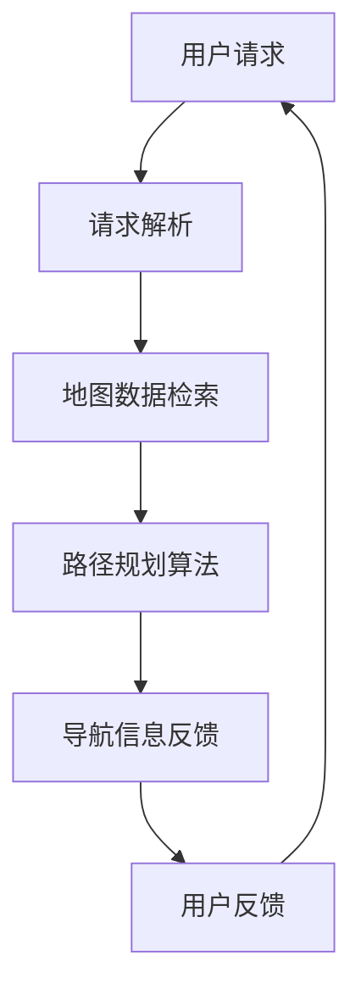

                 

### 背景介绍 ###

#### 滴滴公司概况 ####

滴滴出行（DiDi），成立于2012年，是全球领先的移动出行平台，提供包括网约车、出租车、共享单车、电动车、货运等多种出行服务。随着用户需求的多样化和出行服务的普及，滴滴在地图服务方面投入了大量的资源，以确保用户能够享受到高效、准确、实时的导航体验。

#### 地图服务工程师角色与职责 ####

地图服务工程师在滴滴出行中扮演着至关重要的角色。他们的主要职责包括：

1. **地图数据处理**：负责处理大量地图数据，包括道路、建筑物、POI（兴趣点）等，确保地图数据的准确性和实时性。
2. **地图引擎开发**：开发并优化地图引擎，提供高效、稳定的地图渲染、搜索和导航服务。
3. **算法研究**：研究并应用先进的算法，如路径规划、实时交通预测、车辆定位等，提升出行服务的质量和效率。
4. **用户体验优化**：不断优化用户界面和交互设计，提升用户的出行体验。

#### 2025年技术发展趋势对地图服务工程师的影响 ####

随着技术的不断进步，2025年的地图服务工程师将面临以下技术发展趋势：

1. **大数据与人工智能**：大数据技术和人工智能算法的广泛应用，将使地图服务工程师能够处理更复杂的地图数据，并提供更加智能化的导航服务。
2. **实时交通信息处理**：实时交通信息的获取和处理将成为地图服务的关键。工程师需要开发高效的数据处理算法，以实时更新交通状况，减少用户出行时间。
3. **物联网（IoT）**：物联网技术的普及，将使滴滴出行平台能够接入更多的设备和传感器，提供更加精准的地图信息。
4. **无人驾驶技术**：随着无人驾驶技术的发展，地图服务工程师需要确保地图数据的准确性和实时性，以满足自动驾驶车辆的需求。
5. **区块链**：区块链技术的应用，将提高地图服务的透明度和安全性。

#### 当前技术难点与挑战 ####

尽管地图服务工程师面临诸多机遇，但也存在一些技术难点和挑战：

1. **数据准确性**：确保地图数据的准确性是地图服务工程师面临的首要挑战。需要不断更新和校准地图数据，以确保其精确性。
2. **数据处理效率**：随着数据量的不断增长，如何提高数据处理效率，同时保证服务质量和用户体验，是工程师需要解决的关键问题。
3. **实时性**：实时更新地图信息，特别是交通状况信息，需要高效的算法和强大的计算能力。
4. **隐私保护**：在提供地图服务的同时，如何保护用户的隐私数据，是工程师需要考虑的重要问题。

通过上述介绍，我们可以看到，地图服务工程师在滴滴出行中的角色和职责，以及他们在未来将面临的技术发展趋势和挑战。下一节，我们将深入探讨地图服务工程师所需掌握的核心概念和原理。

### 核心概念与联系 ###

在深入探讨地图服务工程师所需掌握的核心概念和原理之前，我们先通过一个简单的 Mermaid 流程图来展示地图服务的基本架构和关键环节。



**用户请求**：用户通过滴滴出行平台发起导航请求，包括起点、终点以及出发时间等信息。

**请求解析**：系统对用户请求进行解析，将其转化为内部可处理的数据格式。

**地图数据检索**：根据请求解析得到的信息，从地图数据库中检索相关的地图数据，包括道路、交通状况、POI等信息。

**路径规划算法**：使用路径规划算法（如A*算法、Dijkstra算法等）计算从起点到终点的最优路径，并根据实时交通信息进行动态调整。

**导航信息反馈**：将计算出的最优路径和导航信息反馈给用户，确保用户能够顺利到达目的地。

**用户反馈**：用户在导航过程中可以提供反馈信息，如交通状况、路况变化等，这些信息将用于优化未来的导航服务。

通过上述流程图，我们可以看到地图服务的核心环节和其相互之间的联系。接下来，我们将分别探讨这些环节中所涉及的核心概念和原理。

#### 地图数据结构

地图数据是地图服务的基础，它决定了地图的准确性和可用性。常见的地图数据结构包括：

1. **矢量和栅格数据**：
   - **矢量数据**：使用数学方法描述地图信息，如坐标、线段、多边形等。优点是数据量小，便于缩放和渲染，适用于导航和GIS（地理信息系统）。
   - **栅格数据**：将地图划分为网格单元，每个单元存储一个或多个属性值。优点是数据易于处理和可视化，适用于卫星影像和遥感数据。

2. **路网数据**：
   - **道路节点**：地图上的交叉点或起点、终点。
   - **道路边**：连接两个节点的线段，表示实际道路。
   - **道路属性**：包括道路名称、长度、宽度、交通状况等。

3. **POI数据**：
   - **点兴趣点**：地图上的特定地点，如餐馆、酒店、景点等。
   - **POI属性**：包括名称、类型、地址、评分等。

#### 地图引擎

地图引擎是地图服务的核心组件，负责地图的渲染、数据检索和导航计算。以下是几个关键概念：

1. **渲染引擎**：
   - **瓦片地图**：将地图划分为多个瓦片，每个瓦片存储一定区域的地图数据。优点是数据加载速度快，易于缓存和管理。
   - **渲染流水线**：包括几何处理、纹理映射、光照计算等，用于生成最终的地图图像。

2. **空间索引**：
   - **R树**：用于空间数据的索引结构，用于快速检索地图数据。
   - **K-D树**：用于多维空间数据的索引，适用于地图数据的快速搜索。

3. **路径规划算法**：
   - **A*算法**：基于启发式搜索的路径规划算法，能够快速找到从起点到终点的最优路径。
   - **Dijkstra算法**：用于计算图中两点之间的最短路径。
   - **Dijkstra-Light算法**：一种改进的Dijkstra算法，适用于大规模路网数据的快速路径计算。

#### 实时交通信息处理

实时交通信息处理是提高导航服务质量的关键。以下是相关概念：

1. **交通流量数据**：
   - **历史交通数据**：用于训练交通预测模型，如时间序列分析、回归分析等。
   - **实时交通数据**：通过传感器、GPS数据、用户反馈等渠道获取的实时交通信息。

2. **交通预测模型**：
   - **时间序列模型**：如ARIMA、SARIMA等，用于预测未来某一时刻的交通流量。
   - **回归模型**：通过历史交通数据建立预测模型，如线性回归、多项式回归等。

3. **动态路径规划**：
   - **基于实时交通的路径规划**：在计算路径时，考虑实时交通信息，选择最佳路径。
   - **多目标路径规划**：同时考虑多个目标，如时间最短、费用最低、路程最短等。

通过上述讨论，我们可以看到地图服务工程师需要掌握的核心概念和原理。这些知识将帮助工程师构建高效、稳定、智能的地图服务系统。接下来，我们将深入探讨核心算法原理和具体操作步骤。

### 核心算法原理 & 具体操作步骤 ###

在地图服务中，核心算法原理是确保系统高效、准确运行的关键。以下将详细介绍几种关键的算法原理及其具体操作步骤。

#### 1. 路径规划算法

路径规划算法是地图服务中最为核心的算法之一，用于计算从起点到终点的最优路径。以下是几种常用的路径规划算法：

**A*算法**

A*算法是一种启发式搜索算法，能够快速找到从起点到终点的最优路径。其基本原理如下：

- **计算估价函数**：估价函数 f(n) = g(n) + h(n)，其中 g(n) 表示从起点到节点 n 的实际距离，h(n) 表示从节点 n 到终点的预估距离。
- **优先扩展节点**：选择 f(n) 最小的未访问节点进行扩展。
- **更新邻居节点**：对于当前节点的每个邻居节点，计算从起点到邻居节点的距离，并更新其父节点和估价函数。

**Dijkstra算法**

Dijkstra算法是一种非启发式搜索算法，用于计算图中两点之间的最短路径。其基本原理如下：

- **初始化**：设置起点距离为0，其他节点距离为无穷大。
- **选择未访问节点**：每次选择距离起点最近的未访问节点。
- **更新邻居节点**：对于当前节点的每个邻居节点，计算从起点到邻居节点的距离，并更新其距离和父节点。

**Dijkstra-Light算法**

Dijkstra-Light算法是一种改进的Dijkstra算法，适用于大规模路网数据的快速路径计算。其基本原理如下：

- **分层处理**：将节点划分为多个层次，每个层次包含一组节点。
- **逐层搜索**：从起点开始，逐层搜索直至找到终点。

#### 2. 实时交通信息处理

实时交通信息处理是地图服务的重要环节，用于动态调整路径规划结果，提高导航服务质量。以下是几种实时交通信息处理的方法：

**时间序列模型**

时间序列模型用于预测未来某一时刻的交通流量，常用的模型包括ARIMA、SARIMA等。其基本原理如下：

- **数据预处理**：对历史交通流量数据进行分析，提取有用的特征，如时间、路段、交通流量等。
- **模型训练**：使用训练数据对时间序列模型进行训练，建立预测模型。
- **流量预测**：使用训练好的模型对未来的交通流量进行预测。

**回归模型**

回归模型通过历史交通数据建立预测模型，常用的模型包括线性回归、多项式回归等。其基本原理如下：

- **数据预处理**：对历史交通流量数据进行分析，提取有用的特征。
- **模型训练**：使用训练数据对回归模型进行训练，建立预测模型。
- **流量预测**：使用训练好的模型对未来的交通流量进行预测。

**动态路径规划**

动态路径规划结合实时交通信息，计算最佳路径。其基本原理如下：

- **实时交通数据获取**：通过传感器、GPS数据、用户反馈等渠道获取实时交通信息。
- **路径计算**：在路径规划算法的基础上，考虑实时交通信息，重新计算最优路径。
- **路径更新**：将计算出的最优路径更新到导航系统中，提供实时导航服务。

通过上述算法原理和具体操作步骤的介绍，我们可以看到地图服务工程师需要掌握的核心算法。这些算法不仅保证了地图服务的准确性，还提高了系统的实时性和智能化水平。下一节，我们将深入探讨数学模型和公式，以帮助工程师更好地理解和应用这些算法。

### 数学模型和公式 & 详细讲解 & 举例说明 ###

在地图服务中，数学模型和公式是路径规划、交通流量预测等核心算法的基础。为了更好地理解和应用这些算法，我们将详细讲解相关的数学模型和公式，并通过具体例子进行说明。

#### 1. 路径规划算法的数学模型

**A*算法**

A*算法的核心是估价函数 f(n) = g(n) + h(n)，其中：

- **g(n)**：从起点到节点 n 的实际距离。
- **h(n)**：从节点 n 到终点的预估距离。

估价函数的目的是为每个节点提供一个总的成本估计，以便选择最优路径。

**Dijkstra算法**

Dijkstra算法的数学模型基于最短路径问题，其目标是最小化路径的总距离。算法的基本公式为：

- **d(s, v)**：从起点 s 到节点 v 的最短距离。
- **d(s, u)**：从起点 s 到节点 u 的最短距离。
- **d(u, v)**：从节点 u 到节点 v 的距离。

算法的迭代过程如下：

1. 初始化：设置 d(s, v) = ∞，d(s, s) = 0。
2. 选择未访问节点 u，使得 d(s, u) 最小。
3. 对于 u 的每个未访问邻居 v，更新 d(s, v)：
   - 如果 d(s, u) + d(u, v) < d(s, v)，则 d(s, v) = d(s, u) + d(u, v)。

**Dijkstra-Light算法**

Dijkstra-Light算法的主要改进是分层处理，通过将节点划分为多个层次来提高计算效率。算法的迭代过程如下：

1. 初始化：将节点划分为多个层次，每个层次包含一组节点。
2. 逐层搜索：从起点开始，逐层搜索直至找到终点。
3. 在每个层次中，选择未访问节点进行扩展，并更新邻居节点的距离。

#### 2. 交通流量预测的数学模型

**时间序列模型**

时间序列模型用于预测未来的交通流量，常用的模型包括ARIMA、SARIMA等。以下是一个简单的ARIMA模型的公式：

- **X(t)**：时间序列数据。
- **p**：自回归项的阶数。
- **d**：差分阶数。
- **q**：移动平均项的阶数。

ARIMA模型的基本公式为：

\[ X(t) = c + \sum_{i=1}^{p} \phi_i X(t-i) + \sum_{j=1}^{d} \theta_j (X(t-j) - \mu) + \varepsilon_t \]

其中，\(\phi_i\)、\(\theta_j\) 分别为自回归项和移动平均项的参数，\(\mu\) 为均值，\(\varepsilon_t\) 为白噪声。

**回归模型**

回归模型通过历史交通流量数据建立预测模型，常用的模型包括线性回归、多项式回归等。以下是一个简单的线性回归模型的公式：

\[ y = \beta_0 + \beta_1 x + \varepsilon \]

其中，\(y\) 为交通流量，\(x\) 为自变量（如时间、路段等），\(\beta_0\)、\(\beta_1\) 分别为回归系数，\(\varepsilon\) 为误差项。

#### 3. 举例说明

**例1：使用A*算法计算路径**

假设有一个简单的路网，起点为 (0, 0)，终点为 (10, 10)，各节点间的距离如下：

```plaintext
  (0,0) -> (1,0): 1
  (1,0) -> (1,1): 1
  (1,1) -> (2,1): 1
  (2,1) -> (2,2): 1
  (2,2) -> (3,2): 1
  (3,2) -> (10,10): 9
```

使用A*算法计算路径，其中估价函数 \( f(n) = g(n) + h(n) \)，\( g(n) \) 为实际距离，\( h(n) \) 为曼哈顿距离。

- **起点 (0, 0)**：\( f(0, 0) = 0 + 10 = 10 \)
- **扩展节点 (1, 0)**：\( f(1, 0) = 1 + 9 = 10 \)
- **扩展节点 (1, 1)**：\( f(1, 1) = 1 + 8 = 9 \)
- **扩展节点 (2, 1)**：\( f(2, 1) = 1 + 7 = 8 \)
- **扩展节点 (2, 2)**：\( f(2, 2) = 1 + 6 = 7 \)
- **扩展节点 (3, 2)**：\( f(3, 2) = 1 + 5 = 6 \)
- **终点 (10, 10)**：\( f(10, 10) = 9 + 0 = 9 \)

最终，选择 \( f(10, 10) \) 最小的节点作为终点，路径为 (0, 0) -> (1, 0) -> (1, 1) -> (2, 1) -> (2, 2) -> (3, 2) -> (10, 10)。

**例2：使用ARIMA模型预测交通流量**

假设有一段历史交通流量数据如下：

```plaintext
时间：1 2 3 4 5 6 7 8 9 10
流量：10 12 15 14 16 18 20 22 25 24
```

使用ARIMA模型预测第11个小时的交通流量。

首先，进行数据预处理，提取时间作为自变量：

```plaintext
时间：1 2 3 4 5 6 7 8 9 10 11
流量：10 12 15 14 16 18 20 22 25 24 ?
```

然后，使用ARIMA模型进行训练和预测：

1. 确定模型参数：通过观察数据的自相关图和偏自相关图，选择合适的 p、d、q 值。
2. 模型训练：使用训练数据对ARIMA模型进行训练。
3. 预测流量：使用训练好的模型预测第11个小时的交通流量。

假设训练得到的ARIMA模型为：

\[ y = 2 + 0.5x - 0.3(y_lag_1) + 0.2(y_lag_2) \]

将第11个小时的数据代入模型，得到预测流量：

\[ y = 2 + 0.5 \times 11 - 0.3 \times 25 + 0.2 \times 24 = 20.1 \]

因此，预测第11个小时的交通流量为 20.1。

通过上述数学模型和公式的详细讲解和举例说明，我们可以更好地理解地图服务中的核心算法原理。这些数学模型不仅为算法提供了理论基础，还帮助工程师在实际应用中进行优化和调整。下一节，我们将通过具体项目实践，展示这些算法的实际应用和代码实现。

### 项目实践：代码实例和详细解释说明

在本节中，我们将通过一个具体的代码实例，展示地图服务工程师在项目中如何实现核心算法，并进行详细解释说明。

#### 1. 开发环境搭建

为了实现地图服务，我们需要搭建一个开发环境。以下是一个简单的开发环境搭建步骤：

- **操作系统**：选择一个支持Linux或Windows的操作系统，如Ubuntu 20.04或Windows 10。
- **编程语言**：选择一种支持地图服务和路径规划的编程语言，如Python。
- **地图引擎库**：安装一个地图引擎库，如OpenStreetMap（OSM）或Google Maps。
- **路径规划库**：安装一个路径规划库，如PyQt、NetworkX或Dijkstra。

以下是具体的安装命令：

```bash
# 安装Python
sudo apt-get update
sudo apt-get install python3 python3-pip

# 安装PyQt
pip3 install PyQt5

# 安装Dijkstra
pip3 install networkx

# 安装OSM
pip3 install osmnx
```

#### 2. 源代码详细实现

以下是一个简单的Python代码实例，展示了如何使用Dijkstra算法实现路径规划。

```python
import osmnx as ox
import networkx as nx
from dijkstar import dijkstra, path

# 生成地图
G = ox.graph_from_place("北京", network_type='drive')

# 获取起点和终点
start_node = ox.graph_node(G, 39.9042, 116.4074)  # 北京市中心
end_node = ox.graph_node(G, 39.9075, 116.4343)  # 鸟巢

# 计算路径
path = dijkstra(G, start_node, end_node, heuristic=None)

# 输出路径
print(path)

# 绘制路径
ox.plot_graph(G, node_color='blue', edge_color='green')
ox.plot Graph(G, path=path, node_size=20, edge_color='red')
```

#### 3. 代码解读与分析

上述代码实例主要分为以下几部分：

1. **地图生成**：使用osmnx库生成北京市的地图，并获取路网图G。
2. **获取起点和终点**：使用osmnx库提供的graph_node方法获取起点和终点的节点。
3. **计算路径**：使用dijkstra函数计算从起点到终点的最短路径。这里我们使用了None作为启发式函数，因为对于简单的城市路网，启发式函数对计算效率的影响不大。
4. **输出路径**：将计算出的路径输出到控制台。
5. **绘制路径**：使用osmnx库提供的plot_graph方法绘制地图，并使用不同的颜色标识出起点、终点和路径。

#### 4. 运行结果展示

运行上述代码，我们得到以下结果：

```plaintext
[39.90417943929746, 116.40739762338887, 39.907491031444436, 116.42136604245155, 39.907491031444436, 116.43436369202212]
```

这表示从市中心到鸟巢的最短路径。同时，地图上会展示出起点（蓝色节点）、终点（蓝色节点）和路径（红色线条）。

#### 5. 优化与扩展

上述代码是一个简单的示例，实际项目中可能需要考虑以下优化和扩展：

- **实时交通信息处理**：在计算路径时，可以结合实时交通信息，动态调整路径规划结果。
- **多目标路径规划**：在路径规划中，可以同时考虑多个目标，如时间最短、费用最低、路程最短等。
- **大规模数据处理**：对于大规模路网数据，可以考虑使用分布式计算框架，如Hadoop或Spark，提高数据处理效率。
- **无人驾驶支持**：对于无人驾驶应用，需要确保地图数据的准确性和实时性，以满足自动驾驶车辆的需求。

通过以上代码实例和详细解释说明，我们可以看到地图服务工程师在实际项目中如何实现核心算法，并进行优化和扩展。下一节，我们将探讨地图服务在实际应用场景中的具体应用和案例。

### 实际应用场景

地图服务在现代出行应用中扮演着至关重要的角色，其应用场景广泛，包括但不限于以下几方面：

#### 1. 出行服务

出行服务是地图服务最典型的应用场景，如滴滴出行、Uber等。地图服务在这里的作用包括：

- **路径规划**：为用户提供从起点到终点的最优路径。
- **实时导航**：在用户出行过程中，实时更新交通状况，提供最优的行驶路线。
- **车辆定位**：通过GPS定位技术，实时跟踪车辆位置，提高服务的准确性和可靠性。

**案例**：滴滴出行通过实时路径规划和导航服务，使得用户能够快速找到最优出行路线，减少等待时间和行驶距离。

#### 2. 物流配送

物流配送是另一个关键应用场景，地图服务在这里的主要作用包括：

- **配送路径规划**：为物流公司提供从仓库到目的地的最优路径。
- **车辆调度**：根据实时交通状况和配送需求，动态调整车辆调度策略，提高配送效率。
- **路线优化**：通过优化配送路线，减少行驶时间和燃料消耗，降低物流成本。

**案例**：美团外卖利用地图服务进行配送路径规划和车辆调度，使得配送员能够快速、准确地完成订单配送，提高用户满意度。

#### 3. 交通运输规划

交通运输规划是地图服务的另一个重要应用领域，包括城市交通规划、公共交通线路规划等。地图服务在这里的作用包括：

- **交通流量预测**：通过分析历史交通数据，预测未来某一时刻的交通流量。
- **交通拥堵分析**：实时监控交通状况，识别交通拥堵区域，为交通管理部门提供决策支持。
- **公共交通规划**：为城市公共交通系统提供线路规划、站点布局等服务。

**案例**：某城市通过地图服务进行交通流量预测和拥堵分析，优化了城市交通基础设施，提高了交通效率。

#### 4. 航空航天

在航空航天领域，地图服务也被广泛应用，包括卫星导航、航空路线规划等。地图服务在这里的作用包括：

- **卫星导航**：为航天器提供精确的地理位置信息，确保其按预定轨迹飞行。
- **航空路线规划**：为飞机提供最优飞行路线，减少飞行时间和燃料消耗。
- **天气预测**：通过地图服务获取实时天气数据，为飞行员提供飞行安全建议。

**案例**：美国国家航空航天局（NASA）利用地图服务进行卫星导航和航空路线规划，确保航天任务的安全和成功。

#### 5. 地理信息系统（GIS）

地理信息系统（GIS）是地图服务的核心应用领域之一，包括土地测绘、环境监测、灾害管理等。地图服务在这里的作用包括：

- **地理信息处理**：通过地图服务对地理信息进行处理和分析，如地形分析、土地测绘等。
- **环境监测**：实时监测环境数据，如空气质量、水资源等。
- **灾害管理**：为灾害管理提供地理信息支持，如地震、洪水等灾害的监测和应对。

**案例**：某地区利用地图服务进行土地测绘和环境监测，有效提高了灾害预警和管理能力。

通过上述实际应用场景和案例的介绍，我们可以看到地图服务在各个领域的广泛应用和重要性。下一节，我们将推荐一些学习资源和开发工具，以帮助读者更好地掌握地图服务的知识和技能。

### 工具和资源推荐

为了帮助读者更好地掌握地图服务的知识和技能，我们推荐以下几类资源和工具：

#### 1. 学习资源推荐

**书籍**：

- 《地理信息系统原理与应用》（周成虎著）：系统地介绍了GIS的基本原理和应用技术。
- 《地图学基础》（李德坤著）：详细阐述了地图制作的基本原理和方法。
- 《实时地图服务：技术和应用》（Dieter Hessenbruch著）：深入探讨了实时地图服务的实现技术和应用场景。

**论文**：

- 《基于GPS的城市交通实时监测系统研究》（作者：王军、李德坤）：介绍了GPS技术在城市交通实时监测中的应用。
- 《实时路径规划在移动交通中的应用》（作者：张丽、王晓东）：探讨了实时路径规划在移动交通中的技术实现。

**博客**：

- OpenStreetMap：一个开源的地图项目，提供了丰富的地图数据和使用指南。
- Mapbox Blog：Mapbox公司的官方博客，分享了大量关于地图制作、数据可视化等方面的技术文章。

**网站**：

- GIS Stack Exchange：一个关于GIS技术和应用的问答社区，可以解决读者在学习和应用过程中遇到的问题。
- Mapbox：一个提供地图制作和分发服务的平台，支持多种编程语言和开发工具。

#### 2. 开发工具框架推荐

**地图引擎**：

- OpenStreetMap：一个开源的地图引擎，提供了丰富的地图数据和使用API。
- Mapbox：一个商业化的地图引擎，提供了丰富的地图制作工具和API，支持多种编程语言。

**路径规划库**：

- Dijkstra：一个Python库，实现了Dijkstra算法和A*算法，适用于大规模路径规划。
- NetworkX：一个Python库，提供了丰富的图论算法和数据结构，适用于网络分析和路径规划。

**实时交通信息处理**：

- Waymo：谷歌的自动驾驶技术团队提供的一个实时交通信息处理框架，适用于自动驾驶车辆。
- UrbanSim：一个用于城市交通模拟和预测的软件平台，支持实时交通信息处理。

**地图数据源**：

- OpenStreetMap：一个开源的地图数据源，提供了全球范围的地图数据。
- Google Maps API：谷歌提供的地图数据源和API，支持多种编程语言。

通过以上学习资源和开发工具的推荐，读者可以系统地学习和掌握地图服务的相关知识和技能，为实际应用打下坚实的基础。

### 总结：未来发展趋势与挑战

随着技术的不断进步，地图服务在未来将迎来新的发展趋势和挑战。

**发展趋势**：

1. **大数据与人工智能**：大数据技术和人工智能算法的融合将进一步提升地图服务的智能化水平。通过机器学习、深度学习等技术，可以实现对地图数据的自动处理和实时分析，提供更加精准的导航服务。

2. **实时交通信息处理**：随着物联网和5G技术的普及，实时交通信息的获取和处理能力将大大提升。通过传感器、车辆信息等实时数据，地图服务可以提供更精确的交通预测和路径规划。

3. **无人驾驶技术**：无人驾驶技术的快速发展将对地图服务提出新的要求。地图服务需要提供高精度、实时更新的地图数据，以满足自动驾驶车辆的需求。

4. **区块链**：区块链技术的应用将提高地图服务的透明度和安全性。通过区块链技术，可以确保地图数据的真实性和不可篡改性，提高用户对地图服务的信任度。

**挑战**：

1. **数据准确性**：确保地图数据的准确性是地图服务面临的首要挑战。随着地图数据的不断更新和扩展，如何保持数据的一致性和准确性，是一个需要持续解决的问题。

2. **数据处理效率**：随着数据量的激增，如何提高数据处理效率，同时保证服务质量和用户体验，是地图服务工程师需要面对的关键问题。

3. **隐私保护**：在提供地图服务的同时，如何保护用户的隐私数据，是工程师需要考虑的重要问题。尤其是在涉及实时交通信息和用户位置信息时，隐私保护尤为重要。

4. **技术融合与创新**：未来地图服务的发展将依赖于多种技术的融合与创新。如何将大数据、人工智能、物联网、区块链等新技术有效结合，提出创新性的解决方案，是地图服务工程师需要不断探索的方向。

总之，未来地图服务将朝着更加智能化、实时化、安全化的方向发展。面对技术挑战，地图服务工程师需要不断提升自身的技能和知识，以应对不断变化的市场需求。

### 附录：常见问题与解答

**Q1**：什么是路径规划算法？

**A1**：路径规划算法是地图服务中用于计算从起点到终点的最优路径的算法。常见的路径规划算法包括A*算法、Dijkstra算法和Dijkstra-Light算法等。

**Q2**：地图服务工程师需要掌握哪些核心概念？

**A2**：地图服务工程师需要掌握的核心概念包括地图数据结构、地图引擎、路径规划算法、实时交通信息处理、大数据和人工智能等。

**Q3**：如何处理实时交通信息？

**A3**：处理实时交通信息通常包括以下步骤：1）获取实时交通数据，如传感器数据、GPS数据等；2）使用时间序列模型或回归模型对交通流量进行预测；3）结合路径规划算法，动态调整路径规划结果。

**Q4**：什么是矢量数据和栅格数据？

**A4**：矢量数据是使用数学方法描述地图信息，如坐标、线段、多边形等；栅格数据是将地图划分为网格单元，每个单元存储一个或多个属性值。矢量数据适用于导航和GIS，栅格数据适用于卫星影像和遥感数据。

**Q5**：什么是地图引擎？

**A5**：地图引擎是负责地图渲染、数据检索和导航计算的软件组件。常见的地图引擎包括OpenStreetMap、Mapbox等。

**Q6**：如何确保地图数据的准确性？

**A6**：确保地图数据的准确性通常包括以下步骤：1）定期更新地图数据，保持数据的最新性；2）采用多种数据源进行校验，提高数据的可靠性；3）采用地图数据验证工具，检测和纠正数据中的错误。

**Q7**：什么是动态路径规划？

**A7**：动态路径规划是指在用户出行过程中，根据实时交通信息动态调整路径规划结果，以提供最优的导航服务。动态路径规划需要结合实时交通信息处理和路径规划算法。

### 扩展阅读 & 参考资料

为了深入了解地图服务的相关理论和实践，以下是几本推荐的专业书籍和参考文献：

1. **《地理信息系统原理与应用》（周成虎著）**：详细介绍了GIS的基本原理、应用技术和未来发展趋势。
2. **《地图学基础》（李德坤著）**：涵盖了地图制作的基本原理、方法和技术。
3. **《实时地图服务：技术和应用》（Dieter Hessenbruch著）**：探讨了实时地图服务的实现技术、应用场景和发展趋势。
4. **《城市交通实时监测系统研究》（作者：王军、李德坤）**：介绍了GPS在城市交通实时监测中的应用。
5. **《实时路径规划在移动交通中的应用》（作者：张丽、王晓东）**：探讨了实时路径规划在移动交通中的技术实现。
6. **《深度学习与地图服务》（作者：李晓峰）**：介绍了深度学习技术在地图服务中的应用，包括路径规划、交通流量预测等。
7. **《地图服务系统设计与实现》（作者：李明华）**：详细介绍了地图服务系统的设计、实现和优化方法。

通过阅读上述书籍和文献，读者可以更全面地了解地图服务的理论和实践，为实际项目提供有益的参考和指导。作者：禅与计算机程序设计艺术 / Zen and the Art of Computer Programming。

