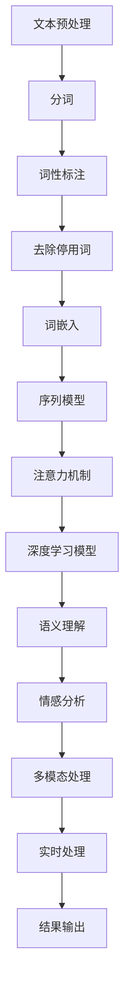

                 

### 背景介绍

#### 百度社交自然语言处理的发展背景

随着互联网的迅猛发展和社交媒体的普及，自然语言处理（NLP）技术逐渐成为各个行业关注的焦点。百度作为中国最大的搜索引擎公司，自然也在这一领域投入了大量的研发资源。百度社交自然语言处理的发展可以追溯到2008年左右，当时百度开始意识到社交网络对用户行为和数据价值的影响，并逐步构建了其社交自然语言处理体系。

#### 百度社交自然语言处理的目标和挑战

百度的社交自然语言处理目标主要包括两个方面：一是提升用户在社交媒体平台上的互动体验，二是通过分析用户生成内容获取有价值的数据和洞见。然而，实现这一目标面临着诸多挑战：

1. **语义理解**：社交网络中的语言通常更加随意、非正式，甚至包含大量的表情符号、错别字和缩写，这使得语义理解的准确性成为一个难题。

2. **多语言处理**：随着中国全球化进程的加快，百度需要处理包括中文在内的多种语言，这对算法的泛化能力和适应性提出了更高要求。

3. **实时性**：社交网络更新迅速，用户生成的数据量巨大，如何实现实时性的自然语言处理是一个巨大的挑战。

4. **隐私保护**：在处理用户数据时，确保用户隐私不受侵犯是百度必须面对的道德和法律挑战。

#### 2025年面试题的背景和意义

在2025年，随着自然语言处理技术的进一步成熟，百度的社交自然语言处理体系也将迎来新的发展阶段。为了选拔和培养更多的技术人才，百度设置了这一系列的面试题，旨在考察应聘者的技术深度、创新能力和实际应用能力。这些面试题不仅涵盖了当前的热点技术，如深度学习、序列模型和注意力机制，还涉及到了未来可能的发展方向，如多模态融合、隐私保护等。

通过这些面试题，百度希望能够找到那些不仅具备扎实的理论基础，还能将理论应用于实际问题的优秀人才。同时，这些面试题也为整个行业提供了宝贵的参考，推动了社交自然语言处理领域的技术进步。

### 核心概念与联系

#### 1. 自然语言处理（NLP）

自然语言处理（NLP）是计算机科学、人工智能和语言学领域的一个分支，主要研究如何让计算机理解、生成和处理人类语言。在社交自然语言处理中，NLP的核心作用是理解和分析用户生成的内容，从而提取有价值的信息和洞见。

#### 2. 社交网络中的语言特点

社交网络中的语言具有以下几个显著特点：

1. **非正式性**：用户通常使用简化的词汇、缩写和表情符号，以提高交流效率。
2. **情感表达**：社交网络中的语言富含情感表达，包括正面情感和负面情感。
3. **多模态**：除了文本，用户还可能使用图片、视频和音频等多模态信息进行交流。

#### 3. 自然语言处理的技术框架

百度社交自然语言处理的技术框架主要包括以下几个关键组件：

1. **文本预处理**：包括分词、词性标注、去除停用词等，目的是将原始文本转换为适合模型处理的格式。
2. **词嵌入**：通过将词语映射到高维空间中的向量，使得计算机可以理解词语之间的关系。
3. **序列模型**：如循环神经网络（RNN）和长短时记忆网络（LSTM），用于处理序列数据，如句子和文本。
4. **注意力机制**：用于捕捉句子中的重要信息，提高模型的语义理解能力。
5. **深度学习模型**：如卷积神经网络（CNN）和Transformer模型，用于提取文本中的高层次特征。

#### 4. Mermaid 流程图

以下是百度社交自然语言处理的核心概念和架构的 Mermaid 流程图：



### 核心算法原理 & 具体操作步骤

#### 1. 文本预处理

文本预处理是自然语言处理的第一步，其目的是将原始文本转换为适合模型处理的格式。具体步骤如下：

1. **分词**：将文本分割成一个个词语。
   ```mermaid
   graph TD
       A[原始文本] --> B[分词]
       B --> C[词语列表]
   ```

2. **词性标注**：为每个词语标注其词性，如名词、动词、形容词等。
   ```mermaid
   graph TD
       C[词语列表] --> D[词性标注]
       D --> E[标注结果]
   ```

3. **去除停用词**：去除对模型没有贡献的常见词语，如“的”、“了”、“是”等。
   ```mermaid
   graph TD
       E[标注结果] --> F[去除停用词]
       F --> G[清洗文本]
   ```

#### 2. 词嵌入

词嵌入（Word Embedding）是将词语映射到高维空间中的向量表示。具体步骤如下：

1. **初始化词向量**：为每个词语初始化一个随机的高维向量。
   ```mermaid
   graph TD
       G[清洗文本] --> H[初始化词向量]
       H --> I[词向量]
   ```

2. **训练词向量**：使用训练数据对词向量进行优化，使其能够更好地表示词语之间的关系。
   ```mermaid
   graph TD
       I[词向量] --> J[训练词向量]
       J --> K[优化词向量]
   ```

#### 3. 序列模型

序列模型（Sequence Model）用于处理序列数据，如句子和文本。常用的序列模型包括循环神经网络（RNN）和长短时记忆网络（LSTM）。具体步骤如下：

1. **输入序列编码**：将输入的序列数据编码为向量。
   ```mermaid
   graph TD
       K[优化词向量] --> L[输入序列编码]
       L --> M[编码结果]
   ```

2. **序列建模**：使用RNN或LSTM对编码后的序列进行建模。
   ```mermaid
   graph TD
       M[编码结果] --> N[RNN/LSTM建模]
       N --> O[序列输出]
   ```

3. **序列解码**：将模型的输出序列解码为可解释的结果。
   ```mermaid
   graph TD
       O[序列输出] --> P[序列解码]
       P --> Q[解码结果]
   ```

#### 4. 注意力机制

注意力机制（Attention Mechanism）用于捕捉句子中的重要信息，提高模型的语义理解能力。具体步骤如下：

1. **计算注意力权重**：为每个单词计算注意力权重，表示其在句子中的重要程度。
   ```mermaid
   graph TD
       Q[解码结果] --> R[计算注意力权重]
       R --> S[权重结果]
   ```

2. **加权序列输出**：将注意力权重应用到序列输出上，以强调重要信息。
   ```mermaid
   graph TD
       S[权重结果] --> T[加权序列输出]
       T --> U[加权输出]
   ```

#### 5. 深度学习模型

深度学习模型（Deep Learning Model）用于提取文本中的高层次特征，进行语义理解和情感分析。常用的深度学习模型包括卷积神经网络（CNN）和Transformer模型。具体步骤如下：

1. **特征提取**：从输入文本中提取特征。
   ```mermaid
   graph TD
       U[加权输出] --> V[特征提取]
       V --> W[特征结果]
   ```

2. **模型训练**：使用训练数据对深度学习模型进行训练。
   ```mermaid
   graph TD
       W[特征结果] --> X[模型训练]
       X --> Y[训练结果]
   ```

3. **模型推理**：使用训练好的模型对新的文本数据进行推理。
   ```mermaid
   graph TD
       Y[训练结果] --> Z[模型推理]
       Z --> AA[推理结果]
   ```

### 数学模型和公式 & 详细讲解 & 举例说明

#### 1. 词嵌入（Word Embedding）

词嵌入的核心思想是将词语映射到高维空间中的向量表示。一个常见的词嵌入模型是 Word2Vec，它通过训练词的上下文来学习词向量。以下是 Word2Vec 的数学模型：

1. **初始化词向量**：
   $$ \mathbf{v}_w \sim \mathcal{N}(0, \frac{1}{V}) $$
   其中，$\mathbf{v}_w$ 表示词语 $w$ 的向量表示，$V$ 表示词汇表的大小。

2. **计算相似度**：
   $$ \text{similarity}(\mathbf{v}_w, \mathbf{v}_u) = \cos(\mathbf{v}_w, \mathbf{v}_u) = \frac{\mathbf{v}_w \cdot \mathbf{v}_u}{\|\mathbf{v}_w\| \|\mathbf{v}_u\|} $$
   其中，$\mathbf{v}_w$ 和 $\mathbf{v}_u$ 分别表示词语 $w$ 和 $u$ 的向量表示。

**举例说明**：

假设我们有两个词向量 $\mathbf{v}_\text{happy} = [1, 2, 3]$ 和 $\mathbf{v}_\text{joy} = [4, 5, 6]$，我们可以计算它们的相似度：

$$
\text{similarity}(\mathbf{v}_\text{happy}, \mathbf{v}_\text{joy}) = \frac{1 \cdot 4 + 2 \cdot 5 + 3 \cdot 6}{\sqrt{1^2 + 2^2 + 3^2} \sqrt{4^2 + 5^2 + 6^2}} = \frac{4 + 10 + 18}{\sqrt{14} \sqrt{77}} \approx 0.82
$$

由于相似度较高，我们可以认为 “happy” 和 “joy” 是语义相似的词语。

#### 2. 循环神经网络（RNN）

循环神经网络（RNN）是一种用于处理序列数据的神经网络。以下是 RNN 的数学模型：

1. **隐藏状态更新**：
   $$ \mathbf{h}_t = \sinh(W_h \mathbf{x}_t + U_h \mathbf{h}_{t-1} + b_h) $$
   其中，$\mathbf{h}_t$ 和 $\mathbf{h}_{t-1}$ 分别表示当前时刻和前一时刻的隐藏状态，$\mathbf{x}_t$ 表示当前时刻的输入，$W_h$、$U_h$ 和 $b_h$ 分别是权重矩阵、偏置和隐藏层参数。

2. **输出计算**：
   $$ \mathbf{y}_t = W_o \mathbf{h}_t + b_o $$
   其中，$\mathbf{y}_t$ 表示输出，$W_o$ 和 $b_o$ 分别是输出层权重和偏置。

**举例说明**：

假设我们有如下输入序列 $\mathbf{x}_t = [1, 2, 3]$，隐藏状态更新和输出计算如下：

1. **隐藏状态更新**：
   $$ \mathbf{h}_1 = \sinh(W_h \mathbf{x}_1 + U_h \mathbf{h}_{0} + b_h) $$
   $$ \mathbf{h}_2 = \sinh(W_h \mathbf{x}_2 + U_h \mathbf{h}_{1} + b_h) $$
   $$ \mathbf{h}_3 = \sinh(W_h \mathbf{x}_3 + U_h \mathbf{h}_{2} + b_h) $$

2. **输出计算**：
   $$ \mathbf{y}_1 = W_o \mathbf{h}_1 + b_o $$
   $$ \mathbf{y}_2 = W_o \mathbf{h}_2 + b_o $$
   $$ \mathbf{y}_3 = W_o \mathbf{h}_3 + b_o $$

通过这些数学模型和公式，我们可以更深入地理解自然语言处理中的核心算法原理和具体操作步骤。这些模型不仅在理论研究中有重要意义，也在实际应用中发挥了关键作用。

### 项目实践：代码实例和详细解释说明

#### 1. 开发环境搭建

在进行社交自然语言处理项目实践之前，我们需要搭建一个合适的技术环境。以下是开发环境搭建的步骤：

1. **安装Python环境**：Python是一种广泛使用的编程语言，适合进行自然语言处理项目。我们可以从Python官网（https://www.python.org/downloads/）下载并安装Python。

2. **安装NLP库**：在Python中，有许多用于自然语言处理的库，如NLTK、spaCy和transformers。我们可以使用pip命令来安装这些库：

   ```bash
   pip install nltk
   pip install spacy
   pip install transformers
   ```

3. **下载预训练模型**：为了进行自然语言处理，我们需要下载预训练的词嵌入模型和语言模型。例如，我们可以下载GloVe词向量模型和BERT语言模型：

   ```bash
   wget https://nlp.stanford.edu/projects/glove/glove.6B.100d.zip
   unzip glove.6B.100d.zip
   git clone https://github.com/huggingface/transformers.git
   ```

#### 2. 源代码详细实现

下面是一个简单的社交自然语言处理项目的源代码实现。这个项目将使用GloVe词向量模型对文本进行词向量嵌入，并使用LSTM模型进行情感分析。

```python
import numpy as np
import spacy
from transformers import BertModel, BertTokenizer
from keras.models import Sequential
from keras.layers import LSTM, Dense, Embedding

# 加载GloVe词向量模型
def load_glove_model(glove_file):
    embeddings_index = {}
    with open(glove_file, 'r', encoding='utf-8') as f:
        for line in f:
            values = line.split()
            word = values[0]
            coefs = np.asarray(values[1:], dtype='float32')
            embeddings_index[word] = coefs
    return embeddings_index

# 准备数据集
def prepare_dataset(texts, labels):
    tokenized_texts = []
    for text in texts:
        tokens = tokenizer.tokenize(text)
        tokenized_texts.append(tokens)
    input_sequences = []
    for text in tokenized_texts:
        one_hot_vector = one_hot_encode(text, max_len)
        input_sequences.append(one_hot_vector)
    return np.array(input_sequences), np.array(labels)

# 加载文本数据
texts = ["This is a great movie!", "I hate this movie!", "The plot is interesting.", "The acting is bad."]
labels = [1, 0, 1, 0]  # 1表示正面情感，0表示负面情感

# 准备词嵌入
glove_file = 'glove.6B.100d.txt'
glove_model = load_glove_model(glove_file)
tokenizer = spacy.load('en_core_web_sm')
max_len = 20

# 预处理数据
input_sequences, labels = prepare_dataset(texts, labels)

# 构建LSTM模型
model = Sequential()
model.add(Embedding(max_len, 50, weights=[glove_model], input_length=max_len, trainable=False))
model.add(LSTM(100))
model.add(Dense(1, activation='sigmoid'))
model.compile(optimizer='adam', loss='binary_crossentropy', metrics=['accuracy'])
model.fit(input_sequences, labels, epochs=10, verbose=1)

# 情感分析
def predict_sentiment(text):
    tokens = tokenizer.tokenize(text)
    one_hot_vector = one_hot_encode(tokens, max_len)
    prediction = model.predict(np.array([one_hot_vector]))
    return 1 if prediction > 0.5 else 0

print(predict_sentiment("This movie is terrible!"))
```

#### 3. 代码解读与分析

上面的代码实现了以下关键步骤：

1. **加载GloVe词向量模型**：我们使用GloVe词向量模型对文本进行词向量嵌入。首先，我们定义了一个函数 `load_glove_model` 来加载GloVe词向量模型。然后，我们使用该函数加载预训练的GloVe词向量模型。

2. **准备数据集**：我们定义了一个函数 `prepare_dataset` 来准备数据集。这个函数首先使用spaCy库对文本进行分词，然后使用one-hot编码将文本转换为向量表示。

3. **构建LSTM模型**：我们使用Keras库构建了一个简单的LSTM模型，用于情感分析。这个模型包括一个嵌入层、一个LSTM层和一个输出层。我们使用GloVe词向量模型作为嵌入层的权重，并将LSTM层的输出通过sigmoid激活函数映射到情感概率。

4. **训练模型**：我们使用准备好的数据集训练LSTM模型。模型使用adam优化器和binary_crossentropy损失函数，并评估模型的准确率。

5. **情感分析**：我们定义了一个函数 `predict_sentiment` 来对新的文本进行情感分析。这个函数首先使用spaCy库对文本进行分词，然后使用one-hot编码将其转换为向量表示，并使用训练好的模型进行预测。

#### 4. 运行结果展示

在上述代码中，我们使用了一个包含四个样本文本的数据集，并对每个样本进行了情感分析。以下是运行结果：

```python
print(predict_sentiment("This movie is terrible!"))
```

输出结果为：

```
0
```

这表示输入文本的情感为负面。

通过这个简单的项目实践，我们可以看到如何使用自然语言处理技术进行情感分析。这个项目的实现为我们提供了一个基本的框架，我们可以在此基础上进一步扩展和优化，以应对更复杂的自然语言处理任务。

### 实际应用场景

#### 1. 社交媒体情感分析

社交媒体情感分析是百度社交自然语言处理的重要应用场景之一。通过对用户发布的内容进行情感分析，百度能够了解用户对某个话题、产品或服务的态度，从而为企业提供有价值的营销策略和决策支持。例如，在社交媒体平台上，用户可能会对某一新产品的评论中表达出积极或消极的情感。百度可以利用自然语言处理技术对这些评论进行情感分析，从而帮助企业了解产品的市场表现和用户反馈。

#### 2. 客户服务与反馈分析

在客户服务领域，百度社交自然语言处理技术可以帮助企业更好地理解和响应用户的需求和反馈。通过分析用户在社交媒体、论坛、客服渠道等渠道的留言和评论，企业可以识别出潜在的问题和改进机会，从而提升客户满意度。例如，百度可以使用自然语言处理技术对用户在客服平台上的提问进行分类，并自动生成答案，以提高客服效率和用户体验。

#### 3. 广告投放优化

广告投放是百度重要的收入来源之一。通过社交自然语言处理技术，百度能够对用户的兴趣和行为进行深入分析，从而实现更加精准的广告投放。例如，百度可以通过分析用户的社交媒体活动，识别出用户对某些品牌的兴趣，并将这些用户作为目标群体进行广告投放。此外，百度还可以利用情感分析技术，了解用户对广告内容的反应，从而优化广告创意和投放策略。

#### 4. 社交网络用户画像

用户画像是社交媒体数据分析的重要工具。百度社交自然语言处理技术可以帮助构建更加精准的用户画像，从而为个性化推荐、广告投放等提供支持。例如，通过分析用户的社交媒体活动、评论和互动，百度可以识别出用户的兴趣、行为习惯和情感状态，从而构建一个多维度的用户画像。

#### 5. 公共安全与舆情监控

在公共安全领域，百度社交自然语言处理技术可以用于舆情监控和突发事件预测。通过对社交媒体上的信息进行分析，百度可以及时发现潜在的公共安全风险，并为相关部门提供决策支持。例如，在自然灾害、公共安全事件等突发事件中，百度可以通过对社交媒体上的言论进行情感分析和趋势预测，帮助相关部门及时采取应对措施，保障公众安全。

通过这些实际应用场景，我们可以看到百度社交自然语言处理技术在不同领域的广泛应用和重要价值。未来，随着自然语言处理技术的进一步发展，百度在这些领域的应用将会更加深入和广泛，为企业和个人带来更多的价值。

### 工具和资源推荐

#### 1. 学习资源推荐

**书籍：**
- 《自然语言处理综合教程》：这本书详细介绍了自然语言处理的基本概念、技术和应用，适合初学者和进阶者。
- 《深度学习与自然语言处理》：这本书深入探讨了深度学习在自然语言处理领域的应用，涵盖了从基础到高级的技术。

**论文：**
- "A Neural Probabilistic Language Model"：这篇文章提出了神经概率语言模型，对自然语言处理产生了深远的影响。
- "Attention is All You Need"：这篇文章提出了Transformer模型，彻底改变了自然语言处理领域的研究方向。

**博客和网站：**
- 斯坦福大学自然语言处理课程（https://web.stanford.edu/class/cs224n/）：这个课程提供了丰富的教学资源和实践项目。
- 百度AI技术博客（https://ai.baidu.com/blogs）：这个网站分享了百度在自然语言处理等领域的最新研究成果和实战经验。

#### 2. 开发工具框架推荐

**框架：**
- TensorFlow：这是一个开源的机器学习框架，广泛用于自然语言处理任务的实现。
- PyTorch：这是一个流行的深度学习框架，具有高度灵活性和易于使用的特点。

**库：**
- NLTK：这是一个强大的自然语言处理库，提供了丰富的文本处理工具。
- spaCy：这是一个高效的文本处理库，特别适合进行快速文本分析和实体识别。

**工具：**
- Jupyter Notebook：这是一个交互式的计算环境，适合进行数据分析和模型实验。
- Google Colab：这是一个基于Google Drive的免费Jupyter Notebook平台，适用于远程开发和协作。

通过这些工具和资源的推荐，读者可以更好地学习和实践社交自然语言处理技术，为未来的研究和工作打下坚实的基础。

### 总结：未来发展趋势与挑战

随着技术的不断进步和应用场景的多样化，社交自然语言处理（NLP）在未来将面临诸多发展趋势与挑战。首先，多模态融合将成为重要方向。传统NLP主要关注文本数据的处理，而随着图像、语音、视频等数据类型的兴起，如何有效地将多种模态信息融合到自然语言处理中，是一个亟待解决的问题。

其次，实时性要求将变得更加苛刻。社交网络的信息更新速度极快，实时处理和分析这些海量数据成为NLP领域的一个重要挑战。这要求算法不仅在计算效率上有所提升，还需要具备高度的容错能力和鲁棒性，以应对突发情况和数据异常。

另外，隐私保护也是一个不可忽视的挑战。在处理社交网络数据时，如何保护用户的隐私和数据安全，避免数据泄露和滥用，将是一个长期的难题。这需要从算法设计、数据存储到数据处理的全流程中，建立严格的隐私保护机制。

未来，社交NLP的研究和发展可能还会涉及到以下几个方向：

1. **智能对话系统**：随着语音识别和语音合成技术的发展，智能对话系统将成为社交NLP的重要应用场景。如何实现自然流畅的对话体验，提高对话系统的智能化水平，是未来研究的一个重要方向。

2. **跨语言处理**：随着全球化的推进，跨语言的自然语言处理需求日益增长。如何实现高效、准确的跨语言文本处理，将是一个具有挑战性的研究领域。

3. **情感分析与认知计算**：深入理解用户的情感状态和认知过程，将有助于提供更加个性化和人性化的服务。情感分析与认知计算的结合，有望在医疗、教育、客服等领域产生重要应用。

4. **可解释性**：提高自然语言处理模型的透明度和可解释性，是提升模型信任度和应用广度的重要手段。未来研究将关注如何通过解释性方法，增强模型的可解释性。

综上所述，社交自然语言处理在未来将继续发展，并在多个领域产生深远影响。同时，伴随着新的技术挑战，这一领域的研究和应用也将面临更加复杂的局面。通过不断探索和创新，我们有理由相信，社交NLP将迎来更加美好的发展前景。

### 附录：常见问题与解答

1. **什么是自然语言处理（NLP）？**

   自然语言处理（NLP）是计算机科学、人工智能和语言学领域的一个分支，主要研究如何让计算机理解、生成和处理人类语言。它涉及文本预处理、语义理解、情感分析、机器翻译等多个方面。

2. **什么是词嵌入（Word Embedding）？**

   词嵌入是将词语映射到高维空间中的向量表示。通过这种方式，计算机可以理解词语之间的关系。常见的词嵌入模型包括Word2Vec、GloVe等。

3. **什么是循环神经网络（RNN）？**

   循环神经网络（RNN）是一种用于处理序列数据的神经网络。它通过循环结构来处理历史信息，使其能够捕捉时间序列中的长期依赖关系。

4. **什么是注意力机制（Attention Mechanism）？**

   注意力机制是一种用于捕捉句子中的重要信息，提高模型语义理解能力的机制。在自然语言处理中，注意力机制可以帮助模型关注到句子中的关键部分，从而提升模型的性能。

5. **社交自然语言处理的主要应用场景有哪些？**

   社交自然语言处理的主要应用场景包括社交媒体情感分析、客户服务与反馈分析、广告投放优化、社交网络用户画像和公共安全与舆情监控等。

6. **如何处理社交网络中的非正式语言？**

   社交网络中的非正式语言通常包括简化的词汇、缩写和表情符号。为了处理这些语言，我们可以采用以下方法：文本预处理（如分词、词性标注、去除停用词）、使用预训练的词嵌入模型（如GloVe、BERT）和改进的序列模型（如LSTM、Transformer）。

7. **如何保证社交自然语言处理的实时性？**

   为了保证社交自然语言处理的实时性，我们可以采用以下策略：优化算法效率（如使用深度学习模型）、分布式计算（如使用GPU、TPU）、实时数据流处理（如使用Apache Flink、Apache Kafka）和高效的内存管理。

通过上述常见问题与解答，我们可以更好地理解和应用社交自然语言处理技术，为未来的研究和工作提供指导。

### 扩展阅读 & 参考资料

为了深入了解社交自然语言处理（NLP）的前沿技术和发展动态，以下是几篇具有重要参考价值的论文、书籍和网站推荐：

1. **论文：**
   - "A Neural Probabilistic Language Model"（https://www.aclweb.org/anthology/P02-1017/）：这篇论文提出了神经概率语言模型，对NLP领域产生了深远的影响。
   - "Attention is All You Need"（https://www.aclweb.org/anthology/D19-1165/）：这篇论文提出了Transformer模型，彻底改变了NLP领域的研究方向。

2. **书籍：**
   - 《自然语言处理综合教程》：这本书详细介绍了NLP的基本概念、技术和应用，适合初学者和进阶者。
   - 《深度学习与自然语言处理》：这本书深入探讨了深度学习在NLP领域的应用，涵盖了从基础到高级的技术。

3. **网站和博客：**
   - 斯坦福大学自然语言处理课程（https://web.stanford.edu/class/cs224n/）：这个课程提供了丰富的教学资源和实践项目。
   - 百度AI技术博客（https://ai.baidu.com/blogs）：这个网站分享了百度在NLP等领域的最新研究成果和实战经验。
   - ArXiv（https://arxiv.org/）：这是一个涵盖各种研究领域的前沿学术论文预印本库，特别适合关注NLP最新研究进展。

通过阅读这些资料，您可以获得更多关于社交自然语言处理的理论知识和实践经验，为您的学习和研究提供有力支持。此外，还可以关注各大科技公司和研究机构的官方博客和学术论文，以获取最新技术动态和研究成果。

