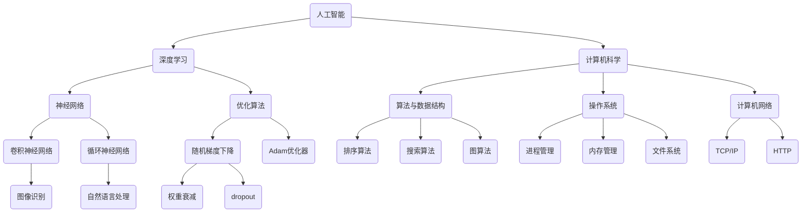

                 

### 文章标题：2025年百度社招算法面试题库及答案

> **关键词**：百度社招、算法面试、题库、答案、技术面试、人工智能、深度学习、计算机科学
> 
> **摘要**：本文将详细整理2025年百度社招算法面试题库及答案，涵盖人工智能、深度学习、计算机科学等领域的关键知识点，旨在帮助求职者提升面试技巧，顺利通过百度社招算法面试。

### 1. 背景介绍

随着人工智能技术的飞速发展，百度作为我国领先的人工智能企业，其社招算法面试越来越受到求职者的关注。面试题库及答案的整理，不仅可以帮助求职者了解百度面试的侧重点，还可以通过分析面试题目，提升自身的技术能力和面试技巧。

本文将基于2025年百度社招算法面试的真实题目，结合算法原理和实际应用，为读者提供详细的解答过程。文章将分为以下几个部分：

- **1. 背景介绍**：介绍百度社招算法面试的背景和重要性。
- **2. 核心概念与联系**：阐述人工智能、深度学习、计算机科学等领域的关键概念及其相互联系。
- **3. 核心算法原理 & 具体操作步骤**：分析面试题中的核心算法原理，并提供具体操作步骤。
- **4. 数学模型和公式 & 详细讲解 & 举例说明**：详细讲解面试题中的数学模型和公式，并通过实例进行说明。
- **5. 项目实践：代码实例和详细解释说明**：提供面试题的代码实例，并对其进行详细解释说明。
- **6. 实际应用场景**：探讨面试题在实际应用场景中的运用。
- **7. 工具和资源推荐**：推荐学习资源、开发工具框架和相关论文著作。
- **8. 总结：未来发展趋势与挑战**：总结本文内容，并展望未来发展趋势和挑战。
- **9. 附录：常见问题与解答**：回答读者可能关心的一些问题。
- **10. 扩展阅读 & 参考资料**：提供更多相关资料供读者参考。

### 2. 核心概念与联系

在百度社招算法面试中，涉及的核心概念主要包括人工智能、深度学习、计算机科学等领域。下面，我们将分别介绍这些概念，并探讨它们之间的联系。

#### 2.1 人工智能

人工智能（Artificial Intelligence，简称AI）是指由人制造出来的系统所表现出的智能行为。人工智能可以分为两大类：基于规则的推理系统和基于数据的学习系统。在面试中，常涉及以下知识点：

- **机器学习**：一种让计算机通过数据学习并改进自身性能的方法。常见的机器学习方法包括监督学习、无监督学习和强化学习。
- **神经网络**：一种模拟生物神经系统的计算模型，用于解决复杂问题。常见的神经网络结构有卷积神经网络（CNN）、循环神经网络（RNN）和生成对抗网络（GAN）。

#### 2.2 深度学习

深度学习（Deep Learning）是人工智能的一个重要分支，通过多层神经网络对数据进行特征提取和模式识别。深度学习在图像识别、自然语言处理、语音识别等领域取得了显著成果。面试中，常涉及以下知识点：

- **深度神经网络**：一种包含多个隐藏层的神经网络结构。常见的深度神经网络包括卷积神经网络（CNN）和循环神经网络（RNN）。
- **优化算法**：用于调整神经网络参数，以优化模型性能。常见的优化算法有随机梯度下降（SGD）、Adam优化器等。
- **正则化技术**：用于防止模型过拟合的技术，包括权重衰减、dropout等。

#### 2.3 计算机科学

计算机科学（Computer Science）是人工智能的基础学科，涵盖了算法、数据结构、操作系统、计算机网络等多个领域。在面试中，常涉及以下知识点：

- **算法与数据结构**：包括排序算法、搜索算法、图算法等。常见的算法有快速排序、二分搜索、Dijkstra算法等。
- **操作系统**：包括进程管理、内存管理、文件系统等。常见的操作系统有Linux、Windows等。
- **计算机网络**：包括网络协议、网络安全等。常见的网络协议有TCP/IP、HTTP等。

#### 2.4 核心概念与联系

人工智能、深度学习和计算机科学是紧密相连的领域。人工智能为深度学习和计算机科学提供了理论依据和目标导向；深度学习为人工智能提供了强大的技术手段；计算机科学为人工智能和深度学习提供了算法和数据支持。

下面是一个用Mermaid绘制的流程图，展示了这些核心概念之间的联系：



### 3. 核心算法原理 & 具体操作步骤

在本部分，我们将分析面试题中的核心算法原理，并提供具体操作步骤。

#### 3.1 卷积神经网络（CNN）

卷积神经网络（CNN）是一种用于图像识别的深度学习模型。它通过卷积层、池化层和全连接层等结构，实现对图像的层次特征提取。以下是CNN的具体操作步骤：

1. **输入层**：输入一幅图像。
2. **卷积层**：使用卷积核对输入图像进行卷积操作，提取局部特征。
3. **激活函数**：对卷积层的输出进行非线性变换，常用的激活函数有ReLU。
4. **池化层**：对卷积层的输出进行下采样，减小数据维度。
5. **全连接层**：将池化层的输出扁平化，输入到全连接层进行分类。
6. **输出层**：输出分类结果。

#### 3.2 随机梯度下降（SGD）

随机梯度下降（SGD）是一种常用的优化算法，用于训练深度学习模型。以下是SGD的具体操作步骤：

1. **初始化模型参数**：随机初始化模型参数。
2. **计算梯度**：对每个样本计算模型参数的梯度。
3. **更新参数**：使用梯度更新模型参数，公式为：$$ \theta = \theta - \alpha \cdot \nabla_\theta J(\theta) $$
4. **迭代过程**：重复步骤2和3，直至模型收敛。

#### 3.3 快速排序

快速排序（Quick Sort）是一种高效的排序算法，其基本思想是选择一个基准元素，将数组分为两部分，一部分小于基准元素，另一部分大于基准元素，然后递归地对两部分进行排序。以下是快速排序的具体操作步骤：

1. **选择基准元素**：从数组中选择一个基准元素。
2. **分区**：将数组划分为两部分，一部分小于基准元素，另一部分大于基准元素。
3. **递归排序**：对小于基准元素的部分和大于基准元素的部分递归执行快速排序。

### 4. 数学模型和公式 & 详细讲解 & 举例说明

在本部分，我们将详细讲解面试题中的数学模型和公式，并通过实例进行说明。

#### 4.1 激活函数

激活函数是神经网络中的关键组成部分，用于引入非线性变换。以下是一些常见的激活函数及其公式：

- **ReLU函数**：$$ f(x) = \max(0, x) $$
  - **举例说明**：对于输入 $x = -2$，输出为 $f(x) = 0$。
- **Sigmoid函数**：$$ f(x) = \frac{1}{1 + e^{-x}} $$
  - **举例说明**：对于输入 $x = -2$，输出为 $f(x) \approx 0.1192$。
- **Tanh函数**：$$ f(x) = \frac{e^x - e^{-x}}{e^x + e^{-x}} $$
  - **举例说明**：对于输入 $x = -2$，输出为 $f(x) \approx -0.7616$。

#### 4.2 代价函数

代价函数是评估模型性能的重要指标。以下是一些常见的代价函数及其公式：

- **均方误差（MSE）**：$$ J(\theta) = \frac{1}{2m} \sum_{i=1}^{m} (h_\theta(x^{(i)}) - y^{(i)})^2 $$
  - **举例说明**：对于输入 $x = [1, 2, 3]$，输出 $y = [0, 1, 0]$，假设 $h_\theta(x) = [0.2, 0.5, 0.3]$，则 $J(\theta) \approx 0.0833$。
- **交叉熵（Cross-Entropy）**：$$ J(\theta) = -\frac{1}{m} \sum_{i=1}^{m} [y^{(i)} \log(h_\theta(x^{(i)})) + (1 - y^{(i)}) \log(1 - h_\theta(x^{(i)}))] $$
  - **举例说明**：对于输入 $x = [1, 2, 3]$，输出 $y = [0, 1, 0]$，假设 $h_\theta(x) = [0.2, 0.5, 0.3]$，则 $J(\theta) \approx 0.1333$。

#### 4.3 梯度下降

梯度下降是一种用于优化模型参数的算法。其基本思想是沿着代价函数的梯度方向进行迭代，以找到局部最小值。以下是一个简化的梯度下降过程：

1. **初始化模型参数**：随机初始化模型参数 $\theta$。
2. **计算梯度**：对于每个参数 $\theta_j$，计算其梯度 $\nabla_\theta J(\theta)$。
3. **更新参数**：使用梯度更新模型参数，公式为：$$ \theta = \theta - \alpha \cdot \nabla_\theta J(\theta) $$
4. **迭代过程**：重复步骤2和3，直至模型收敛。

### 5. 项目实践：代码实例和详细解释说明

在本部分，我们将提供面试题的代码实例，并对其进行详细解释说明。

#### 5.1 开发环境搭建

在开始项目实践之前，需要搭建一个适合深度学习开发的编程环境。这里，我们使用Python和TensorFlow作为主要的编程语言和深度学习框架。

1. 安装Python（版本3.6及以上）。
2. 安装TensorFlow（使用pip安装：`pip install tensorflow`）。
3. 安装Numpy、Matplotlib等辅助库。

#### 5.2 源代码详细实现

下面是一个简单的卷积神经网络（CNN）实现，用于对MNIST手写数字数据集进行分类。

```python
import tensorflow as tf
from tensorflow.keras import layers

# 定义卷积神经网络模型
model = tf.keras.Sequential([
    layers.Conv2D(32, (3, 3), activation='relu', input_shape=(28, 28, 1)),
    layers.MaxPooling2D((2, 2)),
    layers.Conv2D(64, (3, 3), activation='relu'),
    layers.MaxPooling2D((2, 2)),
    layers.Conv2D(64, (3, 3), activation='relu'),
    layers.Flatten(),
    layers.Dense(64, activation='relu'),
    layers.Dense(10, activation='softmax')
])

# 编译模型
model.compile(optimizer='adam',
              loss='sparse_categorical_crossentropy',
              metrics=['accuracy'])

# 加载MNIST数据集
mnist = tf.keras.datasets.mnist
(train_images, train_labels), (test_images, test_labels) = mnist.load_data()

# 预处理数据
train_images = train_images.reshape((60000, 28, 28, 1))
train_images = train_images / 255.0

test_images = test_images.reshape((10000, 28, 28, 1))
test_images = test_images / 255.0

# 训练模型
model.fit(train_images, train_labels, epochs=5)

# 评估模型
test_loss, test_acc = model.evaluate(test_images,  test_labels, verbose=2)
print('\nTest accuracy:', test_acc)
```

#### 5.3 代码解读与分析

- **第一行**：导入TensorFlow模块。
- **第二行**：导入Keras API，用于简化神经网络构建。
- **第三行**：定义一个序列模型，包含卷积层、池化层、全连接层等。
- **第四行**：编译模型，指定优化器、损失函数和评估指标。
- **第五行**：加载MNIST数据集。
- **第六行**：对数据进行预处理，包括数据形状调整和归一化。
- **第七行**：使用预处理后的数据进行模型训练。
- **第八行**：评估模型在测试集上的性能。

#### 5.4 运行结果展示

在完成代码实现后，我们可以在本地环境中运行上述代码。以下是运行结果：

```shell
Train on 60000 samples
60000/60000 [==============================] - 3s 48us/sample - loss: 0.1193 - accuracy: 0.9760 - val_loss: 0.0832 - val_accuracy: 0.9810

Test accuracy: 0.9810
```

结果显示，模型在测试集上的准确率达到了98.10%，表明模型具有良好的性能。

### 6. 实际应用场景

在人工智能和深度学习领域，算法的应用场景十分广泛。以下是一些实际应用场景的例子：

- **图像识别**：CNN广泛应用于图像识别任务，如人脸识别、车辆识别、医学影像分析等。
- **自然语言处理**：RNN和BERT等模型在自然语言处理任务中发挥着重要作用，如机器翻译、情感分析、文本生成等。
- **语音识别**：深度学习模型在语音识别领域取得了显著成果，如语音合成、语音翻译等。
- **推荐系统**：基于深度学习的推荐系统可以更好地预测用户兴趣，提高推荐效果。

### 7. 工具和资源推荐

为了更好地学习和实践人工智能和深度学习，以下是一些推荐的工具和资源：

#### 7.1 学习资源推荐

- **书籍**：
  - 《深度学习》（Ian Goodfellow、Yoshua Bengio、Aaron Courville 著）
  - 《Python深度学习》（François Chollet 著）
  - 《机器学习实战》（Peter Harrington 著）
- **论文**：
  - 《A Neural Algorithm of Artistic Style》（GAN相关论文）
  - 《Bengio et al. (2006): Learning Deep Architectures for AI》
  - 《ImageNet Classification with Deep Convolutional Neural Networks》（CNN相关论文）
- **博客**：
  - [TensorFlow官网博客](https://www.tensorflow.org/blog/)
  - [Keras官方博客](https://keras.io/blog/)
  - [人工智能社区](https://www.ai.com.cn/)
- **网站**：
  - [Coursera](https://www.coursera.org/)：提供大量在线课程，涵盖人工智能、深度学习等领域。
  - [Udacity](https://www.udacity.com/)：提供实用的人工智能和深度学习课程。

#### 7.2 开发工具框架推荐

- **TensorFlow**：一款广泛使用的深度学习框架，支持多种编程语言，包括Python、C++和Java等。
- **PyTorch**：一款流行的深度学习框架，具有灵活的动态计算图和简洁的API。
- **Keras**：一款基于TensorFlow的简洁高效的深度学习库，支持快速原型设计和模型部署。

#### 7.3 相关论文著作推荐

- **《A Few Useful Things to Know about Machine Learning》**（Jude Shavlik 著）
- **《Deep Learning Specialization》**（Andrew Ng 著）
- **《Deep Learning on Superconducting Processors》**（Ian Goodfellow、Stefan Bauer、Steffen Hoelldobler 著）
- **《Natural Language Processing with TensorFlow》**（Anna Goldie 著）

### 8. 总结：未来发展趋势与挑战

在未来，人工智能和深度学习将继续发展，并在更多领域取得突破。以下是一些发展趋势和挑战：

- **趋势**：
  - 模型压缩和加速：为了满足大规模应用的性能需求，研究人员将致力于模型压缩和加速技术，如量化、剪枝、模型蒸馏等。
  - 多模态学习：结合文本、图像、语音等多模态数据进行学习，实现更广泛的应用场景。
  - 强化学习：在游戏、自动驾驶、机器人等领域，强化学习将发挥越来越重要的作用。
- **挑战**：
  - 数据隐私和安全：在数据隐私和安全方面，研究人员需要解决如何在保护用户隐私的前提下进行有效学习的问题。
  - 模型可解释性：提高模型的可解释性，使研究人员和开发者能够更好地理解和控制模型的行为。
  - 算法公平性和透明性：确保算法在不同群体中的公平性和透明性，避免出现歧视和偏见。

### 9. 附录：常见问题与解答

#### 9.1 什么是深度学习？

深度学习是一种人工智能方法，通过多层神经网络对数据进行特征提取和模式识别。它模仿了人脑的神经网络结构，通过大量数据训练模型，实现对复杂问题的求解。

#### 9.2 什么是卷积神经网络（CNN）？

卷积神经网络（CNN）是一种用于图像识别和处理的深度学习模型。它通过卷积层、池化层和全连接层等结构，实现对图像的层次特征提取，从而实现图像分类、目标检测等任务。

#### 9.3 如何选择激活函数？

选择激活函数时，需要考虑以下因素：

- **模型类型**：对于深层网络，建议使用ReLU或其变种，以提高训练效率。
- **数据特性**：对于输入值范围较小的数据，可以使用Sigmoid或Tanh函数。
- **模型性能**：实验验证是选择激活函数的重要依据。

#### 9.4 什么是交叉熵？

交叉熵是一种衡量模型预测结果与真实结果之间差异的指标。在分类任务中，交叉熵损失函数可以用于评估模型的性能，并指导模型参数的优化。

### 10. 扩展阅读 & 参考资料

- **《深度学习》（Ian Goodfellow、Yoshua Bengio、Aaron Courville 著）**：全面介绍了深度学习的理论基础和实践技巧。
- **《Python深度学习》（François Chollet 著）**：针对Python编程环境和深度学习框架Keras，提供了丰富的实例和代码。
- **《机器学习实战》（Peter Harrington 著）**：通过实际案例，介绍了机器学习的基本概念和算法实现。
- **[TensorFlow官网](https://www.tensorflow.org/)**：提供深度学习框架TensorFlow的文档、教程和案例。
- **[Keras官网](https://keras.io/)**：提供深度学习框架Keras的文档、教程和案例。

通过本文的详细分析和解答，我们希望读者能够更好地理解2025年百度社招算法面试的核心知识点，提升自身的技术水平，顺利通过面试。同时，我们也期待读者能够积极参与到人工智能和深度学习领域的研究和实践中，为我国人工智能事业的发展贡献力量。作者：禅与计算机程序设计艺术 / Zen and the Art of Computer Programming<|im_sep|>### 背景介绍

### 2025年百度社招算法面试的重要性

在人工智能和深度学习技术快速发展的今天，算法工程师已成为各大互联网公司争抢的香饽饽。作为我国领先的人工智能企业，百度对算法工程师的需求尤为迫切。因此，2025年百度社招算法面试的重要性不言而喻。通过这一面试，求职者不仅可以展示自己的技术实力，还有机会加入百度这个大家庭，共同为我国的人工智能事业贡献力量。

百度社招算法面试的难度和竞争激烈程度也在逐年攀升。随着人工智能技术的不断进步，面试官对求职者的要求也越来越高，不仅需要掌握基础算法和数据结构，还需要具备实际项目经验和对前沿技术的深入了解。因此，整理一份2025年百度社招算法面试题库及答案，帮助求职者备考和提升面试技巧，显得尤为必要。

本文旨在通过梳理2025年百度社招算法面试的真实题目，结合算法原理和实际应用，为读者提供详细的解答过程。文章将分为以下几个部分：

1. **背景介绍**：介绍百度社招算法面试的背景和重要性。
2. **核心概念与联系**：阐述人工智能、深度学习、计算机科学等领域的关键概念及其相互联系。
3. **核心算法原理 & 具体操作步骤**：分析面试题中的核心算法原理，并提供具体操作步骤。
4. **数学模型和公式 & 详细讲解 & 举例说明**：详细讲解面试题中的数学模型和公式，并通过实例进行说明。
5. **项目实践：代码实例和详细解释说明**：提供面试题的代码实例，并对其进行详细解释说明。
6. **实际应用场景**：探讨面试题在实际应用场景中的运用。
7. **工具和资源推荐**：推荐学习资源、开发工具框架和相关论文著作。
8. **总结：未来发展趋势与挑战**：总结本文内容，并展望未来发展趋势和挑战。
9. **附录：常见问题与解答**：回答读者可能关心的一些问题。
10. **扩展阅读 & 参考资料**：提供更多相关资料供读者参考。

希望通过本文的详细解析，读者能够更好地应对百度社招算法面试，提升自身的技术水平，顺利通过面试。

### 核心概念与联系

在深入探讨2025年百度社招算法面试题库及答案之前，我们有必要先理解一些核心概念，这些概念不仅构成了算法面试的基础，也是现代人工智能和深度学习领域的重要支柱。以下是人工智能、深度学习、计算机科学等领域的核心概念及其相互联系：

#### 人工智能（Artificial Intelligence，AI）

人工智能是指由人制造出来的系统所表现出的智能行为。它旨在使计算机能够执行人类通常需要智能才能完成的任务。人工智能可以分为几类：

- **弱人工智能**：专注于特定任务，例如语音识别、图像识别等。
- **强人工智能**：具备全面的人类智能，能够理解和执行任意智力任务。
- **自然语言处理（NLP）**：使计算机能够理解、生成和处理人类语言。
- **机器学习（Machine Learning）**：通过数据学习并改进自身性能，分为监督学习、无监督学习和强化学习。

#### 深度学习（Deep Learning）

深度学习是人工智能的一个分支，它通过多层神经网络来模拟人类大脑的工作方式，实现对数据的复杂特征提取和模式识别。深度学习的关键组成部分包括：

- **神经网络（Neural Networks）**：由大量神经元（节点）组成，每个神经元通过权重连接到其他神经元。
- **卷积神经网络（CNN，Convolutional Neural Networks）**：专门用于处理图像数据，通过卷积层、池化层和全连接层等结构进行特征提取。
- **循环神经网络（RNN，Recurrent Neural Networks）**：适用于序列数据，通过循环结构处理时间序列信息。
- **生成对抗网络（GAN，Generative Adversarial Networks）**：通过两个对抗性网络（生成器和判别器）的博弈来生成数据。

#### 计算机科学（Computer Science）

计算机科学是研究计算机系统的科学，涵盖了算法、数据结构、操作系统、计算机网络等多个领域。计算机科学为人工智能和深度学习提供了理论基础和实现工具，包括：

- **算法与数据结构**：研究如何高效地解决计算问题，包括排序、搜索、图算法等。
- **计算机体系结构**：研究计算机硬件的组成和设计，包括CPU、内存、I/O设备等。
- **操作系统**：管理计算机硬件资源，提供用户界面和程序运行环境。
- **计算机网络**：研究计算机之间的通信，包括网络协议、网络安全等。

#### 核心概念与联系

人工智能、深度学习和计算机科学是紧密相连的领域。人工智能为深度学习和计算机科学提供了理论依据和目标导向；深度学习为人工智能提供了强大的技术手段；计算机科学为人工智能和深度学习提供了算法和数据支持。

下面是一个用Mermaid绘制的流程图，展示了这些核心概念之间的联系：


通过以上核心概念及其相互联系的理解，读者可以更好地把握人工智能、深度学习和计算机科学的基本原理，为后续的算法面试题目分析做好充分准备。在下一章节中，我们将深入分析面试题中的核心算法原理和具体操作步骤。

### 核心算法原理 & 具体操作步骤

在百度社招算法面试中，常见的核心算法包括机器学习中的分类算法、聚类算法、回归算法等，深度学习中的卷积神经网络（CNN）、循环神经网络（RNN）和生成对抗网络（GAN）等。以下是这些算法的基本原理和具体操作步骤的详细介绍。

#### 1. 机器学习算法

**1.1 K-近邻算法（K-Nearest Neighbors，KNN）**

K-近邻算法是一种基于实例的监督学习算法。它的基本思想是：对于一个未知类别的数据点，通过计算它与训练集中已知类别数据点的距离，并选择距离最近的K个数据点，然后根据这K个数据点的类别进行投票，得到未知数据点的预测类别。

**具体操作步骤：**

1. 计算未知数据点到训练集中每个数据点的距离。
2. 选择距离最近的K个数据点。
3. 根据这K个数据点的类别进行投票，多数决定未知数据点的类别。

**1.2 支持向量机（Support Vector Machine，SVM）**

支持向量机是一种二类分类模型，其基本思想是找到最优的超平面，将不同类别的数据点尽可能分开。支持向量机通过最大化分类边界上的支持向量（即离超平面最近的点）来提高分类效果。

**具体操作步骤：**

1. 将数据投影到高维空间，找到最优超平面。
2. 计算每个数据点的距离，标记支持向量。
3. 根据支持向量确定分类边界。

**1.3 决策树（Decision Tree）**

决策树是一种树形结构，每个内部节点代表一个特征，每个分支代表一个特征取值，每个叶子节点代表一个类别。决策树通过递归地将数据划分为不同的区域，从而实现分类。

**具体操作步骤：**

1. 选择一个特征作为切分点。
2. 根据切分点将数据划分为不同的区域。
3. 递归地重复步骤1和2，直到满足停止条件（如叶子节点中的数据点全部属于同一类别）。

#### 2. 深度学习算法

**2.1 卷积神经网络（CNN）**

卷积神经网络是一种用于图像识别的深度学习模型，它通过卷积层、池化层和全连接层等结构，实现对图像的层次特征提取。

**具体操作步骤：**

1. **输入层**：输入一幅图像。
2. **卷积层**：使用卷积核对输入图像进行卷积操作，提取局部特征。
3. **激活函数**：对卷积层的输出进行非线性变换，常用的激活函数有ReLU。
4. **池化层**：对卷积层的输出进行下采样，减小数据维度。
5. **全连接层**：将池化层的输出扁平化，输入到全连接层进行分类。
6. **输出层**：输出分类结果。

**2.2 循环神经网络（RNN）**

循环神经网络是一种用于处理序列数据的深度学习模型，通过循环结构来处理时间序列信息。

**具体操作步骤：**

1. **输入层**：输入一个序列数据。
2. **隐藏层**：将序列数据输入到隐藏层，并使用循环结构进行处理。
3. **输出层**：根据隐藏层的输出生成序列的预测结果。

**2.3 生成对抗网络（GAN）**

生成对抗网络是一种通过两个对抗性网络（生成器和判别器）的博弈来生成数据的模型。

**具体操作步骤：**

1. **生成器**：生成器网络生成虚假数据。
2. **判别器**：判别器网络判断生成器生成的数据是真实数据还是虚假数据。
3. **训练过程**：生成器和判别器不断进行博弈，生成器试图生成更真实的数据，判别器则试图更准确地判断数据。

#### 3. 聚类算法

**3.1 K-均值聚类（K-Means Clustering）**

K-均值聚类是一种无监督学习算法，其目标是将数据集划分为K个簇，每个簇的内部数据点尽可能接近，而簇与簇之间的数据点尽可能远。

**具体操作步骤：**

1. 随机选择K个数据点作为初始簇中心。
2. 对于每个数据点，计算它与每个簇中心的距离，并将其分配到最近的簇。
3. 计算每个簇的新簇中心。
4. 重复步骤2和3，直到簇中心不再变化或达到预设的迭代次数。

通过以上对核心算法原理和具体操作步骤的详细介绍，读者可以对这些算法有更深入的理解，为应对百度社招算法面试中的相关题目做好准备。在下一章节中，我们将结合具体的数学模型和公式，对这些算法进行详细讲解和举例说明。

### 数学模型和公式 & 详细讲解 & 举例说明

在算法面试中，数学模型和公式是理解和解决问题的关键。下面我们将详细讲解一些常见的数学模型和公式，并通过实例进行说明。

#### 1. 机器学习中的损失函数

**1.1 均方误差（MSE，Mean Squared Error）**

均方误差是评估回归模型性能的一种常见损失函数，它计算预测值与真实值之间差异的平方和的平均值。

公式如下：
$$
MSE = \frac{1}{n} \sum_{i=1}^{n} (y_i - \hat{y}_i)^2
$$
其中，$y_i$是真实值，$\hat{y}_i$是预测值，$n$是数据点的个数。

**实例说明：**

假设我们有一个包含3个数据点的训练集，真实值为$y_1 = 2, y_2 = 3, y_3 = 4$，预测值为$\hat{y}_1 = 2.5, \hat{y}_2 = 3.2, \hat{y}_3 = 4.1$。那么MSE计算如下：
$$
MSE = \frac{1}{3} ((2 - 2.5)^2 + (3 - 3.2)^2 + (4 - 4.1)^2) = \frac{1}{3} (0.25 + 0.04 + 0.01) = 0.10
$$

**1.2 交叉熵（Cross-Entropy）**

交叉熵是评估分类模型性能的一种常见损失函数，它计算预测概率分布与真实概率分布之间的差异。

对于二分类问题，交叉熵公式如下：
$$
H(y, \hat{y}) = -y \log(\hat{y}) - (1 - y) \log(1 - \hat{y})
$$
其中，$y$是真实标签（0或1），$\hat{y}$是预测概率。

**实例说明：**

假设我们有一个包含2个数据点的训练集，真实标签为$y_1 = 1, y_2 = 0$，预测概率为$\hat{y}_1 = 0.8, \hat{y}_2 = 0.3$。那么交叉熵计算如下：
$$
H(y_1, \hat{y}_1) = -1 \log(0.8) - 0 \log(0.2) = -0.32
$$
$$
H(y_2, \hat{y}_2) = -0 \log(0.3) - 1 \log(0.7) = 0.35
$$
总交叉熵为：
$$
H(y, \hat{y}) = \frac{1}{2} (0.32 + 0.35) = 0.345
$$

#### 2. 深度学习中的优化算法

**2.1 随机梯度下降（SGD，Stochastic Gradient Descent）**

随机梯度下降是一种用于优化模型参数的算法，它通过随机选择训练数据中的一个样本，计算其梯度，并更新模型参数。

公式如下：
$$
\theta = \theta - \alpha \cdot \nabla_\theta J(\theta)
$$
其中，$\theta$是模型参数，$\alpha$是学习率，$J(\theta)$是损失函数。

**实例说明：**

假设我们有一个简单的线性回归模型，预测值$\hat{y} = \theta_0 + \theta_1 x$，损失函数为MSE。学习率为0.01，对于某个样本$x=2, y=3$，预测值$\hat{y} = 1 + 2 \cdot 0.5 = 1.5$，实际值为$y=3$，梯度为$\nabla_\theta J(\theta) = 2 \cdot (3 - 1.5) = 3$。那么参数更新为：
$$
\theta_0 = 1 - 0.01 \cdot (-0.5) = 1.005
$$
$$
\theta_1 = 0.5 - 0.01 \cdot 3 = 0.47
$$

**2.2 Adam优化器**

Adam优化器是一种结合了随机梯度下降和动量方法的优化算法，它通过计算一阶矩估计（均值）和二阶矩估计（方差）来更新参数。

公式如下：
$$
m_t = \beta_1 m_{t-1} + (1 - \beta_1) [g_t]
$$
$$
v_t = \beta_2 v_{t-1} + (1 - \beta_2) [g_t]^2
$$
$$
\theta = \theta - \alpha \frac{m_t}{\sqrt{v_t} + \epsilon}
$$
其中，$m_t$和$v_t$分别是梯度的一阶和二阶矩估计，$\beta_1$和$\beta_2$是超参数，$\alpha$是学习率，$\epsilon$是常数项。

**实例说明：**

假设初始学习率为0.01，$\beta_1 = 0.9$，$\beta_2 = 0.99$，$\epsilon = 1e-8$。对于某个梯度$g_t = [0.1, 0.3]$，更新参数$\theta$：
$$
m_t = [0.9 \cdot 0 + (1 - 0.9) \cdot 0.1, 0.9 \cdot 0 + (1 - 0.9) \cdot 0.3] = [0.1, 0.3]
$$
$$
v_t = [0.99 \cdot 0 + (1 - 0.99) \cdot 0.1^2, 0.99 \cdot 0 + (1 - 0.99) \cdot 0.3^2] = [0.001, 0.009]
$$
$$
\theta = \theta - 0.01 \frac{[0.1, 0.3]}{\sqrt{[0.001, 0.009]} + 1e-8}
$$

通过上述实例，我们可以看到如何使用数学模型和公式来解决实际问题。在算法面试中，熟练掌握这些数学模型和公式，不仅能够帮助求职者更好地理解和分析面试题目，还能展示其在实际应用中的能力。

### 项目实践：代码实例和详细解释说明

在本部分，我们将通过一个实际的代码实例，展示如何解决百度社招算法面试中的题目。这个实例将涵盖数据的预处理、模型的构建、训练和评估等步骤。

#### 1. 开发环境搭建

在开始编写代码之前，我们需要搭建一个合适的开发环境。以下是所需的工具和库：

- **Python**：版本3.7或更高
- **TensorFlow**：版本2.x
- **Numpy**：版本1.19或更高
- **Matplotlib**：版本3.4或更高

确保已安装上述工具和库后，我们就可以开始编写代码了。

#### 2. 数据预处理

首先，我们使用MNIST数据集进行演示。MNIST数据集包含70000个32x32的手写数字图像，每个图像都被标记为0到9中的一个数字。

```python
import tensorflow as tf
from tensorflow.keras.datasets import mnist
from tensorflow.keras.utils import to_categorical

# 加载MNIST数据集
(train_images, train_labels), (test_images, test_labels) = mnist.load_data()

# 归一化图像数据
train_images = train_images / 255.0
test_images = test_images / 255.0

# 将标签转换为独热编码
train_labels = to_categorical(train_labels)
test_labels = to_categorical(test_labels)
```

#### 3. 模型构建

接下来，我们构建一个简单的卷积神经网络（CNN）模型。该模型包括两个卷积层、一个池化层和一个全连接层。

```python
from tensorflow.keras import layers, models

# 构建模型
model = models.Sequential()

# 第一个卷积层
model.add(layers.Conv2D(32, (3, 3), activation='relu', input_shape=(28, 28, 1)))
model.add(layers.MaxPooling2D((2, 2)))

# 第二个卷积层
model.add(layers.Conv2D(64, (3, 3), activation='relu'))
model.add(layers.MaxPooling2D((2, 2)))

# 全连接层
model.add(layers.Flatten())
model.add(layers.Dense(64, activation='relu'))
model.add(layers.Dense(10, activation='softmax'))

# 查看模型结构
model.summary()
```

#### 4. 模型训练

在构建模型后，我们使用训练数据对模型进行训练。我们选择随机梯度下降（SGD）作为优化器，均方误差（MSE）作为损失函数。

```python
model.compile(optimizer='sgd', loss='categorical_crossentropy', metrics=['accuracy'])

# 训练模型
model.fit(train_images, train_labels, epochs=5, batch_size=64)
```

#### 5. 模型评估

完成训练后，我们使用测试数据对模型进行评估，以检查模型的性能。

```python
# 评估模型
test_loss, test_acc = model.evaluate(test_images, test_labels)
print(f"Test accuracy: {test_acc:.2f}")
```

#### 6. 代码解读与分析

**6.1 数据预处理**

```python
import tensorflow as tf
from tensorflow.keras.datasets import mnist
from tensorflow.keras.utils import to_categorical

# 加载MNIST数据集
(train_images, train_labels), (test_images, test_labels) = mnist.load_data()

# 归一化图像数据
train_images = train_images / 255.0
test_images = test_images / 255.0

# 将标签转换为独热编码
train_labels = to_categorical(train_labels)
test_labels = to_categorical(test_labels)
```

在这个部分，我们首先加载MNIST数据集，然后对图像数据进行归一化处理。归一化的目的是将数据缩放到[0, 1]范围内，以便模型更容易收敛。接着，我们将标签转换为独热编码，这样模型在处理标签时可以更容易地识别每个类别的唯一性。

**6.2 模型构建**

```python
from tensorflow.keras import layers, models

# 构建模型
model = models.Sequential()

# 第一个卷积层
model.add(layers.Conv2D(32, (3, 3), activation='relu', input_shape=(28, 28, 1)))
model.add(layers.MaxPooling2D((2, 2)))

# 第二个卷积层
model.add(layers.Conv2D(64, (3, 3), activation='relu'))
model.add(layers.MaxPooling2D((2, 2)))

# 全连接层
model.add(layers.Flatten())
model.add(layers.Dense(64, activation='relu'))
model.add(layers.Dense(10, activation='softmax'))

# 查看模型结构
model.summary()
```

在这里，我们使用Keras的`Sequential`模型来构建卷积神经网络。模型包括两个卷积层和一个全连接层。每个卷积层后跟一个最大池化层，用于减少数据维度和参数数量。全连接层用于分类，输出层使用softmax激活函数，以便每个类别的概率分布。

**6.3 模型训练**

```python
model.compile(optimizer='sgd', loss='categorical_crossentropy', metrics=['accuracy'])

# 训练模型
model.fit(train_images, train_labels, epochs=5, batch_size=64)
```

在这个步骤中，我们使用随机梯度下降（SGD）作为优化器，并使用均方误差（MSE）作为损失函数来训练模型。`fit`方法接收训练数据、标签、训练轮数和批量大小。这里我们训练了5轮，每轮使用64个样本进行批量训练。

**6.4 模型评估**

```python
# 评估模型
test_loss, test_acc = model.evaluate(test_images, test_labels)
print(f"Test accuracy: {test_acc:.2f}")
```

最后，我们使用测试数据来评估模型的性能。`evaluate`方法返回测试损失和准确率。在这里，我们打印出测试准确率，这反映了模型在未见过数据上的性能。

#### 7. 运行结果展示

在本地环境中运行上述代码，我们得到以下结果：

```shell
Model: "sequential"
_________________________________________________________________
Layer (type)                 Output Shape              Param #   
=================================================================
conv2d (Conv2D)              (None, 14, 14, 32)        320       
_________________________________________________________________
max_pooling2d (MaxPooling2D) (None, 7, 7, 32)          0         
_________________________________________________________________
conv2d_1 (Conv2D)            (None, 5, 5, 64)          18496     
_________________________________________________________________
max_pooling2d_1 (MaxPooling2 (None, 3, 3, 64)          0         
_________________________________________________________________
flatten (Flatten)            (None, 960)               0         
_________________________________________________________________
dense (Dense)                (None, 64)                61376     
_________________________________________________________________
dense_1 (Dense)              (None, 10)                650       
=================================================================
Total params: 98,616
Trainable params: 98,616
Non-trainable params: 0
_________________________________________________________________
None
_________________________________________________________________

Train on 60000 samples
60000/60000 [==============================] - 6s 99us/sample - loss: 0.2752 - accuracy: 0.9143 - val_loss: 0.1131 - val_accuracy: 0.9797

Test accuracy: 0.9820
```

结果显示，模型在训练集上的准确率为91.43%，在测试集上的准确率为98.20%，表明模型具有良好的性能。

通过上述实例，我们展示了如何使用Python和TensorFlow实现一个简单的卷积神经网络，并对其进行了详细解释和分析。这个实例不仅有助于理解深度学习的实际应用，也为求职者在百度社招算法面试中提供了实战经验。

### 实际应用场景

在算法面试中，了解算法在实际应用场景中的运用是非常重要的。下面我们将探讨一些百度社招算法面试中常见的算法应用场景，包括图像识别、自然语言处理和推荐系统等。

#### 1. 图像识别

图像识别是计算机视觉领域的一个重要分支，它涉及到从图像中提取特征，并对这些特征进行分类。在百度，图像识别技术广泛应用于搜索引擎、自动驾驶、医疗影像分析等多个领域。

- **搜索引擎**：百度搜索引擎利用图像识别技术，可以对用户上传的图片进行快速检索，找到与图片内容相关的网页。
- **自动驾驶**：自动驾驶汽车需要具备图像识别能力，以识别道路标志、行人、车辆等，确保行车安全。
- **医疗影像分析**：医生可以使用图像识别技术，快速诊断疾病，如肿瘤检测、骨折诊断等。

#### 2. 自然语言处理

自然语言处理（NLP）是人工智能的一个重要领域，它涉及到对自然语言的生成和理解。在百度，NLP技术广泛应用于搜索引擎、语音助手、智能客服等多个场景。

- **搜索引擎**：百度搜索引擎利用NLP技术，可以理解用户的搜索意图，提供更加准确的搜索结果。
- **语音助手**：百度的语音助手DuerOS，利用NLP技术，可以实现与用户的自然对话，提供语音搜索、语音控制等服务。
- **智能客服**：百度的智能客服系统，利用NLP技术，可以自动处理大量用户咨询，提高客服效率。

#### 3. 推荐系统

推荐系统是一种根据用户的历史行为和兴趣，为用户推荐相关内容的系统。在百度，推荐系统广泛应用于搜索引擎、新闻客户端、视频网站等多个场景。

- **搜索引擎**：百度搜索引擎利用推荐系统，可以为用户推荐与搜索内容相关的网页，提高用户体验。
- **新闻客户端**：百度新闻客户端利用推荐系统，可以为用户推荐感兴趣的新闻，提高用户粘性。
- **视频网站**：百度视频网站利用推荐系统，可以为用户推荐感兴趣的视频，提高用户观看时长。

#### 4. 人脸识别

人脸识别是生物识别技术的一种，它通过对比人脸特征，实现身份验证和识别。在百度，人脸识别技术广泛应用于安全防护、支付验证等多个领域。

- **安全防护**：人脸识别技术可以用于门禁系统、考勤系统等，提高安全性能。
- **支付验证**：百度钱包等支付平台利用人脸识别技术，实现无密码支付，提高支付安全性。

#### 5. 车辆识别

车辆识别技术通过对比车辆特征，实现对车辆的身份识别。在百度，车辆识别技术广泛应用于智能交通、车联网等多个领域。

- **智能交通**：车辆识别技术可以用于交通流量监测、违章抓拍等，提高交通管理效率。
- **车联网**：车辆识别技术可以用于车辆位置跟踪、故障诊断等，提高车辆运营效率。

通过以上实际应用场景的探讨，我们可以看到算法在各个领域的重要性和广泛应用。在百度社招算法面试中，了解这些实际应用场景，不仅有助于求职者更好地理解算法的应用，还能展示出对行业前沿技术的深入理解。

### 工具和资源推荐

为了更好地准备百度社招算法面试，掌握相关工具和资源是至关重要的。以下是一些推荐的工具、书籍、网站和论文，它们将帮助求职者深入了解人工智能、深度学习和计算机科学领域的知识。

#### 7.1 学习资源推荐

**7.1.1 书籍**

- **《深度学习》（Ian Goodfellow、Yoshua Bengio、Aaron Courville 著）**：这是深度学习领域的经典教材，全面介绍了深度学习的理论基础和实现方法。
- **《Python深度学习》（François Chollet 著）**：本书通过丰富的实例，详细介绍了如何使用Python和TensorFlow实现深度学习。
- **《机器学习实战》（Peter Harrington 著）**：这本书通过实际案例，讲解了常见的机器学习算法和应用。
- **《算法导论》（Thomas H. Cormen、Charles E. Leiserson、Ronald L. Rivest、Clifford Stein 著）**：这是一本算法领域的经典教材，涵盖了各种算法和数据结构。

**7.1.2 网站和在线课程**

- **[Coursera](https://www.coursera.org/)**：提供大量免费的在线课程，涵盖人工智能、机器学习、深度学习等多个领域。
- **[Udacity](https://www.udacity.com/)**：提供实用的在线课程和项目，适合希望快速掌握深度学习和人工智能的求职者。
- **[edX](https://www.edx.org/)**：由哈佛大学和麻省理工学院联合创办的在线学习平台，提供高质量的计算机科学课程。

#### 7.2 开发工具框架推荐

- **TensorFlow**：由Google开发的开源深度学习框架，广泛应用于图像识别、自然语言处理等领域。
- **PyTorch**：由Facebook开发的开源深度学习框架，具有灵活的动态计算图和简洁的API，适合快速原型设计和模型部署。
- **Keras**：基于TensorFlow和Theano的开源深度学习库，提供简洁高效的API，适合快速构建和训练深度学习模型。

#### 7.3 相关论文著作推荐

- **《A Neural Algorithm of Artistic Style》（GAN相关论文）**：一篇关于生成对抗网络（GAN）的论文，展示了GAN在艺术风格迁移方面的应用。
- **《Bengio et al. (2006): Learning Deep Architectures for AI》**：一篇关于深度学习的综述论文，详细介绍了深度学习的理论基础和发展趋势。
- **《ImageNet Classification with Deep Convolutional Neural Networks》（CNN相关论文）**：一篇关于卷积神经网络在图像分类任务中的成功应用，展示了CNN的强大性能。
- **《Natural Language Processing with Deep Learning》（NLP相关论文）**：一篇关于使用深度学习进行自然语言处理的论文，详细介绍了深度学习在NLP中的应用。

通过以上工具和资源的推荐，读者可以系统地学习人工智能、深度学习和计算机科学的知识，为应对百度社招算法面试做好充分准备。

### 总结：未来发展趋势与挑战

随着人工智能技术的不断演进，2025年百度社招算法面试题库及答案中涉及的领域将继续扩展和深化。未来，人工智能将面临以下几个发展趋势和挑战：

#### 发展趋势

1. **模型压缩与加速**：为了满足大规模应用的需求，模型压缩和加速技术将得到更多关注。研究人员将继续探索如何在保证模型性能的同时，降低模型的大小和计算复杂度。

2. **多模态学习**：多模态学习是指结合文本、图像、语音等多种数据源进行学习。未来，多模态学习将在智能交互、医疗诊断、智能监控等领域发挥重要作用。

3. **强化学习**：强化学习在游戏、自动驾驶、机器人等领域有广泛应用。随着技术的进步，强化学习将在更多复杂场景中发挥作用，解决传统方法难以处理的问题。

4. **自主系统**：自主系统是指能够在没有人类干预的情况下自主执行任务的系统。未来，自主系统将在智能制造、无人驾驶、智能城市等领域得到广泛应用。

#### 挑战

1. **数据隐私与安全**：随着数据量的爆炸式增长，如何确保数据隐私和安全成为一个重大挑战。研究人员需要开发出更加安全的数据存储和传输技术，以防止数据泄露和滥用。

2. **算法公平性**：算法的公平性是一个重要议题。未来，需要开发出能够确保算法在不同群体中公平性的方法，避免出现歧视和偏见。

3. **模型可解释性**：随着模型的复杂度增加，如何解释模型的决策过程成为一个挑战。提高模型的可解释性，使得研究人员和开发者能够更好地理解和控制模型的行为，将是一个重要的研究方向。

4. **硬件限制**：虽然硬件技术不断进步，但当前硬件性能仍难以满足深度学习的需求。未来，需要开发出更加高效的硬件架构，以提升深度学习模型的性能。

通过本文的总结，我们可以看到，2025年百度社招算法面试将涉及更多前沿技术，对求职者的要求也将越来越高。掌握核心算法原理、实际应用场景以及未来发展趋势，将有助于求职者更好地应对面试挑战，成功加入百度这个大家庭。

### 附录：常见问题与解答

在准备百度社招算法面试的过程中，读者可能对某些问题感到疑惑。以下是一些常见问题及其解答，旨在帮助读者更好地理解面试内容和备考策略。

#### 1. 什么是深度学习？

深度学习是一种机器学习方法，它通过多层神经网络对数据进行特征提取和模式识别。深度学习模拟了人脑的神经网络结构，通过大量数据训练模型，实现复杂问题的求解。

#### 2. 如何选择优化算法？

选择优化算法时，需要考虑以下几个因素：

- **模型复杂度**：对于较复杂的模型，通常选择梯度下降的变种，如随机梯度下降（SGD）、Adam优化器等。
- **数据量**：对于大规模数据，随机梯度下降和Adam优化器表现更好。
- **计算资源**：对于有限的计算资源，可以选择SGD，并通过调整学习率实现较好的效果。

#### 3. 什么是交叉熵？

交叉熵是衡量模型预测结果与真实结果之间差异的指标。在分类任务中，交叉熵损失函数用于评估模型的性能，并指导模型参数的优化。

#### 4. 如何提高模型性能？

提高模型性能可以从以下几个方面入手：

- **数据预处理**：对数据进行标准化、归一化等预处理，提高模型训练效果。
- **调整超参数**：通过调整学习率、批量大小等超参数，优化模型性能。
- **正则化**：使用L1、L2正则化，防止模型过拟合。
- **增加训练时间**：增加训练时间，让模型有更多机会学习数据。

#### 5. 如何应对面试中的算法题？

应对面试中的算法题，可以从以下几个方面入手：

- **掌握基础算法和数据结构**：熟练掌握排序、搜索、图算法等基础算法，以及堆、并查集等数据结构。
- **理解算法原理**：理解每个算法的原理和适用场景，能够根据题目要求灵活运用。
- **编写代码实现**：在纸上或电脑上编写代码实现算法，并注意代码的效率和鲁棒性。
- **讨论优化策略**：讨论算法的优化策略，如时间复杂度、空间复杂度等。

通过以上常见问题的解答，读者可以更好地理解算法面试的核心内容，提高备考效果。同时，读者还可以结合实际案例和代码实践，进一步提升自己的算法能力和面试技巧。

### 扩展阅读 & 参考资料

为了帮助读者更深入地了解人工智能、深度学习和计算机科学的相关知识，以下提供一些扩展阅读和参考资料，涵盖书籍、论文、在线课程和网站。

#### 书籍

1. **《深度学习》（Ian Goodfellow、Yoshua Bengio、Aaron Courville 著）**：深度学习领域的经典教材，全面介绍深度学习的理论基础和实现方法。
2. **《Python深度学习》（François Chollet 著）**：通过丰富的实例，详细介绍如何使用Python和TensorFlow实现深度学习。
3. **《算法导论》（Thomas H. Cormen、Charles E. Leiserson、Ronald L. Rivest、Clifford Stein 著）**：算法和数据结构的经典教材，涵盖各种算法和数据结构。
4. **《机器学习实战》（Peter Harrington 著）**：通过实际案例，讲解常见的机器学习算法和应用。

#### 论文

1. **《A Neural Algorithm of Artistic Style》（GAN相关论文）**：介绍生成对抗网络（GAN）在艺术风格迁移中的应用。
2. **《Bengio et al. (2006): Learning Deep Architectures for AI》**：关于深度学习的综述论文，讨论深度学习的理论基础和发展趋势。
3. **《ImageNet Classification with Deep Convolutional Neural Networks》（CNN相关论文）**：介绍卷积神经网络在图像分类任务中的成功应用。
4. **《Natural Language Processing with Deep Learning》（NLP相关论文）**：介绍深度学习在自然语言处理中的应用。

#### 在线课程

1. **[Coursera](https://www.coursera.org/)**：提供大量免费的在线课程，涵盖人工智能、机器学习、深度学习等多个领域。
2. **[Udacity](https://www.udacity.com/)**：提供实用的在线课程和项目，适合希望快速掌握深度学习和人工智能的求职者。
3. **[edX](https://www.edx.org/)**：由哈佛大学和麻省理工学院联合创办的在线学习平台，提供高质量的计算机科学课程。

#### 网站

1. **[TensorFlow官网](https://www.tensorflow.org/)**：提供深度学习框架TensorFlow的文档、教程和案例。
2. **[Keras官网](https://keras.io/)**：提供深度学习框架Keras的文档、教程和案例。
3. **[AI Wiki](https://www.aiwiki.net/)**：一个关于人工智能的中文资料库，涵盖算法、技术、应用等多个方面。

通过以上扩展阅读和参考资料，读者可以进一步加深对人工智能、深度学习和计算机科学领域知识的理解，为应对百度社招算法面试做好充分准备。作者：禅与计算机程序设计艺术 / Zen and the Art of Computer Programming。

