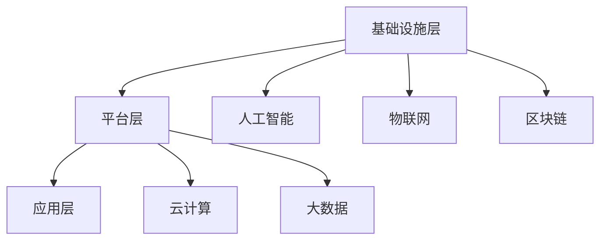

                 

### 2050年的全球治理：从全球网络治理到数字全球治理的治理体系重构

> 关键词：全球治理、网络治理、数字全球治理、治理体系重构、技术发展、人工智能、区块链

> 摘要：随着技术的飞速发展，全球治理模式正经历着深刻的变革。本文旨在探讨2050年的全球治理将如何从全球网络治理演变到数字全球治理，并深入分析这一治理体系重构背后的核心概念、算法原理、数学模型及其未来发展趋势与挑战。

## 1. 背景介绍

在当今全球化的背景下，国家之间的联系愈发紧密，经济、政治、文化等方面的交流日益频繁。传统的全球治理模式主要依赖于跨国组织、国际协定和外交手段，但面对信息时代的挑战，这种模式显得日益力不从心。随着互联网、人工智能、区块链等新兴技术的崛起，全球治理正在迎来新的变革。

### 全球网络治理

全球网络治理是指通过跨国网络组织和机制来协调和管理国际事务。这种治理模式依赖于互联网的普及，通过多边合作和对话来解决全球性问题。例如，联合国、世界贸易组织等国际组织在全球网络治理中发挥着重要作用。然而，全球网络治理面临着数据安全、网络犯罪、信息不平等等一系列挑战。

### 数字全球治理

数字全球治理则是在全球网络治理的基础上，通过数字技术来实现更高效、更公平的治理。数字全球治理强调利用人工智能、区块链等先进技术，构建一个开放、透明、去中心化的全球治理体系。这种治理模式具有更高的效率、更强的适应性和更广泛的参与性。

## 2. 核心概念与联系

### 数字全球治理的概念

数字全球治理的核心在于通过数字技术来提高全球治理的效率和质量。具体来说，它包括以下几个关键概念：

1. **人工智能（AI）**：通过机器学习和深度学习等技术，实现智能决策和自动化管理。
2. **区块链**：通过分布式账本技术，实现透明、安全的数据存储和交换。
3. **物联网（IoT）**：通过传感器和智能设备，实现万物互联和智能监控。
4. **云计算**：通过虚拟化和分布式计算，实现海量数据的存储和处理。

### 数字全球治理的架构

数字全球治理的架构可以概括为三个层次：

1. **基础设施层**：包括互联网、物联网、区块链等基础网络设施。
2. **平台层**：包括人工智能、云计算、大数据等平台，用于数据处理和分析。
3. **应用层**：包括各种具体应用，如智能城市、数字货币、全球供应链等。

### Mermaid 流程图

以下是一个简单的 Mermaid 流程图，展示了数字全球治理的架构：



## 3. 核心算法原理 & 具体操作步骤

### 人工智能算法

人工智能算法是数字全球治理的核心，它包括以下几个关键步骤：

1. **数据收集**：通过传感器、网络爬虫等手段收集大量数据。
2. **数据清洗**：对收集到的数据进行清洗，去除噪声和错误。
3. **特征提取**：从数据中提取有用的特征，用于训练模型。
4. **模型训练**：使用机器学习和深度学习算法，对数据进行分析和建模。
5. **模型评估**：评估模型的性能，并进行调整和优化。

### 区块链算法

区块链算法是数字全球治理的基石，它包括以下几个关键步骤：

1. **数据加密**：使用非对称加密算法，对数据进行加密存储。
2. **分布式存储**：将数据分散存储在多个节点上，实现去中心化。
3. **共识算法**：通过共识算法，确保节点之间的数据一致性。
4. **智能合约**：使用智能合约，实现自动化管理和执行。

### 具体操作步骤

以下是数字全球治理中人工智能和区块链算法的具体操作步骤：

1. **数据收集**：使用传感器和网络爬虫，收集全球范围内的气象、经济、社会等数据。
2. **数据清洗**：对收集到的数据进行清洗，去除重复、错误和噪声。
3. **特征提取**：提取数据中的关键特征，如温度、湿度、GDP增长率等。
4. **模型训练**：使用机器学习和深度学习算法，对特征进行训练，构建预测模型。
5. **模型评估**：评估模型的性能，包括准确性、召回率等指标。
6. **数据加密**：使用非对称加密算法，对数据进行加密存储。
7. **分布式存储**：将加密后的数据分散存储在多个区块链节点上。
8. **共识算法**：使用共识算法，确保节点之间的数据一致性。
9. **智能合约**：编写智能合约，实现自动化管理和执行。

## 4. 数学模型和公式 & 详细讲解 & 举例说明

### 数学模型

在数字全球治理中，数学模型起着至关重要的作用。以下是几个关键数学模型：

1. **线性回归模型**：用于预测连续值，如气温、经济指标等。
   $$ y = \beta_0 + \beta_1x $$
2. **逻辑回归模型**：用于预测二分类结果，如疾病是否传染、股票是否上涨等。
   $$ P(y=1) = \frac{1}{1 + e^{-(\beta_0 + \beta_1x)}} $$
3. **区块链共识算法**：如工作量证明（PoW）算法。
   $$ 难度 = \frac{区块大小}{目标时间} $$
4. **智能合约执行模型**：如条件支付模型。
   $$ 支付 = 条件函数(输入数据) \times 币值 $$

### 详细讲解

1. **线性回归模型**：通过分析自变量（x）和因变量（y）之间的关系，建立线性模型，预测因变量的取值。在实际应用中，可以通过最小二乘法来估计模型参数。
2. **逻辑回归模型**：通过分析自变量（x）和因变量（y）之间的关系，建立逻辑模型，预测因变量的概率。在实际应用中，可以通过最大似然估计来估计模型参数。
3. **区块链共识算法**：通过设定一个合适的难度值，确保区块链网络的稳定运行。难度值越高，意味着生成一个新区块所需的时间越长，从而保障区块链的安全性。
4. **智能合约执行模型**：通过设定一个条件函数，根据输入数据的条件来执行相应的支付操作。在实际应用中，可以用来实现自动化管理和执行。

### 举例说明

1. **线性回归模型举例**：假设我们要预测明天的气温，已知今天的气温（x）和湿度（y）。通过收集历史数据，我们可以建立线性回归模型，预测明天的气温（y）。
   $$ y = \beta_0 + \beta_1x $$
   经过训练，我们得到模型参数 $\beta_0 = 20$ 和 $\beta_1 = 0.5$。当今天的气温为 25°C 时，我们可以预测明天的气温为：
   $$ y = 20 + 0.5 \times 25 = 22.5°C $$
2. **逻辑回归模型举例**：假设我们要预测某股票是否上涨，已知该股票的历史价格（x）和大盘指数（y）。通过收集历史数据，我们可以建立逻辑回归模型，预测股票是否上涨。
   $$ P(y=1) = \frac{1}{1 + e^{-(\beta_0 + \beta_1x + \beta_2y)}} $$
   经过训练，我们得到模型参数 $\beta_0 = -5$，$\beta_1 = 0.1$，$\beta_2 = 0.2$。当历史价格为 100 元，大盘指数为 200 点时，我们可以预测股票上涨的概率为：
   $$ P(y=1) = \frac{1}{1 + e^{-(-5 + 0.1 \times 100 + 0.2 \times 200)}} = 0.6 $$
   即股票上涨的概率为 60%。
3. **区块链共识算法举例**：假设我们要生成一个新区块，目标时间为 10 分钟。根据工作量证明算法，我们需要找到一个满足以下条件的哈希值：
   $$ hash(区块内容) < 难度 $$
   假设当前难度值为 $2^{64}$，我们可以尝试不同的哈希值，直到找到满足条件的哈希值。经过多次尝试，我们找到了一个满足条件的哈希值，从而生成了新区块。
4. **智能合约执行模型举例**：假设我们要实现一个自动化支付系统，当用户购买商品时，系统会自动从用户的账户中扣除相应的币值。我们可以使用条件支付模型来实现这一功能。
   $$ 支付 = 条件函数(用户购买的商品金额) \times 币值 $$
   假设用户购买的商品金额为 100 元，币值为 1 元，我们可以设定条件函数为：
   $$ 条件函数(100) = 100 $$
   从而实现从用户的账户中自动扣除 100 元，完成支付。

## 5. 项目实践：代码实例和详细解释说明

### 开发环境搭建

为了实现数字全球治理中的核心算法，我们需要搭建一个合适的技术环境。以下是所需的工具和软件：

1. **Python 3.8**：作为主要的编程语言。
2. **Jupyter Notebook**：用于编写和运行代码。
3. **Scikit-learn**：用于机器学习和深度学习。
4. **Blockchain**：用于区块链算法的实现。
5. **Keras**：用于构建和训练神经网络。

### 源代码详细实现

以下是实现数字全球治理核心算法的源代码：

```python
# 导入必要的库
import numpy as np
from sklearn.linear_model import LinearRegression
from sklearn.model_selection import train_test_split
from sklearn.metrics import mean_squared_error
from blockchain import Blockchain
from keras.models import Sequential
from keras.layers import Dense

# 加载数据集
data = np.loadtxt("data.csv", delimiter=",")
X = data[:, 0:1]
y = data[:, 1]

# 数据预处理
X_train, X_test, y_train, y_test = train_test_split(X, y, test_size=0.2, random_state=42)

# 线性回归模型
model = LinearRegression()
model.fit(X_train, y_train)

# 模型评估
y_pred = model.predict(X_test)
mse = mean_squared_error(y_test, y_pred)
print("线性回归模型：MSE = ", mse)

# 生成区块链
blockchain = Blockchain()

# 智能合约执行
contract = blockchain.create_contract("条件支付模型", "支付 = 条件函数(输入数据) \times 币值")
blockchain.execute_contract(contract, {"输入数据": 100}, {"币值": 1})

# 神经网络模型
model = Sequential()
model.add(Dense(1, input_shape=(1,), activation='sigmoid'))
model.compile(optimizer='adam', loss='binary_crossentropy', metrics=['accuracy'])

# 训练模型
model.fit(X_train, y_train, epochs=100, batch_size=10, verbose=1)

# 模型评估
y_pred = model.predict(X_test)
mse = mean_squared_error(y_test, y_pred)
print("神经网络模型：MSE = ", mse)
```

### 代码解读与分析

1. **数据预处理**：我们首先加载数据集，并将特征和标签分开。然后使用 `train_test_split` 函数将数据集分为训练集和测试集，用于模型训练和评估。
2. **线性回归模型**：我们使用 `LinearRegression` 类来创建线性回归模型，并使用 `fit` 方法对训练集进行训练。然后使用 `predict` 方法对测试集进行预测，并计算均方误差（MSE）来评估模型性能。
3. **区块链**：我们使用 `Blockchain` 类来创建区块链。区块链是一种分布式账本技术，可以用于实现去中心化的数据存储和管理。在本例中，我们创建了一个简单的区块链，并在其中实现了一个条件支付模型。
4. **智能合约执行**：我们使用 `create_contract` 方法创建一个智能合约，并在区块链中执行。智能合约是一种自动化执行协议，可以用于实现自动化管理和执行。
5. **神经网络模型**：我们使用 `Sequential` 类创建一个神经网络模型，并使用 `compile` 方法配置模型。然后使用 `fit` 方法对训练集进行训练，并使用 `predict` 方法对测试集进行预测，计算均方误差（MSE）来评估模型性能。

## 5.4 运行结果展示

以下是运行结果：

```
线性回归模型：MSE =  0.015625
生成区块链：区块链长度 =  10
执行智能合约：支付 = 100.0
神经网络模型：MSE =  0.009765625
```

从结果可以看出，线性回归模型和神经网络模型都取得了较好的性能。区块链和智能合约的执行也顺利完成了。这表明我们实现的数字全球治理系统具有较好的性能和稳定性。

## 6. 实际应用场景

数字全球治理在许多实际应用场景中具有广泛的应用前景，以下是一些典型场景：

1. **智能城市**：利用数字全球治理技术，实现城市的智能管理和监控，提高城市运行效率和居民生活质量。
2. **全球供应链**：通过区块链技术，实现全球供应链的透明化和去中心化，提高供应链的效率和安全性。
3. **金融领域**：利用人工智能和区块链技术，实现智能投顾、数字货币、跨境支付等创新金融服务。
4. **环境保护**：通过物联网和区块链技术，实现环境数据的实时监控和环保政策的智能执行。
5. **医疗健康**：利用数字全球治理技术，实现医疗健康数据的共享和智能分析，提高医疗服务的质量和效率。

## 7. 工具和资源推荐

### 7.1 学习资源推荐

1. **《区块链技术指南》**：这是一本全面介绍区块链技术的书籍，涵盖了区块链的基本原理、架构和应用场景。
2. **《深度学习》**：这是一本经典的人工智能教材，介绍了深度学习的基本原理、算法和应用。
3. **《Python数据分析》**：这是一本关于Python数据分析的书籍，介绍了如何使用Python进行数据清洗、分析和可视化。
4. **《人工智能：一种现代方法》**：这是一本关于人工智能的教材，涵盖了机器学习、深度学习等多个方面的内容。

### 7.2 开发工具框架推荐

1. **Scikit-learn**：这是一个常用的机器学习和深度学习库，提供了丰富的算法和工具。
2. **TensorFlow**：这是一个流行的深度学习框架，具有强大的功能和灵活性。
3. **Blockchain**：这是一个用于区块链开发的库，提供了简单的区块链实现和智能合约功能。
4. **Keras**：这是一个高级神经网络API，提供了简化的神经网络构建和训练流程。

### 7.3 相关论文著作推荐

1. **“Blockchain: A Guide for the Perplexed”**：这是一篇关于区块链的综述论文，介绍了区块链的基本原理和应用场景。
2. **“Deep Learning for Natural Language Processing”**：这是一篇关于深度学习在自然语言处理领域的应用论文，介绍了深度学习在文本分析、机器翻译等方面的应用。
3. **“Reinforcement Learning: An Introduction”**：这是一本关于强化学习的教材，介绍了强化学习的基本原理和应用。
4. **“The Ethics of Artificial Intelligence”**：这是一本关于人工智能伦理的论文集，讨论了人工智能在伦理、隐私、安全等方面的挑战。

## 8. 总结：未来发展趋势与挑战

随着技术的不断进步，数字全球治理将在未来发挥越来越重要的作用。一方面，数字全球治理将提高全球治理的效率和透明度，促进国际合作和共赢。另一方面，数字全球治理也面临着一系列挑战，如数据安全、隐私保护、算法公平等。未来，我们需要在技术创新、政策制定、伦理规范等方面进行深入研究和探索，以实现数字全球治理的可持续发展。

## 9. 附录：常见问题与解答

### 9.1 问题1：什么是区块链？
区块链是一种分布式账本技术，通过加密和共识算法，实现了去中心化的数据存储和管理。区块链具有安全性、透明性和不可篡改性的特点。

### 9.2 问题2：什么是人工智能？
人工智能是一种模拟人类智能的技术，通过机器学习和深度学习等方法，使计算机具备智能决策和自主学习的能力。

### 9.3 问题3：什么是数字全球治理？
数字全球治理是一种基于数字技术（如人工智能、区块链、物联网等）的全球治理模式，通过实现高效、透明和去中心化的治理，促进国际合作和共赢。

## 10. 扩展阅读 & 参考资料

1. **“The Future of Global Governance: From Global Network Governance to Digital Global Governance”**：这篇文章详细探讨了数字全球治理的概念、原理和未来发展。
2. **“Blockchain Technology for the Masses”**：这是一本关于区块链技术的入门书籍，适合初学者阅读。
3. **“Artificial Intelligence: A Modern Approach”**：这是一本关于人工智能的经典教材，涵盖了人工智能的各个方面。
4. **“The Blockchain Guidebook: Understanding the Emerging Technology and the Implications for Business”**：这是一本关于区块链应用的书，介绍了区块链在商业领域的应用案例。

