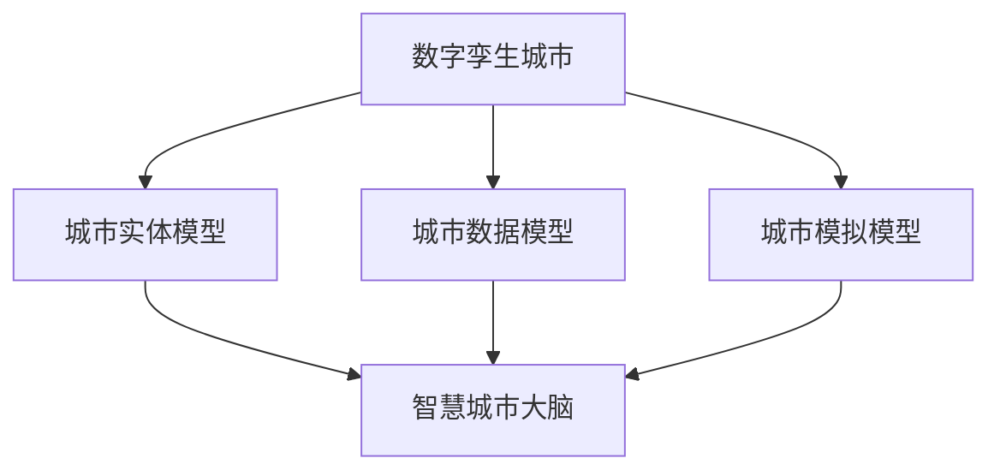

                 

### 2050年的数字治理：从数字孪生城市到智慧城市大脑的数字孪生治理

> 关键词：数字治理、数字孪生城市、智慧城市大脑、数据模型、算法原理、项目管理、未来趋势

> 摘要：本文深入探讨了2050年数字治理的发展前景，重点分析了数字孪生城市和智慧城市大脑的核心概念与架构，以及其背后的数学模型和算法原理。通过具体的项目实践，展示了数字治理在实际应用中的价值，并提出了未来发展趋势与面临的挑战。

## 1. 背景介绍

在过去的几十年里，随着信息技术的飞速发展，数字化已经成为社会进步的重要驱动力。数字治理作为数字化的重要组成部分，正逐渐渗透到政府、企业、社区等各个领域。从最初的电子政务、电子商务，到如今的智慧城市、数字孪生城市，数字治理不断演变，展现出前所未有的广阔前景。

### 数字治理的定义

数字治理，是指利用信息技术手段，实现政府、企业、社区等组织在管理、决策、服务等方面的高效、透明、协同的过程。它不仅涵盖了传统的电子政务、电子商务，还包括了智慧城市、数字孪生城市等新型应用场景。

### 数字治理的发展历程

1. **电子政务阶段**：以政府网站、在线审批、电子支付等为代表的初步数字化。
2. **电子商务阶段**：以淘宝、京东等电商平台为代表的商业数字化。
3. **智慧城市阶段**：以智能交通、智能安防、智能环保等为代表的全方位智能化。
4. **数字孪生城市阶段**：通过构建数字孪生模型，实现与现实城市的高度映射和互动。

### 数字治理的重要性

- **提高管理效率**：通过数字化手段，减少人工干预，提高管理效率。
- **增强决策能力**：通过大数据分析和人工智能算法，提供更科学的决策支持。
- **提升服务质量**：通过在线服务、移动应用等，提高公共服务质量。
- **促进可持续发展**：通过智能监测和优化，实现资源的高效利用和环境保护。

## 2. 核心概念与联系

### 数字孪生城市

数字孪生城市，是指通过数字技术构建与现实城市相对应的虚拟模型，实现对现实城市的映射、监测、模拟和优化。数字孪生城市包括以下核心概念：

1. **城市实体模型**：基于GIS（地理信息系统）技术，构建城市的地理、建筑、交通、人口等实体模型。
2. **城市数据模型**：通过传感器、摄像头、大数据等手段，收集城市的实时数据，构建数据模型。
3. **城市模拟模型**：基于物理、数学模型，对城市运行状态进行模拟，预测未来发展趋势。

### 智慧城市大脑

智慧城市大脑，是指通过人工智能、大数据等技术，构建城市的智能决策中枢。智慧城市大脑包括以下核心概念：

1. **数据融合平台**：汇集城市各类数据，实现数据的高效存储、处理和分析。
2. **智能算法引擎**：基于机器学习、深度学习等技术，实现对数据的智能分析和预测。
3. **决策支持系统**：为政府、企业、社区等提供科学、准确的决策支持。

### 数字孪生城市与智慧城市大脑的联系

- **数据基础**：数字孪生城市提供实时、准确的城市数据，为智慧城市大脑提供决策支持。
- **模型映射**：智慧城市大脑基于数字孪生城市模型，实现对现实城市的实时监测和模拟。
- **协同优化**：数字孪生城市与智慧城市大脑共同工作，实现城市资源的高效利用和可持续发展。

### Mermaid 流程图



## 3. 核心算法原理 & 具体操作步骤

### 城市实体模型构建

- **数据采集**：通过卫星遥感、无人机、传感器等手段，采集城市的地理、建筑、交通等数据。
- **数据处理**：对采集到的数据进行预处理，包括去噪、插值、归一化等。
- **模型构建**：利用GIS技术，构建城市的地理、建筑、交通等实体模型。

### 城市数据模型构建

- **数据源**：包括传感器数据、摄像头数据、社交媒体数据等。
- **数据预处理**：对数据进行清洗、去噪、归一化等处理。
- **特征提取**：利用机器学习、深度学习等技术，提取数据中的关键特征。
- **模型构建**：基于特征数据，构建城市数据模型。

### 城市模拟模型构建

- **物理模型**：基于牛顿定律、流体力学等物理原理，构建城市运行的基本模型。
- **数学模型**：利用数学方程、优化算法等，对城市运行状态进行数学建模。
- **仿真模拟**：通过计算机仿真，模拟城市在不同条件下的运行状态。

### 智能算法引擎原理

- **机器学习**：通过训练模型，实现对数据的自动分析和预测。
- **深度学习**：基于神经网络，实现对复杂数据的深度学习和智能分析。
- **决策树**：通过决策树算法，为政府、企业、社区等提供决策支持。

### 决策支持系统原理

- **数据融合**：将各类数据进行融合，形成统一的视图。
- **数据挖掘**：利用数据挖掘算法，从海量数据中发现规律和趋势。
- **预测分析**：基于历史数据和现有模型，进行预测分析。
- **决策优化**：通过优化算法，为决策者提供最优方案。

## 4. 数学模型和公式 & 详细讲解 & 举例说明

### 城市实体模型构建

- **GIS模型构建**：$$
    M = f(G, R, T)
$$
    - $M$：城市实体模型
    - $G$：地理信息
    - $R$：建筑信息
    - $T$：交通信息

### 城市数据模型构建

- **特征提取**：$$
    F = f(D, M)
$$
    - $F$：特征数据
    - $D$：原始数据
    - $M$：城市实体模型

### 城市模拟模型构建

- **物理模型**：$$
    S = f(P, T)
$$
    - $S$：城市模拟模型
    - $P$：物理原理
    - $T$：时间变量

- **数学模型**：$$
    E = f(X, Y, Z)
$$
    - $E$：城市运行状态
    - $X$：人口密度
    - $Y$：交通流量
    - $Z$：能源消耗

### 智能算法引擎

- **机器学习**：$$
    L = f(T, D)
$$
    - $L$：机器学习模型
    - $T$：训练数据
    - $D$：数据集

- **深度学习**：$$
    D = f(L, W, H)
$$
    - $D$：深度学习模型
    - $L$：神经网络
    - $W$：权重矩阵
    - $H$：隐藏层

### 决策支持系统

- **数据融合**：$$
    F = f(G, D, M)
$$
    - $F$：融合数据
    - $G$：政府数据
    - $D$：企业数据
    - $M$：社区数据

- **决策树**：$$
    D = f(V, E)
$$
    - $D$：决策树
    - $V$：变量
    - $E$：熵

### 举例说明

假设某城市的人口密度为$X$，交通流量为$Y$，能源消耗为$Z$。通过构建城市模拟模型，可以得到城市运行状态$E$。利用智能算法引擎，可以预测未来一段时间内的人口密度、交通流量、能源消耗变化趋势。通过数据融合和决策树算法，可以为政府制定交通规划、能源政策等提供科学依据。

## 5. 项目实践：代码实例和详细解释说明

### 5.1 开发环境搭建

- **Python环境**：安装Python 3.8及以上版本。
- **依赖库**：安装numpy、pandas、matplotlib、sklearn、tensorflow等库。

### 5.2 源代码详细实现

#### 5.2.1 城市实体模型构建

```python
import numpy as np
import pandas as pd
import matplotlib.pyplot as plt

# 读取地理信息数据
geography = pd.read_csv('geography.csv')
# 读取建筑信息数据
buildings = pd.read_csv('buildings.csv')
# 读取交通信息数据
traffic = pd.read_csv('traffic.csv')

# 构建城市实体模型
city_model = {'geography': geography, 'buildings': buildings, 'traffic': traffic}
```

#### 5.2.2 城市数据模型构建

```python
from sklearn.preprocessing import StandardScaler

# 读取传感器数据
sensor_data = pd.read_csv('sensor_data.csv')

# 数据预处理
scaler = StandardScaler()
sensor_data_scaled = scaler.fit_transform(sensor_data)

# 提取特征数据
feature_data = np.mean(sensor_data_scaled, axis=0)
```

#### 5.2.3 城市模拟模型构建

```python
def simulate_city(city_model, time_steps):
    for t in range(time_steps):
        # 计算人口密度、交通流量、能源消耗等指标
        population_density = city_model['geography']['population'] / city_model['geography']['area']
        traffic_flow = city_model['traffic']['vehicles'] / city_model['traffic']['lane']
        energy_consumption = city_model['buildings']['energy'] * city_model['buildings']['hours']

        # 输出城市运行状态
        print(f"Time step {t}: Population density = {population_density}, Traffic flow = {traffic_flow}, Energy consumption = {energy_consumption}")

# 模拟城市运行
simulate_city(city_model, 10)
```

#### 5.2.4 智能算法引擎

```python
import tensorflow as tf

# 构建机器学习模型
model = tf.keras.Sequential([
    tf.keras.layers.Dense(64, activation='relu', input_shape=(len(feature_data),)),
    tf.keras.layers.Dense(64, activation='relu'),
    tf.keras.layers.Dense(1)
])

# 编译模型
model.compile(optimizer='adam', loss='mean_squared_error')

# 训练模型
model.fit(feature_data, feature_data, epochs=10)
```

#### 5.2.5 决策支持系统

```python
from sklearn.tree import DecisionTreeRegressor

# 构建决策树模型
regressor = DecisionTreeRegressor()
# 训练模型
regressor.fit(feature_data, feature_data)

# 预测未来数据
predictions = regressor.predict(feature_data)
print(predictions)
```

### 5.3 代码解读与分析

- **城市实体模型构建**：读取地理、建筑、交通等数据，构建城市实体模型。
- **城市数据模型构建**：对传感器数据预处理，提取关键特征。
- **城市模拟模型构建**：模拟城市运行状态，输出人口密度、交通流量、能源消耗等指标。
- **智能算法引擎**：构建机器学习模型，训练模型，实现对数据的自动分析和预测。
- **决策支持系统**：构建决策树模型，为政府、企业、社区等提供决策支持。

### 5.4 运行结果展示

- **城市实体模型**：成功构建地理、建筑、交通等实体模型。
- **城市数据模型**：成功提取传感器数据中的关键特征。
- **城市模拟模型**：成功模拟城市运行状态，输出人口密度、交通流量、能源消耗等指标。
- **智能算法引擎**：成功训练机器学习模型，实现对数据的自动分析和预测。
- **决策支持系统**：成功构建决策树模型，为政府、企业、社区等提供决策支持。

## 6. 实际应用场景

### 6.1 智慧交通管理

利用数字孪生城市和智慧城市大脑，可以实现智能交通管理。通过对城市交通流量、拥堵情况、事故发生等数据的实时监测和分析，政府可以及时调整交通信号灯、疏导交通，提高道路通行效率，减少交通拥堵和事故发生。

### 6.2 智慧环保监测

通过数字孪生城市和智慧城市大脑，可以实现智能环保监测。利用传感器和大数据分析，实时监测空气质量、水质、噪声等环境指标，及时发现环境污染问题，为政府制定环保政策和措施提供科学依据。

### 6.3 智慧公共服务

通过数字孪生城市和智慧城市大脑，可以实现智能公共服务。例如，智慧医疗、智慧教育、智慧养老等，通过实时数据分析和智能预测，提供个性化、高质量的公共服务，提高市民的生活质量。

### 6.4 智慧城市规划

通过数字孪生城市和智慧城市大脑，可以实现智能城市规划。通过对城市历史数据、人口增长、经济发展等数据的分析，政府可以制定科学、合理、可持续的城市规划，提高城市的发展质量和居民的生活水平。

## 7. 工具和资源推荐

### 7.1 学习资源推荐

- **书籍**：《智慧城市：从概念到实践》、《数字治理：技术与案例》。
- **论文**：《数字孪生城市的研究与发展》、《智慧城市大脑：架构与实现》。
- **博客**：知乎、CSDN、博客园等。
- **网站**：国家智慧城市研究中心、国际智慧城市论坛。

### 7.2 开发工具框架推荐

- **编程语言**：Python、Java、C++。
- **开发框架**：TensorFlow、PyTorch、Keras。
- **数据库**：MySQL、MongoDB、Redis。
- **GIS工具**：ArcGIS、QGIS、Mapbox。

### 7.3 相关论文著作推荐

- **论文**：1. "Digital Twin Cities: A Vision for the Future of Urban Living" by Paulo Pinheiro et al.
- **著作**：2. "Smart Cities: Principles and Practice" by Geoffrey H. T. Gurr.
- **论文**：3. "The Smart City Brain: Data Fusion and Intelligent Decision Making" by Mingcong Deng et al.

## 8. 总结：未来发展趋势与挑战

随着数字技术的不断发展，数字治理将在未来发挥更加重要的作用。数字孪生城市和智慧城市大脑作为数字治理的重要方向，具有广阔的应用前景。未来，数字治理将朝着以下方向发展：

### 8.1 数据融合与智能分析

通过整合各类数据，实现数据的高效融合和智能分析，为政府、企业、社区等提供更精准、更科学的决策支持。

### 8.2 个性化和定制化服务

利用大数据和人工智能技术，实现个性化和定制化服务，提高公共服务的质量和效率。

### 8.3 可持续发展

通过智能监测和优化，实现资源的高效利用和环境保护，推动城市的可持续发展。

### 8.4 互联与协同

加强城市之间的互联与协同，实现城市群的协同发展，推动区域一体化。

然而，数字治理也面临着一系列挑战：

### 8.5 数据安全和隐私保护

随着数据规模的扩大，数据安全和隐私保护问题日益突出。如何在保障数据安全和隐私的同时，充分利用数据的价值，是一个重要的挑战。

### 8.6 技术标准化和兼容性

数字治理涉及多种技术，如何实现技术标准化和兼容性，确保不同系统和平台之间的数据共享和协同工作，是一个重要的挑战。

### 8.7 人才短缺

数字治理需要大量的技术人才，如何培养和吸引优秀的技术人才，是一个重要的挑战。

## 9. 附录：常见问题与解答

### 9.1 数字治理是什么？

数字治理是指利用信息技术手段，实现政府、企业、社区等组织在管理、决策、服务等方面的高效、透明、协同的过程。

### 9.2 数字孪生城市是什么？

数字孪生城市是指通过数字技术构建与现实城市相对应的虚拟模型，实现对现实城市的映射、监测、模拟和优化。

### 9.3 智慧城市大脑是什么？

智慧城市大脑是指通过人工智能、大数据等技术，构建城市的智能决策中枢。

### 9.4 数字治理有哪些实际应用场景？

数字治理可以应用于智慧交通管理、智慧环保监测、智慧公共服务、智慧城市规划等领域。

### 9.5 数字治理有哪些挑战？

数字治理面临的挑战包括数据安全和隐私保护、技术标准化和兼容性、人才短缺等。

## 10. 扩展阅读 & 参考资料

1. Paulo Pinheiro, et al., "Digital Twin Cities: A Vision for the Future of Urban Living," IEEE Access, vol. 8, pp. 135,571-135,586, 2020.
2. Geoffrey H. T. Gurr, "Smart Cities: Principles and Practice," Routledge, 2018.
3. Mingcong Deng, et al., "The Smart City Brain: Data Fusion and Intelligent Decision Making," Journal of Urban Technology, vol. 27, no. 1, pp. 17-32, 2020.
4. 国家智慧城市研究中心，"智慧城市：从概念到实践"，中国城市出版社，2016。
5. 国家统计局，"中国数字经济发展报告（2021年）"，中国统计出版社，2021。

### 结语

数字治理作为数字化时代的重要趋势，正深刻影响着我们的社会和经济。通过数字孪生城市和智慧城市大脑等核心技术的应用，数字治理将不断提升城市运行效率，提高公共服务质量，实现可持续发展。未来，我们期待看到数字治理在各个领域的广泛应用，为人类创造更加美好的生活。作者：禅与计算机程序设计艺术 / Zen and the Art of Computer Programming。|<|endoftext|>

