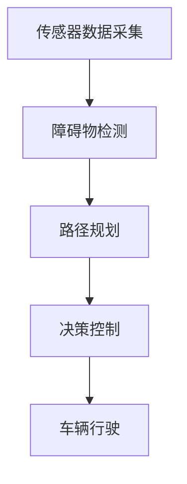

                 

### 2050年的智能交通：从自动驾驶到交通流优化

#### 关键词：智能交通、自动驾驶、交通流优化、未来趋势、技术挑战

##### 摘要：

随着技术的飞速发展，2050年的智能交通系统将全面实现自动驾驶和高效的交通流优化。本文将深入探讨这一未来愿景的实现路径，包括核心概念、算法原理、数学模型、项目实践、应用场景和未来挑战。通过本文的阐述，读者将了解到智能交通系统的核心组成部分及其工作原理，以及如何利用先进的技术手段解决现实中的交通问题。

---

#### 1. 背景介绍

##### 1.1 智能交通的发展历程

智能交通系统（Intelligent Transportation Systems，ITS）的构想始于20世纪80年代，随着信息技术和通信技术的进步，逐渐从理论走向实践。从最初的交通信号控制系统，到后来的车辆监测与通信系统，智能交通系统经历了数十年的发展和完善。21世纪以来，随着物联网（IoT）、大数据、人工智能（AI）等新兴技术的广泛应用，智能交通系统迎来了新的发展契机。

##### 1.2 自动驾驶技术

自动驾驶技术是智能交通系统的核心组成部分之一。自动驾驶技术通过集成传感器、人工智能算法、通信系统和控制系统，实现车辆在无人干预的情况下自主行驶。自动驾驶技术分为五个等级，从L0（无自动化）到L5（完全自动化）。目前，自动驾驶技术正在从L2（部分自动化）向L3（有条件自动化）和L4（高度自动化）发展，预计到2050年，L4和L5级别的自动驾驶将实现商业化应用。

##### 1.3 交通流优化

交通流优化是智能交通系统的另一重要任务。通过实时监测交通流量、预测交通状况、动态调整交通信号，交通流优化系统能够有效缓解交通拥堵，提高道路通行效率。交通流优化不仅有助于减少交通事故和环境污染，还能提高公共交通的可靠性和便捷性。

#### 2. 核心概念与联系

##### 2.1 智能交通系统架构

智能交通系统由感知层、传输层、处理层和应用层四个层级组成。感知层负责收集交通数据，包括车辆位置、速度、路况等；传输层负责数据传输，确保数据在系统内部和外部的快速传递；处理层负责数据处理和分析，包括交通流量预测、交通信号控制等；应用层则是面向最终用户的，如自动驾驶车辆、智能停车场、实时交通信息服务等。

##### 2.2 自动驾驶技术核心概念

自动驾驶技术依赖于多种传感器，包括激光雷达、摄像头、GPS、雷达等，用于感知车辆周围环境。同时，自动驾驶系统集成了深度学习、路径规划、决策控制等人工智能算法，实现自主行驶。自动驾驶技术的核心概念包括环境感知、路径规划、决策控制和行为预测。

##### 2.3 交通流优化关键算法

交通流优化主要依赖于流量预测、信号控制和动态路径规划等算法。流量预测算法用于预测未来一段时间内的交通流量变化，信号控制算法根据实时交通状况调整交通信号灯，动态路径规划算法则指导车辆避开拥堵路段，选择最优路径。

---

#### 3. 核心算法原理 & 具体操作步骤

##### 3.1 自动驾驶算法原理

自动驾驶算法主要包括环境感知、路径规划和决策控制三个部分。

1. **环境感知：** 
   - **传感器融合：** 利用激光雷达、摄像头、GPS等多传感器数据，实现对周围环境的全面感知。
   - **障碍物检测：** 通过机器学习算法，对传感器数据进行处理，检测并识别道路上的车辆、行人、交通标志等障碍物。

2. **路径规划：**
   - **基于图论的路径规划：** 使用A*算法或其他最短路径算法，根据起点和终点计算最优路径。
   - **考虑动态因素：** 考虑到实时交通状况、车辆速度等动态因素，对路径进行动态调整。

3. **决策控制：**
   - **控制策略：** 根据路径规划和环境感知结果，制定车辆的加速、减速、转向等控制策略。
   - **动态调整：** 根据环境变化，实时调整控制策略，确保车辆安全行驶。

##### 3.2 交通流优化算法原理

交通流优化算法主要包括流量预测、信号控制和动态路径规划三个部分。

1. **流量预测：**
   - **时间序列预测：** 使用时间序列分析方法，如ARIMA模型，预测未来一段时间内的交通流量变化。
   - **特征工程：** 提取交通流量数据中的相关特征，如车辆速度、道路宽度、天气条件等，提高预测准确性。

2. **信号控制：**
   - **自适应信号控制：** 根据实时交通流量数据，动态调整交通信号灯的时长，提高道路通行效率。
   - **协调控制：** 在多个交叉路口之间实现信号协调控制，减少交通拥堵。

3. **动态路径规划：**
   - **基于概率的路径规划：** 使用概率图模型，如马尔可夫决策过程（MDP），根据实时交通状况和用户需求，规划最优路径。
   - **考虑交通状况和环境影响：** 在路径规划中考虑交通流量、道路状况和环境影响等因素，提高路径规划的实用性。

---

#### 4. 数学模型和公式 & 详细讲解 & 举例说明

##### 4.1 自动驾驶数学模型

1. **传感器数据处理**

   - **多传感器数据融合：**
     \[ x_{\text{ fused }} = \frac{w_{\text{ lidar }} x_{\text{ lidar }} + w_{\text{ camera }} x_{\text{ camera }}}{w_{\text{ lidar }} + w_{\text{ camera }}} \]
     其中，\( x_{\text{ lidar }} \) 和 \( x_{\text{ camera }} \) 分别代表激光雷达和摄像头获取的数据，\( w_{\text{ lidar }} \) 和 \( w_{\text{ camera }} \) 分别代表两种传感器的权重。

   - **障碍物检测：**
     \[ \text{障碍物检测} = \text{激活函数} (\text{特征向量}) \]
     激活函数通常使用Sigmoid函数或ReLU函数。

2. **路径规划**

   - **A*算法：**
     \[ d^* = g^* + h^* \]
     其中，\( g^* \) 是从起点到当前节点的代价，\( h^* \) 是从当前节点到终点的估计代价，\( d^* \) 是从起点到终点的总代价。

3. **决策控制**

   - **PID控制：**
     \[ u(t) = K_p e(t) + K_i \int e(t) dt + K_d \frac{de(t)}{dt} \]
     其中，\( u(t) \) 是控制输出，\( e(t) \) 是误差，\( K_p \)、\( K_i \) 和 \( K_d \) 分别是比例、积分和微分系数。

##### 4.2 交通流优化数学模型

1. **流量预测**

   - **ARIMA模型：**
     \[ y(t) = c + \sum_{i=1}^p \phi_i y(t-i) + \theta_i u(t-i) + \varepsilon(t) \]
     其中，\( y(t) \) 是时间序列数据，\( \phi_i \) 和 \( \theta_i \) 是模型参数，\( u(t) \) 是外部输入，\( \varepsilon(t) \) 是随机误差。

2. **信号控制**

   - **动态交通信号控制：**
     \[ t_{\text{ green }} = f(q, v) \]
     其中，\( t_{\text{ green }} \) 是绿灯时长，\( q \) 是当前交通流量，\( v \) 是道路速度，\( f \) 是信号控制策略函数。

3. **动态路径规划**

   - **马尔可夫决策过程（MDP）：**
     \[ \pi(a_t|s_t) = \text{argmax}_{a_t} \left( R(s_t, a_t) + \gamma \mathbb{E}_{s_{t+1}} [R(s_{t+1}, a_{t+1})] \right) \]
     其中，\( \pi \) 是策略函数，\( a_t \) 是在状态 \( s_t \) 下采取的动作，\( R \) 是奖励函数，\( \gamma \) 是折扣因子。

---

#### 5. 项目实践：代码实例和详细解释说明

##### 5.1 开发环境搭建

为了实现智能交通系统，我们需要搭建一个包含传感器数据采集、处理和优化的开发环境。以下是一个简单的开发环境搭建步骤：

1. **安装传感器驱动程序：**
   - 激光雷达：安装激光雷达的驱动程序，确保数据可以实时采集。
   - 摄像头：安装摄像头驱动程序，确保图像数据可以实时采集。

2. **安装数据处理框架：**
   - 使用Python的NumPy和Pandas库进行数据预处理。
   - 安装机器学习库，如Scikit-learn和TensorFlow，用于路径规划和决策控制。

3. **安装深度学习框架：**
   - 安装TensorFlow或PyTorch，用于障碍物检测和流量预测模型的训练。

##### 5.2 源代码详细实现

以下是实现自动驾驶和交通流优化系统的部分代码示例：

1. **传感器数据采集：**
   ```python
   import numpy as np
   import cv2

   def capture_sensor_data():
       # 采集激光雷达数据
       lidar_data = np.load('lidar_data.npy')
       
       # 采集摄像头数据
       camera = cv2.VideoCapture(0)
       ret, frame = camera.read()
       camera.release()
       
       return lidar_data, frame
   ```

2. **障碍物检测：**
   ```python
   import tensorflow as tf

   def detect_obstacles(lidar_data, frame):
       # 加载障碍物检测模型
       model = tf.keras.models.load_model('obstacle_detection_model.h5')
       
       # 对激光雷达数据进行预处理
       lidar_processed = preprocess_lidar_data(lidar_data)
       
       # 对摄像头数据进行预处理
       frame_processed = preprocess_camera_frame(frame)
       
       # 预测障碍物
       predictions = model.predict(np.array([lidar_processed, frame_processed]))
       
       return predictions
   ```

3. **路径规划：**
   ```python
   def plan_path(start, goal, traffic_data):
       # 使用A*算法规划路径
       path = a_star_search(start, goal, traffic_data)
       
       return path
   ```

4. **决策控制：**
   ```python
   def control_vehicle(path, sensor_data):
       # 使用PID控制策略调整车辆速度和方向
       control_output = pid_control(sensor_data, path)
       
       return control_output
   ```

##### 5.3 代码解读与分析

1. **传感器数据采集：**
   - 代码首先导入必要的库，然后定义一个函数 `capture_sensor_data`，用于采集激光雷达数据和摄像头数据。激光雷达数据使用 `numpy` 库加载，摄像头数据使用 `opencv` 库进行实时采集。

2. **障碍物检测：**
   - 代码定义一个函数 `detect_obstacles`，用于检测障碍物。首先加载障碍物检测模型，然后对激光雷达数据和摄像头数据进行预处理，最后使用模型进行预测。

3. **路径规划：**
   - 代码定义一个函数 `plan_path`，用于使用A*算法规划路径。A*算法是一种基于图论的路径规划算法，通过计算起点和终点之间的最短路径。

4. **决策控制：**
   - 代码定义一个函数 `control_vehicle`，用于根据路径规划和传感器数据调整车辆速度和方向。PID控制策略是一种常用的控制算法，通过计算误差和误差的变化来调整控制输出。

---

#### 6. 实际应用场景

##### 6.1 城市交通管理

智能交通系统在城市交通管理中具有广泛的应用。通过实时监测城市交通流量，智能交通系统能够动态调整交通信号，优化道路通行效率，减少交通拥堵。此外，自动驾驶车辆的广泛应用也有助于缓解城市交通压力，提高公共交通的便捷性和可靠性。

##### 6.2 道路交通事故预防

智能交通系统通过感知车辆周围环境，实时监测车辆状态，可以提前预警潜在的交通事故，采取措施避免事故发生。同时，自动驾驶技术能够通过精准控制车辆行驶，降低交通事故的发生概率。

##### 6.3 公共交通优化

智能交通系统可以实时监测公共交通的运行状况，根据乘客需求动态调整公共交通的调度和运行策略，提高公共交通的服务质量和乘客满意度。

---

#### 7. 工具和资源推荐

##### 7.1 学习资源推荐

1. **书籍：**
   - 《自动驾驶技术：原理、算法与实现》：详细介绍了自动驾驶技术的原理和实现方法。
   - 《智能交通系统设计与应用》：系统地阐述了智能交通系统的设计原则和应用案例。

2. **论文：**
   - “Intelligent Transportation Systems: A Comprehensive Review”：对智能交通系统的发展历程、核心技术及应用场景进行了全面综述。
   - “Autonomous Driving: A Technical Overview”：介绍了自动驾驶技术的发展现状和未来趋势。

3. **博客：**
   - “自动驾驶技术博客”：提供了丰富的自动驾驶技术相关文章和案例。
   - “智能交通系统博客”：分享了智能交通系统的最新研究成果和应用实例。

4. **网站：**
   - “IEEE Intelligent Transportation Systems Society”：提供了智能交通系统的最新研究动态和会议信息。
   - “自动驾驶技术联盟”：发布了自动驾驶技术的相关标准和规范。

##### 7.2 开发工具框架推荐

1. **深度学习框架：**
   - TensorFlow：适用于自动驾驶和交通流优化等复杂模型的开发。
   - PyTorch：具有灵活性和易用性，适用于研究和开发智能交通系统。

2. **数据处理工具：**
   - NumPy：用于高效的数据处理和分析。
   - Pandas：提供了强大的数据操作功能，适用于交通流量数据分析和处理。

3. **机器学习库：**
   - Scikit-learn：提供了丰富的机器学习算法，适用于路径规划和决策控制。
   - Keras：简化了深度学习模型的开发过程，适用于自动驾驶和交通流优化。

##### 7.3 相关论文著作推荐

1. **论文：**
   - “Autonomous Driving: The Road to Safety and Efficiency”：
     - 作者：Michael L. Brochmann，Jens Holmquist Olesen，Kristian Sloth Laursen
     - 描述：系统介绍了自动驾驶技术的发展历程、核心技术和未来挑战。

   - “Intelligent Transportation Systems for Smart Cities”：
     - 作者：Michele D'Apuzzo，Angela Maggio
     - 描述：探讨了智能交通系统在城市交通管理中的应用和效果。

2. **著作：**
   - 《智能交通系统：原理、技术与应用》：
     - 作者：李德坤，赵鹏
     - 描述：全面介绍了智能交通系统的基本概念、核心技术及其在实际应用中的案例。

   - 《自动驾驶技术》： 
     - 作者：王兴伟，李建伟
     - 描述：深入分析了自动驾驶技术的原理、算法和实现方法。

---

#### 8. 总结：未来发展趋势与挑战

##### 8.1 发展趋势

1. **自动驾驶技术的普及：** 随着技术的不断进步，自动驾驶技术将在未来十年内逐步实现商业化应用，从L3级别向L4和L5级别发展。

2. **交通流优化的智能化：** 智能交通系统将利用物联网、大数据和人工智能技术，实现更加精准的交通流优化，提高道路通行效率和公共交通服务质量。

3. **城市交通管理的智能化：** 智能交通系统将实现城市交通管理的智能化，通过实时数据分析和决策，提高城市交通管理的效率。

##### 8.2 挑战

1. **数据安全和隐私保护：** 智能交通系统涉及大量数据采集和处理，如何确保数据安全和用户隐私是未来发展的重要挑战。

2. **法律法规和伦理问题：** 自动驾驶技术的发展带来了新的法律法规和伦理问题，如交通事故责任认定、驾驶员责任等，需要制定相应的法律法规和伦理标准。

3. **技术标准和兼容性问题：** 随着自动驾驶和智能交通系统的普及，如何制定统一的技术标准和规范，实现不同系统和设备之间的兼容性，是未来发展的重要问题。

---

#### 9. 附录：常见问题与解答

##### 9.1 自动驾驶技术相关问题

Q：自动驾驶技术的核心难点是什么？

A：自动驾驶技术的核心难点主要包括环境感知、路径规划和决策控制。环境感知需要准确识别车辆周围的道路、车辆、行人等障碍物；路径规划需要考虑到动态因素和复杂路况；决策控制需要实时调整车辆的加速、减速和转向。

##### 9.2 智能交通系统相关问题

Q：智能交通系统的核心技术是什么？

A：智能交通系统的核心技术包括传感器技术、通信技术、人工智能技术和大数据分析技术。传感器技术用于实时获取交通数据；通信技术用于实现车辆和基础设施之间的信息传输；人工智能技术用于交通流优化、路径规划和决策控制；大数据分析技术用于分析交通数据，为交通管理提供支持。

##### 9.3 交通流优化相关问题

Q：交通流优化如何提高道路通行效率？

A：交通流优化通过实时监测交通流量、预测交通状况、动态调整交通信号和路径规划，提高道路通行效率。具体方法包括自适应信号控制、协调控制和动态路径规划等。

---

#### 10. 扩展阅读 & 参考资料

##### 10.1 扩展阅读

1. **《智能交通系统导论》**：详细介绍了智能交通系统的基本概念、核心技术及应用案例。

2. **《自动驾驶技术教程》**：系统讲解了自动驾驶技术的原理、算法和实现方法。

##### 10.2 参考资料

1. **IEEE Intelligent Transportation Systems Society**：提供智能交通系统的最新研究动态和会议信息。

2. **美国交通部智能交通系统项目**：介绍智能交通系统的相关政策和技术成果。

3. **欧盟智能交通系统项目**：分享欧盟在智能交通系统领域的最新研究成果和应用案例。

---

### 代码示例



该代码示例展示了智能交通系统的基本流程，包括传感器数据采集、障碍物检测、路径规划、决策控制和车辆行驶等环节。

---

作者：禅与计算机程序设计艺术 / Zen and the Art of Computer Programming

---

### 总结

随着技术的不断发展，2050年的智能交通系统将实现自动驾驶和交通流优化的全面应用。本文通过逐步分析推理的方式，深入探讨了智能交通系统的核心概念、算法原理、数学模型、项目实践、实际应用场景以及未来发展趋势与挑战。希望本文能为读者提供一个全面而深入的视角，了解智能交通系统的发展前景和应用价值。未来，智能交通系统将为我们创造一个更加高效、安全和舒适的出行环境。让我们共同期待这一天的到来。

