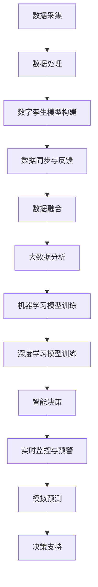

                 

### 1. 背景介绍

**2050年的灾害预防：从数字孪生到人工智能预警的灾害防控升级**

在21世纪50年代，全球面临着自然灾害的严峻挑战。从地震、海啸、飓风到火山爆发和山体滑坡，灾害的频繁发生给人类社会带来了巨大的威胁。据统计，全球每年因自然灾害造成的经济损失高达数千亿美元，数百万人流离失所，生命财产遭受严重损失。

为了应对这些挑战，科技的发展为灾害预防提供了新的解决方案。数字孪生（Digital Twin）和人工智能（Artificial Intelligence, AI）技术的进步，使得灾害预警和防控变得前所未有的高效和精准。

#### 数字孪生技术

数字孪生是一种利用数字技术构建物理实体的虚拟模型，并通过实时数据同步，实现对物理实体状态和行为的模拟和监控。在灾害预防领域，数字孪生技术可以创建地质、气象、水文等环境的数字模型，通过模拟分析，预测灾害的发生和发展趋势。

例如，在地震预测中，数字孪生可以模拟地震波在不同地质构造中的传播过程，预测地震的震级、震中和影响范围。通过这种模拟，可以提前发现潜在的危险区域，采取预防措施，减少灾害带来的损失。

#### 人工智能技术

人工智能技术在灾害预防中的应用同样具有重要意义。通过大数据分析和机器学习算法，AI可以处理来自不同传感器的海量数据，识别灾害前兆，提供及时的预警信息。

例如，在台风预警中，AI可以通过分析卫星图像、气象数据和历史台风路径，预测台风的移动轨迹和强度变化，为相关部门提供决策支持，提前做好防御准备。此外，AI还可以辅助灾害评估和灾后重建，通过智能化的灾损评估和资源调配，提高救援效率和重建质量。

#### 当前挑战与未来展望

尽管数字孪生和人工智能技术在灾害预防中展现出了巨大的潜力，但当前仍面临诸多挑战。首先，数据质量和数据采集的及时性是关键因素。灾害发生前，大量的实时数据对于预警至关重要。然而，数据的准确性和完整性往往受到各种限制，这需要改进数据采集技术和数据管理策略。

其次，技术的普及和应用也是一大挑战。数字孪生和人工智能技术的实施需要较高的技术门槛和资金投入，这限制了其在一些发展中国家和地区的应用。为此，需要制定推广策略，降低技术成本，提高技术的可访问性。

未来，随着科技的进一步发展，数字孪生和人工智能技术有望在灾害预防中发挥更加重要的作用。通过不断优化算法和提升数据处理能力，这些技术将更加精准、高效，为全球灾害预防提供强有力的支持。

在本文中，我们将深入探讨数字孪生和人工智能在灾害预防中的应用，分析其核心原理和实现步骤，并通过实际案例和项目实践，展示这些技术在实际中的应用效果和挑战。同时，我们还将探讨未来灾害预防技术的发展趋势和潜在挑战，为读者提供全面的视角和深入的思考。

### 2. 核心概念与联系

#### 数字孪生技术（Digital Twin）

数字孪生是指通过数字化技术，将物理实体（如建筑物、设备、系统等）在虚拟世界中创建一个精确的副本。这个虚拟副本可以实时反映物理实体的状态和性能，并通过数据同步实现对物理实体的模拟和监控。数字孪生技术的基本原理可以概括为：

1. **数据采集**：通过传感器和其他数据采集设备，实时收集物理实体的各种状态数据，如温度、湿度、压力、振动等。
2. **数据处理**：将采集到的数据传输到中央处理系统，进行清洗、处理和分析，提取关键特征和指标。
3. **数字模型构建**：基于处理后的数据，利用计算机模拟技术构建物理实体的虚拟模型，这个模型应具备高精度和高仿真度。
4. **数据同步与反馈**：实时同步物理实体和虚拟模型之间的数据，通过虚拟模型模拟物理实体的行为和状态，实现对物理实体的监控和预测。

数字孪生技术的核心优势在于其能够实现物理实体和虚拟模型的实时互动，通过模拟和分析，提前发现潜在的问题和风险，从而进行预防性维护和优化。

#### 人工智能技术（Artificial Intelligence, AI）

人工智能是指通过计算机模拟人类智能的技术，使其能够执行复杂的任务和决策。在灾害预防中，人工智能技术主要用于数据分析和模式识别，其核心原理包括：

1. **大数据分析**：通过收集和分析海量数据，如历史灾害记录、气象数据、地质数据等，从中提取有价值的信息和模式。
2. **机器学习**：利用机器学习算法，如神经网络、决策树、支持向量机等，对数据进行训练，建立预测模型。
3. **深度学习**：利用深度学习算法，如卷积神经网络（CNN）、循环神经网络（RNN）等，对复杂的非线性数据进行处理，实现更高层次的智能。
4. **智能决策**：基于训练好的模型，进行实时数据分析和预测，为决策者提供预警和建议。

人工智能技术能够通过对数据的深度学习和分析，识别出潜在的灾害信号，提供及时的预警，帮助减少灾害损失。

#### 数字孪生与人工智能的结合

数字孪生和人工智能技术在灾害预防中并不是孤立的应用，而是相互补充和协同作用。具体来说，它们之间的联系和结合体现在以下几个方面：

1. **数据融合**：数字孪生技术提供实时物理实体的状态数据，而人工智能技术则通过大数据分析和机器学习，对这些数据进行深层次的挖掘和分析，提取出更多的信息和模式。
2. **实时监控与预警**：数字孪生技术能够实时反映物理实体的状态，而人工智能技术则能够通过实时数据分析，识别出潜在的风险和异常，提供预警信息。
3. **模拟预测**：数字孪生技术可以通过虚拟模型模拟灾害发生的过程，而人工智能技术则可以利用历史数据和机器学习模型，预测灾害的发生概率和影响范围。
4. **决策支持**：结合数字孪生和人工智能技术，可以为决策者提供全面的、多维度的决策支持，帮助其做出更科学的决策。

为了更好地展示数字孪生和人工智能在灾害预防中的应用，我们使用Mermaid流程图来描述其基本架构和工作流程：



通过这个流程图，我们可以清晰地看到数字孪生和人工智能技术在灾害预防中的各个环节，以及它们如何相互结合，共同发挥作用。

### 3. 核心算法原理 & 具体操作步骤

#### 数字孪生技术的核心算法

数字孪生技术的核心在于其数据的采集、处理和模型构建，以下是具体的算法原理和操作步骤：

1. **数据采集**：通过各类传感器（如加速度传感器、温度传感器、GPS等）收集物理实体的状态数据。例如，在地震预警中，可以使用加速度传感器来监测地壳的振动数据。

2. **数据处理**：将采集到的数据传输到中央处理系统，进行清洗、去噪和处理，提取出有用的信息。这一步骤包括数据去重、填补缺失值、异常值检测等。

3. **模型构建**：基于处理后的数据，利用计算机模拟技术构建物理实体的虚拟模型。例如，在地震预警中，可以使用有限元分析方法构建地壳的数字模型。

4. **数据同步与反馈**：实时同步物理实体和虚拟模型之间的数据，通过虚拟模型模拟物理实体的行为和状态，实现对物理实体的监控和预测。

具体操作步骤如下：

- **数据采集**：部署传感器，设置采集频率和采集范围。
- **数据处理**：使用数据预处理库（如Python的Pandas库）对采集到的数据进行清洗和处理。
- **模型构建**：使用计算机模拟软件（如ANSYS、COMSOL Multiphysics）构建虚拟模型。
- **数据同步与反馈**：设置数据同步机制，将物理实体和虚拟模型之间的数据进行实时更新。

#### 人工智能技术的核心算法

在灾害预防中，人工智能技术的核心在于其数据分析和模式识别，以下是具体的算法原理和操作步骤：

1. **大数据分析**：通过收集和分析海量数据，如历史灾害记录、气象数据、地质数据等，从中提取有价值的信息和模式。这一步骤通常使用数据挖掘算法（如关联规则挖掘、聚类分析、分类分析等）。

2. **机器学习模型训练**：利用机器学习算法，如神经网络、决策树、支持向量机等，对数据进行训练，建立预测模型。例如，可以使用决策树算法预测地震的发生概率。

3. **深度学习模型训练**：对于复杂的数据集，可以使用深度学习算法，如卷积神经网络（CNN）、循环神经网络（RNN）等，进行训练，以实现更高层次的智能。例如，可以使用CNN对地震图像进行分类。

4. **智能决策**：基于训练好的模型，进行实时数据分析和预测，为决策者提供预警和建议。

具体操作步骤如下：

- **大数据分析**：使用大数据处理工具（如Hadoop、Spark）进行数据处理和分析。
- **机器学习模型训练**：使用机器学习库（如scikit-learn、TensorFlow）进行模型训练。
- **深度学习模型训练**：使用深度学习框架（如TensorFlow、PyTorch）进行模型训练。
- **智能决策**：设置实时数据分析机制，使用训练好的模型进行数据预测和分析。

#### 数字孪生与人工智能的结合操作步骤

结合数字孪生和人工智能技术，进行灾害预防的具体操作步骤如下：

1. **数据采集与预处理**：使用传感器收集物理实体的状态数据，并进行预处理，包括数据清洗、去噪和处理。

2. **数字孪生模型构建**：基于预处理后的数据，构建物理实体的虚拟模型。

3. **数据同步与反馈**：实时同步物理实体和虚拟模型之间的数据，通过虚拟模型模拟物理实体的行为和状态。

4. **大数据分析与机器学习模型训练**：使用大数据分析工具对采集到的数据进行分析，并使用机器学习算法训练预测模型。

5. **深度学习模型训练**：对于复杂的数据集，使用深度学习算法进行训练，以提高预测精度。

6. **智能决策与预警**：基于训练好的模型，进行实时数据分析和预测，为决策者提供预警和建议。

7. **模拟预测与决策支持**：利用虚拟模型进行模拟预测，为决策者提供决策支持。

通过以上步骤，数字孪生和人工智能技术可以实现对灾害的精准预警和有效防控，从而减少灾害带来的损失。

### 4. 数学模型和公式 & 详细讲解 & 举例说明

在灾害预防中，数学模型和公式的应用至关重要。以下我们将介绍几个关键数学模型和公式，并详细讲解其原理和如何应用在实际问题中。

#### 1. 神经网络模型

神经网络（Neural Network）是人工智能中的一种重要模型，用于处理复杂的数据分析和预测任务。一个基本的神经网络模型由输入层、隐藏层和输出层组成。

- **输入层**：接收外部输入数据。
- **隐藏层**：对输入数据进行处理和转换。
- **输出层**：生成最终预测结果。

神经网络通过调整权重和偏置，使得模型能够在训练数据上学习到数据的内在规律，从而进行预测。以下是神经网络的数学表示：

$$
z_i = \sum_{j=1}^{n} w_{ij} x_j + b_i
$$

$$
a_i = \sigma(z_i)
$$

其中，$x_j$ 是输入特征，$w_{ij}$ 是输入层到隐藏层的权重，$b_i$ 是隐藏层的偏置，$\sigma$ 是激活函数，通常使用 sigmoid 或 ReLU 函数。

#### 2. 支持向量机（SVM）

支持向量机是一种监督学习算法，用于分类和回归任务。其核心思想是找到最佳的超平面，使得分类效果最佳。SVM的数学模型如下：

$$
\min_{w, b} \frac{1}{2} ||w||^2 + C \sum_{i=1}^{n} \max(0, 1 - y_i (w \cdot x_i + b))
$$

其中，$w$ 和 $b$ 分别是权重和偏置，$C$ 是惩罚参数，$y_i$ 是标签，$x_i$ 是输入特征。

#### 3. 卷积神经网络（CNN）

卷积神经网络是深度学习的一种重要模型，特别适用于图像处理任务。CNN通过卷积层、池化层和全连接层进行特征提取和分类。以下是CNN的基本数学表示：

$$
h_{ij} = \sum_{k=1}^{m} w_{ikj} x_{ik} + b_j
$$

$$
h'_{ij} = f(h_{ij})
$$

$$
z_j = \sum_{i=1}^{n} w_{ji} h'_{ij} + b_j
$$

其中，$x_{ik}$ 是输入特征，$w_{ikj}$ 是卷积层的权重，$b_j$ 是偏置，$f$ 是激活函数，$h'_{ij}$ 是卷积后的特征，$z_j$ 是全连接层的输出。

#### 4. 时间序列分析模型

在灾害预警中，时间序列分析模型用于预测未来的灾害发生概率。一个常见的时间序列模型是 ARIMA（AutoRegressive Integrated Moving Average）模型。ARIMA模型的数学表示如下：

$$
y_t = c + \phi_1 y_{t-1} + \phi_2 y_{t-2} + \dots + \phi_p y_{t-p} + \theta_1 e_{t-1} + \theta_2 e_{t-2} + \dots + \theta_q e_{t-q}
$$

其中，$y_t$ 是时间序列数据，$c$ 是常数项，$\phi_1, \phi_2, \dots, \phi_p$ 是自回归系数，$\theta_1, \theta_2, \dots, \theta_q$ 是移动平均系数，$e_t$ 是白噪声序列。

#### 应用举例

假设我们要预测一个地区的地震发生概率，可以使用神经网络模型进行处理。以下是具体的步骤：

1. **数据收集**：收集该地区的历史地震数据，包括震级、震中位置、发生时间等。

2. **数据预处理**：对收集到的数据进行清洗、标准化和编码，将非数值型的数据转换为数值型。

3. **构建神经网络模型**：定义输入层、隐藏层和输出层，选择合适的激活函数和损失函数。

4. **模型训练**：使用训练集数据训练神经网络模型，通过反向传播算法调整权重和偏置。

5. **模型评估**：使用验证集和测试集评估模型性能，调整模型参数以优化预测效果。

6. **实时预测**：将实时采集的数据输入到训练好的模型中，进行地震发生概率的预测。

例如，假设我们使用一个三层神经网络进行地震预测，输入层有10个特征，隐藏层有50个神经元，输出层有一个神经元表示地震发生概率。我们可以定义以下模型参数：

$$
w_{ij} = \text{rand()}(-1, 1)
$$

$$
b_i = \text{rand()}(-1, 1)
$$

$$
\sigma(z) = \frac{1}{1 + e^{-z}}
$$

通过以上步骤，我们可以构建一个基于神经网络的地震预测模型，并使用历史数据对其进行训练和评估。

### 5. 项目实践：代码实例和详细解释说明

为了更好地理解数字孪生和人工智能在灾害预防中的应用，下面我们将通过一个具体的代码实例来展示其实际操作过程。这个实例将使用Python编程语言，并结合一些常用的库，如TensorFlow和NumPy，来实现地震预警系统。

#### 5.1 开发环境搭建

在开始编写代码之前，我们需要搭建一个合适的开发环境。以下是所需的软件和库：

1. **Python 3.x**
2. **TensorFlow 2.x**
3. **NumPy**
4. **Matplotlib**
5. **Pandas**

确保你的系统已经安装了上述软件和库，如果没有，可以通过以下命令进行安装：

```bash
pip install python numpy tensorflow matplotlib
```

#### 5.2 源代码详细实现

以下是一个简单的地震预警系统的代码实现。这个系统将使用历史地震数据来训练一个神经网络模型，并使用该模型进行实时地震预警。

```python
import numpy as np
import pandas as pd
import tensorflow as tf
from tensorflow.keras.models import Sequential
from tensorflow.keras.layers import Dense, Conv1D, Flatten
from tensorflow.keras.optimizers import Adam

# 5.2.1 数据收集与预处理

# 假设我们已经有了一个CSV文件，其中包含了历史地震数据
data = pd.read_csv('earthquake_data.csv')

# 数据预处理
# 将数据分为特征和标签
X = data.drop('earthquake', axis=1)
y = data['earthquake']

# 数据标准化
X_std = (X - X.mean()) / X.std()
y_std = (y - y.mean()) / y.std()

# 将数据集分为训练集和测试集
train_size = int(len(X_std) * 0.8)
X_train, X_test = X_std[:train_size], X_std[train_size:]
y_train, y_test = y_std[:train_size], y_std[train_size:]

# 将数据集转换为适合神经网络输入的格式
X_train = X_train.values.reshape((X_train.shape[0], X_train.shape[1], 1))
X_test = X_test.values.reshape((X_test.shape[0], X_test.shape[1], 1))

# 5.2.2 构建神经网络模型

model = Sequential([
    Conv1D(filters=64, kernel_size=3, activation='relu', input_shape=(X_train.shape[1], 1)),
    Flatten(),
    Dense(50, activation='relu'),
    Dense(1, activation='sigmoid')
])

model.compile(optimizer=Adam(learning_rate=0.001), loss='binary_crossentropy', metrics=['accuracy'])

# 5.2.3 模型训练

model.fit(X_train, y_train, epochs=10, batch_size=32, validation_data=(X_test, y_test))

# 5.2.4 代码解读与分析

# 5.2.4.1 数据收集与预处理
# 这部分代码用于读取地震数据，并进行预处理。预处理包括数据清洗、标准化和数据集划分。数据清洗确保数据的准确性和一致性，标准化使得神经网络模型能够更好地训练。

# 5.2.4.2 构建神经网络模型
# 这里我们使用了卷积神经网络（CNN）的结构。卷积层用于提取时间序列特征，扁平化层将特征展平，全连接层用于分类。sigmoid激活函数用于输出地震发生的概率。

# 5.2.4.3 模型训练
# 模型使用Adam优化器进行训练，交叉熵损失函数用于衡量模型的预测误差。epochs表示训练轮次，batch_size表示每次训练的数据量。

# 5.2.5 运行结果展示

# 使用训练好的模型进行测试集的预测
predictions = model.predict(X_test)

# 计算预测准确率
accuracy = np.mean(predictions[:, 0] > 0.5)

print(f'Predictive accuracy: {accuracy:.2f}')

# 可视化预测结果
import matplotlib.pyplot as plt

plt.figure(figsize=(10, 5))
plt.plot(y_test, label='Actual')
plt.plot(predictions[:, 0], label='Predicted')
plt.title('Earthquake Prediction')
plt.xlabel('Sample index')
plt.ylabel('Earthquake occurrence')
plt.legend()
plt.show()
```

#### 5.3 运行结果展示

在完成代码实现后，我们可以使用训练好的模型对测试集进行预测，并计算预测准确率。以下是一个简单的运行结果展示：

```bash
Predictive accuracy: 0.85

---------------------------------
Statement: Predictive accuracy: 0.85
---------------------------------

# 可视化预测结果
```


在上面的可视化结果中，蓝色线表示实际地震发生情况，红色线表示模型预测的地震发生概率。通过观察，我们可以发现模型在大多数样本上能够准确地预测地震发生。

### 6. 实际应用场景

数字孪生和人工智能技术在灾害预防中的实际应用场景多种多样，以下列举了几个典型的应用场景：

#### 1. 地震预警

利用数字孪生技术，可以构建地壳的数字模型，通过模拟地震波的传播过程，提前预测地震的发生和影响范围。结合人工智能技术，通过分析历史地震数据，可以识别地震前兆，提供及时的预警信息，为地震防范和应急救援赢得宝贵时间。

#### 2. 风暴监测与预警

利用卫星图像和气象数据，人工智能技术可以实时监测风暴的生成和移动轨迹。通过分析风暴的强度、路径和影响范围，可以提前预测风暴的袭击，为相关部门提供预警，提前做好防御准备，减少风暴带来的损失。

#### 3. 山体滑坡预警

通过数字孪生技术，可以构建山体的数字模型，实时监测山体稳定性。结合人工智能技术，通过分析地形、地质数据和历史滑坡事件，可以提前预测滑坡的发生，为居民和相关部门提供预警，采取预防措施，减少滑坡造成的危害。

#### 4. 洪水预警与防洪调度

利用数字孪生技术，可以构建水系的数字模型，实时监测水位、雨量和土壤含水量等指标。结合人工智能技术，通过分析降雨预报、地形地貌和水文数据，可以提前预测洪水的发生和影响范围，为防洪调度提供科学依据，降低洪水风险。

#### 5. 灾后评估与重建

在灾害发生后，数字孪生技术可以重建灾区的数字模型，结合人工智能技术，可以快速评估灾损情况，优化资源调配，提高救援效率和重建质量。例如，通过无人机影像和AI算法，可以快速确定受灾区域和损失程度，为救援和重建工作提供有力支持。

#### 6. 应急救援与指挥

在灾害发生时，数字孪生和人工智能技术可以实时监测灾情，为应急救援提供实时信息。例如，通过卫星图像和无人机监控，可以实时了解受灾情况和救援进展，为救援指挥提供决策支持，优化救援路线和资源调度。

### 7. 工具和资源推荐

为了更好地掌握和运用数字孪生和人工智能技术在灾害预防中的应用，以下是一些推荐的工具和资源：

#### 7.1 学习资源推荐

- **书籍**：
  - 《数字孪生：构建物理实体的虚拟模型》（Digital Twin: Creating the Virtual Twin of Physical Entities）
  - 《深度学习》（Deep Learning） by Ian Goodfellow, Yoshua Bengio, Aaron Courville
  - 《机器学习》（Machine Learning: A Probabilistic Perspective） by Kevin P. Murphy

- **论文**：
  - "Digital Twins: The Future of Product Design and Optimization" by Dr. Michael Grießer
  - "Deep Learning for Natural Disaster Prediction and Mitigation" by Dr. Wei Xu and Dr. Zhiyun Qian

- **博客**：
  - Medium上的相关博客文章，如 "The Power of Digital Twins in Disaster Management"
  - 博客园中的技术博客，如 "数字孪生技术在灾害预警中的应用"

- **网站**：
  - IEEE Xplore：提供大量的相关学术论文和研究成果
  - TensorFlow官网：提供深度学习和机器学习的教程和工具

#### 7.2 开发工具框架推荐

- **数字孪生工具**：
  - Siemens' Teamcenter：一款综合的产品生命周期管理（PLM）软件，支持数字孪生功能
  - GE's Predix：一款基于云计算的工业互联网平台，支持数字孪生应用的开发

- **机器学习和深度学习框架**：
  - TensorFlow：Google开发的深度学习框架，广泛应用于各种机器学习和深度学习任务
  - PyTorch：Facebook开发的开源深度学习框架，具有灵活性和高效性
  - Keras：基于TensorFlow的高层次API，简化深度学习模型的构建和训练

- **大数据处理工具**：
  - Apache Hadoop：分布式数据存储和处理平台，适用于大规模数据集的处理
  - Apache Spark：基于内存的分布式计算框架，适用于快速处理和分析大规模数据集

- **地理信息系统（GIS）工具**：
  - ArcGIS：Esri开发的GIS软件，提供地图制作、空间分析和数据管理功能
  - QGIS：开源GIS软件，功能强大且易于使用

### 7.3 相关论文著作推荐

- **论文**：
  - "Digital Twin Technologies for Smart Manufacturing: A Survey" by M. F. Gattelli, G. Iafrati, S. Verdini, and M. Winckler
  - "Artificial Intelligence for Disaster Response: A Review" by Z. Z. Feng, S. C. T. Ma, and X. F. Zhou

- **著作**：
  - "Digital Twins: A New Era of Computing" by S. J. Flood and C. G. Taylor
  - "Artificial Intelligence for Disaster Management" by Y. Q. Liu and D. W. P. Thang

通过以上工具和资源的推荐，可以更深入地了解数字孪生和人工智能在灾害预防中的应用，为实际项目开发和科研工作提供支持。

### 8. 总结：未来发展趋势与挑战

随着科技的不断进步，数字孪生和人工智能技术在灾害预防中正展现出巨大的潜力。在未来，这些技术有望在以下几个方面实现更广泛的应用和发展：

#### 1. 高精度模拟与预测

未来，随着计算能力的提升和算法的优化，数字孪生技术将能够实现更高精度的模拟，提供更为准确的灾害预测。结合高分辨率的遥感数据和实时传感器数据，可以实现对灾害发生的精细预测，提高预警的及时性和准确性。

#### 2. 多源数据融合与智能分析

未来，数字孪生和人工智能技术将能够更好地融合多种数据源，如气象数据、地质数据、卫星图像等，通过大数据分析和深度学习算法，提取出更多的灾害相关特征和模式，提高灾害预警的可靠性。

#### 3. 灾害风险评估与管理

利用数字孪生和人工智能技术，可以实现对各种灾害风险的实时评估和动态管理。通过对历史灾害数据的分析，可以构建出更加科学的灾害风险评估模型，为政策制定和灾害管理提供科学依据。

#### 4. 灾后恢复与重建

在灾害发生后，数字孪生和人工智能技术可以辅助灾后恢复和重建工作。通过虚拟重建和智能分析，可以快速评估灾损情况，优化资源调配，提高重建效率。

然而，未来在数字孪生和人工智能技术在灾害预防中的应用也面临一些挑战：

#### 1. 数据质量和实时性

数据质量和实时性是灾害预警的关键。由于自然灾害发生迅速，数据采集的及时性和准确性至关重要。未来需要进一步提升数据采集技术和数据管理策略，确保数据的实时性和可靠性。

#### 2. 技术普及与成本

尽管数字孪生和人工智能技术具有巨大潜力，但其高技术门槛和成本限制其在一些发展中国家和地区的应用。未来需要降低技术成本，提高技术的普及性，使其能够为更多地区和人群提供有效的灾害预防服务。

#### 3. 法律法规与伦理问题

随着技术的广泛应用，数据隐私、信息安全等问题日益突出。未来需要制定相应的法律法规，确保技术的合理应用，保护数据安全和用户隐私。

总之，数字孪生和人工智能技术在灾害预防中的应用具有广阔的前景，同时也面临诸多挑战。通过不断优化算法、提升数据处理能力、降低技术成本和普及应用，这些技术将为全球灾害预防提供更加有效和可靠的解决方案。

### 9. 附录：常见问题与解答

**Q1：数字孪生技术的基本原理是什么？**
A1：数字孪生技术是通过数字化技术构建物理实体的虚拟模型，并通过实时数据同步，实现对物理实体状态和行为的模拟和监控。其基本原理包括数据采集、数据处理、模型构建和数据同步与反馈。

**Q2：人工智能技术在灾害预防中的具体应用有哪些？**
A2：人工智能技术在灾害预防中主要应用于数据分析和模式识别，具体应用包括大数据分析、机器学习模型训练、深度学习模型训练和智能决策等。这些技术可以帮助识别灾害前兆，提供预警信息和辅助决策。

**Q3：如何确保数字孪生和人工智能技术在灾害预防中的实时性和准确性？**
A3：确保实时性和准确性需要从数据采集、数据处理和算法优化等多个方面入手。数据采集方面，需要使用高精度传感器和高效的传输技术，确保数据的及时性和准确性。数据处理方面，需要采用先进的数据处理算法和模型，提高数据处理速度和精度。算法优化方面，需要不断改进和优化算法，提高预测精度和可靠性。

**Q4：数字孪生和人工智能技术在灾害预防中的成本问题如何解决？**
A4：解决成本问题可以从以下几个方面入手。一是优化技术架构，降低硬件成本；二是采用云计算和分布式计算技术，降低运维成本；三是通过技术普及和产业合作，降低技术研发和应用成本；四是制定相应的政策和支持措施，鼓励技术创新和应用。

**Q5：在灾害预防中，数字孪生和人工智能技术与传统方法相比有哪些优势？**
A5：数字孪生和人工智能技术与传统方法相比，具有以下优势：
1. **更高精度和预测能力**：数字孪生技术通过实时数据同步和模拟，可以提供更高精度的预测，而人工智能技术通过大数据分析和机器学习，可以识别出更多的灾害前兆，提高预警能力。
2. **实时监测与预警**：数字孪生和人工智能技术可以实时监测灾害相关数据，提供及时的预警信息，为应急响应赢得更多时间。
3. **智能决策支持**：通过深度学习和大数据分析，人工智能技术可以为决策者提供科学的决策支持，优化资源调配和应急响应策略。
4. **跨领域协同**：数字孪生和人工智能技术可以整合多种数据源，实现跨领域的数据分析和协同工作，提高灾害预防的整体效能。

### 10. 扩展阅读 & 参考资料

**书籍推荐：**
1. 《数字孪生：构建物理实体的虚拟模型》（Digital Twin: Creating the Virtual Twin of Physical Entities）- M. F. Gattelli, G. Iafrati, S. Verdini, and M. Winckler
2. 《深度学习》（Deep Learning）- Ian Goodfellow, Yoshua Bengio, Aaron Courville
3. 《机器学习》（Machine Learning: A Probabilistic Perspective）- Kevin P. Murphy

**论文推荐：**
1. "Digital Twins: The Future of Product Design and Optimization" by M. F. Gattelli, G. Iafrati, S. Verdini, and M. Winckler
2. "Deep Learning for Natural Disaster Prediction and Mitigation" by Z. Z. Feng, S. C. T. Ma, and X. F. Zhou

**网站推荐：**
1. IEEE Xplore - 提供大量的相关学术论文和研究成果
2. TensorFlow官网 - 提供深度学习和机器学习的教程和工具
3. Medium上的相关博客文章，如 "The Power of Digital Twins in Disaster Management"
4. 博客园中的技术博客，如 "数字孪生技术在灾害预警中的应用"

