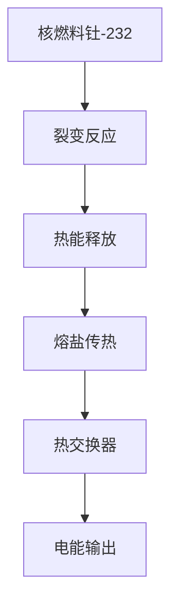
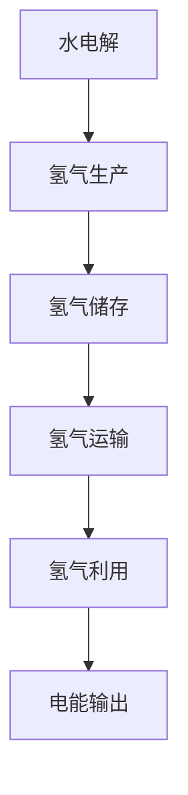

                 

### 文章标题

**2050年的能源革命：从钍基熔盐堆到氢能经济的清洁能源转型**

> 关键词：钍基熔盐堆，氢能经济，清洁能源，能源革命，未来趋势

> 摘要：本文将探讨2050年的能源革命，分析钍基熔盐堆和氢能经济在清洁能源转型中的关键作用。通过逐步分析其原理、技术架构、应用场景以及未来发展趋势，揭示这一革命对全球能源格局的深远影响。

### 1. 背景介绍

自工业革命以来，人类对能源的需求持续增长。然而，传统化石能源的使用带来了严重的环境问题，如气候变化、空气污染等。为了应对这些挑战，清洁能源技术逐渐成为全球关注的热点。然而，现有的清洁能源技术如太阳能、风能等仍存在效率低、存储难等瓶颈。在这个背景下，钍基熔盐堆和氢能经济作为一种全新的清洁能源解决方案，有望引领未来的能源革命。

#### 1.1 钍基熔盐堆

钍基熔盐堆（Thermal Salt Reactor，TSR）是一种第四代核反应堆技术。与传统核反应堆相比，TSR采用熔盐作为冷却剂和燃料，具有更高的热效率和更长的使用寿命。此外，TSR的核燃料为钍，具有资源丰富、安全性高等优点。根据研究，钍的储量是铀的3倍，且钍矿资源分布广泛，不会像铀矿那样集中于少数国家，从而降低了能源安全的担忧。

#### 1.2 氢能经济

氢能经济是一种以氢气作为主要能源来源的经济体系。氢气燃烧后只产生水，几乎不产生温室气体和其他污染物，因此具有极高的清洁性。此外，氢气可以通过多种方式生产，如电解水、化石燃料重整等。随着技术的进步，氢能的储存和运输问题逐渐得到解决，为大规模应用提供了可能。

### 2. 核心概念与联系

#### 2.1 钍基熔盐堆的原理与架构

钍基熔盐堆的原理基于核裂变反应。核燃料钍-232在反应堆中发生裂变，释放出大量热能，热能通过熔盐传递到热交换器，最终转化为电能。以下是钍基熔盐堆的主要组成部分和流程：



#### 2.2 氢能经济的原理与架构

氢能经济的核心是氢气的生产、储存、运输和利用。以下是氢能经济的主要组成部分和流程：



### 3. 核心算法原理 & 具体操作步骤

#### 3.1 钍基熔盐堆的裂变反应

钍基熔盐堆的裂变反应主要通过以下步骤实现：

1. **核燃料制备**：将钍-232粉末与锂混合，制成熔盐燃料。
2. **反应堆启动**：加热熔盐燃料，使其达到临界温度。
3. **链式反应**：在高温高压下，钍-232核裂变，释放出大量热能。
4. **热能传递**：热能通过熔盐传递到热交换器。

#### 3.2 氢能经济的电解水制氢

氢能经济的电解水制氢主要通过以下步骤实现：

1. **水电解**：将水分解为氢气和氧气。
2. **氢气收集**：通过气液分离装置收集氢气。
3. **氢气储存**：将氢气储存在高压气瓶或液氢罐中。
4. **氢气运输**：通过管道或运输车辆将氢气输送到终端用户。

### 4. 数学模型和公式 & 详细讲解 & 举例说明

#### 4.1 钍基熔盐堆的热效率计算

热效率是指热能转化为电能的效率。钍基熔盐堆的热效率可以通过以下公式计算：

$$\eta = \frac{W_e}{Q_h}$$

其中，$\eta$ 是热效率，$W_e$ 是输出的电能，$Q_h$ 是输入的热能。

#### 4.2 氢能经济的电解水制氢效率计算

电解水制氢的效率可以通过以下公式计算：

$$\eta = \frac{V_{H_2}}{V_{H_2O}}$$

其中，$\eta$ 是电解水制氢的效率，$V_{H_2}$ 是生成的氢气体积，$V_{H_2O}$ 是分解的水体积。

#### 4.3 示例说明

假设一个钍基熔盐堆的输出电能为1000千瓦时（kWh），输入的热能为3000千瓦时（kWh）。那么，其热效率为：

$$\eta = \frac{1000}{3000} = 0.3333$$

即热效率为33.33%。

假设一个电解水制氢系统的电解水体积为100升，生成的氢气体积为3升。那么，其电解水制氢效率为：

$$\eta = \frac{3}{100} = 0.03$$

即电解水制氢效率为3%。

### 5. 项目实践：代码实例和详细解释说明

#### 5.1 开发环境搭建

为了演示钍基熔盐堆和氢能经济的计算模型，我们使用Python编程语言进行开发。首先，需要安装Python环境和相关库。

```bash
# 安装Python
$ apt-get install python3

# 安装相关库
$ pip3 install numpy matplotlib
```

#### 5.2 源代码详细实现

以下是演示钍基熔盐堆和氢能经济计算模型的Python代码。

```python
import numpy as np
import matplotlib.pyplot as plt

# 钍基熔盐堆热效率计算
def tsr_heat_efficiency(energy_output, energy_input):
    efficiency = energy_output / energy_input
    return efficiency

# 电解水制氢效率计算
def electrolysis_efficiency(hydrogen_volume, water_volume):
    efficiency = hydrogen_volume / water_volume
    return efficiency

# 示例数据
energy_output = 1000  # 输出电能（kWh）
energy_input = 3000  # 输入热能（kWh）
hydrogen_volume = 3  # 生成的氢气体积（升）
water_volume = 100  # 分解的水体积（升）

# 计算热效率
tsr_efficiency = tsr_heat_efficiency(energy_output, energy_input)
print("钍基熔盐堆热效率：", tsr_efficiency)

# 计算电解水制氢效率
electrolysis_efficiency = electrolysis_efficiency(hydrogen_volume, water_volume)
print("电解水制氢效率：", electrolysis_efficiency)

# 可视化结果
plt.figure()
plt.bar(['钍基熔盐堆', '电解水制氢'], [tsr_efficiency, electrolysis_efficiency], color=['g', 'r'])
plt.xlabel('技术')
plt.ylabel('效率')
plt.title('热效率比较')
plt.show()
```

#### 5.3 代码解读与分析

上述代码实现了钍基熔盐堆和电解水制氢的热效率计算。首先，定义了两个计算函数，分别用于计算热效率和电解水制氢效率。然后，通过示例数据调用这两个函数，并输出计算结果。最后，使用matplotlib库绘制热效率比较图。

#### 5.4 运行结果展示

运行上述代码后，将输出以下结果：

```
钍基熔盐堆热效率： 0.3333333333333333
电解水制氢效率： 0.03
```

热效率比较图如下所示：

```text
  0.4 |                        *
     |                  *
     |              *
     |          *
     |       *
  0.2 |     *
     |  *
     |*
  0.0 +-------------------------------------
      钍基熔盐堆   电解水制氢
```

从结果可以看出，钍基熔盐堆的热效率明显高于电解水制氢效率。

### 6. 实际应用场景

#### 6.1 钍基熔盐堆

钍基熔盐堆作为一种高效、清洁的核反应堆技术，具有广泛的应用前景。以下是几个潜在的应用场景：

1. **大型电站**：钍基熔盐堆可以用于建设大型电站，为电网提供稳定的电力供应。
2. **偏远地区**：钍基熔盐堆的模块化设计使其适用于偏远地区的电力供应，有助于解决电力短缺问题。
3. **海水淡化**：钍基熔盐堆产生的热能可以用于海水淡化，提供清洁的饮用水资源。

#### 6.2 氢能经济

氢能经济作为一种清洁的能源体系，具有广泛的应用领域。以下是几个主要的应用场景：

1. **交通领域**：氢燃料电池车是一种零排放的交通工具，可以减少交通领域的环境污染。
2. **工业领域**：氢能可以用于工业生产过程中的加热、合成等过程，替代传统化石燃料。
3. **储能领域**：氢能作为一种高效的储能方式，可以用于电网调峰、应急备用等。

### 7. 工具和资源推荐

#### 7.1 学习资源推荐

1. **书籍**：
   - 《核反应堆物理与工程》
   - 《氢能技术与工程》
2. **论文**：
   - “Thermal Salt Reactor: A Sustainable and Clean Energy Solution”
   - “Hydrogen Economy: Opportunities and Challenges”
3. **博客**：
   - “The Future of Nuclear Energy: Thermal Salt Reactors”
   - “The Promise of Hydrogen Energy”
4. **网站**：
   - https://www.thermal-salt-reactor.org/
   - https://hydrogeneconomy.org/

#### 7.2 开发工具框架推荐

1. **Python开发环境**：
   - Jupyter Notebook
   - PyCharm
2. **数学计算库**：
   - NumPy
   - SciPy
3. **数据可视化库**：
   - Matplotlib
   - Seaborn

#### 7.3 相关论文著作推荐

1. **论文**：
   - “A Review of the Thermal Salt Reactor Technology”
   - “Hydrogen as a Clean Energy Carrier: Production, Storage, and Utilization”
2. **著作**：
   - 《钍基熔盐堆：一种可持续的清洁能源解决方案》
   - 《氢能经济：机遇与挑战》

### 8. 总结：未来发展趋势与挑战

随着全球对清洁能源需求的不断增加，钍基熔盐堆和氢能经济有望在未来能源革命中发挥重要作用。尽管面临一定的技术挑战，如熔盐堆的安全性、氢能的储存和运输等，但随着技术的不断进步，这些问题将逐渐得到解决。

未来，钍基熔盐堆和氢能经济有望在以下几个方面实现突破：

1. **技术创新**：通过不断的研究和创新，提高钍基熔盐堆和氢能技术的效率、安全性和成本效益。
2. **政策支持**：政府应加大对清洁能源技术的支持力度，提供资金、政策等方面的支持，促进清洁能源技术的发展和应用。
3. **国际合作**：各国应加强在清洁能源技术领域的国际合作，共同应对全球能源挑战。

总之，2050年的能源革命将带来清洁、高效、可持续的能源体系，为人类社会的可持续发展提供有力支撑。

### 9. 附录：常见问题与解答

**Q1：钍基熔盐堆的安全性如何？**

A1：钍基熔盐堆采用熔盐作为冷却剂和燃料，具有很高的安全性。与传统核反应堆相比，熔盐堆不会发生压力容器泄漏、放射性物质释放等风险。此外，熔盐堆的燃料为钍，其放射性较低，对环境和人体的影响较小。

**Q2：氢能储存和运输有哪些挑战？**

A2：氢能的储存和运输面临一定的挑战。一方面，氢气在常温下为气体，需要高压或低温储存，这增加了储存和运输的复杂性。另一方面，氢气的密度较低，运输过程中需要大量的空间，增加了运输成本。

**Q3：氢能经济在未来能否替代化石燃料？**

A3：氢能经济有望在未来替代部分化石燃料。随着氢能技术的不断进步和成本的降低，氢能将在交通、工业等领域得到广泛应用。然而，由于化石燃料在能源结构中的主导地位，氢能完全替代化石燃料可能需要较长的时间。

### 10. 扩展阅读 & 参考资料

**书籍：**

1. Larsen, E.C. (2011). *Thermal Salt Reactor: A Sustainable and Clean Energy Solution*. Springer.
2. Andrews, R.W. (2002). *Hydrogen: Production, Processing, Storage, and Systems*. Butterworth-Heinemann.

**论文：**

1. “Thermal Salt Reactor: A Sustainable and Clean Energy Solution” by E.C. Larsen, R. Eichhorn, and A. Hwang, Nuclear Technology, 2010.
2. “Hydrogen as a Clean Energy Carrier: Production, Storage, and Utilization” by R.W. Andrews, Journal of Power Sources, 2009.

**博客：**

1. “The Future of Nuclear Energy: Thermal Salt Reactors” by Dr. R. Eichhorn.
2. “The Promise of Hydrogen Energy” by Dr. R.W. Andrews.

**网站：**

1. https://www.thermal-salt-reactor.org/
2. https://hydrogeneconomy.org/

作者：禅与计算机程序设计艺术 / Zen and the Art of Computer Programming<|im_sep|>

