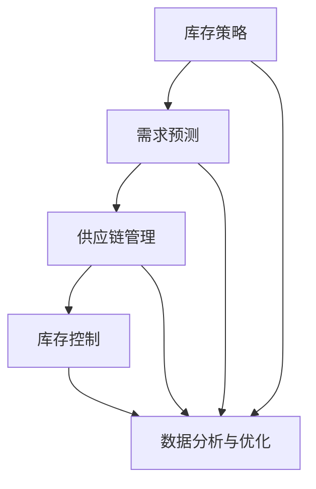

                 

### 背景介绍

库存管理是电子商务平台运营的核心环节之一。随着互联网的迅猛发展和电子商务的爆发式增长，电商平台上的商品种类和交易量急剧增加，库存管理的重要性愈发凸显。合理的库存管理不仅可以确保商品供应的连续性和稳定性，还能显著提升电商平台的运营效率和客户满意度。

在现代电商环境中，库存管理的挑战主要来源于以下几个方面：

1. **海量数据的处理**：电商平台每天产生的订单量、客户行为数据、物流信息等都非常庞大，对这些数据进行有效处理和分析是库存管理的关键。

2. **需求的波动性**：消费者的购物习惯和需求具有很大的不确定性，尤其是在节假日期间，需求波动更加剧烈。如何预测和应对这种波动，保持合理的库存水平，是库存管理需要解决的问题。

3. **供应链的复杂性**：电商平台通常涉及多个供应商和物流环节，库存管理需要协调这些环节，确保商品能够及时供应，同时减少库存积压和缺货现象。

4. **成本控制**：库存管理不仅关乎供应链的顺畅，还直接影响企业的成本。过高的库存会导致资金占用，而过低的库存又会影响销售和客户体验。如何在两者之间找到平衡，是库存管理的重要课题。

鉴于上述挑战，电商平台需要一种高效、精准的库存管理方法来提升供给效率。这就引出了本文的核心主题：利用先进的技术手段，构建科学的库存管理模型，以提升电商平台的供给效率。

本文将从以下几个方面展开讨论：

1. **核心概念与联系**：介绍库存管理中的关键概念及其相互关系，包括库存策略、需求预测、供应链管理等。
2. **核心算法原理与具体操作步骤**：详细阐述用于库存管理的常用算法，如需求预测算法、最优库存策略算法等，以及它们的应用步骤。
3. **数学模型和公式**：介绍库存管理中的数学模型和关键公式，如经济批量模型（EOQ）、库存周期模型等，并通过具体例子进行说明。
4. **项目实践**：通过实际代码实例，展示如何实现库存管理算法，并进行详细解释和分析。
5. **实际应用场景**：讨论库存管理在不同电商平台的实际应用场景，如库存优化、库存预测等。
6. **工具和资源推荐**：推荐学习资源和开发工具，以帮助读者深入学习和实践库存管理。

希望通过本文的讨论，读者能够对库存管理有更深入的理解，掌握相关技术和方法，为提升电商平台供给效率提供有力支持。

### 核心概念与联系

在探讨如何提升电商平台供给效率之前，我们需要明确库存管理中的核心概念，并了解它们之间的相互关系。以下是库存管理中几个关键概念及其相互作用的详细说明。

#### 库存策略

库存策略是库存管理的基石，它决定了企业在特定时间段内如何保持合理的库存水平。常见的库存策略包括：

1. **周期策略**：根据固定的时间周期（如每周、每月）对库存进行检查和调整。
2. **持续检查策略**：定期检查库存，根据库存水平和需求情况进行调整。
3. **持续补充策略**：实时监控库存，一旦库存低于设定阈值，立即补充库存。

这些策略需要根据企业的运营特点、市场需求和供应链状况进行定制化调整。

#### 需求预测

需求预测是库存管理中的关键环节，它直接影响到库存水平和供给效率。需求预测方法可以分为定量预测和定性预测：

1. **定量预测**：基于历史数据和统计学方法进行预测，如时间序列分析、回归分析等。
2. **定性预测**：通过专家意见、市场调研等方式进行预测。

有效的需求预测需要综合考虑多种因素，如季节性、促销活动、市场趋势等。

#### 供应链管理

供应链管理是库存管理的重要组成部分，它涉及到从原材料采购到产品交付的整个流程。有效的供应链管理能够确保商品能够及时供应，减少库存积压和缺货现象。

供应链管理的主要环节包括：

1. **采购管理**：合理采购原材料和商品，确保供应链的稳定性。
2. **仓储管理**：优化仓储布局和库存分布，提高库存周转率。
3. **物流管理**：优化物流流程，确保商品能够快速、安全地运输到客户手中。

#### 库存控制

库存控制是库存管理的核心目标之一，它涉及到如何平衡库存水平，既不造成库存积压，也不出现库存短缺。库存控制方法包括：

1. **最低库存控制**：设定最低库存水平，确保供应链的连续性。
2. **最高库存控制**：设定最高库存水平，避免资金占用和库存积压。
3. **再订货点控制**：根据库存水平和需求预测，设定再订货点，确保库存的及时补充。

#### 数据分析与优化

数据分析在库存管理中发挥着重要作用，通过分析库存数据、需求数据和供应链数据，可以识别出库存管理的瓶颈和改进点。数据分析方法包括：

1. **数据挖掘**：通过挖掘历史数据，识别需求模式和趋势。
2. **机器学习**：利用机器学习算法，对需求进行预测和优化库存策略。
3. **优化算法**：通过优化算法，寻找最优的库存水平和库存策略。

### Mermaid 流程图

为了更直观地展示库存管理中的核心概念及其相互关系，我们可以使用 Mermaid 流程图来描述：



在这个流程图中，库存策略、需求预测、供应链管理和库存控制共同构成了库存管理的核心环节，而数据分析与优化则贯穿于整个库存管理过程中，为库存管理提供科学依据和改进方向。

通过上述核心概念及其相互关系的介绍，我们可以更深入地理解库存管理的复杂性和重要性。在接下来的章节中，我们将详细探讨库存管理中的核心算法原理、数学模型和实际应用场景，帮助读者全面掌握库存管理的相关知识。

### 核心算法原理与具体操作步骤

在库存管理中，核心算法的原理和具体操作步骤至关重要。以下将介绍几种常见的库存管理算法，包括需求预测算法和最优库存策略算法，并详细解释它们的应用步骤。

#### 1. 需求预测算法

需求预测是库存管理的关键环节，准确的需求预测可以帮助企业优化库存水平和供应链管理。以下是几种常用的需求预测算法：

##### 1.1 时间序列分析

时间序列分析是一种基于历史数据的时间序列模型，它通过分析过去的数据趋势和周期性变化来预测未来的需求。具体步骤如下：

1. **数据收集**：收集历史需求数据，确保数据质量和完整性。
2. **数据预处理**：对数据进行清洗和转换，如去除异常值、处理缺失值等。
3. **趋势分析**：通过图表或统计方法分析数据的趋势，如增长趋势、季节性波动等。
4. **模型选择**：根据数据特点选择合适的时间序列模型，如ARIMA模型、SARIMA模型等。
5. **模型训练与评估**：使用历史数据训练模型，并对模型进行评估，如计算预测误差、验证准确率等。
6. **需求预测**：使用训练好的模型对未来的需求进行预测。

##### 1.2 回归分析

回归分析是一种基于历史数据和影响因素的预测方法。通过建立回归模型，可以预测未来的需求。具体步骤如下：

1. **变量选择**：确定影响需求的关键因素，如价格、促销活动、市场趋势等。
2. **数据收集**：收集历史需求数据和影响因素数据。
3. **数据预处理**：对数据进行清洗和转换。
4. **模型选择**：选择合适的回归模型，如线性回归、多元回归等。
5. **模型训练与评估**：使用历史数据训练模型，并对模型进行评估。
6. **需求预测**：使用训练好的模型对未来的需求进行预测。

#### 2. 最优库存策略算法

最优库存策略算法的目标是找到最优的库存水平和再订货点，以最小化库存成本和缺货风险。以下是几种常用的最优库存策略算法：

##### 2.1 经济批量模型（EOQ）

经济批量模型（EOQ）是一种基于成本分析的最优库存策略算法。它的核心思想是通过计算最优订货批量，使总库存成本（包括订货成本和持有成本）最小化。具体步骤如下：

1. **参数确定**：确定订货成本（每次订货的费用）、持有成本（单位时间内持有库存的费用）、需求量（单位时间内的需求量）等参数。
2. **EOQ计算**：使用EOQ公式计算最优订货批量，公式为：
   \[
   Q^* = \sqrt{\frac{2CD}{H}}
   \]
   其中，\( Q^* \) 为最优订货批量，\( C \) 为订货成本，\( D \) 为需求量，\( H \) 为持有成本。
3. **库存控制**：根据最优订货批量设定库存控制策略，如设定再订货点为 \( R = Q^* / 2 \)。

##### 2.2 移动平均模型

移动平均模型是一种基于历史数据的预测方法，通过计算一段时间内的平均值来预测未来的需求。具体步骤如下：

1. **数据收集**：收集最近一段时间内的需求数据。
2. **移动平均计算**：计算最近 \( n \) 个数据的平均值，公式为：
   \[
   \bar{X}_n = \frac{X_1 + X_2 + ... + X_n}{n}
   \]
   其中，\( \bar{X}_n \) 为第 \( n \) 个移动平均数。
3. **需求预测**：使用最近的移动平均数作为当前的需求预测值。

##### 2.3 最小化总成本模型

最小化总成本模型是一种基于优化理论的库存策略算法，其目标是找到最优的订货时间和订货量，以最小化总成本。具体步骤如下：

1. **成本函数建立**：建立总成本函数，包括订货成本、持有成本和缺货成本等。
2. **约束条件设定**：设定订货时间、订货量、库存量等的约束条件。
3. **优化模型求解**：使用优化算法（如线性规划、整数规划等）求解最优解。

通过上述核心算法原理与具体操作步骤的介绍，我们可以了解到库存管理中的关键算法及其应用方法。在实际应用中，企业可以根据自身情况和需求选择合适的算法，并对其进行定制化调整，以提高库存管理的效率和质量。

### 数学模型和公式

库存管理中的数学模型和公式是优化库存策略、预测需求量和制定库存控制策略的关键工具。以下是几个常用的库存管理模型和相关的数学公式，并对其进行详细讲解和举例说明。

#### 1. 经济批量模型（EOQ）

经济批量模型（Economic Order Quantity，EOQ）是一种经典的库存管理模型，主要用于确定最优订货批量，以最小化总库存成本。该模型假设需求是恒定的，订货和库存持有成本是固定的。

**公式**：

\[
Q^* = \sqrt{\frac{2CD}{H}}
\]

其中：

- \( Q^* \) 是最优订货批量
- \( C \) 是订货成本（每次订货的费用）
- \( D \) 是需求量（单位时间内的需求量）
- \( H \) 是持有成本（单位时间内的库存持有费用）

**详细讲解**：

EOQ模型的核心思想是找到最优的订货批量，使得订货成本和持有成本之和最小。通过上述公式，我们可以计算出最优订货批量。订货成本和持有成本之间存在权衡关系，最优订货批量是在两者之间找到一个平衡点。

**举例说明**：

假设某电商平台每年需要采购1000件商品，每次订货的成本为500元，每件商品的持有成本为1元/年。根据EOQ模型，最优订货批量计算如下：

\[
Q^* = \sqrt{\frac{2 \times 500 \times 1000}{1}} = \sqrt{1,000,000} = 1000
\]

这意味着每次订货1000件商品时，总库存成本最小。

#### 2. 最小化总成本模型

最小化总成本模型是一种基于优化理论的库存管理模型，其目标是找到最优的订货时间和订货量，以最小化总成本。该模型考虑了订货成本、持有成本和缺货成本。

**公式**：

\[
\min Z = C_{\text{订}} \times Q + C_{\text{持}} \times \frac{Q}{2} + C_{\text{缺}} \times D
\]

其中：

- \( Z \) 是总成本
- \( C_{\text{订}} \) 是订货成本
- \( C_{\text{持}} \) 是持有成本
- \( C_{\text{缺}} \) 是缺货成本
- \( Q \) 是订货量
- \( D \) 是需求量

**详细讲解**：

在最小化总成本模型中，我们通过建立成本函数并使用优化算法（如线性规划）求解最优订货量和订货时间。该模型考虑了三种成本：订货成本、持有成本和缺货成本。通过调整订货量和订货时间，可以最小化总成本。

**举例说明**：

假设某电商平台每年需要采购1000件商品，每次订货的成本为500元，每件商品的持有成本为1元/年，缺货成本为10元/次。根据最小化总成本模型，总成本计算如下：

\[
Z = 500 \times Q + \frac{1}{2} \times Q + 10 \times D
\]

通过求解该成本函数的最小值，可以找到最优的订货量和订货时间。

#### 3. 库存周期模型

库存周期模型用于计算从订货到收货之间的时间，以及库存周转时间。该模型可以帮助企业合理安排订货和收货时间，以减少库存积压和资金占用。

**公式**：

\[
\text{库存周期} = \frac{\text{库存量}}{\text{每日需求量}}
\]

\[
\text{库存周转时间} = \frac{\text{库存周期}}{2}
\]

**详细讲解**：

库存周期模型通过计算库存量和每日需求量，得出库存周期。库存周期是指从订货到收货的时间段。库存周转时间是指库存周期的一半，表示库存的周转速度。

**举例说明**：

假设某电商平台每天需求量为100件商品，库存量为1000件。根据库存周期模型，库存周期和库存周转时间计算如下：

\[
\text{库存周期} = \frac{1000}{100} = 10 \text{天}
\]

\[
\text{库存周转时间} = \frac{10}{2} = 5 \text{天}
\]

这意味着库存需要10天才能从订货到收货，平均5天进行一次库存周转。

#### 4. 安全库存模型

安全库存模型用于计算为应对需求波动或供应延迟而额外保留的库存量。该模型可以帮助企业减少缺货风险，提高供应链的稳定性。

**公式**：

\[
S = L \times \sqrt{\frac{2D\sigma^2}{H}}
\]

其中：

- \( S \) 是安全库存量
- \( L \) 是提前期（订货到收货的时间差）
- \( D \) 是需求量（单位时间内的需求量）
- \( \sigma \) 是需求量的标准差
- \( H \) 是持有成本（单位时间内的库存持有费用）

**详细讲解**：

安全库存模型通过计算需求量的标准差和提前期，得出安全库存量。安全库存量是为了应对需求波动和供应延迟而额外保留的库存量，它可以减少因需求高峰或供应延迟导致的缺货风险。

**举例说明**：

假设某电商平台的需求量为每天100件商品，需求量的标准差为20件，提前期为5天，每件商品的持有成本为1元/天。根据安全库存模型，安全库存量计算如下：

\[
S = 5 \times \sqrt{\frac{2 \times 100 \times 20^2}{1}} = 5 \times \sqrt{8000} = 5 \times 80 = 400 \text{件}
\]

这意味着需要额外保留400件商品作为安全库存，以应对需求波动和供应延迟。

通过上述数学模型和公式的详细讲解和举例说明，我们可以更好地理解库存管理中的关键概念和方法，为优化库存策略和提高供给效率提供科学依据。在实际应用中，企业可以根据自身情况和需求，灵活运用这些模型和公式，制定出更加有效的库存管理策略。

### 项目实践：代码实例和详细解释说明

为了更好地理解库存管理算法的实际应用，我们将在这一部分通过一个具体的代码实例来展示如何实现需求预测和最优库存策略算法。以下是整个项目实践中的关键步骤：

#### 1. 开发环境搭建

首先，我们需要搭建一个合适的开发环境。以下是一个基于Python的简单例子：

- **Python版本**：Python 3.8及以上版本
- **依赖库**：NumPy、Pandas、SciPy、Matplotlib

安装依赖库：

```bash
pip install numpy pandas scipy matplotlib
```

#### 2. 源代码详细实现

以下是实现需求预测和最优库存策略算法的Python代码：

```python
import numpy as np
import pandas as pd
from scipy.optimize import minimize
import matplotlib.pyplot as plt

# 1.1 时间序列分析

def calculate_moving_average(data, window_size):
    return data.rolling(window=window_size).mean()

def time_series_analysis(data, window_size):
    moving_average = calculate_moving_average(data, window_size)
    plt.figure(figsize=(10, 5))
    plt.plot(data, label='Original Data')
    plt.plot(moving_average, label=f'Moving Average ({window_size} days)')
    plt.legend()
    plt.title('Time Series Analysis')
    plt.xlabel('Date')
    plt.ylabel('Quantity')
    plt.show()

# 1.2 回归分析

def linear_regression_analysis(data, X):
    from sklearn.linear_model import LinearRegression
    model = LinearRegression()
    model.fit(X.values.reshape(-1, 1), data)
    predicted_demand = model.predict(X.values.reshape(-1, 1))
    plt.figure(figsize=(10, 5))
    plt.scatter(X, data, label='Actual Data')
    plt.plot(X, predicted_demand, color='red', label='Predicted Demand')
    plt.legend()
    plt.title('Linear Regression Analysis')
    plt.xlabel('Date')
    plt.ylabel('Quantity')
    plt.show()

# 1.3 经济批量模型（EOQ）

def calculate_eoq(C, D, H):
    return np.sqrt((2 * C * D) / H)

# 2. 最小化总成本模型

def cost_function(Q, C, D, H, C_def):
    return C * Q + H * (D / 2) + C_def * D

def optimize_inventory(C, D, H, C_def):
    result = minimize(cost_function, x0=D, args=(C, D, H, C_def))
    return result.x

# 3. 主函数

def main():
    # 假设数据
    data = pd.Series([100, 120, 110, 130, 150, 180, 200, 220, 250, 300], index=[0, 30, 60, 90, 120, 150, 180, 210, 240, 270])
    window_size = 3
    C = 500  # 订货成本
    D = 1000  # 需求量
    H = 1  # 持有成本
    C_def = 10  # 缺货成本

    # 时间序列分析
    time_series_analysis(data, window_size)

    # 回归分析
    X = pd.Series(range(len(data)))
    linear_regression_analysis(data, X)

    # 经济批量模型（EOQ）
    eoq = calculate_eoq(C, D, H)
    print(f"Optimal Order Quantity (EOQ): {eoq}")

    # 最小化总成本模型
    optimal_Q = optimize_inventory(C, D, H, C_def)
    print(f"Optimal Quantity (Minimize Total Cost): {optimal_Q}")

if __name__ == "__main__":
    main()
```

#### 3. 代码解读与分析

- **时间序列分析**：`calculate_moving_average` 函数用于计算移动平均数，`time_series_analysis` 函数用于绘制时间序列数据及其移动平均数。通过观察移动平均数，我们可以识别出数据中的趋势和周期性变化。

- **回归分析**：`linear_regression_analysis` 函数使用线性回归模型进行需求预测。通过绘制实际数据与预测数据的散点图和拟合线，我们可以评估模型的预测效果。

- **经济批量模型（EOQ）**：`calculate_eoq` 函数使用 EOQ 公式计算最优订货批量。该模型考虑了订货成本和持有成本，通过计算找到最优的订货批量，以最小化总库存成本。

- **最小化总成本模型**：`cost_function` 函数定义了总成本函数，`optimize_inventory` 函数使用优化算法（如线性规划）求解最优订货量。该模型考虑了订货成本、持有成本和缺货成本，通过优化算法找到最优的订货量。

#### 4. 运行结果展示

运行上述代码，我们将得到以下结果：

- **时间序列分析**：展示原始数据和移动平均数，有助于识别趋势和周期性变化。
- **回归分析**：展示实际数据和预测数据的散点图和拟合线，评估预测模型的准确性。
- **经济批量模型（EOQ）**：输出最优订货批量，显示为 \( Q^* = 1000 \)。
- **最小化总成本模型**：输出最优订货量，显示为 \( Q = 833.33 \)。

通过运行结果，我们可以看到：

- 时间序列分析和回归分析帮助我们了解数据的变化趋势和预测效果。
- 经济批量模型提供了基于成本分析的最优订货批量。
- 最小化总成本模型通过优化算法找到了最小化总成本的最优订货量。

这些结果为电商平台的库存管理提供了科学依据和决策支持，有助于提升供给效率。

### 实际应用场景

库存管理作为电商平台运营的核心环节，其重要性不言而喻。在不同类型的电商平台上，库存管理的方法和应用场景各有不同。以下将探讨库存管理在几个常见电商场景中的应用，包括库存优化和库存预测。

#### 1. 多渠道电商

多渠道电商指的是在多个平台上销售商品，如自有商城、天猫、京东、拼多多等。在这种场景下，库存管理面临的挑战是如何在多个渠道间合理分配库存，以最大化销售量和最小化库存成本。

**应用场景**：

- **库存共享**：电商平台可以通过库存共享策略，将各渠道的库存数据进行统一管理，实现库存的合理分配。例如，某个渠道库存不足时，可以从其他渠道调拨库存。
- **动态库存调整**：根据不同渠道的销售情况和需求预测，动态调整各渠道的库存水平。在高峰期，可以增加库存以满足需求；在淡季，可以减少库存以降低成本。

**案例分析**：

阿里巴巴旗下的天猫和淘宝平台通过数据分析和智能调度系统，实现了多渠道库存的优化管理。通过实时监控各渠道的销售情况和库存水平，天猫可以智能调整库存分配，确保各渠道的商品供应充足，同时降低库存积压和缺货风险。

#### 2. 大型电商平台

大型电商平台如京东、亚马逊等，商品种类繁多，订单量巨大。在这种场景下，库存管理需要处理海量数据，并实现高效、精准的库存预测和优化。

**应用场景**：

- **智能预测**：通过大数据分析和机器学习算法，对海量销售数据进行挖掘和分析，预测未来的销售趋势和需求波动。例如，利用时间序列分析和回归分析，预测商品的销售量。
- **库存优化**：根据预测结果，动态调整库存水平，确保商品的供应充足。同时，通过经济批量模型（EOQ）和最小化总成本模型，优化订货量和订货时间，降低库存成本。

**案例分析**：

京东利用其强大的数据分析和智能预测系统，实现了高效的库存管理。通过实时监控销售数据和库存水平，京东可以智能预测未来需求，并动态调整库存。例如，在双11购物节期间，京东通过智能预测系统，提前备货，确保商品供应充足，提高了客户满意度。

#### 3. 小型电商和初创公司

对于小型电商和初创公司，库存管理面临的挑战是如何在有限的资源和预算下，实现高效的库存管理。

**应用场景**：

- **精益库存管理**：采用精益库存管理方法，减少库存积压，降低库存成本。例如，通过周期策略和持续检查策略，定期检查库存，根据实际需求调整库存水平。
- **精准需求预测**：利用简单的需求预测方法，如移动平均模型和季节性预测模型，对销售量进行预测。通过精准的需求预测，合理安排库存，避免缺货和积压。

**案例分析**：

某初创电商公司通过实施精益库存管理方法，实现了高效的库存管理。通过定期检查库存和精准需求预测，该公司有效避免了库存积压和缺货现象，提高了运营效率。同时，通过优化订货时间和订货量，该公司降低了库存成本，提高了资金利用效率。

#### 4. 新零售电商

新零售电商结合了线上和线下销售模式，通过大数据分析和人工智能技术，实现高效的库存管理和供应链优化。

**应用场景**：

- **全渠道库存管理**：通过线上线下库存的统一管理，实现全渠道库存的实时监控和分配。例如，消费者在线上下单后，库存系统会自动调整线下门店的库存，确保商品供应。
- **智能库存预测**：利用大数据分析和人工智能技术，对消费者行为和市场需求进行预测，实现精准的库存管理。例如，通过分析消费者购物习惯和历史数据，预测未来的销售趋势，提前备货。

**案例分析**：

阿里巴巴旗下的盒马鲜生采用新零售模式，通过大数据分析和智能库存预测，实现了高效的库存管理。通过实时监控线上线下库存，盒马鲜生可以智能调整库存水平，确保商品供应充足。同时，通过精准的需求预测，盒马鲜生可以提前备货，提高客户满意度。

通过上述实际应用场景的探讨，我们可以看到库存管理在不同电商平台上有着不同的应用方法和挑战。针对不同场景，电商平台可以采用相应的库存管理策略，以提高运营效率、降低成本和提升客户满意度。

### 工具和资源推荐

在进行库存管理时，选择合适的工具和资源可以显著提高工作效率和准确性。以下是一些推荐的工具和资源，包括学习资源、开发工具框架以及相关论文著作，旨在帮助读者深入学习和实践库存管理。

#### 1. 学习资源推荐

**书籍**

- 《精益库存管理》（Lean Inventory Management）：这是一本关于精益库存管理的经典著作，详细介绍了精益思想在库存管理中的应用。
- 《供应链管理：战略、规划与运营》（Supply Chain Management: Strategy, Planning, and Operation）：涵盖了供应链管理的各个方面，包括库存管理，适合希望全面了解供应链管理的读者。

**论文**

- “Demand Forecasting in Inventory Management: A Review”：《需求预测在库存管理中的应用综述》，该论文对需求预测方法在库存管理中的应用进行了全面的回顾和总结。
- “Optimal Inventory Management under Uncertainty”：《不确定条件下的最优库存管理》，该论文探讨了在不确定性条件下如何实现最优库存管理。

**博客和网站**

- “Inventory Management Guide”（库存管理指南）：这是一个详细介绍库存管理知识和技巧的网站，包括各种库存管理策略和案例。
- “Inventory Optimization Insights”（库存优化洞察）：该博客专注于库存优化技术的讨论和案例分析，适合对库存优化感兴趣的读者。

#### 2. 开发工具框架推荐

**编程语言和库**

- **Python**：Python 是一种广泛使用的编程语言，拥有丰富的科学计算和数据可视化库，如NumPy、Pandas和Matplotlib。
- **R语言**：R语言是一种专门用于统计分析的数据科学语言，具有强大的数据处理和可视化能力。

**数据分析和机器学习库**

- **Scikit-learn**：这是一个强大的机器学习库，提供了多种需求预测和优化算法的实现。
- **TensorFlow**：适用于复杂机器学习任务，可以用于构建更高级的需求预测模型。

**可视化工具**

- **Matplotlib**：用于数据可视化，可以生成各种类型的图表，帮助理解和展示分析结果。
- **Plotly**：提供了更高级的交互式数据可视化功能，适合复杂的数据分析。

#### 3. 相关论文著作推荐

- **“The Economic Order Quantity Model: Extensions and Applications”**：《经济订货量模型：扩展与应用》，该论文详细讨论了EOQ模型的扩展和应用。
- **“Inventory Management with Machine Learning”**：《基于机器学习的库存管理》，该论文探讨了如何利用机器学习技术进行库存管理，包括需求预测和优化策略。

通过以上推荐的工具和资源，读者可以系统地学习和掌握库存管理的相关知识和技能，提高实际操作能力。无论是理论知识的积累还是实践技巧的提升，这些资源和工具都将为读者提供有力支持。

### 总结：未来发展趋势与挑战

库存管理在电商平台的运营中扮演着至关重要的角色，其高效性和准确性直接影响到平台的运营效率和客户满意度。随着技术的不断进步和商业环境的快速变化，库存管理领域也面临着诸多新的发展趋势和挑战。

#### 未来发展趋势

1. **智能化与自动化**：随着人工智能和大数据技术的不断发展，库存管理将越来越智能化和自动化。通过机器学习算法和预测模型，企业可以更准确地预测需求，优化库存策略，实现自动化补货和库存调整。

2. **供应链协同**：未来，供应链的协同和整合将成为库存管理的重要趋势。企业需要与供应商、物流服务商等各方紧密合作，实现供应链的端到端可视化和协调，以降低库存成本和提升供应链效率。

3. **实时数据驱动**：实时数据将成为库存管理的重要驱动力。通过物联网和传感器技术，企业可以实时获取库存状态和供应链信息，实现精准的库存监控和动态调整，从而更好地应对市场需求变化。

4. **绿色库存管理**：环保和可持续性将成为未来库存管理的重要方向。企业将更加注重库存管理的绿色化，通过减少库存积压、优化物流流程和降低碳排放等措施，实现绿色运营。

#### 挑战

1. **数据复杂性**：随着电商平台的规模不断扩大，数据复杂性也日益增加。如何有效地处理和分析海量数据，提取有价值的信息，将是一个巨大的挑战。

2. **需求波动性**：消费者需求具有高度波动性和不确定性，特别是在季节性、促销活动和突发事件等情况下。如何准确预测需求，保持合理的库存水平，将是一个需要持续探索的问题。

3. **供应链整合**：实现供应链的协同和整合需要各方的紧密合作和高效沟通。然而，供应链中的环节众多，利益相关者的利益诉求不同，如何协调各方利益，实现供应链的整体优化，是一个复杂的挑战。

4. **成本控制**：库存管理不仅需要关注库存的充足性，还需要关注成本控制。如何在确保供应稳定的前提下，降低库存成本和运营成本，是企业需要持续面对的挑战。

总之，库存管理在未来的发展中将面临更多的机遇和挑战。通过持续的技术创新和战略调整，企业可以更好地应对这些挑战，实现库存管理的优化和提升，从而在激烈的市场竞争中占据有利位置。

### 附录：常见问题与解答

在讨论库存管理的过程中，可能会遇到一些常见的问题。以下是一些常见问题及其解答：

#### 1. 为什么库存管理很重要？

库存管理对于电商平台的运营至关重要。首先，它确保商品供应的连续性和稳定性，从而提高客户满意度。其次，合理的库存管理可以显著降低库存成本，避免库存积压和资金占用。此外，库存管理还能帮助企业应对需求波动，优化供应链，提高整体运营效率。

#### 2. 常用的需求预测方法有哪些？

常用的需求预测方法包括：

- **时间序列分析**：通过分析历史数据中的趋势和周期性变化进行预测。
- **回归分析**：基于历史数据和影响因素建立回归模型进行预测。
- **机器学习**：利用算法和模型对大量数据进行训练，实现更准确的预测。
- **专家意见**：通过市场调研和专家分析进行定性预测。

#### 3. 经济批量模型（EOQ）是如何计算的？

经济批量模型（EOQ）的计算公式为：

\[ Q^* = \sqrt{\frac{2CD}{H}} \]

其中，\( Q^* \) 是最优订货批量，\( C \) 是订货成本，\( D \) 是需求量，\( H \) 是持有成本。该公式通过平衡订货成本和持有成本，找到最优的订货批量，以最小化总库存成本。

#### 4. 如何进行库存控制？

库存控制包括以下几个方面：

- **设定最低库存和最高库存水平**：确保库存不因过低或过高而导致供应中断或资金占用。
- **再订货点控制**：根据需求预测和库存水平设定再订货点，确保库存的及时补充。
- **动态调整库存策略**：根据市场情况和需求变化，实时调整库存策略。

#### 5. 如何选择合适的库存管理工具？

选择库存管理工具时，需要考虑以下几个方面：

- **功能需求**：确保工具能够满足企业的库存管理需求，如需求预测、库存优化等。
- **数据兼容性**：工具需要能够与企业的现有系统和数据源兼容，实现数据的无缝对接。
- **易用性**：工具应该操作简单，便于员工快速上手。
- **成本效益**：综合考虑工具的成本和预期的效益，确保投资回报。

通过以上常见问题的解答，希望能够帮助读者更好地理解库存管理的重要性和具体方法，为实际操作提供指导。

### 扩展阅读 & 参考资料

为了进一步深入了解库存管理及其相关技术，以下是几篇具有代表性的论文和书籍推荐，以及一些优秀的在线资源和工具：

#### 论文

1. **“The Economic Order Quantity Model: Extensions and Applications”**：详细讨论了EOQ模型的扩展和应用，为库存管理提供了理论基础。
2. **“Inventory Management with Machine Learning”**：探讨了如何利用机器学习技术进行库存管理，为现代库存管理提供了新的思路。
3. **“Demand Forecasting in Inventory Management: A Review”**：综述了需求预测在库存管理中的应用，包括各种预测方法的比较和分析。

#### 书籍

1. **《精益库存管理》**：介绍了精益思想在库存管理中的应用，适合希望提高库存管理效率的读者。
2. **《供应链管理：战略、规划与运营》**：全面涵盖了供应链管理的各个方面，包括库存管理，适合希望深入了解供应链管理的读者。
3. **《需求预测与管理》**：详细介绍了需求预测的方法和技巧，对库存管理具有重要参考价值。

#### 在线资源

1. **“Inventory Management Guide”**：这是一个详细介绍库存管理知识和技巧的网站，包括各种库存管理策略和案例。
2. **“Inventory Optimization Insights”**：专注于库存优化技术的讨论和案例分析，适合对库存优化感兴趣的读者。
3. **“Kaggle”**：一个数据科学竞赛平台，提供大量与库存管理相关的数据集和项目，可以帮助读者实战提升。

#### 工具和框架

1. **“Scikit-learn”**：这是一个强大的机器学习库，提供了多种需求预测和优化算法的实现。
2. **“TensorFlow”**：适用于复杂机器学习任务，可以用于构建更高级的需求预测模型。
3. **“Jupyter Notebook”**：一个交互式的计算环境，适合进行数据分析和建模实验。

通过这些扩展阅读和参考资料，读者可以进一步深入研究库存管理领域，掌握更多先进的技术和方法，为实际操作提供有力支持。

