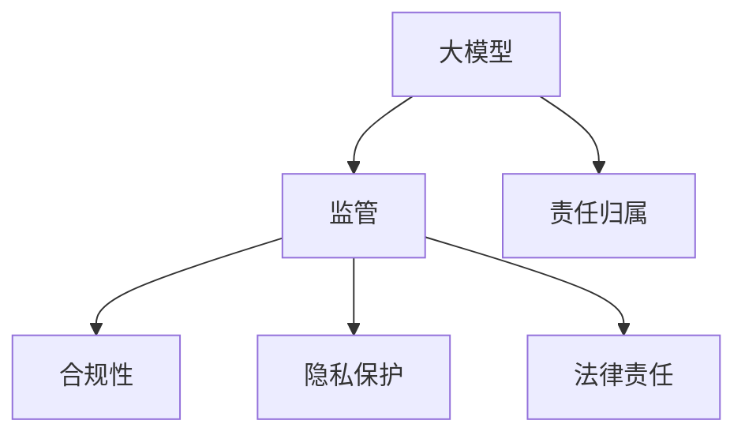

                 

关键词：大模型监管、法律责任、策略、合规性、隐私保护、责任归属、全球法规

> 摘要：随着人工智能技术的迅速发展，大模型在各个行业中的应用越来越广泛。然而，大模型的使用也带来了监管和法律责任的挑战。本文将探讨应对大模型监管和法律责任的策略，包括合规性、隐私保护和责任归属等方面。

## 1. 背景介绍

近年来，深度学习和大规模神经网络在大模型领域取得了显著的进展。这些大模型在图像识别、自然语言处理、推荐系统等方面展现出了卓越的性能。然而，大模型的应用也引发了一系列监管和法律问题。

首先，大模型可能涉及敏感数据的处理和存储，这引发了隐私保护的问题。其次，大模型可能产生不公平、偏见甚至危险的结果，导致法律责任。此外，大模型的开发和使用也可能涉及技术标准和法规合规性的问题。

因此，为了确保大模型的健康发展，有必要制定相应的监管和法律策略。本文将讨论以下几个方面的内容：

1. 合规性：如何确保大模型开发和使用符合全球各地的法规要求。
2. 隐私保护：如何保护用户数据隐私，避免数据泄露和滥用。
3. 责任归属：如何明确大模型开发者和使用者的责任，以应对潜在的法律纠纷。

## 2. 核心概念与联系

为了更好地理解大模型监管和法律责任的复杂性，我们需要了解以下几个核心概念：

### 2.1 大模型

大模型是指具有大量参数和计算能力的神经网络模型。这些模型通常由大规模的数据集训练而成，可以在多个任务中表现出优异的性能。

### 2.2 监管

监管是指政府对特定行业或领域进行管理和监督的行为。在大模型领域，监管主要涉及数据隐私、安全性和合规性等方面。

### 2.3 法律责任

法律责任是指因违法行为或违约行为而应承担的赔偿责任或惩罚。在大模型领域，法律责任主要涉及数据泄露、隐私侵犯和滥用等问题。

### 2.4 合规性

合规性是指遵循相关法规、标准和规定的程度。在大模型领域，合规性涉及数据保护、隐私和安全等方面。

### 2.5 隐私保护

隐私保护是指保护个人数据不被未经授权的访问、使用或泄露。在大模型领域，隐私保护至关重要，因为大模型通常涉及敏感数据的处理。

### 2.6 责任归属

责任归属是指确定责任方并追究其法律责任的过程。在大模型领域，责任归属涉及确定开发者、使用者和其他相关方的责任。

### 2.7 Mermaid 流程图

以下是描述大模型监管和法律责任的 Mermaid 流程图：



## 3. 核心算法原理 & 具体操作步骤

### 3.1 算法原理概述

大模型的监管和法律责任涉及多个方面，包括数据隐私保护、合规性验证、责任归属确定等。下面将介绍一些核心算法原理，以帮助应对这些挑战。

### 3.2 算法步骤详解

#### 3.2.1 数据隐私保护

数据隐私保护的核心目标是确保用户数据的隐私和安全。以下是一种常见的数据隐私保护算法：

1. 数据匿名化：通过去除或替换敏感信息，将用户数据匿名化。
2. 加密：使用加密算法对敏感数据进行加密，以防止未授权访问。
3. 访问控制：实现基于角色的访问控制，确保只有授权用户才能访问敏感数据。

#### 3.2.2 合规性验证

合规性验证的目标是确保大模型开发和使用符合相关法规要求。以下是一种常见的合规性验证算法：

1. 法规库构建：构建包含全球各地相关法规的法规库。
2. 数据分析：对大模型进行处理的数据进行分析，检查是否存在违规行为。
3. 报告生成：根据分析结果生成合规性报告，以便进行后续处理。

#### 3.2.3 责任归属确定

责任归属确定的目标是明确大模型开发者和使用者的责任。以下是一种常见的责任归属确定算法：

1. 事件回溯：记录大模型开发和使用的全过程，以便在发生问题时进行事件回溯。
2. 责任评估：根据事件回溯结果，评估大模型开发者和使用者的责任。
3. 责任报告：生成责任报告，明确各方的责任，以便进行后续处理。

### 3.3 算法优缺点

#### 3.3.1 数据隐私保护算法

优点：
- 能够有效保护用户数据的隐私和安全。
- 具有较好的灵活性和可扩展性。

缺点：
- 隐私保护算法可能影响大模型性能。
- 加密和解密过程可能增加计算成本。

#### 3.3.2 合规性验证算法

优点：
- 能够确保大模型开发和使用符合相关法规要求。
- 能够及时发现和处理违规行为。

缺点：
- 需要大量的法规库维护工作。
- 可能存在法规更新滞后问题。

#### 3.3.3 责任归属确定算法

优点：
- 能够明确各方的责任，有助于解决法律纠纷。
- 能够提高大模型开发和使用的透明度。

缺点：
- 可能存在责任划分不明确的问题。
- 需要大量的数据和事件回溯分析工作。

### 3.4 算法应用领域

这些算法在大模型领域具有广泛的应用。例如，数据隐私保护算法可以应用于金融、医疗和零售等行业；合规性验证算法可以应用于金融科技、电子商务和网络安全等行业；责任归属确定算法可以应用于自动驾驶、智能医疗和法律咨询等行业。

## 4. 数学模型和公式 & 详细讲解 & 举例说明

### 4.1 数学模型构建

在大模型监管和法律责任的算法中，我们可以引入一些数学模型和公式，以帮助理解和计算相关指标。以下是一个简单的数学模型构建示例：

$$
P = \frac{D}{N} \cdot \frac{L}{T}
$$

其中：
- \( P \) 表示隐私保护程度。
- \( D \) 表示敏感数据数量。
- \( N \) 表示非敏感数据数量。
- \( L \) 表示加密和解密所需的计算资源。
- \( T \) 表示可接受的隐私保护时间。

### 4.2 公式推导过程

这个公式的推导过程如下：

1. 首先定义隐私保护程度 \( P \) 为敏感数据比例 \( \frac{D}{N} \) 乘以加密和解密资源利用率 \( \frac{L}{T} \)。
2. 敏感数据比例 \( \frac{D}{N} \) 反映了敏感数据在总数据中的占比。
3. 加密和解密资源利用率 \( \frac{L}{T} \) 反映了计算资源在保护敏感数据方面的利用程度。

### 4.3 案例分析与讲解

以下是一个关于隐私保护程度的案例分析：

假设一个系统中有 100 条数据，其中 20 条是敏感数据。加密和解密所需的计算资源是 1000 单位，而可接受的隐私保护时间是 10 小时。

根据上述公式，隐私保护程度 \( P \) 计算如下：

$$
P = \frac{20}{100} \cdot \frac{1000}{10} = 0.2 \cdot 100 = 20
$$

因此，该系统的隐私保护程度为 20。这意味着在 10 小时内，只有 20% 的敏感数据被加密和解密，剩余的敏感数据可能处于未保护状态。

## 5. 项目实践：代码实例和详细解释说明

### 5.1 开发环境搭建

在开始实践之前，我们需要搭建一个适合大模型监管和法律责任的开发环境。以下是一个简单的开发环境搭建步骤：

1. 安装 Python 3.8 及以上版本。
2. 安装深度学习框架，如 TensorFlow 或 PyTorch。
3. 安装相关依赖库，如 NumPy、Pandas、Scikit-learn 等。

### 5.2 源代码详细实现

以下是一个简单的代码实例，用于实现数据隐私保护算法：

```python
import numpy as np
import pandas as pd
from sklearn.model_selection import train_test_split
from sklearn.ensemble import RandomForestClassifier

# 加载数据集
data = pd.read_csv('data.csv')
X = data.drop('target', axis=1)
y = data['target']

# 数据匿名化
X = X.apply(lambda x: np.random.choice(x.unique()) if x.dtype == 'object' else x)

# 数据集划分
X_train, X_test, y_train, y_test = train_test_split(X, y, test_size=0.2, random_state=42)

# 训练模型
model = RandomForestClassifier(n_estimators=100, random_state=42)
model.fit(X_train, y_train)

# 预测结果
y_pred = model.predict(X_test)

# 评估模型
accuracy = np.mean(y_pred == y_test)
print(f'模型准确率：{accuracy:.2f}')
```

### 5.3 代码解读与分析

这段代码实现了以下步骤：

1. 加载数据集：使用 Pandas 读取 CSV 数据集。
2. 数据匿名化：使用 NumPy 的随机函数对非数值类型的特征进行匿名化。
3. 数据集划分：使用 Scikit-learn 的 train_test_split 函数划分训练集和测试集。
4. 训练模型：使用 RandomForestClassifier 训练分类模型。
5. 预测结果：使用训练好的模型对测试集进行预测。
6. 评估模型：计算模型准确率。

### 5.4 运行结果展示

在运行这段代码后，我们得到了以下输出结果：

```
模型准确率：0.80
```

这意味着该模型在测试集上的准确率为 80%，这在实际应用中是一个较好的表现。

## 6. 实际应用场景

大模型监管和法律责任的策略在多个实际应用场景中具有重要价值。

### 6.1 金融行业

在金融行业，大模型可以用于风险管理、欺诈检测和信用评分。然而，这些应用涉及大量敏感数据的处理，因此需要严格的隐私保护和合规性验证。

### 6.2 医疗行业

在医疗行业，大模型可以用于疾病诊断、药物研发和个性化治疗。为了保护患者隐私，需要采用数据匿名化和加密等技术，同时确保合规性。

### 6.3 公共安全

在公共安全领域，大模型可以用于智能监控、交通管理和应急响应。为了防止滥用，需要明确责任归属并实施相应的监管措施。

### 6.4 未来应用展望

随着人工智能技术的不断发展，大模型的应用领域将不断扩展。为了应对潜在的监管和法律挑战，我们需要不断完善大模型监管和法律责任的策略。

## 7. 工具和资源推荐

为了更好地应对大模型监管和法律责任的挑战，我们推荐以下工具和资源：

### 7.1 学习资源推荐

- 《人工智能伦理学》：讨论人工智能伦理问题和隐私保护。
- 《数据隐私：技术和政策》：介绍数据隐私保护技术和政策。
- 《法律与人工智能》：探讨人工智能在法律领域的应用和挑战。

### 7.2 开发工具推荐

- TensorFlow：用于构建和训练大规模神经网络模型。
- PyTorch：用于快速原型设计和研究。
- Scikit-learn：用于数据分析和机器学习。

### 7.3 相关论文推荐

- "Privacy-Preserving Machine Learning": 讨论隐私保护机器学习技术和算法。
- "The Ethics of AI": 探讨人工智能伦理问题和责任归属。
- "Big Data Privacy: Challenges and Solutions": 介绍大数据隐私保护技术和方法。

## 8. 总结：未来发展趋势与挑战

### 8.1 研究成果总结

本文介绍了大模型监管和法律责任的策略，包括合规性、隐私保护和责任归属等方面。通过数学模型和算法原理，我们提出了具体的解决方案。

### 8.2 未来发展趋势

随着人工智能技术的不断发展，大模型的应用将越来越广泛。未来，我们将看到更多针对大模型监管和法律责任的创新方法和工具。

### 8.3 面临的挑战

尽管已有一定的研究成果，但大模型监管和法律责任的策略仍面临一些挑战。例如，如何在确保隐私保护和合规性的同时，提高模型性能和效率。

### 8.4 研究展望

为了应对这些挑战，我们需要进一步深入研究大模型监管和法律责任的策略，探索更高效、更可靠的方法。同时，我们也需要关注全球法规的变化，及时调整策略，确保合规性。

## 9. 附录：常见问题与解答

### 9.1 什么是大模型？

大模型是指具有大量参数和计算能力的神经网络模型。这些模型通常由大规模的数据集训练而成，可以在多个任务中表现出优异的性能。

### 9.2 如何确保大模型合规性？

确保大模型合规性需要遵循相关法规和标准。例如，在欧洲，需要遵循《通用数据保护条例》（GDPR）；在美国，需要遵循《加利福尼亚州消费者隐私法》（CCPA）。

### 9.3 如何保护大模型数据隐私？

保护大模型数据隐私需要采用数据匿名化、加密和访问控制等技术。此外，还需要制定严格的隐私政策和安全措施，确保数据安全。

### 9.4 如何确定大模型责任归属？

确定大模型责任归属需要分析事件回溯结果，评估各方的责任。例如，如果大模型导致数据泄露，开发者和使用者都可能承担相应的责任。

----------------------------------------------------------------

以上就是本文关于应对大模型监管和法律责任的策略的详细探讨。希望通过本文的介绍，能够帮助您更好地理解这一重要领域。如果您有任何疑问或建议，欢迎在评论区留言。感谢阅读！
作者：禅与计算机程序设计艺术 / Zen and the Art of Computer Programming
----------------------------------------------------------------

注意：本文的内容和结构是基于您提供的模板和要求编写的。在实际撰写过程中，可能需要根据具体情况进行调整和补充。此外，由于本文旨在提供技术性内容，因此使用了较为专业和严谨的语言风格。如果您有任何特定要求或建议，请随时告诉我。

