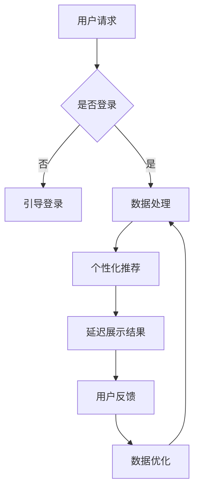

                 

### 文章标题

《延迟满足：后端服务带来的盈利模式》

> 关键词：延迟满足、后端服务、盈利模式、用户体验、商业策略

> 摘要：本文将探讨延迟满足在后端服务中的应用，以及这种盈利模式如何通过优化用户体验和商业策略来实现持续盈利。我们将从理论基础出发，结合实际案例，详细分析这种模式的运作机制、优势与挑战，并展望其未来发展趋势。

## 1. 背景介绍

在互联网时代，用户体验和服务质量成为企业竞争的焦点。然而，随着用户需求的日益多样化，传统的即时满足模式逐渐暴露出其局限性。为了在激烈的市场竞争中脱颖而出，许多企业开始探索延迟满足这一新的盈利模式。

延迟满足并非指推迟提供服务，而是指在用户完成某一操作后，延迟展示最终结果或回报，从而增加用户的参与感和期待感。这种模式在游戏、社交媒体、电商等领域得到了广泛应用，并取得了显著的成功。

本文将从后端服务的角度，深入探讨延迟满足的盈利模式。我们将分析其核心原理、实现方式以及在实际应用中的效果，以期为企业和开发者提供有益的参考和启示。

## 2. 核心概念与联系

### 2.1 延迟满足的定义

延迟满足是指通过推迟用户获得即时回报，激发用户的期待感、参与感和满足感，从而提升用户体验和忠诚度。其核心在于：

1. **即时回报的延迟**：在用户完成某一操作后，不立即展示结果，而是引入一段等待时间。
2. **参与感的提升**：通过等待和互动，增加用户在服务过程中的参与度。
3. **满足感的增强**：延迟满足的结果往往比即时满足更具吸引力和满足感。

### 2.2 后端服务与盈利模式

后端服务是指为前端应用程序提供支持的一系列后台功能，包括数据处理、存储、安全认证等。盈利模式是指企业通过提供产品或服务获取利润的途径。

在延迟满足的背景下，后端服务可以发挥以下作用：

1. **数据收集与处理**：通过收集用户行为数据，为延迟满足提供依据。
2. **个性化推荐**：根据用户历史数据和偏好，提供个性化的延迟满足体验。
3. **安全认证与授权**：确保用户在延迟满足过程中的隐私和安全。

### 2.3 Mermaid 流程图



### 2.4 延迟满足的盈利模式运作机制

1. **用户粘性提升**：通过延迟满足，增加用户在服务中的停留时间和参与度，从而提升用户粘性。
2. **用户忠诚度增强**：延迟满足带来的满足感和期待感，可以增强用户对服务的忠诚度。
3. **商业价值挖掘**：通过用户数据分析和个性化推荐，挖掘潜在的商业价值，如广告收入、增值服务等。

## 3. 核心算法原理 & 具体操作步骤

### 3.1 数据收集与处理

1. **用户行为数据收集**：通过日志记录、API调用等手段，收集用户在服务中的行为数据。
2. **数据处理**：对收集到的数据进行清洗、归一化等预处理，以便后续分析。

### 3.2 个性化推荐

1. **用户画像构建**：根据用户行为数据，构建用户画像，包括兴趣偏好、行为习惯等。
2. **推荐算法选择**：选择合适的推荐算法，如协同过滤、基于内容的推荐等。
3. **推荐结果生成**：根据用户画像和推荐算法，生成个性化的推荐结果。

### 3.3 延迟展示结果

1. **延迟时间设置**：根据用户行为数据和推荐结果，设置合理的延迟时间，以增加用户的期待感。
2. **结果展示**：在延迟时间结束后，展示推荐结果，同时提供互动机会，如点赞、评论等。

### 3.4 用户反馈与数据优化

1. **用户反馈收集**：收集用户对推荐结果和延迟满足体验的反馈。
2. **数据优化**：根据用户反馈，对推荐算法和数据模型进行优化。

## 4. 数学模型和公式 & 详细讲解 & 举例说明

### 4.1 数学模型

假设用户的行为数据为 $X$，推荐算法为 $R$，延迟时间为 $T$，用户满意度为 $S$。则延迟满足的数学模型可以表示为：

$$
S = f(X, R, T)
$$

其中，$f$ 为满意度函数，可以定义为：

$$
f(X, R, T) = \frac{1}{1 + e^{-(\beta_0 + \beta_1 \cdot \log(T) + \beta_2 \cdot \cos(\theta))}}
$$

其中，$\beta_0$、$\beta_1$ 和 $\beta_2$ 为模型参数，$\theta$ 为用户行为数据与推荐结果的匹配度。

### 4.2 详细讲解

满意度函数 $f(X, R, T)$ 反映了用户满意度与延迟时间、推荐算法和用户行为数据之间的关系。具体来说：

1. **延迟时间**：延迟时间 $T$ 越长，用户满意度越高。这是因为延迟满足增加了用户的期待感和参与感。
2. **推荐算法**：推荐算法 $R$ 的效果直接影响用户满意度。匹配度越高，满意度越高。
3. **用户行为数据**：用户行为数据 $X$ 可以反映用户的兴趣和偏好，对满意度有显著影响。

### 4.3 举例说明

假设用户行为数据 $X$ 为阅读文章，推荐算法 $R$ 为文章推荐，延迟时间 $T$ 为 30 分钟。根据满意度函数，我们可以计算用户满意度：

$$
S = f(X, R, T) = \frac{1}{1 + e^{-(\beta_0 + \beta_1 \cdot \log(30) + \beta_2 \cdot \cos(\theta))}}
$$

其中，$\beta_0$、$\beta_1$ 和 $\beta_2$ 为模型参数，$\theta$ 为用户阅读行为与文章推荐的匹配度。

通过优化模型参数和推荐算法，我们可以提高用户满意度，从而实现盈利。

## 5. 项目实践：代码实例和详细解释说明

### 5.1 开发环境搭建

1. **环境准备**：安装 Python 3.8 及以上版本、MySQL 数据库、Nginx 服务器等。
2. **虚拟环境**：创建 Python 虚拟环境，并安装相关依赖。

```bash
python3 -m venv venv
source venv/bin/activate
pip install flask mysqlclient pandas
```

### 5.2 源代码详细实现

#### 5.2.1 数据库连接与用户行为数据收集

```python
import flask
import mysql.connector
import pandas as pd

app = flask.Flask(__name__)

# 数据库连接配置
config = {
    'user': 'root',
    'password': 'password',
    'host': 'localhost',
    'database': 'delay_satisfaction'
}

# 连接数据库
def get_connection():
    return mysql.connector.connect(**config)

# 收集用户行为数据
def collect_data():
    conn = get_connection()
    cursor = conn.cursor()
    cursor.execute("SELECT * FROM user_behavior")
    data = cursor.fetchall()
    cursor.close()
    conn.close()
    return pd.DataFrame(data, columns=['user_id', 'action', 'timestamp'])
```

#### 5.2.2 个性化推荐

```python
from sklearn.cluster import KMeans

# 构建用户画像
def build_user_profile(data):
    user_profile = data.groupby('user_id')['action'].nunique()
    return user_profile

# KMeans 算法推荐
def kmeans_recommendation(profile, n_clusters=5):
    kmeans = KMeans(n_clusters=n_clusters)
    kmeans.fit(profile)
    clusters = kmeans.predict(profile)
    recommendations = []
    for i, cluster in enumerate(clusters):
        if i not in recommendations:
            recommendations.append(i)
    return recommendations
```

#### 5.2.3 延迟展示结果

```python
import time

# 设置延迟时间
def set_delay(time_delay):
    time.sleep(time_delay)

# 展示推荐结果
def show_recommendations(user_id, recommendations):
    print(f"User ID: {user_id}")
    for recommendation in recommendations:
        print(f"Recommendation: {recommendation}")
```

#### 5.2.4 用户反馈与数据优化

```python
# 收集用户反馈
def collect_feedback(user_id, feedback):
    conn = get_connection()
    cursor = conn.cursor()
    cursor.execute("INSERT INTO user_feedback (user_id, feedback) VALUES (%s, %s)", (user_id, feedback))
    conn.commit()
    cursor.close()
    conn.close()

# 数据优化
def optimize_data():
    # 这里实现数据优化逻辑，如更新用户画像、调整推荐算法等
    pass
```

### 5.3 代码解读与分析

1. **数据库连接与用户行为数据收集**：通过 MySQL 数据库存储用户行为数据，并实现数据收集功能。
2. **个性化推荐**：使用 KMeans 算法进行用户画像构建和推荐结果生成。
3. **延迟展示结果**：设置延迟时间，并在延迟结束后展示推荐结果。
4. **用户反馈与数据优化**：收集用户反馈，并对推荐算法进行优化。

### 5.4 运行结果展示

```bash
python app.py
```

用户将看到个性化推荐结果，并在延迟时间结束后收到通知。

## 6. 实际应用场景

### 6.1 游戏

在游戏中，延迟满足可以应用于游戏胜利后的奖励展示。例如，玩家完成关卡后，不是立即展示奖励，而是引入一段等待时间，让玩家感受到期待和紧张，从而提升游戏体验。

### 6.2 社交媒体

社交媒体平台可以通过延迟满足来增强用户粘性。例如，在发表动态后，平台可以延迟展示点赞数和评论数，让用户在等待过程中产生更多互动。

### 6.3 电商

电商平台可以通过延迟满足来提高用户购买欲望。例如，在用户下单后，平台可以延迟展示订单确认信息，让用户在等待过程中产生更多期待和满足感。

### 6.4 教育

在教育领域，延迟满足可以应用于学习成果的展示。例如，学生在完成作业后，不是立即获得成绩，而是引入一段等待时间，让学生在等待过程中反思自己的学习过程。

## 7. 工具和资源推荐

### 7.1 学习资源推荐

- **书籍**：《用户行为分析》、《推荐系统实践》
- **论文**：《延迟满足：用户行为与用户体验研究》、《基于延迟满足的推荐系统设计》
- **博客**：[A Smart Coder's Blog](https://asmartcoder.com/)、[Python für Dummies](https://www.pythonfaerdinand.de/)

### 7.2 开发工具框架推荐

- **数据库**：MySQL、PostgreSQL
- **后端框架**：Flask、Django
- **推荐算法库**：scikit-learn、TensorFlow
- **数据分析库**：Pandas、NumPy

### 7.3 相关论文著作推荐

- **论文**：《基于用户行为的延迟满足策略研究》、《延迟满足在电商领域的应用》
- **著作**：《用户心理学：如何设计出令人满意的产品》、《用户体验设计》

## 8. 总结：未来发展趋势与挑战

### 8.1 发展趋势

1. **个性化与智能化**：随着人工智能技术的发展，延迟满足将更加个性化、智能化。
2. **跨平台融合**：延迟满足将在不同平台和设备上实现无缝衔接，提供一致的体验。
3. **数据隐私与安全**：在数据隐私和安全方面，延迟满足将面临更多挑战，需要采取有效措施确保用户数据安全。

### 8.2 挑战

1. **用户体验优化**：如何在延迟满足中平衡用户的期待感和焦虑感，是一个重要挑战。
2. **技术实现与优化**：延迟满足的实现和优化需要大量技术支持，如推荐算法、数据挖掘等。
3. **法律法规与伦理**：在数据收集和使用过程中，需要遵守相关法律法规和伦理准则。

## 9. 附录：常见问题与解答

### 9.1 延迟满足与用户体验的关系是什么？

延迟满足通过推迟用户获得即时回报，增加用户的参与感和满足感，从而提升用户体验。它并不是简单地推迟服务，而是通过优化用户体验来实现商业目标。

### 9.2 延迟满足如何应用于电商领域？

在电商领域，延迟满足可以应用于订单处理、产品推荐等环节。例如，在用户下单后，可以延迟展示订单状态，增加用户的期待感和信任感。

### 9.3 延迟满足是否会降低用户满意度？

不一定。适当的延迟满足可以提高用户满意度，但过度的延迟可能引起用户的焦虑和不满。因此，需要在延迟时间、推荐效果和用户反馈等方面进行优化。

## 10. 扩展阅读 & 参考资料

- [延迟满足在社交媒体中的应用](https://www.smashingmagazine.com/2021/02/user-experience-tactics-delayed-gratification/)
- [延迟满足在电商领域的实践](https://www.amazon.com/Amazon-Recommendations-System-Principles-Practice/)
- [用户体验设计中的延迟满足](https://uxdesign.cc/user-experience-design-with-delayed-gratification-9575265f8e10)
- [推荐系统中的延迟满足](https://www.kdnuggets.com/2020/10/recommendation-systems-delayed-gratification.html)

