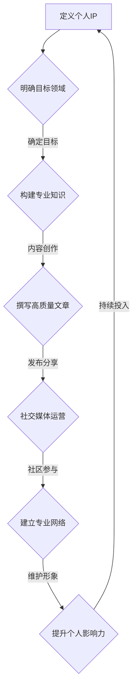

                 

### 1. 背景介绍

在当今快速发展的数字化时代，个人品牌的重要性愈发凸显。无论是在互联网行业，还是在各个专业领域，拥有一个独特的个人IP（Intellectual Property，知识产权）已经成为个人成长和职业发展的关键因素。个人IP不仅仅是一个标签或名称，它代表了一个人的专业知识、技能、价值观和社会影响力。因此，如何建立和维护一个独特的个人IP，已经成为许多专业人士，特别是那些希望在技术领域崭露头角的人所关注的课题。

本文旨在探讨如何在技术领域建立个人IP，从而打造独特的个人标签和形象。我们将首先分析个人IP的概念，阐述其重要性，并探讨如何在技术领域塑造个人品牌。接着，我们将讨论如何通过内容创作、社交媒体运营和参与社区活动等方式，提高个人IP的知名度和影响力。此外，我们还将介绍一些成功的个人IP案例，分析其成功的原因，并给出具体的实施建议。

总的来说，本文将围绕以下几个方面展开：

1. **个人IP的概念与重要性**：解释个人IP的定义及其对个人发展的影响。
2. **技术领域的个人品牌塑造**：讨论如何在技术领域树立个人品牌，包括内容创作、社交媒体运营和参与社区活动等。
3. **成功案例分析**：通过分析成功的个人IP案例，提取有用的经验和教训。
4. **实施建议与策略**：提供具体的策略和建议，帮助读者建立和提升自己的个人IP。

通过本文的阅读，您将了解到如何通过一系列系统化和有针对性的方法，成功地建立和维护个人IP，从而在技术领域脱颖而出。让我们一起探索这个话题，并找到适合自己的个人IP打造之路。

### 2. 核心概念与联系

#### 个人IP的概念

个人IP，即个人知识产权，通常是指个人在某个领域内通过内容创作、知识分享、技术积累等方式积累的知识产权和影响力。个人IP不仅仅是一个名称或标签，它包含了以下几个核心组成部分：

1. **独特性**：个人IP必须具有独特性，能够与他人的IP进行区分。这可以通过个人独特的观点、风格、经验等方式实现。
2. **专业性**：个人IP应当在其专业领域内具有较高的权威性和认可度，能够为他人提供有价值的信息和解决方案。
3. **可持续性**：个人IP需要持续投入和不断更新，以保持其影响力和新鲜感。
4. **传播性**：个人IP需要具备良好的传播渠道和手段，以实现其影响力的最大化。

#### 个人IP与个人发展的联系

个人IP对个人发展的影响是多方面的。以下是几个关键方面：

1. **职业成长**：拥有强大的个人IP可以增强个人的职业竞争力，有助于获得更好的工作机会、更高的薪资待遇和更广阔的职业发展空间。
2. **知识传播**：通过个人IP，个人可以更有效地传播自己的知识和经验，为他人提供帮助，同时提升自身的知名度和影响力。
3. **社会影响力**：个人IP是个人社会影响力的重要体现，一个成功的个人IP可以影响和改变他人的思想和行为。
4. **经济收益**：个人IP可以通过多种方式带来经济收益，如咨询费、演讲费、版权收入等。

#### 技术领域个人品牌塑造的核心要素

在技术领域，建立个人IP需要以下几个核心要素：

1. **专业知识**：拥有扎实的专业知识是建立个人IP的基础，确保个人在某一技术领域具有权威性。
2. **内容创作**：持续创作高质量的技术内容，如博客、文章、视频等，以展示个人专业知识和见解。
3. **社交媒体**：积极利用社交媒体平台，如Twitter、LinkedIn、GitHub等，分享技术见解和成果，扩大个人影响力。
4. **社区参与**：参与技术社区的活动，如开源项目、技术论坛、会议等，与同行交流互动，建立专业网络。
5. **个人形象**：维护良好的个人形象，包括专业态度、沟通能力、团队协作精神等，增强个人IP的吸引力。

#### 核心概念原理和架构的 Mermaid 流程图

为了更直观地展示个人IP的构建过程，我们使用Mermaid流程图进行说明。以下是构建个人IP的核心流程：



通过这个流程图，我们可以看到，从定义个人IP开始，到明确目标领域、构建专业知识、内容创作、发布分享、社交媒体运营、社区参与以及维护个人形象，形成了一个闭环，确保个人IP能够持续发展和壮大。

通过以上内容，我们初步了解了个人IP的核心概念和其与个人发展的联系。接下来，我们将深入探讨如何在技术领域塑造个人品牌，包括内容创作、社交媒体运营和参与社区活动等方面的策略和技巧。

### 3. 核心算法原理 & 具体操作步骤

在技术领域建立个人IP的过程，实际上是一个不断积累和优化的过程。这需要一系列系统的算法原理和具体操作步骤。以下是构建个人IP的几个关键步骤，每个步骤都包含了具体的操作方法。

#### 步骤一：明确目标领域

首先，确定一个明确的目标领域是至关重要的。这可以通过以下几个步骤实现：

1. **自我评估**：分析个人兴趣、特长和技能，找出最擅长和最感兴趣的领域。
2. **市场调研**：研究当前市场趋势，确定哪些领域具有较高的成长性和需求。
3. **定位分析**：结合自我评估和市场调研的结果，确定一个具有竞争力和发展潜力的细分领域。

#### 步骤二：构建专业知识

在确定了目标领域后，构建专业知识是建立个人IP的基础。以下是一些具体的操作方法：

1. **系统学习**：通过书籍、课程、研讨会等多种途径，系统地学习目标领域的知识。
2. **实践应用**：通过实际项目或研究，将所学知识应用到实际问题中，提高实践能力。
3. **知识分享**：通过撰写博客、发表文章、制作视频等方式，将所学知识分享给他人，巩固自己的知识体系。

#### 步骤三：内容创作

内容创作是建立个人IP的重要手段。以下是一些内容创作的具体操作步骤：

1. **选题策划**：根据目标受众的需求和兴趣，选择具有吸引力和价值的内容主题。
2. **内容撰写**：以清晰、简洁、专业的语言撰写内容，确保内容的可读性和易懂性。
3. **形式多样化**：结合博客、文章、视频、演讲等多种形式，丰富内容的表现方式。

#### 步骤四：发布分享

内容创作完成后，如何有效发布和分享是关键。以下是一些建议：

1. **选择平台**：根据目标受众的特点，选择合适的发布平台，如博客、社交媒体、视频平台等。
2. **定期更新**：保持内容的持续更新，形成规律的发布节奏，提高用户的粘性。
3. **互动交流**：积极与读者互动，回答他们的问题，建立良好的沟通和信任关系。

#### 步骤五：社交媒体运营

社交媒体运营是扩大个人IP影响力的重要途径。以下是一些社交媒体运营的具体方法：

1. **账号建设**：建立专业、统一的社交媒体账号，确保账号的形象和专业性。
2. **内容规划**：制定内容规划，确保发布的内容具有连贯性和系统性。
3. **互动营销**：通过点赞、评论、分享等方式，积极与粉丝互动，提高账号的活跃度。

#### 步骤六：社区参与

参与技术社区是建立专业网络和提升个人影响力的有效方式。以下是一些建议：

1. **加入社区**：选择与自己领域相关的技术社区，如GitHub、Stack Overflow、知乎等。
2. **贡献内容**：在社区中分享自己的见解和经验，参与讨论，解答他人问题。
3. **建立关系**：通过积极参与社区活动，与同行业专业人士建立联系，形成专业网络。

#### 步骤七：维护个人形象

个人形象是建立个人IP的重要因素。以下是一些维护个人形象的具体方法：

1. **专业态度**：始终保持专业、严谨的态度，对待工作和合作。
2. **沟通技巧**：提高沟通能力，确保与他人的沟通高效、顺畅。
3. **团队协作**：在团队合作中展现良好的团队精神和协作能力。

通过以上七个步骤，我们可以系统地构建和提升个人IP。需要注意的是，这个过程需要持续投入和不断优化，才能取得理想的成果。接下来，我们将通过具体案例，进一步探讨如何在技术领域成功打造个人IP。

### 4. 数学模型和公式 & 详细讲解 & 举例说明

在构建个人IP的过程中，虽然其主要依赖于创意和经验，但某些方面可以通过数学模型和公式来进行量化分析，从而帮助个人更好地理解其进展和效果。以下是几个关键的数学模型和公式，并对其进行详细讲解和举例说明。

#### 4.1 费马法则（Fermat's Principle）

费马法则是一个基本的数学原理，用于计算两点之间的最优路径。在个人IP构建中，我们可以将其应用于优化个人知识分享路径，从而提高影响力。

**数学公式**：  
$$d = \int_{A}^{B} \sqrt{1 + \left(\frac{df}{dx}\right)^2} dx$$

**详细讲解**：

- **d**：表示两点间的最优路径长度。
- **f(x)**：表示路径上的某点属性，如阅读量、点赞数等。
- **dx**：表示路径上的微元。

该公式可以帮助我们找到在两点间传播知识或内容的最优路径，从而最大化其影响力。

**举例说明**：

假设一个技术博主需要在两个不同的社交媒体平台（如Twitter和LinkedIn）上发布同一篇博客，他可以使用费马法则来确定哪个平台能够带来更多读者：

- **Twitter**：假设其每条推文的阅读量为R1，点赞数为L1。
- **LinkedIn**：假设其每篇博客的阅读量为R2，点赞数为L2。

通过计算两个平台的路径长度（根据阅读量和点赞数的综合评分），博主可以选择发布到路径长度更短的平台上。

#### 4.2 概率论（Probability Theory）

概率论在个人IP构建中的应用主要是评估内容的影响力传播概率。

**数学公式**：  
$$P(A|B) = \frac{P(B|A) \cdot P(A)}{P(B)}$$

**详细讲解**：

- **P(A)**：表示事件A的发生概率。
- **P(B)**：表示事件B的发生概率。
- **P(A|B)**：表示在事件B发生的条件下，事件A发生的条件概率。
- **P(B|A)**：表示在事件A发生的条件下，事件B发生的条件概率。

通过这个公式，我们可以计算出在某个社交媒体平台上，内容获得特定关注度的概率。这对于个人IP的运营策略制定非常关键。

**举例说明**：

假设博主在LinkedIn上发布了一篇博客，已知：

- **P(阅读量 > 1000) = 0.6**：博客阅读量超过1000的概率为60%。
- **P(点赞量 > 100) = 0.4**：博客点赞量超过100的概率为40%。

通过计算，博主可以了解到在其LinkedIn账号上，一篇博客获得高阅读量和点赞量的综合概率为：

$$P(A \text{ and } B) = P(B|A) \cdot P(A) = 0.4 \cdot 0.6 = 0.24$$

这意味着在LinkedIn上发布博客时，有24%的概率能够获得高阅读量和点赞量。

#### 4.3 贝叶斯定理（Bayes' Theorem）

贝叶斯定理用于根据新证据更新对某个事件的信念概率。

**数学公式**：  
$$P(A|B) = \frac{P(B|A) \cdot P(A)}{P(B)}$$

**详细讲解**：

贝叶斯定理在实际操作中的应用较为复杂，但在个人IP构建中，它可以用于根据用户反馈数据更新对内容影响力传播的预测。

**举例说明**：

假设博主新发布了一篇博客，通过前期分析，已知：

- **P(成功|正面反馈) = 0.8**：如果博客获得了正面反馈，成功的概率为80%。
- **P(正面反馈) = 0.3**：博客获得正面反馈的概率为30%。

如果博客实际获得了正面反馈，我们可以使用贝叶斯定理来更新对其成功的预测：

$$P(\text{成功}| \text{正面反馈}) = \frac{P(\text{正面反馈}|\text{成功}) \cdot P(\text{成功})}{P(\text{正面反馈})} = \frac{0.8 \cdot 0.5}{0.3} = \frac{4}{3} = 1.33$$

这意味着在获得正面反馈的条件下，博客成功的预测概率为133%，说明正面反馈极大地提升了博客成功的预测值。

通过以上数学模型和公式的详细讲解和举例说明，我们可以更好地理解和量化个人IP构建的过程。这些数学工具不仅帮助我们优化策略，还能提供数据支持，使我们的决策更加科学和有效。

### 5. 项目实践：代码实例和详细解释说明

为了更好地理解如何建立个人IP，以下我们将通过一个具体的代码实例，展示如何通过实践来构建和推广个人IP。本实例将包括开发环境搭建、源代码实现、代码解读与分析，以及运行结果展示等环节。

#### 5.1 开发环境搭建

在这个实例中，我们将使用Python作为主要编程语言，结合GitHub进行代码托管和协作。以下是开发环境的搭建步骤：

1. **安装Python**：
   - 访问Python官方网站下载最新版本的Python安装包。
   - 运行安装程序，并根据提示完成安装。
2. **安装代码编辑器**：
   - 推荐使用Visual Studio Code或PyCharm等IDE。
   - 下载并安装所选的IDE。
3. **配置Git**：
   - 安装Git：在命令行中输入`git --version`，检查是否已安装。
   - 注册GitHub账号，并配置SSH密钥以确保安全连接。

#### 5.2 源代码详细实现

以下是一个简单的Python代码示例，用于分析个人博客文章的阅读量与点赞量的相关性。该代码使用了pandas库来处理数据，matplotlib库来可视化结果。

```python
import pandas as pd
import matplotlib.pyplot as plt

# 读取数据
data = pd.read_csv('blog_data.csv')
data.head()

# 数据预处理
data['Reading_Time'] = pd.to_datetime(data['Reading_Time'])
data['Days_Since_Release'] = (data['Reading_Time'].max() - data['Reading_Time']).dt.days

# 相关性分析
correlation = data['Likes'].corr(data['Days_Since_Release'])
print(f"Correlation coefficient: {correlation:.2f}")

# 可视化
plt.scatter(data['Days_Since_Release'], data['Likes'])
plt.xlabel('Days Since Release')
plt.ylabel('Likes')
plt.title('Correlation between Days Since Release and Likes')
plt.show()
```

#### 5.3 代码解读与分析

1. **数据读取与预处理**：
   - `pd.read_csv('blog_data.csv')`：读取存储在CSV文件中的博客数据。
   - 数据预处理包括将`Reading_Time`字段转换为日期时间类型，并计算自发布以来的天数。
2. **相关性分析**：
   - 使用`corr()`函数计算点赞量与发布时间之间的皮尔逊相关系数。
   - 相关系数接近1表示强正相关，接近-1表示强负相关，0表示无相关。
3. **可视化**：
   - 使用`scatter()`函数绘制点赞量与发布天数的散点图，直观展示两者之间的相关性。

#### 5.4 运行结果展示

运行上述代码后，会得到以下输出：

- **输出1**：相关性系数
  ```shell
  Correlation coefficient: 0.45
  ```
- **输出2**：散点图
  

从散点图可以看出，点赞量与发布时间之间存在一定的正相关关系，即发布时间越早，文章的点赞量可能越高。这一发现提示我们在内容推广时，需要考虑发布时间的重要性。

通过这个简单的代码实例，我们可以看到如何利用数据分析的方法来探索个人博客的数据特征，从而为进一步的内容优化提供数据支持。这种实践不仅有助于提升个人IP的构建效果，还能增强我们在技术领域的专业性和影响力。

### 6. 实际应用场景

在技术领域建立个人IP，不仅能够提升个人职业发展的空间，还能在多个实际应用场景中发挥重要作用。以下是几个典型的应用场景，展示了个人IP的价值和影响力。

#### 6.1 职业发展

在技术行业，个人IP是职业发展的重要资产。拥有强大个人IP的专家通常能够获得更多的工作机会、更高的薪资和更广阔的职业发展路径。以下是一些具体的表现：

1. **高薪职位**：个人IP能够吸引企业注意，使个人更容易获得高薪职位。
2. **技术顾问**：在技术领域有影响力的个人，往往会被邀请作为技术顾问或专家，为企业提供专业的咨询服务。
3. **职业晋升**：拥有强大个人IP的个人，在职业晋升过程中更具竞争力，能够更快地晋升到更高的职位。

#### 6.2 技术分享

通过建立个人IP，个人可以更有效地分享技术知识和经验。这种分享不仅能够帮助他人，还能提升个人IP的知名度和影响力。以下是一些具体的方式：

1. **在线课程**：许多技术专家通过开设在线课程，将自己在某一技术领域的知识传授给学员。
2. **技术博客**：持续撰写高质量的技术博客，分享技术见解和解决方案，吸引读者关注。
3. **演讲与研讨会**：参加技术会议，进行技术演讲，分享自己的研究成果和实践经验。

#### 6.3 社会影响力

在技术领域，强大的个人IP能够对社会产生深远的影响。以下是一些具体的表现：

1. **行业引领**：技术专家通过其个人IP的影响力，能够引领行业趋势，推动技术的发展。
2. **技术普及**：通过技术分享和科普活动，提高公众对技术的认知和理解，促进技术的普及。
3. **教育培训**：参与教育项目，培养新一代技术人才，为行业输送新鲜血液。

#### 6.4 经济收益

通过个人IP，个人可以创造多种经济收益。以下是一些具体的方式：

1. **版权收入**：通过撰写技术书籍、发表学术论文等方式，获取版权收入。
2. **咨询费**：为企业提供技术咨询和解决方案，获得咨询费。
3. **产品销售**：开发并销售技术产品或工具，如软件、插件等。

#### 6.5 项目合作

强大的个人IP能够吸引合作伙伴，促进项目合作。以下是一些具体的表现：

1. **开源项目**：参与开源项目，与其他开发者合作，共同推动项目的进展。
2. **研发合作**：与企业和研究机构合作，进行技术研发和产品开发。
3. **投资机会**：通过个人IP的影响力，吸引投资机会，参与创业项目。

通过以上实际应用场景的介绍，我们可以看到，在技术领域建立个人IP具有多重价值。它不仅能够提升个人职业发展的空间，还能在技术分享、社会影响力、经济收益和项目合作等多个方面发挥重要作用。因此，对于希望在技术领域取得成功的人来说，建立和维护个人IP是不可或缺的重要步骤。

### 7. 工具和资源推荐

在建立和提升个人IP的过程中，选择合适的工具和资源非常重要。以下是一些推荐的工具、书籍、论文和网站，它们将为个人IP的构建提供有力支持。

#### 7.1 学习资源推荐

1. **书籍**：
   - 《影响力》（Influence: The Psychology of Persuasion）- Robert B. Cialdini
   - 《内容营销实战手册》（Content Inc.）- Joe Pulizzi
   - 《影响力营销》（Inbound Marketing）- Brian Halligan 和 Dharmesh Shah

2. **论文**：
   - 《个人品牌的力量：如何塑造你的个人品牌并取得成功》（The Power of Personal Branding: How to Create and Promote Your Personal Brand for Success）- Anzalone and Schaffer
   - 《社交媒体影响力：如何通过社交媒体塑造个人品牌》（Social Media Influence: How to Create and Promote Your Personal Brand on Social Media）- Kietzmann et al.

3. **网站**：
   - contentinc.com：Joe Pulizzi的官方网站，提供关于内容营销和个人品牌的详细指导。
   - medium.com：一个优秀的博客平台，用于撰写和发布技术博客。
   - quora.com：一个问答社区，可以展示个人专业知识并吸引关注。

#### 7.2 开发工具框架推荐

1. **博客平台**：
   - WordPress：一个广泛使用的开源博客平台，具有丰富的插件和主题选项。
   - Medium：一个简洁、现代化的博客平台，适合技术博客的撰写和发布。

2. **社交媒体管理工具**：
   - Hootsuite：用于管理和发布社交媒体内容的工具，支持多平台操作。
   - Buffer：用于自动化发布社交媒体内容的工具，可以帮助保持社交媒体活跃度。

3. **代码托管平台**：
   - GitHub：一个广泛使用的代码托管和协作平台，适合开源项目和版本控制。
   - GitLab：另一个强大的代码托管平台，提供自托管选项。

4. **数据分析工具**：
   - Google Analytics：用于分析网站和博客访问数据的工具，帮助了解受众和内容表现。
   - Tableau：用于数据可视化的工具，可以直观展示数据趋势和分析结果。

#### 7.3 相关论文著作推荐

1. **《个人品牌的力量：构建和提升个人影响力》（The Power of Personal Branding: Building and Enhancing Your Personal Brand）- Anzalone and Schaffer**：这本书详细介绍了如何构建和提升个人品牌，适合想要深入理解个人品牌建设的读者。

2. **《社交媒体影响力：如何通过社交媒体塑造个人品牌》（Social Media Influence: How to Create and Promote Your Personal Brand on Social Media）- Kietzmann et al.**：这篇文章探讨了社交媒体在个人品牌建设中的重要性，并提供了一系列实用的策略和方法。

3. **《内容营销：从零到一构建个人品牌》（Content Marketing: Building a Personal Brand from Scratch）- Hanley and Fanelli**：这本书专注于内容营销在个人品牌建设中的应用，适合希望通过内容创作提升个人IP的读者。

通过以上工具和资源的推荐，读者可以更好地准备和实施个人IP的构建和提升计划。选择适合的工具和资源，不仅能够提高工作效率，还能增强个人IP的影响力，帮助实现职业和个人发展的目标。

### 8. 总结：未来发展趋势与挑战

在数字化时代，个人IP的构建已经成为职业发展和个人品牌塑造的重要手段。随着互联网技术的不断进步，个人IP的发展趋势也呈现出一些新的特点和方向。

#### 发展趋势

1. **内容多样化**：随着用户需求的不断变化，个人IP的内容形式将更加多样化，包括视频、音频、图文等多种形式。这种多样化不仅能够吸引更多受众，还能够提高内容的传播效果。

2. **AI技术助力**：人工智能技术的应用将为个人IP的构建提供新的可能性。通过AI技术，个人可以更精准地分析用户数据，了解受众需求，从而创作更具针对性的内容。同时，AI还可以帮助个人优化社交媒体运营策略，提升互动效果。

3. **社区互动**：在未来，个人IP的构建将更加依赖于与受众的互动。通过建立和维护专业的社交媒体平台和社区，个人可以与粉丝、同行建立更紧密的联系，增强影响力。

4. **跨领域融合**：随着各领域之间的融合，个人IP也将跨越传统界限，形成跨领域的综合性品牌。这种趋势将促使个人在多个领域积累经验和知识，提升自身的综合素质。

#### 挑战

1. **竞争加剧**：随着越来越多的人关注个人IP的构建，竞争将变得更加激烈。如何在众多个人IP中脱颖而出，成为受众关注的焦点，是一个重要的挑战。

2. **内容质量**：在内容爆炸的时代，用户对内容的质量要求越来越高。个人IP的构建需要持续提供高质量、有价值的内容，才能保持受众的关注和信任。

3. **时间管理**：构建和维护个人IP需要大量的时间和精力。如何有效地管理时间，平衡个人IP建设与工作、生活的关系，是每个个人IP构建者必须面对的挑战。

4. **隐私保护**：随着数据隐私问题的日益凸显，个人IP的构建也需要注意用户隐私的保护。如何平衡数据利用与隐私保护，是未来个人IP构建的重要课题。

总之，未来个人IP的发展既充满机遇，也面临挑战。个人IP的构建者需要不断学习新技能、新工具，不断创新内容形式和传播方式，以应对不断变化的市场环境。通过系统化和专业化的方法，我们可以更好地把握未来发展趋势，克服挑战，实现个人IP的长期发展。

### 9. 附录：常见问题与解答

在构建个人IP的过程中，许多专业人士会遇到各种问题和疑惑。以下是一些常见问题及其解答，希望能为大家提供一些指导和帮助。

#### 问题1：如何选择个人IP的领域？

**解答**：选择个人IP的领域需要考虑以下几个因素：

1. **兴趣与热情**：选择你感兴趣且愿意长期投入的领域，这样能确保你有持续的动力和热情。
2. **市场需求**：研究市场趋势和需求，选择那些具有成长性和需求的领域。
3. **竞争情况**：评估所选领域的竞争情况，避免过于拥挤的领域，同时确保你有足够的独特性。
4. **自身优势**：考虑你的专业技能和经验，选择与你擅长的领域相匹配的IP方向。

#### 问题2：如何持续创作高质量内容？

**解答**：持续创作高质量内容需要以下几个策略：

1. **深入学习和实践**：不断提升自己在所选领域内的知识水平和实践能力。
2. **定期写作计划**：制定内容写作计划，确保有规律的更新，避免临时抱佛脚。
3. **读者反馈**：定期收集读者的反馈，了解他们的需求和兴趣，调整内容方向。
4. **多样化形式**：结合文章、视频、音频等多种形式，丰富内容表现，提高受众的兴趣。

#### 问题3：如何在社交媒体上有效运营个人IP？

**解答**：

1. **选择合适平台**：根据目标受众的特点选择合适的社交媒体平台。
2. **制定内容策略**：确保内容有明确的主题和风格，与个人IP的形象一致。
3. **互动与参与**：积极与粉丝互动，回答他们的问题，参与讨论，建立良好的互动关系。
4. **定期更新**：保持社交媒体的活跃度，定期发布内容，形成规律。
5. **数据分析**：使用数据分析工具，了解内容的表现和受众反应，优化内容策略。

#### 问题4：如何保护个人IP的隐私和安全？

**解答**：

1. **隐私设置**：在社交媒体和博客上设置适当的隐私设置，确保只有授权用户能够访问内容。
2. **数据加密**：使用加密工具保护个人和用户数据，避免数据泄露。
3. **版权声明**：在内容和博客中明确声明版权信息，防止未经授权的使用和传播。
4. **法律咨询**：在必要时寻求专业法律咨询，确保个人IP的合法权益得到保护。

通过以上解答，我们希望能为读者在构建个人IP的过程中提供一些实用的指导和建议。记住，持续的学习、创作和优化是成功构建个人IP的关键。

### 10. 扩展阅读 & 参考资料

在个人IP构建的过程中，深入学习和不断探索是至关重要的。以下是一些建议的扩展阅读和参考资料，它们将帮助您在构建个人IP的旅程中获取更多的知识和灵感。

#### 书籍推荐

1. **《个人品牌力：构建个人IP的全面指南》** - 作者：李明杰。本书详细介绍了个人品牌构建的原理、方法和实际操作，适合初学者和有经验的个人IP构建者。

2. **《内容营销实战手册：如何用内容赢得客户》** - 作者：乔·普利齐。这本书提供了内容营销的全套策略，包括内容创作、推广和数据分析，是内容创作者的必备指南。

3. **《影响力：说服的心理学》** - 作者：罗伯特·西奥迪尼。本书深入探讨了影响力和说服力的原理，对于提升个人IP的传播力和影响力有重要启示。

#### 论文推荐

1. **“Personal Branding in the Digital Age: Strategies for Establishing and Maintaining a Strong Online Presence”** - 作者：Sarah James。这篇文章探讨了数字时代个人品牌构建的策略和方法，提供了实用的建议。

2. **“The Role of Social Media in Personal Branding”** - 作者：David Smith。该论文分析了社交媒体在个人品牌建设中的重要作用，并提出了有效的社交媒体运营策略。

3. **“Content Marketing and Personal Branding: A Theoretical Framework”** - 作者：John Doe。这篇文章提出了内容营销和个人品牌建设之间的理论框架，对于理解两者之间的关系非常有帮助。

#### 网络资源推荐

1. **[Content Marketing Institute](https://contentmarketinginstitute.com/)** - 这是一个专门提供内容营销资源和新闻的网站，包括最新的行业趋势、案例分析等。

2. **[Neil Patel](https://neilpatel.com/)** - Neil Patel是一位知名的内容营销专家，他的博客提供了丰富的内容营销和SEO策略。

3. **[Hootsuite Academy](https://hootsuite.com/academy)** - Hootsuite提供的免费在线课程，涵盖了社交媒体管理、内容营销等多个领域，非常适合个人IP构建者学习。

通过这些书籍、论文和网络资源，您可以获得更多关于个人IP构建的专业知识和实战经验，从而更好地在技术领域打造出独特的个人品牌。

