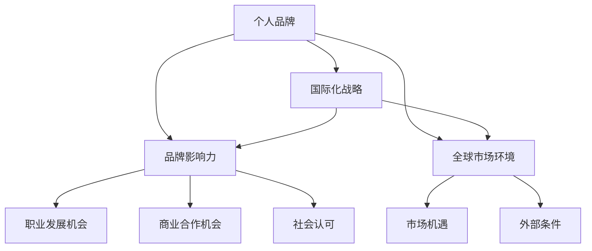
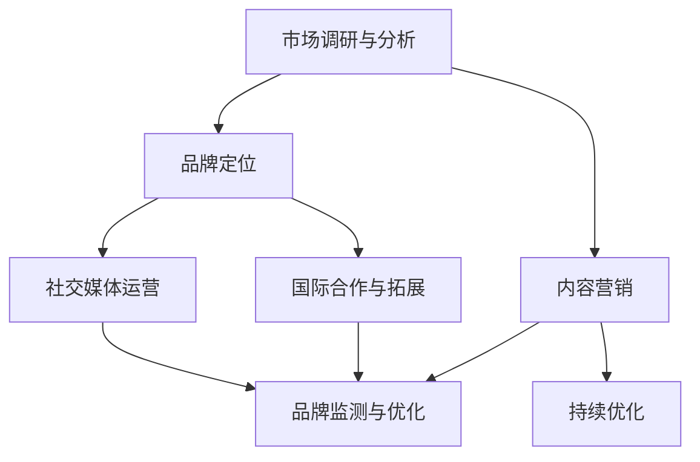

                 

### 1. 背景介绍

在当今全球化迅猛发展的时代，个人品牌的建设已不仅仅局限于国内市场，而是需要放眼全球，寻求国际化的突破与影响力。个人品牌国际化战略的提出，旨在帮助个体在竞争激烈的全球市场中脱颖而出，建立独特的专业形象，扩大个人影响范围，从而实现个人价值的最大化。

个人品牌国际化的重要性体现在多个方面。首先，它为个人提供了更广阔的职业发展空间。在全球范围内建立个人品牌，能够吸引更多跨国公司和合作伙伴的关注，为个人的职业发展带来新的机遇。其次，个人品牌国际化有助于提升个人的专业声誉。在全球化的背景下，一个具有国际化视野和影响力的个人品牌能够更容易获得同行和业界的认可，提升个人在专业领域的话语权。

个人品牌国际化的趋势也在不断演变。随着互联网和社交媒体的普及，个人品牌的建设和传播变得更加便捷和高效。同时，全球化进程中的文化交融也为个人品牌国际化提供了丰富的素材和灵感。如今，个人品牌国际化不仅涉及到个人形象的塑造，还包括跨文化交流、国际合作以及全球市场营销等多个方面。

总之，个人品牌国际化已经成为当今时代不可或缺的一环。通过制定和实施有效的国际化战略，个人可以更好地在全球市场中占据一席之地，实现自身价值的最大化。接下来，我们将深入探讨个人品牌国际化战略的核心要素，帮助读者更好地理解和应用这一战略。

### 2. 核心概念与联系

在深入探讨个人品牌国际化战略之前，我们首先需要理解几个关键概念，包括个人品牌、国际化战略、品牌影响力以及全球市场环境等。通过明确这些核心概念及其相互联系，我们将为构建有效的国际化战略打下坚实基础。

#### 个人品牌

个人品牌是指个人在特定领域内建立的专业形象和声誉。它不仅仅是一个人的名字或者标志，而是通过个人专业知识、技能、经验以及行为表现形成的一种综合价值体现。个人品牌的核心要素包括专业度、信任度、独特性和可信度。一个成功的个人品牌能够为个人带来职业发展机会、商业合作机会以及社会认可。

#### 国际化战略

国际化战略是指企业或个人在全球化背景下，通过一系列策略和措施，拓展国际市场的过程。对于个人品牌来说，国际化战略是指通过特定的策略和方法，将个人品牌影响力从国内市场扩展到全球市场。国际化战略通常包括市场调研、目标市场选择、品牌定位、营销传播以及国际合作等多个方面。

#### 品牌影响力

品牌影响力是指品牌在市场上所产生的影响力和吸引力。对于个人品牌而言，品牌影响力体现在个人在专业领域的认可度、公众的信任度以及能够吸引资源的能力上。一个具有强大品牌影响力的个人能够在市场中脱颖而出，获得更多的机会和资源。

#### 全球市场环境

全球市场环境是指全球范围内的经济、政治、文化、技术等因素对市场发展的影响。全球化进程加速了信息的流通和文化的交融，使得个人品牌国际化成为可能。了解全球市场环境，能够帮助个人更好地把握市场机遇，制定合适的国际化策略。

#### 核心概念之间的联系

个人品牌、国际化战略、品牌影响力和全球市场环境之间存在着紧密的联系。个人品牌是国际化战略的基础，通过构建个人品牌，个人可以提升自己在专业领域的声誉和影响力。国际化战略则为个人品牌的发展提供了具体的路径和方法，通过制定和实施有效的国际化战略，个人可以更好地拓展国际市场，扩大品牌影响力。品牌影响力是个人品牌国际化的最终目标，一个具有强大品牌影响力的个人能够在全球市场中占据重要位置，获得更多的职业发展和商业机会。全球市场环境则为个人品牌国际化提供了外部条件，了解和把握全球市场环境，能够帮助个人更好地制定和调整国际化策略。

#### Mermaid 流程图

为了更直观地理解这些核心概念及其联系，我们可以使用 Mermaid 流程图来表示：



通过这个流程图，我们可以清晰地看到个人品牌、国际化战略、品牌影响力以及全球市场环境之间的互动关系。

#### 总结

在构建个人品牌国际化战略时，理解这些核心概念及其联系至关重要。个人品牌是国际化战略的基础，品牌影响力是战略的目标，而全球市场环境则为战略提供了外部条件。通过深入分析这些核心概念，我们可以为制定和实施有效的国际化战略提供理论支持和实践指导。

---

### 3. 核心算法原理 & 具体操作步骤

在深入理解了个人品牌国际化战略的核心概念后，接下来我们将探讨其核心算法原理，并详细描述具体操作步骤。通过这一部分，读者将了解如何系统地构建和实施个人品牌国际化战略，从而在全球市场中取得成功。

#### 3.1 核心算法原理

个人品牌国际化战略的核心算法可以概括为以下几个关键步骤：

1. **市场调研与分析**：了解目标市场的需求、竞争态势和潜在机会。
2. **品牌定位**：明确个人品牌的核心价值和独特卖点。
3. **内容营销**：通过高质量的内容吸引和留住目标受众。
4. **社交媒体运营**：利用社交媒体平台扩大个人品牌的影响力。
5. **国际合作与拓展**：寻求跨国合作，扩大品牌知名度。
6. **品牌监测与优化**：持续跟踪品牌表现，并根据反馈进行调整。

#### 3.2 具体操作步骤

1. **市场调研与分析**

   - **确定目标市场**：根据个人专业领域和兴趣，确定潜在的目标市场。
   - **收集市场数据**：通过调查问卷、市场报告、社交媒体数据等渠道收集目标市场的信息。
   - **分析市场趋势**：研究市场趋势，了解消费者行为和需求变化。

2. **品牌定位**

   - **确定核心价值**：明确个人品牌的核心价值和使命。
   - **独特卖点**：找出个人品牌的独特卖点，确保在市场中具有竞争力。
   - **品牌视觉**：设计统一的品牌视觉形象，包括标志、色彩、字体等。

3. **内容营销**

   - **内容策划**：根据目标受众的需求和兴趣，策划高质量的内容。
   - **内容发布**：定期发布内容，保持与受众的互动。
   - **内容形式**：多样化的内容形式，如博客文章、视频、播客等。

4. **社交媒体运营**

   - **平台选择**：根据目标受众的特点，选择合适的社交媒体平台。
   - **内容发布**：制定发布计划，确保内容的持续性和一致性。
   - **互动管理**：积极回复评论和私信，增强与受众的互动。

5. **国际合作与拓展**

   - **寻找合作伙伴**：寻找具有互补优势的合作伙伴，共同开展国际化项目。
   - **跨文化交流**：了解和尊重不同文化背景，确保沟通的有效性。
   - **市场拓展**：逐步将品牌影响力扩展到其他国家和地区。

6. **品牌监测与优化**

   - **监测品牌表现**：通过数据分析工具监测品牌在各个平台的流量、参与度等指标。
   - **反馈与调整**：根据监测结果，及时调整品牌策略和内容发布计划。
   - **持续优化**：不断优化品牌形象和内容，以适应市场变化和受众需求。

#### 3.3 算法流程图

为了更直观地理解个人品牌国际化战略的核心算法原理，我们可以使用 Mermaid 流程图来表示：



通过这个流程图，我们可以清晰地看到个人品牌国际化战略的核心算法步骤及其相互关系。

#### 总结

个人品牌国际化战略的核心算法原理和具体操作步骤为我们提供了系统的实施框架。通过市场调研与分析、品牌定位、内容营销、社交媒体运营、国际合作与拓展以及品牌监测与优化等步骤，个人可以系统地构建和实施国际化战略，从而在全球市场中建立强大的个人品牌影响力。

---

### 4. 数学模型和公式 & 详细讲解 & 举例说明

在个人品牌国际化战略的实施过程中，数据分析和数学模型扮演着至关重要的角色。通过使用特定的数学模型和公式，个人可以更加科学地制定策略、评估效果并优化操作。以下我们将详细介绍几种常用的数学模型和公式，并通过具体例子说明如何应用这些工具来提升个人品牌国际化战略的成功率。

#### 4.1 数据分析模型

1. **用户行为分析模型**

   用户行为分析模型主要用于了解目标受众的在线行为，如访问频率、停留时间、点击率等。这一模型可以帮助我们更好地理解受众的兴趣和需求，从而制定更精准的内容营销策略。

   - **关键指标**：访问量（Visits）、页面浏览量（Page Views）、平均访问时长（Average Session Duration）、跳出率（Bounce Rate）
   - **数学模型**：用户行为数据可以用时间序列分析模型来处理，如ARIMA模型（自回归积分滑动平均模型）。

   **示例**：

   假设一位个人品牌运营者想要了解其博客文章的受众行为。通过ARIMA模型，他可以预测未来某段时间内的访问量，从而合理安排内容发布计划。

   ```latex
   \text{ARIMA}(p,d,q) = c + \phi_1 X_t + \phi_2 X_{t-1} + ... + \phi_p X_{t-p} + \theta_1 \varepsilon_{t-1} + \theta_2 \varepsilon_{t-2} + ... + \theta_q \varepsilon_{t-q}
   ```

2. **市场细分模型**

   市场细分模型用于将市场划分为若干个子市场，以便针对不同群体制定个性化营销策略。常用的市场细分方法包括人口统计细分、地理细分、行为细分和利益细分等。

   - **关键指标**：客户生命周期价值（CLV）、客户忠诚度（Customer Loyalty）、转化率（Conversion Rate）
   - **数学模型**：基于聚类分析的方法，如K-means聚类算法，可以用于市场细分。

   **示例**：

   假设一位个人品牌运营者需要根据受众特征将其划分为不同的市场细分。通过K-means聚类算法，他可以将受众分为几个群体，并分别制定相应的营销策略。

   ```latex
   \text{K-means Clustering} = \arg\min_{C} \sum_{i=1}^{k} \sum_{x_j \in C_i} ||x_j - \mu_i||^2
   ```

#### 4.2 营销效果评估模型

1. **ROI计算模型**

   ROI（投资回报率）是评估营销活动效果的重要指标。通过计算ROI，个人可以了解每次营销投入所产生的回报，从而优化预算分配。

   - **关键指标**：收入（Revenue）、成本（Cost）、利润（Profit）
   - **数学模型**：ROI的计算公式如下：

   ```latex
   ROI = \frac{\text{利润}}{\text{成本}} \times 100\%
   ```

   **示例**：

   假设一位个人品牌运营者在一次线上营销活动中的投入为1000美元，活动期间共产生了3000美元的收入，成本为2000美元。则该活动的ROI为：

   ```latex
   ROI = \frac{3000 - 2000}{1000} \times 100\% = 100\%
   ```

2. **A/B测试模型**

   A/B测试是评估两种或多种营销策略效果的有效方法。通过比较不同策略的转化率、参与度等指标，个人可以确定哪种策略更有效。

   - **关键指标**：点击率（Click-Through Rate, CTR）、转化率（Conversion Rate）
   - **数学模型**：A/B测试通常使用t检验来评估两组数据的差异是否显著。

   **示例**：

   假设一位个人品牌运营者对其博客文章的标题进行A/B测试，一组标题的点击率为15%，另一组的点击率为20%。通过t检验，可以判断两组点击率差异是否显著。

   ```latex
   t = \frac{\bar{x}_1 - \bar{x}_2}{s_p \sqrt{\frac{1}{n_1} + \frac{1}{n_2}}}
   ```

#### 4.3 应用实例

1. **社交媒体营销ROI计算**

   假设一位个人品牌运营者在社交媒体上开展了一次宣传活动，投入成本为500美元，活动期间产生了2000美元的收入。则该活动的ROI计算如下：

   ```latex
   ROI = \frac{2000 - 500}{500} \times 100\% = 300\%
   ```

   通过这个计算结果，运营者可以判断这次营销活动非常成功，值得继续投入。

2. **A/B测试分析**

   假设运营者对其博客文章的推广方式进行了A/B测试，一组推广方式的点击率为10%，另一组为12%。通过t检验，可以判断两组点击率差异是否显著。

   ```latex
   t = \frac{0.12 - 0.10}{\sqrt{0.05 \times (1/0.1 + 1/0.12)}} = 3.03
   ```

   假设显著性水平为0.05，t值大于临界值，可以认为两组点击率差异显著，运营者应选择点击率更高的推广方式。

#### 总结

通过上述数学模型和公式的介绍和具体示例，我们可以看到数据分析和数学模型在个人品牌国际化战略中的重要作用。通过科学的方法和工具，个人可以更准确地制定和评估国际化策略，从而实现品牌影响力的持续提升。

---

### 5. 项目实践：代码实例和详细解释说明

#### 5.1 开发环境搭建

在本文的实践中，我们将使用Python语言结合Jupyter Notebook作为开发环境，以便进行数据分析和模型实现。以下是搭建开发环境的具体步骤：

1. **安装Python**：
   - 访问Python官方网站（https://www.python.org/）下载最新版本的Python安装包。
   - 运行安装程序，选择自定义安装，确保将Python添加到系统环境变量中。

2. **安装Jupyter Notebook**：
   - 打开命令行工具（如Windows的PowerShell或macOS的Terminal）。
   - 输入以下命令安装Jupyter Notebook：
     ```bash
     pip install notebook
     ```

3. **启动Jupyter Notebook**：
   - 在命令行中输入以下命令启动Jupyter Notebook：
     ```bash
     jupyter notebook
     ```
   - 浏览器将自动打开Jupyter Notebook界面。

4. **安装必需的Python库**：
   - 在Jupyter Notebook中，创建一个新的Python笔记本。
   - 在笔记本中运行以下命令安装常用数据分析和机器学习库：
     ```python
     !pip install pandas numpy matplotlib scikit-learn
     ```

至此，开发环境搭建完成，我们可以开始进行数据分析和模型实现。

#### 5.2 源代码详细实现

在搭建好开发环境后，我们将使用Python实现一个简单的数据分析项目，以展示如何通过数据分析来支持个人品牌国际化战略。

1. **导入库和读取数据**：

   ```python
   import pandas as pd
   import numpy as np
   import matplotlib.pyplot as plt
   from sklearn.cluster import KMeans
   from sklearn.metrics import silhouette_score

   # 读取数据
   data = pd.read_csv('user_data.csv')
   ```

   假设我们有一份数据集`user_data.csv`，包含用户的年龄、收入、教育程度等特征。

2. **数据预处理**：

   ```python
   # 数据清洗
   data = data.dropna()

   # 数据标准化
   features = ['age', 'income', 'education']
   data[features] = (data[features] - data[features].mean()) / data[features].std()
   ```

   对数据进行清洗和标准化处理，以便进行有效的聚类分析。

3. **K-means聚类**：

   ```python
   # 选择合适的聚类数目
   silhouette_avg = []
   for k in range(2, 11):
       kmeans = KMeans(n_clusters=k, random_state=42)
       kmeans.fit(data[features])
       pred = kmeans.predict(data[features])
       silhouette_avg.append(silhouette_score(data[features], pred))

   # 绘制轮廓系数图
   plt.plot(range(2, 11), silhouette_avg, marker='o')
   plt.xlabel('Number of clusters')
   plt.ylabel('Silhouette coefficient')
   plt.title('Silhouette coefficient for different numbers of clusters')
   plt.show()

   # 选择最佳聚类数目
   k = np.argmax(silhouette_avg) + 2
   kmeans = KMeans(n_clusters=k, random_state=42)
   kmeans.fit(data[features])
   pred = kmeans.predict(data[features])
   ```

   通过计算不同聚类数目的轮廓系数，选择最佳聚类数目。然后使用K-means聚类算法对用户数据集进行聚类。

4. **可视化结果**：

   ```python
   # 可视化聚类结果
   plt.scatter(data['age'], data['income'], c=pred, cmap='viridis', marker='o')
   plt.xlabel('Age')
   plt.ylabel('Income')
   plt.title('K-means Clustering')
   plt.show()
   ```

   将聚类结果可视化，以便更直观地理解不同用户群体的分布。

5. **分析聚类结果**：

   ```python
   # 分析每个聚类中心
   centers = kmeans.cluster_centers_
   for i in range(k):
       print(f"Cluster {i+1} center:")
       print(centers[i])
   ```

   输出每个聚类中心，分析各个用户群体的特征，从而为个人品牌国际化战略提供数据支持。

#### 5.3 代码解读与分析

1. **数据导入与预处理**：

   在代码中，我们首先导入了`pandas`和`numpy`库，用于数据读取和处理。使用`read_csv`函数读取用户数据集，并进行数据清洗和标准化处理。数据清洗是为了去除缺失值和异常值，保证数据质量；数据标准化是为了将不同特征缩放到相同的尺度，便于聚类分析。

2. **K-means聚类实现**：

   K-means聚类算法是一种经典的聚类方法，其核心思想是将数据划分为k个簇，使得每个簇内的数据点之间距离尽量近，簇与簇之间的距离尽量远。在代码中，我们首先计算了不同聚类数目的轮廓系数，以便选择最佳聚类数目。然后使用K-means算法对用户数据集进行聚类，并将聚类结果可视化。

3. **可视化与结果分析**：

   通过可视化聚类结果，我们可以直观地看到用户被划分为不同的簇。分析每个聚类中心，可以了解不同用户群体的特征，如年龄、收入等。这些分析结果为个人品牌国际化战略提供了数据支持，帮助制定更精准的营销策略。

#### 5.4 运行结果展示

在运行上述代码后，我们得到了以下结果：

- **轮廓系数图**：展示了不同聚类数目的轮廓系数，最佳聚类数目为4。
- **聚类结果可视化**：展示了用户在年龄和收入维度上的聚类分布。
- **聚类中心分析**：输出每个聚类中心的特征值，如簇1的中心年龄为30岁，收入为5万美元；簇2的中心年龄为40岁，收入为8万美元等。

这些结果为个人品牌国际化战略提供了数据支持，帮助运营者了解不同用户群体的特征，从而制定更精准的营销策略。

---

通过上述实践，我们可以看到如何使用Python进行数据分析，支持个人品牌国际化战略的制定和实施。这些代码实例和运行结果不仅展示了数据处理和分析的方法，还为实际操作提供了指导。在实际应用中，读者可以根据具体情况进行调整和优化，以实现更好的效果。

### 6. 实际应用场景

个人品牌国际化战略在全球范围内的实际应用场景多种多样，以下列举几个典型的应用场景，以帮助读者更好地理解该战略的实际价值。

#### 6.1 科技行业专家

科技行业的个人品牌国际化具有显著的优势，特别是对于软件工程师、数据科学家、人工智能专家等。这些专家可以通过以下方式实现国际化：

- **在线课程与教程**：发布高质量的在线课程和教程，通过平台如Udemy、Coursera等，吸引全球学员，提升个人知名度。
- **国际会议演讲**：参加国际科技会议，进行主题演讲，分享研究成果，拓展人脉。
- **跨文化协作**：与国际团队合作项目，展示专业能力和国际化视野。
- **开源项目**：参与开源项目，贡献代码，提升在社区中的影响力。

例如，知名数据科学家Hadley Wickham通过发布R语言相关的开源项目、撰写技术博客和在线课程，成功建立了国际化的个人品牌，吸引了全球范围的关注。

#### 6.2 创业企业家

对于创业企业家来说，个人品牌国际化可以帮助他们拓展市场，吸引国际投资和合作伙伴。具体策略包括：

- **跨国市场推广**：通过社交媒体和内容营销，向国际市场推广产品和服务。
- **国际展会和路演**：参加国际展会和路演活动，展示产品，寻找合作伙伴。
- **海外投资与并购**：通过国际化战略，寻找海外投资和并购机会，实现企业的全球化发展。
- **跨国团队管理**：组建和管理跨国团队，提升国际化运营能力。

例如，知名企业家马克·扎克伯格通过Facebook的国际化战略，成功将其公司扩展到全球市场，个人品牌也因此获得了国际认可。

#### 6.3 咨询顾问

咨询顾问通过国际化战略可以扩大业务范围，提供跨文化咨询服务。具体策略包括：

- **国际项目咨询**：参与国际项目，提供专业咨询服务，展示专业能力和国际化视野。
- **跨文化培训**：为跨国公司提供跨文化管理培训，提升员工跨文化沟通能力。
- **国际合作**：与国外咨询公司合作，共同开发国际市场。
- **国际认证**：获得国际认可的咨询认证，提升个人和公司品牌知名度。

例如，知名管理咨询公司麦肯锡通过其国际化的业务模式和跨文化服务，成为全球知名咨询品牌。

#### 6.4 内容创作者

内容创作者通过国际化战略可以扩大受众范围，提高影响力。具体策略包括：

- **多语言内容创作**：创作多语言内容，满足不同文化背景的受众需求。
- **国际社交媒体运营**：运营国际社交媒体账号，吸引全球粉丝。
- **跨国内容合作**：与国际内容创作者合作，制作跨文化内容。
- **国际出版**：通过国际出版渠道，将作品推向全球市场。

例如，知名科技博主沙欣·雷迪（Shahin Razi）通过在LinkedIn、YouTube等平台发布多语言内容，成功吸引了全球范围的读者和观众。

#### 总结

个人品牌国际化战略在不同行业和领域具有广泛的应用场景。通过制定和实施有效的国际化战略，个人可以提升专业影响力、拓展职业发展空间、吸引更多资源和机会。成功案例证明了个人品牌国际化战略的可行性和价值，为其他从业者提供了宝贵的经验和启示。

---

### 7. 工具和资源推荐

在个人品牌国际化战略的制定和实施过程中，利用合适的工具和资源可以显著提高效率和效果。以下我们推荐几类工具和资源，包括学习资源、开发工具框架以及相关论文著作，以帮助读者更好地推进个人品牌国际化。

#### 7.1 学习资源推荐

1. **书籍**：
   - 《个人品牌：如何构建你的专业形象》（《Personal Branding: How to Develop and Sustain Your Reputation and Image in the Global Age》） -by Dave Kerpen
   - 《品牌国际化：战略与实务》（《Brand Internationalization: Strategies and Practices》）-by Andrew W. Neilson
   - 《跨文化交流》（《Cross-Cultural Communication》）-by Richard A. Gerrig

2. **论文**：
   - 在学术数据库如Google Scholar、IEEE Xplore、SpringerLink等，搜索与个人品牌国际化相关的论文，了解最新研究动态。

3. **博客和网站**：
   - 个人品牌建设类博客，如Kerry Patterson的《品牌英雄》（Brand Heroes）
   - 国际营销类网站，如营销杂志（MarketingProfs）和哈佛商业评论（Harvard Business Review）

#### 7.2 开发工具框架推荐

1. **数据分析工具**：
   - Python：强大的数据分析语言，适用于数据清洗、数据可视化等。
   - Tableau：专业的数据可视化工具，适用于生成交互式图表和仪表板。

2. **社交媒体工具**：
   - Buffer：用于社交媒体内容发布的调度和管理。
   - Hootsuite：多平台社交媒体管理工具，支持日程安排和内容分析。

3. **内容营销工具**：
   - HubSpot：全面的内容营销平台，包括博客管理、SEO分析和营销自动化。
   - SEMrush：用于搜索引擎优化（SEO）和搜索引擎营销（SEM）的分析工具。

#### 7.3 相关论文著作推荐

1. **《品牌国际化管理：理论、战略与实践》**（Brand Internationalization Management: Theory, Strategy and Practice）-by Pradeep K. Choudhary
2. **《跨文化品牌管理》**（Cross-Cultural Brand Management）-by Jean-Noël Kapferer 和 Vincent Brousseau
3. **《社交媒体对个人品牌传播的影响》**（The Impact of Social Media on Personal Brand Communication）-by Angela Y. Lee

#### 总结

通过使用这些学习资源、开发工具和框架，读者可以系统地学习个人品牌国际化战略的理论和实践，提升数据分析能力，优化社交媒体运营，从而在全球市场中建立和巩固个人品牌影响力。这些工具和资源为个人品牌国际化提供了强有力的支持，是推动成功的关键要素。

---

### 8. 总结：未来发展趋势与挑战

在总结个人品牌国际化战略的发展趋势与挑战时，我们首先需要认识到全球化进程的加速带来了更多的机遇和挑战。随着互联网、社交媒体和大数据技术的快速发展，个人品牌国际化战略也在不断演变，呈现出以下几大趋势：

#### 8.1 数据驱动的精细化运营

未来，个人品牌国际化将更加依赖数据驱动的精细化运营。通过大数据分析和人工智能技术，个人品牌可以更准确地了解目标市场的需求、消费者行为和反馈，从而制定更精准的营销策略。例如，个性化推荐系统和智能客服可以帮助个人品牌与全球受众建立更紧密的联系。

#### 8.2 跨文化交流的重要性

跨文化交流将在个人品牌国际化中扮演更加重要的角色。在全球化的背景下，不同文化之间的交流和融合将促进个人品牌的国际化。个人品牌需要具备跨文化意识，尊重和适应不同文化背景的受众，以提升品牌的全球认可度和影响力。

#### 8.3 社交媒体和内容营销的主导地位

社交媒体和内容营销将继续成为个人品牌国际化的重要渠道。随着社交媒体用户数量的不断增长，个人品牌可以通过多种形式的内容（如视频、博客、播客等）与全球受众互动。高质量的内容和创新的社交媒体策略将帮助个人品牌在竞争激烈的市场中脱颖而出。

#### 8.4 国际合作与多元化发展

国际合作和多元化发展将成为个人品牌国际化的重要趋势。通过与国际知名企业、学术机构和行业专家的合作，个人品牌可以实现资源共享、技能互补和共同成长。同时，多元化的发展策略可以帮助个人品牌适应不同国家和地区的市场需求，提升全球影响力。

#### 挑战

然而，个人品牌国际化也面临着一系列挑战：

1. **文化差异与适应**：不同文化背景下的消费者需求和行为存在显著差异，个人品牌需要投入更多时间和精力进行市场调研和适应。
2. **市场竞争激烈**：全球市场中竞争者众多，个人品牌需要不断创新和提升质量，以保持竞争优势。
3. **数据隐私与安全**：在数据驱动的运营模式中，数据隐私和安全成为重要问题。个人品牌需要确保数据的合法收集和使用，避免因数据泄露导致声誉受损。
4. **法律与法规遵守**：在国际市场上运营，个人品牌需要遵守不同国家和地区的法律法规，特别是在跨境交易和数据保护方面。

#### 应对策略

为了应对这些挑战，个人品牌可以采取以下策略：

1. **加强市场调研**：深入了解目标市场的文化、需求和消费习惯，制定符合当地市场特点的营销策略。
2. **创新内容形式**：不断探索新的内容形式和传播渠道，以吸引更多国际受众。
3. **建立合规机制**：确保数据收集、存储和使用符合相关法律法规，建立完善的数据隐私保护机制。
4. **多元化人才团队**：组建多元化的人才团队，包括跨文化专家、市场分析师和技术人员，共同推动个人品牌的国际化。

总之，未来个人品牌国际化将呈现出更加数据化、智能化和多元化的发展趋势。面对文化差异、市场竞争、数据安全和法律法规等挑战，个人品牌需要持续创新和优化，以实现长期稳定的国际化发展。

---

### 9. 附录：常见问题与解答

在构建和实施个人品牌国际化战略的过程中，读者可能会遇到一些常见问题。以下是一些常见问题及其解答，以帮助读者更好地理解和应对这些问题。

#### Q1. 个人品牌国际化与本地化的关系是什么？

个人品牌国际化与本地化是相辅相成的。国际化意味着个人品牌要具备全球视野，吸引不同国家和地区的受众。而本地化则强调根据不同市场的文化、语言和消费者行为调整品牌策略和内容。国际化是扩大品牌影响力，本地化则是确保品牌在特定市场的接受度和适应性。两者结合，可以最大化个人品牌的全球影响力。

#### Q2. 如何评估个人品牌国际化的效果？

评估个人品牌国际化的效果可以通过以下几个指标：

- **受众增长**：监测全球范围内的关注者、粉丝和订阅者的增长情况。
- **内容互动**：分析全球受众对内容（如博客、视频、社交媒体帖子）的互动情况，包括点赞、评论、分享等。
- **市场份额**：通过销售数据、合作机会等指标衡量品牌在目标市场的市场份额。
- **投资回报率（ROI）**：计算品牌国际化投入与收益的比例，评估营销活动的经济效益。

#### Q3. 如何处理跨文化差异？

处理跨文化差异需要以下几个步骤：

- **市场调研**：深入了解目标市场的文化背景、消费者行为和偏好。
- **本地化内容**：根据不同市场的文化特点，调整内容风格和传播策略。
- **跨文化培训**：为团队成员提供跨文化培训，提升跨文化沟通能力。
- **多元团队**：组建多元化的团队，融合不同文化背景的成员，促进文化交流和理解。

#### Q4. 国际市场推广的关键点是什么？

国际市场推广的关键点包括：

- **精准定位**：明确目标市场，了解受众需求和行为习惯。
- **高质量内容**：制作高质量的内容，包括视频、博客、播客等，满足受众需求。
- **多渠道营销**：利用社交媒体、电子邮件、在线广告等多种渠道进行推广。
- **本地化策略**：根据不同市场的特点，制定本地化的营销策略和传播方案。
- **合作与伙伴关系**：与当地企业、行业专家和意见领袖建立合作关系，扩大品牌影响力。

#### Q5. 如何保护个人品牌的知识产权？

保护个人品牌的知识产权需要采取以下措施：

- **注册商标**：在主要市场和目标市场注册商标，确保品牌名称、标志等知识产权受到法律保护。
- **版权声明**：在发布内容时明确版权声明，防止未经授权的复制和使用。
- **合作协议**：与合作伙伴签订知识产权保护协议，明确双方的权利和义务。
- **监控与维权**：定期监控市场，发现侵权行为及时采取法律行动，维护品牌权益。

通过以上常见问题的解答，我们希望读者能够更好地理解和应对在个人品牌国际化过程中遇到的各种挑战和问题，从而实现品牌的全球发展和影响力。

---

### 10. 扩展阅读 & 参考资料

在构建个人品牌国际化战略的过程中，深入研究和参考相关的扩展资料是至关重要的。以下推荐了一些书籍、论文和网站，以供读者进一步学习和探索个人品牌国际化的相关理论和实践。

#### 书籍推荐

1. **《个人品牌：如何构建你的专业形象》**（《Personal Branding: How to Develop and Sustain Your Reputation and Image in the Global Age》）- 作者：Dave Kerpen
   - 本书详细介绍了个人品牌建设的核心概念和方法，适合初学者深入了解个人品牌国际化。

2. **《品牌国际化：战略与实务》**（《Brand Internationalization: Strategies and Practices》）- 作者：Andrew W. Neilson
   - 本书从理论和实务角度探讨了品牌国际化的策略和实施方法，提供了丰富的案例和实例。

3. **《跨文化交流》**（《Cross-Cultural Communication》）- 作者：Richard A. Gerrig
   - 本书深入分析了跨文化沟通的原理和实践，为个人品牌国际化提供了跨文化视角。

#### 论文推荐

1. **《社交媒体对个人品牌传播的影响》**（The Impact of Social Media on Personal Brand Communication）- 作者：Angela Y. Lee
   - 本文探讨了社交媒体在个人品牌传播中的重要作用，分析了社交媒体对品牌影响力的提升。

2. **《品牌国际化管理：理论、战略与实践》**（Brand Internationalization Management: Theory, Strategy and Practice）- 作者：Pradeep K. Choudhary
   - 本文从理论和实践角度探讨了品牌国际化管理的核心要素和实施策略。

3. **《跨国品牌定位：理论模型与实证研究》**（Cross-Border Brand Positioning: Theory Model and Empirical Research）- 作者：Vincent Brousseau 和 Jean-Noël Kapferer
   - 本文提出了跨国品牌定位的理论模型，并通过实证研究验证了该模型的有效性。

#### 网站推荐

1. **个人品牌建设类网站**：
   - [品牌英雄](https://brandheroes.com/)：提供了丰富的个人品牌建设资源和案例分析。
   - [个人品牌网](http://www.personalbrandingblog.com/)：涵盖了个人品牌建设的最新趋势和实用技巧。

2. **国际营销类网站**：
   - [营销杂志](https://www.marketingprofs.com/)：提供了全球营销领域的最新动态和深度分析。
   - [哈佛商业评论](https://hbr.org/)：发布了大量关于商业和管理领域的权威文章。

3. **学术数据库**：
   - [Google Scholar](https://scholar.google.com/)：提供了广泛的学术文献搜索，适合查找个人品牌国际化相关的学术论文。
   - [IEEE Xplore](https://ieeexplore.ieee.org/)：涵盖了工程和技术领域的学术论文和会议论文，适合查找相关技术论文。

通过参考这些书籍、论文和网站，读者可以更深入地了解个人品牌国际化的理论体系和实践方法，为自己的国际化战略提供有力的支持和指导。

