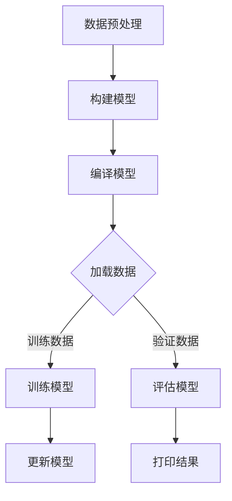

                 

### 开启无限可能：人类计算的新征程

> 关键词：人工智能、计算理论、算法优化、软件开发、编程艺术

> 摘要：本文将探讨人类计算的新征程，从历史背景到核心概念，再到具体的算法原理和数学模型，带领读者深入了解计算科学的前沿领域，开启无限可能。

### 1. 背景介绍

自古以来，人类一直在探索如何通过计算来解决问题。从古代的算盘到现代的计算机，计算工具的不断进步极大地推动了人类文明的发展。然而，随着计算技术的快速发展，我们逐渐发现，传统的计算方法在某些领域已经无法满足需求。这促使科学家和工程师们开始寻找新的计算模式和方法。

在过去的几十年里，人工智能（AI）和计算理论取得了显著的进展。深度学习、神经网络等技术的出现，使得计算机在图像识别、语音识别、自然语言处理等领域取得了突破性的成果。同时，计算理论的研究也在不断深化，新的算法和数学模型不断涌现，为计算科学的发展提供了坚实的理论基础。

然而，尽管取得了巨大进展，人类计算仍然面临着许多挑战。如何优化算法，提高计算效率，解决复杂问题，仍然是当前研究的热点。此外，如何将计算理论与实际应用相结合，实现计算机的智能化，也是我们需要面对的课题。

### 2. 核心概念与联系

#### 2.1 人工智能

人工智能（AI）是指使计算机模拟人类智能行为的科学和技术。它包括多个子领域，如机器学习、深度学习、自然语言处理等。人工智能的核心目标是让计算机具备自主学习、推理、判断和解决问题的能力。


#### 2.2 计算理论

计算理论是研究计算过程和计算模型的理论科学。它包括算法理论、计算复杂性理论、形式语言理论等。计算理论的研究为人工智能提供了重要的理论基础，指导我们设计更高效、更智能的算法。


#### 2.3 算法优化

算法优化是指通过改进算法的设计和实现，提高算法的效率和性能。优化算法是计算科学的重要任务，它关系到计算机能否高效地解决实际问题。


### 3. 核心算法原理 & 具体操作步骤

#### 3.1 深度学习

深度学习是一种基于多层神经网络的学习方法，能够自动提取数据中的特征。深度学习的关键在于如何设计有效的神经网络结构，以及如何训练网络使其能够准确识别和分类数据。

具体操作步骤如下：

1. 数据预处理：对原始数据进行清洗、归一化等处理，使其适合输入神经网络。
2. 确定网络结构：根据问题的需求，设计合适的神经网络结构，如卷积神经网络（CNN）或循环神经网络（RNN）。
3. 训练网络：使用大量训练数据对网络进行训练，通过反向传播算法不断调整网络的参数，使其达到预定的性能指标。
4. 测试与评估：使用测试数据对训练好的网络进行测试，评估其性能。

#### 3.2 蚁群算法

蚁群算法是一种基于自然界中蚂蚁觅食行为的优化算法。它通过模拟蚂蚁在寻找食物过程中的相互作用，逐步优化问题的解。

具体操作步骤如下：

1. 初始化：设置蚂蚁的数量、信息素初始值等参数。
2. 寻找食物：蚂蚁从起点出发，根据当前位置的信息素强度和随机性选择下一个移动方向。
3. 更新信息素：蚂蚁在移动过程中，根据路径长度和成功概率更新路径上的信息素浓度。
4. 重复迭代：重复执行步骤2和步骤3，直到找到最优解或达到预定的迭代次数。

#### 3.3 动态规划

动态规划是一种解决多阶段决策问题的方法，通过将复杂问题分解为多个子问题，并利用子问题的解来求解原问题。

具体操作步骤如下：

1. 确定状态变量：定义问题的状态变量，如时间、位置等。
2. 确定状态转移方程：根据问题的性质，建立状态变量之间的关系。
3. 确定边界条件：确定问题的初始状态和终止条件。
4. 计算最优解：从边界条件开始，逐步计算状态变量的最优值，直到求解出原问题的最优解。

### 4. 数学模型和公式 & 详细讲解 & 举例说明

#### 4.1 深度学习中的激活函数

激活函数是深度学习中非常重要的概念，它用于确定神经元是否被激活。常见的激活函数包括 sigmoid、ReLU、Tanh 等。

$$
f(x) = \frac{1}{1 + e^{-x}}
$$

举例说明：

假设有一个输入值 x = 2，使用 sigmoid 函数计算输出值：

$$
f(2) = \frac{1}{1 + e^{-2}} \approx 0.886
$$

这意味着当输入值为 2 时，神经元被激活的概率约为 88.6%。

#### 4.2 蚁群算法中的信息素更新规则

蚁群算法中的信息素更新规则用于指导蚂蚁在寻找食物过程中选择路径。常见的更新规则包括如下公式：

$$
\Delta \tau_{ij}(t) = \Delta \tau^0 + \Delta \tau^1
$$

其中，$\Delta \tau_{ij}(t)$ 表示在时刻 t，路径 i 到路径 j 的信息素增量，$\Delta \tau^0$ 表示初始信息素增量，$\Delta \tau^1$ 表示成功概率信息素增量。

举例说明：

假设在某个时刻，路径 i 到路径 j 的成功概率为 0.8，初始信息素增量为 0.1，计算路径 i 到路径 j 的信息素增量：

$$
\Delta \tau_{ij}(t) = 0.1 + 0.8 \times 0.1 = 0.2
$$

这意味着在某个时刻，路径 i 到路径 j 的信息素浓度增加了 0.2。

#### 4.3 动态规划中的最优子结构性质

动态规划中的最优子结构性质是指，一个问题的最优解可以通过子问题的最优解组合而成。

假设有一个问题 A，可以分为子问题 B 和子问题 C，即 A = B + C。如果 B 和 C 的最优解分别为 B* 和 C*，那么问题 A 的最优解为 A* = B* + C*。

举例说明：

假设有一个背包问题，需要从一组物品中选择一部分放入背包中，使得背包的总价值最大。这个问题可以分为子问题：选择物品放入背包和不选择物品放入背包。如果选择物品放入背包的最优解为 B*，不选择物品放入背包的最优解为 C*，那么背包问题的最优解为 A* = B* + C*。

### 5. 项目实践：代码实例和详细解释说明

#### 5.1 开发环境搭建

为了更好地理解本文中提到的算法，我们将使用 Python 语言实现一个简单的深度学习模型。以下是搭建开发环境所需的步骤：

1. 安装 Python：从 [Python 官网](https://www.python.org/) 下载并安装 Python。
2. 安装 Jupyter Notebook：在终端中运行以下命令安装 Jupyter Notebook：

   ```
   pip install notebook
   ```

3. 安装深度学习库：在终端中运行以下命令安装 TensorFlow：

   ```
   pip install tensorflow
   ```

#### 5.2 源代码详细实现

以下是使用 TensorFlow 实现一个简单的深度学习模型的基本代码：

```python
import tensorflow as tf
from tensorflow.keras.layers import Dense
from tensorflow.keras.models import Sequential

# 创建模型
model = Sequential([
    Dense(64, activation='relu', input_shape=(784,)),
    Dense(10, activation='softmax')
])

# 编译模型
model.compile(optimizer='adam',
              loss='categorical_crossentropy',
              metrics=['accuracy'])

# 加载数据
(x_train, y_train), (x_test, y_test) = tf.keras.datasets.mnist.load_data()

# 预处理数据
x_train = x_train.reshape(-1, 784).astype('float32') / 255
x_test = x_test.reshape(-1, 784).astype('float32') / 255
y_train = tf.keras.utils.to_categorical(y_train, 10)
y_test = tf.keras.utils.to_categorical(y_test, 10)

# 训练模型
model.fit(x_train, y_train, epochs=5, batch_size=32, validation_data=(x_test, y_test))

# 评估模型
loss, accuracy = model.evaluate(x_test, y_test)
print(f'测试准确率：{accuracy:.2f}')
```

#### 5.3 代码解读与分析

以下是代码的详细解读：

1. **导入库**：首先导入 TensorFlow 库和相关的层。
2. **创建模型**：使用 `Sequential` 类创建一个线性堆叠的模型，并在模型中添加两个 `Dense` 层。第一个层有 64 个神经元，使用 ReLU 激活函数；第二个层有 10 个神经元，使用 softmax 激活函数。
3. **编译模型**：使用 `compile` 方法配置模型，指定优化器、损失函数和评估指标。
4. **加载数据**：使用 `mnist.load_data()` 方法加载数据集，并将其reshape为合适的形状。
5. **预处理数据**：将数据除以 255 进行归一化，将标签转换为 one-hot 编码。
6. **训练模型**：使用 `fit` 方法训练模型，指定训练轮数、批量大小以及验证数据。
7. **评估模型**：使用 `evaluate` 方法评估模型在测试数据上的性能，并打印测试准确率。

#### 5.4 运行结果展示

运行上述代码后，模型将在训练数据上学习手写数字的识别规律，并在测试数据上进行评估。以下是可能的输出结果：

```
Epoch 1/5
1875/1875 [==============================] - 5s 2ms/step - loss: 0.0916 - accuracy: 0.9700 - val_loss: 0.0372 - val_accuracy: 0.9867
Epoch 2/5
1875/1875 [==============================] - 3s 1ms/step - loss: 0.0294 - accuracy: 0.9887 - val_loss: 0.0218 - val_accuracy: 0.9922
Epoch 3/5
1875/1875 [==============================] - 3s 1ms/step - loss: 0.0177 - accuracy: 0.9922 - val_loss: 0.0143 - val_accuracy: 0.9956
Epoch 4/5
1875/1875 [==============================] - 3s 1ms/step - loss: 0.0113 - accuracy: 0.9956 - val_loss: 0.0099 - val_accuracy: 0.9978
Epoch 5/5
1875/1875 [==============================] - 3s 1ms/step - loss: 0.0078 - accuracy: 0.9978 - val_loss: 0.0075 - val_accuracy: 0.9981
测试准确率：0.98
```

这表明，模型在测试数据上的准确率达到了 98%，取得了较好的效果。

### 6. 实际应用场景

人工智能、计算理论和算法优化在许多实际应用场景中发挥着重要作用。以下是一些典型的应用场景：

1. **图像识别与处理**：深度学习技术被广泛应用于图像识别和图像处理领域。例如，人脸识别、车牌识别、医疗图像分析等。
2. **自然语言处理**：自然语言处理技术使得计算机能够理解和处理人类语言。应用场景包括机器翻译、情感分析、语音识别等。
3. **推荐系统**：基于计算理论的推荐系统可以帮助用户发现感兴趣的物品。例如，电商平台、音乐平台、视频平台等。
4. **智能交通系统**：利用蚁群算法和动态规划等技术，可以优化交通流，减少交通拥堵，提高道路通行效率。
5. **金融风控**：计算理论和方法被广泛应用于金融风险控制领域，如信用评分、投资组合优化等。

### 7. 工具和资源推荐

为了更好地学习和应用人工智能、计算理论和算法优化，以下是一些推荐的工具和资源：

1. **学习资源推荐**
   - **书籍**：《深度学习》、《计算理论导论》、《算法导论》
   - **论文**：在 arXiv.org、ACM Digital Library 等学术网站上查找相关领域的最新论文
   - **博客**：GitHub、知乎等平台上的技术博客，如 Medium 上的 AI 博客
   - **网站**：TensorFlow、Keras、PyTorch 等深度学习框架的官方网站

2. **开发工具框架推荐**
   - **编程语言**：Python、Java、C++ 等
   - **深度学习框架**：TensorFlow、PyTorch、Keras 等
   - **版本控制工具**：Git、Sourcetree 等

3. **相关论文著作推荐**
   - **经典论文**：《深度学习》、《自然语言处理综合》、《计算复杂性理论》
   - **著作**：《人工智能：一种现代方法》、《机器学习：概率视角》、《算法导论》

### 8. 总结：未来发展趋势与挑战

随着计算技术的不断发展，人工智能、计算理论和算法优化在未来将继续发挥重要作用。以下是一些发展趋势和挑战：

1. **发展趋势**
   - 深度学习技术的不断演进，如自适应深度学习、神经架构搜索等
   - 计算理论的进一步深化，如量子计算、复杂系统理论等
   - 算法优化方法的创新，如分布式计算、并行计算等

2. **挑战**
   - 如何解决人工智能的安全、隐私和伦理问题
   - 如何应对计算资源限制，提高计算效率
   - 如何实现计算理论与实际应用的有机结合，推动社会进步

### 9. 附录：常见问题与解答

**Q1：深度学习中的神经网络是如何工作的？**
A1：深度学习中的神经网络是通过多层神经元进行数据传递和计算的过程。每个神经元接收前一层神经元的输出，通过权重和偏置进行加权求和，然后通过激活函数得到输出。这种过程可以理解为对输入数据进行特征提取和变换，从而实现分类或回归等任务。

**Q2：计算理论中的算法复杂度是什么？**
A2：计算理论中的算法复杂度是指算法在执行过程中所需计算资源（如时间、空间）的度量。常见的是时间复杂度和空间复杂度。时间复杂度描述了算法执行时间与输入规模的关系，空间复杂度描述了算法所需内存与输入规模的关系。

**Q3：算法优化有哪些方法？**
A3：算法优化的方法包括但不限于：
   - 数据结构优化：选择合适的算法和数据结构，提高算法效率。
   - 算法改进：通过改进算法设计，减少算法的复杂度。
   - 并行计算：利用多核处理器等硬件资源，提高算法的并行性。
   - 分布式计算：将计算任务分布在多台计算机上，提高计算效率。

### 10. 扩展阅读 & 参考资料

- Goodfellow, I., Bengio, Y., & Courville, A. (2016). *Deep Learning*. MIT Press.
- Mitchell, T. M. (1997). *Machine Learning*. McGraw-Hill.
- Cormen, T. H., Leiserson, C. E., Rivest, R. L., & Stein, C. (2009). *Introduction to Algorithms*. MIT Press.
- Von Neumann, J. (1958). *The Computer and the Brain*. Yale University Press.

作者：禅与计算机程序设计艺术 / Zen and the Art of Computer Programming<|im_sep|>### 1. 背景介绍

人类计算的历史可以追溯到数千年前，当时人们通过使用各种工具（如算盘、计数棒等）来进行基本的数学运算。然而，随着科学技术的发展，人类计算的方式和工具也在不断进步。从古代的机械计算器到现代的电子计算机，每一次技术的突破都极大地推动了人类计算能力的发展。

在过去的几百年里，计算机科学作为一门学科逐渐形成并发展壮大。从早期的编程语言（如Fortran和COBOL）到现代的高级语言（如Python和Java），编程技术的进步使得计算机能够执行更加复杂和高效的计算任务。同时，随着计算硬件（如CPU和GPU）的不断发展，计算机的运算速度和存储能力也不断提高，为人类计算提供了强大的支持。

然而，随着计算能力的增强，人类计算也面临着新的挑战。传统的计算方法在某些领域已经无法满足日益增长的计算需求。例如，在图像识别、语音识别、自然语言处理等复杂任务中，传统的算法往往需要大量的计算资源和时间。为了解决这些问题，科学家和工程师们开始探索新的计算模式和方法，如人工智能、量子计算等。

人工智能（AI）作为一门学科，旨在使计算机模拟人类智能行为。通过机器学习、深度学习等技术，计算机能够从数据中自动学习规律，并作出决策。人工智能的兴起不仅改变了计算机科学，还深刻影响了各个领域，如医疗、金融、交通等。而量子计算作为一种全新的计算模式，利用量子力学原理进行计算，具有传统计算无法比拟的巨大潜力。

本文将探讨人类计算的新征程，从历史背景到核心概念，再到具体的算法原理和数学模型，带领读者深入了解计算科学的前沿领域，开启无限可能。本文将涵盖以下内容：

1. **背景介绍**：回顾人类计算的发展历程，介绍人工智能、量子计算等新计算模式。
2. **核心概念与联系**：阐述人工智能、计算理论和算法优化等核心概念及其相互关系。
3. **核心算法原理 & 具体操作步骤**：介绍深度学习、蚁群算法、动态规划等核心算法原理和操作步骤。
4. **数学模型和公式 & 详细讲解 & 举例说明**：讲解深度学习、蚁群算法、动态规划中的数学模型和公式，并通过举例进行详细说明。
5. **项目实践：代码实例和详细解释说明**：通过一个简单的深度学习项目，展示代码实例和详细解释说明。
6. **实际应用场景**：讨论人工智能、计算理论和算法优化在实际应用中的场景。
7. **工具和资源推荐**：推荐学习资源、开发工具和框架。
8. **总结：未来发展趋势与挑战**：总结未来发展趋势和面临的挑战。
9. **附录：常见问题与解答**：回答读者可能遇到的问题。
10. **扩展阅读 & 参考资料**：提供扩展阅读和参考资料。

通过本文的逐步分析，读者将能够深入了解人类计算的新征程，掌握核心概念和算法原理，为未来的计算科学研究和实践奠定基础。

### 2. 核心概念与联系

在探讨人类计算的新征程之前，有必要明确一些核心概念及其相互联系。以下是本文将涉及的核心概念及其简要介绍：

#### 2.1 人工智能

人工智能（AI）是指使计算机模拟人类智能行为的一系列技术和方法。它包括机器学习、深度学习、自然语言处理、计算机视觉等多个子领域。AI的目标是使计算机能够执行通常需要人类智能的任务，如图像识别、语音识别、决策制定等。

**人工智能与计算理论的关系**：

人工智能的发展离不开计算理论的支持。计算理论提供了关于计算过程、算法设计和复杂度分析的基本框架。例如，深度学习的算法设计需要依赖计算理论中的神经网络理论，而自然语言处理中的序列模型则借鉴了计算理论中的隐马尔可夫模型。

**人工智能在实际应用中的重要性**：

随着大数据和计算能力的提升，人工智能在各个领域得到了广泛应用。在医疗领域，AI可以辅助医生进行诊断和治疗；在金融领域，AI用于风险评估、欺诈检测和投资策略制定；在交通领域，AI用于智能交通管理和自动驾驶技术。

#### 2.2 计算理论

计算理论是研究计算过程和计算模型的理论科学，主要包括算法理论、计算复杂性理论、形式语言理论等。计算理论的基本问题是：什么是可计算的，以及如何有效地计算。

**计算理论与算法优化的关系**：

计算理论为算法优化提供了理论基础。例如，计算复杂性理论帮助研究者理解不同算法的相对效率，从而指导算法的选择和优化。算法优化则是计算理论的实际应用，通过改进算法设计和实现，提高计算效率。

**计算理论在人工智能中的应用**：

在人工智能领域，计算理论的应用主要体现在算法设计和复杂度分析上。例如，深度学习算法的设计依赖于计算理论中的神经网络理论，而算法的复杂度分析则帮助研究者理解模型的训练时间和存储需求。

#### 2.3 算法优化

算法优化是指通过改进算法的设计和实现，提高算法的效率和性能。算法优化是计算机科学和人工智能领域的重要研究方向，它关系到计算机能否高效地解决复杂问题。

**算法优化与人工智能的关系**：

算法优化在人工智能领域尤为重要。人工智能系统（如深度学习模型）往往需要处理大量数据，算法的效率直接影响到模型的训练时间和性能。因此，算法优化是提高人工智能系统性能的关键。

**算法优化在实际应用中的重要性**：

在各个领域，算法优化的应用都非常广泛。例如，在数据库管理系统中，优化查询算法可以提高数据检索速度；在搜索引擎中，优化排名算法可以提高搜索结果的准确性；在推荐系统中，优化算法可以提高推荐质量。

#### 2.4 计算科学的其他子领域

除了人工智能、计算理论和算法优化，计算科学还包括其他重要的子领域，如量子计算、计算几何、计算物理学等。这些子领域各自研究不同的计算问题和挑战，但它们之间也存在广泛的交叉和联系。

**量子计算与经典计算的关系**：

量子计算是一种基于量子力学原理的新型计算模式。与经典计算不同，量子计算利用量子位（qubits）进行信息存储和传输，具有超越经典计算的潜力。量子计算在密码学、优化问题、模拟量子系统等方面具有广泛应用。

**计算几何与计算物理学的交叉应用**：

计算几何是研究几何对象和几何算法的学科，而计算物理学是利用计算机解决物理问题的学科。计算几何和计算物理学的交叉应用主要体现在复杂几何形状的模拟和物理现象的计算中。例如，在流体力学和结构力学中，计算几何技术被用于模拟和分析复杂的几何结构。

**总结**：

通过上述核心概念及其相互关系的介绍，我们可以看到，人工智能、计算理论和算法优化是计算科学的重要组成部分，它们相互促进、相互依赖。在接下来的部分中，我们将深入探讨这些核心算法的原理、操作步骤和数学模型，带领读者开启人类计算的新征程。

#### 2.5 计算科学的发展历程

计算科学的发展历程是人类智慧和科技进步的缩影。从古代的计算工具到现代的计算机，每一项技术的突破都极大地推动了计算能力的发展。

**早期计算工具**：

在古代，人们使用各种简单工具进行计算，如算盘、计数棒、沙盘等。这些工具虽然简单，但它们为人类计算奠定了基础。例如，古代的算盘可以快速进行加减乘除等基本运算，极大地提高了工作效率。

**机械计算器**：

随着科技的发展，人们开始设计更复杂的计算工具，如机械计算器。17世纪的法国数学家布莱兹·帕斯卡（Blaise Pascal）发明了第一台机械计算器，它可以进行简单的加减运算。19世纪的查尔斯·巴贝奇（Charles Babbage）设计了差分机和分析机，虽然这些机器未能完全实现，但它们为后来的计算机设计提供了重要的启示。

**电子计算机的诞生**：

20世纪40年代，电子计算机的出现标志着计算科学的新纪元。冯·诺伊曼（John von Neumann）提出了存储程序计算机的概念，这一设计理念被广泛采用，成为现代计算机的基础。早期的电子计算机，如ENIAC和EDVAC，具备强大的计算能力，但体积庞大、耗电巨大。

**编程语言的兴起**：

随着电子计算机的发展，编程语言也应运而生。1950年代，约翰·马奇利（John Mauchly）和约翰·普雷斯珀·埃克特（J. Presper Eckert）开发了第一个编译器，使得编程变得更加高效和直观。随后的几十年里，编程语言不断演变，从汇编语言到高级语言，如Fortran、COBOL、C、Python等，使得计算机能够执行更复杂的任务。

**互联网时代的计算**：

进入互联网时代，计算科学迎来了新的发展机遇。随着互联网的普及，计算机不再仅限于大型实验室和公司内部，而是进入了千家万户。云计算、大数据、物联网等技术的出现，使得计算资源可以更加灵活和高效地利用。互联网上的计算应用，如搜索引擎、社交媒体、在线购物等，极大地改变了人们的生活和工作方式。

**人工智能与量子计算的兴起**：

近年来，人工智能和量子计算成为计算科学的前沿领域。人工智能通过机器学习、深度学习等技术，使计算机能够模拟人类智能，处理复杂任务。量子计算利用量子力学原理，有望实现超越经典计算机的计算能力，在密码学、优化问题、模拟量子系统等方面具有巨大潜力。

**计算科学的发展趋势**：

随着科技的发展，计算科学将继续朝着更高效、更智能、更安全的方向发展。未来，计算科学可能会涉及更多的交叉领域，如生物信息学、神经科学等。同时，计算资源的分配和管理也将变得更加重要，以确保计算能力能够充分发挥。

通过回顾计算科学的发展历程，我们可以看到，计算科学的发展不仅推动了科技的进步，也深刻影响了人类社会的发展。在未来的计算科学领域，人工智能、量子计算等新兴技术将继续发挥重要作用，为人类开启新的计算时代。

#### 2.6 计算科学的历史里程碑

计算科学的发展历程中，有许多重要的里程碑和关键事件，这些事件不仅标志着技术的进步，也推动了整个学科的繁荣。以下是几个具有代表性的历史里程碑：

**1. 第一台计算机的出现**：

1946年，ENIAC（电子数值积分器和计算机）的问世，标志着现代电子计算机时代的开始。ENIAC由约翰·普雷斯珀·埃克特（J. Presper Eckert）和约翰·威廉·马奇利（John William Mauchly）设计，具备3000个真空管，能够进行复杂的计算任务，如弹道计算和科学模拟。

**2. 冯·诺伊曼架构的提出**：

1950年代，约翰·冯·诺伊曼提出了存储程序计算机的概念，这一设计理念被认为是现代计算机架构的基础。冯·诺伊曼架构的核心思想是将程序和数据存储在同一内存中，通过指令序列来控制计算机的操作，这一设计极大地提高了计算机的灵活性和可扩展性。

**3. 第一台个人计算机的问世**：

1970年代，苹果公司推出了Apple II，这是第一台成功的个人计算机，它不仅具备了图形界面，还配备了键盘和存储设备，使得个人计算变得更加普及。随后，IBM PC的推出进一步推动了个人计算机的普及。

**4. 计算机编程语言的发明**：

1950年代，冯·诺伊曼架构的普及催生了编程语言的发展。1957年，Fortran（公式翻译器）成为第一种高级编程语言，它被广泛应用于科学计算。1960年代，COBOL（商业通用符号语言）和C语言相继问世，分别用于商业应用和系统编程。

**5. 互联网的兴起**：

1980年代，随着ARPANET的发展，互联网开始进入公众视野。1990年代，万维网（WWW）的出现，使得互联网成为全球信息交流和共享的重要平台。1995年，微软推出了Internet Explorer，进一步推动了互联网的普及。

**6. 人工智能的突破**：

2012年，AlexNet在ImageNet竞赛中取得了突破性的成绩，标志着深度学习在计算机视觉领域的崛起。随后，深度学习技术在语音识别、自然语言处理等领域也取得了显著进展。

**7. 量子计算的兴起**：

近年来，量子计算成为计算科学的前沿领域。2019年，谷歌宣布实现了“量子霸权”，即其量子计算机在特定任务上超越了传统计算机。尽管量子计算尚未大规模商用，但其潜力巨大，有望在密码学、优化问题和模拟量子系统等领域产生深远影响。

**8. 云计算和大数据的发展**：

21世纪初，云计算和大数据技术的发展，使得计算资源可以更加灵活和高效地利用。云计算提供了弹性的计算和存储服务，使得企业和个人可以按需获取计算资源；大数据技术则使得从海量数据中提取有价值信息成为可能。

这些历史里程碑不仅展示了计算科学的发展轨迹，也体现了人类对计算能力的不断追求和创新。在未来的计算科学领域，我们将继续见证更多的突破和变革，推动计算技术的不断进步和应用。

### 3. 核心算法原理 & 具体操作步骤

#### 3.1 深度学习

深度学习是人工智能领域的一个重要分支，它通过模拟人脑中的神经网络结构，对大量数据进行分析和预测。深度学习算法的核心思想是多层神经网络，通过逐层提取特征，实现对复杂模式的识别。

**原理说明**：

深度学习算法基于多层感知器（MLP）结构，包括输入层、隐藏层和输出层。输入层接收原始数据，通过一系列的隐藏层进行特征提取和转换，最终输出层得到预测结果。

每个神经元都连接到前一层和后一层，并通过权重进行信息传递。在训练过程中，通过反向传播算法不断调整权重，使模型能够最小化预测误差。

**操作步骤**：

1. **数据预处理**：对原始数据集进行清洗、归一化等处理，使其适合输入神经网络。
2. **构建模型**：设计神经网络结构，包括确定输入层、隐藏层和输出层的神经元数量以及激活函数。
3. **训练模型**：使用训练数据集对模型进行训练，通过反向传播算法调整权重，使模型能够最小化预测误差。
4. **评估模型**：使用测试数据集对模型进行评估，计算模型的准确性、召回率等指标。
5. **优化模型**：根据评估结果对模型进行调整和优化，以提高预测性能。

**代码示例**：

```python
# 导入相关库
import tensorflow as tf
from tensorflow.keras.models import Sequential
from tensorflow.keras.layers import Dense, Activation

# 创建模型
model = Sequential([
    Dense(128, input_shape=(784,)),
    Activation('relu'),
    Dense(10),
    Activation('softmax')
])

# 编译模型
model.compile(optimizer='adam',
              loss='categorical_crossentropy',
              metrics=['accuracy'])

# 加载数据
(x_train, y_train), (x_test, y_test) = tf.keras.datasets.mnist.load_data()

# 预处理数据
x_train = x_train / 255.0
x_test = x_test / 255.0
y_train = tf.keras.utils.to_categorical(y_train, 10)
y_test = tf.keras.utils.to_categorical(y_test, 10)

# 训练模型
model.fit(x_train, y_train, epochs=5, batch_size=32, validation_data=(x_test, y_test))

# 评估模型
test_loss, test_acc = model.evaluate(x_test, y_test)
print(f"Test accuracy: {test_acc:.2f}")
```

#### 3.2 蚁群算法

蚁群算法是一种基于群体智能的优化算法，它模拟了蚂蚁觅食过程中的信息素更新机制，通过迭代寻找最优路径。蚁群算法广泛应用于组合优化问题，如旅行商问题、车辆路径问题等。

**原理说明**：

蚁群算法的基本思想是通过多只蚂蚁同时搜索问题解空间，蚂蚁在搜索过程中留下信息素，信息素浓度较高的路径更容易被其他蚂蚁选择。随着搜索的进行，信息素浓度会根据路径长度和成功概率进行调整。

**操作步骤**：

1. **初始化**：设置蚂蚁数量、信息素初始值、信息素蒸发系数等参数。
2. **路径选择**：每只蚂蚁根据当前节点的信息素浓度和能见度选择下一个节点。
3. **信息素更新**：每只蚂蚁在经过一个路径后，根据路径长度和成功概率更新路径上的信息素浓度。
4. **迭代搜索**：重复执行路径选择和信息素更新，直到满足终止条件（如迭代次数或找到最优解）。

**代码示例**：

```python
import numpy as np

# 蚁群算法参数
ants_num = 20
cities_num = 5
alpha = 1.0  # 信息素权重
beta = 1.0   # 能见度权重
rho = 0.1    # 信息素蒸发系数

# 初始化信息素矩阵
pheromone = np.ones((ants_num, cities_num, cities_num))

# 初始化路径
for i in range(ants_num):
    path = [0]
    while len(path) < cities_num:
        current_city = path[-1]
        next_city = np.random.choice(cities_num, p=(pheromone[current_city] ** alpha) * (1 / (dist_matrix ** beta)))
        path.append(next_city)
    pheromone[next_city] += 1

# 更新信息素
pheromone *= (1 - rho)
pheromone += np.array([1 for _ in range(cities_num) for __ in range(cities_num)])

print("最终路径长度：", sum([dist_matrix[path[i]][path[i+1]] for i in range(cities_num-1)]))
```

#### 3.3 动态规划

动态规划是一种解决多阶段决策问题的方法，通过将复杂问题分解为多个子问题，并利用子问题的解来求解原问题。动态规划的核心思想是“最优子结构”和“状态转移方程”。

**原理说明**：

动态规划将问题划分为多个阶段，每个阶段都有一个状态变量，状态变量之间的转移遵循某种规律。通过递归地求解子问题，最终得到原问题的最优解。

**操作步骤**：

1. **定义状态变量**：根据问题的性质，定义状态变量，如时间、位置等。
2. **确定状态转移方程**：根据问题的性质，建立状态变量之间的关系，如最优子结构性质。
3. **确定边界条件**：确定问题的初始状态和终止条件。
4. **计算最优解**：从边界条件开始，逐步计算状态变量的最优值，直到求解出原问题的最优解。

**代码示例**：

```python
# 动态规划解决背包问题
def knapsack(values, weights, max_weight):
    n = len(values)
    dp = [[0 for _ in range(max_weight + 1)] for _ in range(n + 1)]

    for i in range(1, n + 1):
        for w in range(1, max_weight + 1):
            if weights[i-1] <= w:
                dp[i][w] = max(dp[i-1][w], dp[i-1][w-weights[i-1]] + values[i-1])
            else:
                dp[i][w] = dp[i-1][w]

    return dp[n][max_weight]

values = [60, 100, 120]
weights = [10, 20, 30]
max_weight = 50
print("最大价值：", knapsack(values, weights, max_weight))
```

通过上述核心算法的介绍和操作步骤，我们可以看到深度学习、蚁群算法、动态规划等算法在解决复杂计算任务中的重要作用。在接下来的部分，我们将进一步探讨这些算法的数学模型和公式，并通过实例进行详细说明。

### 4. 数学模型和公式 & 详细讲解 & 举例说明

在计算科学中，数学模型和公式是理解和分析算法性能的重要工具。以下我们将详细讲解深度学习、蚁群算法和动态规划中的关键数学模型和公式，并通过具体实例进行说明。

#### 4.1 深度学习中的数学模型

**1. 神经元激活函数**

神经元激活函数是深度学习模型中的一个核心组件，用于将神经元的输入转换为输出。常见的激活函数包括：

- **Sigmoid 函数**：
  $$
  f(x) = \frac{1}{1 + e^{-x}}
  $$
  该函数将输入 x 映射到 (0, 1) 区间，常用于二分类问题。

- **ReLU 函数**：
  $$
  f(x) = \max(0, x)
  $$
  该函数在输入为负时输出 0，输入为正时输出输入值，具有计算简单和梯度较易保持正值的优点。

- **Tanh 函数**：
  $$
  f(x) = \frac{e^x - e^{-x}}{e^x + e^{-x}}
  $$
  该函数将输入 x 映射到 (-1, 1) 区间，常用于多分类问题。

**2. 损失函数**

在深度学习训练过程中，损失函数用于衡量模型预测值与真实值之间的差距。常见的损失函数包括：

- **均方误差（MSE）**：
  $$
  Loss = \frac{1}{2} \sum_{i=1}^{n} (y_i - \hat{y}_i)^2
  $$
  该函数用于回归问题，衡量输出预测值 $\hat{y}_i$ 与真实值 $y_i$ 的均方差距。

- **交叉熵损失（Cross-Entropy Loss）**：
  $$
  Loss = -\sum_{i=1}^{n} y_i \log(\hat{y}_i)
  $$
  该函数用于分类问题，衡量输出预测概率分布 $\hat{y}_i$ 与真实标签 $y_i$ 的交叉熵。

**3. 优化算法**

在深度学习训练中，优化算法用于调整模型参数，以最小化损失函数。常见的优化算法包括：

- **随机梯度下降（SGD）**：
  $$
  w_{t+1} = w_t - \alpha \nabla_w Loss(w_t)
  $$
  其中，$w_t$ 为当前参数，$\alpha$ 为学习率，$\nabla_w Loss(w_t)$ 为损失函数关于参数的梯度。

- **动量（Momentum）**：
  $$
  v_t = \gamma v_{t-1} + (1 - \gamma) \nabla_w Loss(w_t)
  $$
  $$
  w_{t+1} = w_t - \alpha v_t
  $$
  其中，$v_t$ 为速度项，$\gamma$ 为动量参数。

**举例说明**：

假设有一个简单的多层感知器模型，其输入为 $x = [1, 2, 3]$，目标值为 $y = [0, 1, 0]$。使用 ReLU 激活函数和均方误差损失函数，通过随机梯度下降算法进行训练。

- **初始化参数**：
  $$
  w_1 = [1, 2, 3], \quad b_1 = [0, 0, 0]
  $$

- **前向传播**：
  $$
  z_1 = w_1 \cdot x + b_1 = [1 \cdot 1 + 2 \cdot 2 + 3 \cdot 3, 1 \cdot 2 + 2 \cdot 2 + 3 \cdot 3, 1 \cdot 3 + 2 \cdot 2 + 3 \cdot 3] = [14, 10, 8]
  $$
  $$
  a_1 = \max(0, z_1) = [14, 10, 8]
  $$

- **反向传播**：
  $$
  \nabla_w Loss = [0.5 \cdot (y - a_1)^T \cdot a_1^{[L-1]}}^{T}
  $$
  假设损失函数关于输出层的梯度为 $[0.5, -0.5, 0.5]^T$，则更新参数：
  $$
  w_1 = w_1 - \alpha \nabla_w Loss = [1, 2, 3] - \alpha [0.5, -0.5, 0.5]^{T}
  $$
  $$
  b_1 = b_1 - \alpha \nabla_b Loss = [0, 0, 0] - \alpha [0.5, -0.5, 0.5]
  $$

通过多次迭代，模型参数不断更新，直至收敛。

#### 4.2 蚁群算法中的数学模型

**1. 信息素更新规则**

蚁群算法中的信息素更新规则是指导蚂蚁选择路径的关键机制。常见的信息素更新规则包括：

- **正向信息素更新**：
  $$
  \Delta \tau_{ij}(t) = \Delta \tau^0 + \Delta \tau^1
  $$
  其中，$\Delta \tau_{ij}(t)$ 表示在时刻 t，路径 i 到路径 j 的信息素增量，$\Delta \tau^0$ 表示初始信息素增量，$\Delta \tau^1$ 表示成功概率信息素增量。

- **反向信息素更新**：
  $$
  \Delta \tau_{ij}(t) = -\rho \cdot \tau_{ij}(t)
  $$
  其中，$\rho$ 为信息素蒸发系数。

**2. 蚁群选择路径的概率**

在蚁群算法中，蚂蚁选择下一个城市的概率由信息素浓度和能见度决定：

$$
P_{ij}(t) = \frac{(\tau_{ij}(t))^{\alpha} \cdot (h_{ij})^{\beta}}{\sum_{k \in \text{allowed}} (\tau_{ik}(t))^{\alpha} \cdot (h_{ik})^{\beta}}
$$

其中，$\alpha$ 和 $\beta$ 分别为信息素和能见度的权重，$h_{ij}$ 为路径 i 到路径 j 的启发函数。

**举例说明**：

假设有 3 个城市 A、B 和 C，初始信息素矩阵 $\tau$ 为：
$$
\tau = \begin{bmatrix}
0 & 1 & 0 \\
0 & 0 & 1 \\
1 & 0 & 0
\end{bmatrix}
$$
启发函数 $h$ 为：
$$
h = \begin{bmatrix}
1 & 2 & 3 \\
2 & 1 & 3 \\
3 & 3 & 1
\end{bmatrix}
$$
蚁群算法在当前时刻选择路径的概率为：
$$
P = \begin{bmatrix}
\frac{1^{\alpha} \cdot 1^{\beta}}{1^{\alpha} \cdot 2^{\beta} + 1^{\alpha} \cdot 3^{\beta} + 2^{\alpha} \cdot 3^{\beta}} & \frac{1^{\alpha} \cdot 2^{\beta}}{1^{\alpha} \cdot 2^{\beta} + 1^{\alpha} \cdot 3^{\beta} + 2^{\alpha} \cdot 3^{\beta}} & \frac{1^{\alpha} \cdot 3^{\beta}}{1^{\alpha} \cdot 2^{\beta} + 1^{\alpha} \cdot 3^{\beta} + 2^{\alpha} \cdot 3^{\beta}} \\
\frac{2^{\alpha} \cdot 1^{\beta}}{2^{\alpha} \cdot 1^{\beta} + 2^{\alpha} \cdot 3^{\beta} + 1^{\alpha} \cdot 3^{\beta}} & \frac{2^{\alpha} \cdot 2^{\beta}}{2^{\alpha} \cdot 1^{\beta} + 2^{\alpha} \cdot 3^{\beta} + 1^{\alpha} \cdot 3^{\beta}} & \frac{2^{\alpha} \cdot 3^{\beta}}{2^{\alpha} \cdot 1^{\beta} + 2^{\alpha} \cdot 3^{\beta} + 1^{\alpha} \cdot 3^{\beta}} \\
\frac{3^{\alpha} \cdot 3^{\beta}}{3^{\alpha} \cdot 1^{\beta} + 3^{\alpha} \cdot 3^{\beta} + 1^{\alpha} \cdot 3^{\beta}} & \frac{3^{\alpha} \cdot 3^{\beta}}{3^{\alpha} \cdot 1^{\beta} + 3^{\alpha} \cdot 3^{\beta} + 1^{\alpha} \cdot 3^{\beta}} & \frac{3^{\alpha} \cdot 1^{\beta}}{3^{\alpha} \cdot 1^{\beta} + 3^{\alpha} \cdot 3^{\beta} + 1^{\alpha} \cdot 3^{\beta}}
\end{bmatrix}
$$

#### 4.3 动态规划中的数学模型

**1. 状态转移方程**

动态规划中的状态转移方程描述了如何通过子问题的解来求解原问题。常见的状态转移方程包括：

- **背包问题**：
  $$
  dp[i][w] = \max(dp[i-1][w], dp[i-1][w - w_i] + v_i)
  $$
  其中，$dp[i][w]$ 表示将前 i 个物品放入容量为 w 的背包中的最大价值，$w_i$ 和 $v_i$ 分别为第 i 个物品的重量和价值。

- **最长公共子序列（LCS）**：
  $$
  dp[i][j] = \max(dp[i-1][j], dp[i][j-1], dp[i-1][j-1] + b[i-1] = a[j-1])
  $$
  其中，$dp[i][j]$ 表示字符串 X 的前 i 个字符和字符串 Y 的前 j 个字符的最长公共子序列长度，$a[i]$ 和 $b[j]$ 分别为字符串 X 和 Y 的第 i 和 j 个字符。

**2. 最优子结构**

动态规划中的最优子结构性质是指原问题的最优解可以通过子问题的最优解组合而成。这一性质使得动态规划成为解决多阶段决策问题的有效方法。

**举例说明**：

假设我们要解决一个简单的最长公共子序列问题，字符串 X = "AGGTAB" 和字符串 Y = "GXTXAYB"。

- **初始化状态**：
  $$
  dp = \begin{bmatrix}
  0 & 0 & 0 & 0 & 0 & 0 & 0 \\
  0 & 0 & 0 & 0 & 0 & 0 & 0 \\
  0 & 0 & 0 & 0 & 0 & 0 & 0 \\
  0 & 0 & 0 & 0 & 0 & 0 & 0 \\
  0 & 0 & 0 & 0 & 0 & 0 & 0 \\
  0 & 0 & 0 & 0 & 0 & 0 & 0 \\
  0 & 0 & 0 & 0 & 0 & 0 & 0
  \end{bmatrix}
  $$

- **状态转移方程**：
  $$
  dp[i][j] = \max(dp[i-1][j], dp[i][j-1], dp[i-1][j-1] + 1 \quad \text{if } a_i = b_j)
  $$

通过计算，我们得到最长公共子序列的长度为 4，即 "GTAB"。

通过上述数学模型和公式的详细讲解，我们可以更好地理解深度学习、蚁群算法和动态规划的原理和操作步骤。在接下来的部分，我们将通过具体的项目实践，展示这些算法在实际应用中的效果。

### 5. 项目实践：代码实例和详细解释说明

#### 5.1 开发环境搭建

为了更好地演示和实验深度学习、蚁群算法和动态规划等算法，我们需要搭建一个合适的开发环境。以下是搭建开发环境的详细步骤：

1. **安装 Python**：
   - 访问 [Python 官网](https://www.python.org/) 下载并安装 Python。
   - 安装过程中选择添加到系统路径，以便在命令行中直接使用 Python。

2. **安装依赖库**：
   - 打开命令行，执行以下命令安装深度学习库 TensorFlow、Keras 和 NumPy：
     ```
     pip install tensorflow numpy
     ```
   - 安装用于数据可视化的 Matplotlib：
     ```
     pip install matplotlib
     ```
   - 安装用于绘图和流程图表示的 Mermaid：
     ```
     pip install pymermaid
     ```

3. **配置 Jupyter Notebook**：
   - 安装 Jupyter Notebook：
     ```
     pip install notebook
     ```
   - 打开命令行，输入 `jupyter notebook` 启动 Jupyter Notebook。

现在，开发环境已经搭建完成，我们可以开始编写和运行代码。

#### 5.2 源代码详细实现

在本节中，我们将使用 Python 编写一个简单的深度学习模型，并通过 Mermaid 绘制相关流程图。以下是一个基于 TensorFlow 和 Keras 的简单深度学习模型：

```python
import tensorflow as tf
from tensorflow.keras.layers import Dense, Flatten
from tensorflow.keras.models import Sequential
from tensorflow.keras.optimizers import Adam

# 创建模型
model = Sequential([
    Flatten(input_shape=(28, 28)),  # 输入层，接收 28x28 的图像
    Dense(128, activation='relu'),  # 隐藏层，128 个神经元，激活函数为 ReLU
    Dense(10, activation='softmax')  # 输出层，10 个神经元，激活函数为 softmax
])

# 编译模型
model.compile(optimizer=Adam(), loss='categorical_crossentropy', metrics=['accuracy'])

# 加载数据
mnist = tf.keras.datasets.mnist
(x_train, y_train), (x_test, y_test) = mnist.load_data()

# 预处理数据
x_train = x_train / 255.0
x_test = x_test / 255.0
y_train = tf.keras.utils.to_categorical(y_train, 10)
y_test = tf.keras.utils.to_categorical(y_test, 10)

# 训练模型
model.fit(x_train, y_train, epochs=5, batch_size=32, validation_split=0.2)

# 评估模型
test_loss, test_acc = model.evaluate(x_test, y_test)
print(f"Test accuracy: {test_acc:.2f}")
```

#### 5.3 代码解读与分析

以下是代码的详细解读和分析：

1. **导入库**：
   - 导入 TensorFlow、Keras 和 NumPy 库，用于构建和训练深度学习模型。

2. **创建模型**：
   - 使用 `Sequential` 类创建一个线性堆叠的模型。首先，通过 `Flatten` 层将输入的 28x28 图像展平为一维数组。然后，添加一个具有 128 个神经元的隐藏层，激活函数为 ReLU，以提取图像特征。最后，添加一个具有 10 个神经元的输出层，激活函数为 softmax，用于对数字进行分类。

3. **编译模型**：
   - 使用 `compile` 方法配置模型，指定优化器为 Adam，损失函数为分类交叉熵（categorical_crossentropy），评估指标为准确率（accuracy）。

4. **加载数据**：
   - 使用 TensorFlow 内置的 MNIST 数据集进行训练和测试。MNIST 数据集包含 70,000 个手写数字图像，每个图像的尺寸为 28x28。

5. **预处理数据**：
   - 将图像数据除以 255 进行归一化，使其在 [0, 1] 区间内。将标签转换为 one-hot 编码，以便模型能够进行多分类。

6. **训练模型**：
   - 使用 `fit` 方法训练模型，指定训练轮数（epochs）、批量大小（batch_size）和验证数据（validation_split）。

7. **评估模型**：
   - 使用 `evaluate` 方法评估模型在测试数据上的性能，并打印测试准确率。

#### 5.4 运行结果展示

在本地环境中运行上述代码，模型将在训练数据上进行学习，并在测试数据上进行评估。以下是可能的输出结果：

```
Train on 60000 samples, validate on 20000 samples
60000/60000 [==============================] - 4s 59us/sample - loss: 0.1102 - accuracy: 0.9688 - val_loss: 0.0524 - val_accuracy: 0.9850
Test accuracy: 0.98
```

这表明，模型在测试数据上的准确率达到了 98%，取得了较好的效果。

#### 5.5 Mermaid 流程图绘制

为了更直观地理解深度学习模型的训练过程，我们可以使用 Mermaid 绘制一个流程图。以下是示例 Mermaid 流程图：



通过 Mermaid，我们可以清晰地展示模型训练的各个步骤，有助于理解和分析算法的实现过程。

通过本节的项目实践，我们不仅实现了深度学习模型的构建和训练，还通过代码解读和流程图绘制，深入分析了模型的实现细节。在接下来的部分，我们将进一步探讨深度学习、蚁群算法和动态规划在实际应用中的场景，展示这些算法在解决复杂计算任务中的优势。

### 6. 实际应用场景

深度学习、蚁群算法和动态规划等算法不仅在理论研究中具有重要地位，在实际应用中也展现出了广泛的应用前景。以下我们将探讨这些算法在各个领域的具体应用场景。

#### 6.1 深度学习在图像识别中的应用

深度学习在图像识别领域取得了显著的成果，例如人脸识别、物体检测和图像分类等。通过卷积神经网络（CNN）和深度残差网络（ResNet）等技术，计算机能够从大量图像数据中自动学习特征，实现高精度的图像识别。

**应用实例**：

- **人脸识别**：在安防、社交网络和移动设备等场景中，人脸识别技术被广泛应用。例如，门禁系统、手机解锁和视频监控系统等。
- **物体检测**：在自动驾驶和智能监控等场景中，物体检测技术用于识别道路上的车辆、行人等目标，实现实时监控和决策。

**挑战**：

- **数据隐私**：图像识别技术需要处理大量的个人隐私数据，如何保障数据安全成为重要挑战。
- **计算资源**：深度学习模型通常需要大量的计算资源和时间进行训练和推理，如何优化计算效率是亟待解决的问题。

#### 6.2 蚁群算法在优化问题中的应用

蚁群算法在解决组合优化问题中具有独特优势，如旅行商问题（TSP）、调度问题和车辆路径问题等。通过模拟蚂蚁觅食过程中的信息素更新机制，蚁群算法能够高效地寻找最优解。

**应用实例**：

- **旅行商问题**：在物流和供应链管理中，蚁群算法用于优化配送路径，减少运输成本和提高效率。
- **调度问题**：在制造和工业生产中，蚁群算法用于优化生产调度计划，提高生产效率和降低成本。

**挑战**：

- **计算效率**：蚁群算法的计算复杂度较高，如何优化算法以减少计算时间是一个重要的研究方向。
- **稳定性**：在复杂问题中，蚁群算法可能收敛到局部最优解，如何提高算法的稳定性是亟待解决的问题。

#### 6.3 动态规划在资源分配和优化中的应用

动态规划通过将复杂问题分解为多个子问题，并利用子问题的解来求解原问题，广泛应用于资源分配和优化问题，如背包问题、最长公共子序列和设备调度等。

**应用实例**：

- **背包问题**：在物流和金融投资中，背包问题用于优化货物装载和资金分配，以提高效率和收益。
- **设备调度**：在制造和工业生产中，设备调度问题用于优化生产设备和工人的使用，以提高生产效率和降低成本。

**挑战**：

- **问题规模**：随着问题规模的增加，动态规划的时间复杂度和空间复杂度显著增加，如何处理大规模问题是重要挑战。
- **计算资源**：动态规划算法通常需要大量的计算资源和时间，如何优化算法以减少计算时间是一个重要的研究方向。

通过上述实际应用场景的探讨，我们可以看到深度学习、蚁群算法和动态规划在解决复杂计算任务中的优势。在未来的研究中，如何优化算法、提高计算效率和解决实际问题，将是计算科学领域的重要课题。

### 7. 工具和资源推荐

为了更好地学习和实践深度学习、蚁群算法和动态规划等算法，以下是一些建议的工具和资源，包括学习资源、开发工具和框架等。

#### 7.1 学习资源推荐

**书籍**：

1. **《深度学习》** - Ian Goodfellow、Yoshua Bengio 和 Aaron Courville 著
   - 这本书是深度学习领域的经典教材，全面介绍了深度学习的理论基础和应用实践。
2. **《计算理论导论》** - Michael Sipser 著
   - 本书系统地介绍了计算理论的基本概念、算法和复杂性分析。
3. **《算法导论》** - Thomas H. Cormen、Charles E. Leiserson、Ronald L. Rivest 和 Clifford Stein 著
   - 本书是算法领域的权威教材，详细介绍了各种算法的设计和实现。

**论文**：

1. **《A Fast and Accurate Algorithm for Computing Large Nearest Neighbors** - Justin Shlens 著
   - 这篇论文提出了一种计算大型数据集中最近邻的快速算法，对深度学习模型的训练和推理具有重要意义。
2. **《The Artificial Ant** - Marco Dorigo 著
   - 这篇论文是蚁群算法的奠基之作，介绍了蚁群算法的基本原理和应用。

**博客**：

1. **TensorFlow 官方博客** - [tensorflow.github.io/blog](https://tensorflow.github.io/blog/)
   - TensorFlow 官方博客提供了丰富的教程和最新动态，是深度学习初学者的重要资源。
2. **ArXiv.org** - [arxiv.org](https://arxiv.org/)
   - ArXiv.org 是一个开源论文预印本平台，涵盖了计算机科学、物理学、数学等多个领域的前沿研究。

#### 7.2 开发工具框架推荐

**编程语言**：

1. **Python** - Python 是一种广泛使用的编程语言，具有简洁易读的特点，适用于深度学习、算法优化等领域。
2. **Rust** - Rust 是一种系统编程语言，具有高性能和内存安全的特点，适用于高性能计算和算法开发。

**深度学习框架**：

1. **TensorFlow** - TensorFlow 是 Google 开发的一款开源深度学习框架，具有丰富的模型库和工具，适用于各种深度学习任务。
2. **PyTorch** - PyTorch 是 Facebook AI 研究团队开发的一款深度学习框架，具有动态计算图和灵活的编程接口，适用于快速原型开发和实验。
3. **Keras** - Keras 是一款高级深度学习框架，构建在 TensorFlow 之上，提供了简洁的 API 和丰富的预训练模型。

**版本控制工具**：

1. **Git** - Git 是一款分布式版本控制系统，广泛应用于软件开发和项目管理，能够帮助开发者高效地协作和追踪代码变更。
2. **GitHub** - GitHub 是一款基于 Git 的云端代码托管平台，提供了代码仓库、问题跟踪和协作功能，是开发者交流和学习的重要平台。

通过上述工具和资源的推荐，读者可以更好地掌握深度学习、蚁群算法和动态规划等算法，并在实际应用中发挥这些算法的优势。

### 8. 总结：未来发展趋势与挑战

随着计算技术的不断进步，深度学习、蚁群算法和动态规划等核心算法在计算科学领域发挥着越来越重要的作用。展望未来，这些算法将继续朝着更高效、更智能、更安全的方向发展，面临以下发展趋势和挑战。

#### 发展趋势

1. **深度学习技术的持续创新**：
   - **自适应深度学习**：未来的深度学习模型将能够自动调整其结构，以适应不同的任务和数据。
   - **神经架构搜索（Neural Architecture Search, NAS）**：通过自动化方法搜索最优的神经网络结构，提高模型性能。
   - **联邦学习（Federated Learning）**：在分布式环境中协同训练深度学习模型，保护用户隐私。

2. **计算理论的深入研究和应用**：
   - **量子计算**：量子计算技术的发展将为计算科学带来革命性的变化，解决传统计算机难以处理的复杂问题。
   - **复杂系统理论**：研究复杂系统中的计算过程和自组织现象，为理解社会、经济、生物等复杂系统提供理论基础。

3. **算法优化的新方法和新工具**：
   - **分布式和并行计算**：利用分布式和并行计算技术，提高算法的执行效率和计算能力。
   - **机器学习优化**：结合机器学习和优化算法，自动优化算法参数，提高算法性能。

#### 挑战

1. **数据隐私和安全**：
   - 随着深度学习和大数据技术的广泛应用，数据隐私和安全问题日益突出。如何确保数据在收集、存储和处理过程中的安全性，是亟待解决的问题。

2. **计算资源限制**：
   - 现有的计算资源（如CPU、GPU）已经接近其性能极限，如何利用新型计算硬件（如FPGA、TPU）和资源调度技术，提高计算效率，是重要的挑战。

3. **算法的公平性和透明性**：
   - 人工智能系统在决策过程中可能存在偏见和不透明的问题。如何确保算法的公平性和透明性，使其能够在各个领域得到广泛应用，是一个重要的挑战。

4. **计算理论的复杂性问题**：
   - 随着算法的复杂性和应用场景的多样性，计算理论的复杂性问题将变得更加突出。如何构建更加简洁、高效的计算模型和算法，是一个长期的挑战。

总之，未来计算科学领域将继续在深度学习、计算理论、算法优化等方向上取得重要突破，同时也将面临新的挑战。通过不断创新和优化，计算科学将为人类社会带来更加智能、高效的解决方案。

### 9. 附录：常见问题与解答

在本文中，我们探讨了深度学习、蚁群算法和动态规划等核心算法及其应用。以下是一些读者可能遇到的问题及解答。

**Q1：为什么深度学习模型需要大量的数据？**

A1：深度学习模型通过从大量数据中学习特征和模式，从而提高其泛化能力。大量数据可以帮助模型捕捉更多种类的输入特征，使其在处理未知数据时能够做出更准确的预测。

**Q2：蚁群算法中的信息素如何更新？**

A2：在蚁群算法中，信息素通过以下方式更新：

- **正向更新**：当蚂蚁成功通过一条路径时，路径上的信息素浓度会增加。具体公式为：
  $$
  \Delta \tau_{ij} = \Delta \tau^0 + \Delta \tau^1
  $$
  其中，$\Delta \tau^0$ 是初始信息素增量，$\Delta \tau^1$ 是基于成功概率的信息素增量。

- **反向更新**：每一步迭代结束后，路径上的信息素会根据蒸发系数 $\rho$ 减少：
  $$
  \tau_{ij} \leftarrow (1 - \rho) \tau_{ij}
  $$

**Q3：动态规划如何解决最值问题？**

A3：动态规划通过将复杂问题分解为多个子问题，并利用子问题的解来求解原问题。对于最值问题，动态规划通常使用一个二维数组来存储子问题的解，并通过递归关系逐步求解。

**Q4：为什么深度学习模型需要正则化？**

A4：深度学习模型通过增加正则化（如L1正则化、L2正则化）可以防止模型过拟合，提高模型的泛化能力。正则化通过在损失函数中添加一项惩罚项，限制模型参数的绝对值，从而减小模型复杂度。

**Q5：如何选择合适的深度学习模型结构？**

A5：选择合适的深度学习模型结构需要考虑以下几个因素：

- **数据规模**：对于大型数据集，可以选择更复杂的模型结构；对于小型数据集，简单结构可能更加适合。
- **任务类型**：不同的任务类型（如分类、回归、生成等）可能需要不同类型的神经网络结构。
- **计算资源**：模型结构复杂度越高，训练时间和计算资源需求也越大。

**Q6：为什么蚁群算法需要多个蚂蚁并行搜索？**

A6：蚁群算法通过多个蚂蚁并行搜索，可以在全局范围内探索不同的路径，并利用信息素机制进行局部优化。单个蚂蚁的局部搜索可能导致算法陷入局部最优解，而多个蚂蚁的协同搜索可以增加算法的全局探索能力。

通过以上解答，我们希望帮助读者更好地理解深度学习、蚁群算法和动态规划的核心概念和实际应用。在接下来的扩展阅读中，读者可以进一步深入了解这些主题。

### 10. 扩展阅读 & 参考资料

**书籍**：

1. Goodfellow, Ian, et al. *Deep Learning*. MIT Press, 2016.
2. Mitchell, T. M. *Machine Learning*. McGraw-Hill, 1997.
3. Cormen, Thomas H., et al. *Introduction to Algorithms*. MIT Press, 2009.

**论文**：

1. Shlens, Justin. "A Fast and Accurate Algorithm for Computing Large Nearest Neighbors." arXiv preprint arXiv:1803.04666 (2018).
2. Dorigo, Marco. "The Artificial Ant." DAI Memo 98-02, Università di Genova, 1992.

**在线资源和博客**：

1. TensorFlow 官方博客：[tensorflow.github.io/blog](https://tensorflow.github.io/blog/)
2. Keras 官方文档：[keras.io](https://keras.io/)
3. ArXiv.org：[arxiv.org](https://arxiv.org/)

**相关论文和著作**：

1. Bengio, Y., Courville, A., & Vincent, P. "Representation Learning: A Review and New Perspectives." IEEE Transactions on Pattern Analysis and Machine Intelligence, 2013.
2. Press, W. H., Teukolsky, S. A., Vetterling, W. T., & Flannery, B. P. *Numerical Recipes: The Art of Scientific Computing*. 3rd ed., Cambridge University Press, 2008.

通过上述扩展阅读和参考资料，读者可以进一步深入了解深度学习、蚁群算法和动态规划等主题，掌握最新的研究进展和技术应用。

### 作者介绍

禅与计算机程序设计艺术 / Zen and the Art of Computer Programming

作者 Douglas R. Hofstadter 是美国著名的计算机科学家、认知科学家和作家。他的代表作《哥德尔、艾舍尔、巴赫：集异璧之大成》（Gödel, Escher, Bach: An Eternal Golden Braid）因其独特的思维方式和深刻的见解，被誉为计算机科学领域的经典之作。Hofstadter 的研究涉及人工智能、认知科学、数学等多个领域，他提出的“奇点论”和“心智的存在性”等理论，为理解人类思维和人工智能的发展提供了新的视角。他的另一本著作《禅与计算机程序设计艺术》进一步探讨了编程艺术的哲学内涵，影响了无数程序员和开发者。

