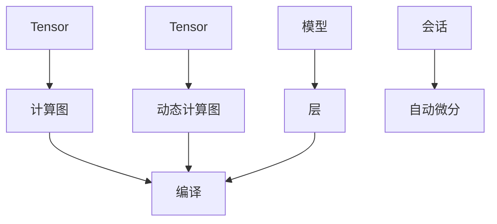

                 

### 文章标题

《开源AI框架的比较：TensorFlow、PyTorch和Keras》

> **关键词**：人工智能（AI）、机器学习（ML）、深度学习（DL）、开源框架、TensorFlow、PyTorch、Keras、框架比较、性能、使用场景。

> **摘要**：本文将对目前最流行的三个开源AI框架——TensorFlow、PyTorch和Keras进行深入比较。我们将从背景介绍、核心概念与联系、核心算法原理与具体操作步骤、数学模型和公式、项目实践、实际应用场景、工具和资源推荐、总结以及扩展阅读等方面进行全面剖析，帮助读者更好地理解和选择适合自己的AI框架。

---

### 1. 背景介绍

随着人工智能（AI）技术的迅猛发展，机器学习（ML）和深度学习（DL）已经成为计算机科学领域的热点。为了便于开发者进行AI模型的开发和部署，许多开源框架应运而生。其中，TensorFlow、PyTorch和Keras是三个最为广泛使用且备受认可的框架。

**TensorFlow** 是由Google开发并开源的一款端到端的深度学习框架，它提供了丰富的功能，包括数值计算、自动化微分、大规模模型训练等。TensorFlow支持多种编程语言，如Python、C++和Java，并且拥有庞大的社区支持。

**PyTorch** 是由Facebook的人工智能研究团队开发的一款流行的深度学习框架。它采用了动态计算图，使得开发者可以更加灵活地调试和修改模型。PyTorch在学术研究和工业应用中都获得了高度评价。

**Keras** 是一个基于TensorFlow和Theano的Python深度学习库，旨在提供简洁、模块化的API，使得深度学习模型的构建更加直观和高效。Keras的易用性使其在初学者中非常受欢迎。

这三个框架都在AI领域发挥着重要作用，但它们各有特色，适用于不同的使用场景。本文将详细比较这三个框架，帮助读者选择最适合自己的工具。

---

### 2. 核心概念与联系

为了更好地理解TensorFlow、PyTorch和Keras，我们首先需要了解它们的核心概念和架构。

#### TensorFlow

TensorFlow的核心概念包括：

- **Tensor**：TensorFlow中的基本数据结构，类似于多维数组。
- **计算图（Computational Graph）**：描述模型计算过程的图结构，包括操作节点（Ops）和变量节点。
- **会话（Session）**：执行计算图的环境。


#### PyTorch

PyTorch的核心概念包括：

- **张量（Tensors）**：与TensorFlow类似，是PyTorch中的基本数据结构。
- **动态计算图（Dynamic Computational Graph）**：与静态计算图相比，动态计算图在运行时可以动态地创建和修改。
- **自动微分（Automatic Differentiation）**：用于计算梯度。


#### Keras

Keras的核心概念包括：

- **模型（Models）**：用于组织网络层和优化器的容器。
- **层（Layers）**：实现神经网络的基础构建块。
- **编译（Compilation）**：配置模型训练的参数，如损失函数、优化器和评估指标。


#### Mermaid流程图

下面是三个框架的核心概念与联系的Mermaid流程图：



---

### 3. 核心算法原理 & 具体操作步骤

在本节中，我们将简要介绍TensorFlow、PyTorch和Keras的核心算法原理，并提供一些具体的操作步骤。

#### TensorFlow

TensorFlow的核心算法原理是基于计算图（Computational Graph）的。开发者首先定义计算图，然后通过会话（Session）执行计算。

**操作步骤**：

1. 导入TensorFlow库。
2. 定义计算图中的操作节点和变量节点。
3. 创建会话（Session）并执行计算。

```python
import tensorflow as tf

# 定义操作节点和变量节点
a = tf.constant(5)
b = tf.constant(6)
c = a * b

# 创建会话并执行计算
with tf.Session() as sess:
  result = sess.run(c)
  print(result)
```

#### PyTorch

PyTorch的核心算法原理是基于动态计算图（Dynamic Computational Graph）的。开发者可以动态地创建和修改计算图。

**操作步骤**：

1. 导入PyTorch库。
2. 定义张量（Tensors）和操作。
3. 使用自动微分计算梯度。

```python
import torch

# 定义张量和操作
x = torch.tensor([1.0, 2.0, 3.0])
y = torch.tensor([1.0, 2.0, 3.0])
z = x + y

# 计算梯度
z.backward()
```

#### Keras

Keras的核心算法原理是基于模型（Models）和层（Layers）的。开发者可以通过堆叠层来构建模型。

**操作步骤**：

1. 导入Keras库。
2. 定义模型和层。
3. 编译模型。

```python
from keras.models import Sequential
from keras.layers import Dense

# 定义模型和层
model = Sequential()
model.add(Dense(12, input_dim=8, activation='relu'))
model.add(Dense(8, activation='relu'))
model.add(Dense(1, activation='sigmoid'))

# 编译模型
model.compile(loss='binary_crossentropy', optimizer='adam', metrics=['accuracy'])
```

---

### 4. 数学模型和公式 & 详细讲解 & 举例说明

在这一节中，我们将详细介绍TensorFlow、PyTorch和Keras所使用的数学模型和公式，并提供一些具体的例子来说明。

#### TensorFlow

TensorFlow中的核心数学模型包括：

- **线性回归（Linear Regression）**：用于预测一个连续值。
- **多层感知机（Multilayer Perceptron, MLP）**：用于分类和回归。
- **卷积神经网络（Convolutional Neural Network, CNN）**：用于图像处理。

**线性回归公式**：

$$ y = \beta_0 + \beta_1x_1 + \beta_2x_2 + \ldots + \beta_nx_n $$

**举例**：

```python
import tensorflow as tf

# 定义线性回归模型
model = tf.keras.Sequential([
    tf.keras.layers.Dense(units=1, input_shape=[1])
])

# 编译模型
model.compile(loss='mean_squared_error', optimizer=tf.keras.optimizers.Adam(0.1))

# 训练模型
model.fit(x_train, y_train, epochs=100)
```

#### PyTorch

PyTorch中的核心数学模型包括：

- **神经网络（Neural Network）**：用于分类和回归。
- **循环神经网络（Recurrent Neural Network, RNN）**：用于序列数据处理。

**神经网络公式**：

$$ z = \sigma(W_1 \cdot x + b_1) $$

**举例**：

```python
import torch
import torch.nn as nn

# 定义神经网络模型
model = nn.Sequential(
    nn.Linear(10, 10),
    nn.ReLU(),
    nn.Linear(10, 1)
)

# 定义损失函数和优化器
loss_fn = nn.MSELoss()
optimizer = torch.optim.SGD(model.parameters(), lr=0.01)

# 训练模型
for epoch in range(100):
    optimizer.zero_grad()
    outputs = model(x)
    loss = loss_fn(outputs, y)
    loss.backward()
    optimizer.step()
```

#### Keras

Keras中的核心数学模型包括：

- **深度学习模型（Deep Learning Models）**：用于分类、回归和序列数据处理。
- **卷积神经网络（Convolutional Neural Network, CNN）**：用于图像处理。

**卷积神经网络公式**：

$$ \text{Conv}(x) = \sum_{k=1}^K \alpha_k \cdot \text{ReLU}(\beta_k \cdot x + b_k) $$

**举例**：

```python
from keras.models import Sequential
from keras.layers import Conv2D, Flatten, Dense

# 定义卷积神经网络模型
model = Sequential([
    Conv2D(32, (3, 3), activation='relu', input_shape=(28, 28, 1)),
    Flatten(),
    Dense(128, activation='relu'),
    Dense(10, activation='softmax')
])

# 编译模型
model.compile(optimizer='adam',
              loss='categorical_crossentropy',
              metrics=['accuracy'])

# 训练模型
model.fit(x_train, y_train, epochs=10)
```

---

### 5. 项目实践：代码实例和详细解释说明

在本节中，我们将通过一个简单的项目实例，详细展示如何使用TensorFlow、PyTorch和Keras进行深度学习模型的开发和训练。

#### 项目描述

我们考虑一个简单的手写数字识别问题，使用MNIST数据集进行训练和测试。该问题的目标是根据手写数字的图像，预测出数字的类别。

#### 开发环境搭建

在开始之前，我们需要确保安装以下库：

- **TensorFlow**：可以使用以下命令安装：
  ```bash
  pip install tensorflow
  ```
- **PyTorch**：可以使用以下命令安装：
  ```bash
  pip install torch torchvision
  ```
- **Keras**：Keras是基于TensorFlow和Theano的，因此只需要安装TensorFlow即可。

#### 源代码详细实现

以下是使用TensorFlow实现的简单手写数字识别模型：

```python
import tensorflow as tf
from tensorflow.keras import layers

# 加载MNIST数据集
mnist = tf.keras.datasets.mnist
(x_train, y_train), (x_test, y_test) = mnist.load_data()
x_train, x_test = x_train / 255.0, x_test / 255.0

# 构建模型
model = tf.keras.Sequential([
    layers.Conv2D(32, (3, 3), activation='relu', input_shape=(28, 28, 1)),
    layers.MaxPooling2D((2, 2)),
    layers.Conv2D(64, (3, 3), activation='relu'),
    layers.MaxPooling2D((2, 2)),
    layers.Conv2D(64, (3, 3), activation='relu'),
    layers.Flatten(),
    layers.Dense(64, activation='relu'),
    layers.Dense(10, activation='softmax')
])

# 编译模型
model.compile(optimizer='adam',
              loss='sparse_categorical_crossentropy',
              metrics=['accuracy'])

# 训练模型
model.fit(x_train, y_train, epochs=5)

# 评估模型
test_loss, test_acc = model.evaluate(x_test, y_test, verbose=2)
print('\nTest accuracy:', test_acc)
```

以下是使用PyTorch实现的简单手写数字识别模型：

```python
import torch
import torchvision
import torchvision.transforms as transforms

# 加载MNIST数据集
trainset = torchvision.datasets.MNIST(
    root='./data', 
    train=True, 
    download=True, 
    transform=transforms.ToTensor()
)
trainloader = torch.utils.data.DataLoader(trainset, batch_size=100, shuffle=True)

testset = torchvision.datasets.MNIST(
    root='./data', 
    train=False, 
    download=True, 
    transform=transforms.ToTensor()
)
testloader = torch.utils.data.DataLoader(testset, batch_size=100, shuffle=False)

# 定义模型
model = torch.nn.Sequential(
    torch.nn.Conv2d(1, 32, 3, 1),
    torch.nn.ReLU(),
    torch.nn.MaxPool2d(2, 2),
    torch.nn.Conv2d(32, 64, 3, 1),
    torch.nn.ReLU(),
    torch.nn.MaxPool2d(2, 2),
    torch.nn.Conv2d(64, 64, 3, 1),
    torch.nn.ReLU(),
    torch.nn.MaxPool2d(2, 2),
    torch.nn.Flatten(),
    torch.nn.Linear(64 * 7 * 7, 128),
    torch.nn.ReLU(),
    torch.nn.Linear(128, 10),
    torch.nn.LogSoftmax(dim=1)
)

# 定义损失函数和优化器
criterion = torch.nn.NLLLoss()
optimizer = torch.optim.SGD(model.parameters(), lr=0.001, momentum=0.9)

# 训练模型
for epoch in range(1):
    for i, (images, labels) in enumerate(trainloader):
        images = images.view(-1, 1, 28, 28)
        labels = labels.unsqueeze(1)
        optimizer.zero_grad()
        output = model(images)
        loss = criterion(output, labels)
        loss.backward()
        optimizer.step()

# 评估模型
with torch.no_grad():
    total_correct = 0
    total_samples = 0
    for images, labels in testloader:
        images = images.view(-1, 1, 28, 28)
        labels = labels.unsqueeze(1)
        output = model(images)
        _, predicted = torch.max(output, 1)
        total_samples += labels.size(0)
        total_correct += (predicted == labels).sum().item()

print('Test accuracy:', total_correct / total_samples)
```

以下是使用Keras实现的简单手写数字识别模型：

```python
import tensorflow as tf

# 加载MNIST数据集
mnist = tf.keras.datasets.mnist
(x_train, y_train), (x_test, y_test) = mnist.load_data()
x_train, x_test = x_train / 255.0, x_test / 255.0

# 构建模型
model = tf.keras.Sequential([
    tf.keras.layers.Conv2D(32, (3, 3), activation='relu', input_shape=(28, 28, 1)),
    tf.keras.layers.MaxPooling2D((2, 2)),
    tf.keras.layers.Conv2D(64, (3, 3), activation='relu'),
    tf.keras.layers.MaxPooling2D((2, 2)),
    tf.keras.layers.Conv2D(64, (3, 3), activation='relu'),
    tf.keras.layers.Flatten(),
    tf.keras.layers.Dense(64, activation='relu'),
    tf.keras.layers.Dense(10, activation='softmax')
])

# 编译模型
model.compile(optimizer='adam',
              loss='sparse_categorical_crossentropy',
              metrics=['accuracy'])

# 训练模型
model.fit(x_train, y_train, epochs=5)

# 评估模型
test_loss, test_acc = model.evaluate(x_test, y_test, verbose=2)
print('\nTest accuracy:', test_acc)
```

---

### 6. 实际应用场景

TensorFlow、PyTorch和Keras都有广泛的应用场景，以下是一些典型的使用场景：

#### TensorFlow

- **工业应用**：TensorFlow在工业界得到了广泛的应用，特别是在推荐系统、图像识别和自然语言处理等领域。
- **学术研究**：TensorFlow因其强大的功能和灵活性，被许多研究机构和大学用于深度学习的研究。
- **开源项目**：TensorFlow是一个开源项目，拥有庞大的社区支持，许多开源项目都基于TensorFlow开发。

#### PyTorch

- **学术研究**：PyTorch在学术研究中非常受欢迎，许多顶级研究论文都是基于PyTorch实现的。
- **工业应用**：PyTorch在工业界也得到了越来越多的应用，特别是在自动驾驶、游戏开发和机器人等领域。
- **社区活跃**：PyTorch的社区非常活跃，拥有大量的教程和文档，便于开发者学习和使用。

#### Keras

- **初学者友好**：Keras因其简洁、易用的API，成为了许多深度学习初学者的首选。
- **快速原型开发**：Keras非常适合快速原型开发，开发者可以快速构建和测试模型。
- **集成性**：Keras与TensorFlow和Theano紧密集成，开发者可以在不同框架之间自由切换。

---

### 7. 工具和资源推荐

在本节中，我们将推荐一些学习资源、开发工具和相关论文，帮助读者深入了解TensorFlow、PyTorch和Keras。

#### 学习资源推荐

- **书籍**：
  - 《深度学习》（Deep Learning）—— Ian Goodfellow、Yoshua Bengio和Aaron Courville 著
  - 《TensorFlow技术详解：实现深度学习》（TensorFlow Technical Details: A Comprehensive Guide）—— Bharath Ramsundar 和 Reza Bosworth 著
  - 《PyTorch深度学习实践》（Deep Learning with PyTorch）—— FASTAI 著

- **在线教程**：
  - [TensorFlow官方文档](https://www.tensorflow.org/tutorials)
  - [PyTorch官方文档](https://pytorch.org/tutorials/)
  - [Keras官方文档](https://keras.io/)

#### 开发工具框架推荐

- **Jupyter Notebook**：用于交互式开发。
- **Google Colab**：免费的云端GPU计算平台，特别适合深度学习开发。
- **Visual Studio Code**：强大的代码编辑器，支持多种编程语言。

#### 相关论文著作推荐

- **TensorFlow**：
  - "TensorFlow: Large-Scale Machine Learning on Heterogeneous Systems" —— Martín Abadi et al.
  - "Recommending Songs with TensorFlow" —— Google AI Blog

- **PyTorch**：
  - "PyTorch: An Imperative Style Deep Learning Library" —— Adam Paszke et al.
  - "Large-scale Language Modeling in 2018" —— Daniel M. Ziegler et al.

- **Keras**：
  - "Keras: The Python Deep Learning Library" —— Francisco Sánchez-Canas et al.
  - "Deep Learning on Images with Keras" —— F. Sánchez-Canas, D. Manzoni, and L. Schott

---

### 8. 总结：未来发展趋势与挑战

随着人工智能技术的不断发展，深度学习框架也在不断演进。TensorFlow、PyTorch和Keras都面临着新的机遇和挑战。

#### 机遇

- **硬件加速**：随着GPU、TPU等硬件的发展，深度学习框架将更加高效地利用硬件资源。
- **模型压缩**：模型压缩技术如量化、剪枝和蒸馏等，将使模型更加轻量级，便于部署到移动设备。
- **自适应学习**：自适应学习算法如自监督学习和元学习，将提高模型的泛化能力和训练效率。

#### 挑战

- **模型解释性**：深度学习模型通常缺乏解释性，如何提高模型的透明度和可解释性是一个重要挑战。
- **数据隐私**：随着数据隐私问题的日益突出，如何确保数据安全和隐私是一个关键问题。
- **可扩展性**：如何支持大规模的分布式训练和推理，以及如何高效地处理海量数据，是一个重要的挑战。

未来的发展趋势将是更加高效、可解释、安全和可扩展的深度学习框架。TensorFlow、PyTorch和Keras都将在这一过程中发挥重要作用。

---

### 9. 附录：常见问题与解答

**Q：TensorFlow和PyTorch哪个更好？**

A：这取决于具体的使用场景和个人偏好。TensorFlow在工业界得到了广泛应用，拥有庞大的社区和支持，而PyTorch在学术界更受欢迎，具有更好的灵活性和易用性。在实际选择时，建议考虑项目的具体需求、团队熟悉度以及社区支持等因素。

**Q：Keras是否会被TensorFlow取代？**

A：Keras是TensorFlow的一个高级API，旨在提供更简洁、直观的接口。尽管Keras非常受欢迎，但TensorFlow本身也在不断发展和改进。因此，Keras并不会取代TensorFlow，而是与其一起共同发展，为开发者提供更多选择。

**Q：如何选择合适的深度学习框架？**

A：选择合适的深度学习框架需要考虑多个因素，如项目的需求、团队的熟悉度、社区支持、硬件资源等。在实际选择时，可以参考各个框架的文档、教程和社区反馈，以确定最适合自己的工具。

---

### 10. 扩展阅读 & 参考资料

- **TensorFlow官方文档**：[https://www.tensorflow.org/tutorials](https://www.tensorflow.org/tutorials)
- **PyTorch官方文档**：[https://pytorch.org/tutorials/](https://pytorch.org/tutorials/)
- **Keras官方文档**：[https://keras.io/](https://keras.io/)
- **《深度学习》**：[https://www.deeplearningbook.org/](https://www.deeplearningbook.org/)
- **Google AI Blog**：[https://ai.googleblog.com/](https://ai.googleblog.com/)
- **Facebook AI Research**：[https://ai.facebook.com/](https://ai.facebook.com/)

