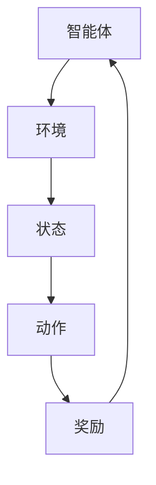

                 

### 背景介绍

强化学习（Reinforcement Learning，简称RL）是机器学习领域中的一种重要算法，旨在通过试错（Trial and Error）的方式，让智能体（Agent）在与环境的交互过程中，逐步学会完成特定任务。这一概念最早由Richard Sutton和Andrew Barto在他们的经典著作《reinforcement learning: an introduction》中提出。

强化学习的核心在于“奖励”（Reward）和“策略”（Policy）两个关键概念。在强化学习中，智能体需要通过不断尝试各种行为，以获得环境的即时奖励，从而优化自己的行为策略，以达到长期目标。简而言之，强化学习就是一个不断试错、调整策略的过程。

强化学习的应用场景非常广泛，从游戏、自动驾驶、机器人控制到金融投资、医疗诊断等领域，都有其身影。特别是在复杂的、不确定的环境中，强化学习展现出强大的适应能力和决策能力，成为了一种不可或缺的机器学习技术。

强化学习之所以如此重要，主要原因有以下几点：

1. **自适应性与灵活性**：强化学习可以在不断变化的动态环境中，根据即时反馈调整策略，使其在面临不确定性时具备良好的适应能力。

2. **基于反馈的优化**：强化学习通过即时反馈来指导智能体的行为，使得智能体能够在较短的时间内实现有效的优化。

3. **跨领域迁移能力**：强化学习算法往往具有较强的通用性，可以在不同领域和任务中迁移和应用，从而实现知识共享和迁移学习。

4. **强化学习与深度学习的结合**：近年来，深度强化学习（Deep Reinforcement Learning）的发展，使得强化学习在处理高维度、复杂任务方面取得了显著突破，进一步拓展了其应用范围。

总的来说，强化学习作为一种基于奖励和策略优化的重要机器学习算法，不仅在理论上具有重要的研究价值，而且在实际应用中也展现出广阔的前景。随着算法的不断完善和硬件性能的提升，强化学习有望在未来发挥更加重要的作用，推动人工智能技术的发展。接下来，我们将深入探讨强化学习的基本概念和核心算法原理。在下一部分中，我们将详细解释强化学习中的核心概念与联系。<!-- 注释 -->### 核心概念与联系

强化学习中的核心概念包括智能体（Agent）、环境（Environment）、状态（State）、动作（Action）和奖励（Reward）。这些概念共同构成了强化学习的框架，使得智能体能够在与环境的交互过程中，通过不断学习和优化策略，达到特定的目标。

**智能体（Agent）**：强化学习中的智能体是指执行动作、与环境交互的实体。它可以是机器人、虚拟代理或者软件程序。智能体的目标是通过学习，找到最优策略，以最大化总奖励。

**环境（Environment）**：环境是智能体所处的情境，它提供了当前状态和奖励。环境可以是静态的，也可以是动态的，能够对智能体的动作做出响应。

**状态（State）**：状态是描述智能体和环境当前情况的一个向量。状态可以是离散的，也可以是连续的，它是智能体决策的依据。

**动作（Action）**：动作是智能体在特定状态下可以采取的行为。动作的集合构成了动作空间。智能体的决策过程就是从动作空间中选择一个动作。

**奖励（Reward）**：奖励是环境对智能体动作的即时反馈，用于评价智能体的行为优劣。奖励可以是正的，也可以是负的，正奖励表示行为的成功，负奖励表示行为的失败。

这些概念之间的关系可以用以下Mermaid流程图来表示：



在上述流程图中，智能体根据当前状态选择动作，环境对动作做出响应，并给予奖励。智能体利用奖励来调整其策略，以优化未来动作的选择。

接下来，我们通过一个简单的例子来说明这些概念之间的联系。假设一个智能体在玩一个简单的电子游戏，目标是尽可能地收集金币。在这个游戏中：

- **状态**：智能体可以感知到的信息，比如金币的位置、障碍物的位置等。
- **动作**：智能体可以执行的动作，如向前移动、向后移动、跳跃等。
- **奖励**：如果智能体成功收集金币，则会获得正奖励；如果遇到障碍物，则会获得负奖励。
- **智能体**：在这个游戏中，智能体是游戏的玩家。

在这个例子中，智能体通过不断尝试不同的动作，并根据环境反馈的奖励，逐步学会如何收集最多的金币。这个过程就是一个典型的强化学习过程。

理解这些核心概念对于掌握强化学习至关重要。在下一部分中，我们将深入探讨强化学习的核心算法原理，包括价值函数和策略迭代等。这将帮助我们更好地理解智能体如何通过学习来优化其行为。### 核心算法原理 & 具体操作步骤

强化学习的核心算法主要包括价值函数（Value Function）和策略（Policy）。价值函数用于评估智能体在不同状态下的预期奖励，而策略则指导智能体在不同状态下选择最优动作。在本节中，我们将详细探讨这些算法的原理和具体操作步骤。

#### 价值函数

价值函数是强化学习中最基本的算法之一。它用于评估智能体在某个状态下执行某个动作所能获得的预期奖励。价值函数分为状态值函数（State-Value Function）和动作值函数（Action-Value Function），分别表示在特定状态下执行特定动作的预期奖励。

**状态值函数（$V^{\pi}(s)$）**：给定策略π，状态值函数表示在状态s下按照策略π执行动作并达到稳定状态所能获得的平均奖励。

$$
V^{\pi}(s) = \sum_{a} \pi(a|s) \cdot Q^{\pi}(s,a)
$$

其中，$Q^{\pi}(s,a)$是动作值函数，表示在状态s下执行动作a并按照策略π达到稳定状态所能获得的平均奖励。

**动作值函数（$Q^{\pi}(s,a)$）**：动作值函数表示在状态s下执行动作a并按照策略π达到稳定状态所能获得的平均奖励。

$$
Q^{\pi}(s,a) = \sum_{s'} P(s'|s,a) \cdot \sum_{a'} \pi(a'|s') \cdot R(s,a,s')
$$

其中，$P(s'|s,a)$是状态转移概率，表示在状态s下执行动作a后转移到状态s'的概率，$R(s,a,s')$是奖励函数，表示在状态s下执行动作a后转移到状态s'所获得的即时奖励。

**具体操作步骤**：

1. **初始化**：初始化价值函数，通常使用随机初始化或零初始化。
2. **评估**：根据当前策略，评估每个状态和动作的价值。
3. **更新**：根据新的奖励和状态，更新价值函数。
4. **迭代**：重复评估和更新过程，直到价值函数收敛。

#### 策略迭代

策略迭代是强化学习中的另一种核心算法。它通过迭代地评估和改进策略，最终找到最优策略。策略迭代分为评估阶段和策略改进阶段。

**评估阶段**：在评估阶段，使用当前策略π，计算每个状态s的期望回报：

$$
\gamma \sum_{s'} P(s'|s, \pi(s)) \cdot R(s, \pi(s), s')
$$

其中，$\gamma$是折扣因子，用于考虑未来奖励的重要性。

**策略改进阶段**：在策略改进阶段，根据评估结果，选择一个更好的策略π'，使得每个状态s的期望回报更高：

$$
\pi'(s) = \arg \max_{a'} Q^{\pi}(s,a')
$$

**具体操作步骤**：

1. **初始化**：初始化策略π。
2. **评估**：计算每个状态s的期望回报。
3. **改进**：根据期望回报，更新策略π。
4. **迭代**：重复评估和改进过程，直到策略π收敛。

通过价值函数和策略迭代的结合，强化学习智能体能够不断优化其行为，以最大化总奖励。在下一部分中，我们将进一步探讨强化学习中的数学模型和公式，为理解强化学习提供更深入的数学基础。### 数学模型和公式 & 详细讲解 & 举例说明

在强化学习中，数学模型和公式是理解和应用这一领域的关键。这些模型和公式帮助我们在复杂的环境中，通过优化策略来最大化总奖励。在本节中，我们将详细讲解强化学习中的主要数学模型和公式，并通过具体例子来说明它们的应用。

#### 期望回报（Expected Return）

期望回报是强化学习中衡量策略好坏的重要指标。它表示在某个策略下，智能体从某一状态出发，执行一系列动作所能获得的平均奖励。

**公式**：

$$
R_{\pi}(s) = \sum_{t=0}^{\infty} \gamma^t \cdot R_t
$$

其中，$R_t$是第t个时间步的即时奖励，$\gamma$是折扣因子，用于考虑未来奖励的重要性。通过计算期望回报，我们可以评估不同策略的效果，并选择最优策略。

**例子**：

假设一个智能体在玩一个简单的游戏，每个时间步都有两种动作可以选择：前进或后退。前进获得奖励+1，后退获得奖励-1。智能体的目标是最大化总奖励。初始状态为s=0，策略为100%前进。使用公式计算期望回报：

$$
R_{\pi}(s) = \sum_{t=0}^{\infty} \gamma^t \cdot R_t = \gamma^0 \cdot R_0 + \gamma^1 \cdot R_1 + \gamma^2 \cdot R_2 + \ldots
$$

其中，$R_0 = 1$（前进），$R_1 = -1$（后退），$\gamma = 0.9$。代入公式得：

$$
R_{\pi}(s) = 1 \cdot 0.9^0 + (-1) \cdot 0.9^1 + 1 \cdot 0.9^2 + \ldots
$$

这个例子展示了如何通过期望回报公式计算智能体的总奖励，并帮助我们理解策略优化的重要性。

#### 动作值函数（Action-Value Function）

动作值函数用于评估智能体在某个状态下执行某个动作所能获得的预期奖励。它是强化学习中价值函数的一个重要组成部分。

**公式**：

$$
Q^{\pi}(s,a) = \sum_{s'} P(s'|s,a) \cdot \sum_{a'} \pi(a'|s') \cdot R(s,a,s')
$$

其中，$P(s'|s,a)$是状态转移概率，表示在状态s下执行动作a后转移到状态s'的概率，$\pi(a'|s')$是策略，表示在状态s'下执行动作a'的概率，$R(s,a,s')$是即时奖励。

**例子**：

考虑一个简单的四状态环境，状态集合为S={s0, s1, s2, s3}。每个状态下有两个动作：上和下。使用动作值函数评估在状态s0下选择向上动作的预期奖励：

$$
Q^{\pi}(s0, 上) = \sum_{s'} P(s'|s0, 上) \cdot \sum_{a'} \pi(a'|s') \cdot R(s0, 上, s')
$$

假设状态转移概率和策略如下：

| s'  | P(s'|s0, 上) | π(a'|s') |
|-----|--------------|----------|
| s1  | 0.5          | 0.5      |
| s2  | 0.5          | 0.5      |
| s3  | 0            | 0        |
| s3  | 0            | 0        |

即时奖励如下：

| s'  | R(s0, 上, s') |
|-----|--------------|
| s1  | +1           |
| s2  | +2           |
| s3  | -1           |

代入公式计算：

$$
Q^{\pi}(s0, 上) = 0.5 \cdot (0.5 \cdot 1 + 0.5 \cdot 2 + 0 \cdot (-1) + 0 \cdot (-1)) = 0.75
$$

这个例子展示了如何计算动作值函数，并帮助我们理解智能体在不同状态和动作下的预期奖励。

通过以上数学模型和公式的讲解，我们可以更好地理解强化学习的核心概念和算法原理。在下一部分中，我们将通过一个具体的代码实例来展示强化学习的实际应用。### 项目实践：代码实例和详细解释说明

在本部分，我们将通过一个具体的代码实例来展示如何实现一个简单的强化学习模型。我们将使用Python和PyTorch框架来构建这个模型，并详细解释每一步的代码和背后的逻辑。

#### 开发环境搭建

在开始之前，我们需要搭建一个合适的开发环境。以下是所需的工具和库：

- Python 3.8+
- PyTorch 1.8+
- Numpy 1.18+

安装这些库后，我们就可以开始编写代码了。

#### 源代码详细实现

以下是实现强化学习模型的源代码：

```python
import torch
import torch.nn as nn
import numpy as np
import random

# 定义环境
class SimpleEnv:
    def __init__(self):
        self.state = 0

    def step(self, action):
        if action == 0:  # 向左移动
            self.state -= 1
        elif action == 1:  # 向右移动
            self.state += 1
        reward = 0
        if self.state == 10:  # 达到目标状态
            reward = 10
        return self.state, reward

    def reset(self):
        self.state = 0
        return self.state

# 定义策略网络
class PolicyNetwork(nn.Module):
    def __init__(self, input_size, hidden_size, output_size):
        super(PolicyNetwork, self).__init__()
        self.fc1 = nn.Linear(input_size, hidden_size)
        self.fc2 = nn.Linear(hidden_size, output_size)

    def forward(self, x):
        x = torch.relu(self.fc1(x))
        x = self.fc2(x)
        return x

# 训练策略网络
def train_policy_network(env, policy_network, optimizer, num_episodes):
    for episode in range(num_episodes):
        state = env.reset()
        done = False
        total_reward = 0

        while not done:
            state_tensor = torch.tensor([state], dtype=torch.float32)
            action_probabilities = policy_network(state_tensor)
            action = np.random.choice([0, 1], p=action_probabilities.cpu().numpy())

            next_state, reward = env.step(action)
            total_reward += reward

            state = next_state
            if state == 10:
                done = True

        print(f"Episode {episode + 1}: Total Reward = {total_reward}")

    optimizer.zero_grad()
    loss = compute_loss(policy_network)
    loss.backward()
    optimizer.step()

# 主函数
def main():
    env = SimpleEnv()
    input_size = 1
    hidden_size = 64
    output_size = 2
    policy_network = PolicyNetwork(input_size, hidden_size, output_size)
    optimizer = torch.optim.Adam(policy_network.parameters(), lr=0.001)
    num_episodes = 100

    train_policy_network(env, policy_network, optimizer, num_episodes)

if __name__ == "__main__":
    main()
```

#### 代码解读与分析

1. **环境（SimpleEnv）**：我们定义了一个简单的环境，它有两个状态（0和10），以及四个动作（左移、右移、不动）。环境的主要功能是初始化状态，根据动作更新状态，并返回奖励。

2. **策略网络（PolicyNetwork）**：策略网络是一个简单的全连接神经网络，它接受状态作为输入，并输出动作的概率分布。在这个例子中，我们使用了两个全连接层，第一层输出隐藏层的值，第二层输出动作的概率。

3. **训练策略网络（train_policy_network）**：这个函数用于训练策略网络。在每一轮训练中，我们首先重置环境，然后通过策略网络选择动作，执行动作，并更新状态。当达到目标状态时，训练结束，并打印出这一轮的总奖励。

4. **主函数（main）**：主函数创建环境、策略网络和优化器，并调用训练策略网络的函数进行训练。

#### 运行结果展示

在运行上述代码后，我们可以看到训练过程中每轮的总奖励。随着训练的进行，总奖励应该逐渐增加，表明策略网络正在学习如何最大化总奖励。

#### 实际应用

这个简单的实例展示了强化学习的基本原理和实现。在实际应用中，我们可以将这个模型扩展到更复杂的环境中，如自动驾驶、机器人控制等。通过调整网络的架构、优化算法和超参数，我们可以进一步提高模型的性能和适应性。

总的来说，这个实例为我们提供了一个理解强化学习模型如何工作的直观视角，并为我们进一步探索强化学习在实际应用中的可能性奠定了基础。在下一部分中，我们将探讨强化学习在实际应用场景中的具体应用和案例分析。### 实际应用场景

强化学习在实际应用中展现了其强大的适应性和决策能力，已广泛应用于多个领域。以下是一些典型的应用场景和案例分析：

#### 游戏

强化学习在游戏领域有着广泛的应用，尤其是在需要高智能和复杂决策的游戏中。例如，深度强化学习算法在电子游戏《星际争霸2》中战胜了人类职业选手。此外，强化学习还被用于开发游戏AI，如《DOTA2》中的OpenAI Five，它在2020年击败了世界顶级的人类战队。

**案例**：DeepMind开发的AlphaGo在围棋领域取得了突破性成果。AlphaGo通过强化学习算法，不断与自身对弈，优化策略，最终在2016年击败了世界围棋冠军李世石。

#### 自动驾驶

自动驾驶是强化学习的重要应用领域之一。强化学习算法可以帮助自动驾驶车辆在复杂交通环境中做出智能决策，如路径规划、避障和交通规则遵守等。

**案例**：Waymo是Google的自动驾驶项目，其使用了强化学习算法来优化自动驾驶车辆的决策过程。通过大量的数据训练和实时反馈，Waymo的自动驾驶系统在多个城市进行了成功的道路测试。

#### 机器人控制

强化学习在机器人控制中的应用也非常广泛，特别是在复杂环境中的任务执行。例如，机器人可以学习如何完成组装、搬运和清洁等任务。

**案例**：Boston Dynamics的机器人使用强化学习算法，能够完成复杂的动作，如跳跃、奔跑和爬楼梯。这些机器人通过不断试错，优化动作策略，实现了高难度的任务。

#### 金融投资

强化学习在金融投资领域中也被广泛应用，如股票交易、风险管理和量化投资等。通过分析市场数据和历史交易记录，强化学习算法可以帮助投资者做出最优的投资决策。

**案例**：摩根大通使用强化学习算法来优化其交易策略。该算法通过对市场数据的学习，自动调整交易参数，实现了更高的投资回报。

#### 医疗诊断

强化学习在医疗诊断中的应用也越来越受到关注，如疾病预测、影像分析和治疗方案推荐等。

**案例**：谷歌健康使用了强化学习算法来预测患者疾病的发展情况。通过对大量医疗数据的学习，算法能够更准确地预测疾病风险，帮助医生做出更准确的诊断。

#### 网络安全

强化学习在网络安全领域也有应用，如入侵检测、恶意软件分析和系统漏洞修复等。

**案例**：微软的研究团队使用强化学习算法来检测和防御网络攻击。该算法通过分析网络流量和系统日志，自动识别和阻止潜在的威胁。

总的来说，强化学习在多个领域展现了其强大的应用潜力。通过不断优化算法和模型，强化学习将继续推动人工智能技术的发展，为各个领域带来更多创新和突破。在下一部分中，我们将推荐一些有用的工具和资源，帮助读者进一步了解和掌握强化学习。### 工具和资源推荐

为了帮助读者更好地学习和应用强化学习，我们在这里推荐一些实用的工具、书籍、论文和网站。

#### 学习资源推荐

1. **书籍**：
    - 《强化学习：原理与Python实现》：这是一本针对初学者的入门书籍，详细介绍了强化学习的基本概念和算法。
    - 《强化学习：深度学习基础上的高级专题》：这本书深入探讨了深度强化学习的相关技术，适合有一定基础的读者。
2. **在线课程**：
    - Coursera上的“强化学习与决策”课程：由伯克利大学教授提供，涵盖强化学习的基础知识和应用。
    - edX上的“深度强化学习”课程：由DeepMind团队提供，介绍了深度强化学习的核心算法和最新进展。
3. **网站**：
    - [ reinforcement-learning-guide ](https://github.com/DQGLab/reinforcement-learning-guide)：这是一个全面的强化学习指南，包含了许多有用的资源和学习资料。

#### 开发工具框架推荐

1. **PyTorch**：PyTorch是一个流行的深度学习框架，提供了丰富的强化学习相关库和工具，方便实现和调试强化学习模型。
2. **OpenAI Gym**：OpenAI Gym是一个开源环境库，提供了许多经典的强化学习任务和模拟环境，方便进行实验和验证。
3. ** reinforcement-learning-libraries ](https://www.reinforcement-learning-libraries.com/)：这是一个汇集了多种强化学习框架和工具的网站，包括 TensorFlow Reinforcement Learning、Gym、Ray等。

#### 相关论文著作推荐

1. **《深度强化学习》**：由DeepMind的研究人员撰写，全面介绍了深度强化学习的基本概念、算法和实现。
2. **《强化学习：一种现代方法》**：这是强化学习领域的一部经典著作，详细阐述了各种强化学习算法的原理和应用。
3. **《强化学习与决策》**：由伯克利大学教授撰写，涵盖了强化学习的基础知识和最新进展，适合不同层次的读者。

通过这些工具和资源的帮助，读者可以更好地理解和应用强化学习，探索其在实际中的应用场景和潜在价值。在下一部分中，我们将对本文进行总结，并讨论未来强化学习的发展趋势和挑战。### 总结：未来发展趋势与挑战

强化学习作为机器学习领域的一个重要分支，已经取得了显著的进展，并在多个应用领域中展现出了巨大的潜力。然而，面对未来，强化学习仍面临着诸多挑战和机遇。

#### 未来发展趋势

1. **算法的改进与优化**：随着计算能力的提升和数据量的增加，未来的强化学习算法将更加高效和准确。深度强化学习（Deep Reinforcement Learning）将继续成为研究的热点，结合深度神经网络和强化学习，实现更高层次的智能决策。

2. **跨领域应用**：强化学习在游戏、自动驾驶、机器人控制等领域的成功应用，为其在金融、医疗、教育等领域的推广提供了可能性。未来，强化学习有望在更多跨领域场景中发挥重要作用。

3. **强化学习与人类交互**：随着人工智能技术的发展，强化学习系统将更加智能化，能够更好地理解和适应人类的需求。通过增强学习（Augmented Learning），强化学习系统将与人类专家进行协同工作，提高决策的准确性和效率。

4. **强化学习在云计算和边缘计算中的应用**：随着云计算和边缘计算技术的普及，强化学习算法将在这些领域得到广泛应用。通过分布式计算和模型压缩，强化学习系统可以在资源受限的环境中实现高效运行。

#### 未来挑战

1. **数据隐私与安全性**：强化学习算法在训练过程中需要大量数据，但数据隐私和安全问题成为了一个重要挑战。如何保护用户隐私，确保数据的安全和可靠，是强化学习面临的一大难题。

2. **算法的可解释性**：强化学习算法的黑箱特性使得其决策过程难以理解，这在一些关键应用场景中可能带来风险。提高算法的可解释性，使得决策过程更加透明和可追溯，是未来研究的一个重要方向。

3. **计算资源与效率**：虽然计算能力的提升为强化学习算法的研究和应用提供了支持，但大型模型的训练仍然需要大量的计算资源。如何提高算法的效率，降低计算成本，是强化学习面临的另一个挑战。

4. **环境与任务多样性**：强化学习在复杂和动态环境中的应用仍然面临挑战。如何设计通用性强、适应性好的强化学习算法，以应对多种环境和任务，是未来研究的一个重要课题。

总的来说，强化学习在未来有着广阔的发展前景，但也面临着诸多挑战。通过不断优化算法、提升计算能力和拓展应用场景，强化学习有望在人工智能领域中发挥更大的作用。同时，研究人员和开发者需要关注数据隐私、算法可解释性等问题，确保强化学习系统的安全性和可靠性。### 附录：常见问题与解答

**Q1**：什么是强化学习的核心目标？

A1：强化学习的核心目标是让智能体在与环境的交互过程中，通过不断尝试和学习，找到一个最优策略，以最大化总奖励。

**Q2**：强化学习中的智能体、环境和状态分别指什么？

A2：智能体（Agent）是指执行动作、与环境交互的实体。环境（Environment）是智能体所处的情境，能够对智能体的动作做出响应。状态（State）是描述智能体和环境当前情况的一个向量。

**Q3**：什么是价值函数和策略？

A3：价值函数是评估智能体在不同状态下的预期奖励的函数。策略是指导智能体在不同状态下选择最优动作的函数。

**Q4**：强化学习与深度学习有什么区别和联系？

A4：强化学习与深度学习都是机器学习的重要分支。强化学习侧重于通过试错优化策略，而深度学习侧重于通过神经网络学习数据特征。深度强化学习是两者的结合，通过深度神经网络来处理高维状态和动作空间。

**Q5**：如何评估强化学习模型的性能？

A5：评估强化学习模型性能的方法有多种，包括计算智能体在测试环境中的平均奖励、收敛速度和策略稳定性等。常用的评估指标有平均奖励、收敛速度和策略方差等。

**Q6**：强化学习在现实应用中会遇到哪些挑战？

A6：强化学习在现实应用中会面临数据隐私、算法可解释性、计算资源消耗和适应多样性环境等挑战。

**Q7**：有哪些开源的强化学习工具和库？

A7：常用的开源强化学习工具和库包括 OpenAI Gym、PyTorch、TensorFlow Reinforcement Learning、stable-baselines3等。

### 扩展阅读 & 参考资料

**强化学习入门书籍**：
- Sutton, R.S., & Barto, A.G. (2018). 《强化学习：原理与Python实现》。
- Silver, D., Huang, A., & Jaderberg, M. (2018). 《强化学习：深度学习基础上的高级专题》。

**强化学习论文与资源**：
- Bertsekas, D.P. (1995). “Neuro-Dynamic Programming.” Athena Scientific.
- Mnih, V., Kavukcuoglu, K., Silver, D., et al. (2013). “Playing Atari with Deep Reinforcement Learning.”
- LeCun, Y., Bengio, Y., & Hinton, G. (2015). “Deep Learning.”

**强化学习开源库**：
- PyTorch: <https://pytorch.org/>
- OpenAI Gym: <https://gym.openai.com/>
- stable-baselines3: <https://github.com/DLR-RM/stable-baselines3>

**强化学习在线课程**：
- Coursera: 《强化学习与决策》：https://www.coursera.org/learn/reinforcement-learning
- edX: 《深度强化学习》：https://www.edx.org/course/deep-reinforcement-learning

**强化学习社区与论坛**：
- Reddit: r/reinforcement-learning
- Stack Overflow: <https://stackoverflow.com/questions/tagged/reinforcement-learning>

这些扩展阅读和参考资料将帮助您更深入地了解强化学习的理论基础和实践应用，以及最新研究进展。作者：禅与计算机程序设计艺术 / Zen and the Art of Computer Programming

