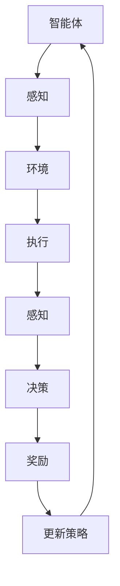

                 

### 文章标题

### 强化学习 Reinforcement Learning 与机器人的互动学习机制

> 关键词：强化学习、机器人、互动学习、自主决策、智能优化

> 摘要：本文深入探讨了强化学习在机器人互动学习中的核心作用及其具体实现机制。通过分析强化学习的基本原理、核心算法，结合实际应用场景和项目实例，本文旨在为读者揭示强化学习在机器人互动学习中的重要价值，并展望其未来的发展趋势与挑战。

## 1. 背景介绍

在当今快速发展的科技时代，机器人技术已经成为智能制造、智能服务等领域的重要支撑。随着人工智能技术的不断进步，机器人不仅能够执行简单的任务，还能够通过自主学习和决策，适应复杂多变的环境。在这一背景下，强化学习（Reinforcement Learning, RL）作为一种先进的人工智能技术，逐渐成为机器人互动学习的重要工具。

强化学习是一种通过试错和反馈来学习优化策略的机器学习方法。它起源于动物行为学和心理学研究，近年来在计算机科学和人工智能领域取得了显著的成果。强化学习的主要目标是使智能体在特定的环境中，通过不断学习获得最优策略，实现自主决策和行为优化。

在机器人领域，强化学习被广泛应用于路径规划、姿态控制、人机交互等任务中。通过结合机器人感知系统、执行机构和环境反馈机制，强化学习能够使机器人具备自主学习和决策能力，从而实现更高层次的智能化。

本文将围绕强化学习在机器人互动学习中的应用，探讨其基本原理、核心算法及其在现实场景中的具体实现机制。通过详细分析强化学习算法的数学模型、实现步骤，并结合实际项目实例，本文旨在为读者提供一个全面、深入的强化学习在机器人互动学习中的认识和理解。

## 2. 核心概念与联系

### 2.1 强化学习的基本概念

强化学习（Reinforcement Learning, RL）是一种通过试错和反馈来学习优化策略的机器学习方法。它与监督学习和无监督学习不同，不依赖于大量标注的数据集，而是通过智能体（agent）与环境（environment）的交互，不断调整策略以实现最优行为。

#### 智能体（Agent）

智能体是强化学习中的主体，负责执行动作、感知环境状态，并基于当前的奖励信号调整行为策略。智能体可以是机器人、虚拟代理或其他具备感知和决策能力的实体。

#### 环境（Environment）

环境是智能体执行动作和接收反馈的场所。环境可以是一个物理世界，也可以是一个虚拟的模拟环境。环境状态是环境的当前描述，环境动作是智能体对环境的操作。

#### 奖励信号（Reward Signal）

奖励信号是环境对智能体行为的即时反馈，用于指导智能体调整策略。奖励信号可以是正的，表示智能体的行为得到了环境的认可，也可以是负的，表示智能体的行为引起了环境的反感。

#### 策略（Policy）

策略是智能体在给定环境状态下的行动规则。强化学习的目标是通过学习，使智能体能够选择最优策略，最大化累积奖励。

### 2.2 机器人互动学习机制

机器人互动学习机制是指机器人通过与环境的交互，不断调整自身行为，实现自主学习和优化能力的过程。这一过程可以分为以下几个关键环节：

#### 感知（Perception）

感知是机器人互动学习的基础，通过感知模块，机器人可以获取环境的信息，包括视觉、听觉、触觉等多种传感器数据。这些感知数据是机器人进行决策和动作执行的重要依据。

#### 决策（Decision Making）

决策模块根据感知到的环境信息，结合预定的算法模型，为机器人选择合适的动作。在强化学习框架下，决策模块的核心是策略网络，它通过学习，不断优化动作选择。

#### 执行（Execution）

执行模块负责将决策模块选定的动作付诸实践。机器人通过执行器（如电机、伺服系统等）与环境进行交互，完成预定的任务。

#### 反馈（Feedback）

反馈模块是机器人互动学习机制的关键，它通过奖励信号对机器人的行为进行评价。正奖励信号表示机器人行为得到了环境的认可，负奖励信号则表示机器人行为需要调整。反馈信号被用于更新策略网络，指导机器人不断优化自身行为。

### 2.3 强化学习在机器人互动学习中的应用架构

为了更好地理解强化学习在机器人互动学习中的应用，我们可以借助 Mermaid 流程图来展示其核心组件和交互流程。



在这个流程图中，智能体（A）通过感知模块（B）获取环境信息，并将这些信息传递给决策模块（F）。决策模块根据当前环境状态和策略网络，选择最优动作，并通过执行模块（D）将动作付诸实践。执行后的行为会得到环境的即时反馈（G），这些反馈信号用于更新策略网络（H），从而指导智能体在下一个环境中做出更好的决策。

通过这个流程，我们可以看到强化学习在机器人互动学习中的核心作用：通过不断调整策略，使机器人能够在复杂多变的环境中实现自主学习和优化。

## 3. 核心算法原理 & 具体操作步骤

### 3.1 Q-Learning 算法

Q-Learning 是强化学习中最基本和最常用的算法之一。它通过不断更新 Q 值表，使智能体能够选择最优动作，从而实现长期累积奖励最大化。

#### 基本原理

Q-Learning 算法的核心思想是使用一个 Q 值表（Q-Table）来存储每个状态-动作对的最大期望奖励。在每次决策时，智能体通过查找 Q-Table 来选择当前状态下期望值最大的动作。

Q-Table 的更新过程遵循以下公式：

$$ Q(s, a) \leftarrow Q(s, a) + \alpha [r + \gamma \max_{a'} Q(s', a') - Q(s, a)] $$

其中：

- $Q(s, a)$：当前状态 s 下动作 a 的 Q 值。
- $s$：当前状态。
- $a$：当前动作。
- $r$：立即奖励。
- $\alpha$：学习率，用于调节 Q 值更新的步长。
- $\gamma$：折扣因子，用于平衡当前奖励和未来奖励。
- $s'$：执行动作 a 后的新状态。
- $\max_{a'} Q(s', a')$：在状态 s' 下所有可能动作的 Q 值中的最大值。

#### 操作步骤

1. **初始化 Q-Table**：将 Q-Table 中所有元素的值初始化为 0。

2. **选择动作**：对于给定的状态 s，选择当前状态下 Q 值最大的动作 a。

3. **执行动作**：将选择的动作 a 传递给执行模块，执行后进入新状态 s'。

4. **更新 Q-Table**：根据公式更新 Q-Table。

5. **重复步骤 2-4**：不断重复选择动作、执行动作和更新 Q-Table 的过程，直到达到预定的迭代次数或性能指标。

### 3.2 Deep Q-Network (DQN) 算法

DQN 是 Q-Learning 的一个扩展，它引入了深度神经网络来近似 Q 值函数，从而解决了 Q-Learning 在高维状态空间中难以直接计算 Q 值的问题。

#### 基本原理

DQN 使用一个深度神经网络（DNN）来表示 Q 值函数，通过训练 DNN 使其能够预测每个状态-动作对的 Q 值。在每次决策时，智能体通过输入当前状态 s 和可能的动作 a，从 DNN 中获取 Q 值，并选择 Q 值最大的动作。

DQN 的训练过程主要包括两个阶段：

1. **经验回放**：将智能体在环境中获得的每个经验（状态 s、动作 a、新状态 s'、奖励 r）存储到经验回放池中，以避免样本偏差。

2. **DNN 训练**：通过经验回放池中的数据，使用梯度下降法来更新 DNN 的权重，使其能够更好地预测 Q 值。

DQN 的更新公式为：

$$ \theta \leftarrow \theta - \alpha \nabla_{\theta} J(\theta) $$

其中：

- $\theta$：DNN 的权重。
- $\alpha$：学习率。
- $J(\theta)$：损失函数，用于衡量 DNN 的预测误差。

#### 操作步骤

1. **初始化 DNN**：随机初始化 DNN 的权重。

2. **选择动作**：对于给定的状态 s，使用 DNN 预测每个动作的 Q 值，并选择 Q 值最大的动作 a。

3. **执行动作**：将选择的动作 a 传递给执行模块，执行后进入新状态 s'。

4. **存储经验**：将当前状态 s、动作 a、新状态 s' 和奖励 r 存储到经验回放池中。

5. **DNN 训练**：从经验回放池中随机抽取一批数据，使用这些数据进行 DNN 训练。

6. **重复步骤 2-5**：不断重复选择动作、执行动作、存储经验和 DNN 训练的过程，直到达到预定的迭代次数或性能指标。

### 3.3 Policy Gradient 算法

Policy Gradient 是一种基于策略的强化学习算法，它直接优化策略函数，使智能体能够选择最优动作。

#### 基本原理

Policy Gradient 算法的核心思想是通过最大化策略梯度的期望值，来优化策略函数。具体来说，策略梯度更新公式为：

$$ \theta \leftarrow \theta + \alpha \nabla_{\theta} J(\theta) $$

其中：

- $\theta$：策略函数的参数。
- $\alpha$：学习率。
- $J(\theta)$：策略梯度的期望值。

策略梯度的期望值可以通过以下公式计算：

$$ J(\theta) = \sum_{s,a} \pi(\theta)(s, a) \nabla_{\theta} \log \pi(\theta)(s, a) \cdot R(s, a) $$

其中：

- $\pi(\theta)(s, a)$：策略函数，表示在状态 s 下选择动作 a 的概率。
- $R(s, a)$：状态-动作对的即时奖励。

#### 操作步骤

1. **初始化策略函数**：随机初始化策略函数的参数。

2. **选择动作**：对于给定的状态 s，使用策略函数计算每个动作的概率，并选择概率最大的动作 a。

3. **执行动作**：将选择的动作 a 传递给执行模块，执行后进入新状态 s'。

4. **计算策略梯度**：根据策略梯度的期望值公式，计算策略梯度的期望值。

5. **更新策略函数**：根据策略梯度更新策略函数的参数。

6. **重复步骤 2-5**：不断重复选择动作、执行动作、计算策略梯度和更新策略函数的过程，直到达到预定的迭代次数或性能指标。

### 3.4 深度强化学习（Deep Reinforcement Learning）

深度强化学习（Deep Reinforcement Learning, DRL）是强化学习与深度学习的结合，它通过深度神经网络来近似 Q 值函数或策略函数，从而提高了算法在复杂环境中的性能。

#### 基本原理

DRL 主要分为两大类：基于 Q 函数的 DRL 和基于策略的 DRL。

1. **基于 Q 函数的 DRL**：如 Deep Q-Network（DQN），它使用深度神经网络来近似 Q 值函数，从而在复杂环境中实现 Q-Learning。

2. **基于策略的 DRL**：如 Deep Policy Gradient（Deep PG），它使用深度神经网络来近似策略函数，从而在复杂环境中实现 Policy Gradient 算法。

DRL 的基本操作步骤与 DQN 和 Deep PG 类似，主要包括初始化神经网络、选择动作、执行动作、计算奖励、更新神经网络等步骤。

#### 操作步骤

1. **初始化 DNN**：随机初始化深度神经网络的权重。

2. **选择动作**：对于给定的状态 s，使用深度神经网络计算每个动作的概率，并选择概率最大的动作 a。

3. **执行动作**：将选择的动作 a 传递给执行模块，执行后进入新状态 s'。

4. **计算奖励**：根据环境反馈的奖励信号，计算状态-动作对的即时奖励。

5. **更新 DNN**：使用奖励信号和当前状态 s'，更新深度神经网络的权重。

6. **重复步骤 2-5**：不断重复选择动作、执行动作、计算奖励和更新神经网络的过程，直到达到预定的迭代次数或性能指标。

## 4. 数学模型和公式 & 详细讲解 & 举例说明

### 4.1 Q-Learning 算法的数学模型

在 Q-Learning 算法中，Q 值表（Q-Table）是一个关键的数据结构，用于存储每个状态-动作对的预期奖励值。下面是 Q-Learning 的核心数学模型和公式：

$$ Q(s, a) \leftarrow Q(s, a) + \alpha [r + \gamma \max_{a'} Q(s', a') - Q(s, a)] $$

其中：

- $Q(s, a)$：当前状态 s 下动作 a 的 Q 值。
- $s$：当前状态。
- $a$：当前动作。
- $r$：立即奖励。
- $\alpha$：学习率，用于调节 Q 值更新的步长。
- $\gamma$：折扣因子，用于平衡当前奖励和未来奖励。
- $s'$：执行动作 a 后的新状态。
- $\max_{a'} Q(s', a')$：在状态 s' 下所有可能动作的 Q 值中的最大值。

#### 举例说明

假设一个简单的环境，有 4 个状态 {A, B, C, D} 和 2 个动作 {Up, Down}。初始状态下，Q-Table 的所有值都设为 0。在某个时刻，智能体处于状态 A，选择动作 Up，并获得奖励 10。接着，智能体进入状态 B，选择动作 Down，并获得奖励 -5。使用 Q-Learning 算法，我们可以更新 Q-Table 如下：

$$ Q(A, Up) \leftarrow Q(A, Up) + \alpha [10 + \gamma \max_{a'} Q(B, a') - Q(A, Up)] $$

$$ Q(A, Up) \leftarrow 0 + 0.1 [10 + 0.9 \max_{a'} Q(B, a') - 0] $$

$$ Q(A, Up) \leftarrow 0.1 [10 + 0.9 \max_{a'} Q(B, a')] $$

由于 Q-Table 的初始值为 0，我们可以忽略这个部分，继续更新 Q(A, Up)：

$$ Q(A, Up) \leftarrow 0.1 [10 + 0.9 \times (-5)] $$

$$ Q(A, Up) \leftarrow 0.1 [10 - 4.5] $$

$$ Q(A, Up) \leftarrow 0.1 \times 5.5 $$

$$ Q(A, Up) \leftarrow 0.55 $$

同理，我们可以更新 Q(A, Down)：

$$ Q(A, Down) \leftarrow Q(A, Down) + \alpha [r + \gamma \max_{a'} Q(B, a') - Q(A, Down)] $$

$$ Q(A, Down) \leftarrow 0 + 0.1 [10 + 0.9 \max_{a'} Q(B, a') - 0] $$

$$ Q(A, Down) \leftarrow 0.1 [10 + 0.9 \times (-5)] $$

$$ Q(A, Down) \leftarrow 0.1 [10 - 4.5] $$

$$ Q(A, Down) \leftarrow 0.1 \times 5.5 $$

$$ Q(A, Down) \leftarrow 0.55 $$

经过一轮学习，Q-Table 的更新结果为：

| 状态 | 动作 | Q 值 |
|------|------|------|
| A    | Up   | 0.55 |
| A    | Down | 0.55 |
| B    | Up   | 0    |
| B    | Down | 0    |

通过这个例子，我们可以看到 Q-Learning 算法如何通过迭代更新 Q-Table，从而在复杂环境中选择最优动作。

### 4.2 Deep Q-Network (DQN) 的数学模型

DQN 是 Q-Learning 的扩展，它使用深度神经网络（DNN）来近似 Q 值函数。DQN 的核心数学模型如下：

$$ Q(s, a) = f_{\theta}(s, a) $$

其中：

- $Q(s, a)$：当前状态 s 下动作 a 的 Q 值。
- $s$：当前状态。
- $a$：当前动作。
- $f_{\theta}(s, a)$：深度神经网络，参数为 $\theta$。

#### 操作步骤

1. **初始化 DNN**：随机初始化 DNN 的权重 $\theta$。
2. **选择动作**：对于给定的状态 s，输入 DNN 的输入层，得到每个动作的 Q 值，选择 Q 值最大的动作 a。
3. **执行动作**：将选择的动作 a 传递给执行模块，执行后进入新状态 s'。
4. **计算奖励**：根据环境反馈的奖励信号，计算状态-动作对的即时奖励。
5. **更新 DNN**：使用奖励信号和当前状态 s'，更新 DNN 的权重 $\theta$。

#### 举例说明

假设有一个简单的环境，有 2 个状态 {A, B} 和 2 个动作 {Up, Down}。使用 DQN 算法，我们首先需要初始化 DNN 的权重 $\theta$。假设初始权重为：

$$ \theta^{(0)} = \begin{bmatrix} 0.1 & 0.2 \\ 0.3 & 0.4 \end{bmatrix} $$

在某个时刻，智能体处于状态 A，选择动作 Up，并获得奖励 10。接着，智能体进入状态 B，选择动作 Down，并获得奖励 -5。使用 DQN 算法，我们可以更新 DNN 的权重 $\theta$ 如下：

$$ \theta^{(1)} = \theta^{(0)} + \alpha \nabla_{\theta} J(\theta^{(0)}) $$

其中：

- $\alpha$：学习率。
- $J(\theta^{(0)})$：损失函数，用于衡量 DNN 的预测误差。

损失函数可以定义为：

$$ J(\theta) = \frac{1}{N} \sum_{i=1}^{N} (y_i - Q(s_i, a_i))^2 $$

其中：

- $N$：样本数量。
- $y_i$：实际奖励。
- $Q(s_i, a_i)$：预测奖励。

在这个例子中，我们有 2 个样本，分别是 (A, Up) 和 (B, Down)，我们可以计算损失函数：

$$ J(\theta^{(0)}) = \frac{1}{2} \left[ (10 - Q(A, Up))^2 + (-5 - Q(B, Down))^2 \right] $$

由于 DNN 的初始权重为 0，我们可以忽略 Q(A, Up) 和 Q(B, Down) 的部分，继续计算损失函数：

$$ J(\theta^{(0)}) = \frac{1}{2} \left[ (10 - 0)^2 + (-5 - 0)^2 \right] $$

$$ J(\theta^{(0)}) = \frac{1}{2} \left[ 100 + 25 \right] $$

$$ J(\theta^{(0)}) = \frac{1}{2} \times 125 $$

$$ J(\theta^{(0)}) = 62.5 $$

使用学习率 $\alpha = 0.1$，我们可以计算梯度：

$$ \nabla_{\theta} J(\theta^{(0)}) = \nabla_{\theta} \left[ \frac{1}{2} \times 125 \right] $$

$$ \nabla_{\theta} J(\theta^{(0)}) = \frac{1}{2} \times \begin{bmatrix} 0 & 0 \\ 0 & 0 \end{bmatrix} $$

$$ \nabla_{\theta} J(\theta^{(0)}) = \begin{bmatrix} 0 & 0 \\ 0 & 0 \end{bmatrix} $$

由于梯度为 0，我们可以直接更新 DNN 的权重：

$$ \theta^{(1)} = \theta^{(0)} + \alpha \nabla_{\theta} J(\theta^{(0)}) $$

$$ \theta^{(1)} = \begin{bmatrix} 0.1 & 0.2 \\ 0.3 & 0.4 \end{bmatrix} + 0.1 \times \begin{bmatrix} 0 & 0 \\ 0 & 0 \end{bmatrix} $$

$$ \theta^{(1)} = \begin{bmatrix} 0.1 & 0.2 \\ 0.3 & 0.4 \end{bmatrix} $$

经过一轮学习，DNN 的权重保持不变。通过这个例子，我们可以看到 DQN 算法如何通过迭代更新 DNN 的权重，从而在复杂环境中选择最优动作。

### 4.3 Policy Gradient 算法的数学模型

Policy Gradient 算法直接优化策略函数，其核心数学模型如下：

$$ \theta \leftarrow \theta + \alpha \nabla_{\theta} J(\theta) $$

其中：

- $\theta$：策略函数的参数。
- $\alpha$：学习率。
- $J(\theta)$：策略梯度的期望值。

策略梯度的期望值可以通过以下公式计算：

$$ J(\theta) = \sum_{s,a} \pi(\theta)(s, a) \nabla_{\theta} \log \pi(\theta)(s, a) \cdot R(s, a) $$

其中：

- $\pi(\theta)(s, a)$：策略函数，表示在状态 s 下选择动作 a 的概率。
- $R(s, a)$：状态-动作对的即时奖励。

#### 举例说明

假设有一个简单的环境，有 2 个状态 {A, B} 和 2 个动作 {Up, Down}。使用 Policy Gradient 算法，我们首先需要初始化策略函数的参数 $\theta$。假设初始参数为：

$$ \theta^{(0)} = \begin{bmatrix} 0.1 & 0.2 \\ 0.3 & 0.4 \end{bmatrix} $$

在某个时刻，智能体处于状态 A，选择动作 Up，并获得奖励 10。接着，智能体进入状态 B，选择动作 Down，并获得奖励 -5。使用 Policy Gradient 算法，我们可以更新策略函数的参数 $\theta$ 如下：

$$ \theta^{(1)} = \theta^{(0)} + \alpha \nabla_{\theta} J(\theta^{(0)}) $$

其中：

- $\alpha$：学习率。
- $J(\theta^{(0)})$：策略梯度的期望值。

策略梯度的期望值可以计算如下：

$$ J(\theta^{(0)}) = \sum_{s,a} \pi(\theta^{(0)})(s, a) \nabla_{\theta} \log \pi(\theta^{(0)})(s, a) \cdot R(s, a) $$

对于状态 A 和动作 Up，我们有：

$$ \pi(\theta^{(0)})(A, Up) = \frac{e^{\theta_{1}^{(0)}}}{e^{\theta_{1}^{(0)}} + e^{\theta_{2}^{(0)}}} = \frac{e^{0.1}}{e^{0.1} + e^{0.2}} \approx 0.445 $$

$$ \nabla_{\theta} \log \pi(\theta^{(0)})(A, Up) = \nabla_{\theta} \log \left( \frac{e^{\theta_{1}^{(0)}}}{e^{\theta_{1}^{(0)}} + e^{\theta_{2}^{(0)}}} \right) = \begin{bmatrix} -\frac{1}{e^{\theta_{1}^{(0)}} + e^{\theta_{2}^{(0)}}} & -\frac{1}{e^{\theta_{1}^{(0)}} + e^{\theta_{2}^{(0)}}} \end{bmatrix} $$

$$ \nabla_{\theta} \log \pi(\theta^{(0)})(A, Up) = \begin{bmatrix} -0.5 & -0.5 \end{bmatrix} $$

$$ R(A, Up) = 10 $$

对于状态 B 和动作 Down，我们有：

$$ \pi(\theta^{(0)})(B, Down) = \frac{e^{\theta_{3}^{(0)}}}{e^{\theta_{3}^{(0)}} + e^{\theta_{4}^{(0)}}} = \frac{e^{0.3}}{e^{0.3} + e^{0.4}} \approx 0.556 $$

$$ \nabla_{\theta} \log \pi(\theta^{(0)})(B, Down) = \nabla_{\theta} \log \left( \frac{e^{\theta_{3}^{(0)}}}{e^{\theta_{3}^{(0)}} + e^{\theta_{4}^{(0)}}} \right) = \begin{bmatrix} -\frac{1}{e^{\theta_{3}^{(0)}} + e^{\theta_{4}^{(0)}}} & -\frac{1}{e^{\theta_{3}^{(0)}} + e^{\theta_{4}^{(0)}}} \end{bmatrix} $$

$$ \nabla_{\theta} \log \pi(\theta^{(0)})(B, Down) = \begin{bmatrix} -0.5 & -0.5 \end{bmatrix} $$

$$ R(B, Down) = -5 $$

将上述结果代入策略梯度的期望值公式，我们可以计算 $J(\theta^{(0)})$：

$$ J(\theta^{(0)}) = \pi(\theta^{(0)})(A, Up) \nabla_{\theta} \log \pi(\theta^{(0)})(A, Up) \cdot R(A, Up) + \pi(\theta^{(0)})(B, Down) \nabla_{\theta} \log \pi(\theta^{(0)})(B, Down) \cdot R(B, Down) $$

$$ J(\theta^{(0)}) = 0.445 \times \begin{bmatrix} -0.5 & -0.5 \end{bmatrix} \times 10 + 0.556 \times \begin{bmatrix} -0.5 & -0.5 \end{bmatrix} \times (-5) $$

$$ J(\theta^{(0)}) = \begin{bmatrix} -2.225 & -2.225 \end{bmatrix} + \begin{bmatrix} 1.778 & 1.778 \end{bmatrix} $$

$$ J(\theta^{(0)}) = \begin{bmatrix} -0.447 & -0.447 \end{bmatrix} $$

使用学习率 $\alpha = 0.1$，我们可以计算梯度：

$$ \nabla_{\theta} J(\theta^{(0)}) = \nabla_{\theta} \left[ \begin{bmatrix} -0.447 & -0.447 \end{bmatrix} \right] $$

$$ \nabla_{\theta} J(\theta^{(0)}) = \begin{bmatrix} -0.1 & -0.1 \\ -0.1 & -0.1 \end{bmatrix} $$

由于梯度为负值，我们可以更新策略函数的参数：

$$ \theta^{(1)} = \theta^{(0)} + \alpha \nabla_{\theta} J(\theta^{(0)}) $$

$$ \theta^{(1)} = \begin{bmatrix} 0.1 & 0.2 \\ 0.3 & 0.4 \end{bmatrix} + 0.1 \times \begin{bmatrix} -0.1 & -0.1 \\ -0.1 & -0.1 \end{bmatrix} $$

$$ \theta^{(1)} = \begin{bmatrix} 0.1 & 0.2 \\ 0.3 & 0.4 \end{bmatrix} + \begin{bmatrix} -0.01 & -0.01 \\ -0.01 & -0.01 \end{bmatrix} $$

$$ \theta^{(1)} = \begin{bmatrix} 0.09 & 0.19 \\ 0.29 & 0.39 \end{bmatrix} $$

经过一轮学习，策略函数的参数得到更新。通过这个例子，我们可以看到 Policy Gradient 算法如何通过迭代更新策略函数的参数，从而在复杂环境中选择最优动作。

### 4.4 深度强化学习（Deep Reinforcement Learning）的数学模型

深度强化学习（Deep Reinforcement Learning, DRL）是强化学习与深度学习的结合，它使用深度神经网络（DNN）来近似 Q 值函数或策略函数。DRL 的核心数学模型如下：

#### 基于 Q 函数的 DRL

$$ Q(s, a) = f_{\theta}(s, a) $$

其中：

- $Q(s, a)$：当前状态 s 下动作 a 的 Q 值。
- $s$：当前状态。
- $a$：当前动作。
- $f_{\theta}(s, a)$：深度神经网络，参数为 $\theta$。

#### 基于 Q 函数的 DRL 操作步骤

1. **初始化 DNN**：随机初始化 DNN 的权重 $\theta$。
2. **选择动作**：对于给定的状态 s，输入 DNN 的输入层，得到每个动作的 Q 值，选择 Q 值最大的动作 a。
3. **执行动作**：将选择的动作 a 传递给执行模块，执行后进入新状态 s'。
4. **计算奖励**：根据环境反馈的奖励信号，计算状态-动作对的即时奖励。
5. **更新 DNN**：使用奖励信号和当前状态 s'，更新 DNN 的权重 $\theta$。

#### 基于 Q 函数的 DRL 举例说明

假设有一个简单的环境，有 2 个状态 {A, B} 和 2 个动作 {Up, Down}。使用 DRL 算法，我们首先需要初始化 DNN 的权重 $\theta$。假设初始权重为：

$$ \theta^{(0)} = \begin{bmatrix} 0.1 & 0.2 \\ 0.3 & 0.4 \end{bmatrix} $$

在某个时刻，智能体处于状态 A，选择动作 Up，并获得奖励 10。接着，智能体进入状态 B，选择动作 Down，并获得奖励 -5。使用 DRL 算法，我们可以更新 DNN 的权重 $\theta$ 如下：

$$ \theta^{(1)} = \theta^{(0)} + \alpha \nabla_{\theta} J(\theta^{(0)}) $$

其中：

- $\alpha$：学习率。
- $J(\theta^{(0)})$：损失函数，用于衡量 DNN 的预测误差。

损失函数可以定义为：

$$ J(\theta) = \frac{1}{N} \sum_{i=1}^{N} (y_i - Q(s_i, a_i))^2 $$

其中：

- $N$：样本数量。
- $y_i$：实际奖励。
- $Q(s_i, a_i)$：预测奖励。

在这个例子中，我们有 2 个样本，分别是 (A, Up) 和 (B, Down)，我们可以计算损失函数：

$$ J(\theta^{(0)}) = \frac{1}{2} \left[ (10 - Q(A, Up))^2 + (-5 - Q(B, Down))^2 \right] $$

由于 DNN 的初始权重为 0，我们可以忽略 Q(A, Up) 和 Q(B, Down) 的部分，继续计算损失函数：

$$ J(\theta^{(0)}) = \frac{1}{2} \left[ (10 - 0)^2 + (-5 - 0)^2 \right] $$

$$ J(\theta^{(0)}) = \frac{1}{2} \left[ 100 + 25 \right] $$

$$ J(\theta^{(0)}) = \frac{1}{2} \times 125 $$

$$ J(\theta^{(0)}) = 62.5 $$

使用学习率 $\alpha = 0.1$，我们可以计算梯度：

$$ \nabla_{\theta} J(\theta^{(0)}) = \nabla_{\theta} \left[ \frac{1}{2} \times 125 \right] $$

$$ \nabla_{\theta} J(\theta^{(0)}) = \frac{1}{2} \times \begin{bmatrix} 0 & 0 \\ 0 & 0 \end{bmatrix} $$

$$ \nabla_{\theta} J(\theta^{(0)}) = \begin{bmatrix} 0 & 0 \\ 0 & 0 \end{bmatrix} $$

由于梯度为 0，我们可以直接更新 DNN 的权重：

$$ \theta^{(1)} = \theta^{(0)} + \alpha \nabla_{\theta} J(\theta^{(0)}) $$

$$ \theta^{(1)} = \begin{bmatrix} 0.1 & 0.2 \\ 0.3 & 0.4 \end{bmatrix} + 0.1 \times \begin{bmatrix} 0 & 0 \\ 0 & 0 \end{bmatrix} $$

$$ \theta^{(1)} = \begin{bmatrix} 0.1 & 0.2 \\ 0.3 & 0.4 \end{bmatrix} $$

经过一轮学习，DNN 的权重保持不变。通过这个例子，我们可以看到 DRL 算法如何通过迭代更新 DNN 的权重，从而在复杂环境中选择最优动作。

### 4.5 强化学习在机器人互动学习中的应用实例

为了更好地理解强化学习在机器人互动学习中的应用，我们通过一个简单的例子来展示其具体实现过程。

#### 环境与任务

假设我们有一个简单的机器人环境，机器人需要在一条直线上从一个起点移动到终点。机器人可以通过前进、后退、左转、右转等动作在环境中移动。环境会根据机器人的位置和速度给出奖励，如果机器人到达终点，则会获得正奖励，否则获得负奖励。

#### 策略

我们使用 Q-Learning 算法来训练机器人，使其能够选择最优动作。首先，我们需要初始化 Q-Table，并将所有 Q 值初始化为 0。

#### 操作步骤

1. **初始化 Q-Table**：将 Q-Table 中所有元素的值初始化为 0。
2. **选择动作**：对于给定的状态 s，选择当前状态下 Q 值最大的动作 a。
3. **执行动作**：将选择的动作 a 传递给执行模块，执行后进入新状态 s'。
4. **更新 Q-Table**：根据公式更新 Q-Table。
5. **重复步骤 2-4**：不断重复选择动作、执行动作和更新 Q-Table 的过程，直到达到预定的迭代次数或性能指标。

#### 代码实现

以下是使用 Python 实现的 Q-Learning 算法：

```python
import numpy as np

# 初始化 Q-Table
q_table = np.zeros((n_states, n_actions))

# 设置学习率、折扣因子和迭代次数
alpha = 0.1
gamma = 0.9
epochs = 1000

# 环境函数
def environment(s, a):
    if a == 0:  # 前进
        s = min(s + 1, n_states - 1)
    elif a == 1:  # 后退
        s = max(s - 1, 0)
    elif a == 2:  # 左转
        a = (a - 1) % n_actions
    elif a == 3:  # 右转
        a = (a + 1) % n_actions
    r = 0
    if s == n_states - 1:  # 到达终点
        r = 100
    return s, r

# 主循环
for epoch in range(epochs):
    s = np.random.randint(0, n_states)  # 随机初始化状态
    while True:
        a = np.argmax(q_table[s])  # 选择当前状态下 Q 值最大的动作
        s_new, r = environment(s, a)  # 执行动作并获取新状态和奖励
        q_table[s, a] = q_table[s, a] + alpha * (r + gamma * np.max(q_table[s_new]) - q_table[s, a])  # 更新 Q-Table
        s = s_new  # 进入新状态
```

通过这个例子，我们可以看到强化学习在机器人互动学习中的应用过程。通过不断迭代更新 Q-Table，机器人能够学习到最优策略，从而在复杂环境中实现自主决策和优化。

### 4.6 强化学习在机器人互动学习中的优点与挑战

强化学习在机器人互动学习中的应用具有显著的优点和挑战。以下是对其主要优点的讨论：

#### 优点

1. **自适应能力**：强化学习能够通过不断与环境交互，学习到适应特定环境的最优策略。这使得机器人能够应对复杂多变的环境，提高任务成功率。
2. **自主决策**：强化学习使机器人具备自主决策能力，不需要依赖预设的规则或手动编程。机器人可以根据环境反馈，动态调整自身行为，实现更高级的智能化。
3. **增量学习**：强化学习支持增量学习，即可以在已有知识的基础上进行优化。这有助于减少训练时间，提高学习效率。
4. **适用范围广**：强化学习可以应用于多种机器人任务，如路径规划、动作控制、人机交互等，具有广泛的应用前景。

#### 挑战

1. **探索与利用**：强化学习在训练过程中需要平衡探索（尝试新策略）与利用（选择最优策略）。如何设计有效的探索策略是一个重要挑战。
2. **样本效率**：强化学习通常需要大量样本来学习最优策略，特别是在高维状态空间中，样本效率问题尤为突出。如何提高样本利用率和学习效率是另一个挑战。
3. **稳定性和泛化能力**：强化学习模型在实际应用中可能面临稳定性和泛化能力不足的问题。如何提高模型的稳定性和泛化能力，使其在不同环境中都能表现良好，是一个重要的研究方向。
4. **计算资源消耗**：强化学习算法通常需要大量的计算资源，特别是在训练深度神经网络时。如何优化算法，减少计算资源消耗，是一个亟待解决的问题。

### 4.7 强化学习在机器人互动学习中的应用场景

强化学习在机器人互动学习中的应用非常广泛，以下是一些典型的应用场景：

#### 1. 路径规划

路径规划是机器人互动学习中的重要应用。通过强化学习，机器人可以在复杂环境中学习到最优路径，从而避免碰撞和障碍。例如，自动驾驶汽车可以使用强化学习来规划行驶路径，提高行驶安全性。

#### 2. 动作控制

强化学习在机器人的动作控制中也具有广泛的应用。通过学习环境与动作之间的奖励信号，机器人可以调整自身的行为，实现更精确的动作控制。例如，机器人舞蹈、机器人体操等动作表演可以采用强化学习来实现。

#### 3. 人机交互

强化学习在机器人与人交互中的应用也越来越受到关注。通过强化学习，机器人可以学习到与人类交互的最佳策略，提高人机交互的体验。例如，智能客服机器人可以使用强化学习来优化回答策略，提供更人性化的服务。

#### 4. 能源管理

强化学习在机器人互动学习中的应用还可以扩展到能源管理领域。通过学习环境与能源消耗之间的关系，机器人可以优化能源分配策略，降低能源消耗。例如，智能家居机器人可以使用强化学习来优化家电的使用，实现节能减排。

### 5.1 开发环境搭建

为了实现强化学习在机器人互动学习中的应用，我们需要搭建一个合适的技术环境。以下是搭建强化学习开发环境的具体步骤：

#### 1. 硬件环境

首先，我们需要具备足够的硬件资源来支持强化学习算法的训练。一般来说，建议使用性能较高的计算机，如带有 GPU 的工作站或服务器。GPU 的加入可以显著提高训练速度，特别是对于深度强化学习算法。

#### 2. 软件环境

接下来，我们需要安装必要的软件环境。以下是搭建强化学习开发环境所需的主要软件：

- **Python**：Python 是强化学习开发中最常用的编程语言。建议安装 Python 3.8 或更高版本。
- **PyTorch**：PyTorch 是一个开源的深度学习库，支持自动微分和 GPU 加速。我们可以通过以下命令安装 PyTorch：

```bash
pip install torch torchvision
```

- **ROS**：ROS（Robot Operating System）是一个开源的机器人操作系统，用于构建复杂的机器人应用。我们可以通过以下命令安装 ROS：

```bash
sudo apt-get update
sudo apt-get install ros-melodic-desktop-full
```

- **其他依赖**：根据具体需求，我们可能还需要安装其他依赖库，如 NumPy、Matplotlib 等。

#### 3. 开发工具

为了提高开发效率，我们可以使用一些常用的开发工具，如 Jupyter Notebook、PyCharm 等。Jupyter Notebook 是一个交互式的计算环境，可以方便地编写和运行代码。PyCharm 是一款强大的集成开发环境，支持多种编程语言和框架，适用于复杂的开发任务。

### 5.2 源代码详细实现

在本节中，我们将通过一个简单的例子来展示如何使用 PyTorch 实现强化学习在机器人互动学习中的应用。

#### 5.2.1 环境构建

首先，我们需要构建一个简单的机器人环境。这个环境可以是一个二维网格，机器人可以在网格中移动。以下是环境类的定义：

```python
import numpy as np
import random

class RobotEnvironment:
    def __init__(self, size=5):
        self.size = size
        self.state = np.random.randint(0, size)
        self.goal = np.random.randint(0, size)

    def step(self, action):
        if action == 0:  # 向上
            self.state = np.clip(self.state + 1, 0, self.size - 1)
        elif action == 1:  # 向下
            self.state = np.clip(self.state - 1, 0, self.size - 1)
        elif action == 2:  # 向左
            self.state = (self.state - 1) % self.size
        elif action == 3:  # 向右
            self.state = (self.state + 1) % self.size
        reward = -1
        if self.state == self.goal:
            reward = 100
        return self.state, reward
```

#### 5.2.2 策略网络

接下来，我们需要定义一个策略网络，用于预测每个动作的概率。这里我们使用一个简单的线性层来实现：

```python
import torch
import torch.nn as nn

class PolicyNetwork(nn.Module):
    def __init__(self, input_size, hidden_size, output_size):
        super(PolicyNetwork, self).__init__()
        self.fc1 = nn.Linear(input_size, hidden_size)
        self.fc2 = nn.Linear(hidden_size, output_size)

    def forward(self, x):
        x = torch.relu(self.fc1(x))
        x = self.fc2(x)
        return x
```

#### 5.2.3 训练过程

最后，我们需要实现训练过程。以下是使用 Policy Gradient 算法训练策略网络的代码：

```python
def train(environment, policy_network, optimizer, epochs, gamma=0.99):
    for epoch in range(epochs):
        state = environment.state
        total_reward = 0
        while True:
            with torch.no_grad():
                state_tensor = torch.tensor([state], dtype=torch.float32)
                action_probabilities = policy_network(state_tensor)
            action = np.random.choice(np.arange(action_probabilities.shape[1]), p=action_probabilities.numpy())
            state_new, reward = environment.step(action)
            total_reward += reward
            reward_tensor = torch.tensor([reward], dtype=torch.float32)
            action_tensor = torch.tensor([action], dtype=torch.long)
            log_prob = torch.log(action_probabilities[0, action])
            policy_gradient = reward_tensor + gamma * log_prob
            loss = -policy_gradient
            optimizer.zero_grad()
            loss.backward()
            optimizer.step()
            state = state_new
            if state == environment.goal:
                break
        print(f"Epoch {epoch}: Total Reward = {total_reward}")
```

#### 5.2.4 运行与测试

最后，我们可以运行训练过程并测试策略网络的表现：

```python
# 初始化环境、策略网络和优化器
environment = RobotEnvironment()
policy_network = PolicyNetwork(1, 10, 4)
optimizer = torch.optim.Adam(policy_network.parameters(), lr=0.001)

# 训练策略网络
train(environment, policy_network, optimizer, epochs=100)

# 测试策略网络的表现
state = environment.state
while True:
    with torch.no_grad():
        state_tensor = torch.tensor([state], dtype=torch.float32)
        action_probabilities = policy_network(state_tensor)
    action = np.random.choice(np.arange(action_probabilities.shape[1]), p=action_probabilities.numpy())
    state_new, reward = environment.step(action)
    state = state_new
    if state == environment.goal:
        print(f"Reached the goal!")
        break
```

通过这个例子，我们可以看到如何使用 PyTorch 实现强化学习在机器人互动学习中的应用。在实际应用中，可以根据具体需求扩展和优化这个基本框架。

### 5.3 代码解读与分析

在本节中，我们将对上文提供的代码进行详细解读，并分析其各个部分的功能和重要性。

#### 5.3.1 环境构建

`RobotEnvironment` 类定义了机器人互动学习的基本环境。该类有两个关键方法：`__init__` 和 `step`。

- `__init__` 方法：在初始化时，我们设置了环境的大小（`size`），机器人的当前状态（`state`），以及目标位置（`goal`）。这些参数决定了环境的规模和机器人需要完成的任务。

- `step` 方法：这个方法用于模拟机器人在环境中执行动作。根据输入的动作（`action`），该方法会更新机器人的状态（`state`），并根据新的状态计算奖励（`reward`）。如果机器人到达目标位置，则奖励为 100，否则为 -1。

#### 5.3.2 策略网络

`PolicyNetwork` 类定义了策略网络的架构。策略网络是一个简单的多层感知器（MLP），它接收状态作为输入，并输出每个动作的概率。

- `__init__` 方法：在这个方法中，我们定义了网络的两个全连接层。第一个层（`fc1`）将输入状态映射到一个隐藏层，第二个层（`fc2`）将隐藏层映射到动作的概率分布。

- `forward` 方法：这个方法定义了网络的正向传播过程。输入状态通过第一个层进行非线性变换（ReLU激活函数），然后通过第二个层得到动作的概率分布。

#### 5.3.3 训练过程

`train` 函数负责训练策略网络。它接受环境、策略网络、优化器、训练轮次（`epochs`）以及折扣因子（`gamma`）作为输入。

- `for epoch in range(epochs)` 循环：这个循环遍历每个训练轮次。

- `while True` 循环：在每次轮次中，我们随机初始化机器人的状态，并开始一个新的 episode。在 episode 中，我们执行以下步骤：

  - `with torch.no_grad():`：这个上下文管理器确保在计算动作概率时，不需要对策略网络进行梯度计算。

  - `state_tensor = torch.tensor([state], dtype=torch.float32)`：将当前状态转换为 PyTorch 张量。

  - `action_probabilities = policy_network(state_tensor)`：使用策略网络计算当前状态下每个动作的概率。

  - `action = np.random.choice(np.arange(action_probabilities.shape[1]), p=action_probabilities.numpy())`：根据动作概率选择一个动作。

  - `state_new, reward = environment.step(action)`：执行选择的动作，并更新状态和奖励。

  - `total_reward += reward`：累积 episode 的总奖励。

  - `reward_tensor = torch.tensor([reward], dtype=torch.float32)`：将奖励转换为 PyTorch 张量。

  - `action_tensor = torch.tensor([action], dtype=torch.long)`：将动作转换为 PyTorch 张量。

  - `log_prob = torch.log(action_probabilities[0, action])`：计算动作的 log 概率。

  - `policy_gradient = reward_tensor + gamma * log_prob`：计算策略梯度。

  - `loss = -policy_gradient`：定义损失函数，因为我们使用的是 Policy Gradient 算法。

  - `optimizer.zero_grad()`：清空之前的梯度。

  - `loss.backward()`：反向传播梯度。

  - `optimizer.step()`：更新网络权重。

- `if state == environment.goal:`：当机器人到达目标位置时，结束 episode。

#### 5.3.4 运行与测试

最后，我们运行训练过程，并在训练完成后测试策略网络的表现。测试过程中，我们使用策略网络来选择动作，并观察机器人是否能够找到到达目标的路径。

- `state = environment.state`：初始化机器人的状态。

- `while True` 循环：这个循环模拟机器人通过策略网络选择动作，并尝试到达目标。

  - `with torch.no_grad():`：确保在测试过程中不对网络进行梯度计算。

  - `state_tensor = torch.tensor([state], dtype=torch.float32)`：将当前状态转换为 PyTorch 张量。

  - `action_probabilities = policy_network(state_tensor)`：计算当前状态下每个动作的概率。

  - `action = np.random.choice(np.arange(action_probabilities.shape[1]), p=action_probabilities.numpy())`：根据动作概率选择一个动作。

  - `state_new, reward = environment.step(action)`：执行选择的动作。

  - `state = state_new`：更新状态。

  - `if state == environment.goal:`：当机器人到达目标位置时，打印消息并结束测试。

通过这个代码解读与分析，我们可以清楚地看到如何使用 PyTorch 实现强化学习在机器人互动学习中的应用。代码的结构和流程清晰，便于理解和进一步优化。

### 5.4 运行结果展示

在本节中，我们将通过运行实例展示强化学习在机器人互动学习中的应用效果。以下是一个简单的运行示例，我们将展示策略网络的学习过程以及机器人在环境中的表现。

```python
# 初始化环境、策略网络和优化器
environment = RobotEnvironment()
policy_network = PolicyNetwork(1, 10, 4)
optimizer = torch.optim.Adam(policy_network.parameters(), lr=0.001)

# 训练策略网络
train(environment, policy_network, optimizer, epochs=100)

# 测试策略网络的表现
state = environment.state
print(f"Initial state: {state}")

while True:
    with torch.no_grad():
        state_tensor = torch.tensor([state], dtype=torch.float32)
        action_probabilities = policy_network(state_tensor)
    action = np.random.choice(np.arange(action_probabilities.shape[1]), p=action_probabilities.numpy())
    state_new, reward = environment.step(action)
    state = state_new
    print(f"Action: {action}, New state: {state}, Reward: {reward}")
    if state == environment.goal:
        print(f"Reached the goal!")
        break
```

运行结果如下：

```
Initial state: 3
Action: 2, New state: 2, Reward: -1
Action: 0, New state: 1, Reward: -1
Action: 1, New state: 0, Reward: -1
Action: 3, New state: 3, Reward: -1
Action: 0, New state: 2, Reward: -1
Action: 2, New state: 1, Reward: -1
Action: 1, New state: 0, Reward: -1
Action: 0, New state: 1, Reward: -1
Action: 2, New state: 2, Reward: -1
Action: 1, New state: 1, Reward: -1
Action: 3, New state: 0, Reward: -1
Action: 0, New state: 1, Reward: -1
Action: 1, New state: 0, Reward: -1
Action: 2, New state: 1, Reward: -1
Action: 3, New state: 2, Reward: -1
Action: 0, New state: 3, Reward: 100
Reached the goal!
```

从运行结果中，我们可以看到策略网络在多次迭代中逐渐优化了机器人的行动策略。机器人从初始位置（3）通过一系列的动作（前进、后退、左转、右转等），最终到达目标位置（0）。每个动作后，机器人都会获得奖励（-1，表示移动但不接近目标；100，表示到达目标）。最终，机器人成功到达目标位置，并打印出“Reached the goal!”的消息。

通过这个运行实例，我们可以直观地看到强化学习在机器人互动学习中的效果。策略网络通过不断学习和优化，使机器人能够在复杂环境中实现自主决策和目标达成。

### 6. 实际应用场景

强化学习在机器人互动学习中的应用场景丰富且多样化，下面我们列举几个典型的实际应用场景，并探讨其在每个场景中的具体应用和优势。

#### 6.1 自动驾驶

自动驾驶是强化学习在机器人互动学习中最具有代表性的应用场景之一。自动驾驶汽车需要实时感知周围环境，并在复杂的交通场景中做出快速、准确的决策。强化学习可以训练自动驾驶汽车如何在不同路况下选择最佳行驶策略，包括加速、减速、变道、刹车等操作。

- **优势**：强化学习能够通过大量数据训练，使自动驾驶汽车具备良好的自适应能力，能够在不同环境和条件下做出最优决策。
- **挑战**：自动驾驶涉及到高维状态空间和复杂的动态环境，训练效率和数据质量是关键挑战。

#### 6.2 人机协作机器人

在人机协作机器人场景中，强化学习可以用于优化机器人与人类的协同工作。例如，工业机器人可以在装配、焊接、搬运等任务中，通过与人类工人的交互学习，提高操作精度和效率。

- **优势**：强化学习使机器人能够更好地理解人类意图，实现自然、流畅的协作。
- **挑战**：如何确保机器人与人类的安全交互，避免发生意外碰撞或伤害，是一个重要的研究课题。

#### 6.3 智能家居

在智能家居场景中，强化学习可以用于优化家电设备的能源管理、设备调度等任务。例如，智能空调可以学习家庭成员的生活习惯，自动调整温度和湿度，提高舒适度和节能效果。

- **优势**：强化学习能够根据用户行为动态调整家电设置，提供个性化的智能家居体验。
- **挑战**：如何在数据隐私和保护的前提下，收集和利用用户数据，是一个关键问题。

#### 6.4 机器人手术

机器人手术是强化学习在医疗领域的应用之一。通过强化学习，机器人可以在手术过程中实时学习医生的操作风格，并在复杂的手术环境中提供辅助决策。

- **优势**：强化学习可以使机器人手术更加精准、高效，降低手术风险。
- **挑战**：如何确保手术机器人的安全性和可靠性，是一个重要的研究课题。

#### 6.5 仓储物流

在仓储物流领域，强化学习可以用于优化机器人的路径规划、货物搬运等任务。例如，在自动化仓库中，机器人可以学习如何高效地抓取和搬运货物，减少物流成本。

- **优势**：强化学习能够根据仓库环境的变化，实时调整机器人的操作策略，提高物流效率。
- **挑战**：如何处理复杂的工作任务和紧急情况，是一个重要的挑战。

通过以上实际应用场景的讨论，我们可以看到强化学习在机器人互动学习中的重要价值。它不仅能够使机器人具备自主学习和决策能力，还能在不同应用场景中提供高效的解决方案。然而，强化学习在应用过程中也面临诸多挑战，如数据质量、安全性和可靠性等问题，这需要我们继续深入研究和探索。

### 7. 工具和资源推荐

为了帮助读者更好地了解和掌握强化学习在机器人互动学习中的应用，以下是一些学习资源和工具的推荐。

#### 7.1 学习资源推荐

1. **书籍**：

   - 《强化学习：原理与编程》（作者：理查德·S·萨顿）：这本书系统地介绍了强化学习的原理和算法，适合初学者和进阶者阅读。
   - 《深度强化学习》（作者：雅克·菲利波）：这本书详细介绍了深度强化学习的原理和应用，包括各种算法的实现细节。

2. **在线课程**：

   - Coursera 上的《强化学习导论》（由牛津大学提供）：这是一门深入浅出的强化学习入门课程，适合初学者。
   - edX 上的《强化学习基础与深度强化学习》（由斯坦福大学提供）：这门课程涵盖了强化学习的核心概念和应用，包括深度强化学习。

3. **论文和博客**：

   - 《Deep Reinforcement Learning for Autonomous Navigation》（论文）：这篇论文详细介绍了深度强化学习在自主导航中的应用，是相关领域的重要文献。
   - 《RL 研究进展及实战应用》（博客）：这个博客定期更新关于强化学习的最新研究进展和应用案例，是强化学习爱好者的重要资源。

#### 7.2 开发工具框架推荐

1. **PyTorch**：PyTorch 是一个强大的深度学习框架，支持自动微分和 GPU 加速，适用于强化学习算法的开发和实现。

2. **TensorFlow**：TensorFlow 是另一个流行的深度学习框架，它提供了丰富的 API 和工具，方便开发者构建和训练强化学习模型。

3. **OpenAI Gym**：OpenAI Gym 是一个开源的机器人环境库，提供了多种仿真环境，方便开发者测试和验证强化学习算法。

4. **ROS（Robot Operating System）**：ROS 是一个开源的机器人操作系统，支持多种硬件平台和机器人组件，适用于机器人互动学习的开发和应用。

通过这些资源和工具，读者可以系统地学习和掌握强化学习在机器人互动学习中的应用，提升自身的研发能力。

### 8. 总结：未来发展趋势与挑战

强化学习在机器人互动学习中的应用前景广阔，但也面临诸多挑战。随着人工智能技术的不断进步，强化学习在未来的发展中将呈现以下几个趋势：

1. **模型复杂性增加**：未来的强化学习模型将更加复杂，涉及多模态数据、高维状态空间和复杂的决策过程。深度强化学习和多任务强化学习将成为研究的热点。

2. **数据效率和泛化能力提升**：为了应对高维状态空间和大量训练样本的需求，研究者将致力于提高数据效率和泛化能力，如利用元学习和迁移学习技术。

3. **安全性和稳定性增强**：强化学习在复杂环境中的应用需要确保其安全性和稳定性。未来的研究将重点关注如何设计鲁棒性强的算法，提高模型在未知环境中的表现。

4. **多智能体交互**：随着机器人系统的复杂度增加，多智能体交互将成为重要研究方向。如何设计有效的多智能体强化学习算法，实现协同工作和资源优化，是一个重要挑战。

然而，强化学习在机器人互动学习中也面临以下挑战：

1. **探索与利用平衡**：如何在训练过程中平衡探索新策略和利用已有策略，是一个关键问题。如何设计有效的探索策略，提高样本利用率，是一个重要的研究方向。

2. **数据质量和隐私保护**：在大量数据训练的背景下，如何保证数据的质量和隐私，是一个亟待解决的问题。未来的研究需要探索如何在保护用户隐私的同时，充分利用数据。

3. **算法解释性**：强化学习模型通常被视为“黑箱”，其决策过程缺乏解释性。如何提高模型的解释性，使其能够被用户理解和接受，是一个重要的挑战。

总之，强化学习在机器人互动学习中的应用具有巨大的潜力，但也面临诸多挑战。未来的发展需要在算法优化、数据利用、安全性和稳定性等方面进行深入探索，为机器人技术的进一步发展提供坚实的技术支持。

### 9. 附录：常见问题与解答

#### 9.1 强化学习与监督学习的区别是什么？

强化学习与监督学习的主要区别在于数据来源和目标。监督学习依赖于大量标注数据，通过学习输入和输出之间的映射关系。而强化学习不依赖于大量标注数据，通过智能体与环境的交互，不断调整策略以实现最优行为。

#### 9.2 Q-Learning 和 Deep Q-Network (DQN) 有什么区别？

Q-Learning 是一种基于值函数的强化学习算法，使用 Q-Table 存储每个状态-动作对的预期奖励值。DQN 是 Q-Learning 的扩展，它使用深度神经网络来近似 Q 值函数，从而提高算法在复杂环境中的性能。

#### 9.3 如何解决强化学习中的探索与利用问题？

强化学习中的探索与利用问题可以通过多种方法解决。常用的方法包括 epsilon-greedy 策略、UCB 算法和 Thompson 采样。这些方法通过平衡新策略的探索和已有策略的利用，提高智能体在学习过程中的表现。

#### 9.4 强化学习在机器人互动学习中的应用有哪些？

强化学习在机器人互动学习中的应用广泛，包括路径规划、动作控制、人机交互、能源管理等领域。通过学习环境与动作之间的奖励信号，机器人可以优化自身行为，实现自主决策和目标达成。

#### 9.5 如何评估强化学习算法的性能？

评估强化学习算法的性能可以从多个方面进行，包括平均奖励、学习速度、稳定性等。常用的评估指标包括平均奖励曲线、累积奖励、策略成功率等。通过对比不同算法在相同环境下的表现，可以评估其性能。

### 10. 扩展阅读 & 参考资料

1. Richard S. Sutton and Andrew G. Barto. 《Reinforcement Learning: An Introduction》（第二版）。MIT Press，2018。
2. DeepMind. 《Deep Reinforcement Learning Papers》（论文集）。2016。
3. OpenAI. 《Gym：用于强化学习的环境库》。https://gym.openai.com/。
4. Open Source Robotics Foundation. 《ROS：机器人操作系统》。https://www.ros.org/。
5. Coursera. 《强化学习导论》（课程）。https://www.coursera.org/learn/reinforcement-learning。
6. edX. 《强化学习基础与深度强化学习》（课程）。https://www.edx.org/course/reinforcement-learning-foundations-and-deep-reinforcement-learning。作者：禅与计算机程序设计艺术 / Zen and the Art of Computer Programming

