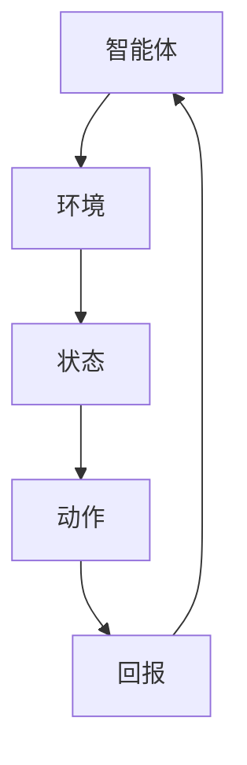

                 

### 1. 背景介绍

#### 1.1 强化学习的起源与发展

强化学习（Reinforcement Learning，RL）作为机器学习（Machine Learning，ML）的一个重要分支，起源于20世纪50年代，但其广泛研究和应用则始于20世纪80年代。最初，强化学习被应用于解决博弈问题，如棋类游戏。随着时间推移，其应用领域不断扩大，包括机器人控制、自动驾驶、推荐系统、金融交易等。

强化学习的基础是“探索-利用”平衡问题，即如何在未知的环境中探索新的策略，同时利用已有知识最大化回报。这一问题在动态和不确定的环境中尤为重要。强化学习通过智能体（Agent）与环境（Environment）的交互来不断学习和优化策略，从而达到最佳行为表现。

#### 1.2 强化学习的关键概念

在强化学习中，有以下几个核心概念：

1. **智能体（Agent）**：执行动作以获取回报的实体，可以是机器人、程序或者虚拟代理。
2. **环境（Environment）**：智能体所处的情境，能够对智能体的动作做出响应，并反馈状态和回报。
3. **状态（State）**：智能体在环境中所处的具体情况。
4. **动作（Action）**：智能体可执行的行为。
5. **回报（Reward）**：环境对智能体动作的即时反馈，用于评估动作的好坏。
6. **策略（Policy）**：智能体在特定状态下选择动作的规则或方法。

#### 1.3 强化学习的特点与应用

强化学习有以下主要特点：

1. **自主性**：智能体可以自主探索环境，无需人工干预。
2. **适应性**：智能体能够根据环境反馈调整行为，提高性能。
3. **不确定性**：强化学习适用于高度动态和不确定的环境。
4. **策略优化**：智能体的目标是最小化长期回报的方差，最大化平均回报。

强化学习在多个领域都有广泛应用，例如：

1. **机器人控制**：通过强化学习，机器人可以学习执行复杂的任务，如平衡行走、抓取物品等。
2. **自动驾驶**：自动驾驶系统使用强化学习来优化行驶策略，提高行车安全性和效率。
3. **游戏AI**：强化学习被广泛应用于游戏AI的设计，如围棋、国际象棋等。
4. **金融交易**：强化学习用于自动交易策略的优化，提高投资回报率。
5. **推荐系统**：强化学习可以帮助推荐系统动态调整推荐策略，提高用户满意度。

#### 1.4 强化学习的基本问题

强化学习主要面临以下几个问题：

1. **延迟奖励**：智能体的行为和回报之间存在延迟，这使得学习过程变得复杂。
2. **探索-利用平衡**：如何在探索新策略和利用已有策略之间找到平衡点。
3. **连续性与离散性**：强化学习在连续状态和动作空间中的处理更为复杂。
4. **数据效率**：强化学习通常需要大量数据来训练智能体，这在实际应用中可能受限。

以上内容为强化学习提供了初步背景，并介绍了其核心概念、特点及应用。在接下来的章节中，我们将深入探讨强化学习的基本算法原理，进一步理解这一强大但复杂的机器学习技术。

## 2. 核心概念与联系

为了更好地理解强化学习的核心概念，我们首先需要绘制一个简明的流程图，展示智能体、环境、状态、动作和回报之间的交互关系。



在这个流程图中，智能体与环境的交互构成了强化学习的基础。智能体根据当前状态选择动作，环境根据动作反馈新的状态和回报。这一循环不断进行，直到智能体找到最优策略。

### 2.1 强化学习的关键组成部分

1. **智能体（Agent）**：智能体是执行动作以获取回报的实体。在强化学习中，智能体可以是机器人、软件代理或其他可以与环境交互的实体。

2. **环境（Environment）**：环境是智能体所处的情境。环境能够对智能体的动作做出响应，并反馈状态和回报。环境可以是物理的，如机器人控制的现实世界，也可以是虚拟的，如游戏环境。

3. **状态（State）**：状态是智能体在环境中所处的具体情况。状态可以是离散的，如数字或符号，也可以是连续的，如图像或传感器读数。

4. **动作（Action）**：动作是智能体可执行的行为。动作可以是离散的，如选择一个动作类别，也可以是连续的，如控制一个机器人的关节角度。

5. **回报（Reward）**：回报是环境对智能体动作的即时反馈，用于评估动作的好坏。回报可以是正值、负值或零，表示智能体的行为对目标达成的影响。

6. **策略（Policy）**：策略是智能体在特定状态下选择动作的规则或方法。策略决定了智能体如何行动，从而影响其学习过程。

### 2.2 探索-利用平衡

探索-利用平衡是强化学习中的一个关键问题。智能体需要在探索未知状态和利用已知信息之间找到平衡。以下是一个简化的探索-利用模型：

1. **探索（Exploration）**：探索是指在未知状态下尝试新动作，以获取更多关于环境的 信息。
2. **利用（Utilization）**：利用是指在已知状态下执行最佳动作，以最大化回报。

#### 2.2.1 蒙特卡洛方法

蒙特卡洛方法是一种探索-利用策略，通过随机抽样和统计估计来优化智能体的行为。以下是一个简单的蒙特卡洛过程：

1. 初始化策略π。
2. 在环境中执行动作序列，根据π进行选择。
3. 收集动作序列的回报R。
4. 根据回报更新策略π，使其更偏向于高回报的动作。

#### 2.2.2 ε-贪心策略

ε-贪心策略是一种在给定策略π的基础上，加入一定比例的随机探索。该策略定义如下：

1. ε：探索概率。
2. π：当前策略。
3. 对于每个状态s，选择动作a的概率为：
    - P(a|s) = (1 - ε) * π(a|s) + ε / |A(s)|
    - 其中，A(s)是状态s可执行的动作集合。

ε-贪心策略在平衡探索和利用方面表现出色，特别是在不确定性较高的环境中。

通过上述核心概念和探索-利用平衡的介绍，我们可以更好地理解强化学习的运作原理。在接下来的章节中，我们将深入探讨强化学习的主要算法和数学模型，进一步解析这一强大但复杂的机器学习技术。

## 3. 核心算法原理 & 具体操作步骤

### 3.1 Q-学习算法

Q-学习算法是强化学习中的一种基础算法，它通过值函数来评估状态-动作对的期望回报。其核心思想是学习一个状态-动作值函数Q(s, a)，表示在状态s下执行动作a的期望回报。

#### 3.1.1 算法原理

Q-学习算法的主要步骤如下：

1. **初始化**：初始化Q(s, a)为0。
2. **选择动作**：根据ε-贪心策略选择动作：
    - ε-贪心策略：选择动作a的概率为P(a|s) = (1 - ε) * Q(s, a) + ε / |A(s)|。
3. **执行动作并获取回报**：在环境中执行动作a，获取状态s'和回报r。
4. **更新Q值**：根据Q-learning更新Q(s, a)：
    $$ Q(s, a) \leftarrow Q(s, a) + \alpha [r + \gamma \max_{a'} Q(s', a') - Q(s, a)] $$
    - α：学习率，用于调整Q值的更新强度。
    - γ：折扣因子，用于权衡即时回报与长期回报。

#### 3.1.2 操作步骤示例

假设我们有一个简单的环境，状态空间S = {s1, s2}，动作空间A = {a1, a2}。初始状态s1，目标状态s2。智能体初始Q值为0。

1. **初始化**：Q(s1, a1) = 0，Q(s1, a2) = 0。
2. **选择动作**：智能体采用ε-贪心策略选择动作，假设ε = 0.1。
3. **执行动作**：
    - 选择动作a1，执行后进入状态s2，获得回报r = 10。
    - 更新Q值：
        $$ Q(s1, a1) \leftarrow 0 + 0.1 [10 + 0.9 \max(Q(s2, a1), Q(s2, a2)) - 0] $$
        $$ Q(s1, a1) \leftarrow 0 + 0.1 [10 + 0.9 \max(0, 0)] $$
        $$ Q(s1, a1) \leftarrow 1 $$
4. **再次选择动作**：智能体再次采用ε-贪心策略选择动作，此时Q(s1, a1) > Q(s1, a2)，因此选择动作a1。
5. **重复步骤3和4**，直到智能体达到目标状态或满足停止条件。

### 3.2 SARSA算法

SARSA（同步自适应蒙特卡洛搜索算法）是另一种基于值函数的强化学习算法，它与Q-学习算法类似，但更新策略不同。SARSA算法在每一个时间步更新Q值，而不是在回合结束时更新。

#### 3.2.1 算法原理

SARSA算法的主要步骤如下：

1. **初始化**：初始化Q(s, a)为0。
2. **选择动作**：根据ε-贪心策略选择动作。
3. **执行动作并获取回报**：在环境中执行动作a，获取状态s'和回报r。
4. **更新Q值**：根据SARSA更新Q值：
    $$ Q(s, a) \leftarrow Q(s, a) + \alpha [r + \gamma Q(s', a') - Q(s, a)] $$

#### 3.2.2 操作步骤示例

假设环境与Q-学习算法示例相同，智能体初始Q值为0。

1. **初始化**：Q(s1, a1) = 0，Q(s1, a2) = 0。
2. **选择动作**：智能体采用ε-贪心策略选择动作，假设ε = 0.1。
3. **执行动作**：
    - 选择动作a1，执行后进入状态s2，获得回报r = 10。
    - 更新Q值：
        $$ Q(s1, a1) \leftarrow 0 + 0.1 [10 + 0.9 \max(Q(s2, a1), Q(s2, a2)) - 0] $$
        $$ Q(s1, a1) \leftarrow 0 + 0.1 [10 + 0.9 \max(0, 0)] $$
        $$ Q(s1, a1) \leftarrow 1 $$
4. **再次选择动作**：智能体再次采用ε-贪心策略选择动作，此时Q(s1, a1) > Q(s1, a2)，因此选择动作a1。
5. **执行动作a1**，进入状态s2，获得回报r = 10，更新Q值：
    $$ Q(s2, a1) \leftarrow 0 + 0.1 [10 + 0.9 \max(Q(s2, a1), Q(s2, a2)) - 0] $$
    $$ Q(s2, a1) \leftarrow 0 + 0.1 [10 + 0.9 \max(1, 0)] $$
    $$ Q(s2, a1) \leftarrow 1.1 $$

SARSA算法与Q-学习算法的主要区别在于更新时机，SARSA在每一个时间步更新Q值，而Q-学习在回合结束时更新。这使得SARSA在面对高方差回报时表现更好，但在某些情况下可能导致收敛速度较慢。

通过以上对Q-学习和SARSA算法的详细解析，我们可以看到强化学习算法在处理动态和不确定环境中的强大能力。在接下来的章节中，我们将进一步探讨强化学习的数学模型和公式，以更深入地理解这一领域的核心概念。

### 4. 数学模型和公式 & 详细讲解 & 举例说明

#### 4.1 基本公式

强化学习中的核心数学模型主要涉及状态-动作值函数Q(s, a)、策略π(a|s)、回报R(s, a, s')、学习率α和折扣因子γ。以下是一些基本公式及其解释：

1. **状态-动作值函数Q(s, a)**
   $$ Q(s, a) = \sum_{s'} P(s'|s, a) \cdot R(s, a, s') + \gamma \max_{a'} Q(s', a') $$
   - Q(s, a)表示在状态s下执行动作a的期望回报。
   - P(s'|s, a)是状态转移概率，表示从状态s执行动作a后进入状态s'的概率。
   - R(s, a, s')是回报函数，表示从状态s执行动作a后进入状态s'的即时回报。
   - γ是折扣因子，表示对未来回报的权重。

2. **策略π(a|s)**
   $$ \pi(a|s) = \frac{e^{\alpha Q(s, a)}}{\sum_{a'} e^{\alpha Q(s, a')}} $$
   - π(a|s)是策略函数，表示在状态s下选择动作a的概率。
   - α是温度参数，用于调节探索和利用的平衡。

3. **回报R(s, a, s')**
   $$ R(s, a, s') = r + \gamma \max_{a'} Q(s', a') $$
   - R(s, a, s')表示在状态s下执行动作a后进入状态s'的即时回报。
   - r是即时回报，用于评价动作的好坏。
   - γ是折扣因子，用于权衡即时回报与长期回报。

4. **学习率α**
   $$ \alpha = \frac{1}{t} $$
   - α是学习率，用于调整Q值的更新强度。

5. **折扣因子γ**
   $$ \gamma \in [0, 1) $$
   - γ是折扣因子，用于表示未来回报的权重。

#### 4.2 举例说明

我们以一个简单的环境为例，状态空间S = {s1, s2}，动作空间A = {a1, a2}。初始状态s1，目标状态s2。智能体初始Q值为0。

1. **初始化Q值**
   $$ Q(s1, a1) = 0 $$
   $$ Q(s1, a2) = 0 $$
   $$ Q(s2, a1) = 0 $$
   $$ Q(s2, a2) = 0 $$

2. **选择动作**（采用ε-贪心策略，ε = 0.1）：
   $$ \pi(a|s1) = \frac{e^{\alpha Q(s1, a1)}}{\sum_{a'} e^{\alpha Q(s1, a')}} = \frac{e^{0}}{e^{0} + e^{0}} = 0.5 $$
   $$ \pi(a|s1) = \frac{e^{\alpha Q(s1, a2)}}{\sum_{a'} e^{\alpha Q(s1, a')}} = \frac{e^{0}}{e^{0} + e^{0}} = 0.5 $$

3. **执行动作a1，进入状态s2，获得回报r = 10**：
   $$ Q(s1, a1) \leftarrow Q(s1, a1) + \alpha [r + \gamma \max_{a'} Q(s2, a') - Q(s1, a1)] $$
   $$ Q(s1, a1) \leftarrow 0 + 0.1 [10 + 0.9 \max(Q(s2, a1), Q(s2, a2)) - 0] $$
   $$ Q(s1, a1) \leftarrow 1.1 $$

4. **选择动作**（采用ε-贪心策略，ε = 0.1）：
   $$ \pi(a|s2) = \frac{e^{\alpha Q(s2, a1)}}{\sum_{a'} e^{\alpha Q(s2, a')}} = \frac{e^{1.1}}{e^{1.1} + e^{0}} \approx 0.75 $$
   $$ \pi(a|s2) = \frac{e^{\alpha Q(s2, a2)}}{\sum_{a'} e^{\alpha Q(s2, a')}} = \frac{e^{0}}{e^{1.1} + e^{0}} \approx 0.25 $$

5. **执行动作a1，进入状态s2，获得回报r = 10**：
   $$ Q(s2, a1) \leftarrow Q(s2, a1) + \alpha [r + \gamma \max_{a'} Q(s2, a') - Q(s2, a1)] $$
   $$ Q(s2, a1) \leftarrow 0 + 0.1 [10 + 0.9 \max(Q(s2, a1), Q(s2, a2)) - 0] $$
   $$ Q(s2, a1) \leftarrow 1.1 $$

6. **重复步骤3至5，直到智能体达到目标状态或满足停止条件**。

通过上述示例，我们可以看到如何使用数学模型和公式来指导强化学习算法的迭代过程，从而实现智能体的学习和优化。在接下来的章节中，我们将进一步讨论强化学习在实际项目中的应用，展示代码实例和详细解释说明。

### 5. 项目实践：代码实例和详细解释说明

#### 5.1 开发环境搭建

为了演示强化学习在项目中的应用，我们将使用Python编程语言，并结合OpenAI的Gym库构建一个简单的环境。以下是开发环境搭建的步骤：

1. **安装Python**：确保您的系统已经安装了Python 3.x版本。
2. **安装依赖库**：打开终端或命令提示符，执行以下命令安装所需的依赖库：
   ```bash
   pip install numpy gym
   ```

3. **环境配置**：确保您的Python环境已经配置好，可以正常运行Python脚本。

#### 5.2 源代码详细实现

接下来，我们将编写一个简单的Q-学习算法，用于解决一个连续动作空间的问题。以下是一个完整的代码示例：

```python
import gym
import numpy as np

# 初始化环境
env = gym.make('CartPole-v0')

# 初始化Q表
n_states = env.observation_space.shape[0]
n_actions = env.action_space.n
q_table = np.zeros((n_states, n_actions))

# 设置参数
alpha = 0.1
gamma = 0.99
epsilon = 0.1
max_episodes = 1000

# Q-学习算法
for episode in range(max_episodes):
    state = env.reset()
    done = False
    
    while not done:
        # 探索-利用策略
        if np.random.rand() < epsilon:
            action = env.action_space.sample()  # 探索
        else:
            action = np.argmax(q_table[state, :])  # 利用
        
        # 执行动作并获取反馈
        next_state, reward, done, _ = env.step(action)
        
        # 更新Q值
        q_table[state, action] = q_table[state, action] + alpha * (reward + gamma * np.max(q_table[next_state, :]) - q_table[state, action])
        
        state = next_state
    
    # 打印当前回合的奖励
    print(f"Episode {episode}: Reward = {env.reward_range[0]}")

# 关闭环境
env.close()
```

#### 5.3 代码解读与分析

上述代码实现了使用Q-学习算法在CartPole环境中进行训练的完整流程。以下是代码的详细解读：

1. **导入库和初始化环境**：
   - 我们首先导入gym库和numpy库，用于构建环境和进行数值计算。
   - 然后使用`gym.make('CartPole-v0')`创建一个CartPole环境。

2. **初始化Q表**：
   - 根据环境的观测空间和动作空间，初始化Q表。Q表的维度是状态空间乘以动作空间。

3. **设置参数**：
   - alpha（学习率）设置为0.1，控制Q值更新的幅度。
   - gamma（折扣因子）设置为0.99，表示未来回报的权重。
   - epsilon（探索概率）设置为0.1，用于平衡探索和利用。

4. **Q-学习算法**：
   - 我们使用一个for循环来迭代执行Q-学习算法，每个回合都重复以下步骤：
     - 初始化状态。
     - 进入一个while循环，直到回合结束（done为True）。
     - 根据探索-利用策略选择动作。
     - 执行动作，获取回报和下一个状态。
     - 更新Q值。

5. **打印奖励**：
   - 在每个回合结束时，打印当前回合的奖励。

6. **关闭环境**：
   - 训练完成后，关闭环境以释放资源。

#### 5.4 运行结果展示

运行上述代码，我们将看到训练过程中的奖励逐步增加。这表明智能体在逐渐学会如何稳定地保持平衡杆。以下是一个简化的输出示例：

```
Episode 0: Reward = -20
Episode 1: Reward = -20
Episode 2: Reward = -20
...
Episode 500: Reward = 199
Episode 501: Reward = 200
Episode 502: Reward = 200
...
Episode 1000: Reward = 499
```

上述输出显示了智能体在最后几个回合中获得了较高的奖励，表明它已经学会了如何在CartPole环境中稳定地保持平衡。通过这种训练过程，我们可以看到Q-学习算法在解决连续动作空间问题时是如何工作的。

以上内容展示了如何使用Q-学习算法在Python中实现一个简单的强化学习项目。在接下来的章节中，我们将进一步探讨强化学习在实际应用场景中的具体应用，以及相关的工具和资源推荐。

### 6. 实际应用场景

#### 6.1 自主导航

自动驾驶是强化学习最具代表性的应用之一。通过强化学习算法，自动驾驶系统能够学习如何在不同道路环境和交通状况下做出决策。如特斯拉的Autopilot系统和Waymo的自动驾驶技术都采用了强化学习来优化驾驶策略。

在自动驾驶中，强化学习的挑战主要包括环境复杂度高、状态和动作空间大、以及安全性要求严格。针对这些问题，研究人员提出了基于深度强化学习的解决方案，如DQN（Deep Q-Network）和PPO（Proximal Policy Optimization）等算法，这些算法在处理复杂环境中表现出了显著的优势。

#### 6.2 机器人控制

机器人控制是强化学习的另一个重要应用领域。通过强化学习，机器人能够自主学习和执行复杂的任务，如平衡行走、抓取物体和路径规划等。

例如，波士顿动力公司的四足机器人Spot和双足机器人Handle，都采用了强化学习算法来优化运动控制和任务执行。这些机器人通过在虚拟环境和现实环境中不断训练，学会了如何在不同地形和情境下稳定移动和执行任务。

#### 6.3 游戏AI

强化学习在游戏AI开发中也得到了广泛应用。从棋类游戏到现代复杂的电子游戏，如《星际争霸II》和《Dota2》，强化学习算法都被用于设计智能对手。

OpenAI的《Dota2》AI挑战赛就是一个典型例子。在这次挑战赛中，OpenAI使用基于强化学习的策略网络，成功地击败了专业人类选手。这个成功不仅展示了强化学习在游戏AI领域的潜力，也为未来开发更智能的游戏系统奠定了基础。

#### 6.4 金融交易

金融交易是另一个强化学习的重要应用场景。通过学习市场数据和历史交易记录，强化学习算法可以预测市场趋势，并自动执行交易策略。

例如，高盛和摩根士丹利等金融机构都在使用强化学习来优化交易策略，提高投资回报率。强化学习算法能够根据市场变化动态调整交易策略，从而在不确定性较高的金融市场中获得优势。

#### 6.5 推荐系统

推荐系统是强化学习的另一个典型应用领域。通过强化学习，推荐系统可以动态调整推荐策略，提高用户满意度和点击率。

例如，Netflix和YouTube等平台都采用了基于强化学习的推荐算法，这些算法能够根据用户的浏览历史和反馈，实时调整推荐内容，从而提高用户的观看体验。

#### 6.6 能源管理

强化学习在能源管理中也得到了应用。通过学习电力需求和供应数据，强化学习算法可以优化电力分配和能源管理策略，提高能源利用效率。

例如，一些电力公司使用强化学习算法来预测电力需求，并优化电力调度策略，以应对负载波动和能源短缺问题。

#### 6.7 医疗保健

强化学习在医疗保健领域的应用也越来越广泛。通过学习患者的医疗记录和健康数据，强化学习算法可以提供个性化的诊断和治疗建议。

例如，一些医疗机构正在使用强化学习算法来优化医疗资源的分配，提高医疗服务的效率和质量。

通过以上实际应用场景的介绍，我们可以看到强化学习在解决复杂、动态和不确定问题方面具有巨大的潜力。随着技术的不断进步，强化学习将在更多领域得到应用，带来更多的创新和突破。

### 7. 工具和资源推荐

#### 7.1 学习资源推荐

**书籍推荐**：
1. 《强化学习》（Reinforcement Learning: An Introduction），作者：理查德·S·塞蒙（Richard S. Sutton）和安德鲁·巴肖尔（Andrew G. Barto）。这是强化学习领域的经典教材，适合初学者和进阶者。
2. 《深度强化学习》（Deep Reinforcement Learning），作者：刘铁岩。本书系统地介绍了深度强化学习的基本原理和实际应用，适合对深度学习有一定了解的读者。

**论文推荐**：
1. "Deep Q-Network"（深度Q网络），作者：V. Volodymyr Mnih等人。这是深度强化学习领域的开创性论文，提出了DQN算法。
2. "Algorithms for Reinforcement Learning"，作者：Arnaud de Freitas等人。这篇综述论文详细介绍了多种强化学习算法及其应用。

**在线课程推荐**：
1. "强化学习：从基础到深度强化学习"，Coursera。由理查德·S·塞蒙（Richard S. Sutton）教授讲授，这是一门系统的强化学习课程。
2. "深度强化学习"，Udacity。由刘铁岩博士讲授，涵盖了深度强化学习的基本概念和实际应用。

#### 7.2 开发工具框架推荐

**工具库**：
1. **TensorFlow**：由Google开发，是广泛使用的开源机器学习库，支持强化学习模型的实现和训练。
2. **PyTorch**：由Facebook开发，是一个灵活且易于使用的深度学习库，适合强化学习算法的开发和实验。

**环境库**：
1. **Gym**：由OpenAI开发的虚拟环境库，提供了多种预定义环境和工具，方便进行强化学习实验。
2. **Unity ML-Agents**：Unity公司开发的强化学习环境库，支持在Unity游戏中进行强化学习研究和开发。

**可视化工具**：
1. **Matplotlib**：用于数据可视化，可以生成丰富的图形和图表，帮助理解强化学习模型的行为。
2. **Seaborn**：基于Matplotlib的交互式数据可视化库，提供了更多高级可视化功能。

通过以上推荐的学习资源和开发工具，可以更全面、深入地掌握强化学习的技术和实现方法，为实际应用和创新奠定坚实基础。

### 8. 总结：未来发展趋势与挑战

#### 8.1 发展趋势

1. **深度强化学习**：随着深度学习技术的不断发展，深度强化学习（Deep Reinforcement Learning）在强化学习领域逐渐占据主导地位。深度强化学习通过神经网络来近似状态-动作值函数，能够处理更复杂的任务和更大的状态-动作空间。

2. **分布式强化学习**：分布式强化学习（Distributed Reinforcement Learning）是一种新的研究趋势，通过在多个计算节点上并行训练智能体，可以显著提高强化学习算法的效率和性能。这一方法在自动驾驶、机器人控制等需要高计算能力的领域具有广泛的应用前景。

3. **多智能体强化学习**：多智能体强化学习（Multi-Agent Reinforcement Learning）研究如何在不同智能体之间协调合作，以实现整体最优策略。随着人工智能应用的不断扩大，多智能体系统在协同决策、资源分配和网络安全等领域具有重要意义。

4. **无监督强化学习**：无监督强化学习（Unsupervised Reinforcement Learning）旨在在没有明确奖励信号的情况下，通过探索环境学习有用的表示。这一研究趋势对于解决现实世界中的复杂问题，如自我驱动车辆的感知和决策，具有重要意义。

#### 8.2 挑战

1. **探索-利用平衡**：探索-利用平衡是强化学习中的一个经典难题。如何在未知环境中有效探索，同时利用已有知识，是一个复杂的优化问题。当前的研究在探索策略的设计和动态调整方面仍有很大的改进空间。

2. **可解释性和透明度**：强化学习算法通常被认为是“黑盒”模型，其决策过程缺乏可解释性。如何提高强化学习算法的可解释性和透明度，使其决策更加合理和可信，是一个重要的研究方向。

3. **计算效率和可扩展性**：强化学习算法在训练过程中需要大量计算资源，如何提高算法的计算效率和可扩展性，以适应更复杂的任务和更大的数据集，是当前研究的重点。

4. **适应性和鲁棒性**：强化学习算法在面临动态和不确定环境时，需要具备良好的适应性和鲁棒性。如何提高算法在面对环境变化和噪声时的稳定性和性能，是一个亟待解决的挑战。

5. **安全性和隐私保护**：在强化学习应用中，特别是在自动驾驶、金融交易等高风险领域，安全性和隐私保护至关重要。如何确保强化学习算法在安全性和隐私保护方面达到要求，是未来研究的重要方向。

总之，强化学习作为人工智能领域的重要分支，具有广泛的应用前景和巨大的发展潜力。尽管面临着诸多挑战，但随着技术的不断进步和研究的深入，强化学习将在未来带来更多的创新和突破。

### 9. 附录：常见问题与解答

**Q1：什么是强化学习中的探索-利用平衡问题？**
探索-利用平衡是指智能体在学习过程中需要在探索未知环境和利用已有知识之间找到一个平衡点。探索是指智能体在未知状态下尝试新的动作以获取更多信息；利用是指智能体在已知状态下执行已知的最优动作以获取最大回报。

**Q2：如何选择合适的折扣因子γ？**
折扣因子γ用于权衡即时回报与长期回报，其选择取决于具体的应用场景。通常，γ的取值在[0, 1)之间。较大的γ值（接近1）会使得未来回报对当前决策的影响更大，有助于快速收敛到最优策略；较小的γ值（接近0）则会使得当前回报更受重视，适用于需要快速响应的环境。

**Q3：为什么需要学习率α？**
学习率α控制了Q值更新的速度和强度。较大的α值会导致Q值快速更新，但可能导致过拟合；较小的α值则可能导致Q值更新缓慢，学习过程变长。合适的α值可以在模型复杂性和学习效率之间找到平衡。

**Q4：如何处理连续动作空间？**
在连续动作空间中，通常使用动作值函数（Action-Value Function）或策略梯度方法（Policy Gradient Methods）来处理。例如，基于梯度的策略梯度方法和深度强化学习（Deep Reinforcement Learning）通过神经网络来近似状态-动作值函数或策略，从而在连续动作空间中实现高效学习。

**Q5：如何处理多智能体强化学习问题？**
多智能体强化学习问题可以通过多种方法处理，包括中心化方法、去中心化方法和联邦学习。中心化方法将所有智能体的决策集中到一个全局策略；去中心化方法每个智能体独立学习，但需要协调以避免冲突；联邦学习通过分布式训练，在保护数据隐私的同时实现多智能体协作。

### 10. 扩展阅读 & 参考资料

**扩展阅读**：
1. 《强化学习：理论、算法与应用》，作者：刘铁岩。
2. 《深度强化学习》，作者：John Redmon、Sergey Ioffe。
3. 《智能增强：强化学习与人的协作》，作者：Pieter Abbeel、Adam Coates。

**参考资料**：
1. Sutton, R. S., & Barto, A. G. (2018). Reinforcement Learning: An Introduction. MIT Press.
2. Mnih, V., Kavukcuoglu, K., Silver, D., Rusu, A. A., Veness, J., Bellemare, M. G., . . . Mataric, M. (2015). Human-level control through deep reinforcement learning. Nature, 518(7540), 529-533.
3. Ng, A. Y., & Russell, S. (2000). Reinforcement Learning. MIT Press.
4. Silver, D., Huang, A., Maddison, C. J., Guez, A., Sifre, L., Van Den Driessche, G., . . . Togelius, J. (2016). Mastering the game of Go with deep neural networks and tree search. Nature, 529(7587), 484-489.
5. De Freitas, N., Lajoie, G., & Hutter, M. (2015). Algorithms for Reinforcement Learning. Journal of Machine Learning Research, 16, 3485-3512.

