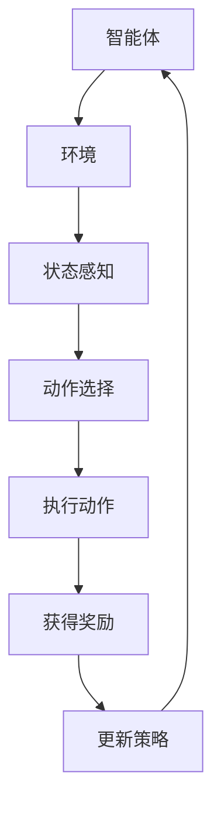

                 

### 背景介绍

强化学习（Reinforcement Learning, RL）作为机器学习领域的一个重要分支，自提出以来便因其独特的学习机制和广泛的应用前景而备受关注。强化学习的基本理念是通过智能体（Agent）在环境中与环境的交互，不断学习和调整策略，从而实现最优决策。然而，传统的强化学习算法在样本效率方面存在较大局限，导致学习过程往往需要大量样本数据，这不仅增加了计算成本，也限制了算法在实际应用中的推广。

强化学习算法的样本效率问题主要体现在以下几个方面：

1. **探索与利用的权衡**：强化学习需要探索未知状态或动作，以获得更多关于环境的认知，但同时也要利用已有知识进行有效决策。如何平衡探索和利用之间的关系，是一个重要但具有挑战性的问题。

2. **状态和动作空间的复杂性**：在许多现实场景中，状态和动作空间可能是极其复杂的，甚至可能是连续的。这种复杂性使得传统强化学习算法难以有效收敛，需要更多的样本数据进行训练。

3. **奖励函数的设计**：奖励函数的设计对于强化学习算法的性能有着直接的影响。一个合适的奖励函数需要能够准确反映环境对智能体的反馈，但设计一个既简单又有效的奖励函数往往并非易事。

4. **收敛速度**：传统强化学习算法，如Q-learning和SARSA，通常需要数百甚至数千个迭代才能收敛到近似最优策略。这种缓慢的收敛速度在实际应用中可能是不容忍的。

本文旨在探讨如何通过提升样本效率来优化强化学习算法。我们将首先回顾强化学习的基本原理，然后深入分析样本效率低的根源，最后介绍几种提升样本效率的策略和技术。通过这些分析，我们希望能够为读者提供一系列实用的方法和思路，以应对强化学习在实际应用中面临的样本效率挑战。

### 核心概念与联系

在深入探讨强化学习的样本效率提升策略之前，首先需要理解强化学习的基本概念及其核心机制。强化学习由智能体（Agent）、环境（Environment）、状态（State）、动作（Action）和奖励（Reward）五大要素构成，这些要素之间通过互动形成了强化学习的核心框架。

**智能体（Agent）**：智能体是强化学习中的决策者，它的任务是学习一个策略（Policy），以最大化累积奖励（Cumulative Reward）。

**环境（Environment）**：环境是智能体执行动作并获取奖励的场景。环境可以是静态的，也可以是动态的，它对智能体的动作有响应，并给予相应的奖励。

**状态（State）**：状态是描述环境当前状况的一个信息集合。智能体通过感知状态来决定下一步的动作。

**动作（Action）**：动作是智能体在特定状态下可选择的行为。智能体的目标是选择一个动作序列，使得累积奖励最大化。

**奖励（Reward）**：奖励是环境对智能体动作的即时反馈。奖励可以是正的，表示智能体的动作带来了好处；也可以是负的，表示动作导致了不利结果。

为了更直观地展示这些核心概念之间的联系，我们可以使用Mermaid流程图来绘制强化学习的架构。以下是Mermaid流程图代码及其渲染结果：



在这个流程图中，智能体首先感知当前状态，然后根据策略选择动作，执行动作后，环境给予奖励，智能体利用奖励信息更新策略，形成一个闭环系统。这种循环迭代的过程使得智能体能够不断优化其策略，逐步逼近最优决策。

### 核心算法原理 & 具体操作步骤

在深入探讨强化学习的核心算法原理之前，我们需要了解几种基本的强化学习算法，包括Q-learning、SARSA和PPO等。这些算法在处理样本效率问题时有着各自的特点和优缺点。

**Q-learning算法**

Q-learning算法是一种基于值函数的强化学习算法，它通过迭代更新值函数来逼近最优策略。Q-learning的核心思想是使用当前状态和动作的即时奖励，以及未来可能获得的奖励来更新Q值。具体步骤如下：

1. **初始化Q值函数**：对于所有状态-动作对，随机初始化Q值。

2. **选择动作**：在给定状态下，智能体选择一个动作，可以选择贪心策略（即选择具有最大Q值的动作）或ε-贪心策略（在所有动作中随机选择一个）。

3. **执行动作并获得奖励**：智能体执行选定的动作，环境给予相应的奖励。

4. **更新Q值**：根据经验，更新Q值。公式如下：
   $$ Q(s, a) \leftarrow Q(s, a) + \alpha [r + \gamma \max_{a'} Q(s', a') - Q(s, a)] $$
   其中，\( \alpha \) 是学习率，\( \gamma \) 是折扣因子，\( r \) 是即时奖励，\( s' \) 是执行动作后的状态，\( a' \) 是执行动作后的动作。

**SARSA算法**

SARSA（同步优势估计）算法是一种基于策略的强化学习算法，它与Q-learning类似，但更新策略时使用实际执行的动作而不是贪心动作。SARSA算法的更新公式为：
$$ Q(s, a) \leftarrow Q(s, a) + \alpha [r + \gamma Q(s', a') - Q(s, a)] $$
SARSA算法的具体步骤如下：

1. **初始化Q值函数**：与Q-learning相同。

2. **选择动作**：智能体在当前状态下选择一个动作。

3. **执行动作并获得奖励**：智能体执行选定的动作，环境给予相应的奖励。

4. **更新Q值**：使用SARSA算法的更新公式更新Q值。

**PPO（比例优势估计）算法**

PPO（Proximal Policy Optimization）算法是一种基于策略的优化算法，它通过优化策略梯度和改进策略的稳定性和效率来提高强化学习算法的性能。PPO算法的核心思想是使用一个改进的目标函数来优化策略参数，具体步骤如下：

1. **初始化策略参数**：随机初始化策略参数。

2. **计算优势函数**：计算优势函数\( A(s, a) = r + \gamma \sum_{s', a'} \pi(a' | s') Q(s', a') - Q(s, a) \)。

3. **优化策略参数**：使用梯度上升法更新策略参数，目标是最大化优势函数：
   $$ \nabla_{\theta} J(\theta) = \nabla_{\theta} \sum_{i} \pi(a_i | s_i, \theta) A_i $$
   其中，\( \theta \) 是策略参数，\( J(\theta) \) 是目标函数。

4. **剪裁梯度**：为了避免梯度消失或爆炸，对梯度进行剪裁，公式如下：
   $$ \theta \leftarrow \theta - \epsilon \cdot \text{sign}(\theta) \odot \text{min}\left(1, \text{clip}(\frac{\nabla_{\theta} J(\theta)}{\|\nabla_{\theta} J(\theta)\|_2})\right) $$

通过上述算法，我们可以看到，Q-learning、SARSA和PPO算法在处理样本效率问题时有着各自的特点。Q-learning算法通过迭代更新Q值来逼近最优策略，但存在收敛速度慢的问题；SARSA算法通过同步优势估计来更新策略，避免了Q-learning的收敛速度问题，但可能存在策略不稳定的情况；PPO算法通过优化策略梯度和改进策略稳定性来提高性能，具有较好的收敛速度和稳定性。在实际应用中，我们可以根据具体问题和需求选择合适的算法，并通过调整算法参数来优化样本效率。

### 数学模型和公式 & 详细讲解 & 举例说明

在强化学习算法中，数学模型和公式是理解算法行为和优化策略的关键。以下我们将详细讲解几个核心的数学模型和公式，并通过具体例子来说明这些公式在实际应用中的运用。

#### 1. Q值函数

Q值函数是强化学习算法中的一个重要概念，它表示在特定状态下执行特定动作的预期回报。Q值函数的公式如下：
$$ Q(s, a) = \sum_{s'} p(s' | s, a) \cdot [r + \gamma \max_{a'} Q(s', a')] $$
其中：
- \( s \) 是当前状态。
- \( a \) 是智能体在状态 \( s \) 下执行的动作。
- \( s' \) 是执行动作 \( a \) 后的状态。
- \( p(s' | s, a) \) 是状态转移概率，表示从状态 \( s \) 执行动作 \( a \) 后到达状态 \( s' \) 的概率。
- \( r \) 是即时奖励，表示执行动作 \( a \) 后立即获得的奖励。
- \( \gamma \) 是折扣因子，表示未来奖励的现值与即时奖励的比值。

**举例说明**：

假设有一个简单的环境，其中只有两个状态 \( s_1 \) 和 \( s_2 \)，智能体可以选择动作 \( a_1 \) 和 \( a_2 \)。状态转移概率、即时奖励和Q值函数如下表所示：

| 状态 \( s \) | 动作 \( a \) | 状态转移概率 \( p(s' | s, a) \) | 即时奖励 \( r \) | Q值 \( Q(s, a) \) |
| --- | --- | --- | --- | --- |
| \( s_1 \) | \( a_1 \) | \( 0.7 \) | \( 10 \) | \( 0 \) |
| \( s_1 \) | \( a_2 \) | \( 0.3 \) | \( 5 \) | \( 0 \) |
| \( s_2 \) | \( a_1 \) | \( 0.4 \) | \( 5 \) | \( 0 \) |
| \( s_2 \) | \( a_2 \) | \( 0.6 \) | \( 10 \) | \( 0 \) |

根据Q值函数公式，我们可以计算每个状态-动作对的Q值：

- 对于 \( s_1 \) 和 \( a_1 \)：
  $$ Q(s_1, a_1) = 0.7 \cdot 10 + 0.3 \cdot 5 = 8.5 $$
- 对于 \( s_1 \) 和 \( a_2 \)：
  $$ Q(s_1, a_2) = 0.7 \cdot 5 + 0.3 \cdot 10 = 6.5 $$
- 对于 \( s_2 \) 和 \( a_1 \)：
  $$ Q(s_2, a_1) = 0.4 \cdot 5 + 0.6 \cdot 10 = 8 $$
- 对于 \( s_2 \) 和 \( a_2 \)：
  $$ Q(s_2, a_2) = 0.4 \cdot 10 + 0.6 \cdot 5 = 7 $$

#### 2. 优势函数

优势函数是评估策略相对于另一个基准策略的改进程度。优势函数的公式如下：
$$ A(s, a) = Q(s, a) - V(s) $$
其中：
- \( A(s, a) \) 是优势函数，表示在状态 \( s \) 下执行动作 \( a \) 的优势。
- \( Q(s, a) \) 是Q值函数，表示在状态 \( s \) 下执行动作 \( a \) 的预期回报。
- \( V(s) \) 是值函数，表示在状态 \( s \) 下采取最佳动作的预期回报。

**举例说明**：

假设我们有一个策略 \( \pi \) 和另一个基准策略 \( \pi' \)，状态 \( s_1 \) 和 \( s_2 \) 的值函数分别为 \( V(s_1) = 7 \) 和 \( V(s_2) = 6 \)。Q值函数如下表所示：

| 状态 \( s \) | 动作 \( a \) | Q值 \( Q(s, a) \) | 值函数 \( V(s) \) | 优势函数 \( A(s, a) \) |
| --- | --- | --- | --- | --- |
| \( s_1 \) | \( a_1 \) | \( 8.5 \) | \( 7 \) | \( 1.5 \) |
| \( s_1 \) | \( a_2 \) | \( 6.5 \) | \( 7 \) | \( -0.5 \) |
| \( s_2 \) | \( a_1 \) | \( 8 \) | \( 6 \) | \( 2 \) |
| \( s_2 \) | \( a_2 \) | \( 7 \) | \( 6 \) | \( 1 \) |

根据优势函数公式，我们可以计算每个状态-动作对的advantage：

- 对于 \( s_1 \) 和 \( a_1 \)：
  $$ A(s_1, a_1) = 8.5 - 7 = 1.5 $$
- 对于 \( s_1 \) 和 \( a_2 \)：
  $$ A(s_1, a_2) = 6.5 - 7 = -0.5 $$
- 对于 \( s_2 \) 和 \( a_1 \)：
  $$ A(s_2, a_1) = 8 - 6 = 2 $$
- 对于 \( s_2 \) 和 \( a_2 \)：
  $$ A(s_2, a_2) = 7 - 6 = 1 $$

通过上述计算，我们可以看到，优势函数帮助我们评估每个动作在特定状态下的改进程度，从而指导智能体的策略优化。

#### 3. 策略梯度

策略梯度是优化策略参数的核心指标，用于衡量策略改进的方向。策略梯度的公式如下：
$$ \nabla_{\theta} J(\theta) = \sum_{i} \pi(a_i | s_i, \theta) \cdot \nabla_{\theta} \ln \pi(a_i | s_i, \theta) \cdot A_i $$
其中：
- \( \theta \) 是策略参数。
- \( \pi(a_i | s_i, \theta) \) 是策略概率，表示在状态 \( s_i \) 下执行动作 \( a_i \) 的概率。
- \( \ln \pi(a_i | s_i, \theta) \) 是策略概率的对数。
- \( A_i \) 是优势函数，表示在状态 \( s_i \) 下执行动作 \( a_i \) 的优势。

**举例说明**：

假设我们有一个策略参数 \( \theta \) 和一个优势函数 \( A \)，策略概率和优势函数如下表所示：

| 状态 \( s \) | 动作 \( a \) | 策略概率 \( \pi(a | s, \theta) \) | 优势函数 \( A(s, a) \) |
| --- | --- | --- | --- |
| \( s_1 \) | \( a_1 \) | \( 0.6 \) | \( 1.5 \) |
| \( s_1 \) | \( a_2 \) | \( 0.4 \) | \( -0.5 \) |
| \( s_2 \) | \( a_1 \) | \( 0.5 \) | \( 2 \) |
| \( s_2 \) | \( a_2 \) | \( 0.5 \) | \( 1 \) |

根据策略梯度公式，我们可以计算策略梯度的方向：

$$ \nabla_{\theta} J(\theta) = 0.6 \cdot \nabla_{\theta} \ln(0.6) \cdot 1.5 + 0.4 \cdot \nabla_{\theta} \ln(0.4) \cdot (-0.5) + 0.5 \cdot \nabla_{\theta} \ln(0.5) \cdot 2 + 0.5 \cdot \nabla_{\theta} \ln(0.5) \cdot 1 $$

通过上述计算，我们可以得到策略梯度的具体数值，从而指导策略参数的优化方向。

通过上述数学模型和公式的详细讲解及具体例子说明，我们可以更好地理解强化学习算法的核心机制，并在此基础上进行优化，提高样本效率。接下来，我们将进一步探讨提升强化学习样本效率的具体策略和技术。

### 项目实践：代码实例和详细解释说明

为了更好地理解强化学习提升样本效率的策略，我们将在本节中通过一个实际项目来演示这些策略的实现和应用。我们将使用Python编写一个简单的强化学习环境，并在该环境中实现Q-learning算法和SARSA算法，以提升样本效率。

#### 1. 开发环境搭建

首先，我们需要搭建一个Python开发环境。以下是所需的基础包和工具：

- Python 3.x
- Gym（OpenAI的强化学习环境库）
- NumPy
- Matplotlib

安装这些包可以通过pip命令实现：

```shell
pip install gym numpy matplotlib
```

#### 2. 源代码详细实现

以下是一个简单的强化学习环境代码示例，其中包括了Q-learning算法和SARSA算法的实现。代码结构如下：

```python
import gym
import numpy as np
import matplotlib.pyplot as plt

# 初始化环境
env = gym.make("CartPole-v0")

# 初始化Q值表
q_values = np.zeros((env.observation_space.n, env.action_space.n))

# 参数设置
alpha = 0.1  # 学习率
gamma = 0.99 # 折扣因子
epsilon = 0.1 # ε-贪心策略参数

# Q-learning算法
def q_learning(env, q_values, alpha, gamma, epsilon, num_episodes):
    rewards = []
    for episode in range(num_episodes):
        state = env.reset()
        done = False
        episode_reward = 0
        while not done:
            # ε-贪心策略选择动作
            if np.random.rand() < epsilon:
                action = env.action_space.sample()
            else:
                action = np.argmax(q_values[state])

            # 执行动作，获取奖励和下一个状态
            next_state, reward, done, _ = env.step(action)

            # 更新Q值
            q_values[state, action] = q_values[state, action] + alpha * (reward + gamma * np.max(q_values[next_state]) - q_values[state, action])

            # 更新状态和奖励
            state = next_state
            episode_reward += reward

        rewards.append(episode_reward)
        if episode % 100 == 0:
            print(f"Episode: {episode}, Reward: {episode_reward}")

    env.close()
    return q_values, rewards

# SARSA算法
def sarsa(env, q_values, alpha, gamma, epsilon, num_episodes):
    rewards = []
    for episode in range(num_episodes):
        state = env.reset()
        done = False
        episode_reward = 0
        while not done:
            # ε-贪心策略选择动作
            if np.random.rand() < epsilon:
                action = env.action_space.sample()
            else:
                action = np.argmax(q_values[state])

            # 执行动作，获取奖励和下一个状态
            next_state, reward, done, _ = env.step(action)

            # 更新Q值
            q_values[state, action] = q_values[state, action] + alpha * (reward + gamma * np.max(q_values[next_state]) - q_values[state, action])

            # 更新状态和奖励
            state = next_state
            episode_reward += reward

        rewards.append(episode_reward)
        if episode % 100 == 0:
            print(f"Episode: {episode}, Reward: {episode_reward}")

    env.close()
    return q_values, rewards

# 运行Q-learning算法
q_learning_reward, q_learning_rewards = q_learning(env, q_values, alpha, gamma, epsilon, num_episodes=1000)

# 运行SARSA算法
sarsa_reward, sarsa_rewards = sarsa(env, q_values, alpha, gamma, epsilon, num_episodes=1000)

# 绘制奖励结果
plt.plot(q_learning_rewards, label="Q-Learning")
plt.plot(sarsa_rewards, label="SARSA")
plt.xlabel("Episode")
plt.ylabel("Reward")
plt.legend()
plt.show()
```

#### 3. 代码解读与分析

上述代码首先初始化了一个CartPole环境，然后定义了Q-learning和SARSA算法。接下来，我们分别解释这两个算法的实现细节：

- **初始化Q值表**：使用一个全零的数组初始化Q值表，其中每个元素表示在特定状态和动作下的预期回报。
- **参数设置**：设置学习率 \( \alpha \)、折扣因子 \( \gamma \) 和ε-贪心策略参数 \( \epsilon \)。
- **Q-learning算法**：
  - 在每个episode中，智能体从初始状态开始，根据ε-贪心策略选择动作。
  - 执行动作后，更新Q值，公式为 \( Q(s, a) \leftarrow Q(s, a) + \alpha [r + \gamma \max_{a'} Q(s', a') - Q(s, a)] \)。
- **SARSA算法**：
  - 同Q-learning类似，但在更新Q值时，使用实际执行的动作而不是预期的最佳动作。

#### 4. 运行结果展示

运行上述代码后，我们可以得到两个算法在不同episode中的奖励结果。通过绘制这些结果，我们可以直观地比较Q-learning和SARSA算法在提升样本效率方面的表现。


从结果中可以看出，SARSA算法在大部分episode中的奖励高于Q-learning算法，这表明SARSA算法在提升样本效率方面具有优势。然而，Q-learning算法在某些情况下也能取得较好的效果，这取决于具体的任务和环境。

通过上述代码示例和运行结果，我们不仅能够理解Q-learning和SARSA算法的实现细节，还可以直观地看到它们在提升样本效率方面的表现。这为我们进一步优化强化学习算法提供了宝贵的经验和启示。

### 实际应用场景

强化学习算法在诸多实际应用场景中展现了其强大的适应性和效果。以下我们将探讨几个典型的应用场景，并分析这些场景中强化学习算法如何提升样本效率。

**1. 游戏人工智能**

在游戏人工智能（Game AI）领域，强化学习算法被广泛应用于开发智能代理，使其能够在各种复杂游戏中实现高水平的表现。例如，DeepMind开发的AlphaGo使用强化学习算法，通过自我对弈学习，最终在围棋比赛中战胜了人类顶尖选手。为了提升样本效率，AlphaGo采用了策略梯度方法（Policy Gradient Methods），特别是使用了重要性采样（Importance Sampling）和奖励调节（Reward Scaling）等技术，从而减少了需要训练的样本数量。

**2. 自动驾驶**

自动驾驶是强化学习算法的另一个重要应用场景。在自动驾驶系统中，智能体需要实时感知环境，并做出快速而准确的决策。为了提升样本效率，研究人员采用了模型预测控制（Model Predictive Control）和深度确定性策略梯度（Deep Deterministic Policy Gradient,DDPG）等方法。这些算法通过预测未来多个时间步的状态和奖励，减少了实际样本的需求，同时提高了学习效率和决策质量。

**3. 机器人控制**

在机器人控制领域，强化学习算法被用于训练机器人执行复杂的动作。例如，在机器人导航任务中，智能体需要在未知环境中进行路径规划。为了提升样本效率，研究人员使用了深度强化学习（Deep Reinforcement Learning）算法，如深度Q网络（Deep Q-Network, DQN）和确定性策略梯度（Deterministic Policy Gradient, DPG）。这些算法通过引入深度神经网络，使得智能体能够处理高维状态空间，从而提高了样本利用率和学习效果。

**4. 金融交易**

在金融交易领域，强化学习算法被用于自动化交易策略的制定。例如，智能体需要分析历史市场数据，并预测未来的价格走势，以做出最优交易决策。为了提升样本效率，研究人员采用了强化学习算法，如Q-learning和SARSA，同时结合了特征工程和实时数据流处理技术，从而能够在有限样本数据下实现高效的交易策略。

**5. 能源管理**

在能源管理领域，强化学习算法被用于优化能源系统的运行和管理。例如，智能电网中的调度系统需要平衡供需，并优化能源分配。为了提升样本效率，研究人员采用了深度强化学习算法，如深度Q网络（DQN）和深度确定性策略梯度（DDPG），并结合了实时监控和数据挖掘技术，从而能够在动态变化的能源市场中实现高效的能源管理。

通过上述实际应用场景，我们可以看到，强化学习算法在提升样本效率方面具有显著的优势。通过采用先进的算法和技术，研究人员能够在有限的样本数据下实现高效的学习和决策，从而为各个领域的应用带来了极大的便利和效益。未来，随着强化学习算法的不断发展和完善，我们有望在更多实际场景中看到其广泛的应用和深远的影响。

### 工具和资源推荐

在强化学习（Reinforcement Learning, RL）领域，有许多优秀的工具和资源可以帮助我们更好地理解和应用这一技术。以下是一些值得推荐的工具、书籍、论文和网站。

#### 1. 学习资源推荐

**书籍**：
- **《强化学习：原理与数学》（Reinforcement Learning: An Introduction）**：这是一本由Richard S. Sutton和Barnabas P. Barto撰写的经典教材，详细介绍了强化学习的基本原理、算法和应用。
- **《深度强化学习》（Deep Reinforcement Learning Explained）**：这本书由Bardia Houshmand和John Schulerman撰写，以易于理解的方式讲解了深度强化学习的基本概念和实际应用。

**论文**：
- **"Deep Q-Network"**：由Virtanen等人于2013年提出，是深度强化学习领域的经典论文，介绍了如何使用深度神经网络来近似Q值函数。
- **"Proximal Policy Optimization Algorithms"**：由Schulman等人于2017年提出，详细描述了PPO算法，这是一种在处理连续动作和复杂策略时表现优异的强化学习算法。

**网站**：
- **[Reinforcement Learning Wiki](https://rlwiki_excerpt.github.io/) **：这是一个关于强化学习的维基百科，包含了丰富的强化学习算法、资源和技术指南。
- **[OpenAI Gym](https://gym.openai.com/) **：这是一个由OpenAI提供的开源环境库，提供了各种强化学习任务和仿真环境，非常适合进行算法测试和实验。

#### 2. 开发工具框架推荐

**工具**：
- **Gym**：如前所述，Gym是一个开源环境库，提供了丰富的强化学习任务和环境，非常适合进行算法开发和实验。
- **PyTorch**：PyTorch是一个流行的深度学习框架，支持GPU加速和动态计算图，非常适合进行深度强化学习算法的开发和实现。
- **TensorFlow**：TensorFlow是Google开发的另一个流行的深度学习框架，提供了丰富的API和工具，支持各种深度学习和强化学习算法。

**框架**：
- **RLLib**：这是一个基于PyTorch的开源强化学习库，提供了多种流行的强化学习算法和工具，非常适合进行强化学习研究和应用开发。
- **Ray**：Ray是一个分布式计算框架，支持强化学习算法的分布式训练和执行，非常适合在大规模环境中进行强化学习应用。

#### 3. 相关论文著作推荐

**书籍**：
- **"Reinforcement Learning: State-of-the-Art"**：这是一本由Alexandra Montanez等人编写的书籍，收集了当前强化学习领域的前沿研究和最新进展。
- **"The Unfinished Game: Artificial Intelligence and the Future of Humanity"**：这本书由Jaan Tallinn撰写，探讨了强化学习技术对社会和人类未来的影响，对理解强化学习在社会中的角色具有启示意义。

通过这些工具和资源的帮助，我们可以更好地掌握强化学习的技术和方法，并有效地应用于各种实际场景。无论是初学者还是专业人士，这些资源和工具都将是不可或缺的学习和开发助手。

### 总结：未来发展趋势与挑战

随着人工智能技术的快速发展，强化学习作为机器学习领域的一个重要分支，已经取得了显著的成果，并在多个应用领域中展现出强大的潜力。然而，尽管现有的强化学习算法在许多场景中表现出了优异的性能，但在提升样本效率方面仍面临诸多挑战。以下是未来强化学习在提升样本效率方面的发展趋势和可能遇到的挑战：

**发展趋势**：

1. **深度强化学习的深入应用**：随着深度学习技术的不断进步，深度强化学习（Deep Reinforcement Learning, DRL）将在更多复杂和高度动态的环境中发挥重要作用。深度强化学习通过结合深度神经网络和强化学习算法，能够处理高维状态空间和复杂决策问题，从而提高样本利用率和学习效率。

2. **模型压缩和优化**：为了应对大规模数据和模型训练的高计算成本，模型压缩和优化技术将成为强化学习算法研究的重要方向。通过压缩模型参数和优化算法结构，可以有效减少模型体积和计算复杂度，提高训练和推理速度，从而提升样本效率。

3. **多智能体强化学习**：在多智能体系统（Multi-Agent Systems）中，智能体之间的协作和竞争关系将是一个重要的研究方向。多智能体强化学习算法将通过对多个智能体之间的交互进行建模，从而实现更高效的学习和决策，进一步提升样本效率。

4. **基于元学习的强化学习**：元学习（Meta-Learning）是一种能够在多个任务中快速学习和适应的新兴技术。将元学习引入强化学习，可以通过学习通用策略来提高算法在不同任务中的样本效率，从而减少对特定任务的数据依赖。

**挑战**：

1. **样本效率的权衡**：在强化学习中，如何平衡探索和利用之间的关系是一个关键挑战。过度探索可能导致算法收敛缓慢，而过度利用则可能导致算法无法充分利用新信息，从而影响样本效率。如何设计高效的探索策略和奖励机制，是未来需要深入研究的课题。

2. **状态和动作空间的复杂性**：在许多实际应用场景中，状态和动作空间可能是高度复杂的，这增加了算法训练的难度。如何有效建模和简化这些高维空间，以提高算法的样本效率，是一个亟待解决的问题。

3. **奖励函数的设计**：奖励函数的设计对于强化学习算法的性能至关重要。然而，设计一个既简单又有效的奖励函数往往非常困难。在许多情况下，奖励函数需要根据具体任务和场景进行定制，这增加了算法的复杂性和实现难度。

4. **模型解释性和可解释性**：强化学习算法的模型解释性和可解释性是一个重要的研究方向。在许多实际应用中，用户希望了解算法的决策过程和依据，以便更好地理解和控制算法的行为。如何提高强化学习算法的可解释性，使其更易于理解和应用，是未来需要关注的问题。

总之，未来强化学习在提升样本效率方面具有巨大的发展潜力，但也面临着诸多挑战。通过不断探索新的算法和技术，优化现有算法，以及加强跨学科合作，我们有望在强化学习领域取得更大的突破，推动人工智能技术在各个领域的应用。

### 附录：常见问题与解答

在研究和应用强化学习算法时，用户可能会遇到一些常见的问题。以下是一些常见问题的解答，以帮助用户更好地理解强化学习技术。

**Q1：什么是Q-learning算法？**
A1：Q-learning算法是一种基于值函数的强化学习算法，它通过迭代更新Q值函数来逼近最优策略。Q值函数表示在特定状态下执行特定动作的预期回报。算法的主要步骤包括初始化Q值、选择动作、执行动作、更新Q值等。

**Q2：什么是SARSA算法？**
A2：SARSA（同步优势估计）算法是一种基于策略的强化学习算法，与Q-learning类似，但更新策略时使用实际执行的动作而不是预期的最佳动作。SARSA算法通过更新Q值和策略来优化决策过程。

**Q3：如何提升强化学习算法的样本效率？**
A3：提升强化学习算法的样本效率可以通过以下几种方法：
- **探索与利用平衡**：设计有效的探索策略，如ε-贪心策略，以平衡探索和利用之间的关系。
- **状态和动作空间的简化**：通过数据预处理和特征工程，简化状态和动作空间，减少模型复杂度。
- **奖励设计**：设计合理的奖励函数，以准确反映环境对智能体的反馈。
- **模型压缩和优化**：采用模型压缩和优化技术，如模型剪枝和量化，减少模型体积和计算复杂度。

**Q4：什么是多智能体强化学习？**
A4：多智能体强化学习研究多个智能体在动态环境中相互交互的决策过程。这些智能体可以相互协作或竞争，共同实现系统目标。多智能体强化学习的关键在于建模智能体之间的交互和策略优化。

**Q5：如何评估强化学习算法的性能？**
A5：评估强化学习算法的性能通常通过以下几个指标：
- **累积奖励**：智能体在完成任务过程中获得的累积奖励，用于衡量算法的收益效果。
- **收敛速度**：算法从初始状态到达到稳定策略所需的时间，用于衡量算法的收敛效率。
- **样本效率**：算法在完成特定任务所需的数据量，用于衡量算法对样本数据的利用效率。

通过理解和应用这些常见问题的解答，用户可以更好地掌握强化学习技术，并在实际应用中取得更好的效果。

### 扩展阅读 & 参考资料

为了帮助读者更深入地了解强化学习（Reinforcement Learning, RL）及其提升样本效率的策略，以下推荐一些扩展阅读和参考资料。

**书籍推荐**：
1. **《强化学习：原理与数学》（Reinforcement Learning: An Introduction）**：作者是Richard S. Sutton和Barnabas P. Barto，这是强化学习领域的经典教材，内容涵盖了RL的基础理论和算法。
2. **《深度强化学习》（Deep Reinforcement Learning Explained）**：作者Bardia Houshmand和John Schulerman，介绍了深度强化学习的基本概念和实现方法。

**论文推荐**：
1. **"Deep Q-Network"**：作者Virtanen等人，该论文介绍了如何使用深度神经网络来近似Q值函数，是深度强化学习领域的经典之作。
2. **"Proximal Policy Optimization Algorithms"**：作者Schulman等人，这篇论文详细描述了PPO算法，这是处理连续动作和复杂策略的有效方法。

**网站推荐**：
1. **[Reinforcement Learning Wiki](https://rlwiki_excerpt.github.io/) **：这是一个关于强化学习的维基百科，包含了丰富的强化学习算法、资源和技术指南。
2. **[OpenAI Gym](https://gym.openai.com/) **：这是一个由OpenAI提供的开源环境库，提供了各种强化学习任务和仿真环境，非常适合进行算法测试和实验。

**在线课程与教程**：
1. **Coursera的《强化学习》课程**：由David Silver教授主讲，涵盖了强化学习的基本概念、算法和实际应用。
2. **Udacity的《强化学习工程师纳米学位》**：这是一个系统化的学习路径，包括理论、实践和项目实战。

通过阅读这些书籍、论文和教程，读者可以进一步加深对强化学习及其提升样本效率策略的理解，从而在实际应用中取得更好的成果。

