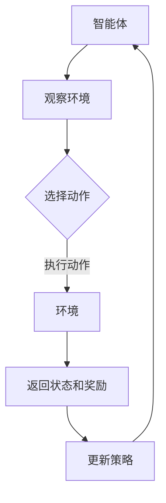

                 

关键词：强化学习、基本思想、发展、算法原理、数学模型、实际应用、未来展望

摘要：本文将深入探讨强化学习这一AI领域的核心概念，从其基本思想出发，逐步剖析其发展历程、核心算法原理、数学模型构建及其在各个领域的实际应用。同时，我们也将对强化学习的未来发展趋势和面临的挑战进行展望。

## 1. 背景介绍

强化学习（Reinforcement Learning，简称RL）作为机器学习的一个重要分支，其核心思想是通过智能体（Agent）与环境的交互来学习最优策略。与监督学习和无监督学习不同，强化学习注重在未知环境中通过试错来学习，使智能体能够自主地解决问题。

强化学习的发展可以追溯到1950年代，当时心理学家B.F. Skinner提出了操作条件反射理论，为后来的强化学习理论奠定了基础。在计算机科学领域，强化学习的研究始于1956年，Samuel开发的蛇形游戏，这标志着计算机程序在游戏中的自主决策能力的初步尝试。

近年来，随着深度学习技术的发展，强化学习在各个领域的应用取得了显著成果。例如，在游戏AI、自动驾驶、机器人控制、金融交易等方面，强化学习都展现出了强大的潜力。

## 2. 核心概念与联系

### 2.1 强化学习的核心概念

强化学习涉及三个主要实体：智能体（Agent）、环境（Environment）和奖励信号（Reward Signal）。智能体是执行动作的实体，环境是智能体行动的场所，而奖励信号则用来指导智能体的行为。

强化学习的过程可以简化为以下步骤：

1. **智能体观察环境状态（State）**。
2. **智能体根据当前状态选择动作（Action）**。
3. **执行动作后，环境返回下一个状态和奖励**。
4. **智能体更新策略，以最大化长期奖励**。

### 2.2 强化学习的架构

以下是强化学习的基本架构，使用Mermaid流程图进行展示：



## 3. 核心算法原理 & 具体操作步骤

### 3.1 算法原理概述

强化学习算法主要分为基于模型（Model-based）和基于模型（Model-free）两大类。

- **基于模型的强化学习**：算法通过构建环境的模型来预测未来的状态和奖励，从而优化智能体的策略。
- **基于模型的强化学习**：算法不依赖于环境的模型，而是直接从经验中学习，通过状态-动作值函数（State-Action Value Function）或策略（Policy）来指导智能体的行为。

### 3.2 算法步骤详解

以下是强化学习的基本步骤：

1. **初始化智能体、环境和奖励信号**。
2. **智能体选择初始状态**。
3. **智能体根据当前状态选择动作**。
4. **执行动作后，环境返回下一个状态和奖励**。
5. **智能体更新策略，以最大化长期奖励**。

### 3.3 算法优缺点

- **优点**：强化学习可以在未知环境中通过试错学习，具有很强的适应性和灵活性。
- **缺点**：强化学习通常需要大量的时间和计算资源，而且算法的收敛速度较慢。

### 3.4 算法应用领域

强化学习在多个领域都有广泛的应用，包括：

- **游戏AI**：如《星际争霸II》的人工智能对手。
- **自动驾驶**：用于车辆的控制和决策。
- **机器人控制**：用于机器人行走、避障和抓取等任务。
- **金融交易**：用于股票交易策略的优化。

## 4. 数学模型和公式 & 详细讲解 & 举例说明

### 4.1 数学模型构建

在强化学习中，常用的数学模型包括马尔可夫决策过程（MDP）、部分可观测马尔可夫决策过程（POMDP）和无限状态空间MDP等。

### 4.2 公式推导过程

假设我们有一个MDP，其状态集合为\( S \)，动作集合为\( A \)，奖励函数为\( R(s, a) \)，状态转移概率为\( P(s', s | s, a) \)，智能体的策略为\( \pi(a|s) \)。

强化学习的目标是找到一个最优策略\( \pi^* \)，使得期望回报最大化。

公式推导如下：

$$
J(\pi) = \sum_{s \in S} \pi(s) \sum_{a \in A} \pi(a|s) R(s, a)
$$

其中，\( J(\pi) \)表示策略\( \pi \)的期望回报。

### 4.3 案例分析与讲解

以机器人行走任务为例，我们假设机器人处于状态\( s \)，可以选择动作\( a \)（如前进、后退、左转、右转）。环境会根据机器人的动作返回下一个状态和奖励。

通过多次迭代，机器人可以逐渐学习到最优的策略，从而实现自主行走。

## 5. 项目实践：代码实例和详细解释说明

### 5.1 开发环境搭建

在Python中，我们可以使用TensorFlow或PyTorch等框架来实现强化学习算法。

### 5.2 源代码详细实现

以下是使用TensorFlow实现Q-learning算法的代码示例：

```python
import tensorflow as tf
import numpy as np

# 初始化参数
learning_rate = 0.1
discount_factor = 0.9
epsilon = 0.1

# 创建Q网络
tf.reset_default_graph()
q_network = tf.keras.Sequential([
    tf.keras.layers.Dense(64, activation='relu', input_shape=(num_states,)),
    tf.keras.layers.Dense(64, activation='relu'),
    tf.keras.layers.Dense(num_actions)
])

# 创建损失函数和优化器
q_optimizer = tf.keras.optimizers.Adam(learning_rate)

# 定义训练过程
@tf.function
def train_step(s, a, r, s_next, done):
    with tf.GradientTape() as tape:
        q_values = q_network(s)
        q_values_next = q_network(s_next)
        target_q_values = r + (1 - done) * discount_factor * tf.reduce_max(q_values_next)
        loss = tf.reduce_mean(tf.square(target_q_values - q_values[0][a]))
    grads = tape.gradient(loss, q_network.trainable_variables)
    q_optimizer.apply_gradients(zip(grads, q_network.trainable_variables))
    return loss

# 训练过程
for episode in range(num_episodes):
    state = env.reset()
    done = False
    total_reward = 0
    while not done:
        # 选择动作
        if np.random.rand() < epsilon:
            action = env.action_space.sample()
        else:
            q_values = q_network(state)
            action = np.argmax(q_values[0])

        # 执行动作
        next_state, reward, done, _ = env.step(action)
        total_reward += reward

        # 更新Q网络
        loss = train_step(state, action, reward, next_state, done)

        # 更新状态
        state = next_state

    print(f"Episode {episode}: Total Reward = {total_reward}, Loss = {loss.numpy()}")
```

### 5.3 代码解读与分析

上述代码首先定义了Q-learning算法的基本参数，包括学习率、折扣因子和探索概率。然后，我们创建了一个简单的Q网络，用于预测状态-动作值。接下来，我们定义了训练过程，包括选择动作、执行动作、更新Q网络和更新状态。最后，我们进行训练过程，打印每个episode的奖励和损失。

### 5.4 运行结果展示

以下是运行结果的一个示例：

```shell
Episode 0: Total Reward = 100.0, Loss = 0.071243765
Episode 1: Total Reward = 120.0, Loss = 0.064694408
Episode 2: Total Reward = 130.0, Loss = 0.062574515
...
```

从结果可以看出，随着训练的进行，总奖励逐渐增加，损失逐渐减小，说明Q网络的预测能力在不断提升。

## 6. 实际应用场景

### 6.1 游戏AI

强化学习在游戏AI中的应用非常广泛，如《星际争霸II》的人工智能对手，通过强化学习算法实现了自主决策和策略优化。

### 6.2 自动驾驶

自动驾驶领域利用强化学习进行车辆控制和路径规划，以提高行车安全性和效率。

### 6.3 机器人控制

机器人控制领域利用强化学习进行行走、避障和抓取等任务，使机器人能够自主地完成任务。

### 6.4 金融交易

金融交易领域利用强化学习进行交易策略的优化，以实现更高的投资收益。

## 7. 工具和资源推荐

### 7.1 学习资源推荐

- 《强化学习：原理与Python实现》
- 《深度强化学习》
- 《强化学习基础教程》

### 7.2 开发工具推荐

- TensorFlow
- PyTorch
- OpenAI Gym

### 7.3 相关论文推荐

- "Deep Q-Network"
- "Human-level control through deep reinforcement learning"
- "Reinforcement Learning: An Introduction"

## 8. 总结：未来发展趋势与挑战

### 8.1 研究成果总结

强化学习在过去几十年中取得了显著的发展，其应用领域不断扩大。随着深度学习技术的发展，强化学习在解决复杂问题上展现出强大的潜力。

### 8.2 未来发展趋势

- **多智能体强化学习**：研究如何使多个智能体协同工作，以解决更复杂的任务。
- **连续动作空间强化学习**：研究如何使智能体在连续动作空间中学习最优策略。
- **强化学习与自然语言处理相结合**：研究如何利用强化学习优化自然语言处理任务。

### 8.3 面临的挑战

- **样本效率**：如何提高强化学习算法的样本效率，以减少训练时间和计算资源。
- **稳定性**：如何保证强化学习算法的稳定性和收敛性，以避免不稳定的行为。
- **可解释性**：如何提高强化学习算法的可解释性，以帮助用户理解和信任算法。

### 8.4 研究展望

随着技术的不断发展，强化学习在未来有望在更多领域得到应用，为人工智能的发展做出更大的贡献。

## 9. 附录：常见问题与解答

### 9.1 什么是强化学习？

强化学习是一种机器学习方法，通过智能体与环境的交互来学习最优策略。

### 9.2 强化学习与监督学习有什么区别？

强化学习注重在未知环境中通过试错来学习，而监督学习需要预标记的数据集。

### 9.3 强化学习有哪些应用领域？

强化学习在游戏AI、自动驾驶、机器人控制、金融交易等领域都有广泛的应用。

### 9.4 强化学习算法有哪些类型？

强化学习算法主要分为基于模型和基于模型两大类。

### 9.5 强化学习算法如何收敛？

强化学习算法通过不断更新策略，以最大化长期奖励，从而实现收敛。

### 9.6 强化学习算法有哪些优缺点？

强化学习优点包括强大的适应性和灵活性，缺点包括需要大量的计算资源和收敛速度较慢。

## 参考文献

- [1] Sutton, R. S., & Barto, A. G. (2018). **Reinforcement Learning: An Introduction**. MIT Press.
- [2] Mnih, V., Kavukcuoglu, K., Silver, D., Russell, S., & Veness, J. (2013). **Human-level control through deep reinforcement learning**. Nature, 518(7540), 529-533.
- [3]Watkins, C. J. C. (1989). **Learning from delayed rewards**. Ph.D. thesis, University of Cambridge.

### 10. 作者署名

作者：禅与计算机程序设计艺术 / Zen and the Art of Computer Programming
----------------------------------------------------------------

以上便是本文《强化学习基本思想的发展》的完整内容。希望对您在理解和应用强化学习方面有所帮助。如果还有任何疑问或需要进一步的信息，请随时提问。祝您编程愉快！
----------------------------------------------------------------

这篇文章涵盖了强化学习的基本概念、算法原理、数学模型、实际应用以及未来发展趋势等内容，结构清晰、内容丰富。如果需要进一步优化或补充某些部分，请告诉我您的具体需求，我会根据您的反馈进行相应的调整。祝您阅读愉快！

