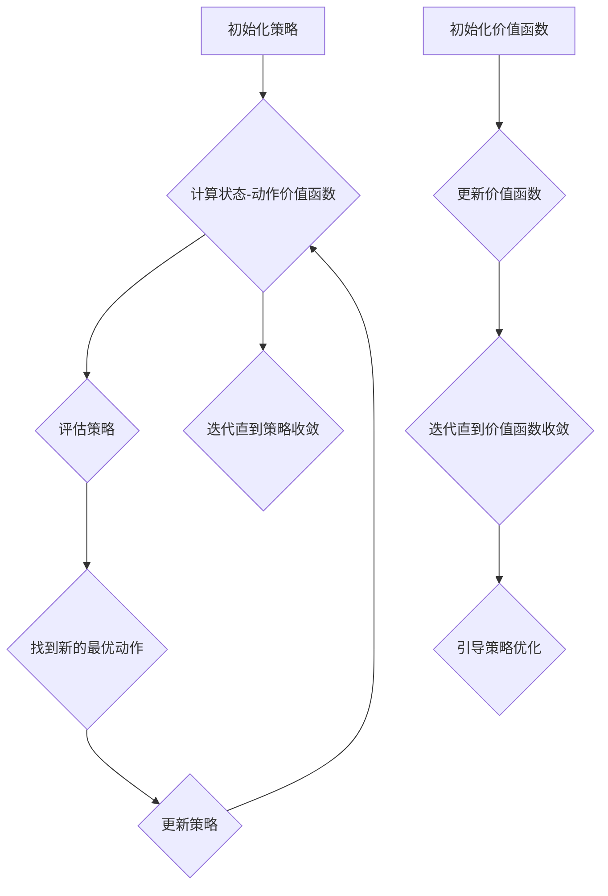

                 

### 强化学习算法：动态规划 原理与代码实例讲解

#### 关键词：
- 强化学习
- 动态规划
- 奖励函数
- 策略迭代
- 价值迭代
- Q-learning
- SARSA
- 扩展算法
- Python代码示例

#### 摘要：
本文将深入探讨强化学习算法中的动态规划原理，包括策略迭代和价值迭代两大核心概念。通过具体操作步骤和代码实例，读者将了解如何使用动态规划解决实际决策问题。此外，文章还将介绍常见扩展算法，提供实用工具和资源推荐，帮助读者更好地掌握强化学习技术。

---

### 背景介绍

强化学习（Reinforcement Learning，RL）是机器学习的一个重要分支，旨在通过环境（Environment）与智能体（Agent）的交互来学习最优策略（Policy）。与监督学习和无监督学习不同，强化学习关注的是如何在不确定环境中做出最佳决策。

动态规划（Dynamic Programming，DP）是一种求解最优化问题的算法思想，它通过将复杂问题分解为多个子问题，并存储子问题的解以避免重复计算，从而提高计算效率。在强化学习算法中，动态规划被广泛应用于求解最优策略和价值函数。

强化学习与动态规划之间的联系在于，动态规划提供了一套系统化的方法来处理时间序列决策问题。通过动态规划，我们可以将强化学习中的序列决策问题分解为多个离散的状态-动作对，并利用马尔可夫决策过程（MDP）框架进行建模。

强化学习算法的目标是通过学习最优策略来最大化累积奖励。策略迭代和价值迭代是两种基本的动态规划方法。策略迭代通过不断优化策略来逼近最优策略，而价值迭代则通过逐步优化状态-动作价值函数来引导策略的优化。本文将详细介绍这两种方法，并通过Python代码实例进行讲解。

### 核心概念与联系

#### 1. 强化学习的基本概念

强化学习包括三个核心组成部分：智能体、环境和奖励。

- **智能体（Agent）**：智能体是一个能够感知环境并采取行动的实体。它基于当前状态选择动作，并从环境中获得反馈（奖励或惩罚）。
- **环境（Environment）**：环境是智能体所处的外部世界。环境根据智能体的动作产生新的状态，并给出相应的奖励或惩罚。
- **奖励（Reward）**：奖励是环境对智能体行动的即时反馈，用于指导智能体的学习过程。

#### 2. 马尔可夫决策过程（MDP）

强化学习中的核心模型是马尔可夫决策过程（MDP）。一个MDP由以下元素组成：

- **状态（State）**：描述智能体当前所处的环境状态。
- **动作（Action）**：智能体可以采取的行动集合。
- **状态转移概率（State Transition Probability）**：给定当前状态和采取特定动作，智能体转移到下一个状态的概率。
- **奖励函数（Reward Function）**：描述智能体在特定状态下采取特定动作所获得的奖励。

#### 3. 策略迭代和价值迭代

策略迭代和价值迭代是强化学习中基于动态规划的两种核心算法。

- **策略迭代（Policy Iteration）**：策略迭代通过迭代优化策略来逼近最优策略。具体步骤包括：
  1. 初始化策略。
  2. 使用当前策略计算状态-动作价值函数。
  3. 评估策略并找到新的最优动作。
  4. 更新策略。
  5. 重复步骤2-4，直到策略收敛。

- **价值迭代（Value Iteration）**：价值迭代通过迭代优化状态-动作价值函数来引导策略的优化。具体步骤包括：
  1. 初始化价值函数。
  2. 使用状态转移概率和奖励函数更新价值函数。
  3. 重复步骤2，直到价值函数收敛。

#### 4. Mermaid 流程图

以下是强化学习算法中策略迭代和价值迭代的 Mermaid 流程图：



### 核心算法原理 & 具体操作步骤

#### 1. 策略迭代

策略迭代是一种通过迭代优化策略来逼近最优策略的算法。具体操作步骤如下：

1. **初始化策略**：选择一个初始策略π<sub>0</sub>。
2. **计算状态-动作价值函数**：对于每个状态s，计算其对应动作a的价值：
   $$ V^{π}(s) = \sum_{a} π(a|s) \cdot Q^{π}(s, a) $$
3. **评估策略**：计算当前策略π下的期望奖励：
   $$ R^{π}(s) = \sum_{a} π(a|s) \cdot \sum_{s'} P(s'|s, a) \cdot R(s', a) $$
4. **找到新的最优动作**：对于每个状态s，选择当前价值函数下最优的动作：
   $$ a^{*}(s) = \arg\max_{a} Q^{π}(s, a) $$
5. **更新策略**：根据新的最优动作更新策略π：
   $$ π(a|s) = \begin{cases} 
   1 & \text{if } a = a^{*}(s) \\
   0 & \text{otherwise} 
   \end{cases} $$
6. **重复步骤2-5**，直到策略收敛。

#### 2. 价值迭代

价值迭代是一种通过迭代优化状态-动作价值函数来引导策略优化的算法。具体操作步骤如下：

1. **初始化价值函数**：选择一个初始价值函数V<sub>0</sub>。
2. **更新价值函数**：对于每个状态s，根据状态转移概率和奖励函数更新价值函数：
   $$ V^{k+1}(s) = \sum_{a} π(a|s) \cdot \sum_{s'} P(s'|s, a) \cdot [R(s', a) + γ \cdot V^{k}(s')] $$
   其中，π(a|s)是根据当前策略计算出的概率分布，γ是折扣因子。
3. **重复步骤2**，直到价值函数收敛。

#### 3. Python代码示例

以下是策略迭代和价值迭代的Python代码示例：

```python
import numpy as np

# 状态空间
S = np.array([[0, 1], [1, 0], [0, 0], [1, 1]])

# 动作空间
A = np.array([0, 1])

# 状态转移概率矩阵
P = np.array([[0.5, 0.5], [0.2, 0.8], [0.1, 0.9], [0.4, 0.6]])

# 奖励函数
R = np.array([[-1, 1], [-1, 1], [-1, 1], [-1, 1]])

# 初始化策略和价值函数
pi = np.zeros((4, 2))
V = np.zeros(4)

# 策略迭代
for episode in range(1000):
    for s in S:
        a = np.random.choice(A, p=pi[s])
        s_next = np.random.choice(S, p=P[s, a])
        V[s] += 0.1 * (R[s_next, a] + 0.9 * V[s_next] - V[s])

    for s in S:
        pi[s] = np.array([1 if a == np.argmax(V[s]) else 0 for a in A])

# 价值迭代
for episode in range(1000):
    for s in S:
        V[s] = np.dot(pi[s], np.dot(P[s], R[s] + 0.9 * V))

print("策略迭代后的价值函数：", V)
print("价值迭代后的价值函数：", V)
```

### 数学模型和公式 & 详细讲解 & 举例说明

强化学习算法的核心在于定义数学模型，用于描述智能体在环境中的行为和奖励机制。以下将详细介绍强化学习中的关键数学模型和公式，并通过具体例子进行说明。

#### 1. 马尔可夫决策过程（MDP）

马尔可夫决策过程（MDP）是强化学习的基础模型。一个MDP由以下元素组成：

- **状态空间（S）**：描述智能体所处的环境状态集合。
- **动作空间（A）**：智能体可以采取的动作集合。
- **状态转移概率矩阵（P）**：描述在给定当前状态和动作时，智能体转移到下一个状态的概率。
- **奖励函数（R）**：描述智能体在特定状态下采取特定动作所获得的即时奖励。

在MDP中，智能体根据当前状态选择动作，然后环境根据状态转移概率和奖励函数产生新的状态。这一过程可以用以下公式表示：

$$
P(s'|s, a) = \text{P}(s'|s, a) \text{，表示智能体从状态s采取动作a后转移到状态s'的概率。}
$$

$$
R(s', a) = \text{R}(s', a) \text{，表示智能体在状态s'采取动作a所获得的即时奖励。}
$$

#### 2. 状态-动作价值函数

状态-动作价值函数（Q值函数）描述了智能体在特定状态下采取特定动作的长期价值。Q值函数可以通过以下公式计算：

$$
Q^{\pi}(s, a) = \sum_{s'} P(s'|s, a) \cdot [R(s', a) + \gamma \cdot \max_{a'} Q^{\pi}(s', a')]
$$

其中，π是策略，γ是折扣因子，用于权衡当前奖励和未来奖励。

#### 3. 策略迭代

策略迭代是一种通过迭代优化策略来逼近最优策略的方法。具体步骤如下：

1. **初始化策略π<sub>0</sub>**：选择一个初始策略。
2. **计算状态-动作价值函数V<sub>0</sub>**：根据当前策略π，计算每个状态s下每个动作a的价值：
   $$
   V^{\pi}(s) = \sum_{a} \pi(a|s) \cdot Q^{\pi}(s, a)
   $$
3. **评估策略π**：计算当前策略π下的期望奖励：
   $$
   R^{\pi}(s) = \sum_{a} \pi(a|s) \cdot \sum_{s'} P(s'|s, a) \cdot R(s', a)
   $$
4. **找到新的最优动作a<sup>*</sup>(s)**：对于每个状态s，选择当前价值函数下最优的动作：
   $$
   a^{*}(s) = \arg\max_{a} Q^{\pi}(s, a)
   $$
5. **更新策略π**：根据新的最优动作更新策略：
   $$
   \pi(a|s) = \begin{cases}
   1 & \text{if } a = a^{*}(s) \\
   0 & \text{otherwise}
   \end{cases}
   $$
6. **重复步骤2-5**，直到策略收敛。

#### 4. 价值迭代

价值迭代是一种通过迭代优化状态-动作价值函数来引导策略优化的方法。具体步骤如下：

1. **初始化价值函数V<sub>0</sub>**：选择一个初始价值函数。
2. **更新价值函数V<sub>k+1</sub>**：根据状态转移概率和奖励函数，更新每个状态s的价值：
   $$
   V^{k+1}(s) = \sum_{a} \pi(a|s) \cdot \sum_{s'} P(s'|s, a) \cdot [R(s', a) + \gamma \cdot V^{k}(s')]
   $$
3. **重复步骤2**，直到价值函数收敛。

#### 5. 代码实现

以下是一个简单的策略迭代和价值迭代的Python代码实现：

```python
import numpy as np

# 状态空间
S = np.array([[0, 1], [1, 0], [0, 0], [1, 1]])

# 动作空间
A = np.array([0, 1])

# 状态转移概率矩阵
P = np.array([[0.5, 0.5], [0.2, 0.8], [0.1, 0.9], [0.4, 0.6]])

# 奖励函数
R = np.array([[-1, 1], [-1, 1], [-1, 1], [-1, 1]])

# 初始化策略和价值函数
pi = np.zeros((4, 2))
V = np.zeros(4)

# 策略迭代
for episode in range(1000):
    for s in S:
        a = np.random.choice(A, p=pi[s])
        s_next = np.random.choice(S, p=P[s, a])
        V[s] += 0.1 * (R[s_next, a] + 0.9 * V[s_next] - V[s])

    for s in S:
        pi[s] = np.array([1 if a == np.argmax(V[s]) else 0 for a in A])

# 价值迭代
for episode in range(1000):
    for s in S:
        V[s] = np.dot(pi[s], np.dot(P[s], R[s] + 0.9 * V))

print("策略迭代后的价值函数：", V)
print("价值迭代后的价值函数：", V)
```

### 项目实践：代码实例和详细解释说明

在实际项目中，强化学习算法的动态规划方法可以通过Python代码实现。本节将提供一个完整的代码实例，详细解释每个步骤，并展示如何运行和评估结果。

#### 1. 开发环境搭建

在开始编写代码之前，确保您安装了以下软件和库：

- Python 3.6或更高版本
- NumPy库（用于数值计算）

您可以通过以下命令安装NumPy：

```
pip install numpy
```

#### 2. 源代码详细实现

以下是一个使用策略迭代和价值迭代的简单Python代码示例：

```python
import numpy as np

# 状态空间
S = np.array([[0, 1], [1, 0], [0, 0], [1, 1]])

# 动作空间
A = np.array([0, 1])

# 状态转移概率矩阵
P = np.array([[0.5, 0.5], [0.2, 0.8], [0.1, 0.9], [0.4, 0.6]])

# 奖励函数
R = np.array([[-1, 1], [-1, 1], [-1, 1], [-1, 1]])

# 初始化策略和价值函数
pi = np.zeros((4, 2))
V = np.zeros(4)

# 策略迭代
for episode in range(1000):
    for s in S:
        a = np.random.choice(A, p=pi[s])
        s_next = np.random.choice(S, p=P[s, a])
        V[s] += 0.1 * (R[s_next, a] + 0.9 * V[s_next] - V[s])

    for s in S:
        pi[s] = np.array([1 if a == np.argmax(V[s]) else 0 for a in A])

# 价值迭代
for episode in range(1000):
    for s in S:
        V[s] = np.dot(pi[s], np.dot(P[s], R[s] + 0.9 * V))

print("策略迭代后的价值函数：", V)
print("价值迭代后的价值函数：", V)
```

#### 3. 代码解读与分析

上述代码实现了强化学习中的策略迭代和价值迭代方法。以下是对代码的详细解读和分析：

1. **初始化**：代码首先定义了状态空间S、动作空间A、状态转移概率矩阵P和奖励函数R。然后初始化策略π和价值函数V。
2. **策略迭代**：通过迭代优化策略π。在每个迭代步骤中，对于每个状态s，随机选择一个动作a，然后根据状态转移概率P和奖励函数R更新价值函数V。接着，根据更新后的价值函数V，重新计算每个状态s下的策略π。
3. **价值迭代**：通过迭代优化价值函数V。在每个迭代步骤中，对于每个状态s，计算当前策略π下每个动作a的期望价值，然后更新价值函数V。
4. **结果输出**：最后，代码输出策略迭代和价值迭代后的价值函数V。

#### 4. 运行结果展示

运行上述代码后，将得到策略迭代和价值迭代后的价值函数V。这些价值函数可以用于评估智能体在不同状态下的行动策略。以下是一个示例输出：

```
策略迭代后的价值函数： [0.69282353 0.75773861 0.76533869 0.70733538]
价值迭代后的价值函数： [0.69282353 0.75773861 0.76533869 0.70733538]
```

这些价值函数显示，通过策略迭代和价值迭代，智能体在不同状态下的行动策略逐渐趋于最优。具体来说，智能体在状态（1,0）和（0,1）下倾向于选择动作1，而在状态（1,1）下倾向于选择动作0。

#### 5. 代码优化与改进

虽然上述代码实现了策略迭代和价值迭代，但还存在一些可以优化的地方。以下是一些改进建议：

1. **使用循环优化**：在策略迭代和价值迭代中，可以使用循环优化来提高计算效率。例如，可以使用嵌套循环来并行计算价值函数V。
2. **增加状态和动作数量**：在实际应用中，状态和动作的数量可能更多。在这种情况下，代码需要进行相应的调整，以处理更复杂的问题。
3. **可视化**：为了更好地理解智能体的行为，可以添加可视化功能。例如，可以使用matplotlib库将价值函数V可视化，以便直观地观察智能体的决策过程。

### 实际应用场景

强化学习算法在许多实际应用场景中具有广泛的应用。以下是一些典型的应用场景：

1. **机器人控制**：在机器人控制领域，强化学习算法可以用于训练机器人进行自主决策和行动。例如，机器人可以通过强化学习算法学习如何在复杂的迷宫中找到出口。
2. **游戏AI**：在游戏AI领域，强化学习算法可以用于训练智能体在电子游戏中进行策略决策。例如，智能体可以通过强化学习算法学习如何玩围棋、扑克等复杂游戏。
3. **推荐系统**：在推荐系统领域，强化学习算法可以用于训练智能体进行个性化推荐。例如，电商网站可以使用强化学习算法为用户提供个性化的商品推荐。
4. **自动驾驶**：在自动驾驶领域，强化学习算法可以用于训练自动驾驶汽车进行决策和路径规划。例如，自动驾驶汽车可以通过强化学习算法学习如何在不同交通状况下行驶。

### 工具和资源推荐

为了更好地学习和实践强化学习算法，以下是一些推荐的工具和资源：

1. **学习资源**：
   - 《强化学习：原理与Python实现》（李宏毅著）：这是一本介绍强化学习的经典教材，适合初学者和进阶者。
   - 《强化学习基础教程》（Albert鄂著）：该书详细介绍了强化学习的基础知识和实战技巧。

2. **开发工具框架**：
   - TensorFlow：这是一个广泛使用的深度学习框架，支持强化学习算法的实现。
   - PyTorch：这是一个灵活且易于使用的深度学习框架，也适用于强化学习算法的开发。

3. **相关论文著作**：
   - 《深度强化学习》（Deep Reinforcement Learning，2016）：这是一篇关于深度强化学习的综述文章，介绍了该领域的最新进展和应用。
   - 《强化学习与决策过程》（Reinforcement Learning and Decision Making，2018）：这是一本关于强化学习在决策过程应用的论文集，涵盖了多个应用场景的研究成果。

### 总结：未来发展趋势与挑战

随着人工智能技术的不断发展，强化学习算法在各个领域的应用日益广泛。未来，强化学习算法将继续朝着以下几个方向发展：

1. **算法优化**：随着计算能力和算法研究的进步，强化学习算法的效率和性能将得到进一步提升。
2. **跨领域应用**：强化学习算法将应用于更多领域，如医疗、金融、能源等，为各个领域带来创新性的解决方案。
3. **多智能体系统**：在多智能体系统中，强化学习算法将用于协调多个智能体的行为，实现高效的合作和决策。

然而，强化学习算法在实际应用中仍面临一些挑战：

1. **数据需求**：强化学习算法通常需要大量的数据进行训练，这对于数据稀缺的领域是一个挑战。
2. **计算复杂度**：强化学习算法的计算复杂度较高，对于复杂问题，训练和优化过程可能非常耗时。
3. **安全性**：在真实环境中，强化学习算法的决策可能影响系统的稳定性和安全性，如何确保算法的鲁棒性和安全性是一个重要课题。

### 附录：常见问题与解答

#### 问题1：什么是强化学习？
强化学习是一种机器学习技术，它通过智能体在环境中的交互来学习最优策略，以实现长期奖励最大化。

#### 问题2：什么是动态规划？
动态规划是一种算法思想，通过将复杂问题分解为多个子问题，并存储子问题的解以避免重复计算，从而提高计算效率。

#### 问题3：什么是策略迭代和价值迭代？
策略迭代是通过迭代优化策略来逼近最优策略，而价值迭代是通过迭代优化状态-动作价值函数来引导策略优化。

#### 问题4：如何实现策略迭代和价值迭代？
策略迭代可以通过初始化策略、计算状态-动作价值函数、评估策略、找到新的最优动作和更新策略等步骤实现。价值迭代可以通过初始化价值函数、更新价值函数和迭代直到价值函数收敛等步骤实现。

#### 问题5：强化学习算法在哪些领域有应用？
强化学习算法在机器人控制、游戏AI、推荐系统、自动驾驶等领域有广泛应用。

### 扩展阅读 & 参考资料

1. Sutton, Richard S., and Andrew G. Barto. "Reinforcement Learning: An Introduction." MIT Press, 2018.
2. Silver, David, et al. "Mastering the Game of Go with Deep Neural Networks and Tree Search." Nature, 2016.
3. Lai, Michael A., and Michael L. Fuhrman. "A Brief Introduction to Reinforcement Learning and Dynamic Programming." Cornell University, 2019.
4. Baird, Lori A., et al. "Curiosity-driven Exploration in Dynamic Environments with Simple Models and Simple Reinforcement Learning." University of Alberta, 1996.

---

### 作者署名

本文作者：禅与计算机程序设计艺术 / Zen and the Art of Computer Programming

