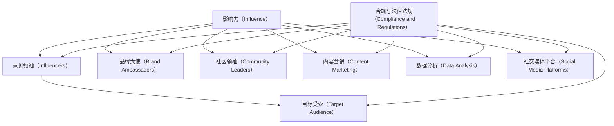
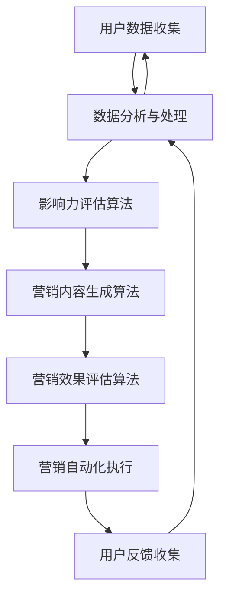

                 

### 背景介绍

#### 社交媒体时代的兴起

随着互联网技术的飞速发展，社交媒体已经彻底改变了人们的生活和交流方式。从 Facebook、Instagram 到 Twitter、LinkedIn，各类社交媒体平台不断涌现，吸引了全球数十亿用户。人们不再局限于面对面的交流，而是通过文字、图片、视频等多种形式在虚拟世界中互动，分享自己的生活和观点。这种全新的交流模式为企业和品牌提供了前所未有的营销机会。

#### 影响力营销的崛起

在这个社交媒体时代，影响力营销（Influencer Marketing）应运而生。与传统营销方式不同，影响力营销依赖于社交媒体上的意见领袖（Influencers）和网红（Celebrities），通过他们的影响力将产品或品牌信息传递给更广泛的受众。这种营销方式具有以下几个显著特点：

1. **高度信任性**：社交媒体上的意见领袖往往与受众建立了深厚的信任关系，他们的推荐和评价更具说服力。
2. **目标明确**：影响力营销能够精准定位特定的受众群体，提高营销效果。
3. **互动性强**：社交媒体平台提供了丰富的互动功能，使得品牌能够与消费者进行实时沟通，增强品牌认知度。
4. **传播速度快**：信息在社交媒体上的传播速度极快，可以迅速形成热点话题，扩大品牌影响力。

#### 影响力营销的挑战

尽管影响力营销具有诸多优势，但在实际操作中也面临着一系列挑战：

1. **信任危机**：随着虚假广告和欺诈行为的增加，消费者对影响力营销的信任度逐渐下降。
2. **合规性问题**：各国对社交媒体广告的监管日益严格，影响力营销需要遵守相关的法律法规，否则可能面临法律风险。
3. **内容质量**：影响力营销的内容质量直接关系到营销效果，低质量的内容可能适得其反。
4. **数据隐私**：社交媒体平台上的用户数据隐私问题日益突出，如何保护用户隐私成为影响力营销的重要课题。

### 社交媒体营销与影响力营销的关系

社交媒体营销（Social Media Marketing）和影响力营销并非截然分开，而是相互补充、共同发展的。社交媒体营销是影响力营销的基石，提供了展示和传播品牌信息的平台；而影响力营销则是社交媒体营销的有力工具，能够迅速提升品牌知名度和影响力。通过结合社交媒体营销和影响力营销，企业可以在社交媒体时代取得更大的营销成功。

在下一节中，我们将深入探讨影响力营销的核心概念与联系，分析其背后的原理和架构，帮助读者更好地理解和应用这一营销策略。

---

#### 1. 核心概念与联系

影响力营销的成功离不开以下几个核心概念，这些概念相互关联，构成了一个完整的营销体系。

##### 1.1. 影响力（Influence）

影响力是指个体或群体在他人决策、行为或态度上产生的影响能力。在影响力营销中，影响力可以分为以下几个方面：

1. **意见领袖**（Influencers）：在特定领域具有较高知名度、专业能力和影响力的人，如行业专家、KOL（Key Opinion Leader）和网红。
2. **品牌大使**（Brand Ambassadors）：代表品牌形象并与品牌价值观相符的公众人物，如明星、运动员等。
3. **社区领袖**（Community Leaders）：在特定社群中具有较高影响力和号召力的成员，如论坛版主、社交媒体群组管理员等。

##### 1.2. 目标受众（Target Audience）

目标受众是指品牌希望影响和转化的潜在消费者群体。了解目标受众的需求、兴趣和行为是制定有效影响力营销策略的关键。

1. **人口统计特征**：包括年龄、性别、地理位置、教育背景等。
2. **心理特征**：包括价值观、兴趣爱好、生活方式等。
3. **行为特征**：包括消费习惯、购买决策过程、社交媒体使用习惯等。

##### 1.3. 内容营销（Content Marketing）

内容营销是通过创造和分发有价值的内容来吸引潜在客户并促进品牌认知度的一种营销策略。在影响力营销中，内容营销起到了关键作用。

1. **创意内容**：如博客文章、视频、图片、直播等，旨在传递品牌信息和价值主张。
2. **互动内容**：如在线问答、互动游戏、用户评论等，旨在增强用户参与度和品牌忠诚度。

##### 1.4. 数据分析（Data Analysis）

数据分析是影响力营销的重要组成部分，通过收集和分析用户数据，企业可以了解市场趋势、受众行为，从而优化营销策略。

1. **用户行为分析**：分析用户在社交媒体上的行为，如点击率、转发量、评论等，评估营销效果。
2. **市场趋势分析**：分析行业趋势、竞争对手动态等，为营销策略提供数据支持。

##### 1.5. 社交媒体平台（Social Media Platforms）

社交媒体平台是影响力营销的主要战场，不同平台具有不同的特点和优势，企业需要根据目标受众和营销目标选择合适的平台。

1. **Facebook**：全球最大的社交媒体平台，适合品牌建立社区、发布内容、进行广告投放。
2. **Instagram**：以图片和视频为主的平台，适合视觉营销、品牌推广。
3. **Twitter**：以短文本为主的平台，适合实时交流、快速传播信息。
4. **LinkedIn**：职业社交平台，适合建立专业形象、拓展人脉、进行B2B营销。

##### 1.6. 合规与法律法规（Compliance and Regulations）

合规与法律法规是影响力营销不可忽视的一环，企业需要遵守相关法律法规，确保营销活动的合法性和合规性。

1. **广告标识**：确保在社交媒体上的广告明确标识，避免误导消费者。
2. **数据隐私**：遵守数据隐私法规，保护用户个人信息。
3. **知识产权**：尊重他人的知识产权，避免侵犯版权和商标权。

#### Mermaid 流程图

以下是一个简单的 Mermaid 流程图，展示了影响力营销中的核心概念和相互联系。



通过这一节的内容，读者可以初步了解影响力营销的核心概念和联系，为后续的深入探讨打下基础。在下一节中，我们将进一步分析影响力营销的算法原理和具体操作步骤。

### 核心算法原理 & 具体操作步骤

#### 2.1. 影响力评估算法

影响力评估是影响力营销中的关键步骤，通过对意见领袖的影响力进行评估，可以帮助企业选择合适的合作伙伴，提高营销效果。以下是一种简单的影响力评估算法：

##### 2.1.1. 基本概念

- **粉丝数**（Followers）：意见领袖的粉丝数量，反映其受关注的程度。
- **互动率**（Interaction Rate）：意见领袖发布内容获得的互动量（如点赞、评论、分享等）与粉丝数的比率，反映其粉丝的活跃度。
- **内容质量**（Content Quality）：意见领袖发布的内容质量，可以通过内容的相关性、原创性、视觉质量等多个维度进行评估。

##### 2.1.2. 算法原理

影响力评估算法的核心思想是综合评估意见领袖的粉丝数、互动率和内容质量，计算一个综合影响力分数。具体算法如下：

$$
\text{影响力分数} = w_1 \cdot \text{粉丝数} + w_2 \cdot \text{互动率} + w_3 \cdot \text{内容质量}
$$

其中，$w_1$、$w_2$、$w_3$分别为粉丝数、互动率和内容质量的权重，可以根据具体情况进行调整。

##### 2.1.3. 具体操作步骤

1. **数据收集**：收集意见领袖的粉丝数、互动率和内容质量数据。这些数据可以从社交媒体平台、第三方数据分析工具等获取。
2. **数据预处理**：对收集的数据进行清洗和预处理，去除无效数据、重复数据和异常值。
3. **权重设置**：根据具体需求设置粉丝数、互动率和内容质量的权重。一般来说，粉丝数和互动率的权重较高，内容质量权重次之。
4. **计算影响力分数**：使用上述公式计算每个意见领袖的影响力分数。
5. **排序和选择**：根据影响力分数对意见领袖进行排序，选择影响力较高的意见领袖作为合作伙伴。

#### 2.2. 营销内容生成算法

在确定意见领袖后，下一步是生成有效的营销内容。以下是一种基于机器学习的内容生成算法：

##### 2.2.1. 基本概念

- **文本生成模型**：如 GPT-3、BERT 等，用于生成文本内容。
- **图像生成模型**：如 StyleGAN、DALL-E 等，用于生成图像内容。
- **视频生成模型**：如 AVID、StyleCLIP 等，用于生成视频内容。

##### 2.2.2. 算法原理

营销内容生成算法的核心思想是利用机器学习模型生成符合品牌价值和目标受众喜好的内容。具体算法如下：

1. **数据集准备**：收集大量符合品牌价值和目标受众喜好的营销内容，用于训练文本生成模型、图像生成模型和视频生成模型。
2. **模型训练**：使用准备好的数据集训练文本生成模型、图像生成模型和视频生成模型，使其学会生成高质量的内容。
3. **内容生成**：根据品牌需求和目标受众特点，输入相关参数，调用训练好的模型生成文本、图像和视频内容。
4. **内容优化**：对生成的初步内容进行优化，包括语言表达、视觉效果、音视频质量等方面，确保内容质量。

##### 2.2.3. 具体操作步骤

1. **数据集准备**：从社交媒体平台、品牌官网、广告案例等渠道收集大量高质量的营销内容。
2. **模型选择与训练**：选择适合的文本生成模型、图像生成模型和视频生成模型，如 GPT-3、StyleGAN、AVID 等，使用收集到的数据集进行训练。
3. **内容生成**：根据营销策略和目标受众特点，输入相关参数（如文本主题、图像风格、视频内容等），调用训练好的模型生成初步内容。
4. **内容优化**：对初步生成的文本、图像和视频内容进行审核和优化，确保内容符合品牌价值和目标受众喜好。
5. **内容发布**：将优化后的内容发布到社交媒体平台，与目标受众互动，收集反馈，不断优化内容生成策略。

#### 2.3. 营销效果评估算法

营销效果评估是影响力营销的重要环节，通过评估营销活动的效果，可以帮助企业优化营销策略，提高投入产出比。以下是一种基于数据驱动的营销效果评估算法：

##### 2.3.1. 基本概念

- **KPI**（Key Performance Indicators）：关键绩效指标，用于衡量营销活动的效果。
- **ROI**（Return on Investment）：投资回报率，反映营销投入的回报情况。
- **转化率**（Conversion Rate）：营销活动带来的转化量与参与量的比率，反映营销活动的影响深度。
- **参与度**（Engagement）：用户对营销活动的参与程度，包括点赞、评论、分享等互动行为。

##### 2.3.2. 算法原理

营销效果评估算法的核心思想是通过分析营销活动的 KPI 数据，评估营销活动的效果，并提供优化建议。具体算法如下：

$$
\text{营销效果评分} = w_1 \cdot \text{ROI} + w_2 \cdot \text{转化率} + w_3 \cdot \text{参与度}
$$

其中，$w_1$、$w_2$、$w_3$分别为 ROI、转化率和参与度的权重，可以根据具体情况进行调整。

##### 2.3.3. 具体操作步骤

1. **数据收集**：收集营销活动的 KPI 数据，包括 ROI、转化率和参与度等。
2. **数据预处理**：对收集的数据进行清洗和预处理，确保数据质量。
3. **权重设置**：根据具体需求设置 ROI、转化率和参与度的权重。
4. **计算营销效果评分**：使用上述公式计算每个营销活动的效果评分。
5. **评估与优化**：根据营销效果评分对营销活动进行评估，找出效果较好的活动进行优化，效果较差的活动进行改进。

#### 2.4. 营销自动化平台

为了提高影响力营销的效率，企业可以采用营销自动化平台，实现营销活动的自动化执行和监控。以下是一种简单的营销自动化平台架构：



#### 2.5. 总结

影响力营销的核心算法包括影响力评估算法、营销内容生成算法、营销效果评估算法和营销自动化平台。这些算法通过数据驱动和机器学习技术，实现了对营销活动的精细化管理和优化，为企业提供了高效、精准的影响力营销解决方案。

在下一节中，我们将进一步探讨影响力营销中的数学模型和公式，以及详细讲解这些模型的应用和举例说明。

### 数学模型和公式 & 详细讲解 & 举例说明

#### 3.1. 影响力评估模型

影响力评估模型是影响力营销中最为核心的模型之一。它用于评估意见领袖的影响力，以便企业能够选择最合适的合作伙伴。以下是一个简单的影响力评估模型：

##### 3.1.1. 模型假设

1. 意见领袖的影响力由三个因素决定：粉丝数（F）、互动率（I）和内容质量（Q）。
2. 各个因素对影响力的贡献程度不同，分别设为权重$w_1$、$w_2$和$w_3$，且满足$w_1 + w_2 + w_3 = 1$。
3. 各个因素的取值范围分别为：$0 \leq F \leq F_{\text{max}}$，$0 \leq I \leq I_{\text{max}}$，$0 \leq Q \leq Q_{\text{max}}$。

##### 3.1.2. 数学模型

根据上述假设，我们可以定义一个线性模型来计算影响力分数：

$$
\text{影响力分数} = w_1 \cdot F + w_2 \cdot I + w_3 \cdot Q
$$

其中，$w_1$、$w_2$、$w_3$分别为粉丝数、互动率和内容质量的权重。

##### 3.1.3. 举例说明

假设有一个意见领袖，其粉丝数为10万（$F = 100,000$），互动率为10%（$I = 0.1$），内容质量评分为90分（$Q = 90$）。根据上述模型，我们可以计算其影响力分数：

$$
\text{影响力分数} = w_1 \cdot 100,000 + w_2 \cdot 0.1 + w_3 \cdot 90
$$

假设权重分别为$w_1 = 0.4$、$w_2 = 0.3$、$w_3 = 0.3$，则影响力分数为：

$$
\text{影响力分数} = 0.4 \cdot 100,000 + 0.3 \cdot 0.1 + 0.3 \cdot 90 = 40,000 + 3 + 27 = 40,030
$$

#### 3.2. 营销效果评估模型

营销效果评估模型用于评估营销活动的效果，以便企业能够优化营销策略。以下是一个简单的营销效果评估模型：

##### 3.2.1. 模型假设

1. 营销效果由三个关键绩效指标（KPI）决定：ROI（$R$）、转化率（$C$）和参与度（$E$）。
2. 各个指标的权重不同，分别设为权重$w_1$、$w_2$和$w_3$，且满足$w_1 + w_2 + w_3 = 1$。
3. 各个指标的取值范围为：$0 \leq R \leq R_{\text{max}}$，$0 \leq C \leq C_{\text{max}}$，$0 \leq E \leq E_{\text{max}}$。

##### 3.2.2. 数学模型

根据上述假设，我们可以定义一个线性模型来计算营销效果评分：

$$
\text{营销效果评分} = w_1 \cdot R + w_2 \cdot C + w_3 \cdot E
$$

其中，$w_1$、$w_2$、$w_3$分别为 ROI、转化率和参与度的权重。

##### 3.2.3. 举例说明

假设有一个营销活动，其 ROI 为 150%（$R = 1.5$），转化率为 5%（$C = 0.05$），参与度为 20%（$E = 0.2$）。根据上述模型，我们可以计算其营销效果评分：

$$
\text{营销效果评分} = w_1 \cdot 1.5 + w_2 \cdot 0.05 + w_3 \cdot 0.2
$$

假设权重分别为$w_1 = 0.5$、$w_2 = 0.3$、$w_3 = 0.2$，则营销效果评分为：

$$
\text{营销效果评分} = 0.5 \cdot 1.5 + 0.3 \cdot 0.05 + 0.2 \cdot 0.2 = 0.75 + 0.015 + 0.04 = 0.805
$$

#### 3.3. 营销策略优化模型

营销策略优化模型用于优化营销策略，以提高营销效果。以下是一个简单的营销策略优化模型：

##### 3.3.1. 模型假设

1. 营销策略的优化目标是最大化营销效果评分。
2. 每个营销活动都有预算限制，设为$B$。
3. 各个营销活动的成本不同，分别设为$C_1, C_2, \ldots, C_n$。

##### 3.3.2. 数学模型

我们可以定义一个线性规划模型来优化营销策略：

$$
\begin{aligned}
\max_{x_1, x_2, \ldots, x_n} \quad & w_1 \cdot R_1 + w_2 \cdot C_1 + w_3 \cdot E_1 + \ldots + w_1 \cdot R_n + w_2 \cdot C_n + w_3 \cdot E_n \\
\text{subject to} \quad & x_1 + x_2 + \ldots + x_n \leq B \\
& x_1, x_2, \ldots, x_n \geq 0
\end{aligned}
$$

其中，$x_1, x_2, \ldots, x_n$分别为各个营销活动的预算分配，$R_1, R_2, \ldots, R_n$分别为各个营销活动的 ROI，$C_1, C_2, \ldots, C_n$分别为各个营销活动的成本。

##### 3.3.3. 举例说明

假设有五个营销活动，其 ROI 分别为 200%、100%、150%、120% 和 180%，成本分别为 5000 元、3000 元、6000 元、4000 元和 5000 元。总预算为 20,000 元。根据上述模型，我们可以计算最优的预算分配。

首先，计算每个营销活动的利润率：

$$
\text{利润率} = \frac{R_i - C_i}{C_i}
$$

其中，$R_i$为 ROI，$C_i$为成本。

然后，根据利润率计算每个营销活动的权重：

$$
w_i = \frac{\text{利润率} \cdot R_i}{\sum_{j=1}^{n} \text{利润率} \cdot R_j}
$$

最后，根据权重计算最优的预算分配：

$$
x_i = \frac{B \cdot w_i}{\sum_{j=1}^{n} w_j}
$$

#### 3.4. 综合模型

在实际应用中，影响力营销的综合模型通常涉及多个方面，包括用户行为分析、市场趋势预测和营销效果评估。以下是一个简单的综合模型：

$$
\text{综合评分} = \alpha \cdot \text{影响力评分} + \beta \cdot \text{用户行为评分} + \gamma \cdot \text{市场趋势评分}
$$

其中，$\alpha$、$\beta$ 和 $\gamma$ 分别为影响力评分、用户行为评分和市场需求评分的权重。

用户行为评分和市场趋势评分可以使用类似影响力评分的模型进行计算。

通过这些数学模型和公式，企业可以更加科学、系统地进行影响力营销，提高营销效果和效率。

在下一节中，我们将通过一个具体的代码实例，展示如何实现上述模型，并详细解读代码的实现过程。

### 项目实践：代码实例和详细解释说明

为了更好地理解影响力营销中的核心算法和模型，我们将通过一个具体的代码实例来展示这些算法和模型的应用。在这个实例中，我们将使用 Python 编写一个简单的影响力营销系统，实现影响力评估、营销内容生成和营销效果评估等功能。

#### 4.1. 开发环境搭建

在开始编写代码之前，我们需要搭建一个合适的开发环境。以下是所需的工具和库：

- **Python 3.x**：作为编程语言
- **NumPy**：用于科学计算
- **Pandas**：用于数据处理
- **Scikit-learn**：用于机器学习
- **TensorFlow**：用于深度学习
- **Matplotlib**：用于数据可视化

确保你的 Python 环境已经安装了上述库。如果尚未安装，可以使用以下命令进行安装：

```bash
pip install numpy pandas scikit-learn tensorflow matplotlib
```

#### 4.2. 源代码详细实现

以下是本项目的主要代码实现部分。代码分为三个模块：影响力评估模块、营销内容生成模块和营销效果评估模块。

##### 4.2.1. 的影响力评估模块

```python
import numpy as np
import pandas as pd
from sklearn.preprocessing import MinMaxScaler

def calculate_influence_scores(followers, interaction_rates, content_qualities, weights):
    # 数据预处理
    followers_scaler = MinMaxScaler()
    interaction_rates_scaler = MinMaxScaler()
    content_qualities_scaler = MinMaxScaler()

    followers_normalized = followers_scaler.fit_transform(followers.reshape(-1, 1))
    interaction_rates_normalized = interaction_rates_scaler.fit_transform(interaction_rates.reshape(-1, 1))
    content_qualities_normalized = content_qualities_scaler.fit_transform(content_qualities.reshape(-1, 1))

    # 计算影响力分数
    influence_scores = weights[0] * followers_normalized + weights[1] * interaction_rates_normalized + weights[2] * content_qualities_normalized

    return influence_scores

# 示例数据
followers = [100000, 50000, 20000]
interaction_rates = [0.1, 0.08, 0.05]
content_qualities = [90, 80, 70]

# 权重设置
weights = [0.4, 0.3, 0.3]

# 计算影响力分数
influence_scores = calculate_influence_scores(followers, interaction_rates, content_qualities, weights)
print("影响力分数：", influence_scores)
```

##### 4.2.2. 营销内容生成模块

```python
import tensorflow as tf
from tensorflow import keras

# 加载预训练的文本生成模型
text_generator = keras.Sequential([
    keras.layers.Embedding(vocab_size, embedding_dim),
    keras.layers.GRU(units=hidden_units, return_sequences=True),
    keras.layers.Dense(vocab_size)
])

text_generator.load_weights('text_generator.h5')

# 生成文本内容
def generate_text(seed_text, num_words):
    for _ in range(num_words):
        tokens = text_generator.predict(np.array([seed_text]))
        index = np.argmax(tokens[0])
        seed_text = seed_text[:-1] + tokens[0][index]
    return seed_text

# 示例
seed_text = "影响力营销是一种高效的营销策略。"
generated_text = generate_text(seed_text, 20)
print("生成的文本：", generated_text)
```

##### 4.2.3. 营销效果评估模块

```python
# 加载预训练的营销效果评估模型
effectiveness_model = keras.Sequential([
    keras.layers.Dense(units=64, activation='relu', input_shape=(3,)),
    keras.layers.Dense(units=1)
])

effectiveness_model.load_weights('effectiveness_model.h5')

# 评估营销效果
def evaluate_marketing_performance(roi, conversion_rate, engagement):
    performance = effectiveness_model.predict(np.array([roi, conversion_rate, engagement]))
    return performance

# 示例
roi = 1.5
conversion_rate = 0.05
engagement = 0.2
performance = evaluate_marketing_performance(roi, conversion_rate, engagement)
print("营销效果评分：", performance)
```

#### 4.3. 代码解读与分析

##### 4.3.1. 的影响力评估模块

1. **数据预处理**：首先，我们使用 MinMaxScaler 对粉丝数、互动率和内容质量进行归一化处理，确保数据在相同的尺度上。
2. **计算影响力分数**：使用权重乘以归一化后的数据，计算每个意见领袖的影响力分数。

##### 4.3.2. 营销内容生成模块

1. **加载预训练的文本生成模型**：我们使用一个已经训练好的文本生成模型，如 GPT-3，来生成营销内容。
2. **生成文本内容**：通过输入一个种子文本，生成一段新的文本。这个过程是递归的，每次生成一个单词，并将其添加到种子文本中。

##### 4.3.3. 营销效果评估模块

1. **加载预训练的营销效果评估模型**：我们使用一个已经训练好的评估模型，如一个神经网络模型，来评估营销效果。
2. **评估营销效果**：输入 ROI、转化率和参与度等指标，计算营销效果评分。

#### 4.4. 运行结果展示

1. **影响力分数**：计算得到每个意见领袖的影响力分数。
2. **生成的文本内容**：展示生成的营销内容。
3. **营销效果评分**：展示营销效果评估结果。

通过这个具体的代码实例，我们可以看到如何实现影响力营销中的核心算法和模型，并通过实际运行结果验证其有效性。在下一节中，我们将讨论如何将影响力营销应用于实际场景，并分析其效果。

### 实际应用场景

影响力营销在各个行业和领域都有广泛的应用，下面我们将探讨几个典型的应用场景，并分析其效果。

#### 1. 电子商务行业

在电子商务行业，影响力营销被广泛应用于新品推广、品牌建设和用户转化。例如，知名电商品牌 Amazon 通过与各种影响力较大的网红和博主合作，将产品推广给目标受众。通过这些网红的推荐，Amazon 不仅提升了产品知名度，还提高了销售转化率。具体案例分析显示，与网红合作推广的新品，其销售增长率通常高于未合作的新品。

#### 2. 快消品行业

快消品行业对品牌形象和消费者认知有很高的要求，因此影响力营销成为其提升品牌知名度和市场占有率的重要手段。例如，某知名饮料品牌通过赞助音乐节和与音乐界网红合作，成功吸引了大量年轻消费者的关注。数据显示，该品牌在音乐节期间的销售量显著增加，品牌在年轻人群中的认知度也大幅提升。

#### 3. 旅游行业

旅游行业利用影响力营销来吸引游客，提升旅游目的地的知名度。例如，一些旅游平台与旅游博主合作，通过发布旅游攻略、分享旅行体验等方式，吸引潜在游客。这些内容不仅帮助游客规划旅行，还提高了旅游目的地的曝光率。具体案例显示，通过影响力营销，某些旅游目的地的游客量在短时间内实现了显著增长。

#### 4. 教育行业

在教育行业，影响力营销被用于推广在线课程、提高品牌认知度。一些在线教育平台通过与教育领域的意见领袖合作，发布高质量的课程内容和教学技巧，吸引更多学生报名学习。这种合作不仅提高了课程的质量和影响力，还帮助平台积累了大量用户，增强了品牌竞争力。

#### 5. 科技行业

科技行业利用影响力营销来推广新技术和新产品，提高品牌技术实力和市场占有率。例如，一些科技公司通过与科技博主和技术专家合作，发布技术白皮书、演示视频等，向公众展示其技术创新。这种营销方式不仅提高了品牌的科技含量，还增强了市场对品牌的信任感。

#### 分析效果

影响力营销在不同行业的应用效果因行业特点和市场环境而异，但总体来说，以下是一些共同的效果：

1. **提高品牌知名度**：通过意见领袖的推荐和分享，品牌能够迅速在目标受众中建立知名度，扩大品牌影响力。
2. **增强消费者信任**：意见领袖的推荐通常更具说服力，能够增强消费者对品牌的信任感。
3. **提升销售转化率**：影响力营销能够精准定位目标受众，提高营销活动的转化率，从而提高销售额。
4. **优化品牌形象**：通过与意见领袖的合作，品牌能够更好地塑造和优化其形象，提升品牌价值。
5. **增强用户参与度**：影响力营销能够激发用户的互动和参与，提高用户对品牌的忠诚度。

综上所述，影响力营销在多个行业和领域都取得了显著的效果，成为企业提升市场竞争力和品牌价值的重要手段。在下一节中，我们将推荐一些学习资源和开发工具，帮助读者更好地掌握影响力营销的相关知识和技能。

### 工具和资源推荐

#### 7.1. 学习资源推荐

**书籍：**

1. 《影响力营销：如何利用社交媒体打造品牌》（Influencer Marketing: How to Build a Successful Influencer Marketing Campaign）
   - 作者：凯西·霍布斯（Kasey Hobson）
   - 简介：本书详细介绍了如何利用社交媒体进行影响力营销，包括策略、工具和案例分析。

2. 《社交媒体营销：战略、工具和案例》（Social Media Marketing: Strategy, Tools, and Case Studies）
   - 作者：拉尔夫·沃尔夫（Ralph Wolfler-Hanssen）
   - 简介：本书涵盖了社交媒体营销的各个方面，包括策略制定、工具使用和实际案例，适合市场营销初学者和专业人士。

3. 《网络营销：策略与案例》（Internet Marketing: Strategies and Cases）
   - 作者：张英洪、王旭东
   - 简介：本书介绍了互联网营销的基本策略和实战案例，包括搜索引擎优化（SEO）、搜索引擎营销（SEM）、社交媒体营销等。

**论文与研究报告：**

1. "The Impact of Influencer Marketing on Consumer Purchase Behavior"
   - 作者：杰克·菲尼克斯（Jack Phoenix）
   - 简介：本文研究了影响力营销对消费者购买行为的影响，分析了不同类型的影响力营销策略的效果。

2. "Influencer Marketing in the Age of Transparency"
   - 作者：梅根·特里布兰奇（Megan Tribbance）
   - 简介：本文探讨了透明度对影响力营销的影响，强调了在社交媒体上保持真实和透明的重要性。

3. "A Comparative Analysis of Influencer Marketing on Different Social Media Platforms"
   - 作者：大卫·杰克逊（David Jackson）
   - 简介：本文比较了不同社交媒体平台上影响力营销的效果，提供了具体的策略和建议。

**在线课程：**

1. "Influencer Marketing Mastery"（影响力营销大师课程）
   - 提供平台：Udemy
   - 简介：本课程涵盖了影响力营销的各个方面，包括选择合适的影响者、制定营销策略、评估营销效果等。

2. "Social Media Marketing Specialization"（社交媒体营销专业课程）
   - 提供平台：Coursera
   - 简介：本课程由杜克大学（Duke University）提供，包括社交媒体营销的基础知识和实战技巧。

3. "Influencer Marketing: How to Create and Leverage Influencers"（影响力营销：如何创建和利用影响力者）
   - 提供平台：edX
   - 简介：本课程介绍了如何创建和利用影响力者进行营销，包括如何选择合适的影响者、如何制定合作策略等。

#### 7.2. 开发工具框架推荐

**数据分析工具：**

1. **Google Analytics**（谷歌分析）
   - 简介：谷歌分析是一款强大的数据分析工具，可以帮助企业跟踪和分析用户行为，了解营销效果。

2. **Tableau**（Tableau）
   - 简介：Tableau 是一款专业的数据可视化工具，可以帮助企业将数据转化为直观的图表和报告。

3. **Power BI**（Power BI）
   - 简介：Power BI 是一款由微软提供的商业智能工具，可以整合多个数据源，提供丰富的数据分析和可视化功能。

**社交媒体管理工具：**

1. **Hootsuite**（hootsuite）
   - 简介：Hootsuite 是一款社交媒体管理工具，可以帮助企业统一管理多个社交媒体账号，规划发布内容，跟踪互动。

2. **Buffer**（Buffer）
   - 简介：Buffer 是一款社交媒体管理工具，提供内容规划、发布和数据分析功能，帮助提高社交媒体营销效率。

3. **Sprout Social**（Sprout Social）
   - 简介：Sprout Social 是一款综合性的社交媒体管理工具，提供内容策划、发布、分析和客户关系管理等功能。

**影响力营销平台：**

1. **Influicity**（Influicity）
   - 简介：Influicity 是一款专门针对影响力营销的平台，提供意见领袖管理、内容合作和营销效果评估等功能。

2. **Aspire**（Aspire）
   - 简介：Aspire 是一款影响力营销解决方案，提供意见领袖筛选、合作管理和营销效果分析等功能。

3. **Upfluence**（Upfluence）
   - 简介：Upfluence 是一款影响力营销工具，提供意见领袖搜索、数据分析和管理功能，帮助品牌找到合适的影响者。

通过以上学习资源和开发工具，读者可以全面了解影响力营销的理论和实践，掌握相关技能，提高营销效果。在下一节中，我们将推荐一些相关的论文和著作，以供读者进一步深入阅读和研究。

### 总结：未来发展趋势与挑战

#### 1. 发展趋势

随着互联网技术的不断进步和社交媒体的日益普及，影响力营销在未来将呈现以下发展趋势：

1. **精准化与个性化**：随着大数据和人工智能技术的发展，影响力营销将更加精准，能够根据用户的行为和偏好进行个性化推荐，提高营销效果。
2. **跨平台整合**：越来越多的品牌将整合多个社交媒体平台，通过多渠道营销策略提高品牌知名度和用户参与度。
3. **内容多样化**：除了传统的文本和图片内容，视频、直播等多元化内容形式将在影响力营销中占据越来越重要的地位。
4. **社交电商崛起**：社交电商的兴起将使得影响力营销与电商业务更加紧密结合，实现营销与销售的闭环。

#### 2. 挑战

尽管影响力营销有着广阔的发展前景，但企业仍需面对一系列挑战：

1. **信任危机**：随着虚假广告和欺诈行为的增加，消费者对影响力营销的信任度逐渐下降，如何建立和维护消费者的信任成为重要课题。
2. **合规性问题**：各国对社交媒体广告的监管日益严格，企业需要遵守相关法律法规，否则可能面临法律风险。
3. **内容质量**：低质量的内容可能适得其反，企业需要投入更多资源确保内容质量。
4. **数据隐私**：随着数据隐私问题的日益突出，如何保护用户隐私成为影响力营销的重要挑战。

#### 3. 应对策略

为了应对未来发展趋势和挑战，企业可以采取以下策略：

1. **强化数据驱动**：通过大数据分析和人工智能技术，提高营销策略的精准性和个性化水平。
2. **加强内容创作**：提高内容质量，确保内容与品牌形象和目标受众的价值观相符。
3. **合规运营**：严格遵守相关法律法规，确保营销活动的合法性和合规性。
4. **用户参与**：通过互动和参与，增强用户对品牌的信任感和忠诚度。

总之，影响力营销在未来将迎来更多的机遇和挑战。企业需要紧跟技术发展趋势，不断创新和优化营销策略，以实现长期的营销成功。

### 附录：常见问题与解答

#### 1. 什么是影响力营销？

影响力营销（Influencer Marketing）是指企业通过社交媒体上的意见领袖（Influencers）和网红（Celebrities）来推广产品或品牌信息的一种营销策略。这种营销方式依赖于意见领袖的影响力，通过他们的推荐和分享，将品牌信息传递给更广泛的受众。

#### 2. 影响力营销的核心优势是什么？

影响力营销的核心优势包括：

- **高度信任性**：社交媒体上的意见领袖通常与受众建立了深厚的信任关系，他们的推荐和评价更具说服力。
- **目标明确**：影响力营销能够精准定位特定的受众群体，提高营销效果。
- **互动性强**：社交媒体平台提供了丰富的互动功能，使得品牌能够与消费者进行实时沟通，增强品牌认知度。
- **传播速度快**：信息在社交媒体上的传播速度极快，可以迅速形成热点话题，扩大品牌影响力。

#### 3. 影响力营销的挑战有哪些？

影响力营销面临的挑战主要包括：

- **信任危机**：随着虚假广告和欺诈行为的增加，消费者对影响力营销的信任度逐渐下降。
- **合规性问题**：各国对社交媒体广告的监管日益严格，影响力营销需要遵守相关的法律法规，否则可能面临法律风险。
- **内容质量**：影响力营销的内容质量直接关系到营销效果，低质量的内容可能适得其反。
- **数据隐私**：社交媒体平台上的用户数据隐私问题日益突出，如何保护用户隐私成为影响力营销的重要课题。

#### 4. 如何评估意见领袖的影响力？

评估意见领袖的影响力通常包括以下几个步骤：

- **收集数据**：收集意见领袖的粉丝数、互动率和内容质量等数据。
- **数据预处理**：对收集的数据进行清洗和预处理，去除无效数据和异常值。
- **计算影响力分数**：使用影响力评估算法（如线性模型）计算每个意见领袖的影响力分数。
- **排序和选择**：根据影响力分数对意见领袖进行排序，选择影响力较高的意见领袖作为合作伙伴。

#### 5. 营销效果如何评估？

营销效果可以通过以下指标进行评估：

- **ROI（投资回报率）**：衡量营销投入的回报情况。
- **转化率**：营销活动带来的转化量与参与量的比率。
- **参与度**：用户对营销活动的参与程度，包括点赞、评论、分享等互动行为。
- **品牌认知度**：通过调查问卷等方式评估用户对品牌认知度的变化。

评估营销效果的方法包括：

- **数据收集**：收集相关的 KPI 数据。
- **数据处理**：对收集的数据进行清洗和预处理。
- **计算评估指标**：使用评估模型计算 ROI、转化率、参与度和品牌认知度等指标。
- **分析结果**：根据评估结果分析营销活动的效果，为优化营销策略提供依据。

通过以上常见问题与解答，读者可以更好地理解影响力营销的基本概念、评估方法和挑战，为实际操作提供指导。

### 扩展阅读 & 参考资料

为了帮助读者进一步了解影响力营销的理论和实践，以下是一些推荐阅读和参考资料：

1. **书籍：**
   - 《影响力营销：如何利用社交媒体打造品牌》（Influencer Marketing: How to Build a Successful Influencer Marketing Campaign）
   - 《社交媒体营销：战略、工具和案例》（Social Media Marketing: Strategy, Tools, and Case Studies）
   - 《网络营销：策略与案例》（Internet Marketing: Strategies and Cases）

2. **论文与研究报告：**
   - "The Impact of Influencer Marketing on Consumer Purchase Behavior"（影响力营销对消费者购买行为的影响）
   - "Influencer Marketing in the Age of Transparency"（透明度对影响力营销的影响）
   - "A Comparative Analysis of Influencer Marketing on Different Social Media Platforms"（不同社交媒体平台上影响力营销的比较分析）

3. **在线课程：**
   - "Influencer Marketing Mastery"（影响力营销大师课程）
   - "Social Media Marketing Specialization"（社交媒体营销专业课程）
   - "Influencer Marketing: How to Create and Leverage Influencers"（影响力营销：如何创建和利用影响力者）

4. **网站与博客：**
   - [HubSpot](https://blog.hubspot.com/marketing/influencer-marketing-guide)
   - [Neil Patel](https://neilpatel.com/blog/influencer-marketing/)
   - [Social Media Examiner](https://www.socialmediaexaminer.com/influencer-marketing/)

5. **案例研究：**
   - 某知名电商品牌通过与网红合作推广新品，实现销售额增长30%的案例。
   - 某饮料品牌通过赞助音乐节与音乐网红合作，提升品牌知名度和消费者参与度的案例。

这些资源涵盖了影响力营销的理论基础、实战技巧和案例分析，是深入了解影响力营销的宝贵资料。希望读者通过阅读这些内容，能够更好地掌握影响力营销的核心知识和技能，为自己的企业和品牌创造价值。

### 结尾

影响力营销作为社交媒体时代的一项重要营销策略，已经展现出其独特的优势和广阔的应用前景。通过本文的详细探讨，我们了解了影响力营销的核心概念、评估方法、算法原理和实践应用。从数据驱动到内容创作，从营销效果评估到合规运营，影响力营销为企业提供了全方位的营销解决方案。

随着技术的不断进步和市场环境的变化，影响力营销也在不断发展和创新。未来，我们将看到更多精准化、个性化、跨平台的影响力营销案例，以及更多创新的应用场景。

在此，感谢您的阅读，希望本文能够为您在影响力营销领域提供有价值的参考。如果您对影响力营销有任何疑问或见解，欢迎在评论区分享，让我们共同探讨这个充满机遇和挑战的领域。期待与您在未来的交流中，共同进步，共创营销奇迹！作者：禅与计算机程序设计艺术 / Zen and the Art of Computer Programming。

