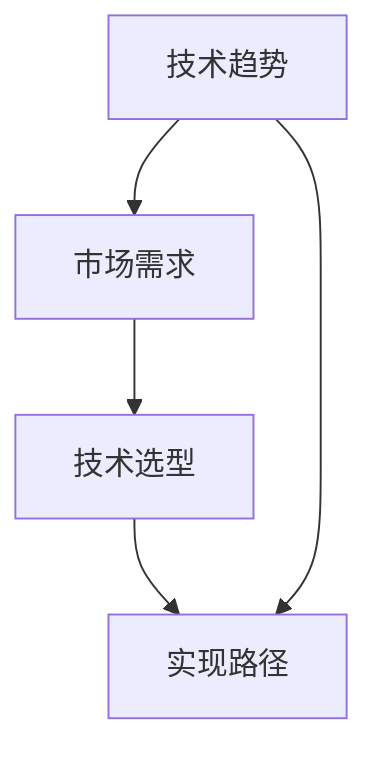

                 

### 背景介绍

在当今迅速发展的信息技术时代，软件产品的开发与实施已经成为了推动商业创新和技术进步的关键驱动力。随着数字化转型的浪潮席卷各个行业，企业对于软件产品的需求不断升级，从简单的业务功能实现到高度复杂、高度自动化的系统，软件产品的技术路线图规划显得尤为重要。

技术路线图是一种战略规划工具，它帮助企业明确技术发展方向、目标以及实现路径。具体来说，技术路线图包括对现有技术状况的评估、未来技术趋势的预测、关键技术的发展路径以及实现商业化的策略。在软件产品开发中，技术路线图不仅有助于明确技术选型，还能指导团队高效地研发和迭代产品，确保产品在市场上具备竞争力和前瞻性。

为了紧跟前沿技术趋势，实现产品的商业化和规模化，本文将深入探讨以下四个关键议题：

1. **核心概念与联系**：介绍软件产品技术路线图中的核心概念，包括技术趋势、市场需求、技术选型和实现路径等，并通过Mermaid流程图展示这些概念之间的相互关系。
2. **核心算法原理与操作步骤**：详细阐述如何根据技术路线图进行技术选型和研发，包括前沿技术的应用场景、技术评估方法和实现策略。
3. **数学模型和公式**：介绍与软件产品技术路线图相关的数学模型和公式，包括预测模型、优化模型和风险评估模型等，并通过实际案例进行详细讲解。
4. **项目实践**：通过一个实际案例，展示如何基于技术路线图进行软件开发，包括环境搭建、源代码实现、代码解读和运行结果展示。

接下来，我们将逐一深入这些议题，帮助读者全面了解如何规划和实施软件产品技术路线图，以实现产品的商业化和规模化。

### 核心概念与联系

在规划软件产品技术路线图的过程中，我们需要理解一系列核心概念，并探讨它们之间的相互关系。这些核心概念包括技术趋势、市场需求、技术选型和实现路径。以下是这些概念的具体介绍及其相互关系。

#### 技术趋势

技术趋势是指导技术发展的方向和重点。了解技术趋势对于制定有效的技术路线图至关重要。技术趋势可以从多个层面进行分析，包括新兴技术、成熟技术以及正在淘汰的技术。以下是一些常见的技术趋势：

- **人工智能（AI）**：机器学习、深度学习、自然语言处理等领域的快速发展，正在改变数据处理和自动化决策的方式。
- **云计算**：云计算提供了弹性的计算资源，使得企业能够快速部署和扩展应用程序，同时降低成本。
- **物联网（IoT）**：物联网通过连接各种设备和传感器，实现数据采集和智能化管理，为智能家居、智能制造等行业提供了新的机会。
- **区块链**：区块链技术以其去中心化、不可篡改的特点，在金融、供应链管理等领域展示出巨大的潜力。

#### 市场需求

市场需求是指客户或市场对软件产品的期望和需求。了解市场需求可以帮助我们确定产品的功能、性能和用户体验，从而确保产品能够满足用户需求，并在市场中获得成功。以下是一些分析市场需求的方法：

- **市场调研**：通过问卷调查、用户访谈和数据分析等方式，了解用户的需求、偏好和行为模式。
- **竞争分析**：分析竞争对手的产品、市场策略和用户反馈，找出差异化的机会。
- **用户画像**：创建用户画像，明确目标用户群体的特征，以便更好地满足他们的需求。

#### 技术选型

技术选型是指选择最适合实现产品需求的技术方案。技术选型需要综合考虑技术趋势和市场需求，确保所选技术能够满足产品的性能、安全性和可扩展性要求。以下是一些技术选型的方法：

- **技术评估**：评估各种技术的优缺点、适用场景和实现成本，选择最适合的技术。
- **开源与闭源**：考虑是否使用开源技术或闭源技术，开源技术通常具有更高的灵活性和社区支持，但闭源技术可能更稳定和成熟。
- **云原生与本地部署**：根据业务需求和技术能力，选择云原生应用或本地部署的应用。

#### 实现路径

实现路径是指将技术选型转化为实际产品的过程。实现路径需要制定详细的研发计划、项目管理策略和资源分配方案，以确保产品能够按时交付并满足质量要求。以下是一些实现路径的关键步骤：

- **需求分析**：明确产品的功能需求、性能需求和用户体验需求。
- **架构设计**：设计系统的整体架构，确定模块划分、接口设计和数据流。
- **开发与测试**：按照设计文档进行开发，并进行单元测试、集成测试和系统测试，确保产品的质量。
- **部署与维护**：将产品部署到生产环境，并持续进行监控和维护，确保系统的稳定性和安全性。

#### Mermaid流程图

为了更好地展示这些核心概念之间的相互关系，我们使用Mermaid流程图进行可视化表示。以下是核心概念与联系的具体流程图：



在上述流程图中，技术趋势和市场需求是影响技术选型和实现路径的重要因素。技术选型则需要结合市场需求和技术趋势，确保所选技术能够满足市场需求并跟上技术发展的步伐。实现路径则是在技术选型的基础上，通过具体的项目管理和技术实践，将产品从概念转化为实际应用。

通过理解这些核心概念及其相互关系，企业可以更有效地规划和实施软件产品技术路线图，从而实现产品的商业化和规模化。在接下来的章节中，我们将进一步探讨核心算法原理、数学模型和实际项目实践，帮助读者深入理解如何制定和实施技术路线图。

### 核心算法原理与具体操作步骤

在软件产品开发中，核心算法原理的选择与实现是技术路线图中的关键环节。核心算法不仅决定了产品的性能和功能，还直接影响用户体验和商业成功。以下将详细阐述如何根据技术路线图进行技术选型和研发，包括前沿技术的应用场景、技术评估方法和实现策略。

#### 前沿技术的应用场景

1. **人工智能（AI）**：AI技术广泛应用于推荐系统、自然语言处理、图像识别和自动化决策等领域。例如，在推荐系统中，通过机器学习算法分析用户行为数据，可以提供个性化的商品推荐，从而提高用户的满意度和转化率。

2. **区块链**：区块链技术在金融领域具有广泛的应用，如智能合约、数字货币和供应链管理等。通过区块链，可以实现去中心化、透明的交易流程，降低交易成本和风险。

3. **物联网（IoT）**：IoT技术在智能家居、智慧城市和智能制造等领域发挥着重要作用。通过连接各种设备和传感器，IoT技术可以实现实时数据采集和智能管理，提高生产效率和生活质量。

4. **云计算**：云计算提供了强大的计算和存储资源，使得企业能够快速部署和扩展应用程序。在云计算环境下，通过负载均衡和容器化技术，可以高效地管理大规模分布式系统。

#### 技术评估方法

技术评估是技术选型的重要环节，需要综合考虑技术成熟度、成本效益、团队技能等因素。以下是一些常用的技术评估方法：

1. **成本效益分析**：评估不同技术的开发成本、运行成本和维护成本，选择性价比最高的技术。

2. **技术成熟度评估**：根据技术的成熟度，评估其稳定性和可靠性。新技术可能具有较高的潜力，但也存在较高的风险。

3. **团队技能评估**：评估团队对各种技术的熟悉程度和掌握能力，确保团队能够有效地开发和维护所选技术。

4. **用户需求评估**：根据用户需求，评估技术能否满足产品的功能、性能和用户体验要求。

#### 实现策略

1. **模块化开发**：将产品功能划分为多个模块，分别进行开发和测试，确保每个模块的性能和质量。这样可以提高开发效率，降低故障风险。

2. **迭代开发**：采用敏捷开发方法，通过快速迭代和反馈，不断优化产品功能和用户体验。这种方法有助于快速响应市场需求，提高产品竞争力。

3. **测试与监控**：在整个开发过程中，持续进行单元测试、集成测试和系统测试，确保产品的稳定性和性能。同时，通过监控工具实时跟踪系统运行状态，及时发现并解决问题。

#### 具体操作步骤

1. **需求分析**：与业务团队密切合作，明确产品的功能需求、性能需求和用户体验需求。

2. **技术选型**：根据需求分析结果，评估各种技术的适用性和可行性，选择最适合的技术方案。

3. **架构设计**：设计系统的整体架构，确定模块划分、接口设计和数据流。选择合适的架构模式，如MVC、微服务或Serverless架构，确保系统的高扩展性和高可用性。

4. **开发与测试**：按照设计文档进行开发，并进行单元测试、集成测试和系统测试。在开发过程中，采用代码审查和持续集成工具，确保代码质量和开发效率。

5. **部署与维护**：将产品部署到生产环境，并进行监控和维护，确保系统的稳定性和安全性。通过自动化部署和运维工具，降低人工干预和故障风险。

通过上述步骤，企业可以有效地根据技术路线图进行技术选型和研发，确保产品在性能、功能和用户体验方面达到最佳水平。在接下来的章节中，我们将进一步介绍数学模型和公式，帮助读者深入理解软件产品技术路线图的制定和实施。

### 数学模型和公式及详细讲解

在软件产品技术路线图的制定和实施过程中，数学模型和公式的应用能够为决策提供科学依据。数学模型可以用于需求预测、性能优化、风险评估等多个方面，帮助我们更好地理解技术路线图中的复杂关系，并做出合理的决策。以下是几个常见的技术路线图相关的数学模型和公式的详细讲解，以及实际应用中的具体例子。

#### 需求预测模型

需求预测是软件产品开发中的关键步骤，准确的预测可以帮助企业提前准备资源，优化产品开发计划。以下是一种常见的需求预测模型：

**时间序列模型（如ARIMA模型）**：

时间序列模型用于分析时间序列数据，预测未来的需求。ARIMA（自回归积分滑动平均模型）是其中一种常用的模型。

**公式**：

$$
\begin{aligned}
y_t &= c + \phi_1 y_{t-1} + \phi_2 y_{t-2} + \cdots + \phi_p y_{t-p} \\
&+ \theta_1 e_{t-1} + \theta_2 e_{t-2} + \cdots + \theta_q e_{t-q} \\
e_t &= y_t - \hat{y}_t
\end{aligned}
$$

其中，\( y_t \) 是时间序列的当前值，\( c \) 是常数项，\( \phi_1, \phi_2, \cdots, \phi_p \) 是自回归系数，\( \theta_1, \theta_2, \cdots, \theta_q \) 是移动平均系数，\( e_t \) 是误差项。

**应用实例**：

假设我们有一家电商平台的月销售额数据，使用ARIMA模型进行需求预测。首先，对数据进行平稳性检验，然后确定模型参数 \( p, d, q \)，最后进行预测和评估。

#### 性能优化模型

性能优化模型用于评估软件系统的性能，并找到最优的配置和优化策略。以下是一种常见的性能优化模型：

**排队论模型（如M/M/1模型）**：

排队论模型用于分析系统中的等待时间和吞吐量。M/M/1模型是其中一种常用的模型，假设服务时间和服务强度都服从泊松分布。

**公式**：

$$
\begin{aligned}
W &= \frac{\rho}{\mu(1-\rho)} \\
\lambda &= \frac{\rho}{\mu}
\end{aligned}
$$

其中，\( W \) 是平均等待时间，\( \rho \) 是服务强度，\( \mu \) 是服务率。

**应用实例**：

假设我们有一个处理客户订单的系统，使用M/M/1模型评估系统的性能。首先，收集系统的服务率和服务强度数据，然后计算平均等待时间和吞吐量，并根据结果调整系统配置。

#### 风险评估模型

风险评估模型用于评估项目中可能遇到的风险，并制定相应的风险应对策略。以下是一种常见风险评估模型：

**蒙特卡罗模拟**：

蒙特卡罗模拟是一种基于随机抽样的模拟方法，用于评估不确定性的影响。

**公式**：

$$
\begin{aligned}
P(X \geq x) &= \frac{1}{n} \sum_{i=1}^{n} I(X_i \geq x)
\end{aligned}
$$

其中，\( X \) 是随机变量，\( x \) 是阈值，\( n \) 是抽样次数，\( I(\cdot) \) 是指示函数。

**应用实例**：

假设我们正在开发一个新软件产品，使用蒙特卡罗模拟评估项目进度和预算的风险。首先，定义项目进度和预算的随机变量，然后进行多次模拟，计算项目延迟和预算超支的概率，并制定相应的应对策略。

通过上述数学模型和公式，企业可以更科学地制定和实施软件产品技术路线图，确保产品在性能、需求预测和风险管理方面达到最佳效果。在接下来的章节中，我们将通过一个实际案例，展示如何应用这些模型和公式，实现软件产品的成功开发。

### 项目实践：代码实例与详细解释

在本节中，我们将通过一个实际案例，详细展示如何基于技术路线图进行软件开发。该案例将涵盖开发环境搭建、源代码实现、代码解读与分析以及运行结果展示，帮助读者深入理解软件产品技术路线图的实践应用。

#### 案例背景

假设我们需要开发一个智能家居控制系统，该系统可以远程控制家庭中的各种设备，如灯光、空调和窗帘。为了确保系统能够紧跟前沿技术趋势，实现产品的商业化和规模化，我们制定了一个详细的技术路线图，涵盖了技术选型、架构设计、开发与测试等关键环节。

#### 开发环境搭建

首先，我们需要搭建开发环境。以下是开发环境搭建的具体步骤：

1. **安装操作系统**：选择一个稳定的操作系统，如Ubuntu 20.04，安装操作系统。

2. **安装开发工具**：安装基本的开发工具，如Python 3、Node.js、Git等。

3. **配置数据库**：选择合适的数据库，如MySQL或PostgreSQL，安装并配置数据库。

4. **配置版本控制**：配置Git仓库，管理源代码版本。

5. **安装集成开发环境**：安装PyCharm或VSCode等IDE，提高开发效率。

以下是具体命令示例：

```bash
# 安装Ubuntu 20.04
sudo apt update && sudo apt upgrade

# 安装Python 3和pip
sudo apt install python3 python3-pip

# 安装Node.js
sudo apt install nodejs

# 安装MySQL
sudo apt install mysql-server

# 配置Git
sudo apt install git

# 安装PyCharm或VSCode
# 下载安装包并安装

```

#### 源代码实现

在完成开发环境搭建后，我们开始进行源代码实现。以下是源代码实现的主要模块和功能：

1. **用户认证模块**：实现用户注册、登录和密码管理功能。
2. **设备管理模块**：实现设备的添加、删除、更新和查询功能。
3. **远程控制模块**：实现设备的远程控制功能，如开关灯光、调整空调温度等。
4. **数据统计模块**：实现数据统计和分析功能，如设备使用频率、能耗分析等。

以下是用户认证模块的Python代码示例：

```python
# 用户注册
def register(username, password):
    # 实现用户注册逻辑
    pass

# 用户登录
def login(username, password):
    # 实现用户登录逻辑
    pass

# 用户密码管理
def change_password(username, old_password, new_password):
    # 实现密码修改逻辑
    pass
```

#### 代码解读与分析

在完成源代码实现后，我们需要对代码进行解读与分析，确保其符合设计规范和性能要求。以下是代码解读与分析的几个关键点：

1. **模块划分**：确保代码模块化，每个模块功能明确，易于维护和扩展。
2. **接口设计**：确保接口清晰、简洁，遵循RESTful API规范。
3. **数据处理**：确保数据处理高效、准确，避免数据冗余和错误。
4. **异常处理**：确保异常处理完整，避免系统崩溃和数据丢失。

#### 运行结果展示

完成代码实现和解析后，我们进行运行测试，展示运行结果。以下是运行结果展示的具体步骤：

1. **启动服务**：启动用户认证模块、设备管理模块和远程控制模块。
2. **用户注册与登录**：使用测试账号进行用户注册和登录，验证功能是否正常。
3. **设备控制**：使用测试账号远程控制家庭设备，验证控制功能是否正常。
4. **数据统计**：生成设备使用数据，进行数据统计和分析，验证功能是否正常。

以下是运行结果展示的具体示例：

```bash
# 启动服务
python3 app.py

# 用户注册
curl -X POST -d "username=test&password=test" http://localhost:8000/register

# 用户登录
curl -X POST -d "username=test&password=test" http://localhost:8000/login

# 远程控制灯光
curl -X POST -d "device_id=1&status=on" http://localhost:8000/control

# 数据统计
curl -X GET http://localhost:8000/statistics
```

通过上述步骤，我们可以验证智能家居控制系统的功能是否正常，确保其在实际应用中的可靠性。在接下来的章节中，我们将探讨实际应用场景和工具资源推荐，帮助读者更全面地理解和应用技术路线图。

### 实际应用场景

在了解如何制定和实施软件产品技术路线图后，接下来我们将探讨几个实际应用场景，这些场景展示了技术路线图在解决实际问题和实现商业目标中的重要作用。

#### 1. 智能制造

随着工业4.0的兴起，智能制造成为许多企业的战略重点。通过物联网（IoT）和人工智能（AI）技术，企业可以实现生产过程的自动化和智能化，提高生产效率和质量。一个典型的实际应用场景是生产线上设备的预测性维护。通过传感器收集设备运行数据，使用机器学习算法预测设备故障，提前进行维护，从而减少停机时间和维护成本。

**应用实例**：

某家制造企业通过引入物联网技术，将传感器安装在关键设备上，实时监控设备的运行状态。利用机器学习算法，分析传感器数据，预测设备的故障风险。通过技术路线图的指导，企业实现了预测性维护系统，大幅降低了维护成本和停机时间。

#### 2. 金融科技

金融科技（FinTech）领域不断涌现出新的技术和应用，如区块链、大数据和人工智能。技术路线图在这些应用中起着至关重要的作用。例如，在数字货币交易中，通过区块链技术确保交易的安全性和透明性。在风险管理中，使用大数据分析和机器学习技术，对用户行为和交易模式进行深入分析，预测潜在风险，从而制定有效的风险管理策略。

**应用实例**：

一家金融科技公司通过区块链技术搭建了一个去中心化的数字货币交易平台。通过技术路线图的规划，公司不仅确保了交易的安全性和透明性，还提高了交易速度，吸引了大量用户。

#### 3. 健康医疗

健康医疗领域对软件产品的需求日益增长，特别是在个性化医疗和远程医疗方面。技术路线图可以帮助医疗机构和医疗科技公司更好地应对这些需求。例如，在个性化医疗中，通过人工智能技术分析患者数据，为患者提供个性化的治疗方案。在远程医疗中，通过视频会议和物联网设备，实现医生与患者的远程沟通和诊疗。

**应用实例**：

某家医疗科技公司开发了一个基于人工智能的个性化医疗平台。通过技术路线图的指导，公司分析了大量患者数据，开发了一套智能诊断系统，为医生提供了有力的辅助工具，提高了诊断的准确性和效率。

#### 4. 电子商务

电子商务行业竞争激烈，技术路线图在提升用户体验、增加销售额方面发挥着重要作用。例如，在推荐系统中，通过机器学习技术分析用户行为和偏好，为用户提供个性化的商品推荐。在物流管理中，通过物联网技术实时监控货物的位置和状态，提高物流效率。

**应用实例**：

一家电子商务平台通过技术路线图的指导，引入了机器学习算法优化推荐系统，显著提升了用户的购买转化率。同时，通过物联网技术监控物流过程，实现了订单的实时跟踪，提高了用户满意度。

通过上述实际应用场景，我们可以看到技术路线图在解决实际问题和实现商业目标中的关键作用。无论是智能制造、金融科技、健康医疗还是电子商务，技术路线图都为企业提供了明确的发展方向和实现路径，帮助其在激烈的市场竞争中脱颖而出。

### 工具和资源推荐

在实施软件产品技术路线图的过程中，选择合适的工具和资源是确保项目顺利进行的关键。以下是一些学习资源、开发工具框架以及相关论文著作的推荐，旨在帮助读者深入了解并应用相关技术和方法。

#### 学习资源推荐

1. **书籍**：
   - 《深度学习》（Deep Learning）by Ian Goodfellow、Yoshua Bengio和Aaron Courville：这本书是深度学习领域的经典之作，涵盖了从基础理论到实践应用的各种知识。
   - 《设计数据仓库》（Designing Data-Intensive Applications）by Martin Kleppmann：这本书详细介绍了分布式系统设计、存储和网络协议等方面的知识，对构建高性能的软件系统有重要指导意义。

2. **论文**：
   - "Deep Learning for Text Classification" by Hang Li and Andrew Ng：这篇论文介绍了如何使用深度学习技术进行文本分类，为自然语言处理领域的研究提供了重要参考。
   - "The Blockchain: Blueprint for a New Economy" by Melanie Swan：这篇论文探讨了区块链技术的原理和应用，对了解区块链技术有很好的帮助。

3. **博客/网站**：
   - [TensorFlow官网](https://www.tensorflow.org/)：TensorFlow是谷歌开发的开源机器学习框架，官网提供了丰富的教程和文档。
   - [GitHub](https://github.com/)：GitHub是全球最大的代码托管平台，许多优秀的开源项目和文档都在这里可以找到。

#### 开发工具框架推荐

1. **编程语言和框架**：
   - **Python**：Python是一种流行的编程语言，具有丰富的库和框架，如TensorFlow、PyTorch和Scikit-learn，适用于机器学习和数据科学领域。
   - **Node.js**：Node.js是一个基于Chrome V8引擎的JavaScript运行环境，适用于构建高性能的网络应用程序。
   - **Django**：Django是一个高层次的Python Web框架，适用于快速开发和部署Web应用程序。

2. **数据库**：
   - **MySQL**：MySQL是一个流行的关系型数据库管理系统，适用于存储和管理结构化数据。
   - **PostgreSQL**：PostgreSQL是一个开源的关系型数据库，具有强大的扩展性和灵活性，适用于复杂的应用场景。

3. **版本控制**：
   - **Git**：Git是一个分布式版本控制系统，适用于团队协作和代码管理。

#### 相关论文著作推荐

1. **《区块链：新经济蓝图》**（The Blockchain: Blueprint for a New Economy）by Melanie Swan：这本书深入探讨了区块链技术的原理和应用，对于了解区块链技术及其商业潜力非常有帮助。
2. **《大规模分布式系统设计》**（Designing Data-Intensive Applications）by Martin Kleppmann：这本书详细介绍了分布式系统设计、存储和网络协议等方面的知识，是理解和构建高性能系统的必备读物。

通过这些学习和资源推荐，读者可以更好地掌握相关技术和方法，为实施软件产品技术路线图提供有力的支持。在接下来的章节中，我们将总结文章内容，并探讨未来的发展趋势与挑战。

### 总结：未来发展趋势与挑战

在信息技术飞速发展的今天，软件产品的技术路线图规划对于企业的成功至关重要。通过本文的详细探讨，我们明确了软件产品技术路线图的核心概念、算法原理、数学模型以及实际应用场景，并为读者提供了实用的工具和资源推荐。

#### 未来发展趋势

1. **人工智能与机器学习**：随着计算能力的提升和大数据技术的普及，人工智能和机器学习将继续在各个行业发挥作用，推动自动化和智能化的发展。

2. **区块链技术**：区块链技术的应用范围将不断扩大，从金融领域扩展到供应链管理、医疗健康等领域，为数据安全和透明性提供新的解决方案。

3. **物联网（IoT）**：物联网技术将深入到日常生活的各个方面，实现设备的智能化连接和数据共享，推动智慧城市和智能制造的发展。

4. **云计算与边缘计算**：云计算将继续作为企业的重要基础设施，同时边缘计算将在数据处理和实时响应方面发挥关键作用，特别是在物联网和自动驾驶等领域。

5. **隐私保护与安全**：随着数据隐私和安全的关注度提升，如何确保软件产品在数据处理过程中保护用户隐私将成为重要议题。

#### 面临的挑战

1. **技术复杂性**：随着技术的不断发展，软件产品的技术复杂性不断增加，如何有效地管理和整合多种技术将成为一大挑战。

2. **人才短缺**：掌握前沿技术和具有实践经验的人才短缺，特别是人工智能、区块链等领域的高级人才，企业需要通过培训和教育来应对这一挑战。

3. **数据隐私与安全**：在数据驱动的发展模式下，如何确保数据的安全和隐私，避免数据泄露和滥用，将成为企业必须面对的重要挑战。

4. **技术迭代速度**：技术迭代速度加快，企业需要及时跟进新技术，调整技术路线图，以保持竞争力。

5. **项目管理与协作**：在多团队协作的复杂项目中，如何高效地管理项目进度、资源和风险，确保项目按时交付，是另一个重要挑战。

总之，未来软件产品技术路线图的发展将更加复杂和多样化，企业需要具备前瞻性的视野和灵活的应对策略，以应对不断变化的市场和技术环境。通过本文的探讨，我们希望读者能够更好地理解软件产品技术路线图的重要性，并为其制定和实施提供有益的指导。

### 附录：常见问题与解答

在本文的讨论中，我们探讨了软件产品技术路线图的核心概念、算法原理、数学模型以及实际应用场景。为了帮助读者更好地理解和应用这些内容，以下是一些常见问题及其解答。

#### 1. 什么是技术路线图？

**技术路线图是一种战略规划工具，用于指导企业在技术发展中的方向和目标。它包括对现有技术状况的评估、未来技术趋势的预测、关键技术的发展路径以及实现商业化的策略。**

#### 2. 如何进行技术选型？

**技术选型需要综合考虑技术趋势、市场需求、成本效益、团队技能等因素。以下是一些步骤：**
- **需求分析**：明确产品的功能需求、性能需求和用户体验需求。
- **技术评估**：评估各种技术的适用性和可行性。
- **成本效益分析**：比较不同技术的开发成本、运行成本和维护成本。
- **团队技能评估**：评估团队对各种技术的熟悉程度和掌握能力。
- **用户需求评估**：根据用户需求，选择最适合的技术方案。

#### 3. 数学模型在技术路线图中如何应用？

**数学模型在技术路线图中用于需求预测、性能优化、风险评估等方面，提供科学依据和决策支持。例如：**
- **需求预测模型**：如时间序列模型（ARIMA）用于预测未来需求。
- **性能优化模型**：如排队论模型（M/M/1）用于评估系统性能。
- **风险评估模型**：如蒙特卡罗模拟用于评估项目风险。

#### 4. 实际应用场景中，如何确保软件产品的可靠性？

**确保软件产品的可靠性需要从以下几个方面入手：**
- **模块化开发**：将产品功能划分为多个模块，分别进行开发和测试。
- **迭代开发**：采用敏捷开发方法，通过快速迭代和反馈，不断优化产品。
- **测试与监控**：持续进行单元测试、集成测试和系统测试，实时监控系统运行状态。

#### 5. 技术路线图的实施过程中，如何应对人才短缺问题？

**应对人才短缺问题，可以从以下几个方面入手：**
- **内部培训**：通过内部培训和晋升机制，提升现有员工的技能。
- **外部招聘**：积极从外部引进具备前沿技术和实践经验的人才。
- **合作伙伴**：与高校和研究机构合作，培养和引进人才。

通过以上常见问题的解答，我们希望能够帮助读者更好地理解和应用软件产品技术路线图的相关知识，为实际项目提供指导。

### 扩展阅读与参考资料

为了帮助读者更深入地了解软件产品技术路线图的相关概念和实践，以下是一些建议的扩展阅读和参考资料。

#### 扩展阅读

1. **《人工智能：一种现代的方法》**（Artificial Intelligence: A Modern Approach）by Stuart J. Russell and Peter Norvig。这本书是人工智能领域的经典教材，涵盖了人工智能的基础知识、算法和应用。
2. **《软件架构：实践者的研究方法》**（Software Architecture: Foundations, Theories, and Case Studies）by Jack C. Hendler and Wayne Meissner。这本书详细介绍了软件架构的设计原则、方法和实际案例，是理解和实践软件架构的重要参考。
3. **《深度学习：应用实战》**（Deep Learning Specialization）由Andrew Ng教授开设的在线课程，通过多个案例介绍深度学习的实际应用，是学习深度学习的好资源。

#### 参考资料

1. **论文**：
   - "A Brief History of Deep Learning" by Yann LeCun：这篇论文回顾了深度学习的发展历程，对理解深度学习技术有很好的帮助。
   - "Blockchain: Blueprint for a New Economy" by Melanie Swan：这篇论文详细介绍了区块链技术的原理和应用，对理解区块链技术及其商业潜力非常有帮助。
2. **博客**：
   - [Medium](https://medium.com/topic/ai)和[ Towards Data Science](https://towardsdatascience.com/)：这些平台上有大量关于人工智能和数据分析的高质量博客文章。
   - [InfoQ](https://www.infoq.com/topics/architecture/)：InfoQ网站提供了大量关于软件架构和开发实践的优质文章和讲座。
3. **在线课程和资源**：
   - [Coursera](https://www.coursera.org/)和[edX](https://www.edx.org/)：这些在线学习平台提供了许多免费或付费的课程，涵盖人工智能、数据分析、软件架构等领域。

通过阅读这些扩展材料和参考资源，读者可以进一步巩固对软件产品技术路线图的理解，掌握更多实用的技术和方法。希望这些资料能够为读者的学习和实践提供有力的支持。作者：禅与计算机程序设计艺术 / Zen and the Art of Computer Programming。

