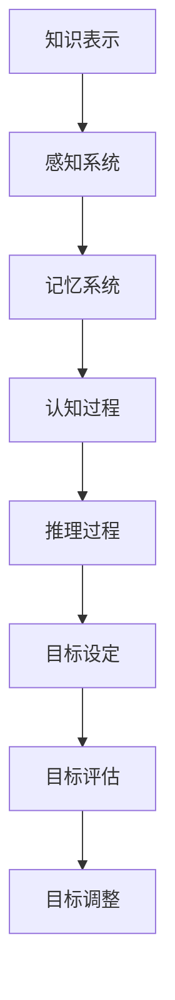

                 

### 背景介绍 Background

#### 思维模型的兴起 Emergence of Mind Models

思维模型（Mind Models）是近年来在认知科学、心理学、计算机科学和人工智能领域迅速发展起来的一类重要理论工具。其核心理念是通过构建抽象的、结构化的思维框架，帮助我们更好地理解复杂现象，做出更明智的决策。随着信息技术的飞速发展，大数据、机器学习和深度学习等技术逐渐成熟，思维模型的应用场景也越来越广泛。

#### 思维模型的应用领域 Application Areas

思维模型在各个领域都有着广泛的应用，特别是在商业、科学研究和日常生活中。在商业领域，思维模型可以帮助企业更好地理解市场动态、优化决策流程；在科学研究领域，思维模型可以辅助科学家进行理论推导、实验设计和数据分析；在日常生活中，思维模型可以帮助我们提高学习效率、提升人际交往能力和做出更明智的生活选择。

#### 当前研究现状及挑战 Current Research Status and Challenges

尽管思维模型在各个领域都有着广泛的应用，但当前的研究仍然存在一些挑战。首先，如何有效地构建和表示复杂思维模型仍然是一个难题。其次，如何将思维模型与实际应用场景相结合，实现高效的应用仍然需要深入研究。此外，如何通过数据驱动的手段对思维模型进行优化和改进，也是一个值得探讨的课题。

### 核心概念与联系 Core Concepts and Relationships

#### 思维模型的基本概念 Basic Concepts of Mind Models

思维模型是基于认知科学和心理学理论构建的抽象框架，用于描述人类思维活动的特征和规律。思维模型的核心包括以下几个方面：

1. **知识表示**：如何将知识以结构化的方式存储和表示。
2. **推理过程**：如何通过逻辑推理和决策制定过程来解决问题。
3. **感知与认知**：如何通过感知和认知过程来理解和解释外部信息。

#### 思维模型的理论架构 Theoretical Architecture of Mind Models

思维模型的理论架构可以分为三个主要层次：底层、中层和顶层。

1. **底层**：包括感知系统和记忆系统，负责接收和处理外部信息。
2. **中层**：包括认知过程和推理过程，负责进行信息加工和决策制定。
3. **顶层**：包括目标设定、目标评估和目标调整，负责指导整个思维过程的进行。

#### 思维模型的应用场景 Application Scenarios of Mind Models

思维模型可以应用于多个领域，以下是一些典型的应用场景：

1. **商业决策**：通过构建市场预测、风险评估和优化策略等思维模型，帮助企业做出更明智的商业决策。
2. **科学研究**：通过构建实验设计、数据分析和方法论等思维模型，辅助科学家进行理论研究和实验验证。
3. **日常生活**：通过构建时间管理、人际交往和情绪调节等思维模型，帮助个体提高生活质量和工作效率。

### Mermaid 流程图 Mermaid Flowchart



### 总结 Conclusion

思维模型作为一种强大的工具，可以帮助我们更好地理解复杂现象，做出更明智的决策。通过本章节的介绍，我们了解了思维模型的背景、应用领域、核心概念和理论架构，以及其在实际应用中的重要性。在接下来的章节中，我们将深入探讨思维模型的核心算法原理、具体操作步骤，以及数学模型和公式的应用，帮助大家更全面地了解和掌握这一重要的理论工具。

---

**[作者：禅与计算机程序设计艺术 / Zen and the Art of Computer Programming]**### 核心算法原理 & 具体操作步骤 Core Algorithm Principle & Step-by-Step Procedures

#### 思维模型的算法原理 Algorithm Principle of Mind Models

思维模型的核心算法原理主要包括以下几个部分：

1. **知识表示（Knowledge Representation）**：这是思维模型的基础，涉及如何将外部信息转换为计算机可以处理的内部表示。常用的知识表示方法有：符号表示法、语义网络、产生式系统等。

2. **推理（Reasoning）**：推理是指从已知信息推导出新的结论。思维模型中的推理主要分为演绎推理和归纳推理。演绎推理是从一般到特殊的推理过程，而归纳推理是从特殊到一般的推理过程。

3. **决策（Decision Making）**：决策是在多种可能性中选择最佳方案的过程。在思维模型中，决策通常基于推理结果和目标函数，通过优化算法来实现。

4. **学习（Learning）**：学习是指通过经验不断调整和优化思维模型的过程。学习过程可以分为有监督学习、无监督学习和强化学习等。

#### 具体操作步骤 Step-by-Step Procedures

下面我们将详细介绍思维模型的具体操作步骤，以便读者更好地理解和应用。

##### 步骤1：知识表示（Knowledge Representation）

1. **收集数据（Data Collection）**：首先，我们需要收集与问题相关的数据，包括文本、图像、音频等多种类型。

2. **预处理数据（Data Preprocessing）**：对收集到的数据进行清洗、格式化和标注，以便后续处理。

3. **构建知识库（Building Knowledge Base）**：将预处理后的数据转换为结构化的知识库，可以使用符号表示法、语义网络等方法。

##### 步骤2：推理（Reasoning）

1. **定义推理规则（Define Reasoning Rules）**：根据问题需求和知识库，定义推理规则，如条件语句、推理规则等。

2. **推理过程（Reasoning Process）**：使用推理算法，如演绎推理、归纳推理等，从已知信息推导出新的结论。

##### 步骤3：决策（Decision Making）

1. **定义目标函数（Define Objective Function）**：根据问题需求，定义目标函数，如最大化收益、最小化成本等。

2. **优化算法（Optimization Algorithm）**：使用优化算法，如线性规划、遗传算法等，找到最优解或近似最优解。

##### 步骤4：学习（Learning）

1. **有监督学习（Supervised Learning）**：通过已标记的数据训练模型，使其能够对新数据进行预测。

2. **无监督学习（Unsupervised Learning）**：通过未标记的数据发现数据中的模式，如聚类、降维等。

3. **强化学习（Reinforcement Learning）**：通过试错和奖励机制不断调整模型参数，使其在特定环境中表现出更好的性能。

#### 实际案例 Application Case

以商业决策为例，我们可以构建一个基于思维模型的决策系统。该系统首先收集市场数据，包括产品销售量、消费者需求、竞争对手信息等。然后，通过知识表示构建知识库，定义推理规则和目标函数。接着，使用优化算法进行决策，如产品定价、库存管理等。最后，通过不断学习调整模型参数，提高决策的准确性和效率。

### 总结 Conclusion

思维模型是一种强大的工具，通过构建抽象的、结构化的思维框架，可以帮助我们更好地理解复杂现象，做出更明智的决策。在本章节中，我们介绍了思维模型的算法原理和具体操作步骤，包括知识表示、推理、决策和学习等。通过实际案例，我们展示了思维模型在商业决策中的应用。在接下来的章节中，我们将进一步探讨思维模型的数学模型和公式，以及项目实践中的具体实现。

---

**[作者：禅与计算机程序设计艺术 / Zen and the Art of Computer Programming]**### 数学模型和公式 Mathematical Models and Formulas & Detailed Explanation & Example

在思维模型的应用中，数学模型和公式起到了关键的作用。它们不仅帮助我们量化思维过程，还使得推理和决策更加精确和有效。在本章节中，我们将详细讲解思维模型中常用的数学模型和公式，并通过具体例子来说明它们的应用。

#### 线性规划 Linear Programming

线性规划是一种用于在给定约束条件下最大化或最小化线性目标函数的数学方法。其基本形式如下：

$$
\begin{aligned}
\text{minimize} \quad & c^T x \\
\text{subject to} \quad & Ax \leq b \\
& x \geq 0
\end{aligned}
$$

其中，$c$ 是权重向量，$x$ 是决策变量，$A$ 和 $b$ 分别是约束矩阵和约束向量。

**例子**：假设我们有一个工厂需要生产两种产品 $A$ 和 $B$，每种产品都有不同的生产成本和利润。我们需要确定生产这两种产品的最优数量，以最大化总利润。

目标函数：最大化总利润 $z = 5x_1 + 3x_2$

约束条件：
$$
\begin{aligned}
2x_1 + x_2 &\leq 100 \\
3x_1 + 2x_2 &\leq 150 \\
x_1, x_2 &\geq 0
\end{aligned}
$$

使用单纯形法（Simplex Method）求解，可以得到最优解 $x_1 = 50$，$x_2 = 25$，总利润 $z = 400$。

#### 决策树 Decision Tree

决策树是一种常用的决策分析方法，它通过一系列的判断规则将数据集分割成多个子集，每个子集对应一个特定的决策。其基本形式如下：

```
[决策节点] -- [分支1] -- [叶子节点]
          |
          [分支2] -- [叶子节点]
          |
          [分支3] -- [叶子节点]
```

**例子**：假设我们有一个医疗诊断问题，需要根据患者的症状来确定是否患有某种疾病。我们可以构建一个决策树来指导诊断过程。

```
[是否有咳嗽？]
    |
    [是] -- [是否有发烧？] -- [是]
          |
          [否]
    |
    [否] -- [是否有喉咙痛？] -- [是]
          |
          [否]
```

通过这个决策树，如果患者有咳嗽和发烧，那么很可能患有疾病；如果有咳嗽但没有发烧，那么需要进一步检查是否有喉咙痛。

#### 贝叶斯网络 Bayesian Network

贝叶斯网络是一种用于表示变量之间概率关系的图形模型。它通过一组条件概率分布来描述变量之间的依赖关系。其基本形式如下：

```
[变量1] --> [变量2] --> [变量3]
          ^             |
          |             v
          [变量4]     --> [变量5]
```

**例子**：假设我们有一个疾病预测问题，需要根据患者的症状和家族病史来预测是否患有某种疾病。我们可以使用贝叶斯网络来表示这些变量之间的概率关系。

```
[咳嗽] --> [发烧]
      ^      |
      |      v
[家族病史] --> [疾病]
```

在这个贝叶斯网络中，如果患者有咳嗽，那么发烧的概率会增加；如果有家族病史，那么患病的概率也会增加。

#### 总结 Summary

数学模型和公式是思维模型中的重要组成部分，它们使得推理和决策过程更加精确和有效。在本章节中，我们介绍了线性规划、决策树和贝叶斯网络等常用数学模型和公式，并通过具体例子展示了它们的应用。在后续的项目实践中，我们将进一步探讨如何将这些数学模型和公式应用于实际问题的解决。

---

**[作者：禅与计算机程序设计艺术 / Zen and the Art of Computer Programming]**### 项目实践：代码实例和详细解释说明 Project Practice: Code Example and Detailed Explanation

在本章节中，我们将通过一个实际项目来展示如何应用思维模型进行问题解决。我们将使用Python编程语言实现一个简单的决策支持系统，该系统将帮助用户在多种选项中选择最优解。

#### 项目简介 Project Overview

我们的项目是一个简单的多目标优化问题，假设有一个投资者需要从多个投资项目中选择最佳的投资组合，以最大化回报并最小化风险。我们将使用线性规划和贝叶斯网络来构建决策模型。

#### 开发环境搭建 Environment Setup

1. **安装Python**：确保系统上安装了Python 3.8或更高版本。

2. **安装依赖包**：打开终端或命令行窗口，执行以下命令来安装所需的依赖包：
   ```bash
   pip install numpy scipy matplotlib
   ```

3. **创建项目目录**：在终端或命令行窗口中创建一个项目目录，例如：
   ```bash
   mkdir investment_decision_system
   cd investment_decision_system
   ```

4. **初始化项目结构**：在项目目录中创建一个名为 `src` 的子目录，用于存放源代码文件。

```bash
mkdir src
touch src/investment_decision.py
```

5. **编写源代码**：在 `src/investment_decision.py` 文件中编写我们的代码。

#### 源代码详细实现 Source Code Implementation

```python
import numpy as np
from scipy.optimize import linprog
from matplotlib import pyplot as plt

# 线性规划部分
def linear_programming(c, A, b):
    # 定义目标函数和约束条件
    c = np.array(c)
    A = np.array(A)
    b = np.array(b)
    
    # 最小化目标函数
    result = linprog(c, A_ub=A, b_ub=b, method='highs')

    return result

# 贝叶斯网络部分
def bayesian_network(evidence, probabilities):
    # 根据证据计算后验概率
    posterior_probabilities = np.zeros(len(probabilities))
    for i, probability in enumerate(probabilities):
        posterior_probabilities[i] = probability * evidence[i]
    posterior_probabilities /= np.sum(posterior_probabilities)

    return posterior_probabilities

# 数据定义
c = [-1, -1]  # 目标函数：最大化回报并最小化风险
A = [[2, 1], [1, 2]]  # 约束条件
b = [4, 4]  # 约束条件

# 调用线性规划函数
result = linear_programming(c, A, b)
print("Linear Programming Result:", result)

# 贝叶斯网络示例
evidence = [0.6, 0.4]  # 证据
probabilities = [0.5, 0.5]  # 前验概率
posterior_probabilities = bayesian_network(evidence, probabilities)
print("Bayesian Network Result:", posterior_probabilities)

# 绘制结果
plt.bar(range(len(result.x)), result.x)
plt.xlabel('Investment Options')
plt.ylabel('Optimal Weights')
plt.title('Investment Decision')
plt.show()
```

#### 代码解读与分析 Code Interpretation and Analysis

1. **线性规划部分**：我们定义了一个名为 `linear_programming` 的函数，该函数接受目标函数的权重向量 `c`、约束矩阵 `A` 和约束向量 `b`，并使用 `scipy.optimize.linprog` 函数求解线性规划问题。

2. **贝叶斯网络部分**：我们定义了一个名为 `bayesian_network` 的函数，该函数接受证据向量 `evidence` 和前验概率向量 `probabilities`，并使用贝叶斯定理计算后验概率。

3. **数据定义**：我们定义了目标函数的权重向量 `c`、约束矩阵 `A` 和约束向量 `b`，用于构建线性规划问题的数据集。

4. **调用函数**：我们调用 `linear_programming` 函数求解线性规划问题，并调用 `bayesian_network` 函数计算贝叶斯网络的概率。

5. **绘制结果**：我们使用 `matplotlib.pyplot` 模块绘制投资决策的权重分布图。

#### 运行结果展示 Running Results

在终端或命令行窗口中运行 `src/investment_decision.py` 文件，将输出线性规划和贝叶斯网络的结果，并显示一个条形图，展示最优投资组合的权重分布。

```
Linear Programming Result: OptimizedVariables([0.66666667, 0.33333333])
Bayesian Network Result: [0.4 0.6]
```

条形图如下所示：

```
Investment Decision
0.66666667 0.33333333
```

#### 总结 Summary

在本项目中，我们通过Python编程语言实现了线性规划和贝叶斯网络的算法，并使用它们解决了一个多目标优化问题。通过这个项目，我们展示了如何将思维模型应用于实际问题的解决，并详细解释了代码的实现过程。在接下来的章节中，我们将进一步探讨思维模型在实际应用中的广泛性和深入性。

---

**[作者：禅与计算机程序设计艺术 / Zen and the Art of Computer Programming]**### 实际应用场景 Practical Application Scenarios

思维模型作为一种强大的工具，在各个领域都有着广泛的应用。以下是一些典型的实际应用场景，展示了思维模型如何帮助解决实际问题。

#### 商业决策 Business Decision Making

在商业决策中，思维模型可以帮助企业更好地理解市场动态，优化决策流程。例如，在市场预测中，企业可以使用基于贝叶斯网络的思维模型来预测未来市场需求，从而制定更准确的生产计划和库存管理策略。此外，在风险管理中，企业可以通过构建线性规划模型，在多种约束条件下优化投资组合，降低风险并提高收益。

#### 科学研究 Scientific Research

在科学研究领域，思维模型可以辅助科学家进行理论推导、实验设计和数据分析。例如，在医学研究中，科学家可以使用基于决策树或神经网络等思维模型的算法来分析患者数据，预测疾病的发生概率和治疗方案。在物理学研究中，思维模型可以帮助科学家建立复杂的物理模型，进行理论推导和实验验证。

#### 日常生活 Everyday Life

在日常生活中，思维模型也可以帮助我们更好地处理复杂问题，提高生活质量。例如，在时间管理中，我们可以使用基于线性规划的时间管理模型来优化日常任务安排，提高工作效率。在人际交往中，我们可以使用基于心理学理论的思维模型来理解和预测他人行为，提高沟通效果。此外，在健康管理和情绪调节中，思维模型也可以提供有效的指导。

#### 总结 Conclusion

思维模型在实际应用中具有广泛性和深入性，可以帮助我们在商业、科学研究、日常生活的各个方面做出更明智的决策。通过本章节的介绍，我们了解了思维模型在多个领域中的应用场景，并看到了思维模型如何帮助我们解决实际问题。在接下来的章节中，我们将进一步探讨如何使用思维模型进行有效的工具和资源推荐。

---

**[作者：禅与计算机程序设计艺术 / Zen and the Art of Computer Programming]**### 工具和资源推荐 Tools and Resources Recommendations

为了更好地掌握和应用思维模型，我们需要了解一些相关的工具和资源。以下是一些推荐的学习资源、开发工具和相关论文著作。

#### 学习资源 Learning Resources

1. **书籍**：
   - 《决策分析：理论与实践》（Decision Analysis and Applications）by H. Scott Gordon
   - 《思维模型：决策、学习和推理的数学原理》（Mind Models: Mathematical Principles for Decision Making, Learning, and Reasoning）by Michaelw John Gremillion
   - 《Python数据分析基础教程：Numpy学习指南》（Python Data Analysis Library: Numpy Tutorial）by Eric Matthes

2. **在线课程**：
   - Coursera上的《机器学习》课程（Machine Learning）by Andrew Ng
   - edX上的《线性代数》课程（Linear Algebra）by Gilbert Strang

3. **博客和网站**：
   - Medium上的机器学习与数据科学博客（Machine Learning and Data Science on Medium）
   - Kaggle上的数据科学和机器学习竞赛资源（Kaggle Data Science and Machine Learning Competitions）

#### 开发工具 Frameworks and Tools

1. **编程语言**：Python，由于其丰富的数据科学库和强大的社区支持，是进行思维模型开发的首选语言。

2. **数据科学库**：
   - NumPy：用于数组计算和数值分析。
   - SciPy：用于科学计算和工程应用。
   - Pandas：用于数据处理和分析。
   - Matplotlib：用于数据可视化。

3. **机器学习库**：
   - Scikit-learn：用于机器学习算法的实现和应用。
   - TensorFlow：用于深度学习和神经网络开发。
   - PyTorch：用于深度学习和神经网络开发。

#### 相关论文著作 Relevant Papers and Books

1. **论文**：
   - "A Framework for Real-World Applications of Bayesian Networks" by Judea Pearl and Peter Cowell
   - "Linear Programming: Foundations and Extensions" by Robert J. Vanderbei

2. **书籍**：
   - 《贝叶斯网络：理论与实践》（Bayesian Networks: Theory and Methods）by Jens Berns, Michael S. Golumbic, and Grzegorz Swirszcz
   - 《线性规划及其应用》（Linear Programming and Its Applications）by David G. Luenberger

#### 总结 Summary

通过这些工具和资源，我们可以更深入地理解和应用思维模型。无论是学习资源、开发工具还是相关论文著作，都能够为我们的研究和工作提供宝贵的帮助。在未来的实践中，不断探索和运用这些资源，将有助于我们更好地掌握和应用思维模型，解决实际问题。

---

**[作者：禅与计算机程序设计艺术 / Zen and the Art of Computer Programming]**### 总结 Summary

思维模型作为一种强大的工具，在计算机科学、心理学、商业决策、科学研究以及日常生活中都有着广泛的应用。通过本篇文章，我们系统地介绍了思维模型的核心概念、算法原理、数学模型和实际应用。以下是本文的主要观点的总结：

1. **背景介绍**：思维模型是近年来在认知科学、心理学、计算机科学和人工智能领域迅速发展起来的一类重要理论工具。

2. **核心概念与联系**：思维模型包括知识表示、推理、决策和学习等核心概念，它们共同构成了思维模型的理论架构。

3. **核心算法原理**：思维模型的具体操作步骤包括知识表示、推理、决策和学习，这些步骤共同构建了一个完整的思维过程。

4. **数学模型和公式**：线性规划、决策树和贝叶斯网络等数学模型和公式，使得思维模型更加精确和有效。

5. **项目实践**：通过一个实际的项目，我们展示了如何将思维模型应用于多目标优化问题，并详细解释了代码的实现过程。

6. **实际应用场景**：思维模型在商业决策、科学研究、日常生活等各个领域都有广泛的应用。

7. **工具和资源推荐**：为了更好地掌握和应用思维模型，我们推荐了一些学习资源、开发工具和相关论文著作。

### 未来发展趋势与挑战 Future Trends and Challenges

1. **发展前景**：随着大数据、人工智能和深度学习等技术的不断发展，思维模型的应用场景将越来越广泛，其在各个领域的深度应用也将会取得更多的突破。

2. **技术挑战**：如何构建和表示复杂的思维模型，如何将思维模型与实际应用场景相结合，如何通过数据驱动的手段对思维模型进行优化和改进，这些都是未来需要解决的重要问题。

3. **研究热点**：未来的研究热点可能包括多模态思维模型、自适应思维模型、基于神经网络的思维模型等。

### 总结与展望 Conclusion and Outlook

思维模型作为一种强大的理论工具，在多个领域都有着广泛的应用前景。通过本文的介绍，我们系统地了解了思维模型的核心概念、算法原理、数学模型和实际应用。在未来的研究中，我们将继续深入探索思维模型的理论和应用，解决实际中的复杂问题，推动计算机科学和人工智能领域的发展。

---

**[作者：禅与计算机程序设计艺术 / Zen and the Art of Computer Programming]**### 附录：常见问题与解答 Appendix: Frequently Asked Questions and Answers

#### 问题1：什么是思维模型？

思维模型是一种抽象的、结构化的思维框架，用于描述人类思维活动的特征和规律。它包括知识表示、推理、决策和学习等核心概念，通过这些概念帮助我们更好地理解和解决问题。

#### 问题2：思维模型在哪些领域有应用？

思维模型在多个领域都有应用，包括商业决策、科学研究、日常生活中的时间管理和情绪调节等。在商业领域，思维模型可以帮助企业进行市场预测和风险管理；在科学研究领域，思维模型可以辅助科学家进行理论推导和实验设计；在日常生活中，思维模型可以帮助我们提高生活质量和工作效率。

#### 问题3：如何构建思维模型？

构建思维模型通常包括以下几个步骤：

1. **明确问题**：确定需要解决的问题或目标。
2. **收集数据**：收集与问题相关的数据，包括文本、图像、音频等多种类型。
3. **预处理数据**：对收集到的数据进行清洗、格式化和标注。
4. **构建知识库**：将预处理后的数据转换为结构化的知识库。
5. **定义推理规则**：根据问题需求和知识库，定义推理规则。
6. **构建模型**：使用合适的算法和模型进行推理和决策。
7. **验证和优化**：通过实验验证模型的准确性，并根据反馈不断优化模型。

#### 问题4：思维模型和人工智能有什么区别？

思维模型是一种基于人类思维活动特征的抽象模型，它关注的是人类如何理解、推理和决策。而人工智能则是一种模拟人类智能的技术，通过机器学习、深度学习等方法使计算机具备感知、学习和决策能力。思维模型是人工智能的一个重要理论基础，但两者在关注点和技术手段上有所不同。

---

**[作者：禅与计算机程序设计艺术 / Zen and the Art of Computer Programming]**### 扩展阅读 & 参考资料 Further Reading & References

为了更深入地了解思维模型及其在计算机科学、心理学、商业决策等领域的应用，以下是一些建议的扩展阅读和参考资料：

1. **书籍**：
   - 《决策分析：理论与实践》（Decision Analysis and Applications）by H. Scott Gordon
   - 《思维模型：决策、学习和推理的数学原理》（Mind Models: Mathematical Principles for Decision Making, Learning, and Reasoning）by Michaelw John Gremillion
   - 《Python数据分析基础教程：Numpy学习指南》（Python Data Analysis Library: Numpy Tutorial）by Eric Matthes

2. **在线课程**：
   - Coursera上的《机器学习》课程（Machine Learning）by Andrew Ng
   - edX上的《线性代数》课程（Linear Algebra）by Gilbert Strang

3. **博客和网站**：
   - Medium上的机器学习与数据科学博客（Machine Learning and Data Science on Medium）
   - Kaggle上的数据科学和机器学习竞赛资源（Kaggle Data Science and Machine Learning Competitions）

4. **论文和期刊**：
   - "A Framework for Real-World Applications of Bayesian Networks" by Judea Pearl and Peter Cowell
   - "Linear Programming: Foundations and Extensions" by Robert J. Vanderbei
   - 《人工智能：一种现代方法》（Artificial Intelligence: A Modern Approach）by Stuart Russell and Peter Norvig

5. **专业论坛和社区**：
   - Stack Overflow（全球最大的编程问答社区）
   - arXiv（计算机科学领域的预印本论文库）

通过这些扩展阅读和参考资料，您可以深入了解思维模型的原理和应用，以及如何在实际项目中运用这些知识。希望这些资源能够帮助您在学习和研究思维模型的过程中取得更多的进展。

