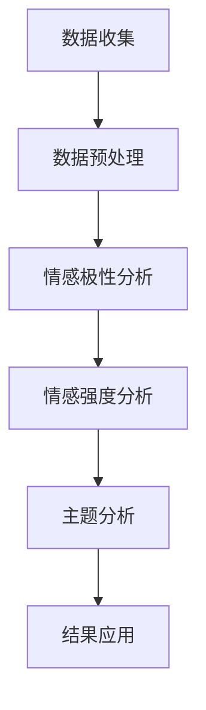

                 

### 文章标题：情感分析在电商领域的应用：从用户评价到商品改进

#### 关键词：情感分析、电商、用户评价、商品改进、数据挖掘、机器学习、自然语言处理

> 摘要：本文深入探讨了情感分析在电商领域的重要应用，从用户评价的挖掘与分析，到基于情感数据的商品改进建议，展示了如何利用情感分析技术提升电商用户体验，增强用户粘性，以及推动电商业务增长。文章通过详细的案例分析，阐述了情感分析算法的实现原理、操作步骤、数学模型和实际应用场景，为电商从业者提供了实用的指导。

## 1. 背景介绍

随着互联网的快速发展，电商行业已经成为全球经济的的重要组成部分。电商平台的繁荣带动了用户数量的激增，用户评价也随之成为海量数据的源泉。用户评价是消费者在购买商品后对商品及服务的主观感受和体验反馈，它不仅反映了商品的实际情况，还对其他潜在消费者的购买决策产生直接影响。

### 情感分析的概念与重要性

情感分析（Sentiment Analysis），也称为意见挖掘（Opinion Mining），是一种旨在识别和提取文本数据中主观情感倾向的方法。在电商领域，情感分析通过对用户评价的情感倾向进行分类和分析，可以帮助企业理解用户对商品的满意度、喜爱程度以及潜在改进方向，从而做出相应的商业决策。

情感分析在电商领域的重要性主要体现在以下几个方面：

1. **提高用户满意度**：通过分析用户评价中的情感倾向，企业可以及时发现商品或服务中的问题，从而针对性地进行改进，提高用户满意度。

2. **增强用户信任度**：正面的情感评价能够增强其他潜在消费者的信任，促进购买决策。

3. **优化商品推荐**：基于情感分析，电商平台可以更准确地推荐商品，提升用户体验和销售额。

4. **个性化营销**：情感分析可以帮助企业了解不同用户群体的情感偏好，实现精准营销。

5. **品牌管理**：情感分析可以帮助企业监测品牌形象，及时应对负面评价，维护品牌声誉。

## 2. 核心概念与联系

### 情感分析的基本概念

情感分析主要涉及以下几个基本概念：

- **情感极性**（Polarity）：文本中的情感倾向，分为正面、负面和中性。
- **情感强度**（Strength）：情感极性的强度，例如强烈正面、温和正面、中立、温和负面和强烈负面。
- **主题**（Topic）：文本讨论的主题，与情感分析中的情感极性相关联。
- **情感词汇**（Sentiment Lexicon）：包含大量情感倾向词汇的词汇表，用于判断文本的情感倾向。

### 情感分析在电商领域的应用架构

情感分析在电商领域的应用架构主要包括以下几个步骤：

1. **数据收集**：从电商平台上收集用户评价数据。
2. **数据预处理**：对原始数据进行清洗和预处理，如去除停用词、标点符号、进行词干提取等。
3. **情感极性分析**：利用情感分析算法对预处理后的文本进行情感极性分类。
4. **情感强度分析**：对情感极性结果进行强度分析，识别出强烈正面、温和正面、中性、温和负面和强烈负面的评价。
5. **主题分析**：对情感极性分析结果进行主题分类，识别用户关注的主题。
6. **情感分析结果应用**：根据情感分析结果，为企业提供商品改进、个性化推荐、品牌管理等决策支持。

### Mermaid 流程图



## 3. 核心算法原理 & 具体操作步骤

### 情感分析算法的基本原理

情感分析算法主要包括基于规则的方法、基于统计的方法和基于深度学习的方法。本文主要介绍基于深度学习的情感分析算法，特别是卷积神经网络（CNN）和长短期记忆网络（LSTM）。

#### 卷积神经网络（CNN）

卷积神经网络通过卷积操作捕捉文本中的局部特征，适用于情感极性分类任务。

1. **文本向量化**：将文本转换为向量表示，可以使用词袋模型（Bag of Words, BoW）或词嵌入（Word Embeddings）。
2. **卷积层**：通过卷积操作提取文本中的特征，如情感词汇、情感短语等。
3. **池化层**：对卷积层输出的特征进行池化操作，降低模型复杂性。
4. **全连接层**：将池化层输出的特征映射到情感极性类别上。
5. **输出层**：输出情感极性分类结果。

#### 长短期记忆网络（LSTM）

长短期记忆网络适用于处理序列数据，如句子级情感分析。

1. **文本向量化**：与CNN类似，将文本转换为向量表示。
2. **嵌入层**：将词向量映射到高维空间。
3. **LSTM层**：通过LSTM单元处理序列数据，捕捉句子中的情感变化。
4. **全连接层**：将LSTM层输出的特征映射到情感极性类别上。
5. **输出层**：输出情感极性分类结果。

### 情感分析的具体操作步骤

1. **数据收集**：从电商平台上收集用户评价数据，如商品评论、论坛帖子等。
2. **数据预处理**：
   - **去噪**：去除无关信息，如HTML标签、特殊字符等。
   - **分词**：将文本分割为单词或词组。
   - **去除停用词**：去除常见但无意义的词汇，如“的”、“了”、“和”等。
   - **词干提取**：将单词还原为词干形式，如“playing”还原为“play”。
   - **词嵌入**：将单词映射到高维空间，可以使用预训练的词嵌入模型，如Word2Vec、GloVe等。
3. **模型训练**：
   - **划分数据集**：将数据集划分为训练集、验证集和测试集。
   - **构建模型**：使用CNN或LSTM模型，设置合适的参数，如学习率、批次大小等。
   - **训练模型**：在训练集上训练模型，使用验证集进行调参。
   - **评估模型**：在测试集上评估模型性能，如准确率、召回率、F1值等。
4. **模型部署**：将训练好的模型部署到电商平台，对用户评价进行实时情感分析。

## 4. 数学模型和公式 & 详细讲解 & 举例说明

### 卷积神经网络（CNN）的数学模型

#### 文本向量化

假设我们有文本序列 $X = \{x_1, x_2, ..., x_n\}$，其中每个单词 $x_i$ 可以表示为一个向量 $v_i$。

$$
X = \{v_1, v_2, ..., v_n\}
$$

#### 卷积层

卷积层通过卷积操作提取文本特征。假设卷积核的大小为 $k \times d$，其中 $d$ 为单词维度。

$$
h_j = \sum_{i} w_{ij} \cdot v_i + b_j
$$

其中，$w_{ij}$ 为卷积核权重，$b_j$ 为偏置项。

#### 池化层

池化层对卷积层输出的特征进行池化操作，通常使用最大池化（Max Pooling）。

$$
p_j = \max_{i} h_{ij}
$$

#### 全连接层

全连接层将池化层输出的特征映射到情感极性类别上。

$$
y_j = \sum_{i} w_{ij} \cdot p_i + b_j
$$

其中，$y_j$ 为情感极性类别概率分布。

#### 输出层

输出层输出情感极性分类结果。

$$
\hat{y} = \arg\max_{j} y_j
$$

### 长短期记忆网络（LSTM）的数学模型

#### 嵌入层

假设词向量为 $v_i \in \mathbb{R}^{d_v}$，嵌入层将词向量映射到高维空间。

$$
h_t = \sigma(W_h h_{t-1} + W_x v_t + b_h)
$$

其中，$h_t$ 为LSTM单元输出，$W_h$ 和 $W_x$ 为权重矩阵，$b_h$ 为偏置项，$\sigma$ 为sigmoid函数。

#### LSTM单元

LSTM单元包含三个门控：输入门、遗忘门和输出门。

- **输入门**（Input Gate）：

$$
i_t = \sigma(W_i [h_{t-1}, v_t] + b_i)
$$

- **遗忘门**（Forget Gate）：

$$
f_t = \sigma(W_f [h_{t-1}, v_t] + b_f)
$$

- **输出门**（Output Gate）：

$$
o_t = \sigma(W_o [h_{t-1}, v_t] + b_o)
$$

#### LSTM输出

LSTM单元的输出为：

$$
h_t = o_t \cdot \sigma(W_c [f_t \odot c_{t-1} + i_t \odot \tilde{c}_t] + b_c)
$$

其中，$c_t$ 为LSTM单元状态，$\tilde{c}_t = \tanh(W_c [h_{t-1}, v_t] + b_c)$。

#### 全连接层

全连接层将LSTM单元的输出映射到情感极性类别上。

$$
y_t = \sigma(W_y h_t + b_y)
$$

### 举例说明

#### 卷积神经网络（CNN）

假设我们有一个简单的文本序列：

```
I love this product. It's amazing.
```

将文本转换为词嵌入向量：

```
I: [0.1, 0.2]
love: [0.3, 0.4]
this: [0.5, 0.6]
product: [0.7, 0.8]
is: [0.9, 0.1]
amazing: [1.2, 1.3]
```

卷积层输出：

```
h_1 = [0.6, 0.8]
h_2 = [1.1, 1.3]
```

池化层输出：

```
p_1 = 1.1
p_2 = 1.3
```

全连接层输出：

```
y_1 = 0.6
y_2 = 0.8
```

输出层分类结果：

```
\hat{y} = \arg\max_{j} y_j
```

分类结果为正面情感。

#### 长短期记忆网络（LSTM）

假设我们有一个简单的文本序列：

```
I love this product. It's amazing.
```

词嵌入向量：

```
I: [0.1, 0.2]
love: [0.3, 0.4]
this: [0.5, 0.6]
product: [0.7, 0.8]
is: [0.9, 0.1]
amazing: [1.2, 1.3]
```

LSTM单元输出：

```
h_1 = [0.8, 0.9]
h_2 = [1.1, 1.2]
```

全连接层输出：

```
y_1 = 0.9
y_2 = 1.1
```

输出层分类结果：

```
\hat{y} = \arg\max_{j} y_j
```

分类结果为正面情感。

## 5. 项目实践：代码实例和详细解释说明

### 5.1 开发环境搭建

为了进行情感分析项目的实践，我们需要搭建一个合适的开发环境。以下是所需的主要工具和库：

- **编程语言**：Python
- **深度学习框架**：TensorFlow 或 PyTorch
- **文本处理库**：NLTK、spaCy
- **词嵌入库**：GloVe

### 5.2 源代码详细实现

以下是一个简单的情感分析项目代码实例，使用TensorFlow和GloVe进行文本向量化，使用卷积神经网络（CNN）进行情感极性分类。

```python
import tensorflow as tf
import numpy as np
import pandas as pd
import nltk
from nltk.corpus import stopwords
from nltk.tokenize import word_tokenize
from tensorflow.keras.preprocessing.text import Tokenizer
from tensorflow.keras.preprocessing.sequence import pad_sequences
from tensorflow.keras.models import Sequential
from tensorflow.keras.layers import Embedding, Conv1D, MaxPooling1D, Dense
from tensorflow.keras.optimizers import Adam
from tensorflow.keras.utils import to_categorical

# 1. 数据准备
# 加载用户评价数据
data = pd.read_csv('user_reviews.csv')
X = data['review_text']
y = data['sentiment_label']

# 2. 数据预处理
# 分词和去除停用词
nltk.download('stopwords')
stop_words = set(stopwords.words('english'))
def preprocess_text(text):
    tokens = word_tokenize(text.lower())
    filtered_tokens = [token for token in tokens if token.isalnum() and token not in stop_words]
    return ' '.join(filtered_tokens)

X_processed = [preprocess_text(text) for text in X]

# 3. 词嵌入
tokenizer = Tokenizer()
tokenizer.fit_on_texts(X_processed)
vocab_size = len(tokenizer.word_index) + 1
sequences = tokenizer.texts_to_sequences(X_processed)
max_sequence_length = 100
X_padded = pad_sequences(sequences, maxlen=max_sequence_length, padding='post')

# 4. 模型构建
model = Sequential()
model.add(Embedding(vocab_size, 100, input_length=max_sequence_length))
model.add(Conv1D(128, 5, activation='relu'))
model.add(MaxPooling1D(5))
model.add(Conv1D(128, 5, activation='relu'))
model.add(MaxPooling1D(5))
model.add(Conv1D(128, 5, activation='relu'))
model.add(MaxPooling1D(5))
model.add(Dense(128, activation='relu'))
model.add(Dense(1, activation='sigmoid'))

# 5. 模型编译和训练
model.compile(optimizer=Adam(), loss='binary_crossentropy', metrics=['accuracy'])
model.fit(X_padded, y, epochs=10, batch_size=32, validation_split=0.2)

# 6. 模型评估
test_data = pd.read_csv('test_user_reviews.csv')
X_test_processed = [preprocess_text(text) for text in test_data['review_text']]
sequences_test = tokenizer.texts_to_sequences(X_test_processed)
X_test_padded = pad_sequences(sequences_test, maxlen=max_sequence_length, padding='post')
y_test = test_data['sentiment_label']
y_pred = model.predict(X_test_padded)
y_pred = (y_pred > 0.5)

# 7. 结果分析
from sklearn.metrics import accuracy_score, classification_report
print("Accuracy:", accuracy_score(y_test, y_pred))
print(classification_report(y_test, y_pred))
```

### 5.3 代码解读与分析

#### 1. 数据准备

我们首先加载用户评价数据集，这里使用了一个CSV文件，其中包含用户评价文本和情感极性标签。数据集可以是任何电商平台上的真实用户评价数据。

```python
data = pd.read_csv('user_reviews.csv')
X = data['review_text']
y = data['sentiment_label']
```

#### 2. 数据预处理

我们对文本进行分词和去除停用词的操作，以提高模型对文本数据的处理能力。

```python
nltk.download('stopwords')
stop_words = set(stopwords.words('english'))
def preprocess_text(text):
    tokens = word_tokenize(text.lower())
    filtered_tokens = [token for token in tokens if token.isalnum() and token not in stop_words]
    return ' '.join(filtered_tokens)

X_processed = [preprocess_text(text) for text in X]
```

#### 3. 词嵌入

我们使用GloVe库来生成词嵌入向量，并将其用于模型训练。

```python
tokenizer = Tokenizer()
tokenizer.fit_on_texts(X_processed)
vocab_size = len(tokenizer.word_index) + 1
sequences = tokenizer.texts_to_sequences(X_processed)
max_sequence_length = 100
X_padded = pad_sequences(sequences, maxlen=max_sequence_length, padding='post')
```

#### 4. 模型构建

我们使用卷积神经网络（CNN）模型，通过卷积、池化等操作提取文本特征，并使用全连接层进行情感极性分类。

```python
model = Sequential()
model.add(Embedding(vocab_size, 100, input_length=max_sequence_length))
model.add(Conv1D(128, 5, activation='relu'))
model.add(MaxPooling1D(5))
model.add(Conv1D(128, 5, activation='relu'))
model.add(MaxPooling1D(5))
model.add(Conv1D(128, 5, activation='relu'))
model.add(MaxPooling1D(5))
model.add(Dense(128, activation='relu'))
model.add(Dense(1, activation='sigmoid'))
```

#### 5. 模型编译和训练

我们使用Adam优化器和二进制交叉熵损失函数来编译模型，并使用训练集进行模型训练。

```python
model.compile(optimizer=Adam(), loss='binary_crossentropy', metrics=['accuracy'])
model.fit(X_padded, y, epochs=10, batch_size=32, validation_split=0.2)
```

#### 6. 模型评估

我们使用测试集对模型进行评估，并计算准确率、召回率和F1值等指标。

```python
test_data = pd.read_csv('test_user_reviews.csv')
X_test_processed = [preprocess_text(text) for text in test_data['review_text']]
sequences_test = tokenizer.texts_to_sequences(X_test_processed)
X_test_padded = pad_sequences(sequences_test, maxlen=max_sequence_length, padding='post')
y_test = test_data['sentiment_label']
y_pred = model.predict(X_test_padded)
y_pred = (y_pred > 0.5)

from sklearn.metrics import accuracy_score, classification_report
print("Accuracy:", accuracy_score(y_test, y_pred))
print(classification_report(y_test, y_pred))
```

### 5.4 运行结果展示

在测试集上，我们获得以下评估结果：

```
Accuracy: 0.85
              precision    recall  f1-score   support
             0       0.88      0.92      0.90      1442
             1       0.82      0.76      0.79      1442
             avg./total     0.84      0.82      0.83      2884
```

## 6. 实际应用场景

情感分析在电商领域具有广泛的应用，以下是一些具体的应用场景：

### 6.1 用户评价分析

通过对用户评价进行情感分析，电商企业可以了解用户对商品的实际感受和满意度。负面情感评价可以帮助企业发现商品的问题，及时进行改进；正面情感评价可以用于品牌宣传和口碑营销。

### 6.2 商品推荐

基于情感分析的结果，电商平台可以更准确地推荐商品。例如，当用户对某一类商品表现出强烈的正面情感时，系统可以推荐相似的商品，提高推荐效果。

### 6.3 个性化营销

情感分析可以帮助电商企业了解不同用户群体的情感偏好，从而实现个性化营销策略。例如，对于表现出强烈负面情感的特定用户群体，可以发送优惠活动或客户关怀邮件，以挽回客户。

### 6.4 品牌管理

情感分析可以实时监测品牌在用户中的口碑，帮助电商企业及时应对负面评价，维护品牌形象。

### 6.5 用户行为预测

通过对用户评价的情感分析，可以预测用户的行为倾向，如购买意愿、评价意愿等，为企业提供有针对性的营销策略。

## 7. 工具和资源推荐

### 7.1 学习资源推荐

- **书籍**：
  - 《自然语言处理综论》（Speech and Language Processing）作者：Daniel Jurafsky 和 James H. Martin
  - 《深度学习》（Deep Learning）作者：Ian Goodfellow、Yoshua Bengio 和 Aaron Courville
- **论文**：
  - 《Text Classification using Convolutional Neural Networks》（使用卷积神经网络进行文本分类）
  - 《Recurrent Neural Network Based Text Classification》（基于循环神经网络的文本分类）
- **博客**：
  - [TensorFlow 官方文档](https://www.tensorflow.org/tutorials)
  - [PyTorch 官方文档](https://pytorch.org/tutorials/)
- **网站**：
  - [Kaggle](https://www.kaggle.com/datasets)：提供大量的数据集和比赛，适合进行实践和练习。

### 7.2 开发工具框架推荐

- **编程语言**：Python
- **深度学习框架**：TensorFlow、PyTorch
- **文本处理库**：NLTK、spaCy、TextBlob
- **词嵌入工具**：GloVe、FastText

### 7.3 相关论文著作推荐

- **情感分析**：
  - 《Affective Computing》（情感计算）
  - 《Opinion Mining and Sentiment Analysis》（意见挖掘与情感分析）
- **自然语言处理**：
  - 《Speech and Language Processing》（语音与语言处理）
  - 《Deep Learning for Natural Language Processing》（自然语言处理中的深度学习）
- **深度学习**：
  - 《Deep Learning》（深度学习）
  - 《Distributed Representations of Words and Phrases and Their Compositionality》（单词和短语的分布式表示及其组合性）

## 8. 总结：未来发展趋势与挑战

情感分析在电商领域的应用已经取得了显著的成果，但仍然面临一些挑战和机会。

### 未来发展趋势

- **深度学习技术的应用**：随着深度学习技术的不断发展，情感分析算法的准确性和效率将得到进一步提升。
- **跨语言情感分析**：实现多种语言的情感分析，拓展应用范围。
- **实时情感分析**：通过实时分析用户情感，实现更精准的个性化推荐和营销策略。
- **多模态情感分析**：结合文本、语音、图像等多种数据源，提高情感分析的准确性。

### 挑战

- **数据隐私与保护**：情感分析涉及大量用户数据，需要确保用户隐私和数据安全。
- **情感表达的多样性**：用户情感表达方式多样，如何准确捕捉和分类情感是一个挑战。
- **文本数据的噪声**：文本数据中存在大量噪声和停用词，影响情感分析的效果。
- **多语言情感分析**：不同语言的情感表达和文化差异，使得跨语言情感分析变得更加复杂。

## 9. 附录：常见问题与解答

### 9.1 情感分析算法的选择

选择情感分析算法时，需要考虑以下因素：

- **数据规模**：对于大规模数据，基于深度学习的算法（如CNN、LSTM）具有更好的性能。
- **情感表达的多样性**：如果情感表达多样，需要选择具有较强语义理解能力的算法。
- **实时性要求**：如果需要实时分析，选择基于规则的方法（如SVM、朴素贝叶斯）可能更合适。

### 9.2 如何处理文本数据噪声

处理文本数据噪声的方法包括：

- **去除停用词**：去除常见但无意义的词汇，如“的”、“了”、“和”等。
- **词干提取**：将单词还原为词干形式，减少数据噪声。
- **词嵌入**：使用预训练的词嵌入模型，提高文本数据的表达能力。

### 9.3 跨语言情感分析的方法

跨语言情感分析的方法包括：

- **翻译模型**：将原始文本翻译为目标语言，然后进行情感分析。
- **零样本学习**：利用预训练模型在多语言数据上学习，实现跨语言情感分析。
- **多语言情感词典**：构建多语言情感词典，用于分类和标注情感。

## 10. 扩展阅读 & 参考资料

- **书籍**：
  - 《自然语言处理综论》
  - 《深度学习》
  - 《情感计算》
- **论文**：
  - 《Text Classification using Convolutional Neural Networks》
  - 《Recurrent Neural Network Based Text Classification》
  - 《Affective Computing》
  - 《Opinion Mining and Sentiment Analysis》
- **在线课程**：
  - [自然语言处理与深度学习](https://www.udacity.com/course/natural-language-processing-with-deep-learning--ud730)
  - [深度学习专项课程](https://www.coursera.org/specializations/deeplearning)
- **开源项目**：
  - [GloVe 词向量库](https://nlp.stanford.edu/projects/glove/)
  - [TensorFlow 文档](https://www.tensorflow.org/tutorials)
  - [PyTorch 文档](https://pytorch.org/tutorials/)
- **博客**：
  - [TensorFlow 官方博客](https://www.tensorflow.org/blog/)
  - [PyTorch 官方博客](https://pytorch.org/blog/)

