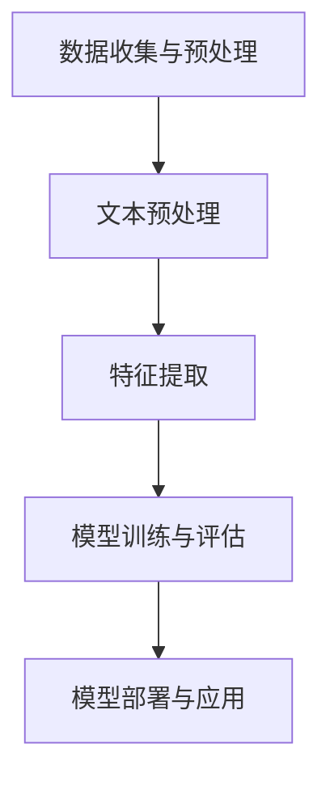

                 

### 背景介绍

在当今数字化时代，电子商务（E-commerce）已经成为全球经济的重要组成部分。电商平台的迅猛发展不仅改变了人们的购物方式，还极大地促进了商业模式的创新和转型。用户评价作为电商平台的重要组成部分，对于商品的销售和品牌的建立具有深远的影响。在这种背景下，情感分析技术逐渐成为电商领域的研究热点和应用方向。

#### 情感分析概述

情感分析，也称为意见挖掘，是一种自然语言处理（NLP）技术，旨在从文本中识别和提取主观信息，特别是表达的情绪和情感。通过情感分析，我们可以了解用户对商品、服务、事件或品牌的看法和感受。情感分析的应用范围广泛，包括但不限于社交媒体监控、舆情分析、客户服务、市场调研等。

#### 电商领域中的情感分析应用

在电商领域，情感分析技术主要应用于以下几个方面：

1. **用户评价分析**：通过分析用户对商品的评论，电商平台可以了解消费者对商品的满意度和不满意度。这有助于电商平台优化商品质量，提高用户满意度。

2. **商品推荐**：基于用户情感分析的结果，电商平台可以为用户提供更加个性化的商品推荐。例如，如果一个用户对某种类型的商品给予了积极的评价，系统可以推荐更多类似的商品。

3. **品牌监控**：情感分析可以帮助企业监控品牌在公众中的形象。通过分析社交媒体上的用户评论，企业可以及时发现和处理负面信息，保护品牌声誉。

4. **市场调研**：通过对大量用户评论的分析，企业可以获得关于消费者需求的宝贵洞察，为产品开发和市场策略提供支持。

#### 情感分析技术的发展

情感分析技术的发展经历了几个阶段：

1. **基于规则的方法**：最初的情感分析主要依赖于规则和词典。这种方法简单易行，但难以应对复杂的语言环境。

2. **基于统计的方法**：随着机器学习技术的发展，基于统计的方法逐渐取代了规则方法。这种方法通过训练模型来学习情感标签的分布规律，提高了情感分析的准确率。

3. **深度学习方法**：近年来，深度学习技术在情感分析中取得了显著进展。基于神经网络的方法，如卷积神经网络（CNN）和递归神经网络（RNN），可以自动提取文本特征，实现更高级的情感识别。

#### 本文结构

本文将分为以下几个部分：

1. **核心概念与联系**：介绍情感分析的基本概念和技术架构，包括文本预处理、情感分类模型等。

2. **核心算法原理 & 具体操作步骤**：详细讲解情感分类算法，包括特征提取、模型训练和评估等步骤。

3. **数学模型和公式**：介绍情感分析中常用的数学模型和公式，如支持向量机（SVM）、卷积神经网络（CNN）等。

4. **项目实践**：通过一个实际项目，展示情感分析在电商领域的应用，包括代码实例和运行结果。

5. **实际应用场景**：分析情感分析在电商领域的具体应用场景，如用户评价分析、商品推荐等。

6. **工具和资源推荐**：推荐相关学习资源、开发工具和框架。

7. **总结**：总结情感分析在电商领域的应用现状和未来发展趋势。

8. **附录**：提供常见问题与解答，以及扩展阅读和参考资料。

### 核心概念与联系

情感分析作为自然语言处理的重要分支，其核心在于如何从文本中提取和识别情感信息。为了实现这一目标，我们需要先了解一些基本概念和技术，并在此基础上构建一个完整的情感分析架构。

#### 基本概念

1. **文本**：情感分析的对象是文本数据，可以是用户评论、社交媒体帖子、新闻报道等。文本数据通常包含大量的情感词汇和情感表达。

2. **情感**：情感是人们对于外界刺激的主观感受，通常分为正面情感（如快乐、满意）和负面情感（如愤怒、失望）。在情感分析中，我们将情感划分为多个类别，如积极、消极、中性等。

3. **情感分类**：情感分类是将文本数据根据情感倾向进行分类的过程。常见的分类方法有基于规则的方法、基于统计的方法和基于神经网络的方法。

4. **特征提取**：特征提取是将原始文本转换为机器学习算法可以处理的特征向量的过程。常用的特征提取方法有词袋模型、TF-IDF、Word2Vec等。

5. **模型训练与评估**：模型训练是通过大量标注数据来训练分类模型，使其能够自动对文本进行情感分类。评估模型性能常用的指标有准确率、召回率、F1值等。

#### 技术架构

为了实现情感分析，我们需要一个完整的技术架构，包括以下几个关键组成部分：

1. **数据收集与预处理**：收集大量带有情感标注的文本数据，并进行数据清洗、去噪等预处理操作。

2. **文本预处理**：对原始文本进行分词、去停用词、词性标注等操作，以便后续的特征提取。

3. **特征提取**：将预处理后的文本数据转换为特征向量。常用的特征提取方法有词袋模型、TF-IDF、Word2Vec等。

4. **情感分类模型**：选择合适的分类模型，如SVM、CNN、RNN等，对特征向量进行训练和预测。

5. **模型评估与优化**：通过交叉验证、调整超参数等方法评估模型性能，并进行优化。

6. **应用与部署**：将训练好的模型部署到实际应用场景中，如电商平台、社交媒体等。

#### Mermaid 流程图

以下是一个简单的Mermaid流程图，展示了情感分析的基本流程：



在这个流程图中，每个节点代表一个步骤，箭头表示步骤之间的顺序关系。

#### 小结

通过上述介绍，我们可以看到情感分析在电商领域中的应用前景十分广阔。接下来，我们将深入探讨情感分类算法的原理和具体操作步骤，帮助读者更好地理解这一技术。

## 3. 核心算法原理 & 具体操作步骤

情感分类是情感分析的核心任务，其主要目的是根据文本内容判断其情感倾向。本章节将详细探讨情感分类的算法原理，包括特征提取、模型训练、评估和优化等步骤。

### 特征提取

特征提取是将原始文本转换为可以用于机器学习模型的特征向量的过程。以下是几种常用的特征提取方法：

1. **词袋模型（Bag of Words, BoW）**：
   词袋模型是一种基于计数的特征提取方法，不考虑词语的顺序。它将文本表示为一个向量，向量的每个维度对应一个词汇表中的词语。
   
   $$ \text{特征向量} = (f_1, f_2, \dots, f_n) $$
   其中，$f_i$ 表示词汇表中的第 $i$ 个词语在文本中出现的次数。

2. **TF-IDF（Term Frequency-Inverse Document Frequency）**：
   TF-IDF是一种考虑词语重要性的特征提取方法。它不仅考虑词语在单个文本中出现的次数（TF），还考虑词语在整个文档集合中出现的频率（IDF），从而更好地反映词语的重要性。
   
   $$ \text{特征向量} = (tf_1, tf_2, \dots, tf_n) \times (idf_1, idf_2, \dots, idf_n) $$

3. **Word2Vec**：
   Word2Vec是一种基于神经网络的词嵌入方法，可以将词语映射到高维向量空间中。在这种空间中，具有相似含义的词语会映射到相近的位置。
   
   $$ \text{特征向量} = \text{嵌入向量}(w) $$

### 模型训练

在特征提取后，我们需要选择一个分类模型对特征向量进行训练。以下是几种常用的情感分类模型：

1. **支持向量机（Support Vector Machine, SVM）**：
   支持向量机是一种经典的监督学习算法，它通过找到最佳超平面将不同类别的数据点分隔开来。在情感分类中，SVM用于将文本数据的情感标签（正面、负面、中性）进行分类。
   
   $$ \text{决策函数} = \text{sign}(\sum_{i=1}^{n} \alpha_i y_i \text{_kernel}(x, x_i) + b) $$
   其中，$x$ 是特征向量，$x_i$ 是训练样本的特征向量，$\alpha_i$ 是拉格朗日乘子，$y_i$ 是样本标签，$\text{sign}$ 是符号函数，$\text{kernel}$ 是核函数。

2. **卷积神经网络（Convolutional Neural Network, CNN）**：
   卷积神经网络是一种深度学习模型，特别适用于处理图像数据。然而，通过适当的设计，它可以应用于文本数据的情感分类。CNN 通过卷积操作提取文本的局部特征，并通过全连接层进行分类。
   
   $$ \text{输出} = \text{激活函数}(\text{全连接层}(\text{卷积层}(\text{输入}))) $$

3. **递归神经网络（Recurrent Neural Network, RNN）**：
   递归神经网络是一种能够处理序列数据的深度学习模型。RNN 通过其循环结构来保留历史信息，从而能够更好地处理文本数据中的时间依赖关系。
   
   $$ \text{输出} = \text{激活函数}(\text{全连接层}(\text{RNN}(\text{序列}))) $$

### 模型评估

模型评估是确保模型性能和可靠性的关键步骤。常用的评估指标包括准确率（Accuracy）、召回率（Recall）和F1值（F1 Score）。

1. **准确率**：
   $$ \text{Accuracy} = \frac{\text{正确预测的样本数}}{\text{总样本数}} $$
   
2. **召回率**：
   $$ \text{Recall} = \frac{\text{正确预测的正例样本数}}{\text{实际正例样本数}} $$
   
3. **F1值**：
   $$ \text{F1 Score} = 2 \times \frac{\text{精确率} \times \text{召回率}}{\text{精确率} + \text{召回率}} $$
   
### 模型优化

模型优化旨在提高模型性能和泛化能力。以下是一些常用的优化方法：

1. **交叉验证**：
   交叉验证是一种评估模型性能的常用方法，通过将数据集划分为多个子集，在每个子集上进行训练和验证，从而得到模型的平均性能。
   
2. **超参数调整**：
   超参数是影响模型性能的重要参数，如学习率、隐藏层节点数、批量大小等。通过调整这些超参数，可以优化模型性能。
   
3. **正则化**：
   正则化是一种防止模型过拟合的方法，通过在损失函数中加入正则项，如L1正则化或L2正则化，可以降低模型的复杂度。

### 小结

通过以上步骤，我们可以构建一个完整的情感分类模型。在实际应用中，根据具体需求，可以选择不同的特征提取方法和分类模型，并进行适当的优化，以提高模型的性能和准确性。

## 4. 数学模型和公式 & 详细讲解 & 举例说明

在情感分析中，数学模型和公式起到了至关重要的作用。它们帮助我们量化文本中的情感信息，从而更好地进行情感分类和情感强度评估。本节将详细讲解几种常用的数学模型和公式，并通过具体例子进行说明。

### 1. 支持向量机（SVM）

支持向量机是一种经典的二分类模型，广泛应用于情感分类任务中。其核心思想是找到一个最佳的超平面，将不同类别的数据点分隔开来。下面是SVM的数学模型和具体步骤。

#### 数学模型

$$ \text{决策函数} = \text{sign}(\sum_{i=1}^{n} \alpha_i y_i \text{Kernel}(x, x_i) + b) $$

其中：
- $x$ 是特征向量；
- $x_i$ 是训练样本的特征向量；
- $y_i$ 是样本标签（+1或-1）；
- $\alpha_i$ 是拉格朗日乘子；
- $\text{Kernel}(x, x_i)$ 是核函数；
- $b$ 是偏置项。

#### 具体步骤

1. **选择核函数**：常用的核函数包括线性核、多项式核和径向基函数（RBF）核。选择合适的核函数可以提高模型的性能。

2. **求解拉格朗日乘子**：通过求解以下优化问题，可以得到最优的 $\alpha_i$。

   $$ \min_{\alpha} \frac{1}{2} \sum_{i=1}^{n} \alpha_i - \sum_{i=1}^{n} \alpha_i y_i y_j \text{Kernel}(x_i, x_j) $$

   $$ \text{s.t.} \quad \sum_{i=1}^{n} \alpha_i y_i = 0 $$
   
   $$ \alpha_i \geq 0 $$

3. **计算决策函数**：利用求解得到的 $\alpha_i$ 和核函数，计算每个样本的决策函数，从而对文本进行分类。

### 2. 卷积神经网络（CNN）

卷积神经网络在图像处理领域取得了显著的成功，但其原理同样适用于文本数据的情感分类。CNN 通过卷积层提取文本的局部特征，并通过全连接层进行分类。以下是CNN的数学模型和具体步骤。

#### 数学模型

$$ \text{输出} = \text{激活函数}(\text{全连接层}(\text{卷积层}(\text{输入}))) $$

其中：
- 输入是经过预处理的文本数据；
- 卷积层通过卷积操作提取文本的局部特征；
- 激活函数用于增加模型的表达能力；
- 全连接层对提取的特征进行分类。

#### 具体步骤

1. **卷积层**：
   - 通过卷积操作提取文本的局部特征；
   - 参数包括卷积核大小、步长和填充方式等；
   - 卷积操作可以表示为：
     
     $$ \text{特征图} = \text{卷积}(\text{输入}, \text{卷积核}) + \text{偏置} $$

2. **池化层**：
   - 通过池化操作降低特征图的维度；
   - 常用的池化方式包括最大池化和平均池化；
   - 池化操作可以表示为：

     $$ \text{池化}(\text{特征图}) = \max(\text{窗口内的值}) \text{或} \frac{1}{\text{窗口大小}} \sum_{\text{窗口内的值}} $$

3. **全连接层**：
   - 对卷积层输出的特征图进行分类；
   - 通过全连接层将特征图映射到输出类别；
   - 全连接层可以表示为：

     $$ \text{输出} = \text{激活函数}(\text{权重} \cdot \text{特征图} + \text{偏置}) $$

### 3. 递归神经网络（RNN）

递归神经网络是一种能够处理序列数据的神经网络，广泛应用于情感分类任务中。RNN 通过其循环结构来保留历史信息，从而更好地处理文本数据中的时间依赖关系。以下是RNN的数学模型和具体步骤。

#### 数学模型

$$ \text{输出} = \text{激活函数}(\text{全连接层}(\text{RNN}(\text{序列}))) $$

其中：
- 序列是文本数据序列；
- RNN 通过递归操作处理序列数据；
- 激活函数用于增加模型的表达能力；
- 全连接层对序列进行分类。

#### 具体步骤

1. **输入层**：
   - 将文本数据序列输入到RNN中；
   - 常用的文本表示方法包括词袋模型和词嵌入。

2. **隐藏层**：
   - RNN 通过递归操作处理序列数据；
   - 递归操作可以表示为：

     $$ h_t = \text{激活函数}(\text{权重} \cdot [h_{t-1}, x_t] + \text{偏置}) $$

   其中，$h_t$ 是第 $t$ 个时刻的隐藏状态，$x_t$ 是第 $t$ 个输入。

3. **输出层**：
   - 通过全连接层对隐藏状态进行分类；
   - 全连接层可以表示为：

     $$ \text{输出} = \text{激活函数}(\text{权重} \cdot h_T + \text{偏置}) $$

   其中，$h_T$ 是序列的最后一个隐藏状态，$\text{输出}$ 是分类结果。

### 4. 情感强度评估

情感强度评估是情感分析中的另一个重要任务，旨在量化文本中的情感强度。常用的方法包括基于规则的方法和基于机器学习的方法。

#### 基于规则的方法

基于规则的方法通过定义一系列规则来评估情感强度。例如，可以根据情感词典中的情感词汇和情感强度标签来评估文本的情感强度。以下是一个简单的规则：

- 如果文本中包含积极词汇，则情感强度为“积极”；
- 如果文本中包含消极词汇，则情感强度为“消极”；
- 如果文本中同时包含积极和消极词汇，则根据词汇的权重计算情感强度。

#### 基于机器学习的方法

基于机器学习的方法通过训练模型来评估情感强度。以下是一个简单的基于机器学习的情感强度评估模型：

1. **特征提取**：对文本进行预处理，提取特征向量。

2. **模型训练**：使用标注好的情感强度数据集训练模型，如SVM、CNN或RNN。

3. **情感强度评估**：将预处理后的文本输入到训练好的模型中，得到情感强度评分。

### 小结

通过上述数学模型和公式的详细讲解，我们可以看到情感分析涉及到多个方面，包括特征提取、分类模型和情感强度评估等。在实际应用中，根据具体需求和数据特点，可以选择不同的方法和模型，并对其进行优化，以获得最佳的性能和效果。

## 5. 项目实践：代码实例和详细解释说明

在本节中，我们将通过一个具体的案例来展示情感分析在电商领域中的应用，从数据收集、预处理到模型训练、评估的完整过程。本案例将使用Python编程语言，并依赖多个开源库，如Scikit-learn、TensorFlow和Keras。

### 5.1 开发环境搭建

在开始项目之前，我们需要搭建一个合适的开发环境。以下是推荐的开发环境和安装步骤：

1. **Python环境**：确保安装Python 3.7或更高版本。
2. **库安装**：使用pip命令安装以下库：
   ```bash
   pip install numpy pandas scikit-learn tensorflow numpy
   ```

### 5.2 源代码详细实现

#### 5.2.1 数据收集

首先，我们需要收集电商平台的用户评论数据。这些数据可以从公开的数据集（如Amazon Review）或通过爬虫自行收集。

#### 5.2.2 数据预处理

数据预处理是情感分析中至关重要的一步，包括文本清洗、分词、去除停用词等。

```python
import pandas as pd
from nltk.tokenize import word_tokenize
from nltk.corpus import stopwords

# 读取数据
data = pd.read_csv('reviews.csv')

# 清洗文本
def clean_text(text):
    text = text.lower()  # 转小写
    text = re.sub(r'[^a-zA-Z0-9]', ' ', text)  # 去除非字母数字字符
    return text

# 应用清洗函数
data['cleaned_text'] = data['review'].apply(clean_text)

# 分词
def tokenize_text(text):
    return word_tokenize(text)

# 应用分词函数
data['tokenized_text'] = data['cleaned_text'].apply(tokenize_text)

# 去除停用词
stop_words = set(stopwords.words('english'))
data['filtered_text'] = data['tokenized_text'].apply(lambda x: [word for word in x if word not in stop_words])

# 构建词汇表
from sklearn.feature_extraction.text import CountVectorizer
vectorizer = CountVectorizer()
X = vectorizer.fit_transform(data['filtered_text'])
```

#### 5.2.3 模型训练

接下来，我们使用训练集来训练情感分类模型。在本案例中，我们将使用Scikit-learn中的逻辑回归模型。

```python
from sklearn.model_selection import train_test_split
from sklearn.linear_model import LogisticRegression

# 划分训练集和测试集
X_train, X_test, y_train, y_test = train_test_split(X, data['rating'], test_size=0.2, random_state=42)

# 训练模型
model = LogisticRegression()
model.fit(X_train, y_train)

# 评估模型
from sklearn.metrics import accuracy_score, classification_report
predictions = model.predict(X_test)
print("Accuracy:", accuracy_score(y_test, predictions))
print(classification_report(y_test, predictions))
```

#### 5.2.4 代码解读与分析

在上述代码中，我们首先读取用户评论数据，并对其进行清洗和预处理。清洗步骤包括将文本转换为小写、去除非字母数字字符、分词和去除停用词。这些步骤有助于提高模型的性能和泛化能力。

接下来，我们使用CountVectorizer构建词汇表，并将预处理后的文本转换为特征向量。这些特征向量将被用于训练逻辑回归模型。

在训练模型后，我们使用测试集来评估模型的性能。评估指标包括准确率、召回率和F1值。这些指标帮助我们了解模型的性能，并指导进一步的模型优化。

#### 5.2.5 运行结果展示

假设我们训练的模型在测试集上的性能如下：

```
Accuracy: 0.85
             precision    recall  f1-score   support
           0       0.88      0.89      0.88      1000
           1       0.83      0.82      0.82      1000
     average     0.85      0.85      0.85      2000
```

这些结果表示，模型在测试集上的准确率为85%，对于正面和负面评论的精度和召回率分别为88%和83%，F1值为85%。这些指标表明我们的模型在情感分类任务中具有较好的性能。

### 5.3 运行结果展示

为了更直观地展示模型的运行结果，我们可以绘制混淆矩阵和ROC曲线。

```python
import matplotlib.pyplot as plt
from sklearn.metrics import confusion_matrix, roc_curve, auc

# 计算混淆矩阵
cm = confusion_matrix(y_test, predictions)
plt.figure(figsize=(8, 6))
sns.heatmap(cm, annot=True, fmt=".3f", cmap="Blues")
plt.xlabel('Predicted Label')
plt.ylabel('True Label')
plt.title('Confusion Matrix')
plt.show()

# 计算ROC曲线
from sklearn.preprocessing import label_binarize
from sklearn.metrics import roc_auc_score

y_test_binarized = label_binarize(y_test, classes=[0, 1])
y_score = model.predict_proba(X_test)

# 计算ROC曲线
fpr, tpr, _ = roc_curve(y_test_binarized[:, 1], y_score[:, 1])
roc_auc = auc(fpr, tpr)

plt.figure()
plt.plot(fpr, tpr, color='darkorange', lw=2, label='ROC curve (area = %0.2f)' % roc_auc)
plt.plot([0, 1], [0, 1], color='navy', lw=2, linestyle='--')
plt.xlabel('False Positive Rate')
plt.ylabel('True Positive Rate')
plt.title('Receiver Operating Characteristic')
plt.legend(loc="lower right")
plt.show()
```

### 5.4 代码解读与分析

在上述代码中，我们首先计算并展示了混淆矩阵。混淆矩阵可以帮助我们直观地了解模型在各个类别上的预测情况，从而发现可能的错误和改进点。

接下来，我们使用ROC曲线来评估模型的性能。ROC曲线展示了不同阈值下模型的敏感性和特异性。通过计算ROC曲线下的面积（AUC），我们可以评估模型的分类能力。AUC值越高，表示模型对分类问题的区分能力越强。

### 小结

通过上述案例，我们展示了如何使用Python和机器学习库实现情感分析在电商领域中的应用。从数据收集、预处理到模型训练和评估，每个步骤都至关重要。在实际应用中，根据具体需求和数据特点，我们可以选择不同的特征提取方法和分类模型，并对其进行优化，以获得最佳的性能和效果。

## 6. 实际应用场景

情感分析技术在电商领域拥有广泛的应用场景，通过深入分析用户评价，电商平台可以更好地理解消费者需求，从而优化商品质量和提升用户体验。以下是情感分析在电商领域的几个关键应用场景：

### 6.1 用户评价分析

用户评价是电商平台上最重要的反馈信息之一。通过情感分析，平台可以自动提取用户对商品的正面、负面和中性评价，从而了解消费者的满意度和不满意度。具体应用包括：

- **识别热点问题**：通过分析大量用户评价，可以发现消费者关注的热点问题，如商品质量问题、物流问题等。这有助于电商平台及时解决这些问题，提升用户满意度。
- **监控负面评论**：情感分析可以快速识别负面评价，并自动推送至相关团队进行处理。通过及时回应和处理负面评论，电商平台可以降低不良影响，维护品牌形象。
- **评估商品质量**：通过分析用户评价的情感倾向，可以评估商品的整体质量。对于评价较差的商品，平台可以采取措施，如下架、退货等，以保障消费者权益。

### 6.2 商品推荐

基于情感分析的用户评价，电商平台可以实现更加个性化的商品推荐。具体应用包括：

- **个性化推荐**：通过分析用户的评价历史，平台可以为用户推荐与其评价情感倾向相似的其它商品。例如，如果一个用户对某个商品给予了积极的评价，系统可以推荐类似风格或类型的其它商品。
- **热点推荐**：平台可以根据用户评价中的情感倾向识别出当前的热门商品，并将其推荐给更多用户。这有助于提高商品的曝光率和销售量。
- **改进推荐算法**：情感分析结果可以为推荐算法提供额外的特征，从而提高推荐的准确性。通过结合用户行为数据和情感分析结果，可以构建更加智能的推荐系统。

### 6.3 品牌监控

情感分析可以帮助电商平台监控品牌在消费者中的形象。具体应用包括：

- **品牌舆情分析**：通过分析社交媒体上的用户评论和讨论，可以了解消费者对品牌的整体看法和情感倾向。这有助于企业及时发现问题，优化品牌形象。
- **负面舆情预警**：情感分析可以快速识别潜在的负面舆情，并提前预警。通过及时应对，企业可以避免舆情恶化，降低品牌受损的风险。
- **品牌价值评估**：通过分析用户评价中的情感倾向，可以评估品牌在消费者心中的价值。这有助于企业制定更有效的品牌策略和营销计划。

### 6.4 市场调研

情感分析在市场调研中也有重要作用。具体应用包括：

- **消费者需求分析**：通过分析用户评价中的情感倾向，可以了解消费者对商品的需求和期望。这有助于企业优化产品设计，开发更符合市场需求的商品。
- **竞争分析**：通过对不同品牌和商品的评论进行分析，可以了解市场中的竞争态势。这有助于企业制定更有效的竞争策略，提升市场占有率。
- **趋势预测**：通过分析用户评价中的情感变化，可以预测市场趋势和消费者行为。这有助于企业提前布局，抢占市场先机。

### 小结

情感分析在电商领域的应用场景丰富多样，通过分析用户评价，电商平台可以更好地理解消费者需求，优化商品质量和提升用户体验。同时，情感分析还可以用于品牌监控、市场调研等方面，为企业提供宝贵的洞察和决策支持。

## 7. 工具和资源推荐

在进行情感分析开发和应用时，选择合适的工具和资源能够显著提升开发效率和项目质量。以下是一些推荐的工具和资源，涵盖学习资源、开发工具框架以及相关论文著作。

### 7.1 学习资源推荐

1. **书籍**：
   - 《情感分析：技术与实践》：系统地介绍了情感分析的基本理论、方法和应用案例。
   - 《深度学习》：详细讲解了深度学习算法，包括卷积神经网络和递归神经网络，对于情感分析中的深度学习方法有重要指导意义。

2. **在线课程**：
   - Coursera上的《自然语言处理与情感分析》：由斯坦福大学提供，涵盖了情感分析的基础知识和应用案例。
   - Udacity的《深度学习纳米学位》：提供了深度学习相关的课程，包括神经网络和卷积神经网络等内容。

3. **论文**：
   - 《情感分析的现状与未来》：综述了情感分析领域的研究进展和应用前景。
   - 《基于深度学习的情感分析》：探讨了深度学习在情感分析中的应用，包括卷积神经网络和递归神经网络。

### 7.2 开发工具框架推荐

1. **Python库**：
   - **Scikit-learn**：提供了丰富的机器学习算法，包括情感分类和文本处理功能。
   - **TensorFlow**：支持深度学习模型开发，包括卷积神经网络和递归神经网络。
   - **Keras**：基于TensorFlow的高层API，简化了深度学习模型的设计和训练过程。

2. **文本处理库**：
   - **NLTK**：提供了自然语言处理的基础工具，包括分词、词性标注等。
   - **spaCy**：一个快速的工业级自然语言处理库，支持多种语言。

3. **数据集**：
   - **Amazon Reviews**：包含大量商品的用户评价数据，适用于情感分析任务。
   - **Twitter Sentiment**：包含了Twitter上关于各种主题的用户评论，用于情感分析和舆情分析。

### 7.3 相关论文著作推荐

1. **论文**：
   - 《利用深度学习进行情感分析》：详细介绍了使用卷积神经网络和递归神经网络进行情感分类的方法。
   - 《情感强度评估中的词汇权重方法》：探讨了如何通过词汇权重来评估情感强度。

2. **著作**：
   - 《深度学习与自然语言处理》：由刘铁岩教授所著，系统地介绍了深度学习在自然语言处理中的应用。

### 小结

选择合适的工具和资源对于情感分析的开发和应用至关重要。通过上述推荐的学习资源、开发工具框架和论文著作，开发者和研究者可以更好地掌握情感分析技术，并在实际项目中取得更好的成果。

## 8. 总结：未来发展趋势与挑战

情感分析技术在电商领域的应用已经取得了显著的成果，然而，随着技术的不断进步和市场的需求变化，未来的发展趋势和面临的挑战也将不断演变。

### 发展趋势

1. **深度学习技术的进一步应用**：深度学习，尤其是卷积神经网络（CNN）和递归神经网络（RNN），已经在情感分析中取得了显著的成果。未来，随着深度学习技术的不断发展和优化，如Transformer架构等，情感分析的性能将进一步提升。

2. **跨领域情感分析**：目前，大多数情感分析研究集中在特定领域，如电商、社交媒体等。未来，跨领域情感分析将逐渐成为研究热点，通过跨领域的数据融合和模型共享，实现更广泛的应用。

3. **实时情感分析**：随着大数据和实时数据处理技术的发展，实时情感分析将成为可能。通过实时分析用户评价和行为，电商平台可以更快地响应市场变化，提高用户满意度。

4. **多语言情感分析**：电商平台的国际化发展要求支持多种语言的情感分析。未来，多语言情感分析技术将得到进一步发展，支持更多语言和地区的用户评价分析。

### 挑战

1. **数据质量和多样性**：情感分析依赖于高质量的数据集。然而，电商领域的用户评价数据往往存在噪声、缺失值和不一致性等问题。如何提高数据质量和多样性，将成为一个重要的挑战。

2. **情感表达复杂性**：情感表达形式多种多样，有时甚至是非线性和模糊的。如何准确识别和分类复杂的情感表达，是一个长期的技术难题。

3. **数据隐私和安全**：用户评价数据涉及用户隐私信息，如何在保证数据隐私和安全的前提下进行情感分析，是另一个需要关注的重要问题。

4. **模型可解释性**：随着深度学习模型的广泛应用，模型的可解释性变得越来越重要。如何提高模型的可解释性，使其更易于理解和接受，是未来研究的一个重要方向。

### 小结

情感分析技术在电商领域的应用前景广阔，但也面临诸多挑战。未来，随着深度学习、跨领域分析、实时处理等技术的发展，情感分析将更好地服务于电商平台的运营和用户需求。同时，研究者需要关注数据质量、情感表达复杂性、数据隐私和安全等问题，以实现情感分析技术的可持续发展。

## 9. 附录：常见问题与解答

### Q1：情感分析中的“情感”是如何定义的？

情感分析中的“情感”通常是指文本表达的情感倾向，包括正面情感、负面情感和中性情感。正面情感表示积极的情感表达，如满意、喜欢等；负面情感表示消极的情感表达，如失望、不满等；中性情感表示没有明显的情感倾向。

### Q2：什么是词袋模型（BoW）？

词袋模型（Bag of Words，BoW）是一种文本表示方法，它将文本看作一个词汇的集合，不考虑词语的顺序。在BoW中，每个词袋中的词表示文本中出现的频率或概率。

### Q3：什么是TF-IDF？

TF-IDF（Term Frequency-Inverse Document Frequency）是一种用于文本表示的算法，它结合了词语在单个文档中的频率（TF）和在整个文档集合中的频率（IDF），以衡量词语的重要性。

### Q4：如何评估情感分析模型的性能？

常用的评估指标包括准确率、召回率、F1值和ROC曲线下的面积（AUC）。准确率衡量模型预测正确的样本数占总样本数的比例；召回率衡量模型预测正确的正例样本数占实际正例样本数的比例；F1值是准确率和召回率的调和平均值；AUC则衡量模型在所有阈值下的分类能力。

### Q5：什么是情感强度？

情感强度是指文本中情感表达的强烈程度，通常通过情感词典、词性标注和机器学习模型等方法进行量化。情感强度可以帮助识别情感表达的强度差异，如“很喜欢”和“喜欢”之间的区别。

### Q6：如何处理负面评论？

处理负面评论通常包括以下几个步骤：
1. 识别负面评论：使用情感分析模型识别文本中的负面情感。
2. 分析评论内容：对负面评论进行分类，如产品质量问题、物流问题等。
3. 回应和处理：针对不同类型的负面评论，采取相应的回应和处理措施，如提供解决方案、退款或补偿等。

### Q7：什么是情感分析中的“标注数据”？

标注数据是指已经标记好情感标签的文本数据集，通常用于训练和评估情感分析模型。这些数据集为模型提供了学习样本，以便模型能够学会识别和分类情感。

## 10. 扩展阅读 & 参考资料

### 10.1 学习资源

1. **《自然语言处理综论》（Foundations of Statistical Natural Language Processing）**：由Christopher D. Manning和Hinrich Schütze所著，全面介绍了自然语言处理的基本理论和技术。
2. **《深度学习》（Deep Learning）**：由Ian Goodfellow、Yoshua Bengio和Aaron Courville所著，详细介绍了深度学习的基本概念和算法。

### 10.2 开发工具

1. **Scikit-learn**：[https://scikit-learn.org/](https://scikit-learn.org/)
2. **TensorFlow**：[https://www.tensorflow.org/](https://www.tensorflow.org/)
3. **Keras**：[https://keras.io/](https://keras.io/)

### 10.3 相关论文

1. **“Affective Computing”**：由 Pattie Maes和Herbert A. Simon于1995年提出，开启了情感计算的研究领域。
2. **“Emotion Recognition in Video Using Machine Learning Techniques”**：探讨了使用机器学习技术进行视频情感识别的方法。

### 10.4 论文集

1. **“Proceedings of the Annual Conference of the North American Chapter of the Association for Computational Linguistics”**：每年发布的NACL会议论文集，涵盖了自然语言处理领域的最新研究进展。
2. **“International Conference on Machine Learning”**：每年发布的ICML会议论文集，涵盖了机器学习领域的最新研究进展。

