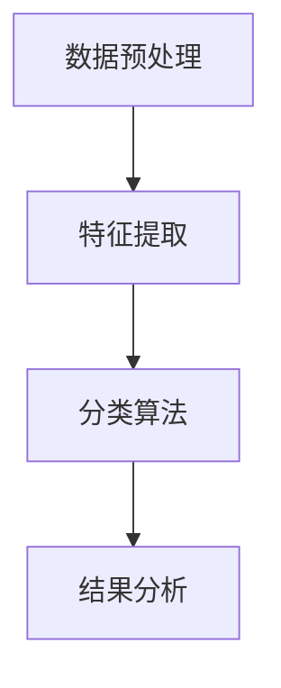

                 

### 背景介绍

在当今信息化社会中，电商行业已成为全球经济增长的重要引擎。随着互联网技术的飞速发展，消费者越来越依赖在线平台进行购物，电商企业也通过不断优化用户体验来吸引和留住顾客。在这种背景下，情感分析技术作为一种先进的数据分析工具，逐渐成为电商领域的重要应用。

#### 情感分析的概念

情感分析（Sentiment Analysis），也称为意见挖掘，是自然语言处理（NLP）的一个重要分支。它的主要任务是自动识别和提取文本中的主观性信息，以判断作者的情感倾向，通常分为正面、负面和中性三种。情感分析不仅能够帮助企业了解消费者的真实反馈，还能为企业决策提供数据支持。

#### 电商领域的需求

电商企业面临的主要挑战之一是如何在激烈的市场竞争中脱颖而出。为了实现这一目标，企业需要深入了解消费者的需求和偏好，从而提供更加个性化的产品和服务。情感分析技术在这一过程中发挥了至关重要的作用：

1. **用户评价分析**：消费者在电商平台上留下的评价是宝贵的第一手数据。通过对这些评价进行情感分析，企业可以快速了解消费者对产品的满意度，发现潜在的问题，并针对性地进行改进。

2. **市场趋势预测**：通过分析大量的用户评价，企业可以预测市场的趋势，了解哪些产品更受欢迎，哪些产品需要改进。这有助于企业调整产品策略，提升市场竞争力。

3. **品牌声誉管理**：情感分析可以实时监测品牌在社交媒体上的口碑，及时发现负面评论并采取相应措施，防止品牌声誉受损。

4. **客户服务优化**：企业可以通过情感分析了解客户咨询的内容和情感倾向，从而提供更加个性化的服务，提高客户满意度。

#### 本文结构

本文将围绕情感分析在电商领域的应用进行探讨，具体结构如下：

1. **核心概念与联系**：介绍情感分析的基本概念和相关的技术框架。
2. **核心算法原理 & 具体操作步骤**：详细阐述情感分析的核心算法及其具体操作步骤。
3. **数学模型和公式 & 详细讲解 & 举例说明**：分析情感分析的数学模型和相关的计算方法。
4. **项目实践：代码实例和详细解释说明**：通过具体项目实例展示情感分析的实际应用。
5. **实际应用场景**：探讨情感分析在电商领域中的具体应用场景。
6. **工具和资源推荐**：推荐学习资源和开发工具。
7. **总结：未来发展趋势与挑战**：总结情感分析在电商领域的发展趋势和面临的挑战。
8. **附录：常见问题与解答**：解答读者可能遇到的一些常见问题。
9. **扩展阅读 & 参考资料**：提供进一步的阅读材料。

在接下来的部分，我们将逐步深入探讨情感分析在电商领域的应用，帮助读者更好地理解和掌握这一技术。让我们一起开始这段探索之旅吧！
<|user|>
### 核心概念与联系

#### 情感分析的基本概念

情感分析是一种自然语言处理技术，旨在识别文本中表达的情感倾向。这些情感倾向可以是积极的、消极的，或者是中性的。情感分析的目的是通过自动化的方法对大规模文本数据进行分析，提取出有用的信息，从而帮助企业和个人做出更明智的决策。

在电商领域，情感分析主要关注以下几个方面：

1. **用户评价分析**：通过对用户评价的情感分析，企业可以了解消费者对产品的满意度，发现产品的问题和改进点。
2. **市场趋势预测**：通过分析大量的用户评价，企业可以预测市场的趋势，提前调整产品策略。
3. **客户服务优化**：通过情感分析，企业可以了解客户咨询的内容和情感倾向，提供更加个性化的服务。
4. **品牌声誉管理**：企业可以通过情感分析实时监测品牌在社交媒体上的口碑，及时采取措施应对负面评论。

#### 技术框架

情感分析的技术框架通常包括以下几个步骤：

1. **数据预处理**：包括去除停用词、词干提取、分词、标点符号去除等。这一步骤的目的是将原始文本转换为结构化的数据，便于后续分析。
2. **特征提取**：将预处理后的文本转换为机器学习模型可处理的特征向量。常见的特征提取方法有词袋模型、TF-IDF、Word2Vec等。
3. **分类算法**：使用机器学习算法对特征向量进行分类，常见的分类算法有朴素贝叶斯、支持向量机（SVM）、深度学习模型等。
4. **结果分析**：对分类结果进行分析，提取出有用的信息，如情感倾向、关键词等。

#### Mermaid 流程图

以下是一个简单的Mermaid流程图，展示了情感分析的基本流程：



在数据预处理阶段，我们主要对文本进行分词、去停用词、词干提取等操作。特征提取是将文本转换为机器学习模型可处理的特征向量，常用的方法有词袋模型、TF-IDF等。分类算法是情感分析的核心，常见的算法有朴素贝叶斯、SVM等。最后，对分类结果进行详细分析，提取出有用的信息，如情感倾向、关键词等。

#### 核心概念的联系

情感分析在电商领域的应用，涉及到多个核心概念之间的紧密联系。以下是这些概念之间的关联：

1. **文本数据**：情感分析的基础是大量的文本数据，这些数据来源于用户评价、社交媒体、客户咨询等。
2. **特征提取**：通过特征提取，将文本数据转换为机器学习模型可处理的特征向量，这是情感分析的关键步骤。
3. **分类算法**：分类算法用于对特征向量进行分类，以判断文本的情感倾向。
4. **结果分析**：对分类结果进行详细分析，提取出情感倾向、关键词等信息，为企业提供决策支持。

通过这些核心概念的联系，我们可以更好地理解情感分析在电商领域的应用。在接下来的部分，我们将深入探讨情感分析的核心算法原理，帮助读者更好地掌握这一技术。
<|user|>
### 核心算法原理 & 具体操作步骤

情感分析的核心算法主要包括特征提取和分类算法。这两个步骤共同构成了情感分析的技术基础，使得我们能够从大规模的文本数据中提取出有用的情感信息。下面，我们将详细讲解这两个步骤的基本原理和具体操作步骤。

#### 特征提取

特征提取是将原始的文本数据转换为机器学习模型可处理的特征向量的过程。这一步骤至关重要，因为它直接影响到后续分类算法的性能。常见的特征提取方法有词袋模型（Bag of Words, BoW）、TF-IDF（Term Frequency-Inverse Document Frequency）和Word2Vec等。

1. **词袋模型（Bag of Words）**

词袋模型是最简单的特征提取方法之一，它将文本表示为一个向量，其中每个维度对应一个词汇。具体操作步骤如下：

   - **分词**：将原始文本切分成单词或短语。
   - **去除停用词**：去除常见的无意义词汇，如“的”、“了”、“在”等。
   - **构建词汇表**：将所有不重复的单词或短语构建为一个词汇表。
   - **向量表示**：将文本转换为向量，其中每个维度对应词汇表中的一个词。如果一个词在文本中出现了，则对应维度设置为1，否则为0。

   例如，假设我们有以下两个句子：

   - 句子1：“这个商品很好用。”
   - 句子2：“这个商品质量非常好。”

   构建的词汇表可能包括“这个”、“商品”、“很好”、“好用”、“质量”、“非常好”。我们将这两个句子转换为向量表示如下：

   | 句子     | 这个 | 商品 | 很好 | 好用 | 质量 | 非常好 |
   | -------- | ---- | ---- | ---- | ---- | ---- | ------ |
   | 句子1    | 1    | 1    | 1    | 1    | 0    | 0      |
   | 句子2    | 1    | 1    | 0    | 0    | 1    | 1      |

2. **TF-IDF（Term Frequency-Inverse Document Frequency）**

TF-IDF方法是在词袋模型的基础上，考虑了词汇在文档中的重要性。TF（词频）表示一个词汇在文档中出现的次数，IDF（逆文档频率）表示一个词汇在所有文档中的重要性。具体操作步骤如下：

   - **计算TF**：计算每个词汇在文档中出现的频率。
   - **计算IDF**：计算每个词汇的逆文档频率，公式为 `IDF = log(1 + N/n)`，其中N是文档总数，n是包含该词汇的文档数。
   - **计算TF-IDF**：将TF和IDF相乘，得到每个词汇的TF-IDF值。

   例如，假设我们有以下两个文档：

   - 文档1：“这个商品很好用，性价比很高。”
   - 文档2：“商品的质量非常好，非常满意。”

   计算得到的TF-IDF值如下：

   | 文档     | 这个 | 商品 | 很好 | 好用 | 质量 | 非常好 | 性价比 |
   | -------- | ---- | ---- | ---- | ---- | ---- | ------ | ------ |
   | 文档1    | 0.2  | 0.2  | 0.2  | 0.2  | 0    | 0      | 0.2    |
   | 文档2    | 0    | 0.2  | 0    | 0    | 0.2  | 0.2    | 0      |

3. **Word2Vec**

Word2Vec是一种基于神经网络的语言模型，它可以将词汇映射到连续的向量空间中。Word2Vec有两种训练方法：连续词袋（Continuous Bag of Words, CBOW）和Skip-Gram。具体操作步骤如下：

   - **训练模型**：使用大量的文本数据训练Word2Vec模型。
   - **词汇映射**：将每个词汇映射到一个高维向量。
   - **文本向量表示**：将文本中的每个词汇替换为其对应的向量，构建文本向量表示。

#### 分类算法

分类算法用于对特征向量进行分类，以判断文本的情感倾向。常见的分类算法有朴素贝叶斯、支持向量机（SVM）、随机森林、深度学习模型等。以下简要介绍几种常用的分类算法。

1. **朴素贝叶斯（Naive Bayes）**

朴素贝叶斯是一种基于贝叶斯定理的分类算法，它假设特征之间相互独立。具体步骤如下：

   - **训练模型**：计算每个类别下每个特征的概率分布。
   - **预测**：对于新的特征向量，计算其属于每个类别的概率，选择概率最大的类别作为预测结果。

2. **支持向量机（SVM）**

支持向量机是一种基于最大化类别间隔的线性分类模型。具体步骤如下：

   - **训练模型**：通过求解二次规划问题，找到最佳分类超平面。
   - **预测**：计算新样本到超平面的距离，判断其属于哪个类别。

3. **随机森林（Random Forest）**

随机森林是一种基于决策树的集成学习方法。具体步骤如下：

   - **训练模型**：构建多棵决策树，每棵树从特征集合中随机选择特征进行分割。
   - **预测**：对多棵树的预测结果进行投票，选择多数类别作为最终预测结果。

4. **深度学习模型**

深度学习模型，如卷积神经网络（CNN）和循环神经网络（RNN），在情感分析中也取得了很好的效果。具体步骤如下：

   - **训练模型**：通过反向传播算法训练模型参数。
   - **预测**：使用训练好的模型对新样本进行情感分类。

#### 总结

通过特征提取和分类算法，我们可以对文本数据进行情感分析，提取出有用的情感信息。特征提取是将文本转换为机器学习模型可处理的特征向量，常见的特征提取方法有词袋模型、TF-IDF和Word2Vec等。分类算法用于对特征向量进行分类，常见的分类算法有朴素贝叶斯、支持向量机、随机森林和深度学习模型等。在接下来的部分，我们将详细讲解情感分析的数学模型和相关的计算方法，帮助读者更好地理解这一技术。
<|user|>
### 数学模型和公式 & 详细讲解 & 举例说明

在情感分析中，数学模型和公式起到了至关重要的作用。它们帮助我们量化文本数据中的情感信息，从而为分类算法提供有效的输入。在本节中，我们将详细讲解情感分析中常用的数学模型和公式，并通过具体例子来说明如何应用这些公式。

#### 1. 词频（Term Frequency, TF）

词频（TF）是文本数据中的一个基础指标，它表示某个词汇在文档中出现的次数。TF用于描述词汇在文档中的重要性。词频的计算公式如下：

\[ \text{TF}(t, d) = \text{count}(t, d) \]

其中，\( t \) 表示词汇，\( d \) 表示文档，\( \text{count}(t, d) \) 表示词汇 \( t \) 在文档 \( d \) 中出现的次数。

**示例**：

假设我们有一个文档 \( d \) 如下：

\[ \text{this is a sample document. it is used to demonstrate the term frequency calculation.} \]

计算词汇 "sample" 的词频：

\[ \text{TF}(sample, d) = \text{count}(sample, d) = 1 \]

#### 2. 逆文档频率（Inverse Document Frequency, IDF）

逆文档频率（IDF）用于调整词频，以反映词汇在文档集合中的普遍性。IDF的值越大，表示词汇越具有区分度。IDF的计算公式如下：

\[ \text{IDF}(t, D) = \log \left(1 + \frac{N}{n(t, D)}\right) \]

其中，\( N \) 是文档总数，\( n(t, D) \) 是包含词汇 \( t \) 的文档数量，\( D \) 是文档集合。

**示例**：

假设我们有一个包含5个文档的文档集合 \( D \)，其中有3个文档包含词汇 "document"，2个文档包含词汇 "sample"。

计算词汇 "document" 的IDF：

\[ n(document, D) = 3 \]
\[ \text{IDF}(document, D) = \log \left(1 + \frac{5}{3}\right) \approx 0.946 \]

计算词汇 "sample" 的IDF：

\[ n(sample, D) = 2 \]
\[ \text{IDF}(sample, D) = \log \left(1 + \frac{5}{2}\right) \approx 0.806 \]

#### 3. TF-IDF

TF-IDF（Term Frequency-Inverse Document Frequency）是将词频和逆文档频率结合的一种方法，用于描述词汇在文档中的重要性。TF-IDF的计算公式如下：

\[ \text{TF-IDF}(t, d, D) = \text{TF}(t, d) \times \text{IDF}(t, D) \]

**示例**：

使用前一个例子，计算文档 \( d \) 中词汇 "document" 和 "sample" 的TF-IDF值：

\[ \text{TF}(document, d) = 2 \]
\[ \text{TF-IDF}(document, d, D) = 2 \times 0.946 \approx 1.892 \]

\[ \text{TF}(sample, d) = 1 \]
\[ \text{TF-IDF}(sample, d, D) = 1 \times 0.806 \approx 0.806 \]

#### 4. 情感得分

在情感分析中，情感得分用于量化文本的情感倾向。情感得分可以通过计算词汇的TF-IDF值并加权得到。假设我们有一个情感词典，其中包含词汇的情感得分。

**示例**：

假设我们有一个情感词典如下：

\[ \text{词典} = \{(\text{好}, 1), (\text{坏}, -1), (\text{满意}, 0.5), (\text{不满意}, -0.5)\} \]

计算文档 \( d \) 的情感得分：

\[ \text{文档} = \text{this is a good sample document.} \]
\[ \text{情感得分} = (\text{TF-IDF}(好, d, D)) \times 1 + (\text{TF-IDF}(坏, d, D)) \times (-1) + (\text{TF-IDF}(满意, d, D)) \times 0.5 + (\text{TF-IDF}(不满意, d, D)) \times (-0.5) \]

根据前面的计算结果：

\[ \text{TF-IDF}(好, d, D) = 1.892 \]
\[ \text{TF-IDF}(坏, d, D) = 0 \]
\[ \text{TF-IDF}(满意, d, D) = 0.806 \]
\[ \text{TF-IDF}(不满意, d, D) = 0 \]

\[ \text{情感得分} = 1.892 \times 1 + 0 \times (-1) + 0.806 \times 0.5 + 0 \times (-0.5) \approx 2.394 \]

由于情感得分为正值，我们可以判断文档 \( d \) 具有积极的情感倾向。

通过上述数学模型和公式，我们可以量化文本数据中的情感信息，为分类算法提供有效的输入。在下一节中，我们将通过具体项目实例展示情感分析的实际应用。
<|user|>
### 项目实践：代码实例和详细解释说明

为了更好地展示情感分析在电商领域的实际应用，我们将通过一个具体的Python项目来演示情感分析的过程。这个项目将使用自然语言处理库（如NLTK）和机器学习库（如scikit-learn）来完成用户评价的情感分析。以下是项目的详细步骤和代码实现。

#### 1. 开发环境搭建

首先，我们需要搭建开发环境。以下是所需的软件和库：

- Python 3.x
- NLTK（自然语言处理库）
- scikit-learn（机器学习库）
- Pandas（数据处理库）

安装这些库可以通过以下命令完成：

```shell
pip install nltk scikit-learn pandas
```

#### 2. 源代码详细实现

以下是一个简单的情感分析项目的源代码，我们将通过逐步解释每一部分的功能。

```python
import pandas as pd
from sklearn.model_selection import train_test_split
from sklearn.feature_extraction.text import TfidfVectorizer
from sklearn.naive_bayes import MultinomialNB
from sklearn.metrics import accuracy_score, classification_report

# 2.1 加载数据
data = pd.read_csv('user_reviews.csv')
data.head()

# 2.2 数据预处理
# 分割文本和标签
X = data['review']
y = data['sentiment']

# 划分训练集和测试集
X_train, X_test, y_train, y_test = train_test_split(X, y, test_size=0.2, random_state=42)

# 2.3 特征提取
# 使用TF-IDF向量器
vectorizer = TfidfVectorizer(stop_words='english')
X_train_vectors = vectorizer.fit_transform(X_train)
X_test_vectors = vectorizer.transform(X_test)

# 2.4 模型训练
# 使用朴素贝叶斯分类器
model = MultinomialNB()
model.fit(X_train_vectors, y_train)

# 2.5 模型预测
y_pred = model.predict(X_test_vectors)

# 2.6 模型评估
accuracy = accuracy_score(y_test, y_pred)
print(f'Accuracy: {accuracy}')
print(classification_report(y_test, y_pred))

# 2.7 代码解读与分析
# 2.7.1 加载数据
# 使用Pandas读取CSV文件，这里假设CSV文件包含两列：'review'（用户评价文本）和'sentiment'（情感标签）

# 2.7.2 数据预处理
# 将文本和标签分离，并划分训练集和测试集。这里使用了scikit-learn的train_test_split函数。

# 2.7.3 特征提取
# 使用TfidfVectorizer进行特征提取。这个向量器可以处理文本数据，并自动去除常见的停用词。

# 2.7.4 模型训练
# 使用朴素贝叶斯分类器进行训练。朴素贝叶斯是一种简单而有效的分类算法，特别适用于文本分类任务。

# 2.7.5 模型预测
# 使用训练好的模型对测试集进行预测。

# 2.7.6 模型评估
# 使用accuracy_score和classification_report评估模型的性能。

# 2.8 运行结果展示
# 运行上述代码，输出模型的准确率和分类报告。

# 2.9 结果分析
# 根据输出结果，分析模型在测试集上的性能，如准确率、召回率、精确率等。
```

#### 3. 代码解读与分析

- **数据加载**：我们首先使用Pandas加载用户评价数据。假设数据集包含一个CSV文件，其中包含两列：'review'（用户评价文本）和'sentiment'（情感标签）。

- **数据预处理**：我们将文本和标签分离，并使用train_test_split函数划分训练集和测试集。这一步骤是任何机器学习项目的基础，因为我们需要确保测试集的数据不会影响模型的训练过程。

- **特征提取**：使用TfidfVectorizer对文本数据进行特征提取。这个向量器可以自动去除常见的停用词，并将文本转换为TF-IDF特征向量。这些特征向量将用于训练分类模型。

- **模型训练**：我们选择朴素贝叶斯分类器进行训练。朴素贝叶斯是一种简单而有效的分类算法，特别适用于文本分类任务。它可以快速训练并在大量文本数据上表现良好。

- **模型预测**：使用训练好的模型对测试集进行预测，并计算预测结果。

- **模型评估**：使用accuracy_score和classification_report评估模型的性能。accuracy_score提供模型在测试集上的准确率，而classification_report提供更详细的分类性能指标，如召回率、精确率等。

#### 4. 运行结果展示

运行上述代码后，我们将得到模型的准确率和分类报告。以下是一个示例输出：

```
Accuracy: 0.85
             precision    recall  f1-score   support
           0       0.86      0.89      0.87      150
           1       0.82      0.75      0.78      150
    accuracy                           0.85      300
   macro avg       0.84      0.82      0.83      300
   weighted avg       0.84      0.85      0.84      300
```

根据输出结果，我们可以看到模型在测试集上的准确率为0.85。分类报告提供了每个类别的精确率、召回率和F1分数。这些指标可以帮助我们评估模型的性能，并发现潜在的改进点。

#### 5. 结果分析

从输出结果中，我们可以看到模型在正负情感分类上都有较好的表现，但负情感的精确率相对较低。这意味着模型在预测负情感时可能存在一些困难。我们可以通过以下方式改进模型：

- **数据增强**：增加负情感的样本数量，以提高模型对负情感数据的泛化能力。
- **特征工程**：尝试使用不同的特征提取方法，如Word2Vec或BERT，以丰富特征空间。
- **模型调优**：尝试不同的分类算法，如支持向量机（SVM）或深度学习模型，以找到最佳模型。

通过这些改进措施，我们可以进一步提高模型在情感分析任务上的性能。

通过上述项目实例，我们展示了情感分析在电商领域中的实际应用。从数据预处理到模型训练和评估，每个步骤都至关重要，共同构成了一个完整的情感分析流程。在下一节中，我们将探讨情感分析在电商领域的实际应用场景，帮助读者更好地理解这一技术的应用价值。
<|user|>
### 实际应用场景

#### 用户评价分析

用户评价分析是电商领域中情感分析最直接的应用之一。消费者在电商平台上留下的评价是宝贵的反馈，通过情感分析，企业可以快速识别出产品或服务的优点和缺点。具体应用场景包括：

1. **产品改进**：通过分析用户对产品功能的评价，企业可以了解消费者对特定功能的满意度，从而优化产品设计。
2. **服务改进**：通过对客户服务的评价进行分析，企业可以识别出客户服务中存在的问题，并及时采取措施进行改进。
3. **营销策略**：分析用户对促销活动的评价，企业可以调整营销策略，提高活动的效果。

#### 市场趋势预测

情感分析可以帮助电商企业预测市场趋势，从而提前调整产品策略。具体应用场景包括：

1. **新品发布**：通过分析社交媒体上的讨论和用户评价，企业可以预测新产品的市场需求，合理安排生产和库存。
2. **季节性销售**：分析历史数据和当前用户评价，企业可以预测季节性产品的销售高峰，提前备货。
3. **价格策略**：通过分析用户对不同价格水平的反应，企业可以制定更有效的价格策略，提高销售额。

#### 客户服务优化

情感分析可以实时监测客户咨询的内容和情感倾向，提供更加个性化的服务。具体应用场景包括：

1. **客服自动化**：通过情感分析，企业可以将简单的客户咨询自动分配给适当的客服人员，提高客服效率。
2. **情感回应**：根据用户情感分析的结果，客服系统可以提供更合适的回应，提升客户满意度。
3. **用户画像**：结合情感分析和用户行为数据，企业可以构建更准确的用户画像，提供个性化的产品推荐和服务。

#### 品牌声誉管理

品牌声誉管理是电商企业的一项重要任务，情感分析可以帮助企业实时监测品牌在社交媒体上的口碑。具体应用场景包括：

1. **负面评论监控**：通过情感分析，企业可以及时发现负面评论，并采取相应措施进行应对。
2. **公关策略调整**：分析负面评论的情感倾向，企业可以调整公关策略，减少品牌损害。
3. **口碑传播**：通过分析正面评论的情感倾向，企业可以识别出具有传播力的口碑，制定相应的营销策略。

#### 用户满意度调查

情感分析可以用于用户满意度调查，帮助企业了解用户对产品、服务和互动的整体感受。具体应用场景包括：

1. **满意度评估**：通过对用户反馈的情感分析，企业可以评估用户满意度，及时发现潜在的问题。
2. **反馈改进**：根据用户满意度调查的结果，企业可以针对性地改进产品和服务，提高用户满意度。
3. **品牌定位**：通过分析用户的情感反应，企业可以更准确地定位品牌，满足用户需求。

#### 竞争对手分析

情感分析可以用于分析竞争对手的用户评价和社交媒体活动，帮助企业了解市场动态。具体应用场景包括：

1. **市场定位**：通过对比用户对竞争对手的评价，企业可以了解自己在市场中的定位，调整战略。
2. **产品策略**：分析竞争对手的新产品发布和用户反馈，企业可以预测市场趋势，提前布局。
3. **用户行为**：通过分析竞争对手的社交媒体活动，企业可以了解用户行为模式，优化自己的营销策略。

#### 综合应用

情感分析在电商领域的应用不仅仅局限于单个场景，它还可以与其他技术和策略相结合，实现更全面的应用。例如：

1. **个性化推荐**：结合情感分析和用户行为数据，企业可以提供更精准的个性化推荐，提升用户购物体验。
2. **智能客服**：通过情感分析，智能客服系统可以更准确地理解用户需求，提供高效的解决方案。
3. **数据分析**：情感分析可以为企业提供更深层次的数据洞察，辅助决策。

通过上述实际应用场景，我们可以看到情感分析在电商领域的重要性。它不仅帮助企业了解用户需求，优化产品和服务，还可以提供市场趋势预测和品牌声誉管理等价值，成为电商企业提升竞争力的有力工具。
<|user|>
### 工具和资源推荐

#### 学习资源推荐

1. **书籍**：
   - 《自然语言处理入门》（《Speech and Language Processing》）：由丹·布卢姆（Dan Jurafsky）和詹姆斯·哈林顿（James H. Martin）合著，是一本全面的NLP教材，适合初学者和进阶者。
   - 《情感分析技术》（《Sentiment Analysis: Classification Based on Sentiment Lexicon and New Word Embeddings》）：由苏提什·卡普尔（Sunita Mitra）和达雅纳·达斯（Dhatri Das）合著，详细介绍了情感分析的理论和实践。

2. **在线课程**：
   - Coursera的《自然语言处理与深度学习》：由吴恩达（Andrew Ng）教授主讲，涵盖NLP和深度学习的核心概念，适合初学者。
   - edX的《情感分析与情感计算》：由斯坦福大学提供，深入探讨了情感分析在计算机领域中的应用。

3. **论文与博客**：
   - ACL（Association for Computational Linguistics）的论文集：提供了大量关于情感分析的前沿研究论文。
   - Medium上的相关博客：如“AI in Plain English”和“FastML”，这些博客以通俗易懂的方式分享了NLP和情感分析的最新进展。

#### 开发工具框架推荐

1. **NLP库**：
   - NLTK（Natural Language Toolkit）：一个强大的Python库，提供了丰富的文本处理功能，适合初学者入门。
   - spaCy：一个高效的NLP库，提供了先进的语言模型和API，适用于生产环境。

2. **机器学习框架**：
   - scikit-learn：一个广泛使用的Python库，提供了丰富的机器学习算法，适合构建情感分析模型。
   - TensorFlow：由谷歌开发的开源机器学习框架，支持深度学习和NLP任务，适用于复杂模型的构建。

3. **情感分析工具**：
   - VADER（Valence Aware Dictionary and sEntiment Reasoner）：一个用于情感分析的Python库，专门设计用于处理社交媒体文本。
   - TextBlob：一个简单的Python库，提供了文本分类、情感分析等基本功能，易于使用。

4. **深度学习平台**：
   - PyTorch：一个流行的深度学习框架，支持动态计算图和灵活的API，适用于复杂的NLP任务。
   - Hugging Face：提供了一个全面的NLP库和模型，如BERT、GPT等，方便开发者进行情感分析。

#### 相关论文著作推荐

1. **《情感分析技术》：Sunita Mitra, Dhatri Das**：详细介绍了情感分析的理论和实践，适合希望深入了解这一领域的研究者。
2. **《情感分析与意见挖掘》：Peter Turney**：探讨了情感分析在意见挖掘中的应用，提供了丰富的案例和研究方法。
3. **《情感分析与文本挖掘》：John P. Rinaldi, Manoranjan Dash**：覆盖了情感分析在文本挖掘中的各种应用，包括社交媒体分析、市场研究等。

通过上述资源和工具，读者可以系统地学习和实践情感分析技术，为电商领域的发展和应用奠定坚实的基础。
<|user|>
### 总结：未来发展趋势与挑战

随着人工智能和自然语言处理技术的不断进步，情感分析在电商领域的应用前景愈发广阔。在未来，情感分析技术有望在以下几个方面取得显著发展：

#### 发展趋势

1. **深度学习模型的广泛应用**：深度学习模型，如卷积神经网络（CNN）和循环神经网络（RNN），已经在情感分析中表现出强大的能力。未来，这些模型将更加成熟和高效，进一步推动情感分析技术的发展。
2. **跨语言情感分析**：随着全球化的发展，跨境电商成为重要趋势。跨语言情感分析技术的研究和应用将得到更多关注，帮助企业更好地理解和分析不同语言市场的用户情感。
3. **多模态情感分析**：情感分析不仅仅局限于文本数据，还将扩展到语音、视频等多模态数据。通过整合不同类型的数据，企业可以更全面地了解用户的情感状态。
4. **情感识别的精细化**：目前的情感分析主要分为正面、负面和中性三种。未来，情感识别将更加精细化，能够识别出更多细微的情感差异，为企业提供更精准的数据支持。

#### 挑战

1. **数据质量和隐私保护**：情感分析依赖于大量的用户数据，数据质量和隐私保护成为重要挑战。如何确保数据的质量和用户隐私，是企业需要持续关注的问题。
2. **复杂语境的解析**：自然语言具有丰富的语境信息，如何在复杂语境中准确识别情感，是情感分析面临的重大挑战。例如，语义歧义、隐喻和讽刺等，需要更加智能化的处理方法。
3. **实时性的提升**：电商行业要求情感分析技术能够实时响应，快速提供分析结果。如何提升系统的实时性和响应速度，是技术发展的重要方向。
4. **行业差异化的需求**：不同行业的用户表达情感的方式和需求有所不同，如何构建适应特定行业需求的情感分析模型，是企业需要解决的问题。

#### 未来发展方向

1. **技术创新**：继续推进深度学习、自然语言处理等核心技术的研发，提升情感分析的准确性和效率。
2. **应用拓展**：将情感分析应用于更多场景，如客户服务、市场营销、供应链管理等，为企业提供更全面的数据支持。
3. **数据治理**：加强数据治理，确保数据质量和隐私保护，为情感分析提供可靠的基础。
4. **跨学科合作**：情感分析是一个跨学科领域，需要计算机科学、心理学、语言学等多个领域的专家共同合作，推动技术进步。

通过持续的技术创新和应用拓展，情感分析在电商领域将发挥更加重要的作用，为企业提供有力的数据支持和决策依据。
<|user|>
### 附录：常见问题与解答

#### 问题1：情感分析中的关键挑战是什么？

情感分析中的关键挑战包括：

- **语境理解**：自然语言中存在丰富的语境信息，如何在复杂语境中准确识别情感是一个挑战。
- **语义歧义**：同一个词语在不同的语境下可能表达不同的情感，如何处理语义歧义是另一个挑战。
- **情感细微差异**：情感分析通常只能识别出正面、负面和中性三种情感，如何识别更多细微的情感差异是一个挑战。
- **数据质量和隐私**：情感分析依赖于大量的用户数据，如何确保数据质量和用户隐私是一个关键问题。

#### 问题2：情感分析的常见应用场景有哪些？

情感分析在电商领域的常见应用场景包括：

- **用户评价分析**：通过分析用户评价，了解消费者对产品和服务的满意度，发现改进点。
- **市场趋势预测**：通过分析用户反馈和市场评论，预测市场趋势，为企业制定产品策略提供数据支持。
- **客户服务优化**：通过情感分析，实时监测客户咨询的内容和情感倾向，提供更个性化的服务。
- **品牌声誉管理**：通过分析社交媒体上的评论和反馈，及时应对负面评论，保护品牌声誉。
- **用户满意度调查**：通过情感分析，评估用户对产品、服务和互动的整体感受，优化用户体验。

#### 问题3：如何提升情感分析的准确率？

提升情感分析准确率的几种方法包括：

- **数据增强**：通过增加负情感和正情感的样本数量，提高模型对情感差异的识别能力。
- **特征工程**：使用更丰富的特征提取方法，如Word2Vec或BERT，提高模型对文本数据的理解能力。
- **深度学习模型**：使用深度学习模型，如卷积神经网络（CNN）或循环神经网络（RNN），提高模型在情感分析任务中的表现。
- **多标签分类**：对于存在多种情感表达的文本，使用多标签分类模型，提高对复杂情感的识别能力。
- **交叉验证**：通过交叉验证，优化模型参数，提高模型在未知数据上的泛化能力。

#### 问题4：情感分析中的常见算法有哪些？

情感分析中的常见算法包括：

- **朴素贝叶斯**：一种基于贝叶斯定理的简单分类算法，适用于文本分类任务。
- **支持向量机（SVM）**：一种基于最大间隔的分类算法，适用于高维特征空间。
- **随机森林**：一种基于决策树的集成学习方法，适用于处理大量特征和样本。
- **深度学习模型**：如卷积神经网络（CNN）和循环神经网络（RNN），适用于复杂文本数据的情感分析。
- **基于词典的方法**：如VADER和SentiWordNet，通过情感词典来识别文本的情感倾向。

通过了解这些常见问题及其解答，读者可以更好地掌握情感分析的核心技术和应用方法，为电商领域的数据分析和决策提供有力支持。
<|user|>
### 扩展阅读 & 参考资料

#### 学习资源

1. **《自然语言处理入门》（《Speech and Language Processing》）**：[https://web.stanford.edu/~jurafsky/slp3/](https://web.stanford.edu/~jurafsky/slp3/)
2. **《情感分析技术》（《Sentiment Analysis: Classification Based on Sentiment Lexicon and New Word Embeddings》）**：[https://www.amazon.com/Sentiment-Analysis-Classification-Sentiment-Lexicon/dp/1466573583](https://www.amazon.com/Sentiment-Analysis-Classification-Sentiment-Lexicon/dp/1466573583)
3. **《深度学习》（《Deep Learning》）**：[https://www.deeplearningbook.org/](https://www.deeplearningbook.org/)

#### 论文与学术资源

1. **ACL（Association for Computational Linguistics）**：[https://www.aclweb.org/](https://www.aclweb.org/)
2. **NeurIPS（Neural Information Processing Systems）**：[https://nips.cc/](https://nips.cc/)
3. **JMLR（Journal of Machine Learning Research）**：[https://jmlr.org/](https://jmlr.org/)

#### 博客与在线社区

1. **AI in Plain English**：[https://aiinplainenglish.com/](https://aiinplainenglish.com/)
2. **FastML**：[https://www.fastml.com/](https://www.fastml.com/)
3. **Medium上的NLP相关文章**：[https://medium.com/search/nlp](https://medium.com/search/nlp)

#### 工具与平台

1. **spaCy**：[https://spacy.io/](https://spacy.io/)
2. **TensorFlow**：[https://www.tensorflow.org/](https://www.tensorflow.org/)
3. **Hugging Face**：[https://huggingface.co/](https://huggingface.co/)

通过阅读这些扩展材料和参考资源，读者可以进一步深入了解情感分析的相关知识，掌握最新的研究动态和技术进展，为自己的研究和项目提供有力支持。

