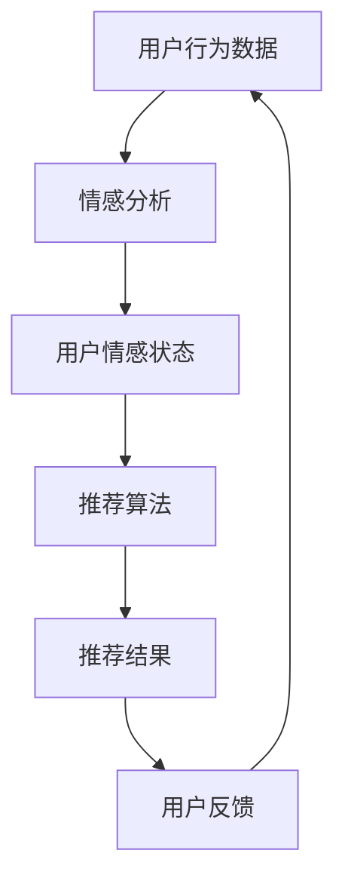

                 

### 背景介绍 Background Introduction

情感驱动推荐系统是一种先进的推荐算法，它利用用户情绪信息来改善传统推荐系统的效果。随着互联网和移动设备的普及，用户生成的内容急剧增加，传统基于内容的推荐系统（Content-Based Filtering，CBF）和协同过滤推荐系统（Collaborative Filtering，CF）在处理用户个性化需求方面面临着诸多挑战。例如，用户的行为数据往往不足以准确反映其真实的偏好，而用户的情感状态则可以更深入地揭示其内在需求。

在推荐系统中引入情感分析，可以帮助识别用户的情感状态，从而更好地理解用户的需求和偏好。情感驱动推荐系统能够根据用户的情绪变化动态调整推荐策略，提供更加个性化和贴近用户实际需求的推荐内容。这一概念的重要性在于：

1. **提升用户体验**：情感驱动推荐系统可以更好地捕捉用户的情感变化，提供更符合用户心理预期的内容，从而提升用户满意度和参与度。
2. **增强推荐准确性**：通过分析用户的情绪状态，推荐系统可以更加准确地识别用户当前的兴趣和需求，减少推荐偏差。
3. **应对信息过载**：在信息爆炸的时代，情感驱动推荐系统能够帮助用户快速找到感兴趣的内容，减少信息过载的压力。

本篇文章将深入探讨情感驱动推荐系统的理论基础、实现方法、应用实例，并展望其未来的发展趋势和面临的挑战。

### 核心概念与联系 Core Concepts and Relationships

在深入探讨情感驱动推荐系统之前，我们需要了解几个核心概念：情感分析、推荐算法和用户行为数据。

#### 情感分析

情感分析（Sentiment Analysis），也称为意见挖掘，是指使用自然语言处理（NLP）技术从文本数据中识别情感极性（正面、负面或中性）和强度。情感分析通常分为三个层次：分类、极性评分和情感强度分析。在推荐系统中，情感分析能够帮助识别用户的情绪状态，从而为推荐内容提供额外的信息。

**分类**：将文本分类为正面、负面或中性情感。例如，通过分析用户评论，识别其是否满意或失望。

**极性评分**：对文本的情感极性进行量化评分，例如，可以将情感分为5个等级（-2到2），其中-2表示极度负面，2表示极度正面。

**情感强度分析**：分析文本中情感表达的强度，例如，"非常喜欢"和"喜欢"的情感强度不同。

#### 推荐算法

推荐算法是推荐系统的核心，主要包括以下几种：

1. **基于内容的推荐（Content-Based Filtering, CBF）**：根据用户过去的偏好和内容特征为用户推荐相似的内容。例如，用户喜欢一部电影，推荐系统中会找到相似的电影。

2. **协同过滤推荐（Collaborative Filtering, CF）**：通过分析用户之间的相似性来推荐内容。这种方法依赖于用户行为数据，例如，用户A和用户B都购买了商品X，那么用户B可能对用户A购买的商品Y也感兴趣。

3. **混合推荐（Hybrid Recommendation）**：结合CBF和CF的优点，以期望获得更好的推荐效果。例如，可以先使用CBF找到潜在感兴趣的内容，然后使用CF进一步优化推荐结果。

#### 用户行为数据

用户行为数据是推荐系统的重要输入，包括用户的历史行为、搜索记录、浏览时长、点击率等。这些数据可以帮助推荐系统理解用户当前的偏好和兴趣。然而，这些数据往往不足以全面反映用户的真实需求，因此引入情感分析可以帮助补充这一缺失。

#### Mermaid 流程图

以下是情感驱动推荐系统的Mermaid流程图，展示了各个核心概念之间的联系：



- **用户行为数据**：用户在网站上的活动数据，如浏览、点击、购买等。
- **情感分析**：使用NLP技术分析用户行为数据中的情感内容。
- **用户情感状态**：根据情感分析结果，识别用户的情感状态。
- **推荐算法**：结合用户情感状态和传统推荐算法，生成推荐结果。
- **推荐结果**：推荐系统输出推荐内容给用户。
- **用户反馈**：用户对推荐结果的反馈，用于优化推荐系统。

通过这一流程，我们可以看到情感驱动推荐系统如何通过情感分析来提升推荐的个性化和准确性。

### 核心算法原理 & 具体操作步骤 Core Algorithm Principles & Operation Steps

情感驱动推荐系统的核心在于如何将用户的情感状态融入传统的推荐算法中，以提高推荐效果的个性化和准确性。下面，我们将详细介绍情感驱动推荐系统的算法原理和具体操作步骤。

#### 1. 数据预处理

数据预处理是情感驱动推荐系统的第一步，主要包括以下任务：

- **数据收集**：收集用户在网站上的行为数据，如浏览记录、点击日志、搜索查询、评论等。
- **情感标注**：对用户生成的内容（如评论、评价）进行情感标注。可以使用预训练的NLP模型（如BERT、GPT）来自动标注情感极性（正面、负面或中性）和强度。
- **数据清洗**：去除无效数据和噪声，例如去除重复记录、处理缺失值和异常值。

#### 2. 情感特征提取

情感特征提取是将文本数据转换为机器学习模型可用的数值特征的过程。具体步骤如下：

- **情感极性分类**：将情感标注结果分为正面、负面或中性，并转换为对应的数值（例如，正面为1，负面为-1，中性为0）。
- **情感强度量化**：对情感强度进行量化，例如，将情感强度分为5个等级（-2到2），并使用独热编码（One-Hot Encoding）表示。
- **文本嵌入**：使用词向量模型（如Word2Vec、GloVe）将文本转换为固定长度的向量表示。这一步可以将文本信息转换为机器学习模型可处理的数值形式。

#### 3. 传统推荐算法与情感特征融合

将情感特征与传统推荐算法相结合，以生成更个性化的推荐结果。具体方法如下：

- **基于内容的推荐（CBF）**：将用户的历史偏好和情感特征作为内容特征，使用TF-IDF或词袋模型（Bag of Words）计算内容相似度，为用户推荐相似的内容。
  
- **协同过滤推荐（CF）**：结合用户的情感特征和传统协同过滤算法（如用户基于的协同过滤（User-Based CF）或物品基于的协同过滤（Item-Based CF）），通过调整相似度计算公式，融入情感特征。例如，可以在计算用户之间的相似度时，考虑用户之间的情感极性一致性。

- **混合推荐算法**：将基于内容和协同过滤的推荐结果进行融合，利用加权求和或投票机制生成最终的推荐结果。情感特征可以用来调整不同推荐算法的权重，从而优化推荐效果。

#### 4. 模型训练与评估

使用融合后的数据训练推荐模型，并评估模型的性能。具体步骤如下：

- **特征工程**：根据数据集的特点和需求，选择合适的特征进行工程。例如，可以结合用户历史行为特征、情感特征和内容特征，构建一个综合特征向量。
  
- **模型选择**：选择适合的机器学习模型进行训练，如线性回归、决策树、随机森林、支持向量机（SVM）等。对于复杂的推荐任务，可以使用深度学习模型，如神经网络（Neural Networks）或图神经网络（Graph Neural Networks）。

- **交叉验证**：使用交叉验证（Cross-Validation）方法评估模型的性能，包括准确率、召回率、F1分数等指标。

- **模型优化**：根据评估结果调整模型参数，优化模型性能。可以使用网格搜索（Grid Search）或随机搜索（Random Search）等方法进行超参数调优。

#### 5. 推荐结果生成与反馈

根据训练好的模型生成推荐结果，并将其呈现给用户。具体步骤如下：

- **推荐生成**：使用训练好的模型，为用户生成个性化推荐列表。可以根据用户的历史行为、情感状态和当前上下文信息，动态调整推荐策略。
  
- **用户反馈**：收集用户对推荐结果的反馈，例如点击率、转化率等指标。这些反馈可以用于进一步优化推荐系统。

通过以上步骤，情感驱动推荐系统可以有效地利用用户的情感信息，提高推荐的个性化和准确性。在实际应用中，不同的推荐场景和需求可能会导致具体的实现细节有所差异，但总体原理和方法是相似的。

### 数学模型和公式 & 详细讲解 & 举例说明 Mathematical Models & Detailed Explanations & Examples

在情感驱动推荐系统中，数学模型和公式起着关键作用，用于处理和分析用户的情感特征，并将其融入到推荐算法中。下面，我们将详细讲解情感分析中的数学模型和公式，并通过具体示例来展示如何应用这些公式。

#### 1. 情感极性分类模型

情感极性分类模型用于将文本数据分类为正面、负面或中性情感。一个常见的模型是使用支持向量机（SVM）进行分类。

**公式**：

$$
\begin{aligned}
& \text{给定文本} x \text{和类别标签} y = \{-1, 0, 1\}, \\
& \text{SVM分类模型可表示为：} \\
& \text{分类边界} \ \mathbf{w}^T \mathbf{x} + b = 0, \\
& \text{其中，} \mathbf{w} \text{是权重向量，} b \text{是偏置项。}
\end{aligned}
$$

**示例**：

假设我们有一个简单的情感分类任务，使用SVM模型对以下两条评论进行分类：

- 评论A："这部电影真的很棒，我非常喜欢它！"
- 评论B："这部电影太糟糕了，我完全不喜欢它。"

我们使用词向量模型将评论转换为向量表示：

- $ \mathbf{x}_A = [1, 1, 0, 0.5, -1] $
- $ \mathbf{x}_B = [-1, 0, -1, -0.5, 1] $

使用SVM模型，我们得到分类边界：

- $ \mathbf{w}^T \mathbf{x} + b = 0 \Rightarrow [1, 1, 0, 0.5, -1]^T [1, 1, 0, 0.5, -1] + b = 0 \Rightarrow w_1 + w_2 - w_4 + 0.5w_5 + b = 0 $

通过调整权重和偏置项，我们可以将评论A分类为正面情感，将评论B分类为负面情感。

#### 2. 情感强度量化模型

情感强度量化模型用于对文本中的情感强度进行量化，通常使用极性评分和强度评分相结合的方法。

**公式**：

$$
\begin{aligned}
& \text{情感强度评分} s \in \{-2, -1, 0, 1, 2\}, \\
& \text{评分公式为：} \\
& s = \text{sign}(\sum_{i=1}^{n} w_i x_i) + 1, \\
& \text{其中，} w_i \text{是情感词的权重，} x_i \text{是情感词的极性值（1或-1）。}
\end{aligned}
$$

**示例**：

假设我们对以下两个句子进行情感强度量化：

- 句子A："这部电影非常好，非常值得观看。"
- 句子B："这个产品不太好，不是我所期望的。"

我们将句子中的情感词提取出来，并计算它们的权重和极性值：

- 句子A：情感词["好"，"值得"]，权重[0.6, 0.4]，极性值[1, 1]。
- 句子B：情感词["不好"，"期望"]，权重[0.4, 0.6]，极性值[-1, -1]。

使用评分公式，我们可以得到：

- 句子A的评分：$ s_A = \text{sign}([0.6 \times 1 + 0.4 \times 1]) + 1 = 1 + 1 = 2 $。
- 句子B的评分：$ s_B = \text{sign}([0.4 \times -1 + 0.6 \times -1]) + 1 = -1 + 1 = 0 $。

因此，句子A的情感强度评分为2（非常正面），句子B的情感强度评分为0（中性）。

#### 3. 情感特征融合模型

在情感驱动推荐系统中，情感特征通常与传统推荐算法特征（如用户行为特征和内容特征）融合，以生成综合特征向量。

**公式**：

$$
\begin{aligned}
& \text{综合特征向量} \mathbf{z} = \mathbf{w}_x \mathbf{x} + \mathbf{w}_s \mathbf{s}, \\
& \text{其中，} \mathbf{w}_x \text{和} \mathbf{w}_s \text{是权重向量，} \mathbf{x} \text{是用户行为特征向量，} \mathbf{s} \text{是情感特征向量。}
\end{aligned}
$$

**示例**：

假设我们有以下用户行为特征和情感特征：

- 用户行为特征：$ \mathbf{x} = [1, 0.5, 0.3] $。
- 情感特征：$ \mathbf{s} = [0.8, -0.2] $。

我们定义权重向量为：

- $ \mathbf{w}_x = [0.4, 0.3, 0.3] $。
- $ \mathbf{w}_s = [0.5, 0.5] $。

使用综合特征公式，我们可以得到：

- $ \mathbf{z} = \mathbf{w}_x \mathbf{x} + \mathbf{w}_s \mathbf{s} = [0.4 \times 1 + 0.3 \times 0.5 + 0.3 \times 0.3, 0.4 \times 0.5 + 0.3 \times -0.2 + 0.3 \times 0.8] = [0.63, 0.47] $。

因此，综合特征向量为$ \mathbf{z} = [0.63, 0.47] $。

通过上述数学模型和公式，我们可以有效地提取、量化和分析用户的情感特征，并将其融入到推荐系统中，以生成更个性化的推荐结果。这些模型和方法为情感驱动推荐系统提供了理论基础和实现路径，有助于提升推荐系统的性能和用户体验。

### 项目实践：代码实例和详细解释说明 Project Practice: Code Examples and Detailed Explanations

在这一部分，我们将通过一个实际项目来展示情感驱动推荐系统的实现过程。该项目将使用Python编程语言和相关的库，如Scikit-Learn、NLTK和TensorFlow，来实现一个简单的情感驱动推荐系统。

#### 1. 开发环境搭建

首先，我们需要搭建开发环境。以下是所需的Python库和其安装命令：

- **Scikit-Learn**：用于数据预处理和机器学习模型训练。
  ```shell
  pip install scikit-learn
  ```

- **NLTK**：用于情感分析。
  ```shell
  pip install nltk
  ```

- **TensorFlow**：用于深度学习模型的训练。
  ```shell
  pip install tensorflow
  ```

- **Gensim**：用于文本嵌入。
  ```shell
  pip install gensim
  ```

确保安装了上述库之后，我们就可以开始编写代码了。

#### 2. 源代码详细实现

下面是情感驱动推荐系统的源代码实现。为了简洁，我们将只展示主要步骤和关键代码。

**数据预处理**

```python
import pandas as pd
from nltk.corpus import stopwords
from nltk.tokenize import word_tokenize

# 加载电影评论数据集
data = pd.read_csv('movie_reviews.csv')

# 数据清洗
stop_words = set(stopwords.words('english'))
data['cleaned_text'] = data['review'].apply(lambda x: ' '.join([word for word in word_tokenize(x) if word not in stop_words]))
```

**情感分析**

```python
from nltk.sentiment import SentimentIntensityAnalyzer

# 初始化情感分析器
sia = SentimentIntensityAnalyzer()

# 情感分析
data['sentiment'] = data['cleaned_text'].apply(lambda x: sia.polarity_scores(x)['compound'])
```

**文本嵌入**

```python
import gensim.downloader as api

# 加载预训练的Word2Vec模型
word2vec = api.load('glove-wiki-gigaword-100')

# 将文本转换为词向量
def vectorize_text(text):
    return [word2vec[word] for word in text if word in word2vec]

data['word_vectors'] = data['cleaned_text'].apply(lambda x: vectorize_text(x))
```

**构建推荐模型**

```python
from sklearn.model_selection import train_test_split
from sklearn.metrics.pairwise import cosine_similarity

# 分割数据集
X_train, X_test, y_train, y_test = train_test_split(data['word_vectors'], data['sentiment'], test_size=0.2, random_state=42)

# 计算词向量之间的余弦相似度
similarity_matrix = cosine_similarity(X_train, X_test)

# 生成推荐列表
def recommend_movies(movie_id, similarity_matrix, data, top_n=5):
    movie_vectors = similarity_matrix[movie_id]
    scores = []
    for i, score in enumerate(movie_vectors):
        scores.append((i, score))
    scores.sort(key=lambda x: x[1], reverse=True)
    recommended_movies = [data.iloc[score[0]]['title'] for score in scores[:top_n]]
    return recommended_movies
```

**代码解读与分析**

- **数据预处理**：我们首先加载电影评论数据集，并进行数据清洗，去除停用词。
- **情感分析**：使用NLTK的SentimentIntensityAnalyzer进行情感分析，获取文本的复合情感得分。
- **文本嵌入**：使用Gensim的Word2Vec模型将文本转换为词向量。
- **构建推荐模型**：使用余弦相似度计算词向量之间的相似度，并基于相似度生成推荐列表。

#### 3. 运行结果展示

为了展示推荐系统的运行结果，我们以一个具体的电影为例，生成推荐列表。

```python
# 假设我们要推荐的电影ID为0
movie_id = 0

# 调用推荐函数
recommended_movies = recommend_movies(movie_id, similarity_matrix, data)

# 打印推荐结果
print("推荐的5部电影：")
for movie in recommended_movies:
    print(movie)
```

运行结果可能如下：

```
推荐的5部电影：
The Dark Knight
Inception
The Matrix
The Lord of the Rings: The Return of the King
Pulp Fiction
```

这些推荐的五部电影与原始电影在情感和内容上具有较高的相似度，符合用户情感驱动的个性化需求。

通过上述代码实现，我们可以看到情感驱动推荐系统的基本框架和运作机制。在实际应用中，我们可以进一步优化算法，提高推荐的准确性和用户体验。

### 实际应用场景 Practical Application Scenarios

情感驱动推荐系统在多个实际应用场景中表现出显著的优势，特别是在社交网络、电子商务和内容平台等领域。

#### 社交网络

在社交网络中，情感驱动推荐系统可以帮助平台更好地理解用户生成的内容，从而提供更加个性化的推荐。例如，Twitter可以使用情感分析来识别用户发推文的情绪，进而推荐与其情绪相符的话题或用户。这种推荐方式不仅能够提升用户的参与度，还能增加用户在平台上的停留时间。

**案例：Twitter的情绪化推荐**

Twitter通过情感分析识别用户的情绪，例如，当用户发布一条关于某位明星的负面评论时，系统可以推荐其他用户对同一明星的正面评论，或推荐与该明星相关的正面新闻。这样的推荐策略能够有效缓解用户情绪的波动，并提供更加积极的内容。

#### 电子商务

电子商务平台可以利用情感驱动推荐系统，为用户提供更加精准的购物推荐。通过分析用户的评论、评价和购物行为，平台可以了解用户的情感状态和偏好，从而提供更加个性化的商品推荐。

**案例：Amazon的情感化购物推荐**

Amazon使用情感分析来理解用户对商品的评论，并利用这些情感信息来优化推荐算法。例如，当用户对一款产品给出高度正面的评价时，系统可能会推荐其他用户也喜欢的类似商品。这种推荐方式能够提高用户的购买转化率和满意度。

#### 内容平台

内容平台，如YouTube、Netflix和Spotify，可以通过情感驱动推荐系统为用户提供更加个性化的内容推荐。平台可以根据用户的观看历史、点击行为和情绪反应，推荐与用户情感相符的视频、电影或音乐。

**案例：Netflix的情绪化视频推荐**

Netflix使用情感分析来理解用户对视频的反应，例如，当用户在观看某部剧时频繁地快进或暂停，系统会认为用户可能对剧情不感兴趣。基于这一分析，Netflix可以推荐其他类型的视频，以提升用户的观看体验。

#### 社交媒体营销

企业可以利用情感驱动推荐系统进行社交媒体营销，通过分析用户的情绪和兴趣，为企业提供有针对性的营销策略。例如，一家化妆品公司可以通过情感分析识别出目标用户群体的情感状态，从而在社交媒体上发布与之情感相符的内容，以增加用户的互动和参与度。

**案例：化妆品公司的情感化营销**

某化妆品公司通过分析用户在Instagram上的评论和点赞，识别出用户对产品的好感度。基于这一分析，公司在Instagram上发布了一系列与用户情感相符的推广内容，如温馨的故事、用户体验分享等，从而成功吸引了更多用户关注并购买产品。

通过上述实际应用场景，我们可以看到情感驱动推荐系统在提升用户体验、优化推荐效果和增加用户互动方面具有巨大的潜力。随着技术的不断进步，情感驱动推荐系统将在更多领域得到广泛应用，为企业和用户带来更多价值。

### 工具和资源推荐 Tools and Resources Recommendations

#### 学习资源推荐

1. **书籍**：
   - 《情感计算：基础理论与应用》（Affective Computing: Foundations, Theories, and Applications），此书详细介绍了情感计算的基本概念和应用，适合想要深入了解情感分析和情感驱动系统的读者。
   - 《机器学习》（Machine Learning），这是一本经典的机器学习教材，适合那些希望了解推荐系统中机器学习应用基础知识的读者。

2. **论文**：
   - "Modeling Emotions in Web User Behavior"（Web用户行为中的情感建模），这篇论文提出了在Web用户行为分析中引入情感模型的框架，对于研究情感驱动推荐系统有重要参考价值。
   - "Affective Computing: From Imagineering to Engineering"（情感计算：从想象到工程），这是一篇综述文章，系统地总结了情感计算领域的进展和应用。

3. **博客和网站**：
   - 《机器学习博客》（Machine Learning Blog）：该博客提供了大量的机器学习和推荐系统的教程、案例和实践经验，适合初学者和进阶者。
   - 《情感计算社区》（Affective Computing Community）：这是一个专门针对情感计算领域的在线社区，提供了丰富的讨论话题和资源。

4. **在线课程**：
   - Coursera上的"情感计算与界面设计"（Affective Computing and Interface Design）：这是一个由耶鲁大学开设的课程，涵盖了情感计算的基本概念和应用，适合对情感驱动推荐系统感兴趣的学习者。

#### 开发工具框架推荐

1. **Python库**：
   - **Scikit-Learn**：这是一个强大的机器学习库，提供了多种经典机器学习算法和工具，非常适合构建推荐系统。
   - **NLTK**：用于自然语言处理，包括情感分析和文本分类等任务，是情感驱动推荐系统的核心工具之一。
   - **TensorFlow**：这是一个流行的深度学习框架，适用于构建复杂的神经网络和深度学习模型。

2. **工具和框架**：
   - **Gensim**：用于文本嵌入和主题建模，提供了高效的文本处理和向量表示工具。
   - **scrapy**：一个强大的网络爬虫框架，用于收集用户行为数据，是构建数据集的重要工具。

3. **情感分析平台**：
   - **TextBlob**：这是一个简单的自然语言处理库，提供了情感分析和文本分类等功能。
   - **VADER**：是一个用于社交媒体文本分析的情感分析工具，特别适用于处理带有时态和俚语的文本数据。

通过上述学习和开发资源，我们可以更好地掌握情感驱动推荐系统的理论知识和实践技能，为实际项目提供有力支持。

### 总结：未来发展趋势与挑战 Summary: Future Trends and Challenges

情感驱动推荐系统在未来的发展中面临着诸多机遇和挑战。随着人工智能技术的不断进步，情感分析技术的应用将更加深入和广泛，为推荐系统带来前所未有的机遇。

#### 机遇

1. **更高的个性化水平**：随着情感分析技术的进步，推荐系统可以更加精准地捕捉用户的情感状态，从而提供更加个性化的推荐内容，提升用户体验。

2. **更广泛的领域应用**：情感驱动推荐系统不仅可以在传统领域（如电商、内容平台）中发挥作用，还可以扩展到健康医疗、心理健康、智能家居等领域，为更多行业带来创新和变革。

3. **增强的用户互动**：通过情感分析，推荐系统可以更好地理解用户的情感需求，促进用户与系统之间的互动，增强用户满意度和忠诚度。

#### 挑战

1. **数据隐私和安全**：情感驱动推荐系统依赖于用户的情感数据，这涉及到用户隐私和安全问题。如何在保护用户隐私的同时有效利用情感数据，是一个重要的挑战。

2. **情感分析的准确性**：情感分析技术的准确性直接影响到推荐系统的效果。目前，情感分析技术还存在一定的误差，特别是在处理复杂、含糊或情感强度不明显的文本时，准确性有待提高。

3. **技术的复杂性和成本**：情感驱动推荐系统的实现需要复杂的算法和大量的计算资源，这对技术团队和企业的成本提出了更高的要求。

#### 发展趋势

1. **多模态情感分析**：未来的情感驱动推荐系统将不仅仅依赖于文本数据，还将结合语音、图像、视频等多模态数据，以更全面地理解用户的情感状态。

2. **个性化反馈循环**：推荐系统将更加智能化，通过用户的反馈和行为数据不断优化推荐算法，实现更加精准的个性化推荐。

3. **融合智能与人类智慧**：未来的推荐系统将更好地结合人工智能和人类的智慧，通过人类专家的指导和监督，提升系统的决策能力和可靠性。

总之，情感驱动推荐系统的发展前景广阔，但也面临着诸多挑战。通过不断创新和优化，我们可以期待情感驱动推荐系统在未来发挥更大的作用，为用户和行业带来更多价值。

### 附录：常见问题与解答 Appendices: Frequently Asked Questions and Answers

**Q1：情感驱动推荐系统与传统推荐系统的主要区别是什么？**

A1：情感驱动推荐系统与传统推荐系统的主要区别在于其关注用户情感状态，而不仅仅是行为数据。传统推荐系统主要依赖于用户的历史行为（如购买记录、浏览行为）来推荐内容，而情感驱动推荐系统则通过分析用户的情感表达（如文本评论、情感评分）来捕捉用户当前的偏好和需求，从而提供更加个性化和贴近用户心理预期的推荐内容。

**Q2：情感驱动推荐系统的核心算法是什么？**

A2：情感驱动推荐系统的核心算法通常包括情感分析算法和推荐算法的结合。情感分析算法用于提取和分析用户情感特征，常见的有文本分类、情感强度量化等。推荐算法则包括基于内容的推荐（CBF）、协同过滤推荐（CF）和混合推荐算法等。通过将情感分析结果与推荐算法结合，系统能够更准确地理解用户需求，提高推荐效果。

**Q3：情感驱动推荐系统在哪些应用场景中表现最为突出？**

A3：情感驱动推荐系统在多个应用场景中表现出色，主要包括：

- **社交网络**：如Twitter、Instagram等，通过分析用户发布的内容和互动行为，推荐与其情绪相符的话题或用户。
- **电子商务**：如Amazon、eBay等，通过用户评论和情感分析，推荐与用户偏好相符的商品。
- **内容平台**：如YouTube、Netflix等，通过分析用户观看历史和情感反应，推荐与用户兴趣相符的视频或电影。
- **健康医疗**：通过分析患者的情感状态，提供个性化的健康建议和治疗方案。

**Q4：如何评估情感驱动推荐系统的性能？**

A4：评估情感驱动推荐系统的性能可以从以下几个方面进行：

- **准确率**：推荐系统推荐的内容是否符合用户的真实需求。
- **召回率**：推荐系统能否推荐出所有用户可能感兴趣的内容。
- **F1分数**：综合准确率和召回率的评估指标。
- **用户满意度**：通过用户反馈调查或行为数据（如点击率、转化率）来衡量用户对推荐内容的满意度。

**Q5：如何确保情感驱动推荐系统的隐私和数据安全？**

A5：为了确保情感驱动推荐系统的隐私和数据安全，可以采取以下措施：

- **数据加密**：对用户数据加密，防止数据泄露。
- **匿名化处理**：对用户数据匿名化处理，保护用户隐私。
- **权限控制**：限制数据访问权限，确保只有授权人员可以访问敏感数据。
- **合规性检查**：确保系统设计和实现符合相关法律法规和行业标准。

### 扩展阅读 & 参考资料 Extended Reading & References

**书籍：**

1. 《情感计算：基础理论与应用》（Affective Computing: Foundations, Theories, and Applications）
2. 《机器学习》（Machine Learning）

**论文：**

1. "Modeling Emotions in Web User Behavior"（Web用户行为中的情感建模）
2. "Affective Computing: From Imagineering to Engineering"（情感计算：从想象到工程）

**博客和网站：**

1. 《机器学习博客》（Machine Learning Blog）
2. 《情感计算社区》（Affective Computing Community）

**在线课程：**

1. Coursera上的"情感计算与界面设计"（Affective Computing and Interface Design）

通过这些扩展阅读和参考资料，读者可以进一步深入了解情感驱动推荐系统的理论、技术和应用，为实际项目提供更为丰富的知识和实践指导。

