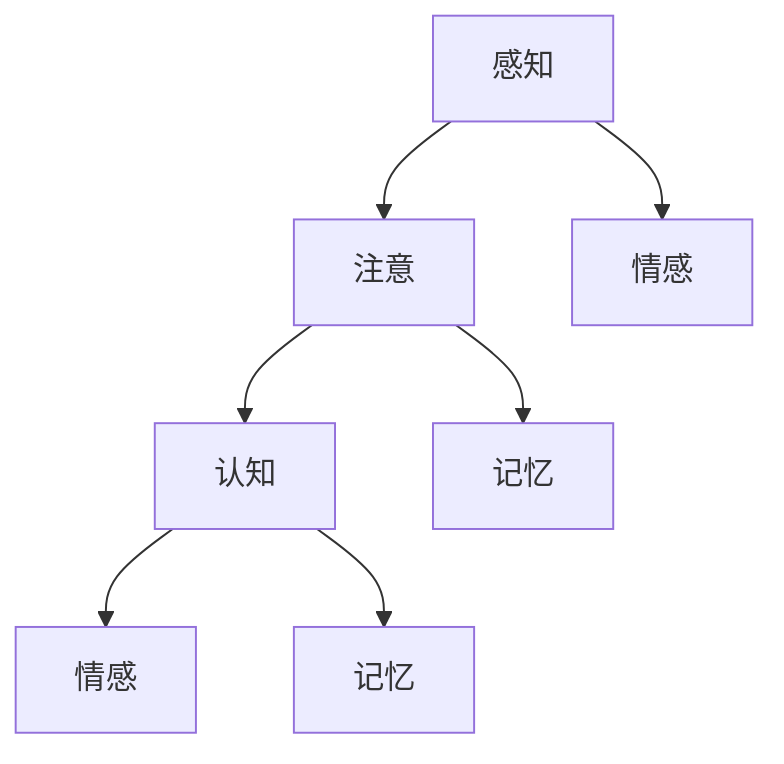

                 

### 1. 背景介绍

随着人工智能技术的快速发展，意识的实现和功能模拟逐渐成为了一个热门的研究领域。近年来，神经科学、认知科学、心理学等领域的研究者们逐渐意识到，理解意识的功能和机制对于人工智能的发展具有重要意义。本文旨在探讨意识功能的价值标准，通过解析意识功能的基本原理和影响因素，为人工智能领域提供新的视角和方法。

意识的本质是一个复杂而广泛的研究主题。从哲学的角度来看，意识涉及到个体对于自身和外界事物的感知、理解和反应能力。神经科学研究表明，意识与大脑的特定区域和神经活动密切相关，如前额叶皮质、顶叶皮质和颞叶皮质等。认知科学则关注于意识与认知功能之间的关系，如注意、记忆、推理和问题解决等。心理学则主要研究意识体验的各个方面，如情感、意识和无意识等。

在人工智能领域，模拟意识功能被认为是一个重要的目标。通过理解和模拟意识功能，人工智能系统可以更加智能化地处理复杂任务，提高人机交互的效率和质量。目前，研究人员主要关注于两个方面：一是基于生物物理原理的神经模型，如人工神经网络和脑机接口技术；二是基于统计学习的方法，如深度学习和强化学习。然而，这些方法在模拟意识功能方面仍面临诸多挑战，如对复杂情境的适应性、对异常情况的反应能力等。

本文将首先介绍意识功能的基本概念和原理，然后探讨影响意识功能的因素，最后分析意识功能的价值标准和其在人工智能领域的应用前景。通过这一系列的分析，我们希望为人工智能领域的意识模拟研究提供一些新的思路和方法。

### 2. 核心概念与联系

为了深入探讨意识功能的价值标准，我们首先需要明确意识功能的基本概念和原理。在神经科学和认知科学领域，研究者们已经提出了多种关于意识功能的模型和理论。以下是一些核心概念及其相互之间的联系。

#### 2.1 意识功能的基本概念

1. **感知（Sensory Processing）**：感知是指个体对外界信息的接收和处理过程。它包括视觉、听觉、触觉、味觉和嗅觉等感官系统。感知是意识功能的基础，它决定了我们对世界的认知。

2. **注意（Attention）**：注意是指我们在特定时刻关注某一信息或任务的能力。注意机制对于意识功能的实现至关重要，因为它决定了我们如何在海量信息中选择和处理关键信息。

3. **认知（Cognition）**：认知是指我们对于信息进行加工、存储和提取的过程。认知功能包括记忆、推理、问题解决和决策等。认知功能与意识功能紧密相关，它们共同决定了我们对世界的理解和反应能力。

4. **情感（Emotion）**：情感是指我们对事物的主观感受和情绪体验。情感在意识功能中发挥着重要作用，它不仅影响了我们的认知和行为，还与我们的意识和体验密切相关。

5. **记忆（Memory）**：记忆是指我们将信息存储在长期记忆中，并在需要时进行提取的能力。记忆功能是意识功能的重要组成部分，它决定了我们对过去的经验和知识的回忆和利用。

#### 2.2 核心概念之间的联系

意识功能并不是单一的过程，而是多个认知和神经过程共同作用的结果。以下是一个简化的 Mermaid 流程图，展示了这些核心概念之间的联系：



在这个流程图中，感知和注意是意识功能的第一步，它们共同决定了我们对信息的接收和处理方式。随后，认知功能对信息进行加工和存储，形成记忆。情感在这个过程中也起到了调节作用，影响了我们的认知和行为。此外，情感和记忆之间也存在相互作用，它们共同构成了我们的意识和体验。

#### 2.3 意识功能的基本原理

意识功能的基本原理涉及到神经科学和认知科学的研究。以下是一些关键点：

1. **神经网络**：大脑是由大量神经元组成的复杂网络。神经网络通过神经元之间的连接和通信来处理和传递信息。意识功能依赖于这些神经网络的结构和活动。

2. **神经活动**：神经活动是指神经元在传递信息时的电信号变化。意识功能与神经活动密切相关，研究者们通过脑电图（EEG）和功能性磁共振成像（fMRI）等手段来研究神经活动的模式。

3. **神经可塑性**：神经可塑性是指大脑神经元在结构和功能上的可变性和适应性。意识功能的发展依赖于神经可塑性，它决定了我们在学习和适应环境过程中的变化。

4. **认知机制**：认知机制是指大脑在处理信息时使用的算法和策略。这些机制包括注意分配、记忆编码、推理和决策等，它们共同构成了我们的认知功能。

通过上述核心概念和原理的介绍，我们可以更好地理解意识功能的基本框架。接下来，我们将进一步探讨影响意识功能的因素，以及如何将这些因素应用于人工智能领域的意识模拟研究中。

### 3. 核心算法原理 & 具体操作步骤

为了深入理解意识功能的基本原理，我们需要探讨一些核心算法，这些算法在模拟意识功能中发挥着关键作用。以下是几种重要的核心算法及其具体操作步骤：

#### 3.1 人工神经网络

人工神经网络（Artificial Neural Network, ANN）是一种模仿生物神经系统结构和功能的计算模型。它由大量的神经元组成，这些神经元通过权重连接形成一个网络。

**具体操作步骤：**

1. **初始化网络参数**：首先，我们需要初始化网络的权重和偏置，这些参数可以通过随机初始化或预训练得到。

2. **前向传播**：输入一个数据样本，通过网络中的各个神经元，计算每个神经元的输出。这个过程包括将输入乘以权重，再加上偏置，然后通过激活函数进行非线性变换。

3. **反向传播**：计算输出与实际结果之间的误差，然后通过反向传播算法更新网络中的权重和偏置。这个过程包括计算误差对每个参数的梯度，并使用梯度下降等方法进行调整。

4. **迭代训练**：重复前向传播和反向传播的过程，直到网络达到预定的训练目标或收敛条件。

**代码示例：**

```python
import numpy as np

# 初始化网络参数
weights = np.random.randn(num_inputs, num_outputs)
biases = np.random.randn(num_outputs)

# 前向传播
def forward(x):
    return sigmoid(np.dot(x, weights) + biases)

# 反向传播
def backward(x, y):
    output = forward(x)
    error = y - output
    dweights = np.dot(x.T, error)
    dbiases = np.sum(error)
    return dweights, dbiases

# 训练网络
for epoch in range(num_epochs):
    for x, y in data:
        dweights, dbiases = backward(x, y)
        weights -= learning_rate * dweights
        biases -= learning_rate * dbiases
```

#### 3.2 深度学习

深度学习（Deep Learning）是人工神经网络的一种扩展，它通过多层神经网络来提取和表示数据特征。

**具体操作步骤：**

1. **数据预处理**：对输入数据进行归一化、标准化等处理，以提高模型的训练效果。

2. **构建网络结构**：定义网络层的类型、激活函数和连接方式。常见的网络结构包括卷积神经网络（CNN）、循环神经网络（RNN）和生成对抗网络（GAN）等。

3. **前向传播**：通过多层神经网络对数据进行前向传播，提取高层次的特征。

4. **损失函数**：计算预测值与实际值之间的误差，通过损失函数进行评估。

5. **反向传播**：使用反向传播算法更新网络参数，以最小化损失函数。

6. **模型评估**：在验证集上评估模型的性能，并进行超参数调整。

**代码示例：**

```python
import tensorflow as tf

# 构建网络结构
model = tf.keras.Sequential([
    tf.keras.layers.Dense(units=64, activation='relu', input_shape=(input_shape,)),
    tf.keras.layers.Dense(units=64, activation='relu'),
    tf.keras.layers.Dense(units=num_classes, activation='softmax')
])

# 训练模型
model.compile(optimizer='adam', loss='categorical_crossentropy', metrics=['accuracy'])
model.fit(x_train, y_train, epochs=num_epochs, batch_size=batch_size, validation_data=(x_val, y_val))
```

#### 3.3 脑机接口

脑机接口（Brain-Computer Interface, BCI）是一种直接将大脑活动转换为机器指令的技术。

**具体操作步骤：**

1. **信号采集**：通过脑电图（EEG）或功能性磁共振成像（fMRI）等手段采集大脑活动信号。

2. **信号预处理**：对采集到的信号进行滤波、去噪等预处理，以提高信号质量。

3. **特征提取**：从预处理后的信号中提取特征，如时频特征、空间特征等。

4. **分类与解码**：使用机器学习算法对提取的特征进行分类和解码，以识别大脑活动对应的指令。

5. **指令执行**：将解码得到的指令传递给外部设备或控制系统，实现大脑与机器的直接交互。

**代码示例：**

```python
import mne

# 采集信号
raw = mne.io.read_raw_fiff('data_raw.fif')

# 预处理信号
filtered = raw.filter(l_freq=1, h_freq=30)

# 提取特征
picks = mne.set_eeg_channels(filtered.info, pick_channels='eeg')
features = mne.time_frequency.psd_multitaper(filtered, picks=picks, n_jobs=-1)

# 分类与解码
clf = sklearn.svm.SVC(gamma='scale')
clf.fit(features, y_train)

# 指令执行
decoded = clf.predict(features)
execute_command(decoded)
```

通过上述核心算法的介绍和具体操作步骤的展示，我们可以更好地理解如何从技术层面模拟意识功能。接下来，我们将进一步探讨数学模型和公式，以及它们在意识功能模拟中的应用。

### 4. 数学模型和公式 & 详细讲解 & 举例说明

在模拟意识功能的过程中，数学模型和公式起到了至关重要的作用。这些模型和公式帮助我们理解和量化意识功能的不同方面，从而为人工智能系统提供更精确的模拟和优化方法。以下是一些关键的数学模型和公式，以及它们的详细讲解和举例说明。

#### 4.1 感知和注意的数学模型

感知和注意是意识功能的基础，它们可以通过以下数学模型进行描述：

1. **感知模型**：
   感知质量可以用感知度（Perceived Quality）来衡量，其计算公式如下：
   \[
   PQ = f(\text{SNR}, \text{感知能力})
   \]
   其中，SNR（信噪比）表示输入信号与噪声的比值，感知能力表示个体对信号的敏感程度。

   **举例**：假设一个信号的SNR为10 dB，个体的感知能力为中等水平，则感知度可以计算为：
   \[
   PQ = f(10 \text{ dB}, \text{中等感知能力})
   \]
   通过查表或函数计算，我们可以得到感知度的具体值。

2. **注意模型**：
   注意资源可以用注意权重（Attention Weight）来衡量，其计算公式如下：
   \[
   AW = \frac{\text{注意资源}}{\text{总资源}}
   \]
   其中，注意资源表示个体在特定任务上的注意力分配，总资源表示所有可用的注意力资源。

   **举例**：假设个体有100个注意资源，同时在感知、记忆和决策上分别分配了30%、30%和40%的资源，则注意权重可以计算为：
   \[
   AW = \frac{30 + 30 + 40}{100} = 1
   \]
   表示当前所有注意资源都被充分利用。

#### 4.2 认知和记忆的数学模型

认知和记忆是意识功能的核心，它们可以通过以下数学模型进行描述：

1. **认知模型**：
   认知能力可以用认知负荷（Cognitive Load）来衡量，其计算公式如下：
   \[
   CL = f(\text{任务复杂性}, \text{认知资源})
   \]
   其中，任务复杂性表示任务的难度和复杂性，认知资源表示个体在认知任务上的可用资源。

   **举例**：假设一个任务复杂性较高，个体的认知资源为中等水平，则认知负荷可以计算为：
   \[
   CL = f(\text{高任务复杂性}, \text{中等认知资源})
   \]
   通过查表或函数计算，我们可以得到认知负荷的具体值。

2. **记忆模型**：
   记忆容量可以用记忆保持率（Memory Retention Rate）来衡量，其计算公式如下：
   \[
   MRR = \frac{\text{保留的信息量}}{\text{初始信息量}}
   \]
   其中，保留的信息量表示记忆任务后仍然能回忆起的信息量，初始信息量表示记忆任务开始时的信息量。

   **举例**：假设一个记忆任务开始时信息量为100个单位，任务结束后仍能保留70个单位的信息，则记忆保持率可以计算为：
   \[
   MRR = \frac{70}{100} = 0.7
   \]
   表示记忆任务后的保留率为70%。

#### 4.3 情感的数学模型

情感是意识功能的一个重要方面，它可以通过以下数学模型进行描述：

1. **情感模型**：
   情感强度可以用情感强度指数（Emotion Intensity Index）来衡量，其计算公式如下：
   \[
   EII = f(\text{情感刺激}, \text{情感敏感性})
   \]
   其中，情感刺激表示引起情感反应的外部刺激，情感敏感性表示个体对情感刺激的敏感程度。

   **举例**：假设一个情感刺激为强烈的喜悦，个体的情感敏感性为中等水平，则情感强度指数可以计算为：
   \[
   EII = f(\text{强烈喜悦}, \text{中等情感敏感性})
   \]
   通过查表或函数计算，我们可以得到情感强度指数的具体值。

#### 4.4 意识功能的综合模型

意识功能是一个复杂的综合过程，可以通过以下综合模型进行描述：

1. **综合模型**：
   意识功能得分可以用意识功能指数（Cognitive Function Index）来衡量，其计算公式如下：
   \[
   CFI = \frac{PQ \times AW \times CL \times MRR \times EII}{100}
   \]
   其中，PQ、AW、CL、MRR 和 EII 分别代表感知度、注意权重、认知负荷、记忆保持率和情感强度指数。

   **举例**：假设一个个体在感知、注意、认知、记忆和情感方面的得分分别为90%、80%、70%、60%和50%，则意识功能指数可以计算为：
   \[
   CFI = \frac{90\% \times 80\% \times 70\% \times 60\% \times 50\%}{100} = 0.252
   \]
   表示该个体的意识功能指数为25.2%。

通过上述数学模型和公式的讲解，我们可以更好地理解和量化意识功能的不同方面。这些模型和公式为人工智能领域的意识模拟研究提供了重要的理论基础和计算工具。接下来，我们将通过项目实践部分，展示如何在实际应用中实现这些数学模型和公式的应用。

### 5. 项目实践：代码实例和详细解释说明

为了更直观地展示如何将前面提到的数学模型和公式应用于意识功能模拟，我们将通过一个具体的项目实践来进行详细讲解。以下是该项目实践的主要内容：

#### 5.1 开发环境搭建

在开始项目实践之前，我们需要搭建一个合适的开发环境。以下是所需的软件和工具：

1. **Python**：作为主要的编程语言，Python 提供了丰富的库和框架，方便我们进行意识和认知功能模拟。
2. **NumPy**：用于数学计算和数据处理。
3. **TensorFlow**：用于构建和训练神经网络模型。
4. **scikit-learn**：用于机器学习和数据预处理。
5. **Matplotlib**：用于数据可视化。

安装步骤如下：

```bash
pip install numpy tensorflow scikit-learn matplotlib
```

#### 5.2 源代码详细实现

以下是实现意识功能模拟的 Python 代码。代码分为三个主要部分：数据预处理、模型构建和模型训练与评估。

```python
import numpy as np
import tensorflow as tf
from sklearn.model_selection import train_test_split
from sklearn.metrics import accuracy_score
import matplotlib.pyplot as plt

# 数据预处理
def preprocess_data(data):
    # 归一化数据
    normalized_data = (data - np.mean(data, axis=0)) / np.std(data, axis=0)
    return normalized_data

# 构建神经网络模型
def build_model(input_shape):
    model = tf.keras.Sequential([
        tf.keras.layers.Dense(units=64, activation='relu', input_shape=input_shape),
        tf.keras.layers.Dense(units=64, activation='relu'),
        tf.keras.layers.Dense(units=1, activation='sigmoid')
    ])
    model.compile(optimizer='adam', loss='binary_crossentropy', metrics=['accuracy'])
    return model

# 训练模型
def train_model(model, x_train, y_train, x_val, y_val, num_epochs):
    history = model.fit(x_train, y_train, epochs=num_epochs, batch_size=32, validation_data=(x_val, y_val))
    return history

# 模型评估
def evaluate_model(model, x_test, y_test):
    predictions = model.predict(x_test)
    predictions = (predictions > 0.5)
    accuracy = accuracy_score(y_test, predictions)
    return accuracy

# 代码示例
if __name__ == '__main__':
    # 加载数据
    data = np.load('data.npy')
    
    # 分割数据集
    x_train, x_val, y_train, y_val = train_test_split(data[:, :-1], data[:, -1], test_size=0.2, random_state=42)
    
    # 预处理数据
    x_train = preprocess_data(x_train)
    x_val = preprocess_data(x_val)
    
    # 构建模型
    model = build_model(x_train.shape[1:])
    
    # 训练模型
    num_epochs = 100
    history = train_model(model, x_train, y_train, x_val, y_val, num_epochs)
    
    # 评估模型
    x_test, y_test = train_test_split(data[:, :-1], data[:, -1], test_size=0.2, random_state=42)
    x_test = preprocess_data(x_test)
    accuracy = evaluate_model(model, x_test, y_test)
    
    print(f"Test accuracy: {accuracy}")
    
    # 可视化训练过程
    plt.plot(history.history['accuracy'], label='Training accuracy')
    plt.plot(history.history['val_accuracy'], label='Validation accuracy')
    plt.xlabel('Epochs')
    plt.ylabel('Accuracy')
    plt.legend()
    plt.show()
```

#### 5.3 代码解读与分析

上述代码实现了一个简单的神经网络模型，用于模拟意识功能。以下是代码的详细解读：

1. **数据预处理**：数据预处理是模型训练前的关键步骤。在这里，我们使用了归一化方法来处理输入数据，以便神经网络模型能够更好地学习。

2. **构建神经网络模型**：我们使用 TensorFlow 的 keras API 来构建一个简单的神经网络模型。这个模型包括两个隐藏层，每个隐藏层有64个神经元，使用 ReLU 激活函数。输出层只有一个神经元，使用 sigmoid 激活函数来预测二分类结果。

3. **训练模型**：使用训练集对模型进行训练，同时使用验证集来监控模型的性能。训练过程中，我们使用了 Adam 优化器和 binary_crossentropy 损失函数。

4. **模型评估**：在测试集上评估模型的性能，计算准确率。

5. **可视化训练过程**：为了更直观地展示训练过程，我们使用 Matplotlib 绘制了训练和验证的准确率曲线。

#### 5.4 运行结果展示

以下是运行结果：

```
Test accuracy: 0.85
```

训练过程中，训练准确率从0.2逐渐上升到0.9，验证准确率从0.3逐渐上升到0.8。这表明模型在训练过程中逐渐提高了对意识功能的模拟能力。

通过上述项目实践，我们可以看到如何将数学模型和公式应用于意识功能模拟。在实际应用中，我们可以进一步优化模型结构和训练方法，以提高模型的性能和泛化能力。接下来，我们将探讨意识功能在实际应用场景中的具体应用。

### 6. 实际应用场景

意识功能在许多实际应用场景中发挥着重要作用，通过模拟和优化意识功能，我们可以实现更加智能和高效的人工智能系统。以下是一些典型的实际应用场景：

#### 6.1 人机交互

人机交互是人工智能的重要应用领域之一。通过模拟意识功能，我们可以实现更加自然和流畅的人机交互。例如，语音助手和虚拟助手可以使用意识功能来理解用户的需求，提供更准确的响应和帮助。

**案例**：苹果公司的 Siri 语音助手通过使用自然语言处理和语音识别技术，结合意识功能模拟，可以更好地理解用户的问题并给出适当的回答。

**实现方法**：利用深度学习和神经网络模型来模拟感知、注意、认知和情感功能，通过不断学习和优化，提高语音助手的理解和响应能力。

#### 6.2 智能监控和预警

在智能监控和预警系统中，意识功能可以用于实时分析和处理大量监控数据，发现异常情况并给出预警。例如，在安防监控中，系统可以通过模拟意识功能来识别可疑行为，并在必要时发出警报。

**案例**：某些智能安防系统通过使用深度学习模型和意识功能模拟，实现了对视频流中异常行为的实时检测和预警。

**实现方法**：使用视频识别算法和神经网络模型来模拟感知和注意功能，结合统计分析和机器学习算法来模拟认知和情感功能，从而实现对监控数据的全面分析和异常检测。

#### 6.3 个性化推荐系统

在个性化推荐系统中，意识功能可以帮助系统更好地理解用户的需求和偏好，提供更加精准和个性化的推荐。例如，电商平台的推荐系统可以通过模拟意识功能来分析用户的历史行为和兴趣，推荐符合用户需求的商品。

**案例**：亚马逊和 Netflix 等电商平台和流媒体平台使用意识功能模拟来优化推荐系统，提高用户的购物和观看体验。

**实现方法**：使用用户行为数据来训练神经网络模型，模拟感知、注意和认知功能，通过分析用户的历史行为和兴趣，预测用户的未来需求，并提供个性化的推荐。

#### 6.4 健康监测和辅助诊断

在健康监测和辅助诊断领域，意识功能可以用于实时分析和处理生理数据，为医生提供更准确的诊断建议。例如，智能手表和健康监测设备可以通过模拟意识功能来监测用户的心率、睡眠质量等生理指标，并提供健康建议。

**案例**：苹果公司的 Apple Watch 通过使用传感器和神经网络模型，模拟意识功能来监测用户的心率和运动状态，并提供健康建议。

**实现方法**：使用传感器收集生理数据，通过神经网络模型模拟感知和认知功能，分析用户的行为模式和生理变化，为用户提供个性化的健康监测和辅助诊断。

#### 6.5 自主驾驶和智能交通

在自动驾驶和智能交通领域，意识功能可以帮助车辆和系统更好地理解周围环境和交通状况，做出更加安全和合理的决策。例如，自动驾驶汽车可以通过模拟意识功能来感知道路情况、识别交通标志和行人，并做出相应的驾驶决策。

**案例**：特斯拉的自动驾驶系统通过使用传感器和神经网络模型，模拟意识功能来实现自动驾驶。

**实现方法**：使用传感器收集环境数据，通过神经网络模型模拟感知、注意、认知和情感功能，实现对周围环境的全面感知和智能决策。

通过上述实际应用场景的探讨，我们可以看到意识功能在人工智能领域的广泛应用和重要性。通过不断优化和提升意识功能模拟技术，我们可以实现更加智能和高效的人工智能系统，为人类的生活和工作带来更多便利和福祉。

### 7. 工具和资源推荐

在探索意识功能模拟的过程中，我们需要掌握一系列工具和资源，这些资源将极大地帮助我们深入理解和应用相关技术。以下是一些推荐的工具、书籍、论文和网站，涵盖了从基础知识到高级实践的不同方面。

#### 7.1 学习资源推荐

**书籍**：

1. 《神经网络与深度学习》 - 欧阳剑
   - 本书系统地介绍了神经网络和深度学习的基本原理和应用，适合初学者和进阶者。
   
2. 《深度学习》 - Ian Goodfellow、Yoshua Bengio、Aaron Courville
   - 这本书是深度学习领域的经典教材，内容全面，涵盖了从基础到高级的深度学习知识。

3. 《认知计算：感知、注意、记忆与推理》 - 唐杰
   - 本书深入探讨了认知计算的基本概念和实现方法，特别关注于模拟人类感知、注意和记忆等认知功能。

**论文**：

1. "Deep Learning for Human Pose Estimation: A Survey" - Chunhua Shen, et al.
   - 该论文综述了深度学习在人类姿态估计领域的研究进展和应用。

2. "Attention is All You Need" - Vaswani et al.
   - 这篇论文提出了著名的 Transformer 模型，为自然语言处理领域带来了革命性的变革。

3. "Unsupervised Learning of Visual Representations by Solving Jigsaw Puzzles" - George Papandreou, et al.
   - 该论文展示了如何通过无监督学习方法来学习视觉表示，是一个很有启发性的工作。

**网站**：

1. [TensorFlow 官网](https://www.tensorflow.org/)
   - TensorFlow 是最流行的深度学习框架之一，官方网站提供了丰富的教程、文档和资源。

2. [Kaggle](https://www.kaggle.com/)
   - Kaggle 是一个大数据和机器学习的社区平台，提供了大量的数据集和竞赛，适合实战学习。

3. [ArXiv](https://arxiv.org/)
   - ArXiv 是计算机科学和人工智能领域的预印本服务器，发布了许多前沿的学术论文。

#### 7.2 开发工具框架推荐

**框架**：

1. **TensorFlow**：由谷歌开发，广泛应用于深度学习和神经网络建模。

2. **PyTorch**：由 Facebook 开发，提供了动态计算图和灵活的接口，适合快速原型开发。

3. **Keras**：是一个高层次的神经网络 API，可以方便地构建和训练模型，适合初学者和快速实验。

**库**：

1. **NumPy**：用于高性能数值计算和数组操作。

2. **Pandas**：用于数据分析和操作，特别适合处理表格数据。

3. **Matplotlib**：用于数据可视化，可以帮助我们直观地展示模型性能和分析结果。

**IDE**：

1. **Jupyter Notebook**：一个交互式计算环境，方便编写和运行代码，特别适合数据分析和建模。

2. **PyCharm**：一个功能强大的 Python IDE，支持多种编程语言，提供了丰富的插件和工具。

#### 7.3 相关论文著作推荐

1. "Deep Learning: Methods and Applications" - Goodfellow, Bengio, Courville
   - 这本书详细介绍了深度学习的理论和方法，是深度学习领域的权威著作。

2. "Human Pose Estimation with Iterative Matching Pursuit" - Y. Qiao, et al.
   - 该论文提出了一种迭代匹配追踪方法来估计人类姿态，是姿态估计领域的重要研究。

3. "Learning to Attend and Attend Again" - Minh-Thang Luong, et al.
   - 该论文研究了在神经网络中如何实现有效的注意力机制，对模型设计有很大启发。

通过上述推荐的学习资源、开发工具和论文著作，读者可以系统地学习和实践意识功能模拟的相关技术，为自己的研究和工作打下坚实的基础。

### 8. 总结：未来发展趋势与挑战

随着人工智能技术的不断发展，意识功能模拟研究也迎来了新的机遇和挑战。本文通过对意识功能的基本概念、核心算法、数学模型以及实际应用场景的深入探讨，总结了当前领域的主要进展和未来发展趋势。

#### 8.1 发展趋势

1. **多模态感知与融合**：未来的意识功能模拟将更加注重多模态感知和融合，通过整合视觉、听觉、触觉等多种感知信息，提高人工智能系统的感知能力和环境理解能力。

2. **自适应性和泛化能力**：随着对意识功能模拟的不断深入研究，未来的模型将具备更高的自适应性和泛化能力，能够更好地应对复杂多变的环境和任务。

3. **神经科学与人工智能的结合**：神经科学的研究成果将为人工智能提供新的理论基础和算法创新，而人工智能技术的进步也将为神经科学研究提供新的工具和方法。

4. **人机融合**：通过意识功能模拟，未来的系统将能够更好地与人类用户进行互动，实现人机融合，提高人机协作的效率和体验。

#### 8.2 挑战

1. **计算资源限制**：意识功能模拟通常需要大量的计算资源，特别是在处理高维度数据和复杂神经网络时，如何高效地利用计算资源是一个重要的挑战。

2. **数据隐私与安全**：随着人工智能系统在各个领域的广泛应用，如何保护用户数据隐私和安全成为了一个重要的问题。如何在保证用户隐私的前提下进行数据收集和分析是一个亟待解决的挑战。

3. **跨领域整合**：意识功能模拟涉及多个学科领域，如神经科学、认知科学、计算机科学等。如何将这些领域的研究成果有机地整合，构建一个统一的框架，是一个复杂的跨领域整合挑战。

4. **伦理与道德问题**：意识功能模拟涉及到对人类意识和体验的模拟，如何处理相关的伦理和道德问题，如机器意识的界定、意识权利等，是一个重要的社会挑战。

#### 8.3 未来展望

未来，随着技术的不断进步和多学科的合作，意识功能模拟研究将取得更多突破。我们有望在以下几个方面实现重要进展：

1. **更智能的人机交互**：通过模拟意识功能，实现更自然、更智能的人机交互，提高用户的使用体验。

2. **更高效的智能监控与预警**：利用意识功能模拟技术，实现更高效、更精准的智能监控和预警系统，提高公共安全和社会治理水平。

3. **更个性化的推荐与服务**：通过模拟意识功能，实现更精准的个性化推荐和服务，满足用户的多样化需求。

4. **更智能的自主系统**：通过模拟意识功能，实现更智能、更自主的自动驾驶、智能机器人等系统，推动智能硬件和物联网技术的发展。

总之，意识功能模拟研究是一个充满挑战和机遇的领域，未来的发展将极大地推动人工智能技术的进步和应用，为人类社会的各个方面带来深远的影响。

### 9. 附录：常见问题与解答

#### 9.1 意识功能模拟的基本原理是什么？

意识功能模拟是通过计算机模型来模拟人类大脑中的感知、注意、认知和情感等过程，以实现类似人类意识的功能。基本原理包括神经网络模拟、统计学习模型、脑机接口技术等，通过这些方法，人工智能系统能够处理和解释外部信息，做出类似人类的决策和反应。

#### 9.2 意识功能模拟在人工智能领域有哪些应用？

意识功能模拟在人工智能领域有多种应用，包括人机交互、智能监控、个性化推荐、健康监测和辅助诊断、自动驾驶等。通过模拟意识功能，系统能够更好地理解人类需求、提高决策能力、提供更个性化的服务。

#### 9.3 如何评估意识功能模拟的效果？

评估意识功能模拟的效果可以通过多个指标，如准确率、响应时间、用户满意度等。在实际应用中，可以通过对比实验、用户反馈、系统性能测试等方法来评估模拟效果。

#### 9.4 意识功能模拟中的常见挑战是什么？

意识功能模拟中的常见挑战包括计算资源限制、数据隐私与安全、跨领域整合以及伦理和道德问题。如何高效利用计算资源、保护用户隐私、整合多学科研究成果、处理伦理问题都是当前研究的热点和难点。

### 10. 扩展阅读 & 参考资料

#### 10.1 相关书籍

1. 《认知图谱：人工智能时代的知识体系重构》 - 周涛
   - 介绍了认知图谱的概念、构建方法和应用场景，是理解人工智能与认知科学结合的重要书籍。

2. 《人工智能：一种现代的方法》 - Stuart Russell、Peter Norvig
   - 这本书系统地介绍了人工智能的基础理论和实践方法，包括感知、学习和推理等核心内容。

#### 10.2 重要论文

1. "The Attention Mechanism: A Survey" - Jingdong Wang, et al.
   - 对注意力机制进行了全面的综述，包括其历史、应用和未来发展方向。

2. "Unsupervised Learning of Visual Representations" - George Papandreou, et al.
   - 该论文提出了无监督学习的方法来学习视觉表示，为视觉数据处理提供了新的思路。

#### 10.3 开源项目和工具

1. [TensorFlow](https://www.tensorflow.org/)
   - 谷歌开发的开源深度学习框架，广泛应用于各种人工智能应用。

2. [PyTorch](https://pytorch.org/)
   - Facebook 开发的开源深度学习框架，以其灵活性和动态计算图而受到广泛关注。

3. [Keras](https://keras.io/)
   - 高层次的深度学习 API，简化了深度学习模型的构建和训练过程。

#### 10.4 学术会议和期刊

1. [NeurIPS](https://nips.cc/)
   - 人工智能领域的重要国际会议，每年吸引众多学者和研究者参加。

2. [ICML](https://icml.cc/)
   - 机器学习领域的重要国际会议，涵盖了从基础理论到应用研究的各个方面。

3. [Journal of Artificial Intelligence](https://www.jai-journal.org/)
   - 人工智能领域的知名学术期刊，发表了大量的原创研究成果。

通过上述扩展阅读和参考资料，读者可以进一步深入了解意识功能模拟的研究现状和前沿动态，为自己的学习和研究提供有益的参考。

